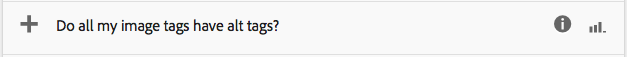

# Paginaprestaties analyseren{#analyzing-page-performance}

Open de pagina [Inzicht van inhoud](/help/sites-authoring/content-insights.md) om de prestaties van de pagina te analyseren die u ontwerpt. Configureer de rapportageperiode om uw analyse te concentreren.

## Analyses en Recommendations openen voor een pagina {#opening-analytics-and-recommendations-for-a-page}

Gebruik de volgende procedure om de Analytics en Recommendations voor een pagina te zien:

1. Navigeer naar de pagina die u wilt analyseren.
1. Klik of tik op **Analytics en Recommendations** op de werkbalk.

   >[!NOTE]
   >
   >Analyses en Recommendations voor een pagina worden alleen weergegeven als u AEM hebt geconfigureerd voor [integratie met Adobe Analytics](/help/sites-administering/adobeanalytics-connect.md).

   

### Wijziging van de rapportageperiode {#changing-the-reporting-period}

Wijzig de volgende tijdgerelateerde aspecten van de analyserapporten:

* De periode waarin verslag moet worden uitgebracht.
* De granulariteit van de gegevens.

De gereedschappen voor het wijzigen van de aan de tijd gerelateerde aspecten van de rapporten staan boven aan de pagina Inzicht in inhoud. 

#### Wijziging van de rapportageperiode {#changing-the-reporting-period-1}

Wijzig de rapportageperiode van de pagina Inhoudscontrole om uw analyse van de pagina-activiteit toe te spitsen op een specifieke periode. Wanneer u de rapportageperiode wijzigt, worden de rapporten automatisch vernieuwd. Het schaduwgebied op het tijdframe vertegenwoordigt de rapportageperiode. De datums in de tijdlijn nemen toe van links naar rechts.

Om de rapportageperiode van een pagina Inhoudscontrole te wijzigen:

1. Als de tijdlijn niet boven aan de pagina wordt weergegeven, klikt of tikt u op het pictogram Tijdlijn in-/uitschakelen.

   

1. Als u de begindatum van de rapportageperiode wilt wijzigen, sleept u de cirkel die links van het schaduwgebied wordt weergegeven naar de gewenste begindatum.

   Als u de linkerzijde van het gearceerde gebied niet ziet, gebruikt u de schuifbalk om dit zichtbaar te maken.

1. Als u de einddatum van de rapportageperiode wilt wijzigen, sleept u de cirkel die rechts van het schaduwgebied wordt weergegeven naar de gewenste einddatum.

#### De rangorde van de rapportageperiode wijzigen {#changing-the-granularity-of-the-reporting-period}

Verander de hoeveelheid tijd dat elk gegevenspunt in een rapport overspant. Wanneer u bijvoorbeeld de granulariteit voor week selecteert, geeft elk gegevenspunt in het weergavenrapport het aantal weergaven voor een week aan.

De granulariteit beïnvloedt de rapporten die gegevens tegen tijd, zoals de Meningen en de Pagina Gemiddelde Bewerkte Minerapporten plotten. Korreligheid is ook van invloed op de schaal van de tijdlijn.

1. Als het besturingselement voor granulariteit niet wordt weergegeven, klikt of tikt u op het pictogram Korreligheid in-/uitschakelen.

   

1. Klik of tik op de gewenste granulariteit. Zodra geselecteerd, werkt het rapport automatisch bij om op granulariteit te wijzen.

### Taken toewijzen voor SEO Recommendations {#assigning-tasks-for-seo-recommendations}

Gebruik het SEO Recommendations-rapport om taken te maken waarmee u de zichtbaarheid van pagina&#39;s voor zoekprogramma&#39;s kunt verbeteren. Voor elke aanbeveling in het rapport die geen controleteken heeft, kunt u een taak tot stand brengen die u aan een gebruiker toewijst om het vereiste werk uit te voeren.

De status van de SEO-aanbeveling geeft aan wanneer de taak is gemaakt maar nog niet is voltooid.

Wanneer deze taak is gemaakt, wordt deze weergegeven in de lijst Taken van de gebruiker. Voor informatie over taken, zie [Werken met Taken](/help/sites-authoring/task-content.md).

Gebruik de volgende procedure om een taak voor een aanbeveling te creëren SEO.

1. Klik of tik het informatiepictogram voor de aanbeveling SEO.

   

1. Klik op het omcirkelde driehoekje naast het informatiepictogram.

   

1. Vul de formuliervelden die worden weergegeven en tik op Maken:

   * Project: Selecteer het project waarin u de taak wilt maken.
   * Naam: De naam die de taak identificeert. De standaardnaam is de titel van de SEO aanbeveling.
   * Toewijzen aan: Selecteer de gebruiker aan wie de taak wordt toegewezen. Typ de naam van de gebruiker om de lijst te filteren.
   * Omschrijving: Een beschrijving van de activiteit die wordt vereist om de taak te voltooien. De standaardbeschrijving is de informatie die bij de SEO-aanbeveling is gevoegd.
   * Taakprioriteit: De prioriteit van de taak.
   * Vervaldatum: De datum waarop de taak moet zijn voltooid.

   **Opmerking:** De taak die wordt gemaakt, bevat ook het pad naar de pagina waarop de SEO-aanbeveling van toepassing is.

1. Klik op Gereed of tik op Gereed om het bericht Taak gemaakt te sluiten.

