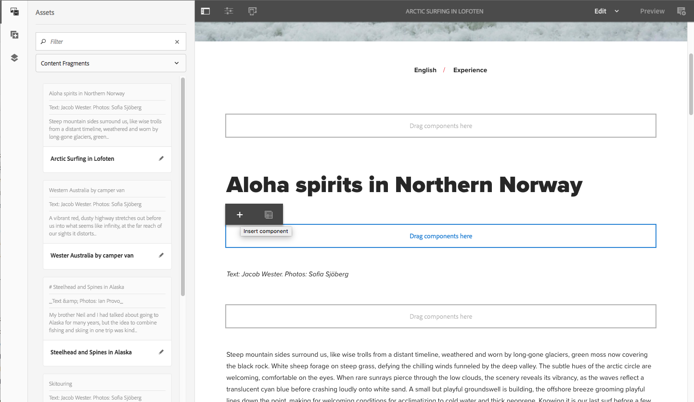

# Pagina&#39;s ontwerpen met inhoudsfragmenten{#page-authoring-with-content-fragments}

Inhoudsfragmenten van Adobe Experience Manager (AEM) worden [gemaakt en beheerd als paginaonafhankelijke assets](/help/assets/content-fragments/content-fragments.md).

U kunt hiermee kanaalneutrale inhoud maken, samen met (mogelijk kanaalspecifieke) variaties. Vervolgens kunt u deze fragmenten en de variaties ervan gebruiken bij het ontwerpen van de inhoudspagina&#39;s.

Samen met de bijgewerkte JSON-exportfunctie kunnen gestructureerde inhoudsfragmenten ook worden gebruikt om AEM inhoud via Content Services te leveren aan andere kanalen dan AEM pagina&#39;s.

>[!NOTE]
>
>**Inhoudsfragmenten** en **[Ervaar fragmenten](/help/sites-authoring/experience-fragments.md)** Er zijn verschillende functies binnen AEM:
>
>* **Inhoudsfragmenten** Dit zijn redactionele inhoud, voornamelijk tekst, en verwante afbeeldingen. Het zijn pure inhoud, zonder ontwerp en lay-out.
>* **Ervaar fragmenten** volledig opgemaakt zijn, een fragment van een webpagina.
>
>De Fragmenten van de ervaring kunnen inhoud in de vorm van Inhoudsfragmenten bevatten, maar niet andersom.

>[!CAUTION]
>
>Deze pagina moet worden gelezen met [Werken met inhoudsfragmenten](/help/assets/content-fragments/content-fragments.md) (en verwante pagina&#39;s) omdat hierin basisterminologie en -concepten worden geïntroduceerd en fragmenten worden gemaakt en beheerd.

Met de inhoudsfragmenten kunt u:

* **Marketings- en Campagne-strategie**

   * Inhoud controleren via centraal beheerde inhoudsfragmenten.

* **Creative Pro**

   * Het bijhouden van creatieve elementen via verzamelingen die zijn gekoppeld aan inhoudsfragmenten.

* **Schrijvers kopiëren**

   * Schrijf in de fragmenteditor voor AEM inhoud.
   * Kan inhoudvariaties maken.
   * Kan relevante inhoud aan het inhoudsfragment koppelen.
   * Kan versioning/workflow gebruiken.
   * Kan inhoudsfragment delen.
   * Kan vertalingen centraal beheren.

* **Producenten en reismanagers**

   * Maak een keuze uit vooraf gedefinieerde fragmenten en variaties bij het ontwerpen in AEM.
   * Kan erop vertrouwen dat het fragment en de bijbehorende inhoud altijd up-to-date zijn terwijl kopieerschrijvers en -creatieven hun updates in centraal beheerde fragmenten en elementen maken.
   * Kan voor relevantie vertrouwen op gekoppelde media-inhoud die wordt verwerkt.
   * U kunt ad-hocinhoudvariaties maken terwijl u er toch voor zorgt dat deze variaties centraal worden beheerd in het fragment.

## Een inhoudsfragment toevoegen aan uw pagina {#adding-a-content-fragment-to-your-page}

1. Open de pagina om deze te bewerken.

1. Voeg de **Inhoudsfragment** component; van of **Componenten** browser of **Nieuwe component invoegen**.

1. U kunt:

   * Open de **Activa** browser en filter voor **Inhoudsfragmenten** (de standaardwaarde is Afbeeldingen). Sleep het gewenste fragment vervolgens naar de componentinstantie.

   * Selecteer vervolgens de component voor het inhoudsfragment **Configureren** op de werkbalk. In het dialoogvenster kunt u het dialoogvenster Selecteren openen waarin u de vereiste opties kunt selecteren **Inhoudsfragment**.

   >[!NOTE]
   >
   >Een andere methode is om een specifiek inhoudsfragment rechtstreeks naar de pagina te slepen. Hiermee wordt automatisch de bijbehorende component (inhoudsfragment) gemaakt.

1. De inhoud van de **Hoofd** Element en **Master** (variatie) wordt getoond. U kunt [andere elementen en/of variaties selecteren](#selecting-the-element-or-variation) zoals vereist.

   

   >[!NOTE]
   >
   >Raadpleeg de volgende secties voor meer informatie over de verdere bewerkingsfunctionaliteit:
   >
   >
   >
   >    * [Responsieve lay-out](/help/sites-authoring/responsive-layout.md)
   >    * [Paginacontent bewerken](/help/sites-authoring/editing-content.md)
   >
   >

### Het element of de variatie selecteren {#selecting-the-element-or-variation}

De fragmentinstellingen openen **Configuratie** zodat u het fragment kunt configureren voor gebruik op de huidige pagina. Het dialoogvenster kan afhankelijk zijn van de gebruikte component.

In het aangewezen de dialoogvakje van de Configuratie, kunt u de beschikbare parameters selecteren, die omvatten:

* **Inhoudsfragment**

  Geef op welk fragment moet worden gebruikt.

* **Weergavemodus**:

   * **Element voor één tekst**

   * **Meerdere elementen**

* **Element**

   * De standaardwaarde **Hoofd** is altijd beschikbaar.
   * Er is een selectie beschikbaar als het fragment met een geschikte sjabloon is gemaakt.

  >[!NOTE]
  >
  >De beschikbare elementen zijn afhankelijk van de gebruikte sjabloon.

* **Variatie**

   * De standaardwaarde **Master** is altijd beschikbaar.
   * Er is een selectie beschikbaar als er variaties zijn gemaakt voor het fragment.

* **Alinea&#39;s**: geef het bereik op van de alinea&#39;s die u wilt opnemen:

   * **Alles**
   * **Bereik**: bijvoorbeeld `1`, `3-5`, `9-*`

      * **Koppen als eigen alinea&#39;s verwerken**

* **Koppen als eigen alinea&#39;s verwerken**

### Snelle verbinding met de fragmenteditor {#quick-connection-to-fragment-editor}

U kunt de fragmentbron openen voor bewerking (het element) met de opdracht **Bewerken** op de werkbalk van de component. Hiermee kunt u [het inhoudsfragment bewerken en beheren](/help/assets/content-fragments/content-fragments.md).

>[!CAUTION]
>
>Zoals altijd kan het bewerken van de fragmentbron gevolgen hebben voor alle pagina&#39;s die naar dat inhoudsfragment verwijzen.

### Tussenliggende inhoud toevoegen {#adding-in-between-content}

Wanneer een specifiek inhoudsfragment aan de pagina wordt toegevoegd, is er een **Componenten hierheen slepen** tijdelijke aanduiding tussen elke HTML-alinea (en boven/onder) van het fragment.

Hiermee kunt u extra inhoud toevoegen [tussenliggend (dat wil zeggen, tussen inhoud)](/help/assets/content-fragments/content-fragments.md#in-between-content-when-page-authoring-with-content-fragments) de fragmentinhoud (op een van de beschikbare punten), zonder dat u het basisfragment hoeft te wijzigen.

Voor tussenliggende inhoud kunt u:

* Componenten toevoegen uit het dialoogvenster [Browser voor componenten](/help/sites-authoring/author-environment-tools.md#components-browser).
* Elementen toevoegen uit het dialoogvenster [Bandenbrowser](/help/sites-authoring/author-environment-tools.md#assets-browser).
* Gebruiken [Gekoppelde inhoud](#using-associated-content) als bron voor tussenliggende inhoud.

>[!CAUTION]
>
>De tussenliggende inhoud is pagina-inhoud. Deze wordt niet opgeslagen in het inhoudsfragment.

>[!NOTE]
>
>U kunt [visuele elementen (afbeeldingen) invoegen in het fragment zelf](/help/assets/content-fragments/content-fragments-variations.md#inserting-assets-into-your-fragment).
>
>Visuele elementen die in het fragment zelf worden ingevoegd, worden aan de voorafgaande alinea in het fragment gekoppeld. Dit betekent dat u geen tussenliggende inhoud tussen een visueel element en de voorgaande alinea kunt plaatsen.

>[!CAUTION]
>
>Nadat u tussenliggende inhoud aan een inhoudsfragment op uw pagina hebt toegevoegd, kan het wijzigen van de structuur van het onderliggende inhoudsfragment (dat wil zeggen in de inhoudfragmenteditor) leiden tot onjuiste/onverwachte resultaten.
>
>Wanneer dit gebeurt, wordt de tussenliggende inhoud als volgt bewaard:
>
>* Tussen componenten heeft een absolute positie binnen de reeks componenten in de fragmentstroom. Deze positie verandert niet, zelfs niet wanneer de inhoud van alinea&#39;s in het fragment verandert.
>
>  Hierdoor kan het lijken alsof de relatieve positionering is gewijzigd, aangezien de tussenliggende alinea&#39;s geen contextafhankelijke relatie hebben met de (fragment)alinea&#39;s naast de alinea&#39;s.
>* Tenzij de twee alinea&#39;s met elkaar in strijd zijn, wordt in dat geval de tussenliggende inhoud niet weergegeven (hoewel deze intern nog steeds aanwezig is).
>

### Gekoppelde inhoud gebruiken {#using-associated-content}

Als u [gekoppelde inhoud](/help/assets/content-fragments/content-fragments-assoc-content.md) met de [inhoudsfragment](/help/assets/content-fragments/content-fragments.md)Deze elementen zijn beschikbaar in het zijpaneel (nadat u het fragment op de inhoudspagina hebt geplaatst). Gekoppelde content is in feite een speciale bron van content voor [tussenliggende content](#adding-in-between-content).

>[!NOTE]
>
>Er zijn verschillende methoden om toe te voegen [visuele elementen (bijvoorbeeld afbeeldingen)](/help/assets/content-fragments/content-fragments.md#fragments-with-visual-assets) op het fragment en/of de pagina.

>[!NOTE]
>
>Als u meerdere inhoudsfragmenten op één pagina hebt, kunt u **Gekoppelde inhoud** bevat de elementen die geschikt zijn voor alle fragmenten.

Nadat u een fragment met de bijbehorende inhoud aan de pagina hebt toegevoegd, wordt een nieuw tabblad toegevoegd (**Gekoppelde inhoud**) wordt geopend in het zijpaneel.

Van hieruit kunt u de elementen naar de gewenste locatie slepen (naar een bestaande component of naar de gewenste positie waar de desbetreffende component is gemaakt):

### Elementen die in het fragment zijn ingevoegd {#assets-inserted-into-the-fragment}

Als elementen (bijvoorbeeld afbeeldingen) in het fragment zelf zijn ingevoegd, zijn de opties voor het bewerken van deze elementen in de pagina-editor beperkt. <!-- Removed link as it was a 404 on helpx -->

Voor een afbeelding kunt u bijvoorbeeld

* Snijd, roteer of draai de afbeelding.
* Voeg een titel of alternatieve tekst toe.
* Geef een grootte op.
* U kunt ook de lay-out configureren.

Andere wijzigingen, zoals verplaatsen, kopiëren en verwijderen, moeten worden aangebracht in de fragmenteditor.

### Publiceren {#publishing}

Fragmenten moeten worden gepubliceerd zodat ze op gepubliceerde webpagina&#39;s kunnen worden gebruikt:

* Een fragment kan na [het fragment maken in de middelenconsole](/help/assets/content-fragments/content-fragments.md#publishingandreferencingafragment).
* Als een *niet-gepubliceerd fragment* wordt gebruikt op een pagina die wordt gepubliceerd, kan het fragment ook nu worden gepubliceerd.
