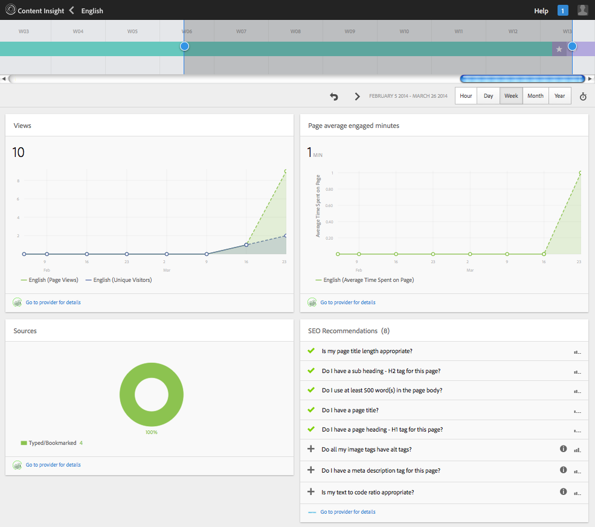
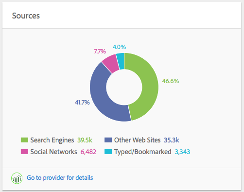

# Inzicht van inhoud{#content-insight}

Content Insight biedt informatie over de prestaties van pagina&#39;s aan de hand van webanalyses en SEO-aanbevelingen. Met Inzicht in inhoud kunt u bepalen hoe pagina&#39;s moeten worden gewijzigd of hoe vorige wijzigingen de prestaties hebben gewijzigd. Voor elke pagina die u ontwerpt, kunt u Inzicht van de Inhoud openen om de pagina te analyseren.

De lay-out van de pagina Inzicht in inhoud wordt aangepast aan de schermafmetingen en de stand van het apparaat dat u gebruikt.

## Rapportgegevens

De pagina Content Insight bevat rapporten waarin Adobe SiteCatalyst-, Adobe Target-, Adobe Social- en BrightStor-gegevens worden gebruikt:

* SiteCatalyst: De rapporten voor de volgende metriek zijn beschikbaar:

   * Paginaweergaven
   * Gemiddelde tijd die aan pagina wordt doorgebracht
   * Bronnen

* Doel: Meldt over campagneactiviteit waarvoor uw pagina voorstellen omvat.
* HelderheidRand: Rapporten over de paginafuncties die de zichtbaarheid van de pagina voor zoekprogramma&#39;s verbeteren, en adviseren functies die moeten worden geïmplementeerd.

Zie [Analytics openen en Recommendations for a Page](/help/sites-authoring/ci-analyze.md#opening-analytics-and-recommendations-for-a-page).

## Rapportageperiode

De rapporten tonen gegevens voor een periode die u controleert. Wanneer u de rapportageperiode aanpast, worden de rapporten automatisch vernieuwd met gegevens voor die periode. Visuele aanwijzingen geven de tijd aan waarop paginaversies zijn gewijzigd, zodat u de prestaties van elke versie kunt vergelijken.

U kunt ook de korreligheid van de gerapporteerde gegevens opgeven, bijvoorbeeld gegevens van dag tot week, maandelijks of jaarlijks.

Zie [De rapportageperiode wijzigen](/help/sites-authoring/ci-analyze.md#changing-the-reporting-period).

>[!NOTE]
>
>Voor de rapporten met inzichten van inhoud moet uw beheerder AEM hebben geïntegreerd met SiteCatalyst, Doel en BrightStor. Zie [Integreren met SightCatalyst](/help/sites-administering/adobeanalytics.md), [Integreren met Adobe Target](/help/sites-administering/target.md) en [Integreren met BrightEdge](/help/sites-administering/brightedge.md).

## Het weergavenrapport {#the-views-report}

Het rapport Weergaven bevat de volgende functies voor het evalueren van het paginaverkeer:

* Het totale aantal weergaven voor een pagina voor de verslagperiode.
* Een grafiek van het aantal weergaven in de verslagperiode:

   * Totaal aantal weergaven.
   * Unieke bezoekers.

## Rapport voor paginagewicht {#the-page-average-engaged-report}

Het rapport Paginagemiddelde van deelnemers bevat de volgende functies voor het evalueren van de doeltreffendheid van pagina&#39;s:

* De gemiddelde tijd dat de pagina gedurende de gehele rapportageperiode open blijft.
* Een grafiek van de gemiddelde lengte van een paginaweergave over de verslagperiode.

## Bronrapport {#the-sources-report}

Het rapport Bronnen geeft aan hoe gebruikers naar de pagina zijn genavigeerd, bijvoorbeeld op basis van resultaten van zoekprogramma&#39;s of via de bekende URL.

## Het Bounces Report {#the-bounces-report}

Het rapport Bounces bevat een grafiek die het aantal grenzen aangeeft dat zich tijdens de geselecteerde rapportageperiode op een pagina heeft voorgedaan.

## Het activiteitenverslag van de campagne {#the-campaign-activity-report}

Voor elke campagne waarvoor de pagina actief is, verschijnt een rapport genoemd *de Naam van de Campagne* Activiteit. Het rapport toont paginamonpressies en omzettingen voor elk segment waarvoor een aanbieding wordt verstrekt.

## Het SEO Recommendations-rapport {#the-seo-recommendations-report}

Het SEO Recommendations-rapport bevat de resultaten van de BrightEdge-analyse voor de pagina. Het rapport is een controlelijst van paginafuncties die aangeeft welke functies de pagina heeft en niet bevat voor het maximaliseren van de zoekbaarheid met zoekmachines.

Met dit rapport kunt u taken maken die u wilt verbeteren en de zoekbaarheid van pagina&#39;s verbeteren. Recommendations geeft aan dat er taken zijn gecreëerd voor de tenuitvoerlegging van de aanbeveling. Zie [Taken toewijzen voor SEO Recommendations](/help/sites-authoring/ci-analyze.md#assigning-tasks-for-seo-recommendations).

