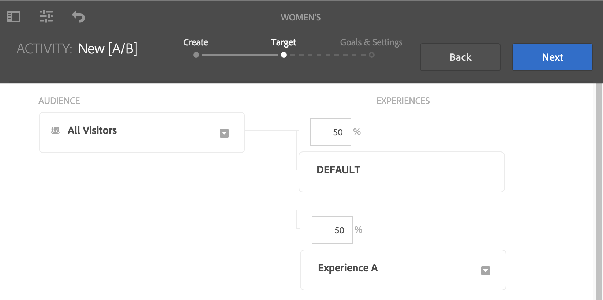
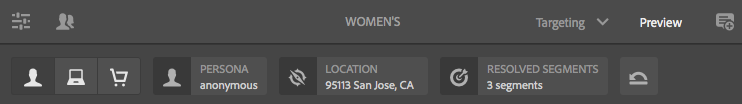

# Doelinhoud ontwerpen met doelmodus{#authoring-targeted-content-using-targeting-mode}

Door de auteur opgegeven inhoud met de doelmodus van AEM. De gerichte wijze en de component van het Doel verstrekken hulpmiddelen om inhoud voor ervaringen tot stand te brengen:

* Herken eenvoudig de doelinhoud op de pagina. Een stippellijn vormt een rand rondom alle doelinhoud.
* Selecteer een merk en een activiteit om de ervaringen te bekijken.
* Ervaringen toevoegen aan een activiteit of ervaringen verwijderen.
* A/B-tests uitvoeren en winnaars converteren (alleen Adobe Target).
* Voeg aanbiedingen toe aan een ervaring door aanbiedingen te maken of aanbiedingen uit een bibliotheek te gebruiken.
* Vorm doelstellingen en controleer prestaties.
* Simuleer de gebruikerservaring.
* Voor meer aanpassing, vorm de component van het Doel.

U kunt AEM of Adobe Target gebruiken als de doelengine (u moet over een geldige Adobe Target-account beschikken om Adobe Target te kunnen gebruiken). Als u Adobe Target gebruikt, moet u eerst de integratie configureren. Zie [instructies voor integratie met Adobe Target](/help/sites-administering/target.md).

De activiteiten en ervaringen die u in de modus Doel ziet, weerspiegelen de [Activites-console](/help/sites-authoring/activitylib.md):

* Wijzigingen die u aanbrengt in activiteiten en ervaringen die gebruikmaken van de modus Doel, worden weerspiegeld in de console Activiteiten.
* De veranderingen die in de console van Activiteiten worden aangebracht worden weerspiegeld in het richten wijze.

>[!NOTE]
>
>Wanneer u een campagne maakt in Adobe Target, wordt een eigenschap toegewezen met de naam `thirdPartyId`naar elke campagne. Wanneer u de campagne in Adobe Target verwijdert, wordt de thirdPartyId niet verwijderd. U kunt de `thirdPartyId` voor campagnes van verschillende types (AB, XT) en het kan niet manueel worden verwijderd. Om dit probleem te voorkomen, geeft u elke campagne een unieke naam. U kunt de campagnemenamen niet opnieuw gebruiken in verschillende typen campagnes.
>
>Als u dezelfde naam gebruikt in hetzelfde type campagne, overschrijft u de bestaande campagne.
>
>Als tijdens het synchroniseren de fout &quot;Verzoek is mislukt. `thirdPartyId` bestaat al.&quot; Wijzig de naam van de campagne en synchroniseer opnieuw.

>[!NOTE]
>
>Wanneer het richten, blijft de branding en activiteitencombinatie op het gebruikersniveau niet op kanaalniveau voortbestaan.

## Schakelen naar doelmodus {#switching-to-targeting-mode}

Schakel over naar de modus Doel om toegang te krijgen tot de gereedschappen voor het ontwerpen van doelinhoud.

Ga naar de modus Doel:

1. Open de pagina waarvoor u doelinhoud wilt ontwerpen.
1. Klik op de werkbalk boven aan de pagina op de vervolgkeuzelijst Modus om de beschikbare modustypen weer te geven.

   

1. Klikken **Targeting**. De doelopties worden boven aan de pagina weergegeven.

   

## Een activiteit toevoegen met de doelmodus {#adding-an-activity-using-targeting-mode}

Gebruik de modus Doel om een activiteit aan een merk toe te voegen. Wanneer u een activiteit toevoegt, bevat het de Standaardervaring. Nadat u de activiteit hebt toegevoegd, start u het proces voor het toewijzen van inhoud voor de activiteit.

U kunt ook Adobe Target-activiteiten maken en beheren vanuit AEM met de optie om de doelengine (AEM of Adobe Target) te selecteren en het type activiteit (Experience Targeting of A/B Test) te selecteren.

Bovendien kunt u doelstellingen en maatstaven voor alle Adobe Target-activiteiten beheren en uw Adobe Target-publiek beheren. Er wordt ook melding gemaakt van Adobe Target-activiteiten, waaronder het converteren van winnaars voor A/B-tests.

Wanneer u een activiteit toevoegt, wordt deze ook weergegeven in het dialoogvenster [Activiteitenconsole](/help/sites-authoring/activitylib.md).

Een activiteit toevoegen:

1. Gebruik de **Merk** vervolgkeuzelijst om het merk te selecteren waarvoor u de activiteit wilt maken.

   >[!NOTE]
   >
   >Adobe beveelt aan [merk maken via de activiteitenconsole](/help/sites-authoring/activitylib.md#creating-a-brand-using-the-activities-console).
   >
   >
   >Als u op een andere manier een merk maakt, moet u ervoor zorgen dat het knooppunt `/campaigns/<brand>/master` bestaat of er een fout optreedt wanneer u een activiteit probeert te maken.

1. Klik + naast **Activiteit** vervolgkeuzelijst.
1. Typ een naam voor de activiteit.

   >[!NOTE]
   >
   >Wanneer u een activiteit creeert en een de wolkenconfiguratie van Adobe Target verbonden aan de pagina of één van zijn ouder hebt, AEM automatisch Adobe Target als motor veronderstelt.

1. In de **Targeting** vervolgkeuzemenu voor de engine, selecteert u de doelengine.

   * Als u **ContextHub-AEM**, worden de overige velden grijs weergegeven en niet beschikbaar. Klikken **Maken**.

   * Als u **Adobe Target**, kunt u een configuratie selecteren (door gebrek, is het de configuratie u verstrekte toen u [geconfigureerd voor de account](/help/sites-administering/opt-in.md)) en Type activiteit.

   * Als u de integratie AEM/Adobe Campaign gebruikt en doelinhoud (nieuwsbrieven) verzendt, selecteert u **Adobe Campaign**. Zie [Integreren met Adobe Campaign](/help/sites-administering/campaign.md) voor meer informatie .

1. Selecteer in het menu Activiteit de optie **Gericht op ervaring** of **A/B-test**.

   * De ervaring richt zich - beheert de activiteiten van Adobe Target van AEM.
   * A/B-test - A/B-testactiviteiten in Adobe Target maken/beheren vanuit AEM.

## Het doelproces: Maken, Doel en Doelen &amp; Instellingen {#the-targeting-process-create-target-and-goals-settings}

De gerichte wijze laat u toe om verscheidene aspecten van een activiteit te vormen. Gebruik het volgende proces in drie stappen voor het maken van gerichte inhoud voor een merkactiviteit:

1. [Maken](#create-authoring-the-experiences): Voeg ervaringen toe of verwijder ervaringen en voeg aanbiedingen toe voor elke ervaring.
1. [Doel](#diagramtargetconfiguringtheaudiences): Geef het publiek op dat elke ervaring als doel heeft. U kunt een specifiek publiek richten en als het gebruiken van het testen A/B beslist welk percentage van verkeer naar welke ervaring gaat.
1. [Doelstellingen en instellingen](#settingsgoalssettingsconfiguringtheactivityandsettinggoals): Plan de activiteit en stel de prioriteit in. U kunt succes metrische doelstellingen ook plaatsen.

Gebruik de volgende procedure om het doelproces voor inhoud voor een activiteit te starten.

>[!NOTE]
>
>Om het het richten proces te gebruiken, moet u een lid van de de gebruikersgroep van de Auteurs van de Activiteit van het Doel zijn.

Een activiteit toevoegen:

1. In de **Merk** selecteert u het merk dat de activiteit bevat waaraan u werkt.
1. In de **Activiteit** selecteert u de activiteit waarvoor u doelinhoud ontwerpt.
1. Om de controles te tonen die u door het richten proces begeleiden, klik **Doelstelling starten**.

   

   >[!NOTE]
   >
   >Als u de activiteit wilt wijzigen waarmee u werkt, klikt u **Vorige**.

## Maken: de ervaringen ontwerpen {#create-authoring-the-experiences}

Bij het maken van inhoud als doel gaat het om het maken van ervaringen. Tijdens deze stap kunt u de ervaringen van de activiteit creëren of schrappen, en aanbiedingen toevoegen aan elke ervaring.

### Weergaveervaring biedt in doelmodus {#seeing-experience-offers-in-targeting-mode}

Na u [start het doelproces](/help/sites-authoring/content-targeting-touch.md#the-targeting-process-create-target-and-goals-settings), selecteert u een ervaring om de aanbiedingen voor die ervaring te bekijken. Wanneer u een ervaring selecteert, veranderen de doelcomponenten op de pagina om de aanbieding voor die ervaring te tonen.

>[!CAUTION]
>
>Wees voorzichtig wanneer u het richten voor een component onbruikbaar maakt die reeds in de auteursinstantie gericht is. De respectievelijke activiteit wordt automatisch ook uit de publicatie-instantie verwijderd.

>[!NOTE]
>
>Een aanbieding is de inhoud van een doelcomponent.

De ervaringen worden weergegeven in het deelvenster Doelgroep. In het volgende voorbeeld zijn de ervaringen **Standaard**, **Vrouwelijk**, **Vrouwelijk ouder dan 30** en **Vrouwelijk jonger dan 30**. In dit voorbeeld wordt het standaardaanbod van een beoogde **afbeeldingscomponent** getoond.

Wanneer u een andere ervaring hebt geselecteerd, wordt in de component Image het aanbod voor die ervaring weergegeven.

Wanneer een ervaring wordt geselecteerd en de doelcomponent geen aanbieding voor die ervaring omvat, toont de component **Aanbieding toevoegen** bovenop de semitransparante standaardaanbieding. Wanneer geen aanbieding voor een ervaring is gecreëerd, wordt de **Standaardaanbieding** getoond voor het segment dat aan de ervaring is toegewezen.

De ervaring Standaard wordt ook weergegeven wanneer de eigenschappen van de bezoeker niet overeenkomen met segmenten die aan de ervaringen zijn toegewezen. Zie [Ervaringen toevoegen met de doelmodus](#adding-and-removing-experiences-using-targeting-mode).

### Aangepaste aanbiedingen en bibliotheekaanbiedingen {#custom-offers-and-library-offers}

Aanbiedingen die [gemaakt op de pagina](/help/sites-authoring/content-targeting-touch.md#adding-a-custom-offer) en voor één ervaring worden gebruikt, worden aangepaste aanbiedingen genoemd. De volgende afbeelding wordt over de inhoud van een aangepaste aanbieding heen geplaatst:

Aanbiedingen die [toegevoegd uit een aanbiedingsbibliotheek](/help/sites-authoring/content-targeting-touch.md#adding-an-offer-from-an-offer-library) worden overgevuld met de volgende afbeelding:

U kunt aangepaste voorstellen opslaan in een aanbiedingsbibliotheek als u besluit dat u deze opnieuw wilt gebruiken. U kunt een bibliotheekaanbieding in een douaneaanbieding ook omzetten als u de inhoud voor een ervaring wilt wijzigen. Na het bewerken kunt u de aanbieding opnieuw opslaan in de bibliotheek.

### Ervaringen toevoegen en verwijderen met de doelmodus {#adding-and-removing-experiences-using-targeting-mode}

De stap Maken van [het doelproces](/help/sites-authoring/content-targeting-touch.md#the-targeting-process-create-target-and-goals-settings), kunt u ervaringen toevoegen en verwijderen. Bovendien kunt u een ervaring dupliceren en ook de naam ervan wijzigen.

#### Ervaringen toevoegen met de doelmodus {#adding-experiences-using-targeting-mode}

Een ervaring toevoegen:

1. Om een ervaring toe te voegen, klik **+** **Doelstelling voor ervaring toevoegen** dat hieronder de bestaande ervaringen in het **Soorten publiek** venster.
1. Selecteer en publiek. Standaard is die naam de naam van de ervaring. U kunt desgewenst een andere naam typen. Klikken **OK**.

#### Ervaringen verwijderen met de doelmodus {#removing-experiences-using-targeting-mode}

Een ervaring verwijderen:

1. Klik op de pijl naast de naam van de ervaring.

   

1. Klikken **Verwijderen**.

#### Ervaringen hernoemen met doelmodus {#renaming-experiences-using-targeting-mode}

Ervaringen een andere naam geven in de doelmodus:

1. Klik op de pijl naast de naam van de ervaring.
1. Klikken **Ervaring hernoemen** en typ de nieuwe naam.
1. Klik ergens anders op het scherm om de wijzigingen op te slaan.

#### Soorten publiek bewerken met doelmodus {#editing-audiences-using-targeting-mode}

U kunt als volgt het publiek bewerken in de doelmodus:

1. Klik op de pijl naast de naam van de ervaring.
1. Klikken **Publiek bewerken** en selecteer een nieuw publiek.
1. Klikken **OK**.

#### Dubbele ervaringen met de doelmodus {#duplicating-experiences-using-targeting-mode}

Ervaringen kopiëren met de doelmodus:

1. Klik op de pijl naast de naam van de ervaring.
1. Klikken **Dupliceren** en kiest u het publiek.
1. Wijzig desgewenst de naam van de ervaring en klik op **OK**.

### Aanbiedingen maken met de doelmodus {#creating-offers-using-targeting-mode}

Kies een component om aanbiedingen voor ervaringen te maken. De gerichte componenten verstrekken de inhoud die als aanbiedingen voor ervaringen wordt gebruikt.

* [Bestaande component als doel instellen](/help/sites-authoring/content-targeting-touch.md#creating-a-default-offer-by-targeting-an-existing-component). De inhoud wordt de standaardervaring.
* [Een doelcomponent toevoegen](/help/sites-authoring/content-targeting-touch.md#creating-an-offer-by-adding-a-target-component)voegt u vervolgens inhoud toe aan de component.

Nadat een component is aangewezen, kunt u aanbiedingen voor elke ervaring toevoegen:

* [Aangepaste aanbiedingen toevoegen](/help/sites-authoring/content-targeting-touch.md#adding-a-custom-offer).
* [Aanbiedingen vanuit een bibliotheek toevoegen](/help/sites-authoring/content-targeting-touch.md#adding-an-offer-from-an-offer-library).

De volgende gereedschappen zijn beschikbaar voor het werken met aanbiedingen:

* [Een aangepaste aanbieding toevoegen aan een aanbiedingsbibliotheek](/help/sites-authoring/content-targeting-touch.md#adding-a-custom-offer-to-a-library).
* [Een bibliotheekaanbieding omzetten in een aangepaste aanbieding](/help/sites-authoring/content-targeting-touch.md#converting-a-library-offer-to-a-custom-library).
* [Bibliotheekaanbod openen en de inhoud bewerken](/help/sites-authoring/content-targeting-touch.md#editing-a-library-offer).

#### Een standaardaanbieding maken door een bestaande component als doel in te stellen {#creating-a-default-offer-by-targeting-an-existing-component}

Wijs een component op de pagina aan om het als aanbieding voor de Standaardervaring van de activiteit te gebruiken. Wanneer u een component als doel instelt, wordt deze in een doelcomponent verpakt en wordt de inhoud van deze component de aanbieding voor de standaardervaring.

Wanneer u een component als doel instelt, kan alleen die component in de aanbieding worden gebruikt. U kunt de component niet uit de aanbieding verwijderen of andere componenten aan de aanbieding toevoegen.

Voer de volgende procedure uit na [starten van het doelproces](/help/sites-authoring/content-targeting-touch.md#the-targeting-process-create-target-and-goals-settings).

1. Klik op de component die u als doel wilt instellen. De werkbalk voor de component wordt weergegeven, net als in het volgende voorbeeld.

   

1. Klik op het pictogram Doel.

   

   De inhoud van de component is de aanbieding voor de Standaardervaring. Wanneer een component wordt gericht, wordt zijn standaardknoop herhaald voor elke ervaring. Dit is nodig voor het bewerken van het juiste inhoudsknooppunt tijdens specifieke ontwerphandelingen. Voor deze niet-standaard ervaringen geldt het volgende: [een aangepaste aanbieding toevoegen](/help/sites-authoring/content-targeting-touch.md#adding-a-custom-offer) of [een bibliotheekaanbieding toevoegen](/help/sites-authoring/content-targeting-touch.md#adding-an-offer-from-an-offer-library).

#### Een aanbieding maken door een doelcomponent toe te voegen {#creating-an-offer-by-adding-a-target-component}

Voeg een component van het Doel toe om de aanbieding voor de Standaardervaring tot stand te brengen. De doelcomponent is een container voor andere componenten en componenten die erin worden geplaatst, worden als doel ingesteld. Als u de doelcomponent gebruikt, kunt u verschillende componenten toevoegen om een aanbieding te maken. Bovendien kunt u verschillende componenten in elke ervaring gebruiken om verschillende aanbiedingen te maken.

Zie [Opties voor doelcomponenten configureren](/help/sites-authoring/content-targeting-touch.md#configuring-target-component-options) voor informatie over het aanpassen van deze component.

>[!NOTE]
>
>Aanbiedingen die u maakt met de [Aanbiedingsconsole](/help/sites-authoring/offerlib.md) kan ook meerdere componenten bevatten. Deze aanbiedingen horen bij een aanbiedingsbibliotheek en kunnen voor meerdere ervaringen worden gebruikt.

Aangezien de doelcomponent een container is, wordt deze weergegeven als een neerzetgebied voor andere componenten.

In de modus Doel heeft de component Doel een blauwe rand en geeft het bericht voor de neerzetbestemming de doelaard aan.

In de modus Bewerken heeft de component Doel een pictogram met een opsommingsteken.

Wanneer u componenten naar de component van het Doel sleept, zijn zij gerichte componenten.

Wanneer u een component aan de component van het Doel toevoegt, verstrekt het inhoud voor een specifieke ervaring. Als u de ervaring wilt opgeven, selecteert u de ervaring voordat u de componenten toevoegt.

U kunt een doelcomponent aan de pagina toevoegen in de modus Bewerken of in de modus Doel. U kunt componenten alleen in de modus Doel aan de component Doel toevoegen. De component van het Doel behoort tot de de componentengroep van de Personalisatie.

Als u de doelinhoud wilt bewerken, moet u klikken op **Doelstelling starten** voordat u dit kunt doen.

1. Sleep de component Target naar de pagina waar u het aanbod wilt weergeven.
1. Standaard is er geen locatie-id ingesteld. Klik vormen cog wiel om de plaats te plaatsen.

   >[!NOTE]
   >
   >Indien ingesteld door uw beheerder, moet u de locatie mogelijk expliciet instellen.
   >
   >
   >Beheerders kunnen bepalen of deze configuratie vereist is bij **https://&lt;host>:&lt;port>/system/console/configMgr/com.day.cq.personalization.impl.servlets.TargetingConfigurationServlet**
   >
   >
   Als u wilt dat gebruikers een locatie moeten invoeren, schakelt u het selectievakje **Locatie forceren ** in.

1. Selecteer de ervaring waarvoor u de aanbieding wilt maken.
1. Maak het voorstel:

   * Voor de Standaardervaring, sleep componenten aan het gerichte dalingsgebied, en geef de componenteneigenschappen zoals gebruikelijk uit om de inhoud voor de aanbieding tot stand te brengen.
   * Voor ervaringen die niet standaard zijn, kunt u [een aangepaste aanbieding toevoegen](#adding-a-custom-offer) of [een bibliotheekaanbieding toevoegen](/help/sites-authoring/content-targeting-touch.md#adding-an-offer-from-an-offer-library).

#### Een aangepaste aanbieding toevoegen {#adding-a-custom-offer}

Maak een aanbieding door de inhoud van een doelcomponent te ontwerpen in de modus Doel. Wanneer u een aangepaste aanbieding maakt, wordt deze gebruikt als de aanbieding voor één ervaring.

Als u besluit dat de aanbieding voor andere ervaringen kan worden gebruikt, kunt u een aangepaste aanbieding maken en [toevoegen aan de bibliotheek](/help/sites-authoring/content-targeting-touch.md#adding-a-custom-offer-to-a-library). Voor informatie over het gebruiken van de console van Aanbiedingen om een herbruikbare aanbieding tot stand te brengen, zie [Een voorstel toevoegen aan een bibliotheek met aanbiedingen](/help/sites-authoring/offerlib.md#add-an-offer-to-an-offer-library).

1. Selecteer de ervaring waaraan u het voorstel wilt toevoegen.
1. Als u het menu van de component wilt weergeven, klikt u op de doelcomponent waaraan u de aanbieding wilt toevoegen.

   

1. Klik op het pictogram +.

   De inhoud van de standaardaanbieding wordt gebruikt als de aanbieding voor de huidige ervaring.

1. Klik op de aanbieding om het aanbiedingsmenu weer te geven en klik vervolgens op het pictogram Bewerken.

   

1. Bewerk de inhoud van de component.

#### Een voorstel toevoegen vanuit een aanbiedingenbibliotheek {#adding-an-offer-from-an-offer-library}

Voeg een voorstel van toe de [aanbiedingsbibliotheek](/help/sites-authoring/offerlib.md) naar een ervaring. U kunt elke aanbieding toevoegen uit de bibliotheek van het merk waarvoor u momenteel kiest.

U kunt geen bibliotheekaanbiedingen toevoegen aan de standaardervaring.

1. Selecteer de ervaring waaraan u het voorstel wilt toevoegen.
1. Als u het menu van de component wilt weergeven, klikt u op de doelcomponent waaraan u de aanbieding wilt toevoegen.

   

1. Klik het omslagpictogram.

   

1. Selecteer de aanbieding in de bibliotheek en klik op het pictogram van het vinkje.

   

   Met de aanbiedingenkiezer kunt u naar voorstellen bladeren of filteren. Wanneer u bladert of filtert, kunt u de aanbiedingen ook willen sorteren en veranderen hoe u hen bekijkt. Het getal in de rechterbovenhoek geeft aan hoeveel aanbiedingen beschikbaar zijn in de huidige bibliotheek.

   * Klikken **Bladeren** om naar een andere map te navigeren. Het navigatievenster wordt geopend en u klikt op de pijl om naar de mappen te gaan. Klikken **Bladeren** nogmaals om het navigatiegebied te sluiten.

   

   * Klikken **Filter** om de aanbiedingen te filteren op trefwoorden of tags. U voert trefwoorden in en u selecteert tags in het keuzemenu. Klikken **Filter** nogmaals om het filtervenster te sluiten.

   

   * Wijzig de manier waarop u de voorstellen sorteert door op de pijl naast **Nieuwst naar oudst**. Aanbiedingen kunnen nieuwste worden gesorteerd op oudst of oudst op nieuwste.

   

   Klik op het pictogram naast **Weergeven als** om voorstellen als tegels of als lijst weer te geven.

   

#### Een aangepaste aanbieding aan een bibliotheek toevoegen {#adding-a-custom-offer-to-a-library}

Voeg een aangepaste aanbieding toe aan de [aanbiedingsbibliotheek](/help/sites-authoring/offerlib.md) als u het wilt hergebruiken als de aanbieding voor meerdere ervaringen. U kunt aanbiedingen toevoegen aan de bibliotheek van het huidige merk waarop u zich richt.

Voor informatie over het gebruiken van de console van Aanbiedingen om een herbruikbare aanbieding tot stand te brengen, zie [Een voorstel toevoegen aan een bibliotheek met aanbiedingen](/help/sites-authoring/offerlib.md#add-an-offer-to-an-offer-library).

1. Selecteer de ervaring om de aangepaste aanbieding weer te geven.
1. Klik op de aangepaste aanbieding om het aanbiedingsmenu weer te geven en klik vervolgens op de knop **Aanbieding opslaan naar aanbiedingenbibliotheek** pictogram.

   

1. Typ een naam voor de aanbieding, selecteer de bibliotheek waaraan u de aanbieding toevoegt, en klik dan het controlemerkpictogram.

#### Een bibliotheekaanbod omzetten in een aangepaste bibliotheek {#converting-a-library-offer-to-a-custom-library}

Een bibliotheekaanbieding omzetten in een aangepaste aanbieding om de aanbieding voor de huidige ervaring te wijzigen zonder de aanbieding in andere ervaringen te wijzigen.

1. Selecteer de ervaring om het bibliotheekaanbod weer te geven.
1. Klik op de bibliotheekaanbieding om het aanbiedingsmenu weer te geven en klik vervolgens op het pictogram Omzetten in onlineaanbieding.

   

#### Een bibliotheekaanbod bewerken {#editing-a-library-offer}

Open een bibliotheekaanbieding vanuit een ervaring in de modus Gericht om de aanbieding te bewerken. De wijzigingen die u aanbrengt, worden weergegeven in alle ervaringen die gebruikmaken van de aanbieding.

1. Selecteer de ervaring om het bibliotheekaanbod weer te geven.
1. De bibliotheekaanbieding omzetten in een lokale/aangepaste aanbieding. Zie [Een bibliotheekaanbod omzetten in een aangepaste bibliotheek](#converting-a-library-offer-to-a-custom-library).
1. Bewerk de inhoud van de aanbieding.

1. Sla het bestand weer op in de bibliotheek. Zie [Een aangepaste aanbieding aan een bibliotheek toevoegen](#adding-a-custom-offer-to-a-library).

## Doel: Het publiek configureren {#target-configuring-the-audiences}

De stap Doel van [het doelproces](/help/sites-authoring/content-targeting-touch.md#the-targeting-process-create-target-and-goals-settings) Hierbij worden doelgroepen toegewezen aan de ervaringen waarmee u hebt gewerkt in de stap Maken. De pagina Doel toont het publiek dat elke ervaring richt. U kunt het publiek voor elke ervaring opgeven of wijzigen. Als u Adobe Target gebruikt, kunt u A/B tests ook tot stand brengen die u percentage van verkeer voor een publiek aan een bepaalde ervaring laten richten.

### Als u AEM of Adobe Target gebruikt (Experience targeting)... {#if-you-are-using-aem-targeting-or-adobe-target-experience-targeting}

Het publiek verschijnt aan de linkerkant van het kaartdiagram, en de ervaringen verschijnen aan de rechterkant.

Bepaal een publiek gebruikend een segment. De wolkenconfiguratie voor de pagina bepaalt de segmenten die aan u beschikbaar zijn. Wanneer de pagina niet is gekoppeld aan een Adobe Target-cloudconfiguratie, zijn AEM segmenten beschikbaar voor het definiëren van soorten publiek. Wanneer de pagina aan een de wolkenconfiguratie van Adobe Target wordt geassocieerd, gebruikt u de segmenten van het Doel.

Voor informatie over motoren, zie [Richtingsmotor](/help/sites-authoring/personalization.md#targeting-engine).

Gebruik geen publiek meer dan één ervaring. Er verschijnt een waarschuwingssymbool naast een ervaring wanneer het wordt toegewezen aan een publiek dat is toegewezen aan een andere ervaring.

### Ervaringen met het publiek koppelen (AEM of Adobe Target) {#associating-experiences-with-audiences-aem-or-adobe-target}

Gebruik de volgende procedure om een ervaring met een publiek te associëren wanneer het gebruiken van AEM richten (of de ervaring van Adobe Target het richten):

1. Klik op de vervolgkeuzepijl in het publieksvak dat aan de ervaring is toegewezen.
1. (Optioneel) Klik op **Bewerken** en typ vervolgens een trefwoord om naar het gewenste segment te zoeken.
1. Selecteer het publiek in de lijst met soorten publiek en klik op **OK**.

### Als u A/B Testing (Adobe Target) gebruikt... {#if-you-are-using-a-b-testing-adobe-target}

Als u een A/B testactiviteit hebt, zijn de soorten publiek op uw linkerzijde, is het percentage dat elke ervaring wordt bekeken in het midden, en de ervaringen zijn op het recht.

U kunt de percentages wijzigen zolang ze maar optellen tot 100 procent. Een publiek kan door veelvoudige ervaringen in het testen A/B worden gebruikt.

### Soorten publiek en verkeerspercentages koppelen aan A/B-tests {#associating-audiences-and-traffic-percentages-with-a-b-testing}

1. Klik op het keuzemenu naast het publiek dat aan de ervaring is toegewezen.
1. (Optioneel) Klik op **Bewerken** Typ vervolgens een trefwoord om naar het gewenste segment te zoeken.
1. Klikken **OK.**
1. Ga in percentages in om te vormen hoe het publieksverkeer aan elke ervaringen wordt verpletterd. Het totale getal moet 100 zijn.
1. (Optioneel) Bewerk de ervaringsnaam door te klikken op het keuzemenu naast de naam van de ervaring.

## Doelstellingen en instellingen: de activiteiten configureren en doelen instellen {#goals-settings-configuring-the-activity-and-setting-goals}

De stap Doelstellingen en instellingen van [het doelproces](/help/sites-authoring/content-targeting-touch.md#the-targeting-process-create-target-and-goals-settings) omvat het configureren van het gedrag van de merkactiviteit. Geef op wanneer de activiteit begint en eindigt en geef de prioriteit van de activiteit op. Bovendien volgt u ook doelstellingen. Specifiek kunt u beslissen wat u met uw activiteiten wilt meten.

Goal Metrics zijn alleen beschikbaar als je Adobe Target gebruikt voor je doelengine. Bepaal minstens één doel metrisch. Als u Adobe Analytics hebt geconfigureerd en een cloudconfiguratie voor A4T Analytics hebt, kunt u kiezen of u de rapportbron Adobe Target of Adobe Analytics wilt zijn.

De doelmeetgegevens worden alleen gemeten voor de gepubliceerde campagne.

Indien AEM wordt gebruikt als motor die als doel heeft:

Indien Adobe Target wordt gebruikt als de motor waarop is gericht:

Als u Adobe Target gebruikt als de doelengine en u A4T Analytics hebt geconfigureerd voor het account, hebt u een extra vervolgkeuzemenu voor **Bron van rapportage**:

De volgende succeswaarden zijn beschikbaar (alleen gebruikt voor publiceren):

<table>
 <tbody>
  <tr>
   <td><strong>Conversie</strong></td>
   <td>
Het percentage bezoekers dat heeft geklikt op een onderdeel van de ervaring die wordt getest. Een conversie kan één keer per bezoeker worden meegeteld of telkens wanneer een bezoeker een conversie voltooit. De omzettingsmetrische waarde wordt geplaatst aan één van het volgende:

    <ul>
     <li><strong>Pagina's weergeven</strong> - U kunt bepalen welke pagina de kijker door te selecteren of <strong>URL is</strong> en definieert u vervolgens de URL of meerdere URL's of door <strong>URL bevat</strong> en voegt u vervolgens een pad of trefwoord toe.</li>
     <li><strong>Een box weergegeven</strong> - U kunt opgeven welke box uw publiek heeft weergegeven door de naam van de mbox in te voeren. U kunt meerdere vakken invoeren door op <strong>Een box toevoegen</strong>.</li>
    </ul> </td>
  </tr>
  <tr>
   <td><strong>Ontvangsten</strong></td>
   <td>
Door het bezoek gegenereerde inkomsten. U kunt uit de volgende opbrengstmetriek kiezen:

    <ul>
     <li>Opbrengst per bezoeker (RPV)</li>
     <li>Gemiddelde bestelwaarde (AOV)</li>
     <li>Totale verkoop </li>
     <li>Orders</li>
    </ul> 
Voor al deze opties geeft het feit of een box is weergegeven aan dat het doel is bereikt. U kunt de box of meerdere vakken definiëren.
 </td>
  </tr>
  <tr>
   <td><strong>Betrokkenheid</strong></td>
   <td>
U kunt drie soorten betrokkenheid meten:

    <ul>
     <li>Paginaweergaven</li>
     <li>Aangepaste scores</li>
     <li>Tijd op de site</li>
    </ul> </td>
  </tr>
 </tbody>
</table>

Bovendien zijn er geavanceerde montages die u laten bepalen hoe te om succesmetriek te tellen. U kunt onder andere de metrische waarde per impositie of één keer per bezoeker tellen en kiezen of de gebruiker in de activiteit moet blijven of de activiteit moet verwijderen.

Gebruik de geavanceerde instellingen om te bepalen wat er gebeurt **na** een gebruiker ontmoet het doel metrisch. In de volgende tabel staan de beschikbare opties.

<table>
 <tbody>
  <tr>
   <td><strong>Nadat een gebruiker dit doel metrisch ontmoet..</strong></td>
   <td><strong>U selecteert het volgende om te gebeuren...</strong></td>
  </tr>
  <tr>
   <td><strong>Aantal verhogen en gebruiker actief houden</strong></td>
   <td>Geef op hoe het aantal wordt verhoogd:
    <ul>
     <li>Eenmaal per gegadigde</li>
     <li>Bij elke afbeelding, pagina-vernieuwingen uitsluiten</li>
     <li>Op elke indruk</li>
    </ul> </td>
  </tr>
  <tr>
   <td><strong>Toename, gebruiker vrijgeven en opnieuw invoeren toestaan</strong></td>
   <td>Selecteer de ervaring die de bezoeker ziet als ze de activiteit opnieuw betreden:
    <ul>
     <li>Dezelfde ervaring</li>
     <li>Willekeurige ervaring</li>
     <li>Onzichtbare ervaring</li>
    </ul> </td>
  </tr>
  <tr>
   <td><strong>Toename, Geen gebruiker &amp; Staafherinvoer</strong></td>
   <td>Bepaal wat de gebruiker ziet in plaats van de inhoud van de activiteit:
    <ul>
     <li>Dezelfde ervaring, zonder bijhouden</li>
     <li>Standaardinhoud of andere activiteit-inhoud</li>
    </ul> </td>
  </tr>
 </tbody>
</table>

Zie [Adobe Target-documentatie](https://experienceleague.adobe.com/docs/target/using/activities/success-metrics/success-metrics.html) voor meer informatie over succesmetriek.

### Instellingen configureren (AEM gericht) {#configuring-settings-aem-targeting}

Om montages te vormen wanneer het gebruiken van AEM richten:

1. Als u wilt opgeven wanneer de activiteit begint, gebruikt u de opdracht **Start** vervolgkeuzelijst om een van de volgende waarden te selecteren:

   * **Indien geactiveerd**: De activiteit wordt gestart wanneer de pagina met de doelinhoud wordt geactiveerd.
   * **Opgegeven datum en tijd**: Een specifieke tijd. Wanneer u deze optie selecteert, klikt u op het kalenderpictogram, selecteert u een datum en geeft u de tijd op om de activiteit te starten.

1. Als u wilt opgeven wanneer de activiteit eindigt, gebruikt u de opdracht **Einde** vervolgkeuzelijst om een van de volgende waarden te selecteren:

   * **Wanneer gedeactiveerd**: De activiteit eindigt wanneer de pagina die de beoogde inhoud bevat, wordt gedeactiveerd.
   * **Opgegeven datum en tijd**: Een specifieke tijd. Wanneer u deze optie selecteert, klikt u op het kalenderpictogram, selecteert u een datum en geeft u de tijd op om de activiteit te beëindigen.

1. Als u een prioriteit voor de activiteit wilt opgeven, gebruikt u de schuifregelaar om **Laag**, **Normaal**, of **Hoog**.

### Doelstellingen en instellingen configureren (Adobe Target) {#configuring-goals-settings-adobe-target}

Als u Adobe Target gebruikt, kunt u als volgt doelen en instellingen configureren:

1. Als u wilt opgeven wanneer de activiteit begint, gebruikt u de opdracht **Start** vervolgkeuzelijst om een van de volgende waarden te selecteren:

   * **Indien geactiveerd**: De activiteit wordt gestart wanneer de pagina met de doelinhoud wordt geactiveerd.
   * **Opgegeven datum en tijd**: Een specifieke tijd. Wanneer u deze optie selecteert, klikt u op het kalenderpictogram, selecteert u een datum en geeft u de tijd op om de activiteit te starten.

1. Als u wilt opgeven wanneer de activiteit eindigt, gebruikt u de opdracht **Einde** vervolgkeuzelijst om een van de volgende waarden te selecteren:

   * **Wanneer gedeactiveerd**: De activiteit eindigt wanneer de pagina die de beoogde inhoud bevat, wordt gedeactiveerd.
   * **Opgegeven datum en tijd**: Een specifieke tijd. Wanneer u deze optie selecteert, klikt u op het kalenderpictogram, selecteert u een datum en geeft u de tijd op om de activiteit te beëindigen.

1. Als u een prioriteit voor de activiteit wilt opgeven, gebruikt u de schuifregelaar om **Laag**, **Normaal**, of **Hoog**.
1. Als u de Adobe Analytics hebt geconfigureerd met uw Adobe Target-account, ziet u de **Rapportagebron** vervolgkeuzelijst. Selecteer **Adobe Target** of **Adobe Analytics** als bron.

   Als u **Adobe Analytics**, selecteert u het bedrijf en de rapportsuite. Als u **Adobe Target**, is geen actie vereist.

   

1. In het gebied **Metrische data van doel** selecteert u onder **Mijn primaire doel** de metrische data voor succes die u wilt volgen (Omzetting, Inkomsten, Betrokkenheid) en geeft u op hoe deze metrische waarde wordt gemeten (of welke actie de doelgroep uitvoert om aan te geven dat een doel bereikt is). Zie de definitie van de metrische data van doel in de vorige tabel en zie de [Adobe Target-documentatie](https://experienceleague.adobe.com/docs/target/using/activities/success-metrics/success-metrics.html) over metrische data voor succes.

   U kunt de naam van het doel wijzigen door op de drie stippen in de rechterbovenhoek te klikken en **Naam wijzigen** te selecteren.

   Als u alle velden wilt wissen, klikt u op de drie stippen in de rechterbovenhoek en selecteert u **Alle velden wissen**.

   Alle metriek hebben ook geavanceerde montages u kunt bepalen. Selecteren **Geavanceerde instellingen** toegang tot deze gegevens. Zie hoe succesmetriek in vorige lijst worden geteld en zie [Adobe Target-documentatie](https://experienceleague.adobe.com/docs/target/using/activities/success-metrics/success-metrics.html).

   >[!NOTE]
   >
   Er moet ten minste één doel zijn gedefinieerd.

   

   >[!NOTE]
   >
   Als er informatie ontbreekt in metrisch, omringt een rode lijn metrisch.

1. Klikken **Een nieuwe metrisch toevoegen** om extra succesmetriek te vormen.

   

   >[!NOTE]
   >
   U kunt aanvullende doelen verwijderen door op de drie punten te klikken of erop te tikken en te klikken of te tikken **Verwijderen**. AEM vereist dat u ten minste één doel hebt gedefinieerd.

1. Klik op **Geavanceerde instellingen** toegang tot deze gegevens.
1. Klikken **Opslaan**.

Na het configureren kunt u [de prestaties van uw activiteiten bekijken](/help/sites-authoring/activitylib.md#viewing-performance-and-converting-winning-experiences-a-b-test) die gebruikmaken van Adobe Target (ervaring of A/B-test gericht). Daarnaast kunt u met een A/B-test [Zet de winnaars om.](/help/sites-authoring/activitylib.md#viewing-performance-and-converting-winning-experiences-a-b-test)

## Een ervaring simuleren {#simulating-an-experience}

Simuleer de ervaring van een bezoeker om te controleren of de pagina-inhoud op de verwachte wijze wordt weergegeven, afhankelijk van het ontwerp van uw doelinhoud. Tijdens het simuleren kunt u verschillende gebruikersprofielen laden en de doelinhoud voor die gebruiker bekijken.

De volgende criteria bepalen de inhoud die wordt weergegeven wanneer bezoekerservaring wordt gesimuleerd:

* De gegevens in de zittingsopslag van de gebruiker (via de Hub van de Context).
* De [Activiteiten die zijn ingeschakeld](/help/sites-authoring/activitylib.md).
* De [regels die de segmenten definiëren](/help/sites-administering/campaign-segmentation.md).
* De inhoud van de ervaringen in de doelcomponenten.
* De [configuratie van de doelmotor](/help/sites-authoring/activitylib.md).

Als er onverwachte inhoud op de pagina wordt weergegeven wanneer u een profiel laadt, controleert u de configuratie van elk item in deze lijst.

>[!NOTE]
>
Als u A/B het testen gebruikt, wanneer het simuleren van ervaringen wordt getoond gebaseerd op verkeerspercentage. Dit wordt gecontroleerd door Adobe Target, wat tot onverwachte resultaten voor auteurs kan leiden. (De _auteuractiviteit is gesynchroniseerd met specifieke montages die herevaluatie tijdens simulatie toestaan.) De auteurs kunnen moeten verfrissen om de andere ervaringen te zien die op hun verkeersmontages worden gebaseerd.

Gebruik de volgende gereedschappen om de ervaring van de bezoeker te simuleren:

* De simulatieactiviteit op het richten wijze: De pagina toont de aanbiedingen voor de gebruiker die momenteel in de Hub van de Context wordt geselecteerd. U kunt de aanbiedingen bewerken die op de gebruiker zijn gericht.
* De wijze van de voorproef: De Hub van de Context van het gebruik om de gebruikers en de plaatsen te selecteren die aan de criteria van de segmenten voldoen die uw ervaringen op gebaseerd zijn. Wanneer uw selecties van de Hub van de Context veranderen, verandert de gerichte inhoud dienovereenkomstig.

1. Klik op de werkbalk om over te schakelen naar de modus Voorbeeld **Voorvertoning**.
1. Voor de hulpmiddelbar, klik het pictogram van de Hub van de Context.

   

1. Gebruik Context Hub om context-eigenschappen te wijzigen. Klik bijvoorbeeld op de eigenschap Persona om een andere gebruiker te selecteren.

   

   De pagina verandert om de inhoud te tonen die voor de huidige context wordt gericht.

1. Als u de weergegeven aanbiedingen wilt wijzigen, schakelt u over naar de modus Doel. Selecteer de simulatieactiviteit en bewerk de aanbiedingen voor de context die u hebt geconfigureerd in de modus Voorbeeld.

## Opties voor doelcomponenten configureren {#configuring-target-component-options}

U kunt de component van het Doel aanpassen door tot de opties van de component op één van twee manieren toegang te hebben:

1. Nadat u de component, in de component van het Doel hebt gericht, klik de component en toen het montagespictogram (cog).

   

   AEM geeft het venster met opties voor de doelcomponent weer.

   

1. U kunt deze instellingen ook openen in de modus Volledig scherm door in het venster met opties voor de doelcomponent op het pictogram Volledig scherm te klikken.

   

   AEM het venster met opties voor de doelcomponent voor volledig scherm.

   

1. Configureer de instellingen voor de doelcomponent zoals beschreven in de volgende tabellen.

<table>
 <tbody>
  <tr>
   <td><strong>Optie</strong></td>
   <td><strong>Beschrijving</strong></td>
  </tr>
  <tr>
   <td><strong>Locatie</strong></td>
   <td>
De locatie is een tekenreeks die de doellocatie van de inhoud een naam geeft en aanbiedingen verbindt met plaatsen (of locaties of componenten) op de pagina waar deze aanbiedingen moeten worden geplaatst.
 
Dit veld is een algemene waarde.
 
Als u een voorstel in een component zet, onthoudt de aanbieding de locatie-id. Wanneer de pagina wordt uitgevoerd, evalueert de motor de segmenten van de gebruiker en gebaseerd op dit, lost het de ervaringen van de actieve campagnes op die zouden moeten worden getoond. Vervolgens worden de locatie-id's op de pagina gecontroleerd en wordt geprobeerd voorstellen met die locatie-id's aan te passen.
 </td>
  </tr>
  <tr>
   <td><strong>Engine</strong></td>
   <td>Selecteren tussen <strong>Client side Rules (zonder tracking), Adobe Target, ContextHub, </strong>en<strong> Adobe Campaign </strong>afhankelijk van de engine die u wilt gebruiken.</td>
  </tr>
 </tbody>
</table>

Als u Adobe Target als engine selecteert:

<table>
 <tbody>
  <tr>
   <td><strong>Optie</strong></td>
   <td><strong>Beschrijving</strong></td>
  </tr>
  <tr>
   <td><strong>Nauwkeurige bestemming</strong></td>
   <td>
Wanneer u nauwkeurige adressering inschakelt, weet de component dat deze moet wachten totdat de context- of contexthubgegevens beschikbaar zijn voordat de aanvraag naar Adobe Target wordt verzonden. Hierdoor kan de laadtijd toenemen. Voor creatie, wordt het nauwkeurige richten altijd toegelaten.
 
Als u <strong>Nauwkeurige bestemming</strong> selectievakje, voert het selectievakje een <code>mboxDefine</code> eerste en tweede <code>mboxUpdate</code> later resulteert dit in een Ajax-verzoek zodra de gegevens beschikbaar zijn.
 
Als u de optie <strong>Nauwkeurige bestemming</strong> selectievakje, voert het selectievakje een <code>mboxCreate</code> resulterend in een synchrone aanvraag onmiddellijk (in dit geval zijn mogelijk nog niet alle contextgegevens beschikbaar).
 
<strong>Opmerking:</strong> Het in- of uitschakelen van het nauwkeurig opgeven van een bepaald onderdeel heeft geen invloed op de instellingen die u globaal hebt ingesteld. U kunt globale instellingen altijd overschrijven door Accurate doelen selecteren in de component.
 </td>
  </tr>
  <tr>
   <td><strong>Omgezette segmenten opnemen</strong></td>
   <td>
Het selecteren van deze controledoos omvat alle opgeloste segmenten in de mbox vraag en om het even welke parameters die in de pagina en in het kader worden gevormd.
 
Dit werkt alleen in situaties met XML API waarin u AEM segmenten synchroniseert. Als u segmenten in AEM hebt die niet door Adobe Target (als manuscriptsegmenten) worden behandeld, dan laat deze optie u het segment in AEM oplossen en informatie verzenden naar Adobe Target dat het segment actief is.
 </td>
  </tr>
  <tr>
   <td><strong>Overgenomen contextparameters</strong></td>
   <td>Hier worden eventueel van het Adobe Target-framework overgeërfde contextparameters weergegeven die aan de geselecteerde pagina zijn gekoppeld.</td>
  </tr>
  <tr>
   <td><strong>Contextparameters</strong></td>
   <td>Klikken <strong>Veld toevoegen</strong> om extra contextparameters te vormen (het zelfde als wat in het kader van het Doel beschikbaar is). Contextparameters die aan de component zijn toegevoegd, worden toegepast <i>alleen</i> aan de component en niet aan andere component zoals het geval zou zijn als u contextparameters rechtstreeks aan het kader toevoegde.</td>
  </tr>
  <tr>
   <td><strong>Statische parameters</strong></td>
   <td>Klikken <strong>Veld toevoegen</strong> om extra statische parameters te vormen (het zelfde als wat in het kader van het Doel beschikbaar is). Statische parameters die aan de component worden toegevoegd, worden toegepast <i>alleen</i> aan de component en niet aan andere component zoals het geval zou zijn als u statische parameters rechtstreeks aan het kader toevoegde. Statische parameters komen niet uit context (cliëntcontext van inhoudshub).</td>
  </tr>
 </tbody>
</table>

>[!NOTE]
>
Wanneer u een component selecteert en deze doelbaar maakt, vervangt AEM ook de component en injecteert een Adobe Target-component. (De Adobe Target-component wordt niet alleen gebruikt wanneer u deze handmatig aan de pagina toevoegt, maar ook wanneer u een bestaande component als doel instelt.)

Als u Client Context (clientzijde) selecteert als de engine:

<table>
 <tbody>
  <tr>
   <td><strong>Optie</strong></td>
   <td><strong>Beschrijving</strong></td>
  </tr>
  <tr>
   <td><strong>Opties aan clientzijde - Strategie</strong></td>
   <td>
Selecteer een van de volgende opties:

    <ul>
     <li><strong>Eerste</strong>: De meest recente ervaring in de lijst zoals deze in de campagne is geordend.</li>
     <li><strong>Willekeurig</strong>: Elke ervaring wordt gebruikt.</li>
     <li><strong>Clikstream score</strong>: De tags en verwante tagtreffers die in de clientcontext worden bijgehouden, worden gebruikt. De snelheden voor tags die op de teaspagina zijn gedefinieerd, worden vergeleken.</li>
    </ul> </td>
  </tr>
 </tbody>
</table>

U selecteert **Adobe Campaign** als de motor als u AEM met Adobe Campaign integreert. Zie [AEM integreren met Adobe Campaign](/help/sites-administering/campaign.md) voor meer informatie .

Selecteren **ContextHub** als motor als u ContextHub voor het richten gebruikt. Zie [ContextHub configureren.](/help/sites-developing/ch-configuring.md)
