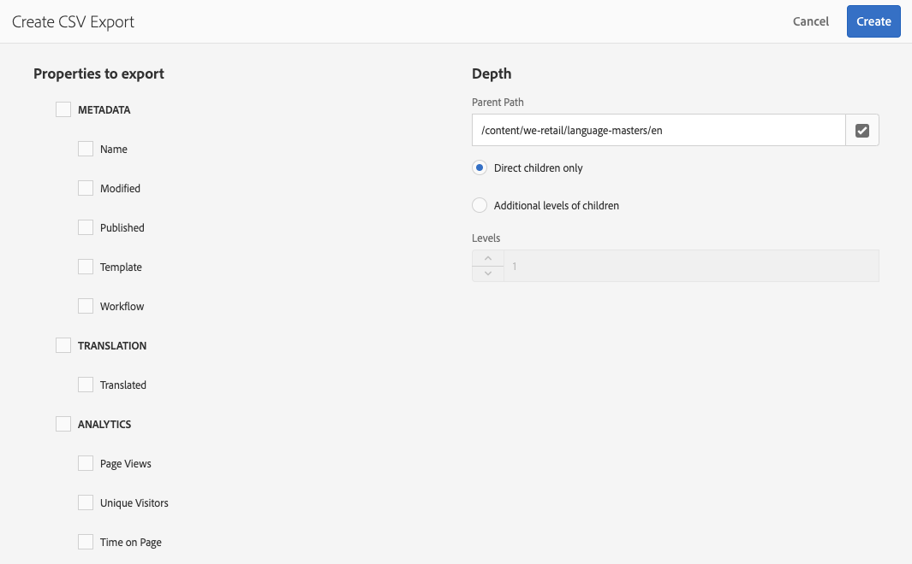

# Exporteren naar CSV{#export-to-csv}

**creeer CSV Rapport** laat u toe om informatie over uw pagina&#39;s naar een Csv- dossier op uw lokaal systeem uit te voeren.

* Het gedownloade bestand wordt `export.csv` genoemd
* De inhoud is afhankelijk van de eigenschappen die u selecteert.
* U kunt het pad samen met de diepte van het exporteren definiëren.

>[!NOTE]
>
>De downloadfunctie en de standaardbestemming van uw browser worden gebruikt.

**creeer CSV de tovenaar van de Uitvoer** laat u selecteren:

* Te exporteren eigenschappen
   * Metagegevens
      * Naam
      * gewijzigd
      * Gepubliceerd
      * Sjabloon
      * Workflow
   * Vertaling
      * Vertaald
   * Analyse
      * Paginaweergaven
      * Unieke bezoekers
      * Tijd op pagina
* Diepte
   * Bovenliggend pad
   * Alleen directe kinderen
   * Aanvullende niveaus voor kinderen
   * Niveaus

Het resulterende `export.csv` -bestand kan worden geopend in Excel of een andere compatibele toepassing.

Creëer **optie van het Rapport CSV** is beschikbaar wanneer het doorbladeren van de **3&rbrace; console van Plaatsen &lbrace;(in de mening van de Lijst): het is een optie van** creeer **drop-down menu:**

Een CSV-export maken:

1. Open de **console van Plaatsen**, navigeer aan de vereiste plaats indien nodig.
1. Selecteer op de werkbalk de optie **Maken** en vervolgens **CSV-rapport** om de wizard te openen:

   

1. Selecteer de eigenschappen die u wilt exporteren.
1. Selecteer **creeer**.
