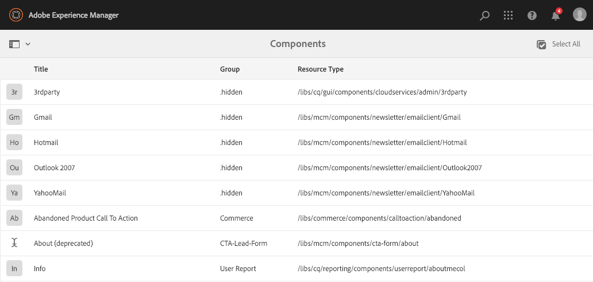
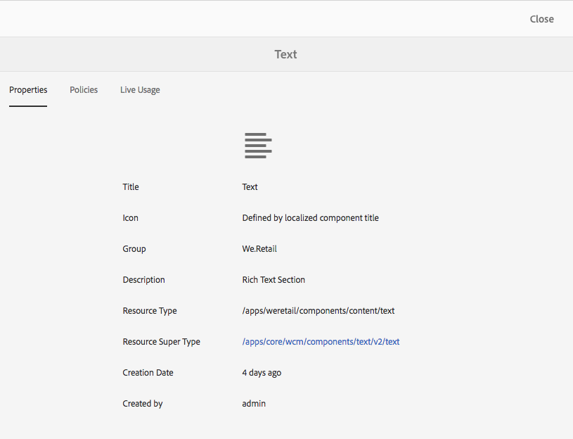

# Componentenconsole{#components-console}

De console van Componenten laat u door alle componenten doorbladeren die voor uw instantie worden bepaald en zeer belangrijke informatie voor elke component bekijken.

Het kan van **Hulpmiddelen worden betreden >** **Algemeen >** **Componenten**. In de console zijn de kaart- en de lijstweergave beschikbaar. Omdat er geen boomstructuur voor componenten is, is de kolomweergave niet beschikbaar.

>[!NOTE]
>
>In de componentconsole worden alle componenten in het systeem weergegeven. Browser van de Component [&#128279;](/help/sites-authoring/author-environment-tools.md#components-browser) toont componenten die aan auteurs beschikbaar zijn en verbergt om het even welke componentengroepen die met een periode ( `.`) beginnen.

## Zoeken {#searching}

Met het pictogram **Alleen content** (linksboven) kunt u het deelvenster **Zoeken** openen om de componenten te zoeken en/of te filteren:

### Componentdetails {#component-details}

Klik op de gewenste bron om details over een specifieke component weer te geven. Drie tabbladen bieden:

* **Eigenschappen**

  

  Op het tabblad Eigenschappen kunt u het volgende doen:

   * De algemene eigenschappen van de component weergeven.
   * Bekijk hoe het [ pictogram of de afkorting ](/help/sites-developing/components-basics.md#component-icon-in-touch-ui) voor de component zijn bepaald.

      * Als u op de bron van het pictogram klikt, gaat u naar die component.

   * Bekijk het **Type van Middel** en **Super Type van Middel** (als bepaald) voor de component.

      * Als u op het Super Type van Middel klikt, gaat u naar die component.

  >[!NOTE]
  >
  >Omdat `/apps` niet bewerkbaar is bij uitvoering, is de Componentenconsole alleen-lezen.

* **Beleid**

  

* **Levend Gebruik**

  

  >[!CAUTION]
  >
  >Vanwege de aard van de informatie die voor deze weergave wordt verzameld, kan het enige tijd duren voordat deze wordt gesorteerd of weergegeven.

* **Documentatie**

  Als de ontwikkelaar [ documentatie voor de component ](/help/sites-developing/developing-components.md#documenting-your-component) heeft verstrekt, zal het op de **Documentatie** tabel verschijnen. Als er geen beschikbare documentatie is, zal het **Documentatie** lusje niet worden getoond.

  
