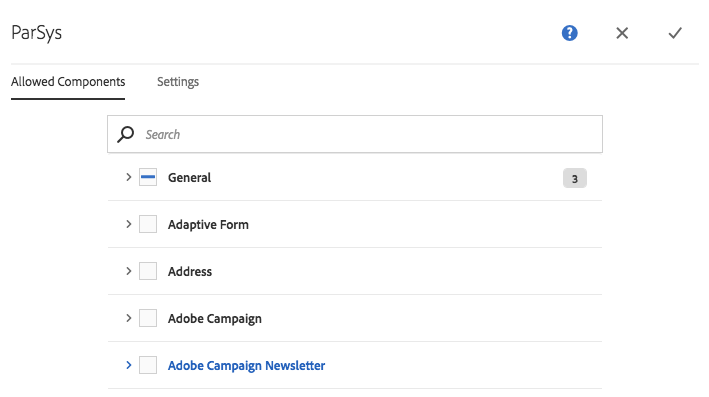

# Componenten configureren in ontwerpmodus{#configuring-components-in-design-mode}

Wanneer AEM instantie buiten de doos wordt geïnstalleerd, is een selectie van componenten onmiddellijk beschikbaar in Componentbrowser.

Daarnaast zijn er verschillende andere componenten beschikbaar. U kunt de wijze van het Ontwerp gebruiken om [dergelijke componenten toe te laten/onbruikbaar te maken](#enable-disable-components). Wanneer toegelaten en gevestigd op uw pagina kunt u de wijze van het Ontwerp dan gebruiken om aspecten van het componentenontwerp [te vormen](#configuring-the-design-of-a-component) door de attributenparameters uit te geven.

>[!NOTE]
>
>Bij het bewerken van deze componenten moet de nodige voorzichtigheid worden betracht. De ontwerpinstellingen vormen vaak een integraal onderdeel van het ontwerp van de gehele website. Ze moeten daarom alleen worden gewijzigd door iemand met de juiste bevoegdheden en ervaring, vaak een beheerder of een ontwikkelaar. Zie [Componenten ontwikkelen](/help/sites-developing/components.md) voor meer informatie.

>[!NOTE]
>
>De ontwerpmodus is alleen beschikbaar voor statische sjablonen. De malplaatjes die met editable malplaatjes worden gecreeerd zouden moeten worden uitgegeven gebruikend [malplaatjeredacteur](/help/sites-authoring/templates.md).

>[!NOTE]
>
>De ontwerpmodus is alleen beschikbaar voor ontwerpconfiguraties die zijn opgeslagen als inhoud onder ( `/etc`).
>
>Beginnend in AEM 6.4, wordt het geadviseerd om ontwerpen als configuratiegegevens onder `/apps` op te slaan om ononderbroken plaatsingsscenario&#39;s te steunen. Ontwerpen die zijn opgeslagen onder `/apps` kunnen niet worden bewerkt en de ontwerpmodus is niet beschikbaar voor gebruikers zonder beheerdersrechten voor dergelijke sjablonen.

Dit betekent dat u de onderdelen die zijn toegestaan in het alineasysteem voor de pagina, toevoegt of verwijdert. Het alineasysteem ( `parsys`) is een samengestelde component die alle andere alineacomponenten bevat. Met het alineasysteem kunnen auteurs componenten van verschillende typen aan een pagina toevoegen omdat deze alle andere alineacomponenten bevat. Elk alineatype wordt vertegenwoordigd als een component.

De inhoud van een productpagina kan bijvoorbeeld een alineasysteem bevatten dat het volgende bevat:

* Een afbeelding van het product (in de vorm van een afbeeldings- of textielafbeeldingsalinea)
* De productomschrijving (als tekstalinea)
* Een tabel met technische gegevens (als tabelalinea)
* Een formulier dat gebruikers invullen (als een formulier begint, formulierelement en alinea die eindigt met een formulier)

>[!NOTE]
>
>Zie [Componenten ontwikkelen](/help/sites-developing/components.md) en [Richtlijnen voor het gebruik van sjablonen en componenten](/help/sites-developing/dev-guidelines-bestpractices.md#guidelines-for-using-templates-and-components) voor meer informatie over `parsys`.

>[!CAUTION]
>
>Het bewerken van het ontwerp in de ontwerpmodus, zoals beschreven in dit artikel, is de aanbevolen manier om ontwerpen van statische sjablonen te definiëren
>
>Het aanpassen van ontwerpen in bijvoorbeeld CRX DE is geen goede praktijk en de toepassing van dergelijke ontwerpen kan van verwacht gedrag variëren. Zie het document [Paginasjablonen - Statisch](/help/sites-developing/page-templates-static.md#how-template-designs-are-applied) voor meer informatie.

## Componenten {#enable-disable-components} inschakelen/uitschakelen

Een component in- of uitschakelen:

1. Selecteer de modus **Design**.

   

1. Tik of klik op een component. Wanneer de component is geselecteerd, krijgt deze een blauwe rand.

   

1. Klik of tik **Bovenliggend** pictogram.

   

   Hiermee selecteert u het alineasysteem dat de huidige component bevat.

1. Het **Configure** pictogram voor het paragraafsysteem zal in de de actiebar van de ouder worden getoond.

   

   Selecteer deze optie om het dialoogvenster weer te geven.

1. In het dialoogvenster kunt u de componenten definiëren die beschikbaar zijn in de componentenbrowser wanneer u de huidige pagina bewerkt.

   

   Het dialoogvenster heeft twee tabbladen:

   * Toegestane componenten
   * Instellingen

   **Toegestane componenten**

   Op **Toegestane Componenten** lusje, bepaalt u welke componenten voor parsys beschikbaar zijn.

   * De componenten worden gegroepeerd op hun componentgroepen, die kunnen worden uitgevouwen en samengevouwen.
   * U kunt een hele groep selecteren door de naam van de groep te controleren. U kunt de selectie van alle groepen ongedaan maken door de selectie uit te schakelen.
   * Een min vertegenwoordigt minstens één maar niet alle punten in een groep worden geselecteerd.
   * Er is een zoekopdracht beschikbaar om naar een component op naam te filteren.
   * De tellingen die rechts van de naam van de componentengroep worden vermeld vertegenwoordigen het totale aantal geselecteerde componenten in die groepen ongeacht de filter.

   U definieert de configuratie per paginacomponent. Als onderliggende pagina&#39;s dezelfde sjabloon en/of paginacomponent gebruiken (gewoonlijk uitgelijnd), wordt dezelfde configuratie toegepast op het corresponderende alineasysteem.

   >[!NOTE]
   >
   >Adaptieve formuliercomponenten zijn ontworpen om te werken in de container van adaptieve formulieren met behulp van het Forms-ecosysteem. Daarom moeten deze componenten alleen worden gebruikt in een adaptieve formuliereditor en werken ze niet in de pagina-editor Sites.

   **Instellingen**

   Op het tabblad **Instellingen** kunt u aanvullende opties definiëren, zoals het tekenen van een anker voor elke component en het definiëren van de celopvulling van elke container.

1. Selecteer **Done** om uw configuratie op te slaan.

## Het vormen van het Ontwerp van een Component {#configuring-the-design-of-a-component}

1. Selecteer de modus **Design**.

   

1. Tik of klik op een component met een blauwe rand. In dit voorbeeld wordt een hoofdafbeeldingscomponent geselecteerd.

   

1. Gebruik **Configure** pictogram om de dialoog te openen.

   

   In het ontwerpdialoogvenster kunt u de component configureren op basis van de beschikbare ontwerpparameters.

   

   Het dialoogvenster heeft drie tabbladen:

   * Hoofd
   * Functies
   * Stijlen

   **Eigenschappen**

   Met het tabblad **Eigenschappen** kunt u de belangrijke ontwerpparameters van de component configureren. Voor een afbeeldingscomponent kunt u bijvoorbeeld de maximale en minimale grootte van de toegestane afbeelding definiëren.

   **Functies**

   Met het tabblad **Functies** kunt u extra functies van de component in- of uitschakelen. Voor een afbeeldingscomponent kunt u bijvoorbeeld de richting van de afbeelding, de beschikbare uitsnijdopties en of een afbeelding kan worden geüpload definiëren.

   **Stijlen**

   Op het tabblad **Stijlen** kunt u de CSS-klassen en -stijlen definiëren die met de component moeten worden gebruikt.

   

   Met de knop **Toevoegen** kunt u extra items toevoegen aan een lijst met meervoudige dialoogvensters.

   

   Gebruik het pictogram** Verwijderen **pictogram om een item uit een lijst met meervoudige items te verwijderen.

   

   Gebruik het pictogram **Verplaatsen** om de volgorde van items in een meervoudige-invoerdialooglijst te wijzigen.

   

1. Klik of tik **Done** pictogram om het dialoogvenster op te slaan en te sluiten.

