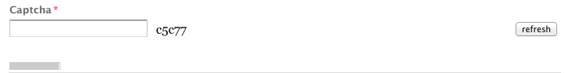

# Elementaire componenten {#foundation-components}

>[!CAUTION]
>
>De meeste Componenten van de Stichting zijn nu verouderd met AEM 6.5. Zie de [releaseopmerkingen](/help/release-notes/deprecated-removed-features.md) voor meer informatie.
>
>Adobe beveelt aan de modernere en uitbreidbare [kerncomponenten](https://docs.adobe.com/content/help/en/experience-manager-core-components/using/introduction.html) in AEM projecten te gebruiken. Deze maken deel uit van de [Wij.Retail steekproefinhoud](/help/sites-developing/we-retail.md) en kunnen ook afzonderlijk worden [geïnstalleerd en voor ontwikkeling](https://docs.adobe.com/content/help/en/experience-manager-core-components/using/get-started/using.html) door uw beheerder worden gebruikt.
>
>U kunt de [AEM Moderniseren Reeks](https://opensource.adobe.com/aem-modernize-tools/) van Hulpmiddelen gebruiken om uw op componenten-Gebaseerde plaats van de Stichting aan te passen om de Componenten van de Kern te gebruiken.

De basiscomponenten zijn ontworpen voor gebruik bij het ontwerpen van inhoud voor een standaardwebpagina. Zij vormen een ondergroep van de componenten beschikbaar uit-van-de-doos voor een standaardinstallatie van AEM.

Sommige zijn direct beschikbaar door componentenbrowser, diverse anderen zijn ook beschikbaar door [ontwerpwijze](/help/sites-authoring/default-components-designmode.md) te gebruiken (als de pagina op een statische malplaatje) of door het malplaatje [(als de pagina op een editable malplaatje gebaseerd is) uit te](/help/sites-authoring/templates.md) geven.

Het gebruik van stichtingscomponenten wordt gesteund, maar zij zijn hoofdzakelijk verouderd en vervangen door de Componenten van de Kern die meer rekbaarheid en flexibiliteit aanbieden.

>[!NOTE]
>
>Deze sectie bespreekt slechts componenten die uit-van-de-doos in een standaard AEM installatie beschikbaar zijn.
>
>Afhankelijk van uw instantie kunt u aangepaste componenten hebben die uitdrukkelijk voor uw vereisten worden ontwikkeld. Deze kunnen zelfs de zelfde naam hebben zoals sommige componenten die hier worden besproken.

De componenten zijn beschikbaar op het tabblad **Componenten** van het zijpaneel van de pagina-editor wanneer u een pagina [](/help/sites-authoring/editing-content.md)bewerkt.

U kunt een component selecteren en naar de gewenste locatie op de pagina slepen. U kunt het dan uitgeven gebruikend:

* [Eigenschappen configureren](/help/sites-authoring/editing-page-properties.md)
* [Inhoud bewerken](/help/sites-authoring/editing-content.md)

* [Inhoud bewerken - Modus Volledig scherm](/help/sites-authoring/editing-content.md#edit-content-full-screen-mode)

Componenten worden gesorteerd op basis van verschillende categorieën, componentgroepen genaamd, waaronder:

* [Algemeen](#general): Omvat basiscomponenten, met inbegrip van tekst, beelden, lijsten, en grafieken.
* [Kolommen](#columns): Bevat componenten die nodig zijn voor het ordenen van de lay-out van de inhoud.
* [Formulier](#formgroup): Bevat alle componenten die nodig zijn om een formulier te maken.

## Algemeen {#general}

De algemene componenten zijn de basiscomponenten die u gebruikt om inhoud te maken.

### Account-item {#account-item}

>[!CAUTION]
>
>Deze Foundation-component is vervangen. Adobe raadt u aan de [kerncomponenten](https://docs.adobe.com/content/help/en/experience-manager-core-components/using/introduction.html) te benutten.

U kunt een koppeling definiëren met een titel en beschrijving.


### Aangepaste afbeelding {#adaptive-image}

>[!CAUTION]
>
>Deze Foundation-component is vervangen. Adobe raadt u aan de [Image Core-component](https://docs.adobe.com/content/help/en/experience-manager-core-components/using/components/image.html) te gebruiken.

De stichtingscomponent Adaptive Image genereert afbeeldingen die zo zijn geschaald dat ze passen in het venster waarin de webpagina wordt geopend. Om de component te gebruiken, verstrekt u een beeldmiddel of van het dossiersysteem of DAM. Wanneer de webpagina wordt geopend, downloadt de webbrowser een kopie van de afbeelding waarvan het formaat is gewijzigd, zodat deze geschikt is voor het huidige venster.

De volgende kenmerken kunnen de grootte van het venster bepalen:

* Apparaatscherm: Op mobiele apparaten worden meestal webpagina&#39;s weergegeven, zodat deze zich over het hele scherm uitstrekken.
* Venstergrootte van webbrowser: Gebruikers van laptop- en desktopcomputers kunnen het formaat van vensters in webbrowsers wijzigen.

De component genereert bijvoorbeeld een kleine afbeelding wanneer de webpagina op een mobiele telefoon wordt geopend en een afbeelding van middelgrote grootte wanneer deze op een tablet wordt geopend. Op een laptop maakt en levert de component een grote afbeelding wanneer de pagina wordt geopend in een gemaximaliseerde webbrowser. Wanneer de grootte van de webbrowser wordt aangepast aan een gedeelte van het scherm, past de component zich aan door een kleinere afbeelding te leveren en wordt de weergave vernieuwd.

#### Ondersteunde afbeeldingsindelingen {#supported-image-formats}

U kunt afbeeldingsbestanden met de volgende bestandsnaamextensies gebruiken met de component Adaptive Image:

* .jpg
* .jpeg
* .png
* .gif **

>[!CAUTION]
>
>Geanimeerde GIF-bestanden worden niet ondersteund in AEM voor adaptieve uitvoeringen.

#### Afbeeldingsgrootten en -kwaliteit {#images-sizes-and-quality}

In de volgende tabel wordt de breedte weergegeven van de afbeelding die wordt gegenereerd voor de opgegeven breedte van de viewport. De hoogte van de gegenereerde afbeelding wordt berekend om een constante hoogte-breedteverhouding te behouden en er wordt geen witruimte weergegeven binnen de afbeeldingsrand. Uitsnijden kan worden gebruikt om witruimte te voorkomen.

Wanneer de afbeelding een JPEG-afbeelding is, kan de grootte van de viewport ook de JPEG-kwaliteit beïnvloeden. De volgende JPEG-kwaliteiten zijn mogelijk:

* Laag (0,42)
* Normaal (0,82)
* Hoog (1,00)

| **Breedtebereik van viewport (pixels)** | **Breedte afbeelding (pixels)** | **JPEG-kwaliteit** | **Type doelapparaat** |
|---|---|---|---|
| width &lt;= 319 | 320 | laag |  |
| width = 320 | 320 | medium | Mobiele telefoon (staand) |
| 320 &lt; breedte &lt; 481 | 480 | medium | Mobiele telefoon (liggend) |
| 480 &lt; breedte &lt; 769 | 476 | hoog | Tablet (staand) |
| 768 &lt; breedte &lt; 1025 | 620 | hoog | Tablet (liggend) |
| breedte &lt;= 1025 | full (oorspronkelijke grootte) | hoog | Desktop |

#### Eigenschappen {#properties}

In het dialoogvenster kunt u eigenschappen bewerken voor uw instantie van de component Adaptief beeld, die veel gemeen hebben met de component Image waarop deze is gebaseerd. De eigenschappen zijn beschikbaar op twee tabbladen:

* **Afbeelding**

   * **Afbeelding** slepen vanaf de zoekfunctie voor inhoud of klik om een bladervenster te openen waarin u een afbeelding kunt laden. Nadat de afbeelding is geladen, kunt u de afbeelding uitsnijden, roteren of verwijderen. Als u wilt in- of uitzoomen op de afbeelding, gebruikt u de schuifbalk onder de afbeelding (boven de knoppen OK en Annuleren)

   * **Een afbeelding uitsnijden**. Sleep de rand om de afbeelding uit te snijden.

   * **Roteer** Klik herhaaldelijk op Roteren totdat de afbeelding naar wens is geroteerd.

   * **Wis** verwijder de huidige afbeelding.

* **Geavanceerd**

   * **Titel** De component Adaptieve afbeelding gebruikt deze eigenschap niet.

   * **Alt Text** The alternate text to use for the image.

   * **Koppelingen naar** de component Adaptieve afbeelding maken geen gebruik van deze eigenschap.

   * **Beschrijving** De component Adaptieve afbeelding gebruikt deze eigenschap niet.

#### De component Adaptieve afbeelding uitbreiden {#extending-the-adaptive-image-component}

Zie [Werken met de component](/help/sites-developing/responsive.md#using-adaptive-images)Adaptieve afbeelding voor informatie over het aanpassen van de component Adaptieve afbeelding.

### Carousel {#carousel}

>[!CAUTION]
>
>Deze Foundation-component is vervangen. Adobe raadt aan de [Carousel Core Component](https://docs.adobe.com/content/help/en/experience-manager-core-components/using/components/carousel.html) te benutten.

Met de Carousel-component kunt u afbeeldingen weergeven die aan afzonderlijke pagina&#39;s zijn gekoppeld:

* één voor één
* voor korte tijd
* in een volgorde die u opgeeft
* met een door u opgegeven tijdvertraging

Met de besturingselementen waarop u kunt klikken, kan de gebruiker de weergegeven pagina&#39;s ook in real-time doorlopen, op aanvraag. Als u op de pagina klikt die momenteel zichtbaar is, gaat u naar die pagina. Met andere woorden, de Carousel fungeert als navigatiecontrole.

#### Eigenschappen {#properties-1}

Deze zijn beschikbaar in twee tabbladen:

* **Carousel** Hier geeft u op hoe de carrousel werkt:

   * AfspeelsnelheidDe tijd in milliseconden voordat de volgende dia wordt weergegeven.
   * Overgangstijd Tijd in milliseconden voor de overgang tussen twee dia&#39;s.
   * Besturingselementen StyleVarious-opties zijn beschikbaar in een keuzemenu. Bijvoorbeeld, Vorige/Volgende Knopen, Hoogste - juiste Schakelaars.

* **Lijst**

   Hier geeft u op hoe pagina&#39;s in uw carrousel moeten worden opgenomen:

   * **Lijst maken met gebruik van**Er zijn verschillende manieren om een paginalijst samen te stellen: Onderliggende pagina&#39;s, Vaste lijst, Zoeken of Geavanceerd zoeken (alle hieronder beschreven mogelijkheden).
Welke methode u ook kiest, op de pagina&#39;s die u in de lijst opneemt, is er al een afbeelding gekoppeld aan de pagina. Dit is de afbeelding die in de carrousel wordt weergegeven. Als er geen afbeelding is voor een bepaalde pagina onder de Pagina-eigenschappen van die pagina, moet u een afbeelding aan de pagina koppelen voordat u begint, omdat de carrousel anders een lege (of meestal lege) pagina weergeeft. Zie Pagina-eigenschappen [bewerken](/help/sites-authoring/editing-page-properties.md).
Afhankelijk van het item dat u kiest, wordt een nieuw deelvenster weergegeven:

      * **Opties voor onderliggende pagina&#39;s**

         * **Bovenliggende pagina** Geef een pad handmatig of met de kiezer op. Laat leeg als u de huidige pagina als bovenliggend item wilt gebruiken.
      * **Opties voor vaste lijst**

         * **Pagina&#39;s** Selecteer een lijst met pagina&#39;s. Gebruiken 
`+` om meer items toe te voegen en de knoppen Omhoog en Omlaag om de volgorde aan te passen.
      * **Zoekopties**

         * **Start in** Voer een beginpad in, handmatig of met de kiezer.

         * **Zoekopdracht** U kunt een zoekquery voor onbewerkte tekst invoeren.
      * **Opties voor Geavanceerd zoeken**

         * **Querybuilder voorspelt aantekening**U kunt een onderzoeksvraag ingaan gebruikend de predicaataantekening van de Bouwer Querybuilder. U kunt bijvoorbeeld &quot;fulltext=Marketing&quot; invoeren om alle pagina&#39;s met &quot;Marketing&quot; in de inhoud weer te geven in de carrousel.
Zie [QueryBuilder API](/help/sites-developing/querybuilder-api.md) voor volledige bespreking van vraaguitdrukkingen en verdere voorbeelden.
   * **Volgorde bij** selecteren 
`jcr:title`, `jcr:created`, `cq:lastModified`of `cq:template` uit het vervolgkeuzemenu.

   * **Beperk** het maximumaantal items dat u in de carrousel wilt gebruiken; dit is optioneel.


>[!NOTE]
>
>U kunt een aangepaste carrouselcomponent voor Adobe Experience Manager maken die digitale elementen weergeeft die zich in de AEM DAM bevinden. Zie Aangepaste carrouselcomponenten [maken voor Adobe Experience Manager](https://helpx.adobe.com/experience-manager/using/custom-carousel-components.html)voor meer informatie.

### Diagram {#chart}

>[!CAUTION]
>
>Deze Foundation-component is vervangen. Adobe raadt u aan de [kerncomponenten](https://docs.adobe.com/content/help/en/experience-manager-core-components/using/introduction.html) te benutten.

Met de component Diagram kunt u een balk, lijn of cirkeldiagram toevoegen. AEM maakt een grafiek op basis van de gegevens die u opgeeft. U verstrekt gegevens door direct in het lusje van Gegevens te typen of door een spreadsheet te kopiëren en te kleven.

* **Gegevens**

   * **De Gegevens** van de grafiek gaan uw grafiekgegevens in gebruikend het formaat CSV; In de indeling Door komma&#39;s gescheiden waarden worden komma&#39;s (&quot;,&quot;) gebruikt als veldscheidingsteken.

* **Geavanceerd**

   * **Selecteer het Type** van grafiek uit de Grafiek van het Schijf, de Grafiek van de Lijn, en de Grafiek van de Bar.

   * **Alternatieve tekst** Alternatieve tekst die wordt weergegeven in plaats van het diagram.

   * **Breedte** van het diagram in pixels.

   * **Hoogte** van het diagram in pixels.

In het volgende voorbeeld ziet u een voorbeeld van diagramgegevens, gevolgd door het resulterende staafdiagram:

 

>[!NOTE]
>
>U kunt een aangepast AEM grafiekbesturingselement maken dat gegevens weergeeft die zich in de AEM JCR bevinden. Zie Adobe Experience Manager-gegevens [weergeven in een grafiek](https://helpx.adobe.com/experience-manager/using/displaying-experience-manager-data-chart.html)voor meer informatie.

### Inhoudsfragment {#content-fragment}

>[!CAUTION]
>
>Deze Foundation-component is vervangen. Adobe raadt u aan de [Content Fragment Core Component](https://docs.adobe.com/content/help/en/experience-manager-core-components/using/components/content-fragment-component.html) te gebruiken.

[Inhoudsfragmenten](/help/sites-authoring/content-fragments.md) worden gemaakt en beheerd als pagina-onafhankelijke elementen. Vervolgens kunt u deze fragmenten en de variaties ervan gebruiken bij het ontwerpen van de inhoudspagina&#39;s.

### Design Importer {#design-importer}

>[!CAUTION]
>
>Deze Foundation-component is vervangen. Adobe raadt u aan de [kerncomponenten](https://docs.adobe.com/content/help/en/experience-manager-core-components/using/introduction.html) te benutten.

Hierdoor kunt u een ZIP-bestand met een ontwerppakket uploaden.

### Downloaden {#download}

>[!CAUTION]
>
>Deze Foundation-component is vervangen. Adobe raadt u aan de [kerncomponenten](https://docs.adobe.com/content/help/en/experience-manager-core-components/using/introduction.html) te benutten.

De component Download maakt een koppeling op de geselecteerde webpagina om een specifiek bestand te downloaden. U kunt middelen van de Vinder van de Inhoud slepen of een dossier uploaden.

* **Downloaden**

   * **Beschrijving** Een korte beschrijving die wordt weergegeven met de downloadkoppeling.

   * **Bestand** dat kan worden gedownload op de resulterende webpagina. Sleep een element uit de zoekfunctie voor inhoud of klik in het gebied om het bestand te uploaden dat u wilt downloaden.

In het volgende voorbeeld wordt de component Download getoond in Geometrixx:


### External {#external}

>[!CAUTION]
>
>Deze Foundation-component is vervangen. Adobe raadt u aan de [kerncomponenten](https://docs.adobe.com/content/help/en/experience-manager-core-components/using/introduction.html) te benutten.

Met de externe component voor toepassingsintegratie (**Extern**) kunt u externe toepassingen met een iframe insluiten in uw AEM.

* **Extern**

   * **Doeltoepassing** Geef de URL op van de webtoepassing die moet worden geïntegreerd; bijvoorbeeld:

      ```
      https://en.wikipedia.org/wiki/Main_Page
      ```

   * **Geef parameters** door. Schakel het selectievakje in als de parameters moeten worden doorgegeven aan de toepassing als dat nodig is.

   * **Breedte en Hoogte**De grootte van het iframe definiëren

De externe toepassing is geïntegreerd in het alineasysteem van de AEM. bijvoorbeeld bij het gebruik van een doeltoepassing van `https://en.wikipedia.org/wiki/Main_Page`:


>[!NOTE]
>
>Afhankelijk van uw gebruiksscenario zijn er bijvoorbeeld andere opties beschikbaar voor de integratie van externe toepassingen. de [integratie van Portlets](/help/sites-administering/aem-as-portal.md).

### Flash {#flash}

>[!CAUTION]
>
>Deze Foundation-component is vervangen. Adobe raadt u aan de [kerncomponenten](https://docs.adobe.com/content/help/en/experience-manager-core-components/using/introduction.html) te benutten.

Met de component Flash kunt u een Flash-film laden. U kunt een Flash-element van de zoeker naar de component slepen of u kunt het dialoogvenster gebruiken:

* **Flash**

   * **Flash-film**

      Het Flash-filmbestand. Sleep een element van de zoekfunctie voor inhoud of klik om een bladervenster te openen.

   * **Grootte**

      Dimension in pixels van het weergavegebied dat de film bevat.

* **Alternatieve afbeelding**

   Een alternatieve afbeelding die moet worden weergegeven

* **Geavanceerd**

   * **Contextmenu**

      Geeft aan of het contextmenu moet worden weergegeven of verborgen.

   * **Venstermodus**

      Hoe het venster eruitziet, bijvoorbeeld dekkend, transparant of als een duidelijk (effen) venster.

   * **Achtergrondkleur**

      Een achtergrondkleur die is geselecteerd in het kleurendiagram dat wordt weergegeven.

   * **Minimumversie**

      De minimale versie van Adobe Flash Player die is vereist om de film uit te voeren. De standaardwaarde is 9.0.0.

   * **Attributen**

      Eventuele andere vereiste kenmerken.

### Image {#image}

>[!CAUTION]
>
>Deze Foundation-component is vervangen. Adobe raadt u aan de [Image Core-component](https://docs.adobe.com/content/help/en/experience-manager-core-components/using/components/image.html) te gebruiken.

De component image geeft een afbeelding weer en de bijbehorende tekst volgens de opgegeven parameters.

U kunt een afbeelding uploaden, deze vervolgens bewerken en bewerken (bijv. uitsnijden, roteren, koppeling/titel/tekst toevoegen).

U kunt een afbeelding van de [middelenbrowser](/help/sites-authoring/author-environment-tools.md#assets-browser) rechtstreeks naar de component slepen of het dialoogvenster [Configureren](/help/sites-authoring/editing-content.md#component-edit-dialog)ervan. U kunt een beeld van de Configure dialoog ook uploaden; dit dialoogvenster bevat ook alle definities en bewerkingen van de afbeelding :


Als de afbeelding eenmaal is geüpload (en niet eerder), kunt u de afbeelding naar wens [op plaats bewerken](/help/sites-authoring/editing-content.md#edit-content) om de afbeelding uit te snijden of te roteren:


>[!NOTE]
>
>De editor op locatie gebruikt de oorspronkelijke grootte en hoogte-breedteverhouding van de afbeelding tijdens het bewerken. U kunt ook de eigenschappen voor hoogte en breedte opgeven. Beperkingen voor grootte en hoogte-breedteverhouding die in de eigenschappen zijn gedefinieerd, worden toegepast wanneer u de bewerkingswijzigingen opslaat.
>
>Afhankelijk van uw exemplaar, kunnen de minimum en maximumbeperkingen ook door het [ontwerp van de pagina](/help/sites-developing/designer.md)worden opgelegd; deze worden ontwikkeld tijdens de uitvoering van het project .

In de modus Volledig scherm zijn verschillende aanvullende opties beschikbaar. bijvoorbeeld toewijzen en zoomen:


>[!NOTE]
>
>De voortgang van het uploaden kan niet worden gecontroleerd met Internet Explorer.
>
>Gebruikers van Internet Explorer moeten de afbeelding uploaden en op **OK** klikken. Vervolgens opent u de afbeelding opnieuw om het geüploade bestand in de voorvertoning weer te geven en wijzigingen uit te voeren (bijsnijden).
>
>Zie de sectie [Certified Platforms](/help/release-notes/release-notes.md#certifiedplatforms) voor meer informatie over HTML5-functies die door AEM worden gebruikt.

Wanneer een beeld wordt geladen, kunt u het volgende vormen:

* **Kaart**

   Als u een afbeelding wilt toewijzen, selecteert u Kaart. U kunt opgeven hoe u de afbeelding met hyperlinks wilt maken (rechthoek, veelhoek enzovoort) en waar het gebied naartoe moet wijzen.

* **Uitsnijden**

   Selecteer Uitsnijden om een afbeelding uit te snijden. Gebruik de muis om de afbeelding uit te snijden.

* **Roteren**

   Selecteer Roteren als u een afbeelding wilt roteren. Herhaal deze bewerking totdat de afbeelding op de gewenste manier is geroteerd.

* **Wissen**

   Verwijder de huidige afbeelding.

* **Titel**

   De titel van de afbeelding.

* **Alt-tekst**

   Een alternatieve tekst die kan worden gebruikt bij het maken van toegankelijke inhoud.

* **Koppelen naar**

   Maak een koppeling naar elementen of andere pagina&#39;s binnen uw website.

* **Beschrijving**

   Een beschrijving van de afbeelding.

* **Grootte**

   Hiermee stelt u de hoogte en de breedte van de afbeelding in.

>[!NOTE]
>
>Sommige opties zijn alleen beschikbaar in de volledige-schermeditor.

De uiteindelijke afbeelding (met **Titel** en **Beschrijving**) kan worden weergegeven als:


### Layout Container {#layout-container}

Deze component verstrekt een net-paragraaf systeem om u toe te staan om componenten binnen een [ontvankelijk net](/help/sites-authoring/responsive-layout.md)toe te voegen en te plaatsen. Op deze manier kunt u verschillende lay-outs voor inhoud definiëren op basis van de breedte van doelapparaten, waaronder een reeks telefoons, tablets en het bureaublad.


>[!NOTE]
>
>Deze component is geïmplementeerd met [HTML-sjabloontaal (HTML Template Language)](https://docs.adobe.com/content/help/en/experience-manager-htl/using/overview.html).

### Lijst {#list}

>[!CAUTION]
>
>Deze Foundation-component is vervangen. Adobe raadt u aan de [List Core-component](https://docs.adobe.com/content/help/en/experience-manager-core-components/using/components/list.html) te gebruiken.

Met de component List kunt u zoekcriteria configureren voor het weergeven van een lijst:

* **Lijst**

   * **Lijst samenstellen met**

      Hier geeft u op waar de inhoud van de lijst wordt opgehaald. Er zijn verschillende methoden:

   * Afhankelijk van het item dat u kiest, wordt een nieuw deelvenster weergegeven:

      * **Opties voor onderliggende pagina&#39;s**

         * **Onderliggende niveaus van** (bovenliggende pagina)

            Geef een pad handmatig of met de kiezer op. Laat leeg als u de huidige pagina als bovenliggend item wilt gebruiken.
      * **Opties voor vaste lijst**

         * **Pagina&#39;s**

            Selecteer een lijst met pagina&#39;s. Gebruik + om meer items toe te voegen en klik op de knop Omhoog/Omlaag om de volgorde aan te passen.
      * **Zoekopties**

         * Starten in

            Voer handmatig of met de kiezer een beginpad in.

         * Zoekquery

            U kunt een zoekquery voor normale tekst invoeren.
      * **Opties voor Geavanceerd zoeken**

         * **Querybuilder prediknotatie**

            U kunt een onderzoeksvraag ingaan gebruikend Querybuilder prediknotatie. U kunt bijvoorbeeld &quot;fulltext=Marketing&quot; invoeren om alle pagina&#39;s met &quot;Marketing&quot; in de inhoud weer te geven in de carrousel.

            Zie [QueryBuilder API](/help/sites-developing/querybuilder-api.md) voor volledige bespreking van vraaguitdrukkingen en verdere voorbeelden.
      * **Tags**

         Geef de **bovenliggende pagina**, de **tags/trefwoorden** en de criteria op die u wilt gebruiken.
   * **Weergeven als**

      Hoe je de objecten wilt aanbieden; Dit zijn onder andere koppelingen, lesgevers en nieuws.

   * **Volgorde van**

      Of de lijst moet worden besteld en, zo ja, welke criteria moeten worden gebruikt voor sorteren. U kunt criteria invoeren of een criteria selecteren in de opgegeven vervolgkeuzelijst.

   * **Limiet**

      Geef het maximumaantal items op dat u in de lijst wilt weergeven.

   * **Feed inschakelen**

      Geeft aan of een RSS-feed voor de lijst moet worden geactiveerd.

   * **Pagineren na**

      Hier kunt u het aantal lijstitems opgeven dat tegelijkertijd moet worden weergegeven. Een lijst met meer items dan opgegeven gebruikt paginering om de lijst in verschillende delen weer te geven.


In het volgende voorbeeld ziet u hoe een component **List** een lijst met onderliggende pagina&#39;s weergeeft (het ontwerp wordt bepaald door de aangepaste CSS-definities van een siteontwerp).


### Aanmelden {#login}

>[!CAUTION]
>
>Deze Foundation-component is vervangen. Adobe raadt u aan de [kerncomponenten](https://docs.adobe.com/content/help/en/experience-manager-core-components/using/introduction.html) te benutten.

Hier vindt u de velden Gebruikersnaam en Wachtwoord.


U kunt configureren:

* Aanmelden

   * Sectielabel

      Invultekst voor de invoervelden.

   * Label voor gebruikersnaam

      Tekst die een label moet geven aan het veld gebruikersnaam.

   * Wachtwoordlabel

      Tekst om het wachtwoordveld een label te geven.

   * Label van de knop Aanmelden

      Tekst voor de aanmeldknop.

   * Omleiden naar

      U kunt de pagina op uw website opgeven die moet worden geopend nadat de gebruiker zich heeft aangemeld.

* Al aangemeld

   * Doorgaan, knoplabel

      Tekst die aangeeft dat de gebruiker al is aangemeld.

### Status van bestelling {#order-status}

* **Titel**

   * **Titel**

      Geef de titeltekst op die u wilt weergeven.

   * **Koppeling**

      Geef de pagina (het product) op waarvoor de status van de bestelling moet worden weergegeven.

   * **Type/Grootte**

      Maak een keuze uit de beschikbare selectie.


### Referentie {#reference}

>[!CAUTION]
>
>Deze Foundation-component is vervangen. Adobe raadt u aan de [Content Fragment Core Component](https://docs.adobe.com/content/help/en/experience-manager-core-components/using/components/content-fragment-component.html) te gebruiken.

Met de **component Reference** kunt u naar tekst van een andere pagina van uw AEM website verwijzen (binnen de huidige instantie). De inhoud van de alinea waarnaar wordt verwezen, wordt weergegeven alsof deze zich op de huidige pagina bevindt. De inhoud wordt bijgewerkt wanneer de bronalinea verandert (mogelijk moet de pagina worden vernieuwd).

* **Alineaslaggids**

   * **Referentie**

      Geef het pad op naar de pagina en alinea waarnaar u wilt verwijzen (inhoud opnemen).

Als u het pad naar een alinea wilt opgeven, moet u het pad (op de pagina) achtervoegsel geven met:

`.../jcr:content/par/<paragraph-ID>`

Bijvoorbeeld:

`/content/geometrixx-outdoors/en/equipment/biking/cajamara/jcr:content/par/similar-products`

Naast het verwijzen naar een specifieke alinea, kan het pad ook worden gewijzigd om een volledig pari-systeem op te geven. U kunt dit doen door het pad te voorzien van:

`/jcr:content/par`

Bijvoorbeeld:

`/content/geometrixx-outdoors/en/equipment/biking/cajamara/jcr:content/par`

Zodra gevormd zal de inhoud precies zoals op de bronpagina verschijnen. Het feit dat dit een verwijzing is, wordt alleen weergegeven wanneer u de component opent voor bewerking:


### Zoeken {#searching}

>[!CAUTION]
>
>Deze Foundation-component is vervangen. Adobe raadt u aan de Core-component [](https://docs.adobe.com/content/help/en/experience-manager-core-components/using/components/quick-search.html) Snel zoeken te gebruiken.

De component van het Onderzoek voegt onderzoeksmogelijkheden aan uw pagina toe.

U kunt configureren:

* Zoeken

   * **Knooppunttypen**

      Als de zoekopdracht moet worden beperkt tot een specifieke lijst van knooppunttypen, moeten deze hier worden vermeld; bijvoorbeeld `cq:Page`.

   * **Pad om in te zoeken**

      Geef de basispagina op van de vertakking die u wilt zoeken.

   * **Tekst van knop Zoeken**

      De naam die wordt weergegeven op de werkelijke zoekknop.

   * **Statistische tekst**

      De tekst die boven de zoekresultaten wordt weergegeven.

   * **Geen resultaattekst**

      Als er geen resultaten zijn, wordt de hier ingevoerde tekst weergegeven.

   * **Spellcheck-tekst**

      Als iemand een gelijkaardige termijn ingaat, wordt deze tekst getoond vóór de termijn.
Als u bijvoorbeeld geometrie typt, wordt &#39;&#39;Bedoelde u?&#39;&#39; weergegeven in het systeem. geometrixx&quot;.

   * **Tekst op vergelijkbare pagina&#39;s**

      De tekst die wordt weergegeven naast een resultaat voor vergelijkbare pagina&#39;s. Klik op deze koppeling om pagina&#39;s met vergelijkbare inhoud weer te geven.

   * **Tekst verwante zoekopdrachten**

      De tekst die naast onderzoeken naar verwante termijnen en onderwerpen verschijnt.

   * **Tekst voor trends zoeken**

      De titel boven de zoektermen die gebruikers invoeren.

   * **Label voor resultaatpagina&#39;s**

      De tekst die onder aan deze lijst wordt weergegeven met koppelingen naar andere resultatenpagina&#39;s.

   * **Vorige label**

      De naam die wordt weergegeven op de koppeling naar vorige zoekpagina&#39;s.

   * **Volgende label**

      De naam die wordt weergegeven op de koppeling naar volgende zoekpagina&#39;s.

In het volgende voorbeeld ziet u de component Search na een zoekopdracht naar het woord *geometrixx* in de hoofdmap van een standaardinstallatie. Dit illustreert ook de paginering van resultaten:


In het volgende voorbeeld wordt een zoekterm getoond die verkeerd is gespeld en niet beschikbaar is:


### Sitemap {#sitemap}

>[!CAUTION]
>
>Deze Foundation-component is vervangen. Adobe raadt aan in plaats daarvan gebruik te maken van de [Navigatie](https://docs.adobe.com/content/help/en/experience-manager-core-components/using/components/navigation.html), [Taalnavigatie](https://docs.adobe.com/content/help/en/experience-manager-core-components/using/components/language-navigation.html)en [Breadcrumb Core-componenten](https://docs.adobe.com/content/help/en/experience-manager-core-components/using/components/breadcrumb.html) .

Een automatische sitemapvermelding die (met de standaardinstellingen) alle pagina&#39;s (als actieve koppelingen) op de huidige website weergeeft. Een extract toont bijvoorbeeld:


Indien nodig kunt u configureren:

* **Sitemap**

   * **Hoofdpad**

      Pad vanaf waar de aanbieding moet beginnen.

### Presentatie {#slideshow}

>[!CAUTION]
>
>Deze Foundation-component is vervangen. Adobe raadt aan de [Carousel Core Component](https://docs.adobe.com/content/help/en/experience-manager-core-components/using/components/carousel.html) te benutten.

Met deze component kunt u een reeks afbeeldingen laden die als een diapresentatie op de pagina worden weergegeven. U kunt afbeeldingen toevoegen of verwijderen en elke titel toewijzen. Onder Geavanceerd kunt u ook de grootte van het weergavegebied opgeven.

U kunt configureren:

* **Dia&#39;s**

   * **Nieuwe dia**

      U kunt een selectie van dia&#39;s specificeren gebruikend de **Add** (en **verwijdert**) knopen.

   * **Titel**

      Geef indien nodig een titel op. Dit wordt bedekt op de aangewezen dia.

* **Geavanceerd**

   * **Grootte**

      Geef de breedte en hoogte op in pixels.

In de diapresentatie-component worden vervolgens herhaaldelijk alle elementen gedurende een korte periode op volgorde weergegeven, voordat de volgende dia wordt vervaagd:


### Tabel {#table}

>[!CAUTION]
>
>Deze Foundation-component is vervangen. Adobe raadt u aan de [Text Core-component](https://docs.adobe.com/content/help/en/experience-manager-core-components/using/components/text.html) te gebruiken.

>[!NOTE]
>
>De component van de Veerling van de **Lijst** is gebaseerd op de redacteur [van de Tekst](/help/sites-authoring/rich-text-editor.md)Rich, zoals de Component van de Stichting van de **[Tekst](#text)** is.

De **component van de Lijst** wordt preconfigured om u te laten een lijst construeren, vullen en formatteren. Met behulp van het dialoogvenster kunt u uw tabel configureren en de inhoud maken door:

* helemaal opnieuw
* het kopiëren en het kleven van een spreadsheet of een lijst van een externe redacteur (zoals Excel, OpenOffice, Blocnote, enz.).

Met de inline editor kunt u basiswijzigingen in de inhoud aanbrengen:


In de modus Volledig scherm kunt u de tabellay-out configureren:


In de volgende schermafbeelding ziet u een voorbeeld van de tabelcomponent. het ontwerp wordt bepaald door de locatiespecifieke CSS:


### Cloud labelen {#tag-cloud}

Een tagcloud geeft een grafisch weergegeven selectie van de tags die zijn toegepast op de inhoud van uw website:


Wanneer u de component Tag Cloud configureert, kunt u het volgende opgeven:

* **Weer te geven labels**

   Waar de weer te geven tags worden verzameld. Selecteer op een pagina een pagina met alle onderliggende codes of alle codes.

* **Pagina**

   Selecteer de pagina waarnaar moet worden verwezen.

* **Geen koppelingen op tags**

   Of de weergegeven tags moeten fungeren als koppelingen.

Voor meer informatie over het toepassen van labels gaat u naar [Tags](/help/sites-authoring/tags.md)gebruiken.

### Tekst {#text}

>[!CAUTION]
>
>Deze Foundation-component is vervangen. Adobe raadt u aan de [Text Core-component](https://docs.adobe.com/content/help/en/experience-manager-core-components/using/components/text.html) te gebruiken.

>[!NOTE]
>
>De component van de Veerling van de **Tekst** is gebaseerd op de redacteur [van de](/help/sites-authoring/rich-text-editor.md)RTF, zoals de Component van de Stichting van de **Lijst** is.

De component van de Tekst laat u een tekstblok ingaan gebruikend een redacteur WYSIWYG, met functionaliteit die door de [Rich redacteur](/help/sites-authoring/rich-text-editor.md)van de Tekst wordt verstrekt. Met een selectie pictogrammen kunt u tekst opmaken, inclusief lettertypekenmerken, uitlijning, koppelingen, lijsten en inspringing.


Wanneer u het dialoogvenster **Configureren** opent, kunt u ook het volgende instellen:

* **Spacer**
* **Tekststijl**

De opgemaakte tekst wordt dan op de pagina weergegeven. het daadwerkelijke ontwerp is afhankelijk van de site-CSS:


Voor meer gedetailleerde informatie over de component van de Tekst en de functionaliteit die door de Rich redacteur van de Tekst wordt verstrekt, zie de pagina van de Redacteur [van de Tekst](/help/sites-authoring/rich-text-editor.md) Rich.

#### Op plaats bewerken {#inplace-editing}

Naast de op een dialoogvenster gebaseerde bewerkingsmodus voor RTF-tekst, biedt AEM ook [Inplace Editing](/help/sites-authoring/editing-content.md), waarmee de tekst direct kan worden bewerkt zoals deze wordt weergegeven in de lay-out van de pagina.

### Tekst en afbeelding {#text-image}

>[!CAUTION]
>
>Deze Foundation-component is vervangen. Adobe raadt u aan de [Image](https://docs.adobe.com/content/help/en/experience-manager-core-components/using/components/image.html) and [Text Core Component](https://docs.adobe.com/content/help/en/experience-manager-core-components/using/components/text.html) te gebruiken.

De component Tekst en afbeelding voegt een tekstblok en een afbeelding toe. U kunt ook afzonderlijk tekst en afbeeldingen toevoegen en bewerken. Zie de componenten [Tekst](#text) en [Afbeelding](#image) voor meer informatie.


U kunt configureren:

* **Componentstijlen** (**stijlen**)

   Hier kunt u de afbeelding links of rechts uitlijnen. De standaardinstelling is **Links** uitgelijnd, met de afbeelding aan de linkerkant.

* **Afbeeldingseigenschappen** (**geavanceerde afbeeldingseigenschappen**)

   Hier kunt u het volgende opgeven:

   * **Afbeeldingselement**

      Upload de vereiste afbeelding.

   * **Titel**

      de titel van het blok; wordt weergegeven door mouseover.

   * **Alt-tekst**

      Alternatieve tekst die moet worden weergegeven als de afbeelding niet kan worden weergegeven. Als de titel leeg wordt gelaten, wordt deze gebruikt.

   * **Koppeling naar**

      Geef een doelpad op.

   * **Beschrijving**

      Een beschrijving van de afbeelding.

   * **Grootte**

      Hiermee stelt u de hoogte en breedte van de afbeelding in.

In het volgende voorbeeld ziet u een component Tekstafbeelding waarin de afbeelding links wordt uitgelijnd:


### Titel {#title}

>[!CAUTION]
>
>Deze Foundation-component is vervangen. Adobe raadt u aan de [Title Core-component](https://docs.adobe.com/content/help/en/experience-manager-core-components/using/components/list.html) te gebruiken.

De component title kan:

* de naam van de huidige pagina weergeven; Dit doet u door het veld Titel leeg te laten
* geeft u een tekst weer die u opgeeft in het veld Titel.

U kunt configureren:

* **Titel**

   Als u een andere naam dan de paginatitel wilt gebruiken, voert u deze hier in.

* **Koppeling**

   De URI als de titel moet werken als een koppeling.

* **Type/Grootte**

   Selecteer Klein of Groot in de vervolgkeuzelijst. Klein wordt gegenereerd als een afbeelding. Groot wordt gegenereerd als tekst.

In het volgende voorbeeld wordt een **component Title** weergegeven. het ontwerp wordt bepaald door de sitespecifieke CSS.


### Video {#video}

>[!CAUTION]
>
>Deze Foundation-component is vervangen. Adobe raadt u aan de [kerncomponenten](https://docs.adobe.com/content/help/en/experience-manager-core-components/using/introduction.html) te benutten.

Met de component **Video** kunt u een vooraf gedefinieerd, out-of-the-box video-element op een pagina plaatsen.

Zie ook Uw videoprofielen [](/help/sites-administering/config-video.md#configuringvideoprofiles) configureren voor gebruik met HTML5-elementen.

Na het plaatsen van een geval van de component op uw pagina kunt u vormen:

* Video

   * **Video-element**

      Upload of zet uw video-element neer.

   * **Grootte**

      De native grootte van de video (breedte x hoogte in pixels) wordt weergegeven in de vakken naast Grootte (zie boven). Voer hier handmatig de afmetingen voor breedte en hoogte in als u de native afmetingen van de video wilt overschrijven. Klik op **OK** om het dialoogvenster te sluiten.

>[!NOTE]
>
>Ondersteunde indelingen zijn onder andere:
>
>* `.mp4`
>* `Ogg`
>* `FLV` (video Flash)


## Kolommen {#columns}

Kolommen zijn een mechanisme om de lay-out van inhoud in AEM te bepalen. In een standaardinstallatie zijn componenten voor het maken van twee en/of drie kolommen beschikbaar.

In het volgende voorbeeld wordt de gebruikte component 2 kolommen getoond. U kunt de plaatsaanduidingen voor nieuwe componenten gebruiken:


### 2 Columns {#columns-1}

Een component van de Controle van de Kolom die aan 2 gelijke kolommen in gebreke blijft.

### 3 Columns {#columns-2}

Een component van de Controle van de Kolom die aan 3 gelijke kolommen in gebreke blijft.

### Kolombesturingselement {#column-control}

Met de component Kolombeheer kunnen gebruikers selecteren hoe ze de inhoud in het hoofdvenster van de webpagina in meerdere kolommen willen splitsen. Gebruikers kunnen het aantal vereiste kolommen selecteren (uit een vooraf gedefinieerde lijst) en vervolgens inhoud maken, verwijderen of verplaatsen binnen elk van de kolommen.

* **Kolombesturingselement**

   * **Kolomlay-out**

      Selecteer het aantal kolommen dat u wilt renderen. Nadat elke kolom is gemaakt, bevat deze een eigen koppeling voor het slepen van componenten of elementen tijdens het toevoegen van inhoud.

## formulier {#form}

>[!CAUTION]
>
>De component Foundation van componenten is afgekeurd. Adobe raadt u aan de [kerncomponenten](https://docs.adobe.com/content/help/en/experience-manager-core-components/using/introduction.html) te benutten.

Formuliercomponenten worden gebruikt om formulieren te maken waarmee bezoekers invoer kunnen verzenden. Forms en formuliercomponenten kunnen worden gebruikt om informatie te verzamelen, waaronder gebruikersfeedback (bijvoorbeeld een vragenlijst voor klanttevredenheid) en gebruikersgegevens (bijvoorbeeld gebruikersregistratie).

>[!NOTE]
>
>Raadpleeg de Help bij [](/help/forms/home.md) AEM Forms voor informatie over AEM Forms.

Forms is opgebouwd uit verschillende onderdelen:

* **formulier**

   De formuliercomponent definieert het begin en einde van een nieuw formulier op een pagina. Andere componenten kunnen vervolgens tussen deze elementen worden geplaatst, zoals tabellen, downloads enzovoort.

* **Formuliervelden en -elementen**

   Formuliervelden en -elementen kunnen tekstvakken, keuzerondjes, afbeeldingen enzovoort bevatten. De gebruiker voert vaak een handeling uit in een formulierveld, zoals het typen van tekst. Zie de afzonderlijke formulierelementen voor meer informatie.

* **Profielcomponenten**

   Profielcomponenten hebben betrekking op bezoekersprofielen die worden gebruikt voor sociale samenwerking en andere gebieden waar personalisatie van bezoekers vereist is.

Hieronder ziet u een voorbeeldformulier. Het bestaat uit de **component Form** (begin en einde), met twee velden voor **Form** **Text** die worden gebruikt voor invoer, een veld **General** **Text** **** dat wordt gebruikt voor de lead-in-tekst en een knopSubmit.


>[!NOTE]
>
>Informatie over het verder ontwikkelen en aanpassen van uw formulieren is beschikbaar op de pagina [Forms voor](/help/sites-developing/developing-forms.md)ontwikkeling. Dit omvat onder andere het toevoegen van handelingen, beperkingen, het vooraf laden van velden en het gebruik van scripts om een service aan te roepen die actie moet ondernemen.

### Algemene instellingen voor (veel) formuliercomponenten {#settings-common-to-many-form-components}

Hoewel elk van de formuliercomponenten een ander doel heeft, bestaan veel van deze componenten uit vergelijkbare opties en parameters.

Wanneer u een van de formuliercomponenten configureert, zijn de volgende tabbladen beschikbaar in het dialoogvenster:

* **Titel en tekst**

   Hier moet u de basisinformatie specificeren, zoals de titel van het formulier en eventuele bijbehorende tekst. In voorkomend geval kunt u ook andere belangrijke informatie definiëren, zoals of het veld meerdere selecties kan bevatten en of items kunnen worden geselecteerd.

* **Beginwaarden**

   Hiermee kunt u een standaardwaarde opgeven.

* **Restricties**

   Hier kunt u opgeven of een veld verplicht is en plaatsbeperkingen in dat veld gelden (moet bijvoorbeeld numeriek zijn, enzovoort).

* **Stijlen**

   Hiermee geeft u de grootte en opmaak van de velden aan.

>[!NOTE]
>
>De velden die u ziet, variëren aanzienlijk, afhankelijk van de afzonderlijke component.

Deze lusjes verstrekken u van de noodzakelijke parameters; deze kunnen afhankelijk zijn van het individuele componenttype, maar kunnen het volgende omvatten:

* **Titel en tekst**

   * **Elementnaam**

      Naam van het formulierelement. Dit geeft aan waar in de gegevensopslagruimte de gegevens worden opgeslagen.
Dit is een verplicht veld en mag alleen de volgende tekens bevatten:

      * alfanumerieke tekens
      * `_ . / : -`
   * **Titel**

      De titel die bij het veld wordt weergegeven. Als deze optie leeg blijft, wordt de standaardtitel weergegeven.

   * **Beschrijving**

      Staat u toe om extra informatie voor de gebruiker te verstrekken, indien nodig. Op het formulier wordt dit weergegeven onder het veld, in een kleiner lettertype dan de titel.

   * **Tonen/verbergen**

      Hiermee bepaalt u wanneer het veld zichtbaar is.


* **Beginwaarden**

   * **Standaardwaarde**

      De waarde die in het veld wordt weergegeven wanneer het formulier wordt geopend. i voordat de gebruiker invoer heeft opgegeven.

* **Restricties**

   * **Vereist**

      Dit is afhankelijk van het type formuliercomponent, maar bevat een of meer klikvakken om aan te geven dat dit veld, of bepaalde delen van dit veld, verplicht is/zijn.

   * **Vereist bericht**

      een bericht om gebruikers te informeren dat dit veld is vereist; een vereist veld wordt ook gemarkeerd met een sterretje.

   * **Restrictie**

      Welke beperkingen beschikbaar zijn voor de selectie, is afhankelijk van het type formuliercomponent.

   * **Restrictiebericht**

      Een bericht om gebruikers te informeren wat wordt vereist.

* **Stijlen**

   * **Grootte**

      In rijen en kolommen.

   * **Breedte**

      In pixels.

   * **CSS**

### Formulier (component) {#form-component}

>[!CAUTION]
>
>Deze Foundation-component is vervangen. Adobe raadt u aan de [Form Container Core Component](https://docs.adobe.com/content/help/en/experience-manager-core-components/using/components/forms/form-container.html) te gebruiken.

De component Form definieert zowel het begin als het einde van een formulier met de elementen **Form Start** en **Form End** . Deze worden altijd gekoppeld om ervoor te zorgen dat het formulier correct is gedefinieerd.


Tussen het begin en het einde van een formulier kunt u formuliercomponenten toevoegen die de daadwerkelijke invoervelden voor gebruikers definiëren.

>[!NOTE]
>
>De basiscomponenten van een component ondersteunen alleen het gebruik van andere basiscomponenten van componenten (knop, tekst, verborgen enz.). Het gebruik van [kerncomponenten](https://docs.adobe.com/content/help/en/experience-manager-core-components/using/introduction.html) van formuliercomponenten in een formulier met funderingscomponenten (en andersom) wordt niet ondersteund.

#### Begin van formulier {#start-of-form}

Deze component is nodig om het begin van een nieuw formulier op een pagina te definiëren. U kunt configureren:

* **formulier**

   * **Dankbriefje**

      De pagina waarnaar wordt verwezen om bezoekers te bedanken voor hun invoer. Als het formulier leeg blijft, wordt het na verzending opnieuw weergegeven.

   * **Workflow starten**

      Hiermee bepaalt u welke workflow wordt geactiveerd wanneer een formulier wordt verzonden.

* **Geavanceerd**

   * **Type handeling**

      Een formulier heeft een handeling nodig. De actie definieert de bewerking die wordt geactiveerd voor uitvoering met de gegevens die door de gebruiker worden verzonden (vergelijkbaar met action= in HTML). Sommige hebben een overeenkomstige Configuratie van de **Actie nodig**.
Een selectie van actietypen is inbegrepen in een standaard AEM installatie:

      * **Account-verzoek**
      * **Inhoud maken**
      * **Lead maken**
      * **Account maken en bijwerken**
      * **E-mailservice: Abonnee maken en toevoegen aan lijst**
      * **E-mailservice: E-mail met automatische beantwoorder verzenden**
      * **E-mailservice: Gebruiker uit lijst opzeggen**
      * **Community bewerken**
      * **Bronnen bewerken**
      * **Werkstroomgestuurde bron(nen) bewerken**
      * **Mail**
      * **Details geplaatste bestelling**
      * **Profiel bijwerken**
      * **Wachtwoord opnieuw instellen**
      * **Wachtwoord instellen**
      * **Winkelinhoud**

         Dit is het standaardhandelingstype.

      * **Inhoud opslaan met uploads**
      * **Bestelling verzenden**
      * **Abonnement opzeggen**
      * **Volgorde bijwerken**
   * **Formulierid**

      De formulier-id vormt een unieke identificatie van het formulier. Gebruik de formulier-id als u meerdere formulieren op één pagina hebt; zorg ervoor zij verschillende herkenningstekens hebben.

   * **Pad laden**

      Het pad naar knooppunteigenschappen dat wordt gebruikt om vooraf gedefinieerde waarden in de formuliervelden te laden.

      Dit is een optioneel veld dat het pad naar een knooppunt in de repository aangeeft. Als dit knooppunt eigenschappen heeft die overeenkomen met de veldnamen, worden de desbetreffende velden op het formulier vooraf geladen met de waarde van die eigenschappen. Als er geen overeenkomst bestaat, bevat het veld de standaardwaarde.

      Met **Pad** laden kunt u het formulier vooraf laden met waarden in de vereiste velden. Zie [Formulierwaarden](/help/sites-developing/developing-forms.md#preloading-form-values)vooraf laden.

   * **Clientvalidatie**

      Hiermee wordt aangegeven of clientvalidatie is vereist voor dit formulier (servervalidatie vindt *altijd* plaats.) Dit kan in combinatie met de **Forms Captcha** -component worden bereikt.

   * **Brontype voor validatie**

      Hiermee definieert u het type resource voor formuliervalidatie als u het volledige formulier wilt valideren (in plaats van afzonderlijke velden). Als u het volledige formulier valideert, voert u ook een van de volgende handelingen uit:

      * Een script voor clientvalidatie:

         `/apps/<*myApp*>/form/<*myValidation*>/formclientvalidation.jsp`

      * Een script voor validatie aan de serverzijde:

         `/apps/<*myApp*>/form/<*myValidation*>/formservervalidation.jsp`
   * **Configuratie van handelingen**

      Welke opties beschikbaar zijn in **Configuratie** handeling is afhankelijk van het geselecteerde **actietype** :

      * **Account-verzoek**

         * **Accountpagina maken**

            De pagina die wordt gebruikt bij het maken van een nieuwe account.
      * **Inhoud maken**

         * Inhoudspad

            Het inhoudspad voor alle inhoud die door het formulier wordt neergezet. Voer een pad in dat met een schuine streep eindigt `/`. De slash betekent dat voor elke formulierpoort een nieuw knooppunt wordt gemaakt op de opgegeven locatie. bijvoorbeeld:

            `/forms/feedback/`

         * **Type**

            Selecteer het gewenste type.

         * **formulier**

            Geef het formulier op.

         * **Renderen met**

            Selecteer de gewenste optie in de lijst.

         * **Type bron**

            Indien ingesteld, wordt deze aan elke opmerking toegevoegd als `sling:resourceType`

         * **Kiezer weergeven**
      * **Lead maken**

         * **De lead wordt toegevoegd aan deze lijst**

            Geef de lijst met vereiste leads op.
      * **Account maken en bijwerken**

         * **Eerste groep**

            Groep waaraan nieuwe gebruiker moet worden toegewezen.

         * **Home**

            Pagina die moet worden weergegeven na geslaagde aanmelding.

         * **Pad**

            Het pad (relatief) naar waar de nieuwe account wordt gemaakt en opgeslagen.

         * **Gegevens weergeven...**

            Klik op deze knop om de informatie over formulierresultaten in de bulkeditor te openen. Van hier, kunt u de informatie naar een `.tsv` (lusje-gescheiden) dossier (voor gebruik, bijvoorbeeld, in een spreadsheet van Excel) uitvoeren.
      * **Mail**

         * **Van**

            Voer het e-mailadres in waaruit de e-mail moet komen.

         * **Mailto**

            Voer het e-mailadres in waarnaar het formulier wordt verzonden.

         * **CC**

            Voer het CC-e-mailadres of -adressen in.

         * **BCC**

            Voer het BCC-e-mailadres of -adressen in.

         * **Subject**

            Voer een onderwerp voor de e-mail in.
      * **Wachtwoord opnieuw instellen**

         * **Wachtwoordpagina wijzigen**

            De pagina die wordt gebruikt bij het wijzigen van het wachtwoord.
      * **Winkelinhoud**

         * **Inhoudspad**

            Het inhoudspad voor alle inhoud die door het formulier wordt neergezet. Voer een pad in dat met een schuine streep eindigt `/`. De slash betekent dat voor elke formulierpoort een nieuw knooppunt wordt gemaakt op de opgegeven locatie. bijvoorbeeld:
            `/forms/feedback/`

         * **Gegevens weergeven...**

            Klik op deze knop om de informatie over formulierresultaten in de bulkeditor te openen. Van hieruit kunt u de informatie exporteren naar een .tsv-bestand (gescheiden door tabs) (bijvoorbeeld in een Excel-spreadsheet).
      * **Inhoud opslaan met uploads**

         Dit heeft dezelfde opties als **Winkelinhoud**.

      * **Abonnement opzeggen**

         * **De lead wordt uit deze lijst verwijderd**

            Geef de lijst met vereiste leads op.


#### Einde van formulier {#end-of-form}

Dit geeft het einde van het formulier aan. U kunt configureren:

* **Einde formulier**

   * **Verzendknop tonen**

      Geeft aan of een knop Verzenden moet worden weergegeven.

   * **Naam verzenden**

      Een id als u meerdere verzendknoppen in een formulier gebruikt.

   * **Titel verzenden**

      De naam die op de knop wordt weergegeven, zoals Verzenden of Verzenden.

   * **Knop Herstellen tonen**

      Schakel het selectievakje in om de knop Herstellen zichtbaar te maken.

   * **Titel opnieuw instellen**

      De naam die wordt weergegeven op de knop Herstellen.

   * **Beschrijving**

      Informatie die onder de knop wordt weergegeven.

### Accountnaam {#account-name}

>[!CAUTION]
>
>Deze Foundation-component is vervangen. Adobe raadt u aan de [Form Text Core-component](https://docs.adobe.com/content/help/en/experience-manager-core-components/using/components/forms/form-text.html) te gebruiken.

Hierdoor kan de gebruiker een accountnaam invoeren:


### Adres {#address}

>[!CAUTION]
>
>Deze Foundation-component is vervangen. Adobe raadt u aan de [Form Text Core-component](https://docs.adobe.com/content/help/en/experience-manager-core-components/using/components/forms/form-text.html) te gebruiken.

Zo kunt u een internationaal adresveld met de volgende indeling toevoegen:


De component wordt gevormd voor onmiddellijk gebruik, maar u kunt de configuratie indien nodig veranderen. Bijvoorbeeld, kunnen de beperkingen voor de individuele elementen van het adres worden toegevoegd. Als u velden leeg laat, worden de standaardinstellingen gebruikt.

### Captcha {#captcha}

>[!CAUTION]
>
>Deze Foundation-component is vervangen. Adobe raadt u aan de [kerncomponenten](https://docs.adobe.com/content/help/en/experience-manager-core-components/using/introduction.html) te benutten.

De component Captcha vereist dat de gebruiker een alfanumerieke tekenreeks typt zoals deze op het scherm wordt weergegeven. De tekenreeks verandert bij elke vernieuwing.



U kunt diverse parameters voor deze component vormen, met inbegrip van een bericht dat moet worden getoond wanneer het koord captcha ongeldig is.

### Groep selectievakjes {#checkbox-group}

>[!CAUTION]
>
>Deze Foundation-component is vervangen. Adobe raadt u aan de [Form Options Core Component](https://docs.adobe.com/content/help/en/experience-manager-core-components/using/components/forms/form-options.html) te gebruiken.

Met een selectievakje kunt u een lijst maken van een of meer selectievakjes, waarvan er meerdere tegelijk kunnen worden geselecteerd.


U kunt verschillende parameters opgeven, zoals een titel, beschrijving en elementnaam. Met de knoppen + en - kunt u items toevoegen of verwijderen en deze vervolgens met de pijl-omhoog en -omlaag plaatsen.

>[!NOTE]
>
>Met **Items > Pad** laden kunt u de lijst met selectievakjes vooraf laden met waarden.
>
>Zie Formuliervelden [vooraf met meerdere waarden](/help/sites-developing/developing-forms.md#preloading-form-fields-with-multiple-values)laden.

### Creditcardgegevens {#credit-card-details}

>[!CAUTION]
>
>Deze Foundation-component is vervangen. Adobe raadt u aan de [kerncomponenten](https://docs.adobe.com/content/help/en/experience-manager-core-components/using/introduction.html) te benutten.

Zo kunt u de velden opgeven die nodig zijn voor het invoeren van creditcardgegevens. U kunt het vormen om de types van toegelaten kaart en de vereiste informatie (bijvoorbeeld, veiligheidscode) te specificeren.


### Vervolgkeuzelijst {#dropdown-list}

>[!CAUTION]
>
>Deze Foundation-component is vervangen. Adobe raadt u aan de [Form Options Core Component](https://docs.adobe.com/content/help/en/experience-manager-core-components/using/components/forms/form-options.html) te gebruiken.

Een vervolgkeuzelijst kan worden geconfigureerd om een reeks waarden voor selectie aan uw gebruik te bieden:


U kunt een titel en items opgeven die in de lijst moeten worden weergegeven. Met de knoppen + en - kunt u de lijstitems toevoegen of verwijderen en deze vervolgens plaatsen met de knoppen Omhoog en Omlaag. U kunt opgeven of gebruikers meerdere items in de lijst mogen selecteren en items die automatisch moeten worden geselecteerd wanneer ze de lijst voor de eerste keer openen (oorspronkelijke waarden).

>[!NOTE]
>
>Als u Pad **laden** items gebruikt, kunt u de vervolgkeuzelijst vooraf met waarden laden.
>
>Zie Formuliervelden [vooraf met meerdere waarden](/help/sites-developing/developing-forms.md#preloading-form-fields-with-multiple-values)laden.

### Bestand uploaden {#file-upload}

>[!CAUTION]
>
>Deze Foundation-component is vervangen. Adobe raadt u aan de [kerncomponenten](https://docs.adobe.com/content/help/en/experience-manager-core-components/using/introduction.html) te benutten.

De component voor het uploaden van bestanden biedt de gebruiker een mechanisme voor het selecteren en uploaden van een bestand.


>[!NOTE]
>
>U kunt een aangepaste uploadcomponent maken om bestanden te uploaden naar een verkoopserver. Zie Bestanden [uploaden naar Adobe Experience Manager](https://helpx.adobe.com/experience-manager/using/uploading-files-aem1.html)voor meer informatie.

### Verborgen veld {#hidden-field}

>[!CAUTION]
>
>Deze Foundation-component is vervangen. Adobe raadt u aan de [Form Hidden Core-component](https://docs.adobe.com/content/help/en/experience-manager-core-components/using/components/forms/form-hidden.html) te gebruiken.

Met deze component kunt u een verborgen veld maken. Deze kunnen voor verschillende doeleinden worden gebruikt; bijvoorbeeld wanneer u een handeling moet uitvoeren nadat u het formulier hebt verzonden of wanneer verborgen gegevens vereist zijn tijdens de naverwerking.


>[!NOTE]
>
>U kunt het formulier ook aanpassen om specifieke formuliercomponenten weer te geven of te verbergen op basis van de waarde van andere velden in het formulier. Het is handig de zichtbaarheid van een formulierveld te wijzigen als het veld alleen onder bepaalde omstandigheden nodig is.
>
>Zie [Formuliercomponenten](/help/sites-developing/developing-forms.md#showing-and-hiding-form-components)tonen en verbergen.

### Afbeeldingsknop {#image-button}

>[!CAUTION]
>
>Deze Foundation-component is vervangen. Adobe raadt u aan de [Form Button Core-component](https://docs.adobe.com/content/help/en/experience-manager-core-components/using/components/forms/form-button.html) te gebruiken.

Met een afbeeldingsknop kunt u een knop maken met uw eigen afbeelding en tekst:


### Afbeelding uploaden {#image-upload}

>[!CAUTION]
>
>Deze Foundation-component is vervangen. Adobe raadt u aan de [kerncomponenten](https://docs.adobe.com/content/help/en/experience-manager-core-components/using/introduction.html) te benutten.

De component voor het uploaden van afbeeldingen biedt de gebruiker een mechanisme voor het selecteren en uploaden van een afbeeldingsbestand.


### Koppelingsveld {#link-field}

>[!CAUTION]
>
>Deze Foundation-component is vervangen. Adobe raadt u aan de [kerncomponenten](https://docs.adobe.com/content/help/en/experience-manager-core-components/using/introduction.html) te benutten.

In het koppelingsveld kan de gebruiker een URL opgeven:


Wordt meestal gebruikt voor het agendagebeurtenis, waar dit wordt gebruikt voor het URL-/koppelingsveld van een gebeurtenis.

### Wachtwoordveld {#password-field}

>[!CAUTION]
>
>Deze Foundation-component is vervangen. Adobe raadt u aan de [kerncomponenten](https://docs.adobe.com/content/help/en/experience-manager-core-components/using/introduction.html) te benutten.

Dit wordt gebruikt om de gebruiker toe te staan om hun wachtwoord in te voeren:


### Wachtwoord opnieuw instellen {#password-reset}

>[!CAUTION]
>
>Deze Foundation-component is vervangen. Adobe raadt u aan de [kerncomponenten](https://docs.adobe.com/content/help/en/experience-manager-core-components/using/introduction.html) te benutten.

Deze component voorziet uw gebruiker van twee gebieden voor:

* de invoer van een wachtwoord
* herhaalde invoer van het wachtwoord om te controleren of de invoer juist is.

Met standaardinstellingen wordt de component weergegeven als:


### Groep keuzerondjes {#radio-group}

>[!CAUTION]
>
>Deze Foundation-component is vervangen. Adobe raadt u aan de [Form Options Core Component](https://docs.adobe.com/content/help/en/experience-manager-core-components/using/components/forms/form-options.html) te gebruiken.

Een groep keuzerondjes bevat een lijst met een of meer keuzerondjes, waarvan er slechts één op een bepaald moment kan worden geselecteerd.

U kunt de elementnaam samen met een titel en een beschrijving opgeven Met de knoppen + en - kunt u items toevoegen of verwijderen, ze met de pijl-omhoog en -omlaag plaatsen en desgewenst een standaardwaarde opgeven:


>[!NOTE]
>
>Met **Items > Pad** laden kunt u de groep keuzerondjes vooraf met waarden laden.
>
>Zie Formuliervelden [vooraf met meerdere waarden](/help/sites-developing/developing-forms.md#preloading-form-fields-with-multiple-values)laden.

### Submit Button {#submit-button}

>[!CAUTION]
>
>Deze Foundation-component is vervangen. Adobe raadt u aan de [Form Button Core-component](https://docs.adobe.com/content/help/en/experience-manager-core-components/using/components/forms/form-button.html) te gebruiken.

Met deze component kunt u een verzendknop maken met de standaardtekst:


Of met uw eigen tekst:


### Labels veld {#tags-field}

>[!CAUTION]
>
>Deze Foundation-component is vervangen. Adobe raadt u aan de [kerncomponenten](https://docs.adobe.com/content/help/en/experience-manager-core-components/using/introduction.html) te benutten.

In dit veld kunt u tags selecteren:


U kunt verschillende parameters opgeven, waaronder de naamruimten die kunnen worden gebruikt op het gespecialiseerde tabblad:

* **Tagveld**

   * **Toegestane naamruimten**

      * **Geometrixx Outdoors**
      * **Workflow**
      * **Forum**
      * **Stock Photography**
      * **Geometrixx Media**
      * **Standaardlabels**
      * **Marketing**
      * **Eigenschappen van element**
      * **Breedte in pixels**
      * **Grootte pop-up**

### Tekstveld {#text-field}

>[!CAUTION]
>
>Deze Foundation-component is vervangen. Adobe raadt u aan de [Form Text Core-component](https://docs.adobe.com/content/help/en/experience-manager-core-components/using/components/forms/form-text.html) te gebruiken.

Het standaardtekstveld kan worden geconfigureerd op de gewenste grootte en met uw eigen lead in een bericht:


### Knop(en) voor verzenden werkstroom {#workflow-submit-button-s}

>[!CAUTION]
>
>Deze Foundation-component is vervangen. Adobe raadt u aan de [Form Button Core-component](https://docs.adobe.com/content/help/en/experience-manager-core-components/using/components/forms/form-button.html) te gebruiken.

Zo kunt u een knop Verzenden maken voor gebruik in een workflow.


