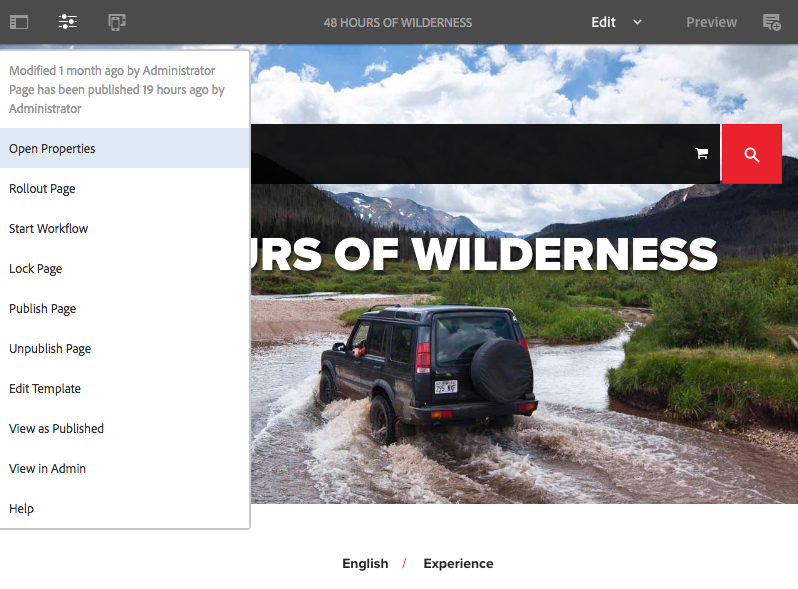
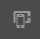
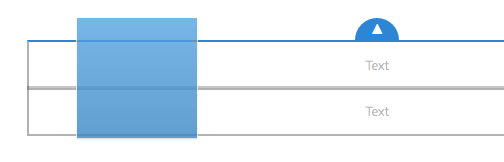
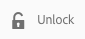

# Paginacontent bewerken{#editing-page-content}

Nadat u de pagina hebt gemaakt (nieuw of als onderdeel van een opstart of live kopie), kunt u de inhoud bewerken en de gewenste updates uitvoeren.

Inhoud wordt toegevoegd met [componenten](/help/sites-authoring/default-components-console.md) (die geschikt zijn voor het inhoudstype) die naar de pagina kunnen worden gesleept. Deze kunnen vervolgens worden bewerkt, verplaatst of verwijderd.

>[!NOTE]
>
>Uw account heeft de [juiste toegangsrechten](/help/sites-administering/security.md) en [machtigingen](/help/sites-administering/security.md#permissions) nodig om pagina&#39;s te kunnen bewerken.
>
>Als u om het even welke problemen ontmoet wij adviseren u uw systeembeheerder contacteert.

>[!NOTE]
>
>Als uw pagina en/of sjabloon op de juiste wijze is ingesteld, kunt u bij het bewerken de [responsieve indeling](/help/sites-authoring/responsive-layout.md) gebruiken.

>[!NOTE]
>
>In de modus **Bewerken** zijn de koppelingen in de inhoud zichtbaar, maar **niet toegankelijk**. Gebruik de modus  Voorvertoning als u wilt navigeren met de koppelingen in de inhoud.

## Werkbalk Pagina {#page-toolbar}

De paginawerkbalk biedt toegang tot de juiste functionaliteit, afhankelijk van de paginaconfiguratie.

De werkbalk biedt toegang tot een groot aantal opties. Afhankelijk van uw huidige context en configuratie zijn sommige opties mogelijk niet beschikbaar.

* **Zijpaneel in-/uitschakelen**

   Hiermee opent/sluit u het zijpaneel, waarin de [Asset Browser](/help/sites-authoring/author-environment-tools.md#assets-browser), de [Componentbrowser](/help/sites-authoring/author-environment-tools.md#components-browser)en de [Inhoudsstructuur](/help/sites-authoring/author-environment-tools.md#content-tree)staan.

   

* **Pagina-informatie**

   Biedt toegang tot het menu [Pagina-informatie](/help/sites-authoring/author-environment-tools.md#page-information) , inclusief paginadetails en handelingen die op de pagina kunnen worden uitgevoerd, zoals het weergeven en bewerken van pagina-informatie, het weergeven van pagina-eigenschappen en het publiceren/ongedaan maken van de publicatie van de pagina.

   

* **Emulator**

   Hiermee schakelt u de [emulatorwerkbalk](/help/sites-authoring/responsive-layout.md#selecting-a-device-to-emulate)in of uit, die wordt gebruikt om de vormgeving van de pagina op een ander apparaat na te bootsen. Dit wordt automatisch in- en uitgeschakeld in de lay-outmodus.

   

* **ContextHub**

   Opent de [contexthub](/help/sites-authoring/ch-previewing.md). Alleen beschikbaar in de modus Voorbeeld.

   

* **Paginatitel**

   Dit is puur informatief.

   

* **Modus selecteren**

   Hiermee geeft u de huidige [modus](/help/sites-authoring/author-environment-tools.md#page-modes) weer en kunt u een andere modus selecteren, zoals bewerken, lay-out, tijdverdraaiing of doelversie.

   

* **Voorvertoning**

   Schakelt de [voorvertoningsmodus](/help/sites-authoring/editing-content.md#preview-mode)in. Hiermee wordt de pagina weergegeven zoals deze wordt weergegeven bij publicatie.

   

* **Annoteren**

   Hiermee kunt u [annotaties](/help/sites-authoring/annotations.md) aan de pagina toevoegen wanneer u een pagina bekijkt. Na de eerste annotatie schakelt het pictogram over naar een getal dat het aantal annotaties op de pagina aangeeft.

   

### Statusmelding {#status-notification}

Als een pagina deel uitmaakt van een [workflow](/help/sites-authoring/workflows.md) of meerdere workflows, wordt deze informatie weergegeven in een berichtenbalk boven aan het scherm wanneer de pagina wordt bewerkt.

>[!NOTE]
>
>De statusbalk is alleen zichtbaar voor gebruikersaccounts met de juiste rechten.

In het bericht wordt de workflow weergegeven die op de pagina wordt uitgevoerd. Als de gebruiker betrokken is bij de huidige workflowstap, zijn er ook opties beschikbaar om de workflowstatus [te](/help/sites-authoring/workflows-participating.md) beïnvloeden en meer informatie over de workflow te krijgen, zoals:

* **Voltooien** - Hiermee opent u het dialoogvenster **Werkitem** voltooien

* **Delegeren** - Hiermee wordt het dialoogvenster **Voltooid werkitem** geopend

* **Details** weergeven - Hiermee opent u het venster **Details** van de workflow

Het uitvoeren en delegeren van werkstroomstappen via de berichtenbalk werkt zoals het wanneer het [deelnemen aan werkstromen](/help/sites-authoring/workflows-participating.md) van het Inbox van het Bericht.

Als de pagina aan veelvoudige werkschema&#39;s onderworpen is, wordt het aantal werkschema&#39;s getoond aan het rechtereind van het bericht samen met pijlknopen om u toe te staan om door de werkschema&#39;s te scrollen.

## Tijdelijke aanduiding voor onderdeel {#component-placeholder}

De tijdelijke aanduiding van de component is een indicator waarmee wordt aangegeven waar een component wordt geplaatst wanneer u deze neerzet - boven de component waarover u momenteel heft.

* Bij het toevoegen van een nieuwe component aan de pagina (slepen vanuit de componentbrowser):

   

* Bij het verplaatsen van een bestaande component:

   

## Een component invoegen {#inserting-a-component}

### Een component invoegen vanuit de Componentbrowser {#inserting-a-component-from-the-components-browser}

U kunt een nieuwe component toevoegen door [componentenbrowser](/help/sites-authoring/author-environment-tools.md#components-browser)te gebruiken. In de [plaatsaanduiding](#component-placeholder) van de component ziet u waar de component wordt geplaatst:

1. Zorg ervoor dat de pagina in de modus [**Bewerken** staat](/help/sites-authoring/author-environment-tools.md#page-modes).
1. Open de [componentbrowser](/help/sites-authoring/author-environment-tools.md#components-browser).
1. Sleep de vereiste component naar de [gewenste positie](#component-placeholder).

1. [Bewerk](#editmovecopypastedelete) de component.

>[!NOTE]
>
>Op een mobiel apparaat vult de componentbrowser het volledige scherm. Nadat u een component hebt gesleept, wordt de pagina in de browser weer weergegeven, zodat u de component kunt plaatsen.

### Een component invoegen vanuit het alineasysteem {#inserting-a-component-from-the-paragraph-system}

U kunt een nieuwe component toevoegen door de componenten van de **Belemmering hier** van het paragraafsysteem te gebruiken:

1. Zorg ervoor dat de pagina in de modus [**Bewerken** staat](/help/sites-authoring/author-environment-tools.md#page-modes).
1. Er zijn twee manieren om een nieuwe component in het alineasysteem te selecteren en toe te voegen:

   * Select the **Insert Component** option (+) from either the toolbar of an existing component or the **Drag components here** box.

   

   * Als u zich op een bureaubladapparaat bevindt, kunt u hier **dubbelklikken op de componenten** Slepen.

   The **Insert New Component** dialog will open to allow you to select your required component:

   

1. De geselecteerde component wordt onder aan de pagina toegevoegd. [Bewerk](#editmovecopypastedelete) de component naar wens.

### Een component invoegen met de middelenbrowser {#inserting-a-component-using-the-assets-browser}

U kunt ook een nieuwe component aan de pagina toevoegen door een element vanuit de [middelenbrowser](/help/sites-authoring/author-environment-tools.md#assets-browser)te slepen. Hiermee wordt automatisch een nieuwe component van het juiste type gemaakt (en die het element bevat).

Dit is geldig voor de volgende elementtypen (sommige zijn afhankelijk van het pagina-/alineasysteem):

<table>
 <tbody>
  <tr>
   <th><strong>Elementtype</strong></th>
   <th><strong>Resulterend componenttype</strong></th>
  </tr>
  <tr>
   <td>Afbeelding</td>
   <td>Afbeelding</td>
  </tr>
  <tr>
   <td>Document</td>
   <td>Downloaden</td>
  </tr>
  <tr>
   <td>Product</td>
   <td>Product</td>
  </tr>
  <tr>
   <td>Video</td>
   <td>Flash</td>
  </tr>
  <tr>
   <td>Inhoudsfragment</td>
   <td>Inhoudsfragment  </td>
  </tr>
 </tbody>
</table>

>[!NOTE]
>
>Dit gedrag kan voor uw installatie worden gevormd. Zie Een alineasysteem [configureren, zodat door het slepen van een element een componentinstantie](/help/sites-developing/developing-components.md#configuring-a-paragraph-system-so-that-dragging-an-asset-creates-a-component-instance) wordt gemaakt voor meer informatie.

Een component maken door een van de bovenstaande elementtypen te slepen:

1. Zorg ervoor dat de pagina in de modus [**Bewerken** staat](/help/sites-authoring/author-environment-tools.md#page-modes).
1. Open de [middelenbrowser](/help/sites-authoring/author-environment-tools.md#assets-browser).
1. Sleep het vereiste element naar de gewenste positie. De [plaatsaanduiding](#component-placeholder) van de component geeft aan waar de component wordt geplaatst.

   Een component die geschikt is voor het type element, wordt op de vereiste locatie gemaakt. De component bevat het geselecteerde element.

1. [Bewerk](#editmovecopypastedelete) indien nodig de component.

>[!NOTE]
>
>Op een mobiel apparaat vult de middelenbrowser het volledige scherm. Nadat u een element hebt gesleept, wordt de pagina in de browser weergegeven, zodat u het element kunt plaatsen.

Als u bij het bladeren door de elementen een snelle wijziging in een element moet aanbrengen, kunt u de [middeleneditor](/help/assets/manage-assets.md) rechtstreeks vanuit de browser starten door op het pictogram Bewerken naast de naam van het element te klikken.

## Bewerken/configureren/kopiëren/knippen/verwijderen/plakken {#edit-configure-copy-cut-delete-paste}

Als u een component selecteert, wordt de werkbalk geopend. Dit verleent toegang tot diverse acties die op de component kunnen worden uitgevoerd.

De acties die de gebruiker daadwerkelijk kan uitvoeren, worden op de juiste wijze weergegeven en niet alle acties worden hier beschreven.

* **Bewerken**

   [Afhankelijk van het componenttype](/help/sites-authoring/default-components.md) kunt u de inhoud van de component bewerken. Er wordt vaak een werkbalk weergegeven.

   

* **Configureren**

   [Afhankelijk van het componenttype](/help/sites-authoring/default-components.md) kunt u de eigenschappen van de component bewerken en configureren. Vaak wordt een dialoogvenster geopend.

   

* **Kopiëren**

   Hiermee wordt de component naar het klembord gekopieerd. Na de plakactie, zal de originele component blijven.

   

* **Knippen**

   Hiermee wordt de component naar het klembord gekopieerd. Na de plakhandeling wordt de oorspronkelijke component verwijderd.

   

* **Verwijderen**

   Hiermee verwijdert u de component van de pagina met uw bevestiging.

   

* **Component invoegen**

   Hiermee wordt het dialoogvenster geopend waarin u een nieuwe component [kunt](/help/sites-authoring/editing-content.md#inserting-a-component-from-the-paragraph-system)toevoegen.

   

* **Plakken**

   Hiermee wordt de component van het klembord naar de pagina geplakt. Of het origineel overblijft, hangt af van het feit of u de kopie of het knipsel hebt gebruikt.

   * U kunt op dezelfde pagina of op een andere pagina plakken.
   * Het geplakte item wordt boven het item geplakt waar u de plakactie selecteert.
   * De handeling Pate wordt alleen weergegeven als er inhoud op het klembord staat.

   

   >[!NOTE]
   >
   >Als u plakt naar een andere pagina die al was geopend vóór de knip-/kopieerbewerking, moet u de pagina vernieuwen om de geplakte inhoud te zien.

* **Groeperen**

   Hierdoor kunt u meerdere componenten tegelijk selecteren. Hetzelfde kan worden bereikt op een desktopapparaat met een **Ctrl+klikken** of **Command+klikken**.

   

* **Bovenliggend**

   Hiermee kunt u de bovenliggende component van de geselecteerde component selecteren.

   

* **Indeling**

   Hierdoor kunt u de [lay-out](/help/sites-authoring/editing-content.md#edit-component-layout) van de geselecteerde component wijzigen. Dit geldt alleen voor de geselecteerde component en activeert de [layoutmodus](/help/sites-authoring/author-environment-tools.md#page-modes) niet voor de gehele pagina.

   

* **Omzetten in een ervaringsfragmentvariatie**

   Hierdoor kunt u een nieuw [ervaringsfragment](/help/sites-authoring/experience-fragments.md) maken van de geselecteerde component of dit toevoegen aan een bestaand ervaringsfragment.

   

## Bewerken (inhoud) {#edit-content}

Er zijn twee methoden om inhoud toe te voegen en/of te bewerken in componenten:

* Open het dialoogvenster [voor bewerking](#component-edit-dialog).
* [Sleep een element](#draganddropintocomponent) vanuit de middelenbrowser om rechtstreeks inhoud toe te voegen.

### Dialoogvenster Component Edit {#component-edit-dialog}

U kunt een component openen om de content te bewerken met het pictogram [Bewerken (potlood) van de werkbalk van de component](#edit-configure-copy-cut-delete-paste).

De exacte bewerkingsopties zijn afhankelijk van de component. Voor sommige componenten zijn [alle handelingen alleen beschikbaar in de modus](#edit-content-full-screen-mode)Volledig scherm. Bijvoorbeeld:

* [Tekstcomponent](/help/sites-authoring/rich-text-editor.md#main-pars-title-24)

   

* Afbeeldingscomponent

   

   >[!NOTE]
   >
   >Bewerken werkt niet op een lege afbeeldingscomponent.
   >
   >
   >U moet een afbeelding [slepen of uploaden (met Configureren)](/help/sites-authoring/default-components-foundation.md#image) voordat u kunt beginnen met het bewerken ervan.

* Afbeeldingscomponent - volledig scherm

   [Door de volledige-schermmodus te openen](/help/sites-authoring/editing-content.md#edit-content-full-screen-mode) voor de afbeeldingscomponent kunt u meer ruimte vrijmaken voor het bewerken van de afbeelding en kunt u extra bewerkingsopties weergeven, zoals **Kaart starten** en **Zoomen opnieuw instellen**. Bovendien kunt u op het volledige scherm voorinstellingen voor bijsnijden selecteren.

   

* Componenten die zijn samengesteld uit meerdere basiscomponenten, zoals de [stichtingscomponent](/help/sites-authoring/default-components-foundation.md#text-image)Tekst en afbeelding, vragen u eerst om te bevestigen welke set bewerkingsopties u wilt:

   

### Elementen naar component slepen en neerzetten {#drag-and-drop-assets-into-component}

Voor specifieke componenttypen kunt u elementen van de elementenbrowser rechtstreeks naar de component slepen om de inhoud bij te werken:

| **Elementtype** | **Componenttype** |
|---|---|
| Afbeelding | Afbeelding |
| Document | Downloaden |
| Product | Product |
| Video | Flash |
| Inhoudsfragment | Inhoudsfragment |

## Modus Volledig scherm bewerken (inhoud) {#edit-content-full-screen-mode}

Voor alle componenten kunt u de modus Volledig scherm openen (en afsluiten):

Bijvoorbeeld de **component Text** :

>[!NOTE]
>
>Voor sommige componenten zijn er meer opties beschikbaar voor de modus Volledig scherm dan voor de standaard, op locatie verkrijgbare editor.

## Een component verplaatsen {#moving-a-component}

Een alineacomponent verplaatsen:

1. Selecteer de alinea die u wilt verplaatsen met Tik en houd de muisknop ingedrukt of klik en houd de muisknop ingedrukt.
1. Sleep de alinea naar de nieuwe locatie. AEM geeft aan waar de alinea kan worden gedeponeerd. Zet het neer op de gewenste plaats.

   

1. Uw alinea wordt verplaatst.

>[!NOTE]
>
>U kunt een component ook verplaatsen met [Knippen en Plakken](/help/sites-authoring/editing-content.md#edit-configure-copy-cut-delete-paste) .

## Componentindeling bewerken {#edit-component-layout}

In plaats van herhaaldelijk over te schakelen van de bewerkingsmodus naar [de lay-outmodus](/help/sites-authoring/responsive-layout.md) om een component aan te passen, kunt u de actie **Lay-out** selecteren zodat een component de lay-out van die component kan wijzigen en tijd kan besparen door de bewerkingsmodus niet te verlaten.

1. Als u in de modus **Bewerken** van de siteconsole een component selecteert, wordt de werkbalk van de component zichtbaar.

   

   Klik of tik op de actie **Lay-out** om de lay-out van de component aan te passen.

   

1. Nadat de handeling Lay-out is geselecteerd:

   * De formaatgrepen voor de componentweergave.
   * De emulatorwerkbalk wordt boven in het scherm weergegeven.
   * De acties van de lay-out in plaats van de standaard geeft acties uit tonen op de componententoolbar.

   

   U kunt de lay-out van de component nu wijzigen zoals u in de [lay-outmodus](/help/sites-authoring/responsive-layout.md#defining-layouts-layout-mode)zou doen.

1. Nadat u de vereiste layoutwijzigingen hebt aangebracht, klikt u op de knop **Sluiten** in het actiemenu van de component om de lay-out van de component niet meer te wijzigen. De werkbalk van de component keert terug naar de normale bewerkingsstatus.

   

>[!NOTE]
>
>De actie Lay-out is beperkt in werkingsgebied tot de geselecteerde component. Als u bijvoorbeeld de lay-out van een component bewerkt en vervolgens op een andere component klikt, verdwijnt de werkbalk voor standaardbewerking (niet de layoutwerkbalk) voor de zojuist geselecteerde component en de formaatgrepen en de emulatorwerkbalk.
>
>Schakel over naar de [lay-outmodus](/help/sites-authoring/responsive-layout.md)als u de algemene lay-out van de pagina wilt bewerken en meerdere onderdelen wilt beïnvloeden.

## Overgenomen componenten {#inherited-components}

Overerfde componenten kunnen het product van diverse scenario&#39;s zijn, die omvatten:

* [Beheer van meerdere sites](/help/sites-administering/msm.md)
* [Starten](/help/sites-authoring/launches.md) (op basis van live kopie).
* Specifieke componenten, zoals het Overgenomen alineasysteem in Geometrixx.

U kunt de overerving annuleren (en vervolgens opnieuw inschakelen). Afhankelijk van de component, kan dit beschikbaar zijn bij:

* **Live kopie**

   De componentwerkbalk als de component zich op een pagina bevindt die deel uitmaakt van een live kopie of introductie (op basis van een live kopie). Bijvoorbeeld:

   

   De optie Overerving annuleren is beschikbaar:

   

   Of herstel overname indien reeds geannuleerd:

   

   De actie Uitvoeren is ook beschikbaar in de blauwdruk of Live kopie bron:

   

* **Een overerfd alineasysteem**

   Het configuratiedialoogvenster. Bijvoorbeeld, zoals met het Overgenomen Systeem van de Paragraaf:

   

## De paginasjabloon bewerken {#editing-the-page-template}

Als de pagina is gebaseerd op een [bewerkbare sjabloon](/help/sites-authoring/templates.md#editable-and-static-templates), kunt u eenvoudig overschakelen naar de [sjablooneditor](/help/sites-authoring/templates.md#editing-templates-template-authors) door Sjabloon **** bewerken te selecteren in het menu Pagina-informatie.

Als de pagina is gebaseerd op een [statische sjabloon](/help/sites-authoring/templates.md#editable-and-static-templates), kunt u overschakelen naar de [ontwerpmodus](/help/sites-authoring/default-components-designmode.md) met de [paginamodus-kiezer](/help/sites-authoring/author-environment-tools.md#page-modes) op de werkbalk om componenten voor gebruik op de pagina in- en uit te schakelen.

U kunt gemakkelijk zien op welke sjabloon de pagina is gebaseerd wanneer u de pagina selecteert in de [kolomweergave](/help/sites-authoring/basic-handling.md#column-view) of de [lijstweergave](/help/sites-authoring/basic-handling.md#list-view).

## Status van live kopiëren {#live-copy-status}

In de modus [Status van](/help/sites-authoring/author-environment-tools.md#page-modes) Live kopie kunt u snel een overzicht geven van de status van de live kopie en van de onderdelen die u wel of niet wilt overnemen:

* Groene rand: Overgenomen
* Roze rand: Overerving is geannuleerd

Bijvoorbeeld:

## Annotaties toevoegen {#adding-annotations}

[Met annotaties](/help/sites-authoring/annotations.md) kunnen revisoren en andere auteurs feedback geven over uw inhoud. Ze worden vaak gebruikt voor controle- en validatiedoeleinden.

## Pagina&#39;s voorvertonen {#previewing-pages}

Er zijn twee opties voor het voorvertonen van een pagina:

* [Modus](#preview-mode) Voorvertoning - een snelle voorvertoning op plaats

* [Weergeven als gepubliceerd](#view-as-published) - een volledige voorvertoning waarmee de pagina op een nieuw tabblad wordt geopend

>[!NOTE]
>
>* Koppelingen in de inhoud zijn zichtbaar, maar niet toegankelijk in de bewerkingsmodus.
>* Gebruik een van de voorvertoningsopties als u door de koppelingen wilt navigeren.
>* Gebruik de [sneltoets](/help/sites-authoring/keyboard-shortcuts.md) `Ctrl-Shift-M` om te schakelen tussen de voorvertoning en de laatst geselecteerde modus.

>

>[!NOTE]
>
>Het WCM-moduscookie wordt ingesteld voor beide opties.

### Voorvertoningsmodus {#preview-mode}

Wanneer u inhoud bewerkt, kunt u een voorvertoning van de pagina weergeven in de [voorvertoningsmodus](/help/sites-authoring/author-environment-tools.md#page-modes). Deze modus:

* Hiermee verbergt u verschillende bewerkingsmechanismen waarmee u snel kunt zien hoe de pagina er bij het publiceren uitziet.
* Hiermee kunt u navigeren met koppelingen.
* De pagina-inhoud wordt **niet** vernieuwd.

Tijdens het ontwerpen is de voorvertoningsmodus beschikbaar met het pictogram rechtsboven in de paginaeditor:

### Weergeven als gepubliceerd {#view-as-published}

De optie **Weergeven als gepubliceerd** is beschikbaar in het menu [Pagina-informatie](/help/sites-authoring/author-environment-tools.md#page-information) . Hierdoor wordt de pagina op een nieuw tabblad geopend, wordt de inhoud vernieuwd en wordt de pagina precies zo weergegeven als in de publicatieomgeving.

## Een pagina vergrendelen {#locking-a-page}

AEM kunt u een pagina vergrendelen, zodat niemand anders de inhoud kan wijzigen. Dit is handig wanneer u veel bewerkingen uitvoert op een bepaalde pagina of wanneer u een pagina even wilt stilzetten.

Een pagina kan worden vergrendeld vanuit:

* **Sites** -console

   1. Selecteer de pagina in de [selectiemodus](/help/sites-authoring/basic-handling.md#viewing-and-selecting-resources).
   1. Selecteer het vergrendelingspictogram.

   

* **Pagina-editor**

   1. Selecteer het pictogram **Pagina-informatie** om het menu te openen.
   1. Select the **Lock Page** option.

Nadat de weergave op de console is vergrendeld, wordt de informatie bijgewerkt en wanneer u een vergrendelingssymbool bewerkt, wordt deze weergegeven op de werkbalk.

>[!CAUTION]
>
>U kunt een pagina vergrendelen wanneer u een gebruiker imiteert. Een pagina die op deze manier is vergrendeld, kan echter alleen dan worden ontgrendeld door de gebruiker die zich heeft laten verpersoonlijken of door de beheerder.
>
>De pagina&#39;s kunnen niet worden ontgrendeld door zich als de gebruiker voor te doen die de pagina heeft vergrendeld.

## Een pagina ontgrendelen {#unlocking-a-page}

Het ontgrendelen van een pagina lijkt erg op het [vergrendelen van de pagina](#locking-a-page). Nadat de pagina is vergrendeld, worden de vergrendelingsopties vervangen door ontgrendelingsacties.

In het menu Pagina-informatie wordt **Ontgrendelen** als optie weergegeven en het pictogram Vergrendelen in de Sites-console wordt vervangen door een pictogram **Ontgrendelen**.

>[!CAUTION]
>
>U kunt een pagina vergrendelen wanneer u een gebruiker imiteert. Een pagina die op deze manier is vergrendeld, kan echter alleen dan worden ontgrendeld door de gebruiker die zich heeft laten verpersoonlijken of door de beheerder.
>
>De pagina&#39;s kunnen niet worden ontgrendeld door zich als de gebruiker voor te doen die de pagina heeft vergrendeld.

## Paginabewerkingen ongedaan maken en opnieuw uitvoeren {#undoing-and-redoing-page-edits}

Met de volgende pictogrammen kunt u een handeling ongedaan maken of opnieuw uitvoeren. Deze worden in voorkomend geval weergegeven op de werkbalk:

>[!NOTE]
>
>De [sneltoets](/help/sites-authoring/page-authoring-keyboard-shortcuts.md) `Ctrl-Z` is ook beschikbaar om handelingen voor paginabewerking ongedaan te maken.
>
>De sneltoets `Ctrl-Y` is ook beschikbaar als u paginabewerkingsacties opnieuw wilt uitvoeren.

>[!NOTE]
>
>Zie Paginabewerkingen [ongedaan maken en opnieuw uitvoeren - De theorie](#undoing-and-redoing-page-edits-the-theory) voor alle details van wat mogelijk is bij het ongedaan maken en opnieuw uitvoeren van paginabewerkingen.

## Paginabewerkingen ongedaan maken en opnieuw uitvoeren - De theorie {#undoing-and-redoing-page-edits-the-theory}

>[!NOTE]
>
>Uw systeembeheerder kan diverse aspecten van Ongedaan maken/opnieuw eigenschappen [volgens de vereisten voor uw instantie](/help/sites-administering/config-undo.md) vormen.

AEM slaat een geschiedenis van acties op die u uitvoert en de opeenvolging waarin u hen uitvoerde zodat u veelvoudige acties in de orde ongedaan kunt maken dat u hen uitvoerde evenals hen opnieuw doet om één of meerdere acties indien nodig opnieuw toe te passen.

Als een element op de inhoudspagina wordt geselecteerd (zoals een tekstcomponent), dan is het ongedaan maken en opnieuw bevel op het geselecteerde punt van toepassing.

Het gedrag van de opdrachten Ongedaan maken en Opnieuw is vergelijkbaar met dat van andere softwareprogramma&#39;s. Gebruik de opdrachten om de recente status van uw webpagina te herstellen terwijl u beslissingen neemt over de inhoud. Als u bijvoorbeeld een tekstalinea naar een andere locatie op de pagina verplaatst, kunt u de opdracht Ongedaan maken gebruiken om de alinea terug te verplaatsen. Als u vervolgens besluit dat de vorige positie beter was, gebruikt u de opdracht Opnieuw uitvoeren om de bewerking Ongedaan maken ongedaan te maken.

>[!NOTE]
>
>U kunt:
>
>* Voer handelingen opnieuw uit zolang u geen paginabewerking hebt uitgevoerd nadat u de bewerking ongedaan hebt gemaakt.
>* U kunt maximaal 20 bewerkingen ongedaan maken (standaardinstelling).
>* Gebruik ook [sneltoetsen](/help/sites-authoring/page-authoring-keyboard-shortcuts.md) voor ongedaan maken en opnieuw uitvoeren.

>

U kunt de volgende typen paginawijzigingen ongedaan maken en opnieuw uitvoeren:

* Alinea&#39;s toevoegen, bewerken, verwijderen en verplaatsen
* Lokaal bewerken van alinea-inhoud
* Items op een pagina kopiëren, knippen en plakken

Formuliervelden die door formuliercomponenten worden gerenderd, mogen geen waarden hebben die zijn opgegeven tijdens het ontwerpen van pagina&#39;s. De opdrachten Ongedaan maken en Opnieuw hebben daarom geen invloed op wijzigingen die u aanbrengt in de waarden van die typen componenten. U kunt bijvoorbeeld het selecteren van een waarde in een vervolgkeuzelijst niet ongedaan maken.

>[!NOTE]
>
>Er zijn speciale machtigingen vereist voor het ongedaan maken en opnieuw uitvoeren van wijzigingen in bestanden en afbeeldingen.

>[!NOTE]
>
>De geschiedenis van wijzigingen in bestanden en afbeeldingen duurt minimaal tien uur. Na deze tijd is het ongedaan maken van de wijzigingen echter niet gegarandeerd. De beheerder kan de standaardtijd van tien uur wijzigen.

