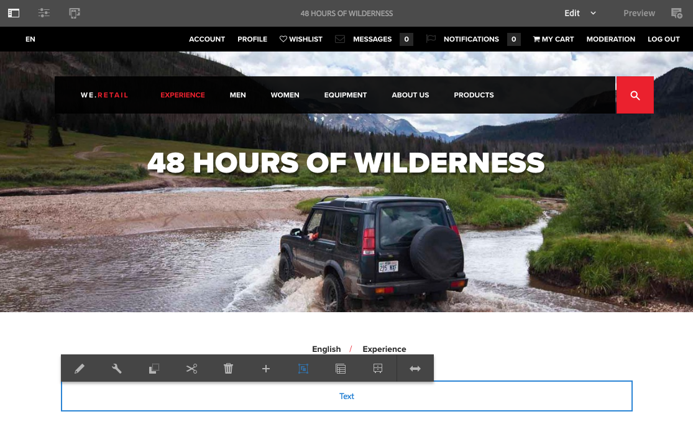

# Pagina-inhoud bewerken{#editing-page-content}

Nadat de pagina is gemaakt (nieuw of als onderdeel van een opstart of live kopie), kunt u de inhoud bewerken om de gewenste updates uit te voeren.

De inhoud wordt toegevoegd gebruikend [ componenten ](/help/sites-authoring/default-components-console.md) (aangewezen aan het inhoudstype) die op de pagina kunnen worden gesleept. Deze kunnen vervolgens worden bewerkt, verplaatst of verwijderd.

>[!NOTE]
>
>Uw rekening vereist de [ aangewezen toegangsrechten ](/help/sites-administering/security.md) en [ toestemmingen ](/help/sites-administering/security.md#permissions) om pagina&#39;s uit te geven.
>
>Als u om het even welke problemen ontmoet, stelt de Adobe voor dat u uw systeembeheerder contacteert.

>[!NOTE]
>
>Als uw pagina, of malplaatje, of allebei opstelling geschikt zijn, kunt u a [ ontvankelijke lay-out ](/help/sites-authoring/responsive-layout.md) gebruiken wanneer het uitgeven.

>[!NOTE]
>
>Wanneer op **&#x200B;**&#x200B;wijze uitgeeft, zijn de verbindingen in uw inhoud zichtbaar, maar **niet toegankelijk**. De wijze van de Voorproef van het gebruik [&#128279;](#previewingpagestouchoptimizedui) als u wilt navigeren gebruikend de verbindingen in uw inhoud.

## Werkbalk Pagina {#page-toolbar}

De paginawerkbalk biedt toegang tot de juiste functionaliteit, afhankelijk van de paginaconfiguratie.

De werkbalk biedt toegang tot een groot aantal opties. Afhankelijk van uw huidige context en configuratie zijn sommige opties mogelijk niet beschikbaar.

* **Knevel Zijpaneel**

  Dit opent/sluit het zijpaneel, dat [ Browser van Activa ](/help/sites-authoring/author-environment-tools.md#assets-browser) houdt, [ Browser van de Component ](/help/sites-authoring/author-environment-tools.md#components-browser), en [ de Boom van de Inhoud ](/help/sites-authoring/author-environment-tools.md#content-tree).

  

* **Informatie van de Pagina**

  Het verleent toegang tot het [ menu van de Informatie van de Pagina ](/help/sites-authoring/author-environment-tools.md#page-information) met inbegrip van paginadetails en acties die op de pagina met inbegrip van het bekijken en het uitgeven van paginainformatie, het bekijken van paginaeigenschappen, en het publiceren/unpublishing van de pagina kunnen worden genomen.

  

* **Emulator**

  Knevels de [ mededingertoolbar ](/help/sites-authoring/responsive-layout.md#selecting-a-device-to-emulate), die wordt gebruikt om het blik-en-gevoel van de pagina op een ander apparaat na te bootsen. Dit wordt automatisch in- en uitgeschakeld in de lay-outmodus.

  

* **ContextHub**

  Opent de [ contexthub ](/help/sites-authoring/ch-previewing.md). Alleen beschikbaar in de modus Voorbeeld.

  

* **Titel van de Pagina**

  Dit is puur informatief.

  

* **de Selector van de Wijze**

  Het toont de huidige [ wijze ](/help/sites-authoring/author-environment-tools.md#page-modes) en laat u een andere wijze zoals uitgeven, lay-out, timewarp, of het richten selecteren.

  

* **Voorproef**

  Laat [ voorproefwijze ](/help/sites-authoring/editing-content.md#preview-mode) toe. Hiermee geeft u de pagina weer zoals deze wordt weergegeven bij publicatie.

  

* **annoteert**

  Het laat u [ annotaties ](/help/sites-authoring/annotations.md) aan de pagina toevoegen wanneer het herzien van een pagina. Na de eerste annotatie schakelt het pictogram over naar een getal dat het aantal annotaties op de pagina aangeeft.

  

### Statusmelding {#status-notification}

Als een pagina deel van a [ werkschema ](/help/sites-authoring/workflows.md) of veelvoudige werkschema&#39;s uitmaakt, wordt deze informatie getoond in een berichtbar bij de bovenkant van het scherm wanneer het uitgeven van de pagina.

>[!NOTE]
>
>De statusbalk is alleen zichtbaar voor gebruikersaccounts met de juiste rechten.

In het bericht wordt de workflow weergegeven die op de pagina wordt uitgevoerd. Als de gebruiker in de huidige werkschemastap geïmpliceerd is, beïnvloeden de opties [ de werkschemastatus ](/help/sites-authoring/workflows-participating.md) en krijgen meer informatie over het werkschema ook beschikbaar zoals:

* **Volledig** - opent het **Volledige de dialoogvakje van het Werkpunt**

* **Afgevaardigde** - opent het **Volledige de dialoogvakje van het Werkpunt**

* **Details van de Mening** - opent het **venster van Details** van het werkschema

Het voltooien van en het delegeren van werkschemasstappen als het bericht werkt aangezien het wanneer [ deelnemend aan werkschema&#39;s ](/help/sites-authoring/workflows-participating.md) van het Bericht inbox.

Als de pagina aan veelvoudige werkschema&#39;s onderworpen is, wordt het aantal werkschema&#39;s getoond bij het rechtereind van het bericht samen met pijlknopen om u door de werkschema&#39;s te laten scrollen.

## Tijdelijke aanduiding voor onderdeel {#component-placeholder}

De tijdelijke aanduiding van de component is een indicator waarmee wordt aangegeven waar een component zich bevindt wanneer u deze neerzet - boven de component waarover u momenteel beweegt.

* Bij het toevoegen van een component aan de pagina (slepen vanuit de componentbrowser):

  

* Bij het verplaatsen van een bestaande component:

  

## Een component invoegen {#inserting-a-component}

### Een component invoegen vanuit de Componentbrowser {#inserting-a-component-from-the-components-browser}

U kunt een component toevoegen door [ componentenbrowser ](/help/sites-authoring/author-environment-tools.md#components-browser) te gebruiken. De [ componentenplaceholder ](#component-placeholder) toont u waar de component wordt geplaatst:

1. Zorg ervoor dat uw pagina op [**is geef** wijze ](/help/sites-authoring/author-environment-tools.md#page-modes) uit.
1. Open [ componentenbrowser ](/help/sites-authoring/author-environment-tools.md#components-browser).
1. Sleep de vereiste component aan de [ vereiste positie ](#component-placeholder).

1. [ geeft ](#editmovecopypastedelete) de component uit.

>[!NOTE]
>
>Op een mobiel apparaat vult de componentbrowser het volledige scherm. Nadat u een component hebt gesleept, wordt de browser gesloten en wordt de pagina weer weergegeven, zodat u de component kunt plaatsen.

### Een component invoegen vanuit het alineasysteem {#inserting-a-component-from-the-paragraph-system}

U kunt een component toevoegen door de **componenten van de Belemmering hier** doos van het paragraafsysteem te gebruiken:

1. Zorg ervoor dat uw pagina op [**is geef** wijze ](/help/sites-authoring/author-environment-tools.md#page-modes) uit.
1. Er zijn twee manieren om een component in het alineasysteem te selecteren en toe te voegen:

   * Selecteer de **optie van de Component van het Tussenvoegsel** (+) van of de toolbar van een bestaande component of de **componenten van de Belemmering hier** doos.

   

   * Als u op een Desktopapparaat bent, kunt u de **componenten van de Belemmering hier** doos tweemaal klikken.

   Het **de dialoogvakje van de Component van het Tussenvoegsel Nieuwe** opent om u uw vereiste component te laten selecteren:

   

1. De geselecteerde component wordt onder aan de pagina toegevoegd. [ geeft ](#editmovecopypastedelete) de component zoals vereist uit.

### Een component invoegen met de Assets-browser {#inserting-a-component-using-the-assets-browser}

U kunt een component aan de pagina ook toevoegen door activa van [ activa te slepen browser ](/help/sites-authoring/author-environment-tools.md#assets-browser). Hiermee wordt automatisch een component van het juiste type gemaakt (en die het element bevat).

Dit is geldig voor de volgende elementtypen (sommige zijn afhankelijk van het pagina-/alineasysteem):

<table>
 <tbody>
  <tr>
   <th><strong>Elementtype</strong></th>
   <th><strong>Resulterend componenttype</strong></th>
  </tr>
  <tr>
   <td>Afbeelding</td>
   <td>Afbeelding</td>
  </tr>
  <tr>
   <td>Document</td>
   <td>Downloaden</td>
  </tr>
  <tr>
   <td>Product</td>
   <td>Product</td>
  </tr>
  <tr>
   <td>Video</td>
   <td>Flash</td>
  </tr>
  <tr>
   <td>Inhoudsfragment</td>
   <td>Inhoudsfragment   </td>
  </tr>
 </tbody>
</table>

>[!NOTE]
>
>Dit gedrag kan voor uw installatie worden gevormd. Zie [ Vormend een Systeem van de Paragraaf zodat het slepen van een Activum tot een Instantie van de Component ](/help/sites-developing/developing-components.md#configuring-a-paragraph-system-so-that-dragging-an-asset-creates-a-component-instance) voor verdere details leidt.

Een component maken door een van de bovenstaande elementtypen te slepen:

1. Zorg ervoor dat uw pagina op [**is geef** wijze ](/help/sites-authoring/author-environment-tools.md#page-modes) uit.
1. Open [ activa browser ](/help/sites-authoring/author-environment-tools.md#assets-browser).
1. Sleep het vereiste element naar de gewenste positie. De [ componentenplaceholder ](#component-placeholder) toont u waar de component wordt geplaatst.

   Een component die geschikt is voor het type element, wordt op de vereiste locatie gemaakt en bevat het geselecteerde element.

1. [ geeft ](#editmovecopypastedelete) de component uit, indien nodig.

>[!NOTE]
>
>Op een mobiel apparaat vult de middelenbrowser het volledige scherm. Wanneer u een element sleept, wordt de browser gesloten en wordt de pagina weer weergegeven, zodat u het element kunt plaatsen.

Wanneer het doorbladeren van de activa, als u vindt dat u een snelle verandering in activa moet aanbrengen, klik het uitgeven pictogram naast de naam van de activa om de [ Redacteur van Activa ](/help/assets/manage-assets.md) te beginnen.

## Bewerken/configureren/kopiëren/knippen/verwijderen/plakken {#edit-configure-copy-cut-delete-paste}

Als u een component selecteert, wordt de werkbalk geopend. Dit verleent toegang tot diverse acties die op de component kunnen worden uitgevoerd.

De acties die de gebruiker daadwerkelijk kan uitvoeren, worden op de juiste wijze weergegeven en niet alle acties worden hier beschreven.

* **geeft** uit

  [ afhankelijk van het componenttype ](/help/sites-authoring/default-components.md), laat dit u [ uitgeven de inhoud van de component ](#edit-content). Er wordt vaak een werkbalk weergegeven.

   uit

* **vormen**

  [ afhankelijk van het componenttype ](/help/sites-authoring/default-components.md) dit laat u de eigenschappen van de component uitgeven en vormen. Er wordt vaak een dialoogvenster geopend.

  

* **Exemplaar**

  Hiermee wordt de component naar het klembord gekopieerd. De oorspronkelijke component blijft na een plakbewerking.

  

* **Besnoeiing**

  Hiermee wordt de component naar het klembord gekopieerd. Na de plakhandeling wordt de oorspronkelijke component verwijderd.

  

* **Schrapping**

  Hiermee verwijdert u de component van de pagina met uw bevestiging.

  

* **component van het Tussenvoegsel**

  Dit opent de dialoogdoos om [ een component ](/help/sites-authoring/editing-content.md#inserting-a-component-from-the-paragraph-system) toe te voegen.

  

* **Deeg**

  Hiermee plakt u de component van het klembord naar de pagina. Of het origineel overblijft, hangt af van het feit of u de kopie of de cut hebt gebruikt.

   * U kunt op dezelfde pagina of op een andere pagina plakken.
   * Het geplakte item wordt boven het item geplakt waar u de plakactie selecteert.
   * De handeling Plakken wordt alleen weergegeven als er inhoud op het klembord staat.

  

  >[!NOTE]
  >
  >Als u plakt naar een andere pagina die al was geopend vóór de knip-/kopieerbewerking, moet u de pagina vernieuwen om de geplakte inhoud te zien.

* **Groep**

  Hiermee kunt u meerdere componenten tegelijk selecteren. Het zelfde kan op een Desktopapparaat door a **worden bereikt Control+Click** of **Command+Click**.

  

* **Ouder**

  Hiermee kunt u de bovenliggende component van de geselecteerde component selecteren.

  

* **Lay-out**

  Dit laat u de [ lay-out ](/help/sites-authoring/editing-content.md#edit-component-layout) van de geselecteerde component wijzigen. Dit is slechts op de geselecteerde component van toepassing en activeert niet de [ wijze van de Lay-out ](/help/sites-authoring/author-environment-tools.md#page-modes) voor de volledige pagina.

  

* **Bekeerling in een variatie van het Fragment van de Ervaring**

  Dit laat u een [ Fragment van de Ervaring ](/help/sites-authoring/experience-fragments.md) van de geselecteerde component tot stand brengen of het toevoegen aan een bestaand Fragment van de Ervaring.

  

## Bewerken (inhoud) {#edit-content}

Er zijn twee methoden om inhoud toe te voegen of te bewerken in componenten:

* Open de [ componentendialoog voor het uitgeven ](#component-edit-dialog).
* [ belemmering en laat vallen activa ](#draganddropintocomponent) van activa browser om inhoud direct toe te voegen.

### Dialoogvenster Component Edit {#component-edit-dialog}

U kunt een component openen om de content te bewerken met het pictogram [Bewerken (potlood) van de werkbalk van de component](#edit-configure-copy-cut-delete-paste).

De exacte bewerkingsopties zijn afhankelijk van de component. Voor sommige componenten, [ zijn alle acties slechts beschikbaar op volledige het schermwijze ](#edit-content-full-screen-mode). Bijvoorbeeld:

* [Tekstcomponent](/help/sites-authoring/rich-text-editor.md#main-pars-title-24)

  

* Afbeeldingscomponent

  

  >[!NOTE]
  >
  >Bewerken werkt niet op een lege afbeeldingscomponent.
  >
  >
  >[ belemmering of upload een beeld (het gebruiken vormt) ](/help/sites-authoring/default-components-foundation.md#image) alvorens u kunt beginnen het uit te geven.

* Afbeeldingscomponent - volledig scherm

  [ het ingaan van volledige het schermwijze ](/help/sites-authoring/editing-content.md#edit-content-full-screen-mode) voor de beeldcomponent staat voor meer ruimte toe om het beeld uit te geven en extra het uitgeven opties zoals **Kaart van de Lancering** en **Gezoem van het Terugstellen** te tonen. Bovendien kunt u op het volledige scherm voorinstellingen voor bijsnijden selecteren.

  

* De componenten die van meer dan één basiscomponent worden geconstrueerd, zoals de [ Tekst &amp; de stichtingscomponent van het Beeld ](/help/sites-authoring/default-components-foundation.md#text-image), vragen u eerst om te bevestigen welke reeks geeft opties uit u wilt:

  

### Assets naar component slepen {#drag-and-drop-assets-into-component}

Voor specifieke componenttypen kunt u elementen van de elementenbrowser rechtstreeks naar de component slepen om de inhoud bij te werken:

| **Type van Activa** | **Type van Component** |
|---|---|
| Afbeelding | Afbeelding |
| Document | Downloaden |
| Product | Product |
| Video | Flash |
| Inhoudsfragment | Inhoudsfragment |

## Modus Volledig scherm bewerken (inhoud) {#edit-content-full-screen-mode}

Voor alle componenten kunt u de modus Volledig scherm openen (en afsluiten):

Bijvoorbeeld, de **component van de Tekst**:

>[!NOTE]
>
>Voor sommige componenten heeft de modus Volledig scherm meer opties beschikbaar dan de standaard interne editor.

## Een component verplaatsen {#moving-a-component}

Een alinea-component verplaatsen:

1. Selecteer de alinea die u wilt verplaatsen met de optie voor selecteren en vasthouden of met klikken en vasthouden.
1. Sleep de alinea naar de nieuwe locatie. AEM geeft aan waar de alinea kan worden geplaatst. Zet het neer op de gewenste plaats.

   

1. Uw alinea wordt verplaatst.

>[!NOTE]
>
>U kunt ook gebruiken [ Besnoeiing en Deeg ](/help/sites-authoring/editing-content.md#edit-configure-copy-cut-delete-paste) om een component te bewegen.

## Componentlay-out bewerken {#edit-component-layout}

In plaats van herhaaldelijk overschakelen van geef uit aan [ lay-outwijze ](/help/sites-authoring/responsive-layout.md) om een component aan te passen, kunt u de **Lay-out** actie voor een component selecteren om de lay-out van die component te veranderen. Hierdoor bespaart u tijd omdat u de bewerkingsmodus niet hoeft te verlaten.

1. Wanneer op **uitgeeft** wijze van de plaatsenconsole, die een component selecteert openbaart de toolbar van de component.

   

   Klik de **actie van de Lay-out** zodat kunt u de lay-out van de component aanpassen.

   

1. Nadat de handeling Lay-out is geselecteerd:

   * De formaatgrepen voor de componentweergave.
   * De emulatorwerkbalk wordt boven in het scherm weergegeven.
   * De acties van de lay-out in plaats van de standaard geeft acties uit tonen op de componententoolbar.

   

   U kunt de lay-out van de component nu wijzigen aangezien u op [ lay-outwijze ](/help/sites-authoring/responsive-layout.md#defining-layouts-layout-mode) zou.

1. Na het aanbrengen van de noodzakelijke lay-outveranderingen, klik **dicht** in het menu van de componentenactie ophouden wijzigend de lay-out van de component. De werkbalk van de component keert terug naar de normale bewerkingsstatus.

   

>[!NOTE]
>
>De actie Lay-out is beperkt in werkingsgebied tot de geselecteerde component. Als u bijvoorbeeld de indeling van een component bewerkt en vervolgens een andere component selecteert, wordt de werkbalk voor standaardbewerking (niet de werkbalk voor de layout) weergegeven voor de zojuist geselecteerde component. De formaatgrepen en de emulatorwerkbalk verdwijnen.
>
>Als u de algemene lay-out van de pagina moet uitgeven, die veelvoudige componenten beïnvloeden, schakelaar aan de [ lay-outwijze ](/help/sites-authoring/responsive-layout.md).

## Overgenomen componenten {#inherited-components}

Overerfde componenten kunnen het product van diverse scenario&#39;s zijn, die omvatten:

* [Beheer op meerdere locaties](/help/sites-administering/msm.md)
* [ Lanceringen ](/help/sites-authoring/launches.md) (wanneer gebaseerd op levende kopie).
* Specifieke componenten, zoals het Overgenomen alineasysteem in Geometrixx.

U kunt de overerving annuleren (en vervolgens opnieuw inschakelen). Afhankelijk van de component, kan dit beschikbaar zijn bij:

* **Levend Exemplaar**

  De componentwerkbalk als de component zich op een pagina bevindt die deel uitmaakt van een live kopie of introductie (op basis van een live kopie). Bijvoorbeeld:

  

  De optie Overerving annuleren is beschikbaar:

  

  Of schakel overname opnieuw in als deze al is geannuleerd:

  

  De actie Uitvoeren is ook beschikbaar in de blauwdruk of Live kopie bron:

  

* **Een overerfd Systeem van de Paragraaf**

  Het dialoogvenster Configuratie. Bijvoorbeeld, zoals met het Overgenomen Systeem van de Paragraaf:

  

## De paginasjabloon bewerken {#editing-the-page-template}

Als de pagina op een [ editable malplaatje ](/help/sites-authoring/templates.md#editable-and-static-templates) gebaseerd is, kunt u gemakkelijk aan de [ malplaatjeredacteur ](/help/sites-authoring/templates.md#editing-templates-template-authors) schakelen door **Malplaatje** in het [ menu van de Informatie van de Pagina uit te selecteren ](/help/sites-authoring/author-environment-tools.md#page-information).

Als de pagina op a [ statische malplaatje ](/help/sites-authoring/templates.md#editable-and-static-templates) gebaseerd is, kunt u op [ wijze van het Ontwerp ](/help/sites-authoring/default-components-designmode.md) schakelen gebruikend de [ selecteur van de paginamodus ](/help/sites-authoring/author-environment-tools.md#page-modes) op de toolbar om componenten voor gebruik op de pagina toe te laten/onbruikbaar te maken.

U kunt gemakkelijk zien op welke sjabloon de pagina is gebaseerd wanneer u de pagina selecteert in de [kolomweergave](/help/sites-authoring/basic-handling.md#column-view) of de [lijstweergave](/help/sites-authoring/basic-handling.md#list-view).

## Status van live kopiëren {#live-copy-status}

De [ Levende de paginamodus van de Status van het Exemplaar ](/help/sites-authoring/author-environment-tools.md#page-modes) staat u een snel overzicht van de levende exemplaarstatus toe en welke componenten niet worden/worden geërft:

* Groene rand: Overgenomen
* Roze rand: overerving is geannuleerd

Bijvoorbeeld:

## Annotaties toevoegen {#adding-annotations}

[ Annotaties ](/help/sites-authoring/annotations.md) staan controleurs en andere auteurs toe om feedback op uw inhoud te verstrekken. Ze worden vaak gebruikt voor controle- en validatiedoeleinden.

## Pagina&#39;s voorvertonen {#previewing-pages}

Er zijn twee opties voor het voorvertonen van een pagina:

* [&#128279;](#preview-mode) de Wijze van de Voorproef van 0&rbrace; - snel, op zijn plaats voorproef

* [ Mening zoals Gepubliceerd ](#view-as-published) - een volledige voorproef die de pagina in een nieuw lusje opent

>[!NOTE]
>
>* Koppelingen in de inhoud zijn zichtbaar, maar niet toegankelijk in de bewerkingsmodus.
>* Gebruik een van de voorvertoningsopties als u door de koppelingen wilt navigeren.
>* Gebruik de [ toetsenbordkortere weg ](/help/sites-authoring/keyboard-shortcuts.md) `Ctrl-Shift-M` om tussen voorproef en de laatste geselecteerde wijze te schakelen.
>

>[!NOTE]
>
>Het WCM-moduscookie wordt ingesteld voor beide opties.

### Voorvertoningsmodus {#preview-mode}

Wanneer het uitgeven van inhoud, kunt u voorproef de pagina gebruikend de voorproef [ wijze ](/help/sites-authoring/author-environment-tools.md#page-modes). In deze modus kunt u het volgende doen:

* U kunt verschillende bewerkingsmechanismen verbergen, zodat u snel kunt zien hoe de pagina eruitziet wanneer deze wordt gepubliceerd.
* Gebruik koppelingen om te navigeren.
* Het verfrist **&#x200B;**&#x200B;niet de pagina inhoud.

Tijdens het ontwerpen is de voorvertoningsmodus beschikbaar met het pictogram rechtsboven in de pagina-editor:

### Weergeven als gepubliceerd {#view-as-published}

De **Mening zoals Gepubliceerde** optie is beschikbaar bij het [ menu van de Informatie van de Pagina ](/help/sites-authoring/author-environment-tools.md#page-information). Hierdoor wordt de pagina op een nieuw tabblad geopend, wordt de inhoud vernieuwd en wordt de pagina precies zo weergegeven als wanneer deze wordt gepubliceerd.

## Een pagina vergrendelen {#locking-a-page}

AEM kunt u een pagina vergrendelen, zodat niemand anders de inhoud kan wijzigen. Dit is handig wanneer u meerdere bewerkingen op een bepaalde pagina uitvoert of wanneer u een pagina even moet stilzetten.

Een pagina kan worden vergrendeld vanuit:

* **Sites** console

   1. Selecteer de pagina met [ selectiemodus ](/help/sites-authoring/basic-handling.md#viewing-and-selecting-resources).
   1. Selecteer het slotpictogram.

  

* **Redacteur van de Pagina**

   1. Om het menu te openen, selecteer het **pictogram van de Informatie van de Pagina**.
   1. Selecteer de **optie van de Pagina van het Slot**.

Nadat de weergave op de console is vergrendeld, wordt de informatie bijgewerkt en wanneer u een vergrendelingssymbool bewerkt, wordt deze weergegeven op de werkbalk.

>[!CAUTION]
>
>Het sluiten van een pagina kan worden uitgevoerd wanneer [ zich het nadoen van een gebruiker ](/help/sites-administering/security.md#impersonating-another-user). Een pagina die op deze manier is vergrendeld, kan echter alleen dan worden ontgrendeld door de gebruiker die zich heeft laten verpersoonlijken of door de beheerder.
>
>Pagina&#39;s kunnen niet worden ontgrendeld door zich voor te doen als de gebruiker die de pagina heeft vergrendeld.

## Een pagina ontgrendelen {#unlocking-a-page}

Het ontgrendelen van een pagina is gelijkaardig aan [ het sluiten van de pagina ](#locking-a-page). Wanneer de pagina is vergrendeld, worden de vergrendelingsopties vervangen door ontgrendelingsacties.

In het menu Pagina-informatie wordt **Ontgrendelen** als optie weergegeven en het pictogram Vergrendelen in de Sites-console wordt vervangen door een pictogram **Ontgrendelen**.

>[!CAUTION]
>
>Het sluiten van een pagina kan worden uitgevoerd wanneer [ zich het nadoen van een gebruiker ](/help/sites-administering/security.md#impersonating-another-user). Een pagina die op deze manier is vergrendeld, kan echter alleen dan worden ontgrendeld door de gebruiker die zich heeft laten verpersoonlijken of door de beheerder.
>
>Pagina&#39;s kunnen niet worden ontgrendeld door zich voor te doen als de gebruiker die de pagina heeft vergrendeld.

## Paginabewerkingen ongedaan maken en opnieuw uitvoeren {#undoing-and-redoing-page-edits}

Met de volgende pictogrammen kunt u een handeling ongedaan maken of opnieuw uitvoeren. Deze worden in voorkomend geval weergegeven op de werkbalk:

>[!NOTE]
>
>De [ toetsenbordkortere weg ](/help/sites-authoring/page-authoring-keyboard-shortcuts.md) `Ctrl-Z` is ook beschikbaar om pagina uit te geven acties.
>
>De sneltoets `Ctrl-Y` is ook beschikbaar voor het opnieuw uitvoeren van paginabewerkingsacties.

>[!NOTE]
>
>Zie [ ongedaan maken en het Opnieuw doen van de Uitgeeft van de Pagina - de Theorie ](#undoing-and-redoing-page-edits-the-theory) voor de volledige details van wat mogelijk is wanneer het ongedaan maken en het opnieuw doen van pagina geeft uit.

## Paginabewerkingen ongedaan maken en opnieuw uitvoeren - De theorie {#undoing-and-redoing-page-edits-the-theory}

>[!NOTE]
>
>Uw systeembeheerder kan [ diverse aspecten van Undo/Opnieuw eigenschappen ](/help/sites-administering/config-undo.md) volgens de vereisten voor uw instantie vormen.

AEM slaat een geschiedenis op van acties die u uitvoert en de opeenvolging waarin u hen uitvoerde. Deze functionaliteit betekent dat u meerdere handelingen ongedaan kunt maken in de volgorde waarin u deze hebt uitgevoerd en ze opnieuw kunt uitvoeren om een of meer handelingen opnieuw toe te passen, indien nodig.

Als een element op de inhoudspagina wordt geselecteerd (zoals een tekstcomponent), dan is het ongedaan maken en opnieuw bevel op het geselecteerde punt van toepassing.

Het gedrag van de opdrachten Ongedaan maken en Opnieuw is vergelijkbaar met dat van andere softwareprogramma&#39;s. Met de opdrachten kunt u de recente status van uw webpagina herstellen terwijl u over de inhoud beslist. Als u bijvoorbeeld een tekstalinea naar een andere locatie op de pagina verplaatst, kunt u de opdracht Ongedaan maken gebruiken om de alinea terug te verplaatsen. Als u vervolgens besluit dat de vorige positie beter was, gebruikt u de opdracht Opnieuw uitvoeren om de bewerking Ongedaan maken ongedaan te maken.

>[!NOTE]
>
>U kunt:
>
>* Voer handelingen opnieuw uit zolang u geen paginabewerking hebt uitgevoerd nadat u Ongedaan maken hebt gebruikt.
>* U kunt maximaal 20 bewerkingen ongedaan maken (standaardinstelling).
>* Gebruik ook [ kortere weg van het Toetsenbord ](/help/sites-authoring/page-authoring-keyboard-shortcuts.md) voor ongedaan maken en opnieuw doen.
>

U kunt Ongedaan maken en Opnieuw gebruiken voor de volgende typen paginawijzigingen:

* Alinea&#39;s toevoegen, bewerken, verwijderen en verplaatsen
* Lokaal bewerken van alinea-inhoud
* Items op een pagina kopiëren, knippen en plakken

Formuliervelden die door formuliercomponenten worden gerenderd, mogen geen waarden hebben die zijn opgegeven tijdens het ontwerpen van pagina&#39;s. De opdrachten Ongedaan maken en Opnieuw hebben daarom geen invloed op wijzigingen die u aanbrengt in de waarden van die typen componenten. U kunt bijvoorbeeld het selecteren van een waarde in een vervolgkeuzelijst niet ongedaan maken.

>[!NOTE]
>
>Er zijn speciale machtigingen vereist voor het ongedaan maken en opnieuw uitvoeren van wijzigingen in bestanden en afbeeldingen.

>[!NOTE]
>
>De geschiedenis van wijzigingen in bestanden en afbeeldingen duurt minimaal tien uur. Na deze tijd is het echter niet zeker dat de veranderingen worden teruggedraaid. De beheerder kan de standaardtijd van tien uur wijzigen.
