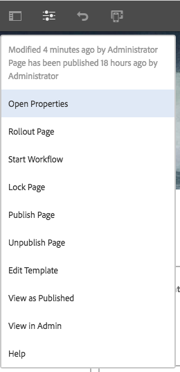
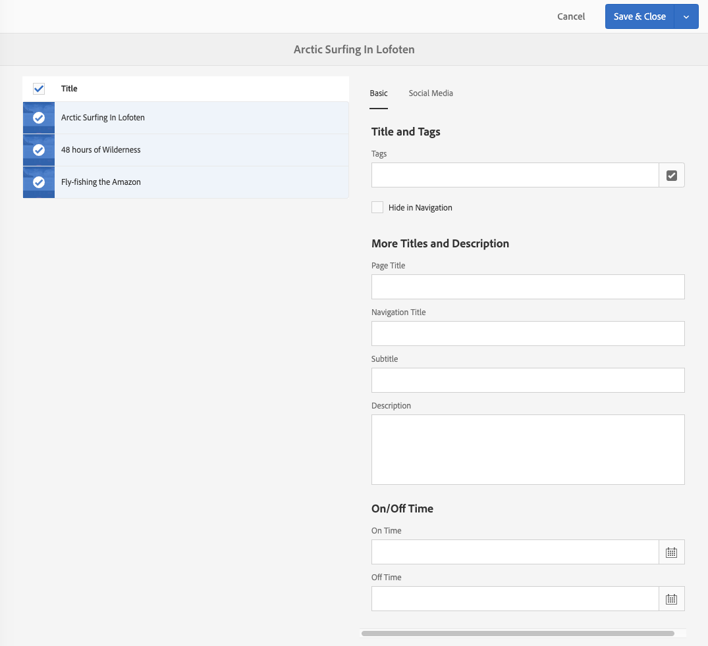

# Pagina-eigenschappen bewerken{#editing-page-properties}

U kunt de vereiste eigenschappen voor een pagina definiëren. Deze kunnen afhankelijk van de aard van de pagina variëren. Sommige pagina&#39;s kunnen bijvoorbeeld zijn verbonden met een live kopie, andere niet en de live kopie-informatie is beschikbaar, indien van toepassing.

## Pagina-eigenschappen {#page-properties}

De eigenschappen worden verdeeld over verscheidene lusjes.

### Standaard {#basic}

* **Titel**

   De titel van de pagina wordt op verschillende locaties weergegeven. Bijvoorbeeld de **Tablijst Websites** en de **Kaart/lijstweergaven van** Sites.

   Dit is een verplicht veld.

* **Tags**

   Hier kunt u codes toevoegen aan of verwijderen uit de pagina door de lijst in het selectievak bij te werken:

   * Nadat u een tag hebt geselecteerd, wordt deze weergegeven onder het selectievak. U kunt een tag uit deze lijst verwijderen met de x.
   * U kunt een volledig nieuwe tag invoeren door de naam in een leeg selectievak te typen.

      * De nieuwe tag wordt gemaakt wanneer u op Enter drukt.
      * De nieuwe tag wordt dan weergegeven met een kleine ster aan de rechterkant die aangeeft dat het een nieuwe tag is.
   * Met de vervolgkeuzefunctie kunt u bestaande tags selecteren.
   * Een x wordt weergegeven wanneer u met de muis over een tag-item in het selectievak beweegt. Hiermee kunt u die tag voor deze pagina verwijderen.

   Zie [Codes gebruiken](/help/sites-authoring/tags.md) voor meer informatie over tags.

* **Verbergen in navigatie**

   Geeft aan of de pagina wordt weergegeven of verborgen in de paginanavigatie van de resulterende site.

* **Paginatitel**

   Een titel die op de pagina moet worden gebruikt. Wordt meestal gebruikt door titelcomponenten. Als de **Titel** leeg is, wordt deze gebruikt.

* **Navigatietitel**

   U kunt een aparte titel opgeven voor gebruik in de navigatie (bijvoorbeeld als u iets beknopter wilt). Als dit leeg is, wordt **Title** gebruikt.

* **Ondertitel**

   Een ondertitel voor gebruik op de pagina.

* **Beschrijving**

   Uw beschrijving van de pagina, het doel of andere details die u wilt toevoegen.

* **Op tijd**

   De datum en het tijdstip waarop de gepubliceerde pagina wordt geactiveerd. Wanneer deze pagina wordt gepubliceerd, blijft deze sluimerend tot de opgegeven tijd.

   Laat deze velden leeg voor pagina&#39;s die u direct wilt publiceren (het normale scenario).

* **Uit-tijd**

   De tijd waarop de gepubliceerde pagina wordt gedeactiveerd.

   Laat deze velden weer leeg voor directe actie.

* **Vanity URL**

   Hiermee kunt u een vanity-URL voor deze pagina invoeren, waarmee u een kortere en/of expressieve URL kunt hebben.

   Als de URL vanity bijvoorbeeld is ingesteld op `welcome`op de pagina die wordt aangegeven door het pad `/v1.0/startpage`voor de website `http://example.com,`, is `http://example.com/welcome`de vanity URL van `http://example.com/content/v1.0/startpage`

   >[!CAUTION]
   >
   >Vanity-URL&#39;s:
   >
   >* Dit moet uniek zijn, dus zorg ervoor dat de waarde niet al door een andere pagina wordt gebruikt.
   >* Geen ondersteuning voor regex-patronen.
   >* Deze mag niet op een bestaande pagina worden ingesteld.

   U moet ook Dispatcher configureren om toegang tot vanity URL&#39;s in te schakelen. Zie [Toegang tot URL&#39;s met Vanity inschakelen](https://docs.adobe.com/content/help/en/experience-manager-dispatcher/using/configuring/dispatcher-configuration.html#enabling-access-to-vanity-urls-vanity-urls) voor meer informatie.

* **Redirect Vanity URL**

   Hiermee geeft u aan of u wilt dat de pagina de vanity-URL gebruikt.

### Geavanceerd {#advanced}

* **Taal**

   De paginataal.

* **Taalbasis**

   Moet worden gecontroleerd als de pagina de wortel van een taalexemplaar is.

* **Omleiden**

   Geef de pagina op waarnaar deze pagina automatisch moet worden omgeleid.

* **Ontwerp**

   Geef het [ontwerp](/help/sites-developing/designer.md) aan dat voor deze pagina moet worden gebruikt.

* **Alias**

   Geef een alias op die voor deze pagina moet worden gebruikt.

   >[!NOTE]
   >
   >Alias plaatst het `sling:alias` bezit om een alias naam voor het middel te bepalen (dit beïnvloedt slechts het middel, niet de weg).
   >
   >Bijvoorbeeld: als u een alias van `latin-lang` voor de knoop `/content/we-retail/spanish` bepaalt, dan kan deze pagina via `/content/we-retail/latin-language` worden betreden
   >
   >Zie [Gelokaliseerde paginanamen onder SEO en URL Management Best Practices](/help/managing/seo-and-url-management.md#localized-page-names) voor meer informatie.

* **Overgenomen van  &lt;>pad *>***

   Geeft aan of de pagina wordt overgeërfd. en waar van.

* **Cloud Configuration**

   Het pad naar de configuratie.

* **Toegestane sjablonen**

   [Definieer de lijst met sjablonen die binnen deze subvertakking ](/help/sites-authoring/templates.md#allowingatemplate) beschikbaar zullen zijn.

* **Inschakelen**  (verificatievereiste)

   Schakel het gebruik van verificatie in (of uit) om toegang te krijgen tot de pagina.

   >[!NOTE]
   >
   >Gesloten gebruikersgroepen voor de pagina worden gedefinieerd op het tabblad **[Machtigingen](/help/sites-authoring/editing-page-properties.md#permissions)**.

   >[!CAUTION]
   >
   >Met het tabblad **[Machtigingen](/help/sites-authoring/editing-page-properties.md#main-pars-procedure-949394300)** kunt u CUG-configuraties bewerken op basis van de aanwezigheid van de `granite:AuthenticationRequired`-mix. Als de paginamachtigingen worden gevormd gebruikend verouderde configuraties van CUG, die op de aanwezigheid van `cq:cugEnabled` bezit worden gebaseerd, zal een waarschuwingsbericht onder **Eis van de Authentificatie** worden getoond en de optie zal niet editable zijn, noch [Toestemmingen](/help/sites-authoring/editing-page-properties.md#permissions) zal editable zijn.
   >
   >
   >In een dergelijk geval moeten de toestemmingen van de KUG in [klassieke UI](/help/sites-classic-ui-authoring/classic-page-author-edit-page-properties.md) worden uitgegeven.

* **Aanmeldingspagina**

   De pagina die voor login moet worden gebruikt.

* **Configuratie exporteren**

   Geef een exportconfiguratie op.

### Miniatuur {#thumbnail}

Hiermee geeft u de miniatuurafbeelding van de pagina weer. U kunt:

* **Voorvertoning genereren**

   Genereer een voorvertoning van de pagina die u als miniatuur wilt gebruiken.

* **Afbeelding uploaden**

   Upload een afbeelding die u als miniatuur wilt gebruiken.

* **Afbeelding selecteren**

   Selecteer een bestaand element dat u als miniatuur wilt gebruiken.

* **Vorige versie**

   Deze optie wordt beschikbaar nadat u een wijziging in de miniatuur hebt aangebracht. Als u de wijziging niet wilt behouden, kunt u die wijziging herstellen voordat u de wijziging opslaat.

### Sociale media {#social-media}

* **Delen via sociale media**

   Definieert de opties voor delen die beschikbaar zijn op de pagina. Hiermee geeft u de opties weer die beschikbaar zijn voor [De kerncomponent delen](https://helpx.adobe.com/experience-manager/core-components/using/sharing.html).

   * **Delen door gebruikers voor Facebook inschakelen**
   * **Gebruikersdeling inschakelen voor Pinterest**
   * **Voorkeur voor XF-**
variatieDefinieer de fragmentvariatie die wordt gebruikt voor het genereren van metagegevens voor de pagina

### Cloud Services {#cloud-services}

* **Cloud Services**

   Definieer eigenschappen voor [cloudservices](/help/sites-developing/extending-cloud-config.md).

### Personalisatie {#personalization}

* **ContextHub-configuraties**

   Selecteer [Configuratie ContextHub](/help/sites-developing/ch-configuring.md) en [Pad van Segmenten](/help/sites-administering/segmentation.md).

* **Doelconfiguratie**

   Selecteer een [Merk om een werkingsgebied voor het richten ](/help/sites-authoring/target-adobe-campaign.md) te specificeren.

   >[!NOTE]
   >Voor deze optie moet de gebruikersaccount deel uitmaken van de `Target Adminstrators`groep.

### Machtigingen {#permissions}

* **Machtigingen**

   Op dit tabblad kunt u het volgende doen:

   * [Machtigingen toevoegen](/help/sites-administering/user-group-ac-admin.md)
   * [Gesloten gebruikersgroep bewerken](/help/sites-administering/cug.md#applying-your-closed-user-group-to-content-pages)

   * [Effectieve machtigingen](/help/sites-administering/user-group-ac-admin.md) weergeven
   >[!CAUTION]
   >
   >Met het tabblad **Machtigingen** kunt u CUG-configuraties bewerken op basis van de aanwezigheid van de `granite:AuthenticationRequired`-mix. Als de paginamachtigingen worden gevormd gebruikend verouderde configuraties van de GIDS, die op de aanwezigheid van `cq:cugEnabled` bezit worden gebaseerd, zal een waarschuwingsbericht worden getoond en de toestemmingen van de GIDS zullen niet editable zijn, noch zal de Vereiste van de Authentificatie op [Geavanceerd](/help/sites-authoring/editing-page-properties.md#advanced) tabel editable zijn.
   >
   >
   >In een dergelijk geval moeten de toestemmingen van de KUG in [klassieke UI](/help/sites-classic-ui-authoring/classic-page-author-edit-page-properties.md) worden uitgegeven.

   >[!NOTE]
   >
   >Het lusje van Toestemmingen staat niet de verwezenlijking van lege groepen CUG toe, die als eenvoudige manier kunnen nuttig zijn om toegang tot elke gebruiker te ontkennen. Om dit te doen moet de Ontdekkingsreiziger van CRX worden gebruikt. Zie het document [User, Group and Access Rights Administration](/help/sites-administering/user-group-ac-admin.md) voor meer informatie.

### Blauwdruk {#blueprint}

* **Blauwdruk**

   Definieer eigenschappen voor een pagina Vervagen binnen [beheer op meerdere locaties](/help/sites-administering/msm.md). Hiermee bepaalt u de omstandigheden waaronder wijzigingen worden doorgegeven aan Live kopie.

### Live kopie {#live-copy}

* **Livecopy**

   Definieer eigenschappen voor een pagina van Live kopie binnen [beheer met meerdere sites](/help/sites-administering/msm.md). Hiermee bepaalt u de omstandigheden waaronder wijzigingen worden doorgegeven via het blauwdruk.

### Sitestructuur {#site-structure}

* Koppelingen maken naar pagina&#39;s die functionaliteit voor de hele site bieden, zoals **Aanmelden van pagina**, **Offlinepagina**, onder andere.

## Pagina-eigenschappen bewerken {#editing-page-properties-1}

U kunt pagina-eigenschappen definiëren:

* Vanuit de **Sites**-console:

   * [Een nieuwe pagina](/help/sites-authoring/managing-pages.md#creating-a-new-page)  maken (een subset van de eigenschappen)

   * **Eigenschappen** klikken of tikken

      * Voor één pagina
      * Voor meerdere pagina&#39;s (alleen een subset van de eigenschappen is beschikbaar voor massabewerking)

* Vanuit de pagina-editor:

   * **Pagina-informatie** gebruiken (en vervolgens **Eigenschappen openen**)

### Uit de siteconsole - Eén pagina {#from-the-sites-console-single-page}

Klik op **Eigenschappen** of tikken om de pagina-eigenschappen te definiëren:

1. Navigeer met de console **Sites** naar de locatie van de pagina waarvoor u eigenschappen wilt weergeven en bewerken.

1. Selecteer de optie **Eigenschappen** voor de vereiste pagina met behulp van:

   * [Snelle acties](/help/sites-authoring/basic-handling.md#quick-actions)
   * [Selectiemodus](/help/sites-authoring/basic-handling.md#selectionmode)

   De pagina-eigenschappen worden weergegeven met de juiste tabbladen.

1. Bekijk of bewerk de eigenschappen naar wens.

1. Gebruik vervolgens **Opslaan** om uw updates op te slaan, gevolgd door **Close** om terug te keren naar de console.

### Bij het bewerken van een pagina {#when-editing-a-page}

Wanneer u een pagina bewerkt, kunt u **Pagina-informatie** gebruiken om de pagina-eigenschappen te definiëren:

1. Open de pagina waarvan u de eigenschappen wilt bewerken.

1. Selecteer het pictogram **Pagina-informatie** om het selectiemenu te openen:

   

1. Selecteer **Eigenschappen openen** en er wordt een dialoogvenster geopend waarin u de eigenschappen kunt bewerken, gesorteerd op het juiste tabblad. De volgende knoppen zijn ook beschikbaar aan de rechterkant van de werkbalk:

   * **Annuleren**
   * **Opslaan en sluiten**

1. Met de knop **Opslaan en sluiten** kunt u de wijzigingen opslaan.

### Uit de siteconsole - Meerdere pagina&#39;s {#from-the-sites-console-multiple-pages}

Vanuit de **Sites**-console kunt u meerdere pagina&#39;s selecteren en vervolgens **Eigenschappen weergeven** gebruiken om de pagina-eigenschappen te bekijken en/of te bewerken. Dit wordt het bulkgewijs bewerken van pagina-eigenschappen genoemd.

>[!NOTE]
>
>Bulkbewerking van eigenschappen is ook beschikbaar voor Elementen. Het is erg vergelijkbaar, maar op een paar punten verschilt het. Zie [Eigenschappen van meerdere elementen bewerken](/help/assets/metadata.md) voor meer informatie.
>
>Er is ook de [Bulk Editor](/help/sites-administering/bulk-editor.md), waarmee u naar inhoud van meerdere pagina&#39;s kunt zoeken met GQL (Google Query Language) en de inhoud vervolgens rechtstreeks in de bulkeditor kunt bewerken voordat u de wijzigingen in de oorspronkelijke pagina&#39;s opslaat.

U kunt meerdere pagina&#39;s selecteren voor bulkbewerking op verschillende manieren, zoals:

* Tijdens het bladeren door de **Sites** console
* Nadat u **Zoeken** hebt gebruikt om een set pagina&#39;s te zoeken

Nadat u de pagina&#39;s hebt geselecteerd en op de optie **Eigenschappen** hebt geklikt of getikt, worden de bulkeigenschappen weergegeven:

U kunt alleen pagina&#39;s bulksgewijs bewerken die:

* Hetzelfde brontype delen
* Maakt geen deel uit van een livecopy

   * Als een van de pagina&#39;s zich in een live kopie bevindt, wordt een bericht weergegeven wanneer de eigenschappen worden geopend.

Nadat u de optie Bulk bewerken hebt ingevoerd, kunt u:

* **Weergave**

   Wanneer u pagina-eigenschappen weergeeft voor meerdere pagina&#39;s, kunt u het volgende zien:

   * Een lijst met de betrokken pagina&#39;s

      * U kunt desgewenst selecteren/deselecteren
   * Tabs

      * Net als bij het weergeven van eigenschappen voor één pagina, worden de eigenschappen onder tabbladen geordend.
   * Een subset van eigenschappen

      * Eigenschappen die beschikbaar zijn op alle geselecteerde pagina&#39;s en die expliciet zijn gedefinieerd als beschikbaar voor bulkbewerking, zijn zichtbaar.
      * Als u de paginaselectie tot één pagina reduceert, zijn alle eigenschappen zichtbaar.
   * Algemene eigenschappen met een gemeenschappelijke waarde

      * Alleen eigenschappen met een gemeenschappelijke waarde worden weergegeven in de weergavemodus.
      * Als het veld meerdere waarden heeft (bijvoorbeeld Tags), worden waarden alleen weergegeven als *all* algemeen zijn. Als slechts enkele van deze voorbeelden algemeen zijn, worden deze alleen weergegeven tijdens het bewerken.

   Wanneer er geen eigenschappen met een gemeenschappelijke waarde bestaan, wordt een bericht weergegeven.

* **Bewerken**

   Bij het bewerken van Pagina-eigenschappen voor meerdere pagina&#39;s:

   * U kunt de waarden in de beschikbare velden bijwerken.

      * De nieuwe waarden worden toegepast op alle geselecteerde pagina&#39;s wanneer u **Done** selecteert.
      * Wanneer het veld meerdere waarden heeft (bijvoorbeeld Codes), kunt u een nieuwe waarde toevoegen of een gemeenschappelijke waarde verwijderen.
   * Velden die algemeen zijn, maar verschillende waarden hebben op de verschillende pagina&#39;s, worden aangegeven met een speciale waarde, zoals de tekst `<Mixed Entries>`. Bij het bewerken van dergelijke velden moet de nodige aandacht worden besteed om gegevensverlies te voorkomen.

>[!NOTE]
>
>De paginacomponent kan worden gevormd om de gebieden te specificeren beschikbaar voor bulkbewerking. Zie [Uw pagina configureren voor bulkbewerking van pagina-eigenschappen](/help/sites-developing/bulk-editing.md).
