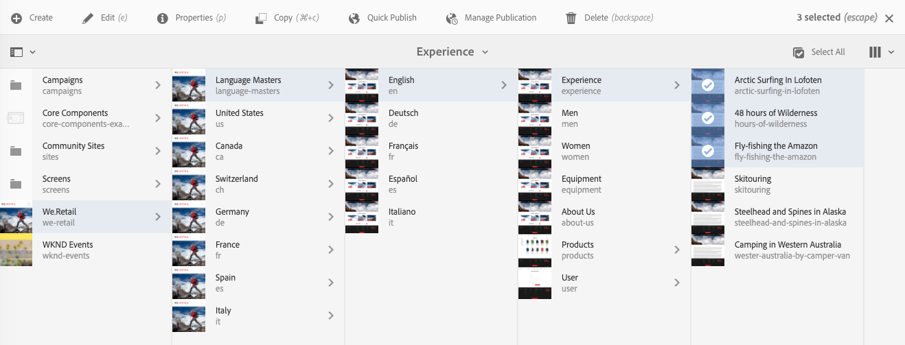

# Pagina-eigenschappen bewerken{#editing-page-properties}

U kunt de vereiste eigenschappen voor een pagina definiëren. Deze kunnen afhankelijk van de aard van de pagina variëren. Sommige pagina&#39;s kunnen bijvoorbeeld zijn verbonden met een live kopie, andere niet en de live kopieergegevens worden beschikbaar, indien van toepassing.

## Pagina-eigenschappen {#page-properties}

De eigenschappen worden verdeeld over verscheidene lusjes.

### Basis {#basic}

* **Titel**

  De titel van de pagina wordt op verschillende locaties weergegeven. Bijvoorbeeld, de **het tablijst van Websites** en de **3&rbrace; kaart/lijstmeningen van Plaatsen &lbrace;.**

  Dit is een verplicht veld.

* **Markeringen**

  Hier kunt u codes toevoegen aan of verwijderen uit de pagina door de lijst in het selectievak bij te werken:

   * Nadat u een tag hebt geselecteerd, wordt deze weergegeven onder het selectievak. U kunt een tag uit deze lijst verwijderen met de x.
   * U kunt een nieuwe tag invoeren door de naam in een leeg selectievak te typen.

      * De nieuwe tag wordt gemaakt wanneer u op Enter drukt.
      * De nieuwe tag wordt weergegeven met een kleine ster aan de rechterkant die aangeeft dat het een nieuwe tag is.

   * Met de vervolgkeuzefunctie kunt u bestaande tags selecteren.
   * Een x wordt weergegeven wanneer u met de muis over een tag-item in het selectievak beweegt. Hiermee kunt u die tag voor deze pagina verwijderen.

  Voor meer informatie over markeringen, zie [ Gebruikend Markeringen ](/help/sites-authoring/tags.md).

* **Verbergen in Navigatie**

  Geeft aan of de pagina wordt weergegeven of verborgen in de paginanavigatie van de resulterende site.

* **Branding**

  Pas een consistente merkidentiteit toe op de verschillende pagina&#39;s door een merkmarkering aan elke paginatitel toe te voegen. Deze functionaliteit vereist gebruik van de Component van de Pagina van versie 2.14.0 of later van de [ Componenten van de Kern.](https://experienceleague.adobe.com/docs/experience-manager-core-components/using/introduction.html?lang=nl-NL)

   * **met voeten treden** - Controle om de merkschuine streep op deze pagina te bepalen.
      * De waarde wordt geërft door om het even welke kindpagina&#39;s tenzij zij ook hun **vastgestelde waarden van de Overschrijving** hebben.
   * **waarde van de Overschrijving** - de tekst van de merkschuine streep die aan de paginatitel moet worden toegevoegd.
      * De waarde wordt toegevoegd aan de paginatitel na een pipe-teken, zoals &quot;Cycling Tuscany&quot; | Altijd klaar voor de WKND&quot;
* **Titel van de Pagina**

  Een titel die op de pagina moet worden gebruikt. Wordt meestal gebruikt door titelcomponenten. Als leeg, wordt de **Titel** gebruikt.

* **Titel van de Navigatie**

  U kunt een aparte titel opgeven voor gebruik in de navigatie (bijvoorbeeld als u iets beknopter wilt). Als leeg, wordt de **Titel** gebruikt.

* **Ondertitel**

  Een ondertitel voor gebruik op de pagina.

* **Beschrijving**

  Uw beschrijving van de pagina, het doel of andere details die u wilt toevoegen.

* **op Tijd**

  De datum en tijd waarop de gepubliceerde pagina wordt geactiveerd. Wanneer deze pagina wordt gepubliceerd, blijft deze sluimerend tot de opgegeven tijd.

  Laat deze velden leeg voor pagina&#39;s die u direct wilt publiceren (het normale scenario).

* **Van Tijd**

  De tijd waarop de gepubliceerde pagina wordt gedeactiveerd.

  Laat deze velden weer leeg voor directe actie.

* **Vanity URL**

  Voer een vanity-URL voor deze pagina in, zodat u een kortere en/of meer expressieve URL kunt gebruiken.

  Bijvoorbeeld, als de URL van de Vanity aan `welcome` aan de pagina wordt geplaatst die door de weg `/v1.0/startpage` voor de website `http://example.com,` wordt geïdentificeerd dan `http://example.com/welcome` zou ijdelheid URL van `http://example.com/content/v1.0/startpage` zijn

  >[!CAUTION]
  >
  >Vanity-URL&#39;s:
  >
  >* Moet uniek zijn. Zorg ervoor dat de waarde nog niet door een andere pagina wordt gebruikt.
  >* Geen ondersteuning voor regex-patronen.
  >* Deze mag niet op een bestaande pagina worden ingesteld.
  >

  Configureer Dispatcher om toegang tot vanity-URL&#39;s in te schakelen. Zie [ Toelatend Toegang tot Vanity URLs ](https://experienceleague.adobe.com/docs/experience-manager-dispatcher/using/configuring/dispatcher-configuration.html?lang=nl-NL#enabling-access-to-vanity-urls-vanity-urls) voor meer details.

* **Redirect Vanity URL**

  Hiermee geeft u aan of u wilt dat de pagina de vanity-URL gebruikt.

### Geavanceerd {#advanced}

* **Taal**

  De paginataal.

* **Wortel van de Taal**

  Moet worden gecontroleerd als de pagina de wortel van een taalexemplaar is.

* **opnieuw richten**

  Geef de pagina op waarnaar deze pagina automatisch moet worden omgeleid.

* **Ontwerp**

  Wijs op het [ ontwerp ](/help/sites-developing/designer.md) dat voor deze pagina moet worden gebruikt.

* **Alias**

  Geef een alias op die voor deze pagina moet worden gebruikt.

   * Als u bijvoorbeeld een alias van `private` voor de pagina `/content/wknd/us/en/magazine/members-only` definieert, kunt u deze pagina ook openen via `/content/wknd/us/en/magazine/private`
   * Als u een alias maakt, wordt de eigenschap `sling:alias` op het paginaknooppunt ingesteld. Dit heeft alleen invloed op de bron, niet op het pad naar de opslagplaats.
   * Pagina&#39;s die door aliassen in de editor worden benaderd, kunnen niet worden gepubliceerd. [ de opties van Publish ](/help/sites-authoring/publishing-pages.md) in de redacteur zijn slechts beschikbaar voor pagina&#39;s die via hun daadwerkelijke wegen worden betreden.
   * Voor verdere details, zie [ Gelokaliseerde paginanamen onder SEO en de Beste praktijken van het Beheer URL ](/help/managing/seo-and-url-management.md#localized-page-names).

* **Geërft van &lt;*weg* >**

  Geeft aan of de pagina wordt overgeërfd. en waar van.

* **Configuratie van de Wolk**

  Het pad naar de configuratie.

* **Toegestane Malplaatjes**

  [ bepaalt de lijst van malplaatjes die ](/help/sites-authoring/templates.md#allowingatemplate) binnen deze subtak beschikbaar zijn.

* **laat** toe (het Vereiste van de Authentificatie)

  Schakel het gebruik van verificatie in (of uit), zodat u toegang kunt krijgen tot de pagina.

  >[!NOTE]
  >
  >De gesloten gebruikersgroepen voor de pagina worden bepaald op de **[Toestemmingen](/help/sites-authoring/editing-page-properties.md#permissions)** tabel.

  >[!CAUTION]
  >
  >Het **[lusje van Toestemmingen](/help/sites-authoring/editing-page-properties.md#main-pars-procedure-949394300)** staat het uitgeven van de configuraties van de KUG toe die op de aanwezigheid van de `granite:AuthenticationRequired` mengen worden gebaseerd. Als de paginamachtigingen gebruikend afgekeurde configuraties van de CUG worden gevormd, die op de aanwezigheid van `cq:cugEnabled` bezit worden gebaseerd, wordt een waarschuwingsbericht getoond onder **de Vereiste van de Authentificatie** en de optie is niet editable, noch zijn de [ Toestemmingen ](/help/sites-authoring/editing-page-properties.md#permissions) editable.
  >
  >
  >In zulk een geval moeten de toestemmingen van de KUG in [ klassieke UI ](/help/sites-classic-ui-authoring/classic-page-author-edit-page-properties.md) worden uitgegeven.

* **Login Pagina**

  De pagina die voor login moet worden gebruikt.

* **de Configuratie van de Uitvoer**

  Geef een exportconfiguratie op.

### Miniatuur {#thumbnail}

Hiermee geeft u de miniatuurafbeelding van de pagina weer. U kunt:

* **produceer Voorproef**

  Genereer een voorvertoning van de pagina die u als miniatuur wilt gebruiken.

* **upload Beeld**

  Upload een afbeelding die u als miniatuur wilt gebruiken.

* **Uitgezochte Beeld**

  Selecteer een bestaand element dat u als miniatuur wilt gebruiken.

* **terugkeren**

  Deze optie wordt beschikbaar nadat u de miniatuur hebt gewijzigd. Als u de wijziging niet wilt behouden, kunt u die wijziging herstellen voordat u de wijziging opslaat.

### Sociale media {#social-media}

* **Sociale Media die** delen

  Definieert de opties voor delen die beschikbaar zijn op de pagina. Toont de opties die aan [ beschikbaar zijn delend kerncomponent ](https://experienceleague.adobe.com/docs/experience-manager-core-components/using/wcm-components/sharing.html?lang=nl-NL).

   * **laat gebruiker toe delend voor Facebook**
   * **laat gebruiker toe delend voor Pinterest**
   * **VoorkeurXF variatie**
Variatie van ervaringsfragment definiëren die wordt gebruikt voor het genereren van metagegevens voor een pagina

### Cloud Servicen {#cloud-services}

* **Cloud Servicen**

  Bepaal eigenschappen voor [ wolkendiensten ](/help/sites-developing/extending-cloud-config.md).

### Personalization {#personalization}

* **Configuraties ContextHub**

  Selecteer de [ Configuratie ContextHub ](/help/sites-developing/ch-configuring.md) en [ Weg van Segmenten ](/help/sites-administering/segmentation.md).

* **richtend Configuratie**

  Selecteer a [ Merk om een werkingsgebied voor het richten ](/help/sites-authoring/target-adobe-campaign.md) te specificeren.

  >[!NOTE]
  >Deze optie vereist de gebruikersrekening om in de `Target Adminstrators` groep te zijn.

### Machtigingen {#permissions}

* **Toestemmingen**

  Op dit tabblad kunt u het volgende doen:

   * [Machtigingen toevoegen](/help/sites-administering/user-group-ac-admin.md)
   * [Gesloten gebruikersgroep bewerken](/help/sites-administering/cug.md#applying-your-closed-user-group-to-content-pages)

   * Bekijk de [ Effectieve Toestemmingen ](/help/sites-administering/user-group-ac-admin.md)

  >[!CAUTION]
  >
  >Het **lusje van Toestemmingen** staat het uitgeven van de configuraties van de KUG toe die op de aanwezigheid van de `granite:AuthenticationRequired` mengeling worden gebaseerd. Als de paginamachtigingen gebruikend afgekeurde configuraties van de CUG worden gevormd, die op de aanwezigheid van `cq:cugEnabled` bezit worden gebaseerd, wordt een waarschuwingsbericht getoond en de toestemmingen van de CUG zijn niet editable, noch is het Vereiste van de Authentificatie op het [ Geavanceerde ](/help/sites-authoring/editing-page-properties.md#advanced) lusje editable.
  >
  >
  >In zulk een geval moeten de toestemmingen van de KUG in [ klassieke UI ](/help/sites-classic-ui-authoring/classic-page-author-edit-page-properties.md) worden uitgegeven.

  >[!NOTE]
  >
  >Het lusje van Toestemmingen staat niet de verwezenlijking van lege groepen CUG toe, die als eenvoudige manier kunnen nuttig zijn om toegang tot elke gebruiker te ontkennen. Hiervoor moet CRX Explorer worden gebruikt. Zie het document [ Gebruiker, Groep, en Beleid van de Rechten van de Toegang ](/help/sites-administering/user-group-ac-admin.md) voor meer informatie.

### Blauwdruk {#blueprint}

* **Vervaging**

  Bepaal eigenschappen voor een pagina van de Vervaging binnen [ multi-site beheer ](/help/sites-administering/msm.md). Hiermee bepaalt u de omstandigheden waaronder wijzigingen worden doorgegeven aan Live kopie.

### Live kopie {#live-copy}

* **Livecopy**

  Bepaal eigenschappen voor een Levende pagina van het Exemplaar binnen [ multi-site beheer ](/help/sites-administering/msm.md). Hiermee bepaalt u de omstandigheden waaronder wijzigingen worden doorgegeven vanuit het deelvenster Vervagen.

### Sitestructuur {#site-structure}

* Verstrek verbindingen aan pagina&#39;s die plaats-brede functionaliteit, zoals **pagina van de Aantekening**, **Off-line Pagina**, onder anderen verstrekken.

## Pagina-eigenschappen bewerken {#editing-page-properties-1}

U kunt pagina-eigenschappen definiëren:

* Van de **console van Plaatsen**:

   * [ Creërend een pagina ](/help/sites-authoring/managing-pages.md#creating-a-new-page) (een ondergroep van de eigenschappen)

   * Het klikken of het tappen **Eigenschappen**

      * Voor één pagina
      * Voor meerdere pagina&#39;s (alleen een subset van de eigenschappen is beschikbaar voor massabewerking)

* Vanuit de pagina-editor:

   * **Pagina-informatie** gebruiken (en vervolgens **Eigenschappen openen**)

### Vanuit de siteconsole - Eén pagina {#from-the-sites-console-single-page}

Het klikken of het tappen **Eigenschappen** om de pagina eigenschappen te bepalen:

1. Gebruikend de **console van Plaatsen**, navigeer aan de plaats van de pagina waarvoor u eigenschappen bekijken en wilt uitgeven.

1. Selecteer de **optie van Eigenschappen** voor de vereiste pagina die of gebruikt:

   * [Snelle acties](/help/sites-authoring/basic-handling.md#quick-actions)
   * [Selectiemodus](/help/sites-authoring/basic-handling.md#selectionmode)

   De pagina-eigenschappen worden weergegeven met de juiste tabbladen.

1. Bekijk of bewerk de eigenschappen naar wens.

1. Dan gebruik **sparen** om uw updates te bewaren die door **worden gevolgd dicht** zodat kunt u aan de console terugkeren.

### Bij het bewerken van een pagina {#when-editing-a-page}

Wanneer het uitgeven van een pagina, kunt u **Informatie van de Pagina** gebruiken om de paginaeigenschappen te bepalen:

1. Open de pagina waarvan u de eigenschappen wilt bewerken.

1. Selecteer het **pictogram van de Informatie van de Pagina** om het selectiemenu te openen:

   

1. Selecteer **Open Eigenschappen** en een dialoogdoos opent het laten u de eigenschappen uitgeven, die door het aangewezen lusje worden gesorteerd. De volgende knoppen zijn ook beschikbaar aan de rechterkant van de werkbalk:

   * **annuleert**
   * **sparen &amp; Sluiten**

1. Gebruik **sparen &amp; sluit** knoop om de veranderingen te bewaren.

### Van de Console van Plaatsen - Meerdere Pagina&#39;s {#from-the-sites-console-multiple-pages}

Van de **console van Plaatsen**, kunt u verscheidene pagina&#39;s dan gebruiken **Eigenschappen van de Mening** om de pagina eigenschappen te bekijken en/of uit te geven. Dit wordt het bulkgewijs bewerken van pagina-eigenschappen genoemd.

>[!NOTE]
>
>Bulkbewerking van eigenschappen is ook beschikbaar voor Assets. Het is vergelijkbaar, maar op een paar punten verschilt het. Zie [ het Uitgeven Eigenschappen van Veelvoudige Assets ](/help/assets/metadata.md) voor details.
>
>Er is ook de [ BulkRedacteur ](/help/sites-administering/bulk-editor.md). Met deze editor kunt u zoeken naar inhoud van meerdere pagina&#39;s met behulp van GQL (Google Query Language) en de inhoud vervolgens rechtstreeks bewerken met de Bulk-editor voordat u de wijzigingen opslaat in de oorspronkelijke pagina&#39;s.

U kunt meerdere pagina&#39;s selecteren voor bulkbewerking op verschillende manieren, zoals:

* Wanneer het doorbladeren van de **console van Plaatsen**
* Na het gebruiken van **Onderzoek** om van een reeks pagina&#39;s de plaats te bepalen

Na het selecteren van de pagina&#39;s en dan het klikken of het tikken van de **optie van Eigenschappen**, worden de bulkeigenschappen getoond:

U kunt alleen pagina&#39;s bulksgewijs bewerken die:

* Hetzelfde brontype delen
* Maakt geen deel uit van een livecopy

   * Als een van de pagina&#39;s zich in een live kopie bevindt, wordt een bericht weergegeven wanneer de eigenschappen worden geopend.

Nadat u de optie Bulk bewerken hebt ingevoerd, kunt u het volgende doen:

* **Mening**

  Wanneer u Pagina-eigenschappen voor meerdere pagina&#39;s bekijkt, ziet u het volgende:

   * Een lijst met de betrokken pagina&#39;s

      * U kunt desgewenst selecteren of deselecteren

   * Tabs

      * Net als bij het weergeven van eigenschappen voor één pagina, worden de eigenschappen onder tabbladen geordend.

   * Een subset van eigenschappen

      * Eigenschappen die beschikbaar zijn op alle geselecteerde pagina&#39;s en die expliciet zijn gedefinieerd als beschikbaar voor bulkbewerking, zijn zichtbaar.
      * Als u de paginaselectie tot één pagina reduceert, zijn alle eigenschappen zichtbaar.

   * Algemene eigenschappen met een gemeenschappelijke waarde

      * Alleen eigenschappen met een gemeenschappelijke waarde worden weergegeven in de weergavemodus.
      * Wanneer het gebied multi-waarde (bijvoorbeeld, Markeringen) is, worden de waarden slechts getoond wanneer *allen* gemeenschappelijk zijn. Als slechts enkele van de algemene voorbeelden voorkomen, worden deze alleen weergegeven tijdens het bewerken.

  Wanneer er geen eigenschappen met een gemeenschappelijke waarde bestaan, wordt een bericht weergegeven.

* **geeft** uit

  Bij het bewerken van Pagina-eigenschappen voor meerdere pagina&#39;s:

   * U kunt de waarden in de beschikbare velden bijwerken.

      * De nieuwe waarden worden toegepast op alle geselecteerde pagina&#39;s wanneer u **Gereed** selecteert.
      * Als het veld meerdere waarden heeft (bijvoorbeeld Codes), kunt u een nieuwe waarde toevoegen of een gemeenschappelijke waarde verwijderen.

   * Velden die veel voorkomen, maar verschillende waarden hebben op de verschillende pagina&#39;s, worden aangegeven met een speciale waarde, zoals de tekst `<Mixed Entries>` .

>[!NOTE]
>
>De paginacomponent kan worden gevormd om de gebieden te specificeren beschikbaar voor bulkbewerking. Zie [ Vormend uw pagina voor bulkhet uitgeven van paginaeigenschappen ](/help/sites-developing/bulk-editing.md).
