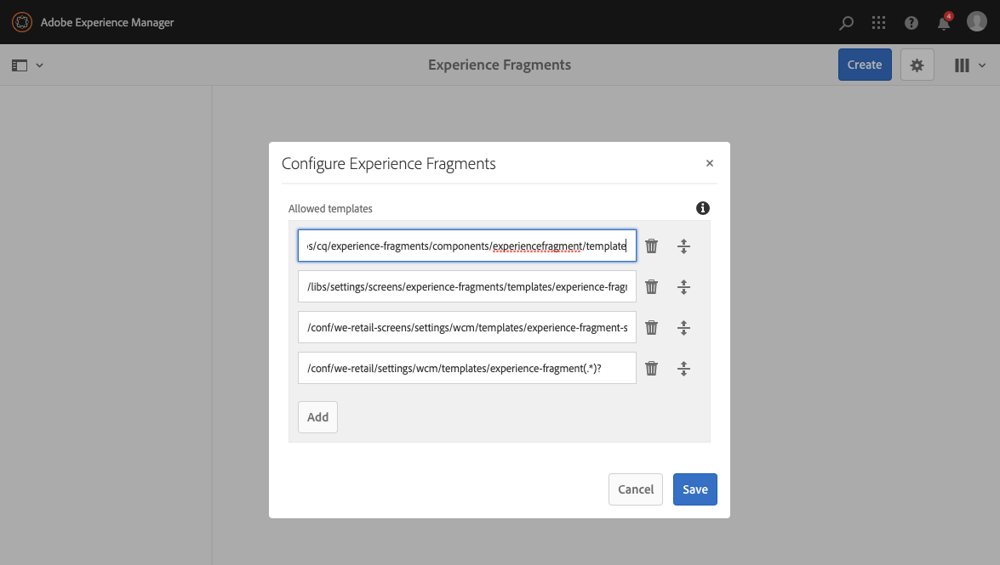

# Ervaar fragmenten{#experience-fragments}

Een ervaringsfragment is een groep van een of meer componenten, inclusief inhoud en lay-out, waarnaar op pagina&#39;s kan worden verwezen. Ze kunnen elke gewenste component bevatten.

Een ervaringsfragment:

* Maakt deel uit van een ervaring (pagina).
* Kan op meerdere pagina&#39;s worden gebruikt.
* Is gebaseerd op een malplaatje (editable slechts) om structuur en componenten te bepalen.
* Deze sjabloon wordt gebruikt om de *hoofdpagina* van het ervaringsfragment.
* Bestaat uit een of meer componenten, met layout, in een alineasysteem.
* Kan andere ervaringsfragmenten bevatten.
* Kan worden gecombineerd met andere componenten (waaronder andere Experience Fragments) om een volledige pagina (ervaring) te vormen.
* Een of meer variaties kunnen worden gemaakt op basis van de basispagina.
* Deze variaties kunnen inhoud en/of componenten delen.
* Kan worden opgedeeld in bouwstenen die kunnen worden gebruikt voor meerdere variaties van het fragment.

U kunt Experience Fragments gebruiken:

* Als een auteur onderdelen (een fragment van een ervaring) van een pagina opnieuw wil gebruiken, moet hij of zij dat fragment kopiëren en plakken. Het maken en onderhouden van deze kopiëren/plakken-ervaringen kost veel tijd en is vaak het gevolg van gebruikersfouten. De Fragmenten van de ervaring elimineren de behoefte aan exemplaar/deeg.
* Om het hoofdloze gebruik-geval CMS te steunen. Auteurs willen AEM alleen gebruiken voor ontwerpen, maar niet voor levering aan de klant. Een systeem/aanraakpunt van derden zou deze ervaring gebruiken en vervolgens leveren aan de eindgebruiker.
* Met [Beheer van meerdere sites (MSM)](/help/sites-administering/msm.md); een ervaringsfragment maakt deel uit van een pagina. Dit geldt zowel voor de afzonderlijke fragmenten als voor de mappen waarin deze zich bevinden.

>[!NOTE]
>
>Schrijf toegang voor ervaringsfragmenten vereist dat de gebruikersaccount in de groep wordt geregistreerd:
>
>    `experience-fragments-editors`
>
>Neem contact op met de systeembeheerder als er problemen optreden.

## Wanneer moet u ervaringsfragmenten gebruiken? {#when-should-you-use-experience-fragments}

Er moeten ervaringsfragmenten worden gebruikt:

* Wanneer u ervaringen wilt hergebruiken.

   * Ervaringen die opnieuw worden gebruikt met dezelfde of vergelijkbare inhoud

* Wanneer u AEM gebruikt als platform voor het leveren van inhoud voor derden.

   * Om het even welke oplossing die AEM als platform van de inhoudslevering wil gebruiken
   * Inhoud insluiten in aanraakpunten van derden

* Als u ervaring hebt met verschillende variaties of uitvoeringen.

   * Kanaal- of contextspecifieke variaties
   * Ervaringen die zinvol zijn om te groeperen (bijvoorbeeld een campagne met verschillende ervaringen op verschillende kanalen)

* Wanneer u Omnichannel Commerce gebruikt.

   * Inhoud met betrekking tot handel delen op [sociale media](/help/sites-developing/experience-fragments.md#social-variations) kanalen op schaal
   * Transactie van aanraakpunten maken

## Fragmenten voor uw ervaring ordenen {#organizing-your-experience-fragments}

Het wordt aanbevolen:
* mappen gebruiken om uw fragmenten van de ervaring te ordenen,

* [vormen de toegestane malplaatjes op deze omslagen](#configure-allowed-templates-folder).

Door mappen te maken kunt u:

* een zinvolle structuur voor uw ervaringsfragmenten maken, bijvoorbeeld volgens de classificatie

  >[!NOTE]
  >
  >U hoeft de structuur van uw ervaringsfragmenten niet uit te lijnen met de paginastructuur van uw site.

* [de toegestane sjablonen toewijzen op mapniveau](#configure-allowed-templates-folder)

  >[!NOTE]
  >
  >U kunt de [sjablooneditor](/help/sites-authoring/templates.md) om uw eigen sjabloon te maken.

Het WKND-project structureert bepaalde ervaringsfragmenten volgens `Contributors`. De gebruikte structuur illustreert ook hoe andere functies, zoals beheer voor meerdere sites (inclusief taalkopieën), kunnen worden gebruikt.

Zie:

`http://localhost:4502/aem/experience-fragments.html/content/experience-fragments/wknd/language-masters/en/contributors/kumar-selveraj/master`

## Het creëren van en het Vormen van een Omslag voor uw Fragmenten van de Ervaring {#creating-and-configuring-a-folder-for-your-experience-fragments}

Om een omslag voor uw Fragments van de Ervaring tot stand te brengen en te vormen wordt het geadviseerd:

1. [Een map maken](/help/sites-authoring/managing-pages.md#creating-a-new-folder).

1. [Configureer de toegestane sjablonen voor ervaringsfragmenten voor die map](#configure-allowed-templates-folder).

>[!NOTE]
>
>Het is ook mogelijk om [Toegestane sjablonen voor uw instantie](#configure-allowed-templates-instance), maar deze methode **niet** aanbevolen omdat de waarden tijdens de upgrade kunnen worden overschreven.

### Configureer de toegestane sjablonen voor uw map {#configure-allowed-templates-folder}

>[!NOTE]
>
>Dit is de aanbevolen methode voor het opgeven van de **Toegestane sjablonen**, omdat de waarden niet worden overschreven bij een upgrade.

1. Navigeer naar de vereiste **Ervaar fragmenten** map.

1. Selecteer de map en **Eigenschappen**.

1. Geef de reguliere expressie op voor het ophalen van de vereiste sjablonen in het dialoogvenster **Toegestane sjablonen** veld.

   Bijvoorbeeld:
   `/conf/(.*)/settings/wcm/templates/experience-fragment(.*)?`

   Zie:
   `http://localhost:4502/mnt/overlay/cq/experience-fragments/content/experience-fragments/folderproperties.html/content/experience-fragments/wknd`

   

   >[!NOTE]
   >
   >Zie [Sjablonen voor ervaringsfragmenten](/help/sites-developing/experience-fragments.md#templates-for-experience-fragments) voor nadere bijzonderheden.

1. Selecteren **Opslaan en sluiten**.

### Vorm de Toegestane Malplaatjes voor uw Instantie {#configure-allowed-templates-instance}

>[!CAUTION]
>
>Het wordt afgeraden de **Toegestane sjablonen** door deze methode, aangezien de gespecificeerde malplaatjes bij verbetering kunnen worden beschreven.
>
>Gebruik dit dialoogvenster alleen ter informatie.

1. Navigeer naar de vereiste **Ervaar fragmenten** console.

1. Selecteren **Configuratieopties**:

   

1. Geef de vereiste sjablonen op in het dialoogvenster **Fragmenten voor ervaring configureren** dialoogvenster:

   

   >[!NOTE]
   >
   >Zie [Sjablonen voor ervaringsfragmenten](/help/sites-developing/experience-fragments.md#templates-for-experience-fragments) voor nadere bijzonderheden.

1. Selecteren **Opslaan**.

## Een ervaringsfragment maken {#creating-an-experience-fragment}

Een ervaringsfragment maken:

1. Selecteer Fragmenten van de Ervaring van de Globale Navigatie.

   

1. Ga naar de gewenste map en selecteer **Maken**.

   

1. Selecteren **Ervaar fragment** om de **Experience Fragment maken** wizard.

   Selecteer de vereiste **sjabloon** en kies vervolgens **Volgende**:

   

1. Voer de **Eigenschappen** voor uw **Experience-fragment** in.

   A **Titel** is verplicht. Als de **Naam** wordt leeg gelaten, wordt het afgeleid van de **Titel**.

   

   >[!NOTE]
   >
   >Labels uit de sjabloon Fragmentervaring worden niet samengevoegd met codes op de basispagina van dit ervaringsfragment.
   >
   >Deze zijn volledig gescheiden.

1. Klikken **Maken**.

   Er wordt een bericht weergegeven. Selecteren:

   * **Gereed** om naar de console terug te keren

   * **Openen** om de fragmenteditor te openen

## Uw ervaringsfragment bewerken {#editing-your-experience-fragment}

De Experience Fragment Editor biedt u vergelijkbare mogelijkheden als de normale pagina-editor.

>[!NOTE]
>
>Zie [Pagina-inhoud bewerken](/help/sites-authoring/editing-content.md) voor meer informatie over het gebruik van de pagina-editor.

De volgende voorbeeldprocedure laat zien hoe u een gummetje voor een product kunt maken:

1. Sleep een **Teaser** van de [Browser voor componenten](/help/sites-authoring/author-environment-tools.md#components-browser).

   

1. Selecteren **[Configureren](/help/sites-authoring/editing-content.md#edit-configure-copy-cut-delete-paste)** op de werkbalk van de component.
1. Voeg de **asset** toe en definieer desgewenst de **eigenschappen**.
1. De definities bevestigen met **Gereed** (tik pictogram).
1. Voeg desgewenst meer componenten toe.

## Een ervaringsfragmentvariatie maken {#creating-an-experience-fragment-variation}

U kunt variaties van uw Fragment van de Ervaring tot stand brengen, afhankelijk van uw behoeften:

1. Open het fragment voor [bewerken](/help/sites-authoring/experience-fragments.md#editing-your-experience-fragment).
1. Open de **Variaties** tab.

   

1. **Maken** kunt u maken:

   * **Variatie**
   * **Variatie als [live-kopie](/help/sites-administering/msm.md#live-copies)**.

     >[!NOTE]
     >
     >Als u een initiële variatie maakt als Live kopie, wordt de titel overgenomen door de bron van Live kopie als de hoofdvariatie te gebruiken.

1. Definieer de vereiste eigenschappen:

   * **Sjabloon**
   * **Titel**
   * **Naam**; indien leeg gelaten, wordt het afgeleid van de titel
   * **Beschrijving**
   * **Variatietags**

   

1. Bevestigen met **Gereed** (tik pictogram), wordt de nieuwe variatie getoond in het paneel:

   

## Uw ervaringsfragment gebruiken {#using-your-experience-fragment}

U kunt het fragment van de Ervaring nu gebruiken wanneer het ontwerpen van uw pagina&#39;s:

1. Open een pagina om te bewerken.

   Bijvoorbeeld: [https://localhost:4502/editor.html/content/we-retail/language-masters/en/products/men.html](https://localhost:4502/editor.html/content/we-retail/language-masters/en/products/men.html)

1. Maak een instantie van de component Experience Fragment door de component van de browser Components naar het alineasysteem van de pagina te slepen:

   

1. Voeg het daadwerkelijke Fragment van de Ervaring aan de componenteninstantie toe; of:

   * Sleep het vereiste fragment vanuit de middelenbrowser en zet het neer op de component
   * Selecteren **Configureren** op de componentwerkbalk en geef het te gebruiken fragment op, bevestigen met **Gereed** (tik)

   

   >[!NOTE]
   >
   >Bewerken werkt op de werkbalk van de component als een sneltoets waarmee het fragment in de fragmenteditor wordt geopend.

## Bouwstenen {#building-blocks}

U kunt een of meer componenten selecteren om een bouwsteen voor recycling binnen uw fragment te maken:

### Een bouwblok maken {#creating-a-building-block}

Een bouwblok maken:

1. In de redacteur van het Fragment van de Ervaring, selecteer de componenten u wilt hergebruiken:

   

1. Selecteer op de werkbalk Componenten de optie **Omzetten in bouwsteen**:

   

1. Voer de naam van de **bouwsteen** in en bevestig dit met **Converteren**:

   

1. De **Bouwsteen** wordt weergegeven op het tabblad en kan in het alineasysteem worden geselecteerd:

   

#### Een bouwblok beheren {#managing-a-building-block}

Uw bouwsteen is zichtbaar in **Bouwstenen** tab. Voor elk blok zijn de volgende acties beschikbaar:

* Ga naar stramien: open de variatie van de basispagina in een nieuw tabblad
* Naam wijzigen
* Verwijderen

#### Een bouwsteen gebruiken {#using-a-building-block}

U kunt de bouwsteen naar het alineasysteem van om het even welk fragment slepen, zoals met om het even welke component.

## Details van uw ervaringsfragment {#details-of-your-experience-fragment}

Details van het fragment kunt u zien:

1. De details worden getoond in alle meningen van **Ervaar fragmenten** console, met de **Lijstweergave** , met inbegrip van nadere gegevens over een [exporteren naar doel](/help/sites-administering/experience-fragments-target.md):

   

1. Wanneer u het dialoogvenster **Eigenschappen** van het ervaringsfragment:

   

   De eigenschappen zijn beschikbaar op verschillende tabbladen:

   >[!CAUTION]
   >
   >Deze tabbladen worden weergegeven wanneer u **Eigenschappen** van de console van de Fragmenten van de Ervaring.
   >
   >
   >Als u **Eigenschappen opent** tijdens het bewerken van een Experience-fragment, worden de juiste [Pagina-eigenschappen](/help/sites-authoring/editing-page-properties.md) weergegeven.

   

   * **Basis**

      * **Titel** - verplicht

      * **Beschrijving**
      * **Tags**
      * **Totaal aantal varianten** - alleen informatie

      * **Aantal webvarianten** - alleen informatie
      * **Aantal niet-webvarianten** - inf **Alleen formatie**

      * **Aantal pagina&#39;s dat dit fragment gebruikt** - alleen informatie

   * **Cloud Servicen**

      * **Cloud Configuration**
      * **Configuraties van Cloud Servicen**
      * **Facebook-pagina-id**
      * **Pinterest board**

   * **Verwijzingen**

      * Een lijst met referenties.

   * **Status van sociale media**

      * Bijzonderheden over variaties in sociale media.

## De normale HTML-vertoning {#the-plain-html-rendition}

Met de `.plain.` in de URL hebt, kunt u vanuit de browser toegang krijgen tot de uitvoering van normale HTML.

>[!NOTE]
>
>Hoewel dit direct beschikbaar is in de browser, [het primaire doel is om andere toepassingen (bijvoorbeeld webapps van derden, aangepaste mobiele implementaties) rechtstreeks toegang te geven tot de inhoud van het Experience Fragment, waarbij alleen de URL wordt gebruikt](/help/sites-developing/experience-fragments.md#the-plain-html-rendition).

## Exporteren van ervaringsfragmenten {#exporting-experience-fragments}

Standaard worden Experience Fragments geleverd in de HTML-indeling. Dit kan zowel door AEM als derdekanalen worden gebruikt.

Voor export naar Adobe Target kan JSON ook worden gebruikt. Zie [Doelintegratie met ervaringsfragmenten](/help/sites-administering/experience-fragments-target.md) voor volledige informatie.
