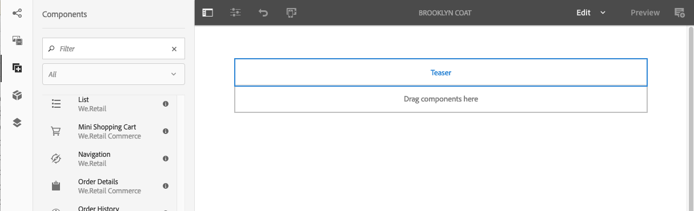

# Ervaar fragmenten{#experience-fragments}

Een ervaringsfragment is een groep van een of meer componenten, inclusief inhoud en lay-out, waarnaar op pagina&#39;s kan worden verwezen. Ze kunnen elke gewenste component bevatten.

Een ervaringsfragment:

* Maakt deel uit van een ervaring (pagina).
* Kan op meerdere pagina&#39;s worden gebruikt.
* Is gebaseerd op een malplaatje (editable slechts) om structuur en componenten te bepalen.
* Bestaat uit een of meer componenten, met layout, in een alineasysteem.
* Kan andere ervaringsfragmenten bevatten.
* Kan worden gecombineerd met andere componenten (waaronder andere Experience Fragments) om een volledige pagina (ervaring) te vormen.
* Kan verschillende variaties hebben, die inhoud en/of componenten kunnen delen.
* Kan worden opgedeeld in bouwstenen die kunnen worden gebruikt voor meerdere variaties van het fragment.

U kunt Experience Fragments gebruiken:

* Als een auteur onderdelen (een fragment van een ervaring) van een pagina opnieuw wil gebruiken, moet hij of zij dat fragment kopiëren en plakken. Het maken en onderhouden van deze kopiëren/plakken-ervaringen kost veel tijd en is vaak het gevolg van gebruikersfouten. De Fragmenten van de ervaring elimineren de behoefte aan exemplaar/deeg.
* Om het hoofdloze gebruik-geval CMS te steunen. Auteurs willen AEM alleen gebruiken voor ontwerpen, maar niet voor levering aan de klant. Een systeem/aanraakpunt van derden zou deze ervaring gebruiken en vervolgens leveren aan de eindgebruiker.

>[!NOTE]
>
>Schrijf toegang voor ervaringsfragmenten vereist dat de gebruikersaccount in de groep wordt geregistreerd:
>
>    `experience-fragments-editors`
Neem contact op met de systeembeheerder als er problemen optreden.

## Wanneer moet u ervaringsfragmenten gebruiken? {#when-should-you-use-experience-fragments}

Er moeten ervaringsfragmenten worden gebruikt:

* Wanneer u ervaringen wilt hergebruiken.

   * Ervaringen die opnieuw worden gebruikt met dezelfde of vergelijkbare inhoud

* Wanneer u AEM gebruikt als platform voor het leveren van inhoud voor derden.

   * Elke oplossing die AEM als platform voor de levering van inhoud wil gebruiken
   * Inhoud insluiten in aanraakpunten van derden

* Als u ervaring hebt met verschillende variaties of uitvoeringen.

   * Kanaal- of contextspecifieke variaties
   * Ervaringen die zinvol zijn om te groeperen (bijvoorbeeld een campagne met verschillende ervaringen over kanalen)

* Wanneer u Omnichannel Commerce gebruikt.

   * Commerciële inhoud op schaal delen op [sociale media](/help/sites-developing/experience-fragments.md#social-variations)
   * Transactie aanraakpunten maken

## Fragmenten voor uw ervaring ordenen {#organizing-your-experience-fragments}

Het wordt aanbevolen:
* mappen gebruiken om uw fragmenten van de ervaring te ordenen,

* [configureer de toegestane sjablonen voor deze mappen](#configure-allowed-templates-folder).

Door mappen te maken kunt u:

* een zinvolle structuur voor uw ervaringsfragmenten maken; bijvoorbeeld volgens classificatie

   >[!NOTE]
   U hoeft de structuur van uw ervaringsfragmenten niet uit te lijnen met de paginastructuur van uw site.

* [de toegestane sjablonen toewijzen op mapniveau](#configure-allowed-templates-folder)

   >[!NOTE]
   U kunt de [sjablooneditor](/help/sites-authoring/templates.md) gebruiken om uw eigen sjabloon te maken.

Het WKND-project bouwt een aantal ervaringsfragmenten op basis van `Contributors`. De gebruikte structuur illustreert ook hoe andere functies, zoals beheer voor meerdere sites (inclusief taalkopieën), kunnen worden gebruikt.

Zie:

`http://localhost:4502/aem/experience-fragments.html/content/experience-fragments/wknd/language-masters/en/contributors/kumar-selveraj/master`

## Het creëren van en het Vormen van een Omslag voor uw Fragmenten van de Ervaring {#creating-and-configuring-a-folder-for-your-experience-fragments}

Om een omslag voor uw Fragments van de Ervaring tot stand te brengen en te vormen wordt het geadviseerd:

1. [Maak een map](/help/sites-authoring/managing-pages.md#creating-a-new-folder).

1. [Configureer de toegestane sjablonen voor ervaringsfragmenten voor die map](#configure-allowed-templates-folder).

>[!NOTE]
Het is ook mogelijk om de [Toegestane Malplaatjes voor uw instantie](#configure-allowed-templates-instance)te vormen, maar deze methode wordt **niet** geadviseerd aangezien de waarden op verbetering kunnen worden beschreven.

### Configureer de toegestane sjablonen voor uw map {#configure-allowed-templates-folder}

>[!NOTE]
Dit is de geadviseerde methode om de **Toegestane Malplaatjes** te specificeren, aangezien de waarden niet op verbetering zullen worden beschreven.

1. Navigeer naar de map met vereiste **ervaringsfragmenten** .

1. Selecteer de map en vervolgens **Eigenschappen**.

1. Geef de reguliere expressie op voor het ophalen van de vereiste sjablonen in het veld **Toegestane sjablonen** .

   Bijvoorbeeld:
   `/conf/(.*)/settings/wcm/templates/experience-fragment(.*)?`

   Zie:
   `http://localhost:4502/mnt/overlay/cq/experience-fragments/content/experience-fragments/folderproperties.html/content/experience-fragments/wknd`

   

   >[!NOTE]
   Zie [Sjablonen voor ervaringsfragmenten](/help/sites-developing/experience-fragments.md#templates-for-experience-fragments) voor meer informatie.

1. Selecteer **Opslaan en Sluiten**.

### Vorm de Toegestane Malplaatjes voor uw Instantie {#configure-allowed-templates-instance}

>[!CAUTION]
Het wordt afgeraden de **toegestane sjablonen** met deze methode te wijzigen, omdat de opgegeven sjablonen tijdens de upgrade kunnen worden overschreven.
Gebruik dit dialoogvenster alleen ter informatie.

1. Navigeer naar de vereiste **console van Fragments** van de Ervaring.

1. Selecteer **configuratieopties**:

   

1. Geef de vereiste sjablonen op in het dialoogvenster Fragmenten **voor ervaring** configureren:

   

   >[!NOTE]
   Zie [Sjablonen voor ervaringsfragmenten](/help/sites-developing/experience-fragments.md#templates-for-experience-fragments) voor meer informatie.

1. Selecteer **Opslaan**.

## Een ervaringsfragment maken {#creating-an-experience-fragment}

Een ervaringsfragment maken:

1. Selecteer Fragmenten van de Ervaring van de Globale Navigatie.

   

1. Navigeer naar de gewenste map en selecteer **Maken**.

   

1. Selecteer Fragment **van de** Ervaring om de **Create tovenaar van het Fragment** van de Ervaring te openen.

   Selecteer de vereiste **sjabloon** en **kies Volgende**:

   

1. Voer de **eigenschappen** in voor het **ervaringsfragment**.

   Een **titel** is verplicht. Als de **naam** leeg blijft, wordt deze afgeleid van de **titel**.

   

1. Klik op **Maken**.

   Er wordt een bericht weergegeven. Selecteer:

   * **Gereed** om terug te keren naar de console

   * **Openen** om de fragmenteditor te openen

## Uw ervaringsfragment bewerken {#editing-your-experience-fragment}

De Experience Fragment Editor biedt u vergelijkbare mogelijkheden als de normale pagina-editor.

>[!NOTE]
Zie Pagina-inhoud  bewerken voor meer informatie over het gebruik van de pagina-editor.

De volgende voorbeeldprocedure laat zien hoe u een gummetje voor een product kunt maken:

1. Sleep een **taser** vanuit de [Componentbrowser](/help/sites-authoring/author-environment-tools.md#components-browser).

   

1. Selecteer **[Vorm](/help/sites-authoring/editing-content.md#edit-configure-copy-cut-delete-paste)**van de componententoolbar.
1. Voeg het **element** toe en definieer desgewenst de **eigenschappen** .
1. Bevestig de definities met **Gereed** (vinkje).
1. Voeg desgewenst meer componenten toe.

## Een ervaringsfragmentvariatie maken {#creating-an-experience-fragment-variation}

U kunt variaties van uw Fragment van de Ervaring tot stand brengen, afhankelijk van uw behoeften:

1. Open het fragment om het te [bewerken](/help/sites-authoring/experience-fragments.md#editing-your-experience-fragment).
1. Open het tabblad **Variaties** .

   

1. **Met Maken** kunt u:

   * **Variatie**
   * **Variatie als live-kopie**.

1. Definieer de vereiste eigenschappen:

   * **Sjabloonmodel**
   * **Titel**
   * **Naam**; indien niet ingevuld, wordt het afgeleid van de titel
   * **Beschrijving**
   * **Variatietags**
   

1. Bevestig met **Gereed** (vinkpictogram), de nieuwe variant wordt weergegeven in het paneel:

   

## Uw ervaringsfragment gebruiken {#using-your-experience-fragment}

U kunt het fragment van de Ervaring nu gebruiken wanneer het ontwerpen van uw pagina&#39;s:

1. Open een pagina om te bewerken.

   Bijvoorbeeld: [https://localhost:4502/editor.html/content/we-retail/language-masters/en/products/men.html](https://localhost:4502/editor.html/content/we-retail/language-masters/en/products/men.html)

1. Maak een instantie van de component Experience Fragment door de component van de browser Components naar het alineasysteem van de pagina te slepen:

   

1. Voeg het daadwerkelijke fragment van de Ervaring aan de componenteninstantie toe; ofwel:

   * Sleep het vereiste fragment vanuit de middelenbrowser en zet het neer op de component
   * Selecteer **Vorm** van de componententoolbar en specificeer het te gebruiken fragment, bevestig met **Gedaan** (tikken)
   

   >[!NOTE]
   Bewerken werkt op de werkbalk van de component als een sneltoets waarmee het fragment in de fragmenteditor wordt geopend.

## Building Blocks {#building-blocks}

U kunt een of meer componenten selecteren om een bouwsteen voor recycling binnen uw fragment te maken:

### Een bouwblok maken {#creating-a-building-block}

Een nieuw bouwblok maken:

1. In de redacteur van het Fragment van de Ervaring, selecteer de componenten u wilt hergebruiken:

   

1. Selecteer op de werkbalk Componenten de optie **Omzetten in bouwsteen**:

   

1. Voer de naam van het **bouwblok** in en bevestig dit met **Omzetten**:

   

1. Het **bouwblok** wordt weergegeven op het tabblad en kan worden geselecteerd in het alineasysteem:

   

#### Een bouwblok beheren {#managing-a-building-block}

Uw bouwsteen is zichtbaar in de Blokken van de **Bouwstijl** tabel. Voor elk blok zijn de volgende acties beschikbaar:

* Ga naar stramien: de hoofdvariant openen op een nieuw tabblad
* Naam wijzigen
* Verwijderen

#### Een bouwsteen gebruiken {#using-a-building-block}

U kunt de bouwsteen naar het alineasysteem van om het even welk fragment slepen, zoals met om het even welke component.

## Details van uw ervaringsfragment {#details-of-your-experience-fragment}

Details van het fragment kunt u zien:

1. De details worden getoond in alle meningen van de console van Fragmenten **van de** Ervaring, met de Mening **van de** Lijst met details van een [uitvoer naar Doel](/help/sites-administering/experience-fragments-target.md):

   

1. Wanneer u de **eigenschappen** van het ervaringsfragment opent:

   

   De eigenschappen zijn beschikbaar op verschillende tabbladen:

   >[!CAUTION]
   Deze lusjes worden getoond wanneer u **Eigenschappen** van de console van de Fragmenten van de Ervaring opent.
   Als u Eigenschappen **** opent tijdens het bewerken van een Ervingsfragment, worden de juiste [Pagina-eigenschappen](/help/sites-authoring/editing-page-properties.md) weergegeven.

   

   * **Basis**

      * **Titel** - verplicht

      * **Beschrijving**
      * **Tags**
      * **Totaal aantal varianten** - alleen informatie

      * **Aantal webvarianten** - alleen informatie
      * **Aantal niet-webvarianten** - alleen **informatie**

      * **Aantal pagina&#39;s dat dit fragment** gebruikt - alleen informatie
   * **Cloud Services**

      * **Cloud Configuration**
      * **Cloud Service Configurations**
      * **Facebook-pagina-id**
      * **Pinterest board**
   * **Verwijzingen**

      * Een lijst met referenties.
   * **Status van sociale media**

      * Bijzonderheden over variaties in sociale media.

## De normale HTML-uitvoering {#the-plain-html-rendition}

Met de `.plain.` kiezer in de URL hebt u vanuit de browser toegang tot de onbewerkte HTML-uitvoering.

>[!NOTE]
Hoewel dit direct beschikbaar is vanuit de browser, is [het primaire doel dat andere toepassingen (bijvoorbeeld webapps van derden, aangepaste mobiele implementaties) rechtstreeks toegang krijgen tot de inhoud van het Experience Fragment door alleen de URL](/help/sites-developing/experience-fragments.md#the-plain-html-rendition)te gebruiken.

## Exporteren van ervaringsfragmenten {#exporting-experience-fragments}

Experience Fragments worden standaard geleverd in de HTML-indeling. Dit kan zowel door AEM als derdekanalen worden gebruikt.

Voor exporteren naar Adobe Target kan JSON ook worden gebruikt. Zie [Doelintegratie met de Fragmenten](/help/sites-administering/experience-fragments-target.md) van de Ervaring voor volledige informatie.
