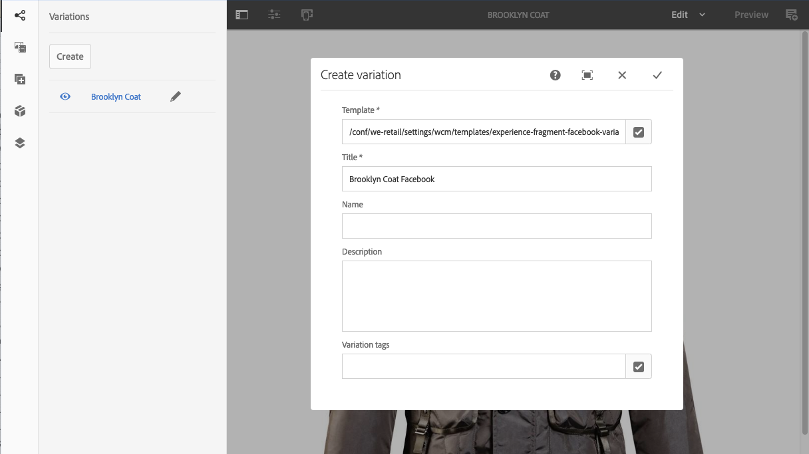

# Ervaar fragmenten{#experience-fragments}

In Adobe Experience Manager (AEM) is een Experience Fragment een groep van een of meer componenten, waaronder inhoud en lay-out, waarnaar op pagina&#39;s kan worden verwezen. Ze kunnen elke gewenste component bevatten.

Een ervaringsfragment:

* Maakt deel uit van een ervaring (pagina).
* Kan op meerdere pagina&#39;s worden gebruikt (die zijn gebaseerd op bewerkbare sjablonen).
* Is gebaseerd op een malplaatje (editable slechts) om structuur en componenten te bepalen.
* Dit malplaatje wordt gebruikt om de *wortelpagina* van het Fragment van de Ervaring tot stand te brengen.
* Bestaat uit een of meer componenten, met layout, in een alineasysteem.
* Kan andere ervaringsfragmenten bevatten.
* Kan worden gecombineerd met andere componenten (waaronder andere Experience Fragments) om een volledige pagina (ervaring) te vormen.
* Een of meer variaties kunnen worden gemaakt op basis van de basispagina.
* Deze variaties kunnen inhoud en/of componenten delen.
* Kan worden opgedeeld in bouwstenen die kunnen worden gebruikt voor meerdere variaties van het fragment.

U kunt Experience Fragments gebruiken:

* Als een auteur delen van een pagina (een fragment van een ervaring) opnieuw wil gebruiken, moet hij of zij dat fragment kopiëren en plakken. Het maken en onderhouden van deze kopiëren/plakken-ervaringen kost veel tijd en is vaak het gevolg van gebruikersfouten. De Fragmenten van de ervaring elimineren de behoefte aan exemplaar/deeg.
* Om de hoofdloze CMS-use-case te ondersteunen. Auteurs willen AEM alleen gebruiken voor ontwerpen, maar niet voor levering aan de klant. Een systeem/aanraakpunt van derden zou deze ervaring gebruiken en vervolgens leveren aan de eindgebruiker.
* Met [ Multisite Beheer (MSM) ](/help/sites-administering/msm.md); als Fragment van de Ervaring maakt deel uit van een pagina. Dit geldt zowel voor de afzonderlijke fragmenten als voor de mappen waarin deze zich bevinden.

>[!NOTE]
>
>Schrijf toegang voor ervaringsfragmenten vereist dat de gebruikersaccount in de groep wordt geregistreerd:
>
>    `experience-fragments-editors`
>
>Neem contact op met de systeembeheerder als er problemen optreden.

## Wanneer moet u ervaringsfragmenten gebruiken? {#when-should-you-use-experience-fragments}

Er moeten ervaringsfragmenten worden gebruikt:

* Wanneer u ervaringen wilt hergebruiken.

   * Ervaringen die opnieuw worden gebruikt met dezelfde of vergelijkbare inhoud

* Wanneer u AEM gebruikt als platform voor het leveren van inhoud voor derden.

   * Om het even welke oplossing die AEM als platform van de inhoudslevering wil gebruiken
   * Inhoud insluiten in aanraakpunten van derden

* Als u ervaring hebt met verschillende variaties of uitvoeringen.

   * Kanaal- of contextspecifieke variaties
   * Ervaringen die zinvol zijn om te groeperen (bijvoorbeeld een campagne met verschillende ervaringen op verschillende kanalen)

* Wanneer u Omnichannel Commerce gebruikt.

   * Het delen van handel-verwante inhoud op [ sociale media ](/help/sites-developing/experience-fragments.md#social-variations) kanalen bij schaal
   * Transactie van aanraakpunten maken

## Fragmenten voor uw ervaring ordenen {#organizing-your-experience-fragments}

Het wordt aanbevolen:
* mappen gebruiken om uw fragmenten van de ervaring te ordenen,

* [ vormt de toegestane malplaatjes op deze omslagen ](#configure-allowed-templates-folder).

Door mappen te maken kunt u:

* een zinvolle structuur voor uw ervaringsfragmenten maken, bijvoorbeeld volgens de classificatie

  >[!NOTE]
  >
  >U hoeft de structuur van uw ervaringsfragmenten niet uit te lijnen met de paginastructuur van uw site.

* [de toegestane sjablonen toewijzen op mapniveau](#configure-allowed-templates-folder)

  >[!NOTE]
  >
  >U kunt de [ malplaatjeredacteur ](/help/sites-authoring/templates.md) gebruiken om uw eigen malplaatje tot stand te brengen.

Het WKND-project structureert een aantal Experience Fragments volgens `Contributors` . De gebruikte structuur illustreert ook hoe andere functies, zoals beheer voor meerdere sites (inclusief taalkopieën), kunnen worden gebruikt.

Zie:

`http://localhost:4502/aem/experience-fragments.html/content/experience-fragments/wknd/language-masters/en/contributors/kumar-selveraj/master`

## Het creëren van en het Vormen van een Omslag voor uw Fragmenten van de Ervaring {#creating-and-configuring-a-folder-for-your-experience-fragments}

Om een omslag voor uw Fragments van de Ervaring tot stand te brengen en te vormen wordt het geadviseerd:

1. [ creeer een omslag ](/help/sites-authoring/managing-pages.md#creating-a-new-folder).

1. [ vormt de toegestane malplaatjes van het Fragment van de Ervaring voor die omslag ](#configure-allowed-templates-folder).

>[!NOTE]
>
>Het is ook mogelijk om de [ Toegestane Malplaatjes voor uw instantie ](#configure-allowed-templates-instance) te vormen, maar deze methode wordt **niet** geadviseerd aangezien de waarden op verbetering kunnen worden beschreven.

### Configureer de toegestane sjablonen voor uw map {#configure-allowed-templates-folder}

>[!NOTE]
>
>Dit is de geadviseerde methode om **Toegestane Malplaatjes** te specificeren, aangezien de waarden niet op verbetering zullen worden beschreven.

1. Navigeer aan de vereiste **omslag van de Fragmenten van de Ervaring**.

1. Selecteer de omslag, en dan **Eigenschappen**.

1. Specificeer de regelmatige uitdrukking voor het terugwinnen van de vereiste malplaatjes op het **Toegelaten gebied van Malplaatjes**.

   Bijvoorbeeld:
   `/conf/(.*)/settings/wcm/templates/experience-fragment(.*)?`

   Zie:
   `http://localhost:4502/mnt/overlay/cq/experience-fragments/content/experience-fragments/folderproperties.html/content/experience-fragments/wknd`

   

   >[!NOTE]
   >
   >Zie [ Malplaatjes voor de Fragmenten van de Ervaring ](/help/sites-developing/experience-fragments.md#templates-for-experience-fragments) voor verdere details.

1. Selecteer **sparen en Sluiten**.

### Vorm de Toegestane Malplaatjes voor uw Instantie {#configure-allowed-templates-instance}

>[!CAUTION]
>
>Het wordt niet geadviseerd om **Toegestane Malplaatjes** door deze methode te veranderen, aangezien de gespecificeerde malplaatjes op verbetering kunnen worden beschreven.
>
>Gebruik dit dialoogvenster alleen ter informatie.

1. Navigeer aan de vereiste **console van de Fragmenten van de Ervaring**.

1. Selecteer **de opties van de Configuratie**:

   

1. Specificeer de vereiste malplaatjes in **vormen de Fragmenten van de Ervaring** dialoog:

   

   >[!NOTE]
   >
   >Zie [ Malplaatjes voor de Fragmenten van de Ervaring ](/help/sites-developing/experience-fragments.md#templates-for-experience-fragments) voor verdere details.

1. Selecteer **sparen**.

## Een ervaringsfragment maken {#creating-an-experience-fragment}

Een ervaringsfragment maken:

1. Selecteer Fragmenten van de Ervaring van de Globale Navigatie.

   

1. Navigeer aan de vereiste omslag en selecteer **creeer**.

   

1. Selecteer **Fragment van de Ervaring** om **te openen creeer de tovenaar van het Fragment van de Ervaring**.

   Selecteer de vereiste **sjabloon** en kies vervolgens **Volgende**:

   

1. Voer de **Eigenschappen** voor uw **Experience-fragment** in.

   A **Titel** is verplicht. Als de **Naam** leeg wordt verlaten zal het uit de **Titel** worden afgeleid.

   

   >[!NOTE]
   >
   >Labels uit de sjabloon Fragmentervaring worden niet samengevoegd met codes op de basispagina van dit ervaringsfragment.
   >
   >Deze zijn volledig gescheiden.

1. Klik **creëren**.

   Er wordt een bericht weergegeven. Selecteren:

   * **Gedaan** om aan de console terug te keren

   * **Open** om de fragmentredacteur te openen

## Uw ervaringsfragment bewerken {#editing-your-experience-fragment}

De Experience Fragment Editor biedt u vergelijkbare mogelijkheden als de normale pagina-editor.

>[!NOTE]
>
>Zie [ het Uitgeven van de Inhoud van de Pagina ](/help/sites-authoring/editing-content.md) voor meer informatie over hoe te om de paginaredacteur te gebruiken.

De volgende voorbeeldprocedure laat zien hoe u een gummetje voor een product kunt maken:

1. De belemmering en laat vallen a **Taser** van [ Browser van Componenten ](/help/sites-authoring/author-environment-tools.md#components-browser).

   

1. Selecteer **[vormen](/help/sites-authoring/editing-content.md#edit-configure-copy-cut-delete-paste)** van de componententoolbar.
1. Voeg de **asset** toe en definieer desgewenst de **eigenschappen**.
1. Bevestig de definities met **Gedaan** (tikkerpictogram).
1. Voeg desgewenst meer componenten toe.

## Een ervaringsfragmentvariatie maken {#creating-an-experience-fragment-variation}

U kunt variaties van uw Fragment van de Ervaring tot stand brengen, afhankelijk van uw behoeften:

1. Open uw fragment voor [ het uitgeven ](/help/sites-authoring/experience-fragments.md#editing-your-experience-fragment).
1. Open het **lusje van Variaties**.

   

1. **creeer** laat u tot stand brengen:

   * **Variatie**
   * **Verandering als [ levend-exemplaar](/help/sites-administering/msm.md#live-copies)**.

     >[!NOTE]
     >
     >Als u een initiële variatie maakt als Live kopie, wordt de titel overgenomen door de Source van Live kopie als de hoofdvariatie te gebruiken.

1. Definieer de vereiste eigenschappen:

   * **Malplaatje**
   * **Titel**
   * **Naam**; als verlaten leeg het uit de Titel zal worden afgeleid
   * **Beschrijving**
   * **de markeringen van de Variatie**

   

1. Bevestig met **Gedaan** (het tikpictogram), wordt de nieuwe variatie getoond in het paneel:

   

## Uw ervaringsfragment gebruiken {#using-your-experience-fragment}

U kunt het fragment van de Ervaring nu gebruiken wanneer het ontwerpen van uw pagina&#39;s:

1. Open een pagina om te bewerken.

   >[!NOTE]
   >
   >De pagina moet zijn gebaseerd op een bewerkbare sjabloon.

   Bijvoorbeeld: [ https://localhost:4502/editor.html/content/we-retail/language-masters/en/products/men.html](https://localhost:4502/editor.html/content/we-retail/language-masters/en/products/men.html)

1. Maak een instantie van de component Experience Fragment door de component van de browser Components naar het alineasysteem van de pagina te slepen:

   

1. Voeg het daadwerkelijke Fragment van de Ervaring aan de componenteninstantie toe; of:

   * Sleep het vereiste fragment uit de Assets-browser en zet het neer op de component
   * Selecteer **vormen** van de componententoolbar en specificeer het te gebruiken fragment, bevestig met **Gedaan** (tikken)

   

   >[!NOTE]
   >
   >Bewerken werkt op de werkbalk van de component als een sneltoets waarmee het fragment in de fragmenteditor wordt geopend.

## Bouwstenen {#building-blocks}

U kunt een of meer componenten selecteren om een bouwsteen voor recycling binnen uw fragment te maken:

### Een bouwblok maken {#creating-a-building-block}

Een bouwblok maken:

1. In de redacteur van het Fragment van de Ervaring, selecteer de componenten u wilt hergebruiken:

   

1. Van de componententoolbar, uitgezochte **Bekeerling aan bouwsteen**:

   

1. Voer de naam van de **bouwsteen** in en bevestig dit met **Converteren**:

   

1. Het **Blok van de Bouw** wordt getoond in het lusje, en kan in het paragraafsysteem worden geselecteerd:

   

#### Een bouwblok beheren {#managing-a-building-block}

Uw bouwsteen is zichtbaar in de **Blokken van de Bouw** tabel. Voor elk blok zijn de volgende acties beschikbaar:

* Ga naar stramien: open de variatie van de basispagina in een nieuw tabblad
* Naam wijzigen
* Verwijderen

#### Een bouwsteen gebruiken {#using-a-building-block}

U kunt de bouwsteen naar het alineasysteem van om het even welk fragment slepen, zoals met om het even welke component.

## Details van uw ervaringsfragment {#details-of-your-experience-fragment}

Details van het fragment kunt u zien:

1. De details worden getoond in alle meningen van de **console van Fragmenten van de 1&rbrace; Ervaring, met de** Mening van de Lijst **met inbegrip van details van een [ uitvoer naar Doel ](/help/sites-administering/experience-fragments-target.md):**

   

1. Wanneer u **Eigenschappen** van het Fragment van de Ervaring opent:

   

   De eigenschappen zijn beschikbaar op verschillende tabbladen:

   >[!CAUTION]
   >
   >Deze lusjes worden getoond wanneer u **Eigenschappen** van de console van de Fragmenten van de Ervaring opent.
   >
   >
   >Als u **Eigenschappen opent** tijdens het bewerken van een Experience-fragment, worden de juiste [Pagina-eigenschappen](/help/sites-authoring/editing-page-properties.md) weergegeven.

   

   * **Basis**

      * **Titel** - verplicht

      * **Beschrijving**
      * **Markeringen**
      * **Totaal aantal varianten** - slechts informatie

      * **Aantal Webvarianten** - slechts informatie
      * **Aantal niet-Web varianten** - slechts de slechts formatie van inf **&#x200B;**

      * **Aantal pagina&#39;s die dit fragment** gebruiken - slechts informatie

   * **Cloud Servicen**

      * **Configuratie van de Wolk**
      * **Configuraties van de Cloud Service**
      * **Facebook pagina ID**
      * **de raad van Pinterest**

   * **Verwijzingen**

      * Een lijst met referenties.

   * **Status Sociale Media**

      * Bijzonderheden over variaties in sociale media.

## De normale HTML-vertoning {#the-plain-html-rendition}

Met de kiezer `.plain.` in de URL hebt u vanuit de browser toegang tot de uitvoering van normale HTML.

>[!NOTE]
>
>Hoewel dit direct beschikbaar van browser is, [ het primaire doel is andere toepassingen (bijvoorbeeld, derdeWeb apps, douane mobiele implementaties) toe te staan om tot de inhoud van het Fragment van de Ervaring direct toegang te hebben, gebruikend slechts URL ](/help/sites-developing/experience-fragments.md#the-plain-html-rendition).

## Exporteren van ervaringsfragmenten {#exporting-experience-fragments}

Standaard worden Experience Fragments geleverd in de HTML-indeling. Dit kan zowel door AEM als derdekanalen worden gebruikt.

Voor export naar Adobe Target kan JSON ook worden gebruikt. Zie [ Integratie van het Doel met de Fragmenten van de Ervaring ](/help/sites-administering/experience-fragments-target.md) voor volledige informatie.
