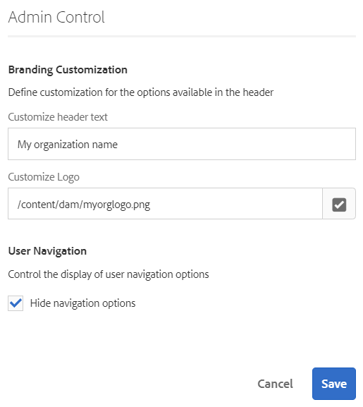

# Uw inbox{#your-inbox}

U kunt meldingen ontvangen van verschillende gebieden van AEM, waaronder workflows en projecten. bijvoorbeeld over:

* Taken:

   * deze kunnen ook worden gecreëerd op verschillende punten binnen de AEM-gebruikersinterface, bijvoorbeeld in het kader van **projecten**;
   * these can be the product of a workflow **Create Task** or **Create Project Task** step.

* Workflows:

   * tijdelijke items die acties vertegenwoordigen die u op pagina-inhoud moet uitvoeren;

      * Dit is het product van de workflow **Deelnemerstappen**
   * items zijn mislukt, zodat beheerders de mislukte stap opnieuw kunnen proberen.

U ontvangt deze meldingen in uw eigen Postvak IN waar u ze kunt bekijken en actie kunt ondernemen.

>[!NOTE]
>
>AEM uit-van-de-doos wordt voorgeladen met administratieve taken die aan de groep van de beheerdergebruiker worden toegewezen. Zie [uit-van-de-doos Administratieve Taken](#out-of-the-box-administrative-tasks) voor details.

>[!NOTE]
>
>Zie ook voor meer informatie over de objecttypen:
>
>* [Projecten](/help/sites-authoring/touch-ui-managing-projects.md)
>* [Projecten - werken met taken](/help/sites-authoring/task-content.md)
>* [Workflows](/help/sites-authoring/workflows.md)
>* [Formulieren](/help/forms/home.md)
>

## Postvak IN van koptekst {#inbox-in-the-header}

Van om het even welke consoles wordt het huidige aantal punten in uw inbox getoond in de kopbal. De indicator kan ook worden geopend om snel toegang te krijgen tot de pagina(&#39;s) waarvoor een actie(s) vereist is of om toegang te krijgen tot het Postvak IN:

>[!NOTE]
>
>Bepaalde acties zullen ook in de [kaartmening van het aangewezen middel](/help/sites-authoring/basic-handling.md#card-view)worden getoond.

## Administratieve taken buiten de box  {#out-of-the-box-administrative-tasks}

Uit-de-doos AEM komt vooraf geladen met vier taken die aan de groep van de beheerdergebruiker worden toegewezen.

* [Analyse en doelgericht configureren](/help/sites-administering/opt-in.md)
* [De AEM-beveiligingscontrolelijst toepassen](/help/sites-administering/security-checklist.md)
* Verzamelde verzameling van verbruiksstatistieken inschakelen
* [HTTPS configureren](/help/sites-administering/ssl-by-default.md)

## De Postvak IN openen {#opening-the-inbox}

Het AEM-meldingsvak openen:

1. Klik/tik op de indicator in de werkbalk.

1. Selecteer **Alles bekijken**. De **AEM Inbox** wordt geopend. In de inbox ziet u items uit workflows, projecten en taken.
1. De standaardweergave is [Lijstweergave](#inbox-list-view), maar u kunt ook schakelen naar [Kalenderweergave](#inbox-calendar-view). Dit gebeurt met de weergavekiezer (werkbalk, rechtsboven).

   Voor beide weergaven kunt u ook [Weergave-instellingen](#inbox-view-settings)definiëren. de beschikbare opties zijn afhankelijk van de huidige weergave.

   

>[!NOTE]
>
>De inbox werkt als console, gebruik dus [Globale navigatie](/help/sites-authoring/basic-handling.md#global-navigation) of [Zoeken](/help/sites-authoring/search.md) om naar een andere locatie te gaan wanneer u klaar bent.

### Postvak IN - Lijstweergave {#inbox-list-view}

In deze weergave worden alle items weergegeven, samen met belangrijke relevante informatie:

### Postvak IN - Kalenderweergave {#inbox-calendar-view}

In deze weergave worden de items weergegeven op basis van hun positie in de kalender en de exacte weergave die u hebt geselecteerd:

U kunt:

* een specifieke weergave te selecteren; **Tijdlijn**, **kolom**, **lijst**

* specify the tasks to display according to **Schedule**; **All**, **Planned**, **In Progress**, **Due Soon**, **Past Due**

* boor neer voor meer gedetailleerde informatie over een punt
* Selecteer een datumbereik waarop u de weergave wilt scherpstellen:

### Postvak IN - Instellingen {#inbox-view-settings}

Voor beide weergaven (Lijst en Kalender) kunt u instellingen definiëren:

* **Kalenderweergave**

   Voor de **kalenderweergave** kunt u het volgende configureren:

   * **Groeperen op**
   * **Planning** of **Geen**
   * **Kaartgrootte**
   

* **Lijstweergave**

   Voor de Mening **van de** Lijst kunt u het soortmechanisme vormen:

   * **Veld sorteren**
   * **Sorteervolgorde**
   

### Inbox - Admin Control {#inbox-admin-control}

Met de optie Beheer beheren kunnen beheerders:

* Koptekst en logo aanpassen

* De weergave van navigatiekoppelingen in koptekst bepalen

De optie Beheer is alleen zichtbaar voor de leden van de groep met beheerders of workflowbeheerders.

* **Aanpassing branding**

   * **Koptekst aanpassen:** Geef de tekst op die in de koptekst moet worden weergegeven ter vervanging van de standaardtekst van **Adobe Experience Manager** .

   * **Logo aanpassen:** Geef de afbeelding op die in de koptekst moet worden weergegeven als logo. Upload een afbeelding in Digital Asset Management (DAM) en verwijs naar die afbeelding in het veld.

* **Gebruikersnavigatie**
   * **Navigatieopties verbergen:** Selecteer deze optie om de beschikbare navigatieopties in de koptekst te verbergen. De navigatieopties omvatten koppelingen naar andere oplossingen, de koppeling van de Hulp, en de auteursopties beschikbaar op het Tikken van het embleem of de tekst van de Manager van de Ervaring van Adobe.
* **Opslaan:** Tik op deze optie of klik op deze optie om de instellingen op te slaan.

## Actie ondernemen op een item {#taking-action-on-an-item}

>[!NOTE]
>
>Hoewel het mogelijk is meerdere items te selecteren, kunnen acties slechts op één item tegelijk worden uitgevoerd.

1. Als u een actie wilt uitvoeren op een item, selecteert u de miniatuur voor het desbetreffende item. Pictogrammen voor de acties die op dat item van toepassing zijn, worden weergegeven op de werkbalk:

   

   De acties zijn geschikt voor het item en omvatten:

   * **Voltooiing** van de actie; bijvoorbeeld een taak- of workflowitem.
   * **Wijs** een punt opnieuw toe/**delegeer** een punt.
   * **Open** een item; afhankelijk van het type item kan deze handeling:

      * itemeigenschappen weergeven
      * een geschikt dashboard of een geschikte wizard voor verdere actie openen
      * open gerelateerde documentatie
   * **Ga terug** naar een vorige stap.
   * Bekijk de lading voor een werkschema.
   * Maak een project van het item.
   >[!NOTE]
   >
   >Zie voor meer informatie:
   >
   >* Workflowitems - [Deelnemen aan workflows](/help/sites-authoring/workflows-participating.md)

1. Afhankelijk van het geselecteerde item wordt een actie gestart. bijvoorbeeld:

   * er wordt een dialoog geopend die op de actie is toegesneden .
   * er wordt een wizard Handelingen gestart.
   * er wordt een documentatiepagina geopend .
   Met **Opnieuw toewijzen** wordt bijvoorbeeld een dialoogvenster geopend:

   

   Afhankelijk van of een dialoogvenster, wizard, documentatiepagina is geopend, kunt u:

   * Bevestig de passende actie; bv. Opnieuw toewijzen.
   * Annuleer de handeling.
   * Pijl-achter; Als bijvoorbeeld een wizard Handelingen of een documentatiepagina is geopend, kunt u terugkeren naar het Postvak IN.

## Een taak maken {#creating-a-task}

In het Postvak IN kunt u taken maken:

1. Selecteer **Maken**, dan **Taak**.
1. Complete the necessary fields in the **Basic** and **Advanced** tabs; only the **Title** is mandatory, all others are optional:

   * **Standaard**:

      * **Titel**
      * **Project**
      * **Geadresseerde**
      * **Inhoud**; Net als bij Payload is dit een verwijzing van de taak naar een locatie in de repository
      * **Beschrijving**
      * **Taakprioriteit**
      * **Begindatum**
      * **Vervaldatum**
   

   * **Geavanceerd**

      * **Naam**: dit wordt gebruikt om de URL te vormen; als het leeg is, wordt het gebaseerd op de **titel**.
   

1. Selecteer **Verzenden**.

## Een project maken {#creating-a-project}

Voor bepaalde taken kunt u een [Project](/help/sites-authoring/projects.md) tot stand brengen dat op die taak wordt gebaseerd:

1. Selecteer de gewenste taak door op de miniatuur te tikken of te klikken.

   >[!NOTE]
   >
   >Alleen taken die zijn gemaakt met de optie **Maken** van **Inbox** kunnen worden gebruikt om een project te maken.
   >
   >Workitems (van een workflow) kunnen niet worden gebruikt om een project te maken.

1. Selecteer **Project maken** op de werkbalk om de wizard te openen.
1. Select the appropriate template, then **Next**.
1. Geef de vereiste eigenschappen op:

   * **Basis**

      * **Titel**
      * **Beschrijving**
      * **Begindatum**
      * **Vervaldatum**
      * **Gebruiker** en rol
   * **Geavanceerd**

      * **Naam**
   >[!NOTE]
   >
   >Zie Een project  maken voor volledige informatie.

1. Selecteer **Maken** om de handeling te bevestigen.

## Items in het Postvak IN filteren {#filtering-items-in-the-aem-inbox}

U kunt de vermelde items filteren:

1. Open het **AEM-vak**.

1. Open de filterkiezer:

   

1. U kunt de vermelde items filteren op basis van een reeks criteria, waarvan er vele kunnen worden verfijnd; bijvoorbeeld:

   

   >[!NOTE]
   >
   >Met de Montages [van de](#inbox-view-settings) Mening kunt u de soortorde ook vormen wanneer het gebruiken van de Mening [van de](#inbox-list-view)Lijst.

