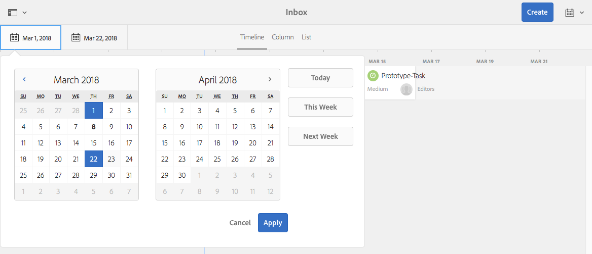

# Uw Postvak IN{#your-inbox}

U kunt meldingen ontvangen van verschillende delen van AEM, zoals workflows en projecten, bijvoorbeeld over:

* Taken:

   * deze kunnen ook op diverse punten binnen AEM UI, bijvoorbeeld, onder **Projecten** worden gecreeerd,
   * deze kunnen het product van een werkschema **zijn creeert Taak** of **creeer de 3&rbrace; stap van de Taak van het Project &lbrace;.**

* Workflows:

   * tijdelijke items die acties vertegenwoordigen die u op pagina-inhoud moet uitvoeren;

      * Dit is het product van werkschema **Deelnemer** stappen

   * items zijn mislukt, zodat beheerders de mislukte stap opnieuw kunnen proberen.

U ontvangt deze meldingen in uw eigen Postvak IN waar u ze kunt bekijken en actie kunt ondernemen.

>[!NOTE]
>
>AEM wordt vooraf geladen met beheertaken die zijn toegewezen aan de beheerdersgebruikersgroep. Zie [&#x200B; uit-van-de-doos Administratieve Taken &#x200B;](#out-of-the-box-administrative-tasks) voor details.

>[!NOTE]
>
>Zie ook voor meer informatie over de objecttypen:
>
>* [&#x200B; Projecten &#x200B;](/help/sites-authoring/touch-ui-managing-projects.md)
>* [&#x200B; Projecten - het werken met Taken &#x200B;](/help/sites-authoring/task-content.md)
>* [&#x200B; Werkstromen &#x200B;](/help/sites-authoring/workflows.md)
>* [&#x200B; Forms &#x200B;](/help/forms/using/introduction-aem-forms.md)
>

## Postvak IN van koptekst {#inbox-in-the-header}

Van om het even welke consoles wordt het huidige aantal punten in uw inbox getoond in de kopbal. De indicator kan ook worden geopend om of snelle toegang tot de pagina&#39;s te verlenen die acties of toegang tot inbox vereisen:

>[!NOTE]
>
>Bepaalde acties zullen ook in de [&#x200B; kaartmening van het aangewezen middel &#x200B;](/help/sites-authoring/basic-handling.md#card-view) worden getoond.

## Administratieve taken buiten de box  {#out-of-the-box-administrative-tasks}

De uit-van-de-doos AEM wordt voorgeladen met vier taken die aan de groep van de beheerdergebruiker worden toegewezen.

* [Analyse en doelgericht configureren](/help/sites-administering/opt-in.md)
* [De AEM-beveiligingscontrolelijst toepassen](/help/sites-administering/security-checklist.md)
* Verzamelde verzameling van verbruiksstatistieken inschakelen
* [HTTPS configureren](/help/sites-administering/ssl-by-default.md)

## De Postvak IN openen {#opening-the-inbox}

Het AEM-bericht openen in:

1. Klik op de indicator op de werkbalk.

1. Selecteer **Alles bekijken**. **AEM Inbox** opent. In de inbox ziet u items uit workflows, projecten en taken.
1. De standaardweergave is [Lijstweergave](#inbox-list-view), maar u kunt ook schakelen naar [Kalenderweergave](#inbox-calendar-view). Dit gebeurt met de weergavekiezer (werkbalk, rechtsboven).

   Voor beide meningen kunt u [&#x200B; Montages van de Mening &#x200B;](#inbox-view-settings) ook bepalen; de beschikbare opties zijn afhankelijk van de huidige mening.

   

>[!NOTE]
>
>De inbox werkt als console, gebruik dus [Globale navigatie](/help/sites-authoring/basic-handling.md#global-navigation) of [Zoeken](/help/sites-authoring/search.md) om naar een andere locatie te gaan wanneer u klaar bent.

### Postvak IN - Lijstweergave {#inbox-list-view}

In deze weergave worden alle items weergegeven, samen met belangrijke relevante informatie:

### Postvak IN - Kalenderweergave {#inbox-calendar-view}

In deze weergave worden de items weergegeven op basis van hun positie in de kalender en de exacte weergave die u hebt geselecteerd:

U kunt:

* selecteer een specifieke mening; **Chronologie**, **Kolom**, **Lijst**

* specificeer de taken om volgens **Programma** te tonen; **allen**, **Geplant**, **Bezig**, **Beëindigd Soon**, **Geëist**

* boor neer voor meer gedetailleerde informatie over een punt
* Selecteer een datumbereik waarop u de weergave wilt scherpstellen:

### Postvak IN - Instellingen {#inbox-view-settings}

Voor beide weergaven (Lijst en Kalender) kunt u instellingen definiëren:

* **Kalenderweergave**

  Voor **Mening van de Kalender** kunt u vormen:

   * **Groep door**
   * **Planning** of **Geen**
   * **Grootte van de Kaart**

  

* **de Mening van de Lijst**

  Voor **Mening van de Lijst** kunt u het soortmechanisme vormen:

   * **Gebied van de Sortering**
   * **de Orde van de Sortering**

  

### Inbox - Admin Control {#inbox-admin-control}

Met de optie Beheer beheren kunnen beheerders:

* De AEM Inbox-kolommen aanpassen

* Koptekst en logo aanpassen

* De weergave van navigatiekoppelingen in koptekst bepalen

De optie Beheer is alleen zichtbaar voor de leden van de groep `administrators` of `workflow-administrators` .

* **Aanpassing van de Kolom**: Pas een AEM Inbox aan om de standaardtitel van een kolom te veranderen, de positie van een kolom opnieuw in orde te brengen, en extra kolommen te tonen die op de gegevens van een werkschema worden gebaseerd.
   * **voeg Kolom** toe: Selecteer een kolom om in AEM Inbox toe te voegen.
   * **geef Kolom** uit: Beweeg de muis over de kolomtitel en selecteer  pictogram om een naam van de kolomvertoning in te gaan.
   * **Kolom van de Schrapping**: Selecteer  pictogram om de kolom van AEM Inbox te schrappen.
   * **Kolom van de Beweging**: Sleep het  pictogram om een kolom naar een nieuwe positie in AEM Inbox te bewegen.

  

* **het brandmerken Aanpassing**

   * **pas kopbaltekst aan:** specificeer de tekst aan vertoning in de kopbal om de standaard **Adobe Experience Manager** tekst te vervangen.

   * **pas Logo aan:** specificeer het beeld in de kopbal als embleem te tonen. Upload een afbeelding in Digital Asset Management (DAM) en verwijs naar die afbeelding in het veld.

* **Navigatie van de Gebruiker**
   * **de navigatieopties van de Huid:** selecteer deze optie om navigatieopties te verbergen beschikbaar in de kopbal. De navigatieopties omvatten verbindingen aan andere oplossingen, de verbinding van de Hulp, en de auteursopties beschikbaar op het Tikken van het embleem of de tekst van Adobe Experience Manager.
* **sparen:** klik deze optie om de montages te bewaren.

## Actie ondernemen op een item {#taking-action-on-an-item}

>[!NOTE]
>
>Hoewel het mogelijk is meerdere items te selecteren, kunnen acties slechts op één item tegelijk worden uitgevoerd.

1. Als u een actie wilt uitvoeren op een item, selecteert u de miniatuur voor het desbetreffende item. Pictogrammen voor de acties die op dat item van toepassing zijn, worden weergegeven op de werkbalk:

   

   De acties zijn geschikt voor het item en omvatten:

   * **Volledige** actie; bijvoorbeeld, een taak of werkschemapunt.
   * **wijs** opnieuw toe/**Afgevaardigde** een punt.
   * **Open** een punt; afhankelijk van het punttype kan deze actie:

      * itemeigenschappen weergeven
      * een geschikt dashboard of een geschikte wizard voor verdere actie openen
      * open gerelateerde documentatie

   * **Stap terug** aan een vorige stap.
   * Bekijk de lading voor een werkschema.
   * Maak een project van het item.

   >[!NOTE]
   >
   >Zie voor meer informatie:
   >
   >* De punten van het werkschema - [&#x200B; Deelnemend aan Werkschema&#39;s &#x200B;](/help/sites-authoring/workflows-participating.md)

1. Afhankelijk van het geselecteerde item wordt een handeling gestart, bijvoorbeeld:

   * er wordt een dialoog geopend die op de actie is toegesneden .
   * er wordt een wizard Handelingen gestart.
   * er wordt een documentatiepagina geopend .

   Bijvoorbeeld, **wijs** opnieuw toe opent een dialoog:

   

   Afhankelijk van of een dialoogvenster, wizard, documentatiepagina is geopend, kunt u:

   * Bevestig de juiste actie, bijvoorbeeld Opnieuw toewijzen.
   * Annuleer de handeling.
   * Pijl-terug; als bijvoorbeeld een wizard Handelingen of een documentatiepagina is geopend, kunt u terugkeren naar het Postvak IN.

## Een taak maken {#creating-a-task}

In het Postvak IN kunt u taken maken:

1. Selecteer **creeer**, toen **Taak**.
1. Voltooi de noodzakelijke gebieden in **Basis** en **Geavanceerde** lusjes; slechts is de **Titel** verplicht, zijn alle anderen facultatief:

   * **Basis**:

      * **Titel**
      * **Project**
      * **Geadresseerde**
      * **Inhoud**; gelijkend op Payload, is dit een verwijzing van de taak aan een plaats in de bewaarplaats
      * **Beschrijving**
      * **Prioriteit van de Taak**
      * **Datum van het Begin**
      * **Vervaldatum**

   

   * **Geavanceerd**

      * **Naam**: dit wordt gebruikt om URL te vormen; als het leeg zal zijn gebaseerd op de **Titel**.

   

1. Selecteer **voorleggen**.

## Een project maken {#creating-a-project}

Voor bepaalde taken kunt u a [&#x200B; Project &#x200B;](/help/sites-authoring/projects.md) creëren dat op die taak wordt gebaseerd:

1. Selecteer de gewenste taak door op de miniatuur te tikken of te klikken.

   >[!NOTE]
   >
   >Slechts kunnen de taken die gebruikend **worden gecreeerd** optie van **binnen** worden gecreeerd om een project tot stand te brengen.
   >
   >Workitems (van een workflow) kunnen niet worden gebruikt om een project te maken.

1. Selecteer **Project maken** op de werkbalk om de wizard te openen.
1. Selecteer het aangewezen malplaatje, toen **daarna**.
1. Geef de vereiste eigenschappen op:

   * **Basis**

      * **Titel**
      * **Beschrijving**
      * **Datum van het Begin**
      * **Vervaldatum**
      * **Gebruiker** en rol

   * **Geavanceerd**

      * **Naam**

   >[!NOTE]
   >
   >Zie [&#x200B; Creërend een Project &#x200B;](/help/sites-authoring/touch-ui-managing-projects.md#creating-a-project) voor volledige informatie.

1. Selecteer **creeer** om de actie te bevestigen.

## Items in de AEM Inbox filteren {#filtering-items-in-the-aem-inbox}

U kunt de vermelde items filteren:

1. Open **AEM Inbox**.

1. Open de filterkiezer:

   

1. U kunt de vermelde items filteren op basis van een reeks criteria, waarvan er vele kunnen worden verfijnd, bijvoorbeeld:

   

   >[!NOTE]
   >
   >Met [&#x200B; Montages van de Mening &#x200B;](#inbox-view-settings) kunt u de soortorde ook vormen wanneer het gebruiken van de [&#x200B; Mening van de Lijst &#x200B;](#inbox-list-view).
