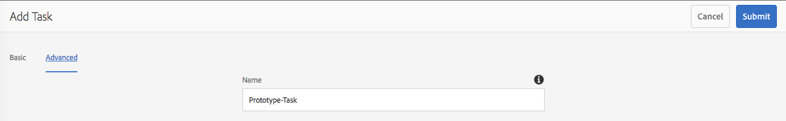

# Uw inbox{#your-inbox}

U kunt meldingen ontvangen van verschillende AEM, waaronder workflows en projecten. bijvoorbeeld over:

* Taken:

   * Deze kunnen ook op verschillende punten binnen AEM UI, bijvoorbeeld, onder **Projecten** worden gecreeerd,
   * Deze kunnen het product van een werkschema **Create Taak** of **Create Taak van het Project** stap zijn.

* Workflows:

   * tijdelijke items die acties vertegenwoordigen die u op pagina-inhoud moet uitvoeren;

      * Dit is het product van werkstroom **Deelnemer** stappen
   * items zijn mislukt, zodat beheerders de mislukte stap opnieuw kunnen proberen.

U ontvangt deze meldingen in uw eigen Postvak IN waar u ze kunt bekijken en actie kunt ondernemen.

>[!NOTE]
>
>Uit-van-de-doos AEM wordt voorgeladen met administratieve taken die aan de groep van de beheerdergebruiker worden toegewezen. Zie [Uit-de-doos Administratieve Taken](#out-of-the-box-administrative-tasks) voor details.

>[!NOTE]
>
>Zie ook voor meer informatie over de objecttypen:
>
>* [Projecten](/help/sites-authoring/touch-ui-managing-projects.md)
>* [Projecten - werken met taken](/help/sites-authoring/task-content.md)
>* [Workflows](/help/sites-authoring/workflows.md)
>* [Forms](/help/forms/home.md)

>

## Postvak In in koptekst {#inbox-in-the-header}

Van om het even welke consoles wordt het huidige aantal punten in uw inbox getoond in de kopbal. De indicator kan ook worden geopend om snel toegang te krijgen tot de pagina(&#39;s) waarvoor een actie(s) vereist is of om toegang te krijgen tot het Postvak IN:

>[!NOTE]
>
>Bepaalde acties worden ook weergegeven in de kaartweergave [van de juiste resource](/help/sites-authoring/basic-handling.md#card-view).

## Administratieve taken buiten de box {#out-of-the-box-administrative-tasks}

Uit-van-de-doos AEM wordt voorgeladen met vier taken die aan de groep van de beheerdergebruiker worden toegewezen.

* [Analyse en doelgericht configureren](/help/sites-administering/opt-in.md)
* [De lijst AEM beveiligingscontrole toepassen](/help/sites-administering/security-checklist.md)
* Verzamelde verzameling van verbruiksstatistieken inschakelen
* [HTTPS configureren](/help/sites-administering/ssl-by-default.md)

## De Postvak IN {#opening-the-inbox} openen

U opent als volgt het AEM-vak:

1. Klik/tik op de indicator in de werkbalk.

1. Selecteer **Alles bekijken**. De **AEM Inbox** wordt geopend. In de inbox ziet u items uit workflows, projecten en taken.
1. De standaardweergave is [Lijstweergave](#inbox-list-view), maar u kunt ook schakelen naar [Kalenderweergave](#inbox-calendar-view). Dit gebeurt met de weergavekiezer (werkbalk, rechtsboven).

   Voor beide meningen kunt u [montages van de Mening ook bepalen](#inbox-view-settings); de beschikbare opties zijn afhankelijk van de huidige weergave.

   

>[!NOTE]
>
>De inbox werkt als console, gebruik dus [Globale navigatie](/help/sites-authoring/basic-handling.md#global-navigation) of [Zoeken](/help/sites-authoring/search.md) om naar een andere locatie te gaan wanneer u klaar bent.

### Postvak IN - Lijstweergave {#inbox-list-view}

In deze weergave worden alle items weergegeven, samen met belangrijke relevante informatie:

### Postvak IN - Kalenderweergave {#inbox-calendar-view}

In deze weergave worden de items weergegeven op basis van hun positie in de kalender en de exacte weergave die u hebt geselecteerd:

U kunt:

* een specifieke weergave te selecteren; **Tijdlijn**, **Kolom**, **Lijst**

* de taken specificeren om volgens **Schema** te tonen; **Alle**, **Gepland**, **Bezig**, **Onmiddellijk**, **Achterstallig**

* boor neer voor meer gedetailleerde informatie over een punt
* Selecteer een datumbereik waarop u de weergave wilt scherpstellen:

### Inbox - Settings {#inbox-view-settings}

Voor beide weergaven (Lijst en Kalender) kunt u instellingen definiëren:

* **Kalenderweergave**

   Voor **Kalenderweergave** kunt u configureren:

   * **Groeperen op**
   * **Planning** of **Geen**
   * **Kaartgrootte**

   

* **Lijstweergave**

   Voor **Lijstweergave** kunt u het sorteermechanisme configureren:

   * **Veld sorteren**
   * **Sorteervolgorde**

   

### Inbox - Admin Control {#inbox-admin-control}

Met de optie Beheer beheren kunnen beheerders:

* De kolommen AEM Postvak IN aanpassen

* Koptekst en logo aanpassen

* De weergave van navigatiekoppelingen in koptekst bepalen

De optie Beheer is alleen zichtbaar voor de leden van de groep `administrators` of `workflow-administrators`.

* **Kolomaanpassing**: Pas een AEM Inbox aan om de standaardtitel van een kolom te wijzigen, de positie van een kolom opnieuw te ordenen en extra kolommen weer te geven op basis van de gegevens van een workflow.
   * **Kolom** toevoegen: Selecteer een kolom die u wilt toevoegen in AEM Postvak IN.
   * **Kolom** bewerken: Houd de muis boven de kolomtitel en tik op   editie om een kolomweergavenaam in te voeren.
   * **Kolom** verwijderen: Tik op het pictogram   Verwijderen om de kolom uit AEM Postvak IN te verwijderen.
   * **Kolom** verplaatsen: Sleep het   bewegingspictogram om een kolom naar een nieuwe positie in AEM Inbox te verplaatsen.

   

* **Aanpassing branding**

   * **Pas koptekst aan:** geef de tekst op die in de koptekst moet worden weergegeven ter vervanging van de standaard  **Adobe Experience** Manager-tekst.

   * **Logo aanpassen:de afbeelding** opgeven die in de koptekst moet worden weergegeven als logo. Upload een afbeelding in Digital Asset Management (DAM) en verwijs naar die afbeelding in het veld.

* **Gebruikersnavigatie**
   * **Navigatieopties verbergen:** selecteer deze optie om de beschikbare navigatieopties in de koptekst te verbergen. De navigatieopties omvatten verbindingen aan andere oplossingen, de verbinding van de Hulp, en de auteursopties beschikbaar op het Tikken van het embleem van Adobe Experience Manager of tekst.
* **Opslaan:** Tik/klik op deze optie om de instellingen op te slaan.

## Actie nemen op een item {#taking-action-on-an-item}

>[!NOTE]
>
>Hoewel het mogelijk is meerdere items te selecteren, kunnen acties slechts op één item tegelijk worden uitgevoerd.

1. Als u een actie wilt uitvoeren op een item, selecteert u de miniatuur voor het desbetreffende item. Pictogrammen voor de acties die op dat item van toepassing zijn, worden weergegeven op de werkbalk:

   

   De acties zijn geschikt voor het item en omvatten:

   * **** voltooiing; bijvoorbeeld een taak- of workflowitem.
   * **Wijs/** **** Delegatean-item opnieuw toe.
   * **** Open item; afhankelijk van het type item kan deze handeling:

      * itemeigenschappen weergeven
      * een geschikt dashboard of een geschikte wizard voor verdere actie openen
      * open gerelateerde documentatie
   * **Ga** terug naar een vorige stap.
   * Bekijk de lading voor een werkschema.
   * Maak een project van het item.

   >[!NOTE]
   >
   >Zie voor meer informatie:
   >
   >* Workflowitems - [Deelnemen aan workflows](/help/sites-authoring/workflows-participating.md)

1. Afhankelijk van het geselecteerde item wordt een actie gestart. bijvoorbeeld:

   * er wordt een dialoog geopend die op de actie is toegesneden .
   * er wordt een wizard Handelingen gestart.
   * er wordt een documentatiepagina geopend .

   Met **Opnieuw toewijzen** wordt bijvoorbeeld een dialoogvenster geopend:

   

   Afhankelijk van of een dialoogvenster, wizard, documentatiepagina is geopend, kunt u:

   * Bevestig de passende actie; bv. Opnieuw toewijzen.
   * Annuleer de handeling.
   * Pijl-achter; Als bijvoorbeeld een wizard Handelingen of een documentatiepagina is geopend, kunt u terugkeren naar het Postvak IN.

## Een taak maken {#creating-a-task}

In het Postvak IN kunt u taken maken:

1. Selecteer **Maken**, dan **Taak**.
1. Vul de vereiste velden in op de tabbladen **Basic** en **Advanced**; alleen de **Titel** is verplicht, alle andere zijn optioneel:

   * **Standaard**:

      * **Titel**
      * **Project**
      * **Geadresseerde**
      * **Inhoud**; Net als bij Payload is dit een verwijzing van de taak naar een locatie in de repository
      * **Beschrijving**
      * **Taakprioriteit**
      * **Begindatum**
      * **Vervaldatum**

   

   * **Geavanceerd**

      * **Naam**: dit wordt gebruikt om de URL te vormen; als het leeg is, wordt het gebaseerd op de  **titel**.

   

1. Selecteer **Verzenden**.

## Een project {#creating-a-project} maken

Voor bepaalde taken kunt u een [Project](/help/sites-authoring/projects.md) tot stand brengen die op die taak wordt gebaseerd:

1. Selecteer de gewenste taak door op de miniatuur te tikken of te klikken.

   >[!NOTE]
   >
   >Alleen taken die zijn gemaakt met de optie **Maken** van **Inbox** kunnen worden gebruikt om een project te maken.
   >
   >Workitems (van een workflow) kunnen niet worden gebruikt om een project te maken.

1. Selecteer **Project maken** op de werkbalk om de wizard te openen.
1. Selecteer het aangewezen malplaatje, dan **Next**.
1. Geef de vereiste eigenschappen op:

   * **Basis**

      * **Titel**
      * **Beschrijving**
      * **Begindatum**
      * **Vervaldatum**
      * **** Gebruikersrol
   * **Geavanceerd**

      * **Naam**
   >[!NOTE]
   >
   >Zie [Een project maken](/help/sites-authoring/touch-ui-managing-projects.md#creating-a-project) voor volledige informatie.

1. Selecteer **Maken** om de handeling te bevestigen.

## Items in AEM Postvak IN filteren {#filtering-items-in-the-aem-inbox}

U kunt de vermelde items filteren:

1. Open **AEM Inbox**.

1. Open de filterkiezer:

   

1. U kunt de vermelde items filteren op basis van een reeks criteria, waarvan er vele kunnen worden verfijnd; bijvoorbeeld:

   

   >[!NOTE]
   >
   >Met [De Montages van de Mening](#inbox-view-settings) kunt u de soortorde ook vormen wanneer het gebruiken van [de Mening van de Lijst](#inbox-list-view).

