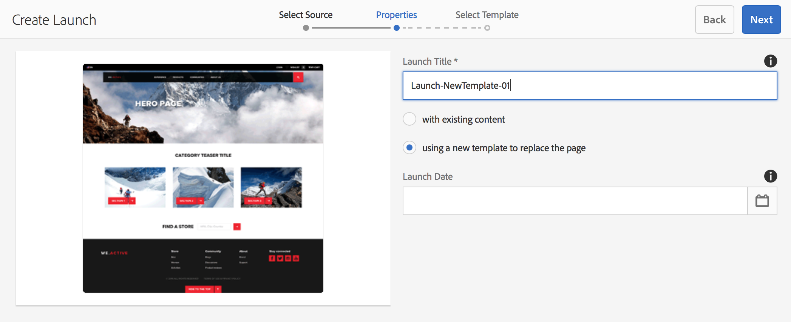

# Starten maken{#creating-launches}

Maak een lancering om het bijwerken van een nieuwe versie van bestaande Web-pagina&#39;s voor toekomstige activering toe te laten. Wanneer u een Starten creeert, specificeert u een titel en de bronpagina:

* De titel verschijnt in het [&#x200B; spoor van Verwijzingen &#x200B;](/help/sites-authoring/author-environment-tools.md#references), van waar de auteurs tot hen kunnen toegang hebben om aan hen te werken.
* De onderliggende pagina&#39;s van de bronpagina worden standaard in de opstart opgenomen. U kunt desgewenst alleen de bronpagina gebruiken.
* Door gebrek, [&#x200B; Levende Exemplaar &#x200B;](/help/sites-administering/msm.md) werkt automatisch de lanceringspagina&#39;s bij aangezien de bronpagina&#39;s veranderen. U kunt opgeven dat er een statische kopie wordt gemaakt om automatische wijzigingen te voorkomen.

U kunt desgewenst de **Startdatum** (en -tijd) opgeven om te bepalen wanneer de startpagina&#39;s moeten worden gepromoveerd en geactiveerd. De **startdatum** werkt echter alleen in combinatie met de markering **Geschikt voor productie** (zie [Een startconfiguratie bewerken](/help/sites-authoring/launches-editing.md#editing-a-launch-configuration)). Opdat de acties automatisch zouden optreden, moeten beide worden ingesteld.

## Starten maken {#creating-a-launch}

U kunt een lancering van of Sites of de console van Lanceringen tot stand brengen:

1. Open de **Sites** of **3&rbrace; console van Lanceringen &lbrace;.**

   >[!NOTE]
   >
   >Wanneer het gebruiken van de **console van Plaatsen** is het gebruikelijk om aan de plaats van de bronpagina te navigeren, maar dit is niet verplicht aangezien u kunt navigeren wanneer het selecteren van **Source** in de tovenaar.

1. Afhankelijk van de console die u gebruikt:

   * **Lanceringen**:

      1. Selecteer **creeer Lancering** van de toolbar om de tovenaar te openen.

   * **Plaatsen**:

      1. Selecteer **creëren** van de toolbar om de selectiedoos te openen.
      1. Van dit uitgezocht **creeer Lanceer** om de tovenaar te openen.

   >[!NOTE]
   >
   >In de **Sites**-console kunt u ook de [selectiemodus](/help/sites-authoring/basic-handling.md#viewing-and-selecting-resources) gebruiken om een pagina te selecteren voordat u **Maken** selecteert.
   >
   >Hiermee gebruikt u de geselecteerde pagina als de eerste bronpagina.

1. In **Uitgezochte Source** stap u **Pagina&#39;s** moet toevoegen. U kunt meerdere pagina&#39;s selecteren en het pad voor elke pagina opgeven:

   * Navigeer naar de gewenste locatie.
   * Selecteer de bronpagina(&#39;s) en bevestig (vinkje).

   Herhaal deze bewerking zo nodig.

    toe

   >[!NOTE]
   >
   >Als u pagina&#39;s en/of vertakkingen wilt toevoegen aan een introductie, moeten deze zich binnen een site bevinden, dus onder een gemeenschappelijke hoofdmap op hoofdniveau.
   >
   >Als een site taalwortels onder het bovenste niveau bevat, moeten de pagina&#39;s en vertakkingen voor een introductie zich onder een gemeenschappelijke taalbasis bevinden.
   >
   >Als u een opstart probeert te maken met een bovenliggende of onderliggende pagina in het bronpad, mislukt deze en wordt de fout &quot;Doel bestaat al op :path op de pagina&quot; geretourneerd.

1. Voor elk item kunt u opgeven of:

   * **omvat subpages**:

      * Geef op of u de opstart wilt maken met of zonder de onderliggende pagina&#39;s.  Deze subpagina&#39;s worden standaard opgenomen.

   Ga met **daarna** te werk.

    te omvatten

1. In de **stap van Eigenschappen** van de tovenaar kunt u specificeren:

   * **Titel van de Lancering**: De naam van de Lancering. De naam moet zinvol zijn voor auteurs.
   * **met bestaande inhoud**: de originele inhoud wordt gebruikt om de lancering tot stand te brengen.
   * **gebruik een nieuw malplaatje om de pagina** te vervangen: Zie [&#x200B; Lancering met Nieuw Malplaatje &#x200B;](#create-launch-with-new-template) voor meer details creëren.
   * **erven bronPagina levende gegevens**: Selecteer deze optie om de inhoud van lanceringspagina&#39;s automatisch bij te werken wanneer de bronpagina&#39;s veranderen. Deze optie bereikt dit door de lancering a [&#x200B; levend exemplaar &#x200B;](/help/sites-administering/msm.md) te maken.

     Deze optie is standaard geselecteerd.

   * **Datum van de Lancering**: De datum en de tijd wanneer het lanceringsexemplaar (afhankelijk van de **Klaar van de Productie** vlag moet worden geactiveerd; zie [&#x200B; Lanceringen - de Orde van Gebeurtenissen &#x200B;](/help/sites-authoring/launches.md#launches-the-order-of-events)).

   

1. Het gebruik **creeert** om het proces te voltooien en uw nieuwe lancering tot stand te brengen. In het bevestigingsvenster wordt u gevraagd of u het programma direct wilt starten.

   Als u de console terugkeert (met **Gedaan**) kunt u (en toegang) uw lancering van één van beiden zien:

   * [**Lanceert** console &#x200B;](/help/sites-authoring/launches.md#the-launches-console)
   * de [**Verwijzingen** in de **3&rbrace; console van Plaatsen**](/help/sites-authoring/launches.md#launches-in-references-sites-console)

### Starten met nieuwe sjabloon maken {#create-launch-with-new-template}

Wanneer [&#x200B; creërend een lancering &#x200B;](/help/sites-authoring/launches-creating.md#create-launch-with-new-template) u kunt selecteren of om een nieuw malplaatje met de optie te gebruiken: **gebruikend een nieuw malplaatje om de pagina** te vervangen

>[!CAUTION]
>
>Deze optie is slechts beschikbaar wanneer het creëren van een lancering van de **console van Plaatsen**. Het is niet beschikbaar wanneer het creëren van een lancering van de **console van Lanceringen**.

 te vervangen

Selecteer deze optie:

* de andere beschikbare opties bijwerken;
* Neem een nieuwe stap op waarin u de vereiste sjabloon kunt selecteren.

>[!CAUTION]
>
>Aangezien een andere sjabloon wordt gebruikt, is de nieuwe pagina leeg. Vanwege de verschillende paginastructuur wordt er geen inhoud over gekopieerd.
>
>Dit mechanisme kan worden gebruikt om het malplaatje van een [&#x200B; bestaande pagina &#x200B;](/help/sites-authoring/managing-pages.md#creating-a-new-page) te veranderen - hoewel het verlies van inhoud moet worden overwogen.

### Een geneste start maken {#creating-a-nested-launch}

Door een geneste opstart te maken (opstart binnen een opstart) kunt u een opstart maken op basis van een bestaande opstart, zodat ontwerpers kunnen profiteren van de wijzigingen die al zijn aangebracht, in plaats van meerdere keren dezelfde wijzigingen te moeten doorvoeren voor elke opstart.

>[!NOTE]
>
>Zie ook [&#x200B; Bevorderend een Genestelde Lancering &#x200B;](/help/sites-authoring/launches-promoting.md#promoting-a-nested-launch).

#### Een geneste start maken - Opstartconsole {#creating-a-nested-launch-launches-console}

Creërend een genestelde lancering van de **console van Lanceringen** is fundamenteel het zelfde als het creëren van een andere vorm van lancering, met de uitzondering die u aan de lanceringstak `/content/launches` moet navigeren:

1. In de **console van 1&rbrace; Lanceringen** selecteert creeer **.**
1. Selecteer **Pagina&#39;s toevoegen** en ga naar de startvertakking door `/content/launches` in het filter op te geven. Selecteer de vereiste start en bevestig dit met **Selecteren**:

   

1. Ga met **daarna** te werk en voltooi **Eigenschappen** zoals met een andere lancering.

   

#### Een geneste start maken - Sites-console {#creating-a-nested-launch-sites-console}

Om een genestelde lancering van de **console van Plaatsen** tot stand te brengen - die op een bestaande lancering wordt gebaseerd:

1. Heb toegang tot [&#x200B; Lancering van Verwijzingen (de console van Plaatsen) &#x200B;](/help/sites-authoring/launches.md#launches-in-references-sites-console) om de beschikbare acties te tonen.
1. Selecteer **Start maken** om de wizard te openen (aangezien de bron al is geselecteerd, wordt de stap **Bron selecteren** overgeslagen).

1. Ga de **Titel van de Lancering** en andere vereiste details (zoals met een normale lancering) in.

1. Het gebruik **creeert** om het proces te voltooien en uw nieuwe lancering tot stand te brengen. In het bevestigingsvenster wordt u gevraagd of u het programma direct wilt starten.

   Als u **Gereed** selecteert, keert u terug naar het spoor met **Referenties** van de **Sites**-console. Als u de juiste pagina selecteert, wordt de nieuwe startpagina weergegeven.

### Een Starten klonen {#cloning-a-launch}

U kunt een lancering van de [&#x200B; lanceert console &#x200B;](/help/sites-authoring/launches.md#the-launches-console) klonen:

* Selecteer de start door op de miniatuur te tikken of te klikken.
* De werkbalk wordt weergegeven. Selecteer Klonen.
   * De kloon zal in de console worden gecreeerd en worden getoond.
   * De **Titel van de Lancering** zal erop wijzen dat het een kloon is. U kunt de titel bijwerken door de [&#x200B; Configuratie van de Lancering &#x200B;](/help/sites-authoring/launches-editing.md#editing-a-launch-configuration) uit te geven (**Eigenschappen**).

## Een Starten verwijderen {#deleting-a-launch}

U kunt een lancering van de [&#x200B; lanceert console &#x200B;](/help/sites-authoring/launches.md#the-launches-console) schrappen:

* Selecteer de start door op de miniatuur te tikken of te klikken.
* De werkbalk wordt weergegeven. Selecteer Verwijderen.
* Bevestig de handeling.

>[!CAUTION]
>
>Als u een opstart verwijdert, wordt de opstart zelf en alle afstammende geneste opstarties verwijderd.
