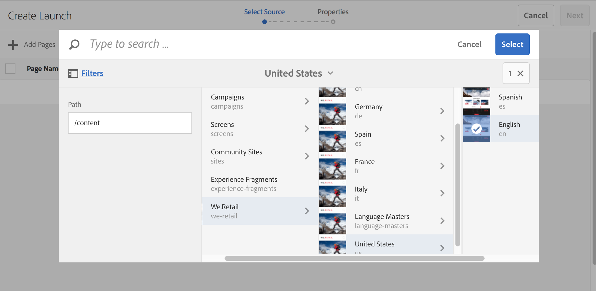

# Starten maken{#creating-launches}

Maak een lancering om het bijwerken van een nieuwe versie van bestaande Web-pagina&#39;s voor toekomstige activering toe te laten. Wanneer u een Starten creeert, specificeert u een titel en de bronpagina:

* De titel wordt weergegeven in het dialoogvenster [Verwijzingen](/help/sites-authoring/author-environment-tools.md#references) spoorwegen, vanwaar auteurs toegang hebben tot hen om er aan te werken.
* De onderliggende pagina&#39;s van de bronpagina worden standaard in de opstart opgenomen. U kunt desgewenst alleen de bronpagina gebruiken.
* Standaard, [Live kopie](/help/sites-administering/msm.md) werkt automatisch de startpagina&#39;s bij terwijl de bronpagina&#39;s veranderen. U kunt opgeven dat er een statische kopie wordt gemaakt om automatische wijzigingen te voorkomen.

U kunt desgewenst de **Startdatum** (en -tijd) opgeven om te bepalen wanneer de startpagina&#39;s moeten worden gepromoveerd en geactiveerd. De **startdatum** werkt echter alleen in combinatie met de markering **Geschikt voor productie** (zie [Een startconfiguratie bewerken](/help/sites-authoring/launches-editing.md#editing-a-launch-configuration)). Opdat de acties automatisch zouden optreden, moeten beide worden ingesteld.

## Starten maken {#creating-a-launch}

U kunt een lancering van of Sites of de console van Lanceringen tot stand brengen:

1. Open de **Sites** of **Starten** console.

   >[!NOTE]
   >
   >Wanneer u de opdracht **Sites** console is het gebruikelijk om naar de plaats van de bronpagina te navigeren, maar dit is niet verplicht aangezien u kunt navigeren wanneer het selecteren van **Bron starten** in de wizard.

1. Afhankelijk van de console die u gebruikt:

   * **Starten**:

      1. Selecteren **Starten maken** op de werkbalk om de wizard te openen.

   * **Sites**:

      1. Selecteren **Maken** van de werkbalk om het selectievak te openen.
      1. Van dit uitgezocht **Starten maken** om de wizard te openen.

   >[!NOTE]
   >
   >In de **Sites**-console kunt u ook de [selectiemodus](/help/sites-authoring/basic-handling.md#viewing-and-selecting-resources) gebruiken om een pagina te selecteren voordat u **Maken** selecteert.
   >
   >Hiermee gebruikt u de geselecteerde pagina als de eerste bronpagina.

1. In de **Bron selecteren** stap die u nodig hebt **Pagina&#39;s toevoegen**. U kunt meerdere pagina&#39;s selecteren en het pad voor elke pagina opgeven:

   * Navigeer naar de gewenste locatie.
   * Selecteer de bronpagina(&#39;s) en bevestig (vinkje).

   Herhaal deze bewerking zo nodig.

   

   >[!NOTE]
   >
   >Als u pagina&#39;s en/of vertakkingen wilt toevoegen aan een introductie, moeten deze zich binnen een site bevinden, dus onder een gemeenschappelijke hoofdmap op hoofdniveau.
   >
   >Als een site taalwortels onder het bovenste niveau bevat, moeten de pagina&#39;s en vertakkingen voor een introductie zich onder een gemeenschappelijke taalbasis bevinden.
   >
   >Als u een opstart probeert te maken met een bovenliggende of onderliggende pagina in het bronpad, mislukt deze en wordt de fout &#39;&#39;Doel bestaat al bij :path to the page&#39;&#39; geretourneerd.

1. Voor elk item kunt u opgeven of:

   * **Subpagina&#39;s opnemen**:

      * Geef op of u de opstart wilt maken met of zonder de onderliggende pagina&#39;s.  Deze subpagina&#39;s worden standaard opgenomen.

   Doorgaan met **Volgende**.

   

1. In de **Eigenschappen** stap van de wizard die u kunt opgeven:

   * **Titel starten**: De naam van de Launch. De naam moet zinvol zijn voor auteurs.
   * **met bestaande inhoud**: de oorspronkelijke inhoud wordt gebruikt om de opstart te maken.
   * **de pagina vervangen met een nieuwe sjabloon**: Zie [Starten met nieuwe sjabloon maken](#create-launch-with-new-template) voor meer informatie .
   * **Live-gegevens van bronpagina overnemen**: Selecteer deze optie als u de inhoud van startpagina&#39;s automatisch wilt bijwerken wanneer de bronpagina&#39;s veranderen. Met deze optie bereikt u dit door de introductie van een [live kopie](/help/sites-administering/msm.md).

     Deze optie is standaard geselecteerd.

   * **Opstartdatum**: De datum en tijd waarop de opstartafbeelding moet worden geactiveerd (afhankelijk van de **Gereed voor productie** markering; zie [Starten - de volgorde van gebeurtenissen](/help/sites-authoring/launches.md#launches-the-order-of-events)).

   

1. Gebruiken **Maken** om het proces te voltooien en uw nieuwe start te maken. In het bevestigingsvenster wordt u gevraagd of u het programma direct wilt starten.

   Als u de console terugkeert (met **Gereed**) kunt u uw lancering zien (en toegang hebben) van één van beiden:

   * de [**Starten** console](/help/sites-authoring/launches.md#the-launches-console)
   * de [**Verwijzingen** in de **Sites** console](/help/sites-authoring/launches.md#launches-in-references-sites-console)

### Starten met nieuwe sjabloon maken {#create-launch-with-new-template}

Wanneer [starten](/help/sites-authoring/launches-creating.md#create-launch-with-new-template) U kunt kiezen of u een nieuwe sjabloon wilt gebruiken met de optie: **een nieuwe sjabloon gebruiken om de pagina te vervangen**

>[!CAUTION]
>
>Deze optie is alleen beschikbaar wanneer u een opstart maakt via het dialoogvenster **Sites** console. Deze functie is niet beschikbaar wanneer u een opstart maakt via de **Starten** console.

Selecteer deze optie:

* de andere beschikbare opties bijwerken;
* Neem een nieuwe stap op waarin u de vereiste sjabloon kunt selecteren.

>[!CAUTION]
>
>Aangezien een andere sjabloon wordt gebruikt, is de nieuwe pagina leeg. Vanwege de verschillende paginastructuur wordt er geen inhoud over gekopieerd.
>
>Dit mechanisme kan worden gebruikt om de sjabloon van een [bestaande pagina](/help/sites-authoring/managing-pages.md#creating-a-new-page) - het verlies van inhoud moet echter in overweging worden genomen.

### Een geneste start maken {#creating-a-nested-launch}

Door een geneste opstart te maken (opstart binnen een opstart) kunt u een opstart maken op basis van een bestaande opstart, zodat ontwerpers kunnen profiteren van de wijzigingen die al zijn aangebracht, in plaats van meerdere keren dezelfde wijzigingen te moeten doorvoeren voor elke opstart.

>[!NOTE]
>
>Zie ook [Een geneste start bevorderen](/help/sites-authoring/launches-promoting.md#promoting-a-nested-launch).

#### Een geneste start maken - Opstartconsole {#creating-a-nested-launch-launches-console}

Een geneste opstart maken vanuit de **Starten** console is in wezen het zelfde als het creëren van een andere vorm van lancering, met uitzondering dat u aan de lanceringstak moet navigeren `/content/launches`:

1. In de **Starten** console selecteren **Maken**.
1. Selecteer **Pagina&#39;s toevoegen** en ga naar de startvertakking door `/content/launches` in het filter op te geven. Selecteer de vereiste start en bevestig dit met **Selecteren**:

   

1. Doorgaan met **Volgende** en de **Eigenschappen** zoals bij elke andere lancering.

   

#### Een geneste start maken - Sites-console {#creating-a-nested-launch-sites-console}

Als u een geneste opstart wilt maken vanuit de **Sites** console - gebaseerd op een bestaande lancering:

1. Toegang krijgen tot de [Starten vanuit verwijzingen (Sites-console)](/help/sites-authoring/launches.md#launches-in-references-sites-console) om de beschikbare acties weer te geven.
1. Selecteer **Start maken** om de wizard te openen (aangezien de bron al is geselecteerd, wordt de stap **Bron selecteren** overgeslagen).

1. Voer de **Titel starten** en alle andere vereiste gegevens (zoals bij een normale start).

1. Gebruiken **Maken** om het proces te voltooien en uw nieuwe start te maken. In het bevestigingsvenster wordt u gevraagd of u het programma direct wilt starten.

   Als u **Gereed** selecteert, keert u terug naar het spoor met **Referenties** van de **Sites**-console. Als u de juiste pagina selecteert, wordt de nieuwe startpagina weergegeven.

### Een Starten verwijderen {#deleting-a-launch}

U kunt een opstart verwijderen uit het dialoogvenster [opstartconsole](/help/sites-authoring/launches.md#the-launches-console):

* Selecteer de start door op de miniatuur te tikken of te klikken.
* De werkbalk wordt weergegeven. Selecteer Verwijderen.
* Bevestig de handeling.

>[!CAUTION]
>
>Als u een opstart verwijdert, wordt de opstart zelf en alle afstammende geneste opstarties verwijderd.
