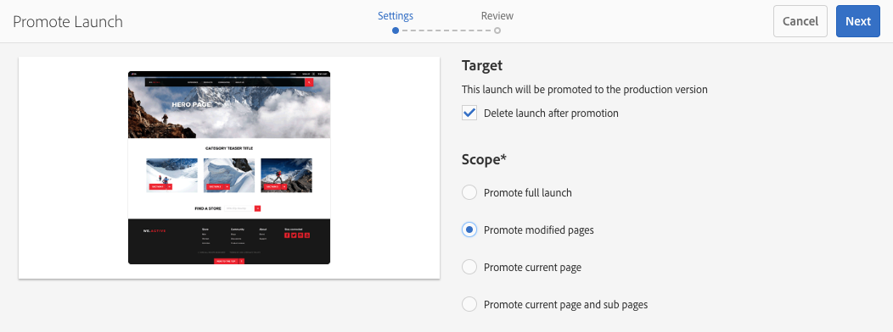

# Starten promoten{#promoting-launches}

U moet opstartiepagina&#39;s promoten om de inhoud vóór publicatie weer naar de bron (productie) te verplaatsen. Wanneer een startpagina wordt bevorderd, wordt de bijbehorende pagina van de bronpagina&#39;s vervangen door de inhoud van de gepromoveerde pagina. De volgende opties zijn beschikbaar bij het promoten van een startpagina:

* Of alleen de huidige pagina of de volledige lancering wordt bevorderd.
* Of de onderliggende pagina&#39;s van de huidige pagina worden bevorderd.
* Of de volledige lancering of slechts pagina&#39;s wordt bevorderd die zijn veranderd.
* Of de introductie moet worden verwijderd nadat deze is bevorderd.

>[!NOTE]
>
>Nadat u de startpagina&#39;s naar het doel hebt opgewaardeerd (**Productie**), kunt u de **Productie** pagina&#39;s als een entiteit (om het proces sneller te maken). Voeg de pagina&#39;s toe aan een workflowpakket en gebruik dit als de payload voor een workflow die een pakket met pagina&#39;s activeert. U moet het workflowpakket maken voordat u de introductie kunt promoten. Zie [Promotiepagina&#39;s verwerken met AEM workflow](#processing-promoted-pages-using-aem-workflow).

>[!CAUTION]
>
>Een enkele lancering kan niet tegelijkertijd worden bevorderd. Dit betekent dat twee promotieacties tegelijk op dezelfde start kunnen leiden tot een fout - `Launch could not be promoted` (samen met conflictfouten in het logbestand).

>[!CAUTION]
>
>Bij het promoten van introducties voor *gewijzigd* pagina&#39;s, wordt rekening gehouden met wijzigingen in zowel de bron- als startvertakkingen.

## Startpagina&#39;s promoten {#promoting-launch-pages}

>[!NOTE]
>
>Dit omvat de handmatige actie van het bevorderen van lanceringspagina&#39;s wanneer er slechts één lanceringsniveau is. Zie:
>
>* [Een geneste start bevorderen](#promoting-a-nested-launch) wanneer de structuur meer dan één keer wordt gestart.
>* [Starten - de volgorde van gebeurtenissen](/help/sites-authoring/launches.md#launches-the-order-of-events) voor meer informatie over automatische promotie en publicatie.
>

U kunt lanceringen van één van beide bevorderen **Sites** of de **Starten** console:

1. Openen:

   * de **Sites** console:

      1. Open de [referentie-rail](/help/sites-authoring/author-environment-tools.md#showingpagereferences) en selecteert u de gewenste bronpagina met [selectiemodus](/help/sites-authoring/basic-handling.md) (of selecteer en open de referentie-rail, de volgorde is niet belangrijk). Alle verwijzingen worden weergegeven.

      1. Selecteren **Starten** (bijvoorbeeld Launches (1)) om een lijst weer te geven met de specifieke startacties.
      1. Selecteer de specifieke lancering om de beschikbare acties te tonen.
      1. Selecteren **Starten bevorderen** om de wizard te openen.

   * de **Starten** console:

      1. Selecteer de start (klik op de miniatuur).
      1. Selecteren **Bevorderen**.

1. In de eerste stap kunt u het volgende opgeven:

   * **Doel**

      * **Starten na promotie verwijderen**

   * **Toepassingsgebied**

      * **Volledige introductie bevorderen**
      * **Gewijzigde pagina&#39;s promoten**
      * **Huidige pagina promoten**
      * **Huidige pagina en subpagina&#39;s promoten**

   Als u bijvoorbeeld alleen gewijzigde pagina&#39;s wilt promoten:

   

   >[!NOTE]
   >
   >Dit geldt voor één keer starten, als u geneste lanceringen hebt, zie [Een geneste start bevorderen](#promoting-a-nested-launch).

1. Selecteren **Volgende** om verder te gaan.
1. U kunt de pagina&#39;s bekijken die u wilt promoten. Deze zijn afhankelijk van het gekozen paginabereik:

   

1. Selecteren **Bevorderen**.

## Starten van pagina&#39;s tijdens bewerken bevorderen {#promoting-launch-pages-when-editing}

Wanneer u een startpagina bewerkt, wordt **Starten bevorderen** actie is ook beschikbaar via **Pagina-informatie**. Hierdoor wordt de wizard geopend die de benodigde informatie verzamelt.

>[!NOTE]
>
>Dit is beschikbaar voor enkelvoudig en [geneste lanceringen](#promoting-a-nested-launch).

## Een geneste start bevorderen {#promoting-a-nested-launch}

Nadat u een geneste start hebt gemaakt, kunt u deze herstellen naar een van de bronnen, inclusief de hoofdbron (productie).

1. Zoals met [Een geneste start maken](#creatinganestedlaunchlaunchwithinalaunch), navigeer naar en selecteer de vereiste start in een van de **Starten** of de **Verwijzingen** spoorwegen.
1. Selecteren **Starten bevorderen** om de wizard te openen.

1. Voer de vereiste gegevens in:

   * **Doel**

      * **Promotiedoel**
U kunt een van de bronnen promoten.

      * **Starten na promotie verwijderen**
Na de promotie worden de geselecteerde lancering, en om het even welke genestelde lanceringen binnen het, geschrapt.

   * **Toepassingsgebied**
Hier kunt u kiezen of u de volledige opstart wilt bevorderen of alleen pagina&#39;s die daadwerkelijk zijn bewerkt. In het laatste geval kunt u opgeven of u subpagina&#39;s wilt opnemen of uitsluiten. De standaardconfiguratie is dat alleen paginawijzigingen voor de huidige pagina worden bevorderd:

      * **Volledige introductie bevorderen**
      * **Gewijzigde pagina&#39;s promoten**
      * **Huidige pagina promoten**
      * **Huidige pagina en subpagina&#39;s promoten**

   

1. Selecteren **Volgende**.
1. De details van de aanbieding bekijken voordat je de selectie maakt **Bevorderen**:

   

   >[!NOTE]
   >
   >De weergegeven pagina&#39;s zijn afhankelijk van de **Toepassingsgebied** gedefinieerde en mogelijk de pagina&#39;s die daadwerkelijk zijn bewerkt.

1. Uw wijzigingen worden bevorderd en weerspiegeld in de **Starten** console:

   

## Promotiepagina&#39;s verwerken met AEM workflow {#processing-promoted-pages-using-aem-workflow}

Gebruik workflowmodellen voor bulkverwerking van geconverteerde startpagina&#39;s:

1. Maak een workflowpakket.
1. Wanneer auteurs startpagina&#39;s promoten, slaan ze deze op in het workflowpakket.
1. Start een workflowmodel met het pakket als de payload.

Als u automatisch een workflow wilt starten wanneer pagina&#39;s worden geconverteerd, [configureren van workflow-starter](/help/sites-administering/workflows-starting.md#workflows-launchers) voor het pakketknooppunt.

U kunt bijvoorbeeld automatisch aanvragen voor paginanactivering genereren wanneer auteurs pagina&#39;s voor Starten promoten. Configureer een werkstroomstartprogramma om de workflow voor activering van aanvragen te starten wanneer het pakketknooppunt wordt gewijzigd.

