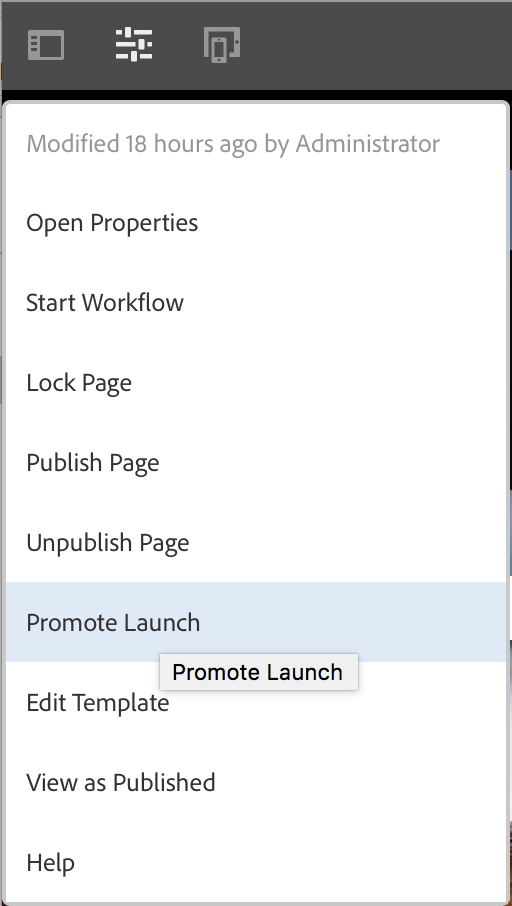

# Lanceringen promoten{#promoting-launches}

U moet opstartiepagina&#39;s promoten om de inhoud vóór publicatie weer naar de bron (productie) te verplaatsen. Wanneer een startpagina wordt bevorderd, wordt de bijbehorende pagina van de bronpagina&#39;s vervangen door de inhoud van de gepromoveerde pagina. De volgende opties zijn beschikbaar bij het promoten van een startpagina:

* Of alleen de huidige pagina of de volledige lancering wordt bevorderd.
* Of de onderliggende pagina&#39;s van de huidige pagina worden bevorderd.
* Of de volledige lancering of slechts pagina&#39;s wordt bevorderd die zijn veranderd.
* Of de introductie moet worden verwijderd nadat deze is bevorderd.

>[!NOTE]
>
>Nadat u de opstartiepagina&#39;s naar het doel (**Production**) bevordert, kunt u **Production** pagina&#39;s als een entiteit activeren (om het proces sneller te maken). Voeg de pagina&#39;s toe aan een workflowpakket en gebruik dit als de payload voor een workflow die een pakket met pagina&#39;s activeert. U moet het workflowpakket maken voordat u de introductie kunt promoten. Zie [Promoted Pages verwerken gebruikend AEM Workflow](#processing-promoted-pages-using-aem-workflow).

>[!CAUTION]
>
>Een enkele lancering kan niet tegelijkertijd worden bevorderd. Dit betekent dat twee promotieacties bij dezelfde introductie tegelijkertijd kunnen resulteren in een fout - `Launch could not be promoted` (samen met conflictfouten in het logbestand).

>[!CAUTION]
>
>Bij het bevorderen van lanceringen voor *modified* pagina&#39;s, worden de wijzigingen in zowel de bron als lanceringstakken overwogen.

## Starten van pagina&#39;s opwaarderen {#promoting-launch-pages}

>[!NOTE]
>
>Dit omvat de handmatige actie van het bevorderen van lanceringspagina&#39;s wanneer er slechts één lanceringsniveau is. Zie:
>
>* [Een geneste ](#promoting-a-nested-launch) introductie bevorderen wanneer de structuur meer dan één keer wordt gestart.
>* [Launches - De Orde van ](/help/sites-authoring/launches.md#launches-the-order-of-events) Gebeurtenissen voor meer informatie over automatische bevordering en publicatie.

>

U kunt lanceringen van of **Sites** console of **Launches** console bevorderen:

1. Open:

   * de **Sites**-console:

      1. Open [refereert spoorstaaf](/help/sites-authoring/author-environment-tools.md#showingpagereferences) en selecteer de vereiste bronpagina gebruikend [selectiemodus](/help/sites-authoring/basic-handling.md) (of selecteer en open de verwijzingsspoorstaaf, is de orde niet belangrijk). Alle verwijzingen worden weergegeven.

      1. Selecteer **Launches** (bijv. Launches (1)) om een lijst met de specifieke opstarters weer te geven.
      1. Selecteer de specifieke lancering om de beschikbare acties te tonen.
      1. Selecteer **Starten bevorderen** om de wizard te openen.
   * de **Launches**-console:

      1. Selecteer de start (tik op de miniatuur of klik erop).
      1. Selecteer **Promote**.

1. In de eerste stap kunt u het volgende opgeven:

   * **Doel**

      * **Starten na promotie verwijderen**
   * **Scope**

      * **Volledige introductie bevorderen**
      * **Gewijzigde pagina&#39;s promoten**
      * **Huidige pagina promoten**
      * **Huidige pagina en subpagina&#39;s promoten**

   Als u bijvoorbeeld alleen gewijzigde pagina&#39;s wilt promoten:

   

   >[!NOTE]
   >
   >Dit behandelt één enkele lancering, als u genestelde lanceringen hebt zie [Bevorderend een Genestelde Lancering](#promoting-a-nested-launch).

1. Selecteer **Volgende** om door te gaan.
1. U kunt de pagina&#39;s bekijken die u wilt promoten. Deze zijn afhankelijk van het gekozen paginabereik:

   

1. Selecteer **Promote**.

## Opwaarderen van startpagina&#39;s tijdens bewerken {#promoting-launch-pages-when-editing}

Wanneer u een startpagina bewerkt, is de handeling **Starten bevorderen** ook beschikbaar via **Paginagegevens**. Hierdoor wordt de wizard geopend die de benodigde informatie verzamelt.

>[!NOTE]
>
>Dit is beschikbaar voor enkele en [geneste lanceringen](#promoting-a-nested-launch).

## Een geneste start opwaarderen {#promoting-a-nested-launch}

Nadat u een geneste start hebt gemaakt, kunt u deze herstellen naar elk van de bronnen, inclusief de hoofdbron (productie).

1. Net als bij [Een geneste opstart maken](#creatinganestedlaunchlaunchwithinalaunch) navigeert u naar de vereiste opstart in de **Launches**-console of de **References**-rail.
1. Selecteer **Starten bevorderen** om de wizard te openen.

1. Voer de vereiste gegevens in:

   * **Doel**

      * **Promotion-**
doelU kunt promoten op een van de bronnen.

      * **Starten na**
promotie verwijderenNa promotie worden de geselecteerde lancering en alle daarin geneste lanceringen verwijderd.
   * ****
BereikHier kunt u selecteren of om de volledige lancering, of slechts pagina&#39;s te bevorderen die eigenlijk zijn uitgegeven. In het laatste geval kunt u opgeven of u subpagina&#39;s wilt opnemen of uitsluiten. De standaardconfiguratie is dat alleen paginawijzigingen voor de huidige pagina worden bevorderd:

      * **Volledige introductie bevorderen**
      * **Gewijzigde pagina&#39;s promoten**
      * **Huidige pagina promoten**
      * **Huidige pagina en subpagina&#39;s promoten**

   

1. Selecteer **Volgende**.
1. Bekijk de promotiegegevens voordat u **Promote** selecteert:

   

   >[!NOTE]
   >
   >De weergegeven pagina&#39;s zijn afhankelijk van de gedefinieerde **Scope** en mogelijk van de pagina&#39;s die daadwerkelijk zijn bewerkt.

1. Uw wijzigingen worden bevorderd en weerspiegeld in de **Launches**-console:

   

## Promotiepagina&#39;s verwerken met AEM-workflow {#processing-promoted-pages-using-aem-workflow}

Gebruik workflowmodellen voor bulkverwerking van geconverteerde startpagina&#39;s:

1. Maak een workflowpakket.
1. Wanneer auteurs startpagina&#39;s promoten, slaan ze deze op in het workflowpakket.
1. Start een workflowmodel met het pakket als de payload.

Als u een workflow automatisch wilt starten wanneer pagina&#39;s worden geconverteerd, [configureert u een werkstroomstartprogramma](/help/sites-administering/workflows-starting.md#workflows-launchers) voor het pakketknooppunt.

U kunt bijvoorbeeld automatisch aanvragen voor paginanactivering genereren wanneer auteurs pagina&#39;s starten promoten. Configureer een werkstroomstartprogramma om de workflow voor activering van aanvragen te starten wanneer het pakketknooppunt wordt gewijzigd.

