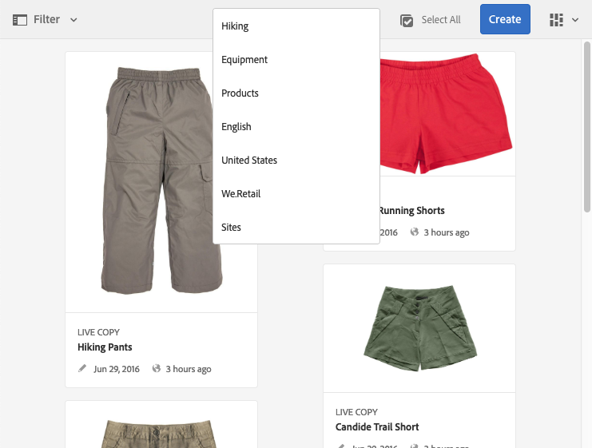

# Pagina&#39;s maken en indelen {#creating-and-organizing-pages}

In deze sectie wordt beschreven hoe u pagina&#39;s kunt maken en beheren met Adobe Experience Manager (AEM), zodat u vervolgens inhoud [op die pagina&#39;s kunt](/help/sites-authoring/editing-content.md) maken.

>[!NOTE]
>
>Uw account heeft de [juiste toegangsrechten](/help/sites-administering/security.md) en [machtigingen](/help/sites-administering/security.md#permissions) nodig om actie te ondernemen op pagina&#39;s zoals maken, kopiëren, verplaatsen, bewerken en verwijderen.
>
>Als u om het even welke problemen ontmoet wij adviseren u uw systeembeheerder contacteert.

>[!NOTE]
>
>Er zijn een aantal [sneltoetsen](/help/sites-authoring/keyboard-shortcuts.md) die u vanuit de websiteconsole kunt gebruiken om uw pagina&#39;s efficiënter te ordenen.

## Uw website ordenen {#organizing-your-website}

Als auteur moet u uw website organiseren binnen AEM. Dit betekent dat u inhoudspagina&#39;s maakt en een naam geeft, zodat:

* U kunt deze gemakkelijk vinden in de ontwerpomgeving
* Bezoekers naar uw site kunnen deze gemakkelijk in de publicatieomgeving bekijken

U kunt ook [mappen](#creating-a-new-folder) gebruiken om uw inhoud te ordenen.

De structuur van een website kan worden beschouwd als een boomstructuur die uw inhoudspagina&#39;s bevat. De namen van deze inhoudspagina&#39;s worden gebruikt om URLs te vormen, terwijl de titel wordt getoond wanneer de paginainhoud wordt bekeken.

In het volgende voorbeeld ziet u een voorbeeld van de website We.Retail, waar een pagina met een koppelingskorte site ( `desert-sky-shorts`) wordt geopend:

* Auteursomgeving
   `https://localhost:4502/editor.html/content/we-retail/us/en/products/equipment/hiking/desert-sky-shorts.html`

* Publicatie-omgeving
   `https://localhost:4503/content/we-retail/us/en/products/equipment/hiking/desert-sky-shorts.html`

Afhankelijk van de configuratie van uw instantie, `/content` zou het gebruik van facultatief op het publiceren milieu kunnen zijn.

```xml
 /content
 /we-retail
  /us
   /en
    /products
     /equipment
      /hiking
       /desert-sky-shorts
       /hiking-poles
       /...
      /running...
      /surfing...
      /...
     /seasonal...
     /...
    /about-us
    /experience
    /...
   /es...
  /de...
  /fr...
  /...
 /...
```

Deze structuur kan worden weergegeven vanuit de **Sites** -console, waar u door de pagina&#39;s van uw website [kunt](/help/sites-authoring/basic-handling.md#navigating) navigeren en acties op de pagina&#39;s kunt uitvoeren. U kunt ook nieuwe sites en [nieuwe pagina&#39;s](#creating-a-new-page)maken.

Vanuit elk punt kunt u de vertakking naar boven zien vanuit de broodkruimels in de kopbalk:



### Naamgevingsconventies voor pagina&#39;s {#page-naming-conventions}

Bij het maken van een nieuwe pagina zijn er twee sleutelvelden:

* **[Titel](#title)**:

   * Dit wordt aan de gebruiker getoond in de console en bij het uitgeven bij de bovenkant van de paginainhoud getoond.
   * Dit veld is verplicht.

* **[Naam](#name)**:

   * Hiermee wordt de URI gegenereerd.
   * Gebruikersinvoer voor dit veld is optioneel. Indien niet opgegeven, wordt de naam afgeleid van de titel. Zie de volgende sectie Beperkingen van de Naam van de [Pagina en Beste praktijken](/help/sites-authoring/managing-pages.md#page-name-restrictions-and-best-practices) voor details.

#### Beperkingen en aanbevolen procedures voor paginanamen {#page-name-restrictions-and-best-practices}

De **titel** en **naam** van de pagina kunnen afzonderlijk worden gemaakt, maar zijn aan elkaar gerelateerd:

* Wanneer u een pagina maakt, is alleen het veld **Titel** vereist. Als er bij het maken van de pagina geen **naam** is opgegeven, genereert AEM een naam uit de eerste 64 tekens van de titel (met inachtneming van de onderstaande validatie). Alleen de eerste 64 tekens worden gebruikt ter ondersteuning van de beste praktijken voor namen van korte pagina&#39;s.

* Als een paginanaam handmatig door de auteur wordt opgegeven, geldt de limiet van 64 tekens niet, maar kunnen andere technische beperkingen op de lengte van de paginanaam wel van toepassing zijn.

>[!NOTE]
>
>Wanneer u een paginanaam definieert, is het verstandig de paginanaam zo kort maar expressief en zo gedenkwaardig mogelijk te houden, zodat de lezer deze goed begrijpt. Zie de [W3C-stijlhandleiding](https://www.w3.org/Provider/Style/TITLE.html) voor het `title` element voor meer informatie.
>
>Houd er ook rekening mee dat sommige browsers (bijvoorbeeld oudere versies van IE) URL&#39;s tot een bepaalde lengte alleen kunnen accepteren, dus er is ook een technische reden om paginanamen kort te houden.

Bij het maken van een nieuwe pagina [valideert AEM de paginanaam volgens de conventies](/help/sites-developing/naming-conventions.md) die door AEM en de JCR worden opgelegd.

De minimaal toegestane tekens zijn:

* &#39;a&#39; tot en met &#39;z&#39;
* &#39;A&#39; tot en met &#39;Z&#39;
* 0 tot en met 9
* `_` (onderstrepingsteken)
* `-` (afbreekstreepje/minteken)

Alle tekens die zijn toegestaan, staan in [de naamgevingsconventies](/help/sites-developing/naming-conventions.md).

>[!NOTE]
>
>Als AEM wordt uitgevoerd op een implementatie [van](/help/sites-deploying/recommended-deploys.md)MongoMK persistence Manager, zijn de paginanamen beperkt tot 150 tekens.

#### Titel {#title}

Als u bij het maken van een nieuwe pagina alleen een **paginatitel** opgeeft, leidt AEM de **naam**[ van de pagina af van deze tekenreeks en valideert het de naam volgens de conventies die door AEM en JCR worden opgelegd. ](/help/sites-developing/naming-conventions.md) Een veld **Titel** met ongeldige tekens wordt geaccepteerd, maar de ongeldige tekens worden vervangen door de afgeleide naam. Bijvoorbeeld:

| Titel | Afgeleide naam |
|---|---|
| Schön | schoen.html |
| SC%&amp;*ç+ | sc---c-.html |

#### Naam {#name}

Wanneer u een **paginanaam** opgeeft bij het maken van een nieuwe pagina, zal AEM de naam [valideren volgens de conventies](/help/sites-developing/naming-conventions.md) die door AEM en JCR worden opgelegd. U kunt geen ongeldige tekens verzenden in het veld **Naam** . Wanneer AEM ongeldige tekens detecteert, wordt het veld gemarkeerd met een verklarende melding.


>[!NOTE]
>
>Gebruik geen code van twee letters, zoals gedefinieerd door ISO-639-1, als paginanaam, tenzij dit een hoofdtaalcode is.
>
>See [Preparing Content for Translation](/help/sites-administering/tc-prep.md) for more information.

### Sjablonen {#templates}

In AEM, specificeert een malplaatje een gespecialiseerd type van pagina. Een sjabloon wordt gebruikt als basis voor elke nieuwe pagina die wordt gemaakt.

De sjabloon definieert de structuur van een pagina, inclusief een miniatuurafbeelding en andere eigenschappen. U hebt bijvoorbeeld aparte sjablonen voor productpagina&#39;s, sitemaps en contactgegevens. Sjablonen bestaan uit [componenten](#components).

AEM wordt geleverd met verschillende sjablonen die u kunt vinden. Welke sjablonen beschikbaar zijn, is afhankelijk van de afzonderlijke website. De belangrijkste velden zijn:

* **Titel** De titel die op de resulterende webpagina wordt weergegeven.

* **Naam** die wordt gebruikt bij de naamgeving van de pagina.

* **Template** A lijst van malplaatjes beschikbaar voor gebruik wanneer het produceren van de nieuwe pagina.

>[!NOTE]
>
>Als dit op uw exemplaar is geconfigureerd, kunnen [sjabloonauteurs sjablonen maken met de Sjablooneditor](/help/sites-authoring/templates.md).

### Onderdelen {#components}

Componenten zijn de elementen die door AEM worden geleverd, zodat u specifieke typen inhoud kunt toevoegen. AEM wordt geleverd met een reeks [kant-en-klare componenten](/help/sites-authoring/default-components-console.md) die uitgebreide functionaliteit bieden. Deze omvatten:

* Tekst
* Afbeelding
* Presentatie
* Video
* En nog veel meer

Nadat u een pagina hebt gemaakt en geopend, kunt u inhoud [toevoegen met de componenten](/help/sites-authoring/editing-content.md#insertinganewparagraph)die beschikbaar zijn in de [deelbrowser](/help/sites-authoring/author-environment-tools.md#componentbrowser).

>[!NOTE]
>
>De [componentenconsole](/help/sites-authoring/default-components-console.md) geeft een overzicht van de componenten op uw instantie.

## Pagina&#39;s beheren {#managing-pages}

### Een nieuwe pagina maken {#creating-a-new-page}

Tenzij alle pagina&#39;s vooraf voor u zijn gemaakt, moet u een pagina maken voordat u inhoud kunt gaan maken:

1. Open de Sites-console (bijvoorbeeld [https://localhost:4502/sites.html/content](https://localhost:4502/sites.html/content)).
1. Navigeer naar de locatie waar u de nieuwe pagina wilt maken.
1. Open de vervolgkeuzelijst met **Maken** op de werkbalk en selecteer vervolgens **Pagina** in de lijst:

   

1. Vanaf de eerste fase van de wizard kunt u:

   * Selecteer de sjabloon die u wilt gebruiken om de nieuwe pagina te maken en klik op **Volgende** of tik op Volgende om door te gaan.

   * **Annuleer** om het proces af te breken.

   

1. Vanaf het laatste werkgebied van de wizard kunt u:

   * Gebruik de drie tabbladen om de [pagina-eigenschappen](/help/sites-authoring/editing-page-properties.md) in te voeren die u aan de nieuwe pagina wilt toewijzen. Klik vervolgens op **Maken** of tik op Maken om de pagina daadwerkelijk te maken.

   * Gebruik **Vorige** om terug te keren naar de sjabloonselectie.

   Hoofdvelden zijn:

   * **Titel**:

      * Dit wordt aan de gebruiker getoond en is verplicht.
   * **Naam**:

      * Hiermee wordt de URI gegenereerd. Indien niet opgegeven, wordt de naam afgeleid van de titel.
      * Als u bij het maken van een nieuwe pagina een **paginanaam** opgeeft, zal AEM de naam [valideren volgens de conventies](/help/sites-developing/naming-conventions.md) die door AEM en JCR zijn opgelegd.

      * U **kunt geen ongeldige tekens** verzenden in het veld **Naam** . Wanneer AEM ongeldige tekens detecteert, wordt het veld gemarkeerd en wordt een verklarende melding weergegeven om aan te geven welke tekens moeten worden verwijderd/vervangen.
   >[!NOTE]
   >
   >Zie conventies voor [paginanamen](#page-naming-conventions).

   De minimale informatie die nodig is om een nieuwe pagina te maken, is de **titel**.

   

1. Gebruik **Maken** om het proces te voltooien en uw nieuwe pagina te maken. In het bevestigingsvenster wordt gevraagd of u de pagina direct wilt **openen** of wilt terugkeren naar de console (**Gereed**):

   

   >[!NOTE]
   >
   >Als u een pagina maakt met een naam die al op die locatie bestaat, genereert het systeem automatisch een variatie in de naam door een getal toe te voegen. Als er bijvoorbeeld `winter` al een nieuwe pagina bestaat, wordt deze `winter0`.

1. Als u terugkeert naar de console, zult u uw nieuwe pagina zien:

   

>[!CAUTION]
>
>Als een pagina eenmaal is gemaakt, kan de sjabloon ervan niet worden gewijzigd, tenzij u een [startpagina met een nieuwe sjabloon](/help/sites-authoring/launches-creating.md#create-launch-with-new-template)maakt, maar de inhoud die al bestaat, gaat dan verloren.

### Een pagina openen voor bewerken {#opening-a-page-for-editing}

Nadat u een pagina hebt gemaakt of naar een bestaande pagina (in de console) hebt genavigeerd, kunt u deze openen voor bewerking:

1. Open de **Sites** -console.
1. Navigeer totdat u de pagina vindt die u wilt bewerken.
1. Selecteer de pagina door een van de volgende twee handelingen uit te voeren:

   * [Snelle acties](/help/sites-authoring/basic-handling.md#quick-actions)
   * [Selectiemodus](/help/sites-authoring/basic-handling.md#navigatingandselectionmode) en de werkbalk

   Selecteer vervolgens het pictogram **Bewerken** :

   

1. De pagina wordt geopend en u kunt de pagina [naar wens](/help/sites-authoring/editing-content.md#touchoptimizedui) bewerken.

>[!NOTE]
>
>U kunt vanuit de pagina-editor alleen naar andere pagina&#39;s navigeren in de modus Voorbeeld, omdat koppelingen niet actief zijn in de modus Bewerken.

### Pagina&#39;s kopiëren en plakken {#copying-and-pasting-a-page}

U kunt een pagina en alle bijbehorende subpagina&#39;s naar een nieuwe locatie kopiëren:

1. Navigeer in de **Sites** -console naar de pagina die u wilt kopiëren.
1. Selecteer de pagina met behulp van:

   * [Snelle acties](/help/sites-authoring/basic-handling.md#quick-actions)
   * [Selectiemodus](/help/sites-authoring/basic-handling.md#navigatingandselectionmode) en de werkbalk

   En dan het paginapictogram **Kopiëren** :

   

   >[!NOTE]
   >
   >Als u in de selectiemodus werkt, wordt dit automatisch verlaten zodra de pagina wordt gekopieerd.

1. Navigeer naar de locatie voor de nieuwe kopie van de pagina.
1. Het pictogram **Plakken** is rechtstreeks naar rechts beschikbaar met een vervolgkeuzepijl:

   

   U kunt:
   * Selecteer het paginapictogram **Plakken** zelf: Op deze locatie worden een kopie van de originele pagina en eventuele onderliggende pagina&#39;s gemaakt.
   * Selecteer de vervolgkeuzepijl om de optie **Plakken zonder onderliggende items** weer te geven. Op deze locatie wordt een kopie van de originele pagina gemaakt. onderliggende pagina&#39;s worden niet gekopieerd.

   >[!NOTE]
   >
   >Als u de pagina kopieert naar een locatie waar al een pagina met dezelfde naam als het origineel bestaat, genereert het systeem automatisch een variatie in de naam door een nummer toe te voegen. Bijvoorbeeld als `winter` reeds bestaat `winter` zal worden `winter1`.

### Een pagina verplaatsen of de naam ervan wijzigen {#moving-or-renaming-a-page}

>[!NOTE]
>
>Als u de naam van een pagina wijzigt, gelden de naamgevingsconventies [voor de](#page-naming-conventions) pagina ook voor het opgeven van de nieuwe paginanaam.

>[!NOTE]
>
>Een pagina kan alleen worden verplaatst naar een locatie waar de sjabloon waarop de pagina is gebaseerd, is toegestaan. Zie [Sjabloonbeschikbaarheid](/help/sites-developing/templates.md#template-availability) voor meer informatie.

De procedure om een pagina te verplaatsen of anders te noemen is in wezen het zelfde en door de zelfde tovenaar behandeld. Met deze wizard kunt u:

* Wijzig de naam van een pagina zonder deze te verplaatsen.
* Verplaats de pagina zonder de naam ervan te wijzigen.
* Tegelijkertijd verplaatsen en hernoemen.

AEM biedt u de functionaliteit om interne koppelingen bij te werken die verwijzen naar de pagina waarvan de naam wordt gewijzigd of die wordt verplaatst. Dit kan per pagina worden gedaan om volledige flexibiliteit te bieden.

1. Navigeer totdat u de pagina vindt die u wilt verplaatsen.
1. Selecteer de pagina met behulp van:

   * [Snelle acties](/help/sites-authoring/basic-handling.md#quick-actions)
   * [Selectiemodus](/help/sites-authoring/basic-handling.md#navigatingandselectionmode) en de werkbalk

   Selecteer vervolgens het paginapictogram **Verplaatsen** :

   

   Hiermee wordt de wizard Verplaatsen van de pagina geopend.

1. In het werkgebied **Naam wijzigen** van de wizard kunt u:

   * Geef de naam op die de pagina moet hebben nadat deze is verplaatst en klik op **Volgende** of tik op Volgende om door te gaan.

   * **Annuleer** om het proces af te breken.

   

   De paginanaam kan hetzelfde blijven als u alleen de pagina verplaatst.

   >[!NOTE]
   >
   >Als u een pagina verplaatst naar een locatie waar al een pagina met dezelfde naam bestaat, genereert het systeem automatisch een variatie in de naam door een getal toe te voegen. Bijvoorbeeld als `winter` reeds bestaat `winter` zal worden `winter1`.

1. Van het **Uitgezochte stadium van de Bestemming** van de tovenaar kunt u of:

   * Met de [kolomweergave](/help/sites-authoring/basic-handling.md#column-view) navigeert u naar de nieuwe locatie voor de pagina:

      * Selecteer de bestemming door de duimnagel van de bestemming te klikken.
      * Klik op **Volgende** om door te gaan.
   * Gebruik **Vorige** om terug te keren naar de specificatie van de paginanaam.

   >[!NOTE]
   >
   >Standaard wordt het bovenliggende element van de pagina waarvan u de naam verplaatst of wijzigt, geselecteerd als het doel.

   

   >[!NOTE]
   >
   >Als u een pagina verplaatst naar een locatie waar al een pagina met dezelfde naam bestaat, genereert het systeem automatisch een variatie in de naam door een getal toe te voegen. Bijvoorbeeld als `winter` reeds bestaat `winter` zal worden `winter1`.

1. Als de pagina is gekoppeld aan of waarnaar wordt verwezen, of is gepubliceerd, worden de details weergegeven in de stap **Aanpassen/Opnieuw** publiceren.

   U kunt aangeven welke aanpassingen moeten worden aangebracht en/of opnieuw moeten worden gepubliceerd.

   >[!NOTE]
   >
   >Als er geen koppeling is naar de pagina en er niet naar wordt verwezen, is deze stap niet beschikbaar.

   

1. Als u **Verplaatsen** selecteert, wordt het proces voltooid en wordt de pagina waar nodig verplaatst of hernoemd.

>[!NOTE]
>
>Als de pagina al is gepubliceerd, wordt de publicatie ervan automatisch ongedaan gemaakt wanneer u de pagina verplaatst. By default, it will be republished when the move is complete, but this can changed by unchecking the **Republish** field in the **Adjust/Republish** step.

>[!NOTE]
>
>Als er op geen enkele manier naar de pagina wordt verwezen, wordt de stap **Aanpassen/Opnieuw** publiceren overgeslagen.

#### Asynchrone handelingen {#asynchronous-actions}

Normaal gesproken wordt de handeling Pagina verplaatsen of Naam wijzigen onmiddellijk uitgevoerd. Dit wordt beschouwd als synchrone verwerking en verdere actie in UI wordt geblokkeerd tot de actie volledig is.

Als het aantal pagina&#39;s waarop de actie betrekking heeft echter boven een gedefinieerde limiet ligt, wordt de actie asynchroon verwerkt, zodat de gebruiker in de gebruikersinterface kan blijven ontwerpen zonder dat dit wordt belemmerd door de actie Pagina verplaatsen of hernoemen.

* Wanneer het klikken van **Beweging** in de laatste stap hierboven, controleert AEM de gevormde grens.
* Als het aantal pagina&#39;s waarop de actie betrekking heeft, onder de limiet ligt, wordt een synchrone bewerking uitgevoerd.
* Als het aantal pagina&#39;s waarop de actie betrekking heeft, boven de limiet ligt, wordt een asynchrone bewerking uitgevoerd.
   * De gebruiker moet definiëren wanneer de asynchrone bewerking moet worden uitgevoerd
      * **De uitvoering van de asynchrone taak wordt nu** direct gestart.
      * **Later** kan de gebruiker bepalen wanneer de asynchrone taak wordt gestart.

         

De status van asynchrone taken kan worden gecontroleerd in het [**Async Job Status **dashboard](/help/sites-administering/asynchronous-jobs.md#monitor-the-status-of-asynchronous-operations)bij** Globale Navigatie **->** Hulpmiddelen **->** Verrichtingen **->** Banen **

>[!NOTE]
>
>Voor meer informatie over asynchrone baanverwerking en hoe te om de grens voor paginamousie te vormen beweeg/noem acties anders, gelieve het [Asynchrone document van Banen](/help/sites-administering/asynchronous-jobs.md) in de de gebruikersgids van het Beleid te zien.

>[!NOTE]
>
>Voor asynchrone verwerking van paginaverplaatsingen is AEM 6.5.3.0 of hoger vereist.

### Een pagina verwijderen {#deleting-a-page}

1. Navigeer totdat u de pagina ziet die u wilt verwijderen.
1. Selecteer de gewenste pagina in de [selectiemodus](/help/sites-authoring/basic-handling.md#viewing-and-selecting-resources) en gebruik vervolgens **Verwijderen** op de werkbalk:

   

   >[!NOTE]
   >
   >Uit veiligheidsoverwegingen is het pictogram op de pagina **Verwijderen** niet beschikbaar als een snelle actie.

1. In een dialoogvenster wordt om bevestiging gevraagd, gebruik:

   * **Annuleren** om de handeling af te breken
   * **Verwijder** om de handeling te bevestigen:

      * Als de pagina geen verwijzingen bevat, wordt de pagina verwijderd.
      * Als de pagina verwijzingen heeft, zal een berichtvakje u meedelen dat **Één of meerdere pagina&#39;s van verwijzingen worden voorzien.** U kunt Verwijderen **forceren** of **Annuleren** selecteren.

>[!NOTE]
>
>Als een pagina al is gepubliceerd, wordt deze automatisch gepubliceerd voordat deze wordt verwijderd.

### Een pagina vergrendelen {#locking-a-page}

U kunt een pagina [](/help/sites-authoring/editing-content.md#locking-a-page) vergrendelen/ontgrendelen vanuit een console of wanneer u een afzonderlijke pagina bewerkt. Informatie over het feit of een pagina is vergrendeld, wordt ook op beide locaties weergegeven.

 

### Nieuwe map maken {#creating-a-new-folder}

U kunt mappen maken waarmee u uw bestanden en pagina&#39;s kunt ordenen.

>[!NOTE]
>
>Mappen zijn ook onderworpen aan de conventies voor [paginanamen](#page-naming-conventions) wanneer u de nieuwe mapnaam opgeeft.

>[!CAUTION]
>
>* Mappen kunnen alleen rechtstreeks onder **Sites** of onder andere mappen worden gemaakt. Ze kunnen niet onder een pagina worden gemaakt.
>* Met de standaardhandelingen kunt u eigenschappen verplaatsen, kopiëren, plakken, verwijderen, publiceren, verwijderen en weergeven/bewerken uitvoeren op een map.
>* Mappen zijn niet beschikbaar voor selectie in een live kopie.

>


1. Open the **Sites** console and navigate to the required location.
1. Selecteer **Maken** in de werkbalk om de lijst met opties te openen
1. Selecteer **Map** om het dialoogvenster te openen. Hier kunt u de **naam** en de **titel** invoeren:

   

1. Selecteer **Maken** om de map te maken.
