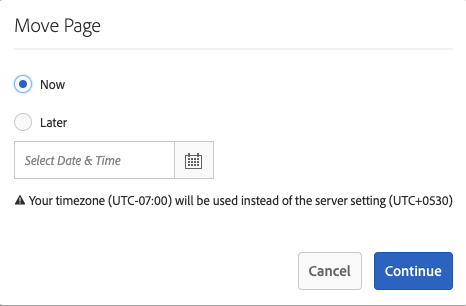
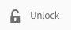

# Pagina&#39;s maken en ordenen {#creating-and-organizing-pages}

Deze sectie beschrijft om pagina&#39;s met Adobe Experience Manager (AEM) tot stand te brengen en te beheren zodat u inhoud [&#x200B; op die pagina&#39;s kunt dan &#x200B;](/help/sites-authoring/editing-content.md) tot stand brengen.

>[!NOTE]
>
>Uw rekening heeft de [&#x200B; aangewezen toegangsrechten &#x200B;](/help/sites-administering/security.md) en [&#x200B; toestemmingen &#x200B;](/help/sites-administering/security.md#permissions) nodig om actie op pagina&#39;s zoals tot stand te brengen, te kopiëren, te bewegen, uit te geven en te schrappen.
>
>Als u om het even welke problemen ontmoet wij adviseren u uw systeembeheerder contacteert.

>[!NOTE]
>
>Er zijn verscheidene [&#x200B; toetsenbordkortere weg &#x200B;](/help/sites-authoring/keyboard-shortcuts.md) die u van de Websiteconsole kunt gebruiken die het organiseren van uw pagina&#39;s efficiënter maken.

## Uw website ordenen {#organizing-your-website}

Organiseer uw website als auteur in AEM. Dit betekent dat u inhoudspagina&#39;s maakt en een naam geeft, zodat:

* U kunt deze gemakkelijk vinden in de ontwerpomgeving
* Bezoekers naar uw site kunnen deze gemakkelijk in de publicatieomgeving bekijken

U kunt [&#x200B; omslagen &#x200B;](#creating-a-new-folder) ook gebruiken helpen uw inhoud organiseren.

De structuur van een website kan worden beschouwd als een boomstructuur die uw inhoudspagina&#39;s bevat. De namen van deze inhoudspagina&#39;s worden gebruikt om URLs te vormen, terwijl de titel wordt getoond wanneer de paginainhoud wordt bekeken.

In het volgende voorbeeld ziet u een voorbeeld van de website Web.Retail, waar een pagina met een hyperlink ( `desert-sky-shorts` ) wordt geopend:

* Auteursomgeving
  `https://localhost:4502/editor.html/content/we-retail/us/en/products/equipment/hiking/desert-sky-shorts.html`

* Publicatie-omgeving
  `https://localhost:4503/content/we-retail/us/en/products/equipment/hiking/desert-sky-shorts.html`

Afhankelijk van de configuratie van uw instantie kan het gebruik van `/content` optioneel zijn in de publicatieomgeving.

```xml
 /content
 /we-retail
  /us
   /en
    /products
     /equipment
      /hiking
       /desert-sky-shorts
       /hiking-poles
       /...
      /running...
      /surfing...
      /...
     /seasonal...
     /...
    /about-us
    /experience
    /...
   /es...
  /de...
  /fr...
  /...
 /...
```

Deze structuur kan van de **console van Plaatsen** worden bekeken, waar u [&#x200B; door de pagina&#39;s van uw website &#x200B;](/help/sites-authoring/basic-handling.md#navigating) kunt navigeren en acties op de pagina&#39;s uitvoeren. U kunt nieuwe plaatsen en [&#x200B; nieuwe pagina&#39;s &#x200B;](#creating-a-new-page) ook tot stand brengen.

Vanuit elk punt kunt u de vertakking naar boven zien vanuit de broodkruimels in de kopbalk:


### Naamgevingsconventies voor pagina {#page-naming-conventions}

Bij het maken van een pagina zijn er twee sleutelvelden:

* **[Titel](#title)**:

   * Dit wordt aan de gebruiker getoond in de console en bij het uitgeven bij de bovenkant van de paginainhoud getoond.
   * Dit veld is verplicht.

* **[Naam](#name)**:

   * Hiermee wordt de URI gegenereerd.
   * Gebruikersinvoer voor dit veld is optioneel. Indien niet opgegeven, wordt de naam afgeleid van de titel. Zie de volgende sectie [&#x200B; Beperkingen van de Naam van de Pagina en Beste praktijken &#x200B;](/help/sites-authoring/managing-pages.md#page-name-restrictions-and-best-practices) voor details.

#### Beperkingen en aanbevolen procedures voor paginanamen {#page-name-restrictions-and-best-practices}

De **titel** en **naam** van de pagina kunnen afzonderlijk worden gemaakt, maar zijn aan elkaar gerelateerd:

* Wanneer het creëren van een pagina, slechts wordt het **gebied van de Titel** vereist. Als geen **Naam** bij paginaverwezenlijking wordt verstrekt, zal AEM een naam van de eerste 64 karakters van de titel (het observeren van de hieronder vermelde bevestiging) produceren. Alleen de eerste 64 tekens worden gebruikt ter ondersteuning van de beste praktijken voor namen van korte pagina&#39;s.

* Als een paginanaam handmatig door de auteur wordt opgegeven, geldt de limiet van 64 tekens niet, maar kunnen andere technische beperkingen op de lengte van de paginanaam wel van toepassing zijn.

>[!NOTE]
>
>Wanneer u een paginanaam definieert, is het verstandig de paginanaam zo kort maar expressief en zo gedenkwaardig mogelijk te houden, zodat de lezer deze goed begrijpt. Zie de [&#x200B; W3C stijlgids &#x200B;](https://www.w3.org/Provider/Style/TITLE.html) voor het `title` element voor meer informatie.
>
>Houd er ook rekening mee dat sommige browsers (bijvoorbeeld oudere versies van IE) URL&#39;s tot een bepaalde lengte alleen kunnen accepteren, dus er is ook een technische reden om paginanamen kort te houden.

Wanneer het creëren van een pagina, bevestigt AEM [&#x200B; de paginanaam volgens de overeenkomsten &#x200B;](/help/sites-developing/naming-conventions.md) die door AEM en JCR worden opgelegd.

De minimaal toegestane tekens zijn:

* &#39;a&#39; tot en met &#39;z&#39;
* &#39;A&#39; tot en met &#39;Z&#39;
* 0 tot en met 9
* `_` (underscore)
* `-` (afbreekstreepje/minteken)

De volledige details van alle toegestane karakters kunnen in [&#x200B; worden gevonden de noemende overeenkomsten &#x200B;](/help/sites-developing/naming-conventions.md).

>[!NOTE]
>
>Als AEM op a [&#x200B; MongoMK persistence manager plaatsing &#x200B;](/help/sites-deploying/recommended-deploys.md) loopt, zijn de paginanamen beperkt tot 150 karakters.

#### Titel {#title}

Als u slechts een pagina **Titel** wanneer het creëren van een pagina verstrekt, leidt AEM de pagina **Naam** van dit koord af en [&#x200B; bevestigt de naam volgens de overeenkomsten &#x200B;](/help/sites-developing/naming-conventions.md) die door AEM en JCR worden opgelegd. A **gebied van de Titel van 0&rbrace; dat ongeldige karakters bevat zal worden goedgekeurd, maar de afgeleide naam zal de ongeldige karakters vervangen hebben.** Bijvoorbeeld:

| Titel | Afgeleide naam |
|---|---|
| Schön | schoen.html |
| SC% &amp;&#42; ç+ | sc---c-.html |

#### Naam {#name}

Wanneer u een pagina **Naam** wanneer het creëren van een pagina levert, bevestigt AEM [&#x200B; de naam volgens de overeenkomsten &#x200B;](/help/sites-developing/naming-conventions.md) die door AEM en JCR worden opgelegd. U kunt geen ongeldige karakters op het **gebied van de Naam** voorleggen. Wanneer AEM ongeldige tekens detecteert, wordt het veld gemarkeerd met een verklarende melding.


>[!NOTE]
>
>Gebruik geen code van twee letters, zoals gedefinieerd door ISO-639-1, als paginanaam, tenzij dit een hoofdtaalcode is.
>
>Zie [&#x200B; Voorbereidend Inhoud voor Vertaling &#x200B;](/help/sites-administering/tc-prep.md) voor meer informatie.

### Sjablonen {#templates}

In AEM geeft een sjabloon een speciaal type pagina op. Een sjabloon wordt gebruikt als basis voor elke nieuwe pagina die wordt gemaakt.

De sjabloon definieert de structuur van een pagina, inclusief een miniatuurafbeelding en andere eigenschappen. U hebt bijvoorbeeld aparte sjablonen voor productpagina&#39;s, sitemaps en contactgegevens. De malplaatjes worden samengesteld uit [&#x200B; componenten &#x200B;](#components).

AEM wordt geleverd met verschillende sjablonen die u kunt vinden. Welke sjablonen beschikbaar zijn, is afhankelijk van de afzonderlijke website. De belangrijkste velden zijn:

* **Titel**
De titel die op de resulterende webpagina wordt weergegeven.

* **Naam**
Wordt gebruikt bij de naamgeving van de pagina.

* **Malplaatje**
Een lijst met sjablonen die u kunt gebruiken bij het genereren van de nieuwe pagina.

>[!NOTE]
>
>Als gevormd op uw instantie, [&#x200B; malplaatjeauteurs sjablonen met de Redacteur van het Malplaatje &#x200B;](/help/sites-authoring/templates.md) kunnen tot stand brengen.

### Onderdelen {#components}

Componenten zijn de elementen die door AEM worden geleverd, zodat u specifieke typen inhoud kunt toevoegen. AEM komt met een waaier van [&#x200B; uit-van-de-doos componenten &#x200B;](/help/sites-authoring/default-components-console.md) die uitvoerige functionaliteit verstrekken. Deze omvatten:

* Tekst
* Afbeelding
* Presentatie
* Video
* En nog veel meer

Zodra u hebt gecreeerd en een pagina geopend kunt u [&#x200B; inhoud toevoegen gebruikend de componenten &#x200B;](/help/sites-authoring/editing-content.md#insertinganewparagraph), die van [&#x200B; componentenbrowser &#x200B;](/help/sites-authoring/author-environment-tools.md#componentbrowser) beschikbaar zijn.

>[!NOTE]
>
>De [&#x200B; Console van Componenten &#x200B;](/help/sites-authoring/default-components-console.md) geeft een overzicht van de componenten op uw instantie.

## Pagina&#39;s beheren {#managing-pages}

### Een nieuwe pagina maken {#creating-a-new-page}

Tenzij alle pagina&#39;s vooraf voor u zijn gemaakt, moet u een pagina maken voordat u inhoud kunt gaan maken:

1. Open de console van Plaatsen (bijvoorbeeld, [&#x200B; https://localhost :4502 /sites.html/content &#x200B;](https://localhost:4502/sites.html/content)).
1. Navigeer naar de locatie waar u de nieuwe pagina wilt maken.
1. Open de drop-down selecteur gebruikend **creeer** in de toolbar, dan selecteer **Pagina** van de lijst:

   

1. Vanaf de eerste fase van de wizard kunt u:

   * Selecteer het malplaatje u wilt gebruiken om de nieuwe pagina tot stand te brengen, dan klik **daarna** te werk te gaan.

   * **annuleert** om het proces af te breken.

   

1. Vanaf het laatste werkgebied van de wizard kunt u:

   * Gebruik de drie lusjes om de [&#x200B; paginaeigenschappen &#x200B;](/help/sites-authoring/editing-page-properties.md) in te gaan u aan de nieuwe pagina wilt worden toegewezen, dan **creeer** om de pagina eigenlijk tot stand te brengen.

   * Het gebruik **terug** om op malplaatjeselectie terug te keren.

   Hoofdvelden zijn:

   * **Titel**:

      * Dit wordt aan de gebruiker getoond en is verplicht.

   * **Naam**:

      * Hiermee wordt de URI gegenereerd. Indien niet opgegeven, wordt de naam afgeleid van de titel.
      * Als u een pagina **Naam** wanneer het creëren van een pagina levert, bevestigt AEM [&#x200B; de naam volgens de overeenkomsten &#x200B;](/help/sites-developing/naming-conventions.md) die door AEM en JCR worden opgelegd.

      * U **kunt geen ongeldige karakters** op het **gebied van de Naam** voorleggen. Wanneer AEM ongeldige tekens detecteert, wordt het veld gemarkeerd en wordt een verklarende melding weergegeven om aan te geven welke tekens moeten worden verwijderd/vervangen.

   >[!NOTE]
   >
   >Zie [&#x200B; Pagina noemende Conventies &#x200B;](#page-naming-conventions).

   De minimuminformatie die wordt vereist om een pagina tot stand te brengen is de **Titel**.

   

1. Het gebruik **creeert** om het proces te voltooien en uw nieuwe pagina tot stand te brengen. De bevestigingsdialoog zal vragen of u **&#x200B;**&#x200B;de pagina onmiddellijk wilt openen of aan de console terugkeren (**Gedaan**):

   

   >[!NOTE]
   >
   >Als u een pagina maakt met een naam die al op die locatie bestaat, genereert het systeem automatisch een variatie in de naam door een getal toe te voegen. Als `winter` bijvoorbeeld al bestaat, wordt een nieuwe pagina `winter0` .

1. Als u terugkeert naar de console, zult u uw nieuwe pagina zien:

   

>[!CAUTION]
>
>Zodra een pagina is gecreeerd kan zijn malplaatje niet worden veranderd - tenzij u [&#x200B; creeert een lancering met een nieuw malplaatje &#x200B;](/help/sites-authoring/launches-creating.md#create-launch-with-new-template), hoewel dit om het even welke reeds bestaande inhoud zal verliezen.

### Een pagina openen voor bewerken {#opening-a-page-for-editing}

Nadat u een pagina hebt gemaakt of naar een bestaande pagina (in de console) hebt genavigeerd, kunt u deze openen voor bewerking:

1. Open de **console van Plaatsen**.
1. Navigeer totdat u de pagina vindt die u wilt bewerken.
1. Selecteer de pagina door een van de volgende twee methoden te gebruiken:

   * [Snelle acties](/help/sites-authoring/basic-handling.md#quick-actions)
   * [&#x200B; wijze van de Selectie &#x200B;](/help/sites-authoring/basic-handling.md#navigatingandselectionmode) en de toolbar

   En selecteer dan **uitgeven** pictogram:

   

1. De pagina zal worden geopend en u kunt [&#x200B; de pagina &#x200B;](/help/sites-authoring/editing-content.md#touchoptimizedui) zoals vereist uitgeven.

>[!NOTE]
>
>U kunt vanuit de pagina-editor alleen naar andere pagina&#39;s navigeren in de modus Voorbeeld, omdat koppelingen niet actief zijn in de modus Bewerken.

### Pagina&#39;s kopiëren en plakken {#copying-and-pasting-a-page}

U kunt een pagina en alle bijbehorende subpagina&#39;s naar een nieuwe locatie kopiëren:

1. In de **console van Plaatsen**, navigeer tot u de pagina vindt die u wilt kopiëren.
1. Selecteer de pagina met behulp van:

   * [Snelle acties](/help/sites-authoring/basic-handling.md#quick-actions)
   * [&#x200B; wijze van de Selectie &#x200B;](/help/sites-authoring/basic-handling.md#navigatingandselectionmode) en de toolbar

   En toen het **1&rbrace; paginapictogram van het Exemplaar &lbrace;:**

   

   >[!NOTE]
   >
   >Als u in de selectiemodus werkt, wordt dit automatisch verlaten zodra de pagina wordt gekopieerd.

1. Navigeer naar de locatie voor de nieuwe kopie van de pagina.
1. Het **Deeg** pictogram is beschikbaar met een drop-down pijl direct aan het recht:

   

   U kunt:
   * Selecteer het **paginapictogram van het Deeg** &lbrace;zelf: Een exemplaar van de originele pagina en om het even welke kind-pagina&#39;s zullen bij deze plaats worden gecreeerd.
   * Selecteer de drop-down pijl om **Deeg zonder kinderen** optie te openbaren. Op deze locatie wordt een kopie van de originele pagina gemaakt. Onderliggende pagina&#39;s worden niet gekopieerd.

   >[!NOTE]
   >
   >Als u de pagina kopieert naar een locatie waar al een pagina met dezelfde naam als het origineel bestaat, genereert het systeem automatisch een variatie in de naam door een nummer toe te voegen. Als `winter` al bestaat, wordt `winter` bijvoorbeeld `winter1` .

### Een pagina verplaatsen of de naam ervan wijzigen {#moving-or-renaming-a-page}

>[!NOTE]
>
>Het anders noemen van een pagina is ook onderworpen aan de [&#x200B; Pagina noemende Conventies &#x200B;](#page-naming-conventions) wanneer het specificeren van de nieuwe paginanaam.

>[!NOTE]
>
>Een pagina kan alleen worden verplaatst naar een locatie waar de sjabloon waarop de pagina is gebaseerd, is toegestaan. Zie [&#x200B; Beschikbaarheid van het Malplaatje &#x200B;](/help/sites-developing/templates.md#template-availability) voor meer informatie.

De procedure om een pagina te verplaatsen of anders te noemen is in wezen het zelfde en door de zelfde tovenaar behandeld. Met deze wizard kunt u:

* Wijzig de naam van een pagina zonder deze te verplaatsen.
* Verplaats de pagina zonder de naam ervan te wijzigen.
* Tegelijkertijd verplaatsen en hernoemen.

AEM biedt u de functionaliteit om interne koppelingen bij te werken die verwijzen naar de pagina waarvan de naam wordt gewijzigd of die wordt verplaatst. Dit kan per pagina worden gedaan om volledige flexibiliteit te bieden.

1. Navigeer totdat u de pagina vindt die u wilt verplaatsen.
1. Selecteer de pagina met behulp van:

   * [Snelle acties](/help/sites-authoring/basic-handling.md#quick-actions)
   * [&#x200B; wijze van de Selectie &#x200B;](/help/sites-authoring/basic-handling.md#navigatingandselectionmode) en de toolbar

   En selecteer dan het **1&rbrace; paginapictogram van de Beweging &lbrace;:**

   

   Hiermee opent u de wizard Verplaatsen pagina.

1. **noem** stap van de tovenaar anders noemt verstrekt u **Informatie** over de pagina met inbegrip van creatieve datum, weg, en aantal directe verwijzingen. Van hier kunt u:

   * Specificeer de naam u de pagina wilt hebben nadat het wordt bewogen, dan klik **daarna** te werk te gaan.
   * **annuleert** om het proces af te breken.

   

   De paginanaam kan hetzelfde blijven als u alleen de pagina verplaatst.

   >[!NOTE]
   >
   >Als u een pagina verplaatst naar een locatie waar al een pagina met dezelfde naam bestaat, genereert het systeem automatisch een variatie in de naam door een getal toe te voegen. Als `winter` al bestaat, wordt `winter` bijvoorbeeld `winter1` .

1. Van het **Uitgezochte stadium van de Bestemming** van de tovenaar kunt u of:

   * Gebruik de [&#x200B; kolommening &#x200B;](/help/sites-authoring/basic-handling.md#column-view) om aan de nieuwe plaats voor de pagina te navigeren:

      * Selecteer de bestemming door de duimnagel van de bestemming te klikken.
      * Klik **daarna** om verder te gaan.

   * Het gebruik **terug** om op de specificatie van de paginanaam terug te keren.

   >[!NOTE]
   >
   >Standaard wordt het bovenliggende element van de pagina waarvan u de naam verplaatst of wijzigt, geselecteerd als het doel.

   

   >[!NOTE]
   >
   >Als u een pagina verplaatst naar een locatie waar al een pagina met dezelfde naam bestaat, genereert het systeem automatisch een variatie in de naam door een getal toe te voegen. Als `winter` al bestaat, wordt `winter` bijvoorbeeld `winter1` .

1. Als de pagina met wordt verbonden of van verwijzingen voorzien, of gepubliceerd is, dan zullen de details in **worden vermeld aanpassen/** stap opnieuw publiceren.

   U kunt aangeven welke aanpassingen moeten worden aangebracht en/of opnieuw moeten worden gepubliceerd.

   >[!NOTE]
   >
   >* Als er geen koppeling is naar de pagina en er niet naar wordt verwezen, is deze stap niet beschikbaar.
   >* In deze stap worden zowel directe als indirecte verwijzingen vermeld. Dit kan van het bedrag verschillen dat op **wordt gemeld anders noemt** stap van de tovenaar evenals de verwijzingen die door de verwijzingenspoorstaaf worden gemeld, allebei waarvan slechts directe verwijzingen om prestatiesredenen rapporteren.

   

1. Het selecteren van **Beweging** zal het proces voltooien en zal/zal uw pagina zoals aangewezen bewegen anders noemen.

>[!NOTE]
>
>Als de pagina al is gepubliceerd, wordt de publicatie ervan automatisch ongedaan gemaakt wanneer u de pagina verplaatst. Door gebrek, zal het worden opnieuw gepubliceerd wanneer de beweging volledig is, maar dit kan veranderen door het **te schrappen herpubliceer** gebied op **aanpassen/herpubliceer** stap.

>[!NOTE]
>
>Als de pagina niet op om het even welke manier van verwijzingen wordt voorzien, dan zal de **Adjust/Republish** stap worden overgeslagen.

#### Asynchrone handelingen {#asynchronous-actions}

Handelingen voor het verplaatsen van pagina&#39;s worden altijd asynchroon verwerkt, zodat de gebruiker de bewerkingen in de gebruikersinterface ongehinderd kan voortzetten.

* De gebruiker moet definiëren wanneer de asynchrone bewerking moet worden uitgevoerd
   * **&#x200B;**&#x200B;begint nu de uitvoering van de asynchrone baan onmiddellijk.
   * **later** staat de gebruiker toe om te bepalen wanneer de asynchrone baan zal beginnen.

  

Het statuut van asynchrone banen kan in het [**dashboard van de Banen van 0&rbrace; Async** bij &#x200B;](/help/sites-administering/asynchronous-jobs.md#monitor-the-status-of-asynchronous-operations) Globale Navigatie **worden gecontroleerd >** Hulpmiddelen **>** Verrichtingen **>** Banen **&#x200B;**

>[!NOTE]
>
>Voor verdere informatie over asynchrone baanverwerking en hoe te om de grens voor paginabeweging te vormen/acties anders te noemen, zie het [&#x200B; Asynchrone Jobs &#x200B;](/help/sites-administering/asynchronous-jobs.md) document in de de gebruikersgids van het Beleid.

>[!NOTE]
>
>Voor de verwerking van asynchrone paginaverplaatsingen is AEM 6.5.3.0 of hoger vereist.

### Een pagina verwijderen {#deleting-a-page}

1. Navigeer totdat u de pagina ziet die u wilt verwijderen.
1. Gebruik [&#x200B; selectiemodus &#x200B;](/help/sites-authoring/basic-handling.md#viewing-and-selecting-resources) om de vereiste pagina te selecteren, dan gebruik **Schrapping** van de toolbar:

   

   >[!NOTE]
   >
   >Uit veiligheidsoverwegingen is het pictogram op de pagina **Verwijderen** niet beschikbaar als een snelle actie.

1. In een dialoogvenster wordt om bevestiging gevraagd, gebruik:

   * **annuleert** om de actie af te breken
   * **Schrapping** om de actie te bevestigen:

      * Als de pagina geen verwijzingen bevat, wordt de pagina verwijderd.
      * Als de pagina verwijzingen heeft, zal een berichtvakje u meedelen dat **Één of meerdere pagina&#39;s van verwijzingen worden voorzien.** u kunt **Schrapping** selecteren of **annuleren**.

>[!NOTE]
>
>Als een pagina al is gepubliceerd, wordt deze automatisch gepubliceerd voordat deze wordt verwijderd.

### Een pagina vergrendelen {#locking-a-page}

U kunt [&#x200B; vergrendelen/ontgrendelen een pagina &#x200B;](/help/sites-authoring/editing-content.md#locking-a-page) van of een console of wanneer het uitgeven van een individuele pagina. Informatie over vergrendelde pagina&#39;s wordt ook op beide locaties weergegeven.

 

### Een nieuwe map maken {#creating-a-new-folder}

U kunt mappen maken waarmee u uw bestanden en pagina&#39;s kunt ordenen.

>[!NOTE]
>
>De omslagen zijn ook onderworpen aan de [&#x200B; Pagina noemende Conventies &#x200B;](#page-naming-conventions) wanneer het specificeren van de nieuwe omslagnaam.

>[!CAUTION]
>
>* De omslagen kunnen slechts direct onder **Plaatsen** of onder andere omslagen worden gecreeerd. Ze kunnen niet onder een pagina worden gemaakt.
>* Met de standaardhandelingen kunt u eigenschappen verplaatsen, kopiëren, plakken, verwijderen, publiceren, verwijderen en weergeven/bewerken uitvoeren op een map.
>* Mappen zijn niet beschikbaar voor selectie in een live kopie.
>

1. Open de **console van Plaatsen** en navigeer aan de vereiste plaats.
1. Om de optielijst te openen, creeer **&#x200B;**&#x200B;van de toolbar
1. Selecteer **Omslag** om de dialoog te openen. Hier kunt u de **Naam** ingaan en **Titel**:

   

1. Selecteer **creeer** om de omslag tot stand te brengen.
