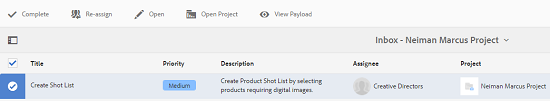
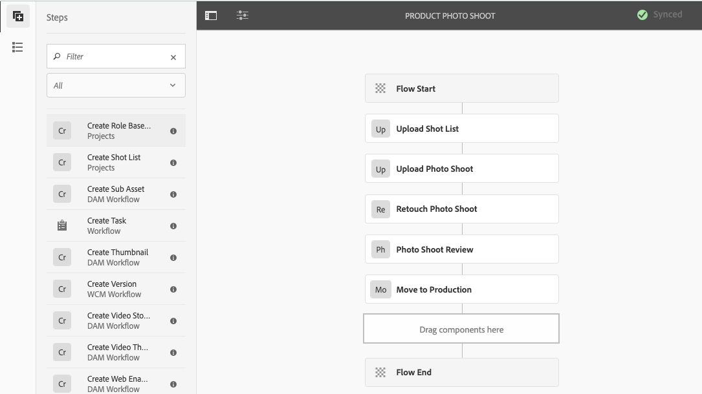

# Creative Project- en PIM-integratie {#creative-project-and-pim-integration}

Als u een marketeer of creatieve professional bent, kunt u Creative Project-gereedschappen in Adobe Experience Manager (AEM) gebruiken om productfotografie en bijbehorende creatieve processen binnen uw organisatie te beheren met betrekking tot eCommerce.

Met Creative Project kunt u de volgende taken stroomlijnen in uw fotoopnamesworkflow:

* Een aanvraag voor een fotoopname genereren
* Een fotoopname uploaden
* Samenwerken aan een fotoopname
* Goedgekeurde elementen verpakken

>[!NOTE]
>
>Zie {de Rollen van de Gebruiker van het 0} Project voor informatie [&#128279;](/help/sites-authoring/projects.md#user-roles-in-a-project) bij het toewijzen van gebruikersrollen en werkschema&#39;s aan bepaalde soorten gebruikers.

## Workflows voor foto&#39;s van producten  {#exploring-product-photo-shoot-workflows}

Creatief Project verstrekt diverse projectmalplaatjes om aan diverse projectvereisten te voldoen. Het **malplaatje van het Project van de Opname van de Foto van het 0&rbrace; Product &lbrace;is beschikbaar uit de doos.** Deze sjabloon bevat workflows voor fotoopname waarmee u aanvragen voor productfotoshoot kunt starten en beheren. Het omvat ook een reeks taken waarmee u digitale afbeeldingen voor producten kunt verkrijgen via de juiste controle- en goedkeuringsprocedures.

## Een fotofotoproject voor een product maken {#create-a-product-photo-shoot-project}

1. In de **console van Projecten**, klik **creeer** en kies dan **Project** van de lijst creëren.

   

1. In **creeer Project** pagina, selecteer het **malplaatje van het Project van de Foto van het Product** en klik daarna **&#x200B;**.

   

1. Voer de projectdetails in, inclusief titel, beschrijving en vervaldatum. Voeg gebruikers toe en wijs diverse rollen aan hen toe. U kunt ook een miniatuur toevoegen voor het project.

   

1. Klik **creëren**. Een bevestigingsbericht deelt mee dat het project wordt gecreeerd.
1. Klik **Gedaan** om aan de **Projecten** console terug te keren. Alternatief, klik **Open** om de activa binnen het project te bekijken.

## Werken in een fotofotoproject voor producten starten {#starting-work-in-a-product-photo-shoot-project}

Om een verzoek van de fotospruit in werking te stellen, klik een project en klik dan **voeg het Werk** binnen de pagina van de projectdetails toe om een werkschema te beginnen.

 toe

Het Project van de Opname van de Foto van het A **Product** omvat de volgende uit-van-de-doos werkschema&#39;s:

* **van de Foto van het Product Opname (de Integratie van Commerce) Werkschema**: Dit werkschema gebruikt commerciële integratie met het systeem van het productinformatiebeheer (PIM) om automatisch een ontsproten lijst voor de geselecteerde producten (hiërarchie) te produceren. U kunt de productgegevens weergeven als onderdeel van de metagegevens van de elementen nadat de workflow is voltooid.
* **Werkschema van de Opname van de Foto van het Product**: Dit werkschema laat u een ontsproten lijst in plaats van afhankelijk van commerciële integratie verstrekken. De geüploade afbeeldingen worden toegewezen aan een CSV-bestand in de map met projectelementen.

Gebruik het **Web van de Foto van het Product (de Integratie van Commerce)** werkschema om beeldactiva met de producten in AEM in kaart te brengen. Deze workflow gebruikt commerciële integratie om de goedgekeurde afbeeldingen te koppelen aan de bestaande productgegevens op de locatie `/etc/commerce` .

Het **Web van de Foto van het Product (de Integratie van Commerce)** werkschema omvat de volgende taken:

* Opnamelijst maken
* Fotofoto uploaden
* Fotoopname retoucheren
* Reviseren en goedkeuren
* Verplaatsen naar productietaak

Als de productinformatie niet beschikbaar in AEM is, gebruik het **werkschema van de Foto van het 0&rbrace; Product &lbrace;om beeldactiva met de producten in kaart te brengen die op de details worden gebaseerd u in een Csv- dossier uploadt.** Het CSV-bestand moet basisproductinformatie bevatten, zoals product-id, categorie en beschrijving. De workflow haalt goedgekeurde middelen voor de producten op.

Deze workflow omvat de volgende taken:

* Opnamelijst uploaden
* Fotofoto uploaden
* Fotoopname retoucheren
* Reviseren en goedkeuren
* Verplaatsen naar productietaak

U kunt deze workflow aanpassen met de optie Workflowconfiguraties.

Beide workflows bevatten stappen om producten te koppelen aan hun goedgekeurde middelen. Elke workflow bevat de volgende stappen:

* Workflowconfiguratie: beschrijft de opties om de workflow aan te passen
* Starten van een projectworkflow: legt uit hoe u een fotoshoot voor een product kunt starten
* Workflowtaakdetails: geeft details van taken die beschikbaar zijn in de workflow

## Voortgang van project bijhouden {#tracking-project-progress}

U kunt de vooruitgang van een project volgen door de actieve/voltooide taken binnen een project te controleren.

Gebruik het volgende om de voortgang van een project te controleren:

* Taakkaart
* Takenlijst

De taakkaart geeft de algemene voortgang van het project weer. Deze wordt alleen op de pagina met projectdetails weergegeven als het project verwante taken heeft. Op de taakkaart wordt de huidige voltooiingsstatus van het project weergegeven op basis van het aantal voltooide taken. Het omvat geen toekomstige taken.

De taakkaart bevat de volgende gegevens:

* Percentage actieve taken
* Percentage voltooide taken


De takenlijst bevat gedetailleerde informatie over de huidige actieve workflowtaak voor het project. Klik op de taakkaart om de lijst weer te geven. In de takenlijst worden ook metagegevens weergegeven, zoals begindatum, vervaldatum, toewijzing, prioriteit en status van de taak.


## Workflowconfiguratie {#workflow-configuration}

Deze taak omvat het toewijzen van workflowstappen aan gebruikers op basis van hun rollen.

Om het **werkschema van de Foto van het Product te vormen**:

1. Navigeer aan **Hulpmiddelen** > **Werkschema&#39;s**, en selecteer dan de **Modellen** tegel om de **Modellen van het Werkschema** pagina te openen.
1. Selecteer het **werkschema van de Foto van het 0&rbrace; Product van de Foto, en selecteer** uitgeven **pictogram van de toolbar om het op uit te geven wijze te openen.**

   

1. In de **pagina van het Werkschema van de Opname van de Foto van het 0&rbrace; Product &lbrace;, open een projecttaak.** Bijvoorbeeld, open de **Upload Opname van de Lijst** taak.

    uit

1. Klik het **lusje van de Taak** om het volgende te vormen:

   * Naam van de taak
   * Standaardgebruiker (rol) die de taak ontvangt
   * Standaardprioriteit van de taak, die in de taaklijst van de gebruiker wordt getoond
   * Taakbeschrijving die moet worden weergegeven wanneer de ontvanger de taak opent
   * Vervaldatum voor een taak, die wordt berekend op basis van de tijd waarop de taak is begonnen

1. Klik **O.K.** om de configuratiemontages te bewaren.

U kunt de extra taken voor het **werkschema van de Foto van het Product van de Foto** op een gelijkaardige manier vormen.

Voer de zelfde stappen uit om de taken in het **Web van de Foto van het Product (de Integratie van Commerce) Werkschema** te vormen.

## Een projectworkflow starten {#starting-a-project-workflow}

In deze sectie wordt beschreven hoe u het beheer van productinformatie kunt integreren met uw creatieve project.

1. Navigeer aan een project van de productfoto ontspruit, en klik **voeg het pictogram van het Werk** op de **werkschema&#39;s** kaart toe.
1. Selecteer de **Opname van de Foto van het Product (de Integratie van Commerce)** werkschemakaart om het **Opname van de Foto van het Product te beginnen (de Integratie van Commerce)** werkschema. Als de productinformatie niet beschikbaar onder `/etc/commerce` is, selecteer het **Web van de Foto van het Product** werkschema en begin het **Opname van de Foto van het Product** werkschema.

   

1. Klik **daarna** om het werkschema in het project in werking te stellen.
1. Voer workflowgegevens in op de volgende pagina.

   

1. Klik **voorleggen** om het fotoontsproten werkschema te beginnen. De pagina met projectdetails voor het fotoopnameproject wordt weergegeven.

   

### Workflowtaken {#workflow-tasks-details}

De workflow voor fotograferen bevat verschillende taken. Elke taak wordt toegewezen aan een gebruikersgroep die op de configuratie wordt gebaseerd die voor de taak wordt bepaald.

#### Opnamelijst maken {#create-shot-list-task}

**creeer de taak van de Lijst van de Opname** laat de projecteigenaar toe om producten te selecteren waarvoor beelden worden vereist. Op basis van de optie die de gebruiker heeft geselecteerd, wordt een CSV-bestand gegenereerd dat basisproductinformatie bevat.

1. In de projectomslag, klik de ellipsenknoop bij het bodem-recht van de [ Kaart van Taken ](#tracking-project-progress) om het taakpunt in het werkschema te bekijken.

   

1. Selecteer de **Create Opnamelijst** taak, en klik dan het **Open** pictogram van de toolbar.

   

1. Herzie de taakdetails en klik dan **creeer de knoop van de Lijst van de Opname**.

   

1. Selecteer producten waarvoor productgegevens bestaan zonder gekoppelde afbeeldingen.

   

1. Klik **toevoegen aan de Opnamelijst** knoop om een Csv- dossier tot stand te brengen dat een lijst van al dergelijke producten bevat. Een bericht bevestigt dat de opnamelijst voor de geselecteerde producten wordt gecreeerd. Klik **dicht** om het werkschema te voltooien.

1. Nadat u een ontsproten lijst creeert, verschijnt de **verbinding van de Lijst van het Opname van de Mening**. Om meer producten aan de ontsproten lijst toe te voegen, klik **toevoegen aan de Opnamelijst**. In dit geval worden de gegevens toegevoegd aan de oorspronkelijk gemaakte opnamelijst.

   

1. Klik **Lijst van de Opname van de Mening** om de nieuwe ontsproten lijst te bekijken.

   

   Om de bestaande gegevens uit te geven of nieuwe gegevens toe te voegen, **uitgeeft** van de toolbar. Slechts zijn **Product &#x200B;** en **Beschrijving** gebieden editable.

    uit

   Nadat u het dossier bijwerkt, klik **sparen** op toolbar om het dossier te bewaren.

1. Na het toevoegen van de producten, klik het **Volledige** pictogram op **creeer de pagina van de de taakdetails van de Lijst van de Opname** om de taak te merken zoals voltooid. U kunt een optionele opmerking toevoegen.

De voltooiing van de taak brengt de volgende veranderingen in het project met zich mee:

* Assets die overeenkomt met de producthiërarchie wordt gemaakt in een map met dezelfde naam als de titel van de workflow.
* De metagegevens voor de elementen kunnen worden bewerkt met de Assets-console, zelfs voordat de foto&#39;s door de fotograaf worden weergegeven.
* Er wordt een fotoopnamemap gemaakt waarin de afbeeldingen worden opgeslagen die de fotograaf verschaft. De fotoopnamemap bevat submappen voor elk product-item in de opnamelijst.

### Opnamelijst uploaden taak {#upload-shot-list-task}

Deze taak maakt deel uit van de workflow Foto&#39;s maken van producten. U voert deze taak uit als de productinformatie niet beschikbaar is in AEM. In dit geval uploadt u een lijst met producten in een CSV-bestand waarvoor afbeeldingselementen vereist zijn. Op basis van de details in het CSV-bestand kunt u afbeeldingselementen toewijzen aan de producten. Het bestand moet een CSV-bestand met de naam `shotlist.csv` zijn.

Gebruik de **verbinding van de Lijst van de Opname van de Mening** onder de projectkaart in de vorige procedure om een steekproefCSV- dossier te downloaden. Controleer het voorbeeldbestand om de gebruikelijke inhoud van een CSV-bestand te kennen.

De productlijst of het Csv- dossier kan gebieden, zoals **Categorie, Product, Id, Beschrijving**, en **Weg** bevatten. Het **gebied van identiteitskaart** is verplicht en bevat productID. De andere velden zijn optioneel.

Een product kan tot een bepaalde categorie behoren. De productcategorie kan in CSV onder de **kolom van de Categorie** worden vermeld. Het **gebied van het Product** bevat de naam van het product. Op het **gebied van de Beschrijving**, ga de productbeschrijving of de instructies voor de fotograaf in.

1. In de projectomslag, klik de ellipsenknoop bij het bodem-recht van de [ Kaart van Taken ](#tracking-project-progress) om de lijst van taken in het werkschema te bekijken.
1. Selecteer de **Upload de taak van de Lijst van de Opname**, en klik dan het **Open** pictogram van de toolbar.

   

1. Herzie de taakdetails en klik dan de **Upload Opgenomen knoop van de Lijst**.

   

1. Klik **uploadt de knoop van de Lijst van de Opname** om het Csv- dossier te uploaden. De workflow herkent dit bestand als een bron die moet worden gebruikt om productgegevens te extraheren voor de volgende taak.
1. Upload een CSV-bestand met productinformatie in de juiste indeling. De **Mening Geüploade verbinding van Assets** verschijnt onder de kaart nadat het Csv- dossier wordt geupload.

   

   Klik het **Volledige** pictogram om de taak te voltooien.

1. Klik het **Volledige** pictogram om de taak te voltooien.

### Fotoopnametaak uploaden {#upload-photo-shoot-task}

Als u een Redacteur bent, kunt u schoten voor de producten uploaden die in **worden vermeld shotlist.csv** dossier dat in de vorige taak wordt gecreeerd of wordt geupload.

De naam van te uploaden beelden moet met `<ProductId_>` beginnen waar `ProductId` van het **gebied van identiteitskaart** in het `shotlist.csv` dossier van verwijzingen wordt voorzien. Bijvoorbeeld, voor een product in de ontsproten lijst met **identiteitskaart** `397122`, zou u dossiers met namen `397122_highcontrast.jpg`, `397122_lowlight.png`, etc. uploaden.

U kunt de afbeeldingen rechtstreeks uploaden of een ZIP-bestand met de afbeeldingen uploaden. Op basis van hun namen worden de afbeeldingen in de desbetreffende productmappen in de fotoopnamemap geplaatst.

1. Onder de projectomslag, klik de ellipsenknoop bij het bodem-recht van de [ Kaart van de Taak ](#tracking-project-progress) om het taakpunt in het werkschema te bekijken.
1. Selecteer de **Upload de taak van de Foto van de Foto**, en klik dan het **Open** pictogram van de toolbar.

   

1. Klik **upload de Fotofoto** en upload de foto ontspruit beelden.
1. Klik het **Volledige** pictogram van de toolbar om de taak te voltooien.

### Fotoopnametaak retoucheren {#retouch-photo-shoot-task}

Als u het uitgeven rechten hebt, voer de **taak van de Opname van de Foto van de Terugkeer** uit om de beelden uit te geven die aan de omslag van de fotospruit worden geupload.

1. Onder de projectomslag, klik de ellipsenknoop bij het bodem-juiste [ Kaart van de Taak ](#tracking-project-progress) om het taakpunt in het werkschema te bekijken.
1. Selecteer de **taak van de Opname van de Foto van de Winst**, en klik dan het **Open** pictogram van de toolbar.

   

1. Klik de **Mening Geüploade verbinding van Assets** in de **pagina van de Foto van de Retoucheren** om de geuploade beelden te doorbladeren.

   

   Bewerk de afbeeldingen indien nodig met een Adobe Creative Cloud-toepassing.

    uit

1. Klik het **Volledige** pictogram van de toolbar om de taak te voltooien.

### Taak controleren en goedkeuren {#review-and-approve-task}

In deze taak bekijkt u de foto&#39;s die door een fotograaf zijn geüpload en markeert u de afbeeldingen zoals deze zijn goedgekeurd voor gebruik.

1. Onder de projectomslag, klik de ellipsenknoop bij het bodem-recht van de [ Kaart van de Taak ](#tracking-project-progress) om het taakpunt in het werkschema te bekijken.
1. Selecteer de **Controle &amp; keur** taak goed, en klik dan het **Open** pictogram van de toolbar.

    goed

1. In de **Overzicht &amp; keurt** pagina goed, wijs de overzichtstaak aan een rol toe en klik dan **Overzicht** beginnen de geuploade productbeelden te herzien.

   

1. Selecteer een productbeeld, en klik **goedkeuren** pictogram van de toolbar om het te merken zoals goedgekeurd. Zodra u een afbeelding hebt goedgekeurd, wordt er een goedgekeurde banner weergegeven.

   

1. Klik **Voltooid**. De goedgekeurde afbeeldingen zijn gekoppeld aan de lege elementen die zijn gemaakt.

Het is mogelijk dat u bepaalde producten zonder afbeelding weglaat. Later kunt u de taak opnieuw uitvoeren en markeren dat deze voltooid is.

U kunt naar projectmiddelen navigeren gebruikend de UI van Assets en de goedgekeurde beelden verifiëren.

Klik op het volgende niveau om producten weer te geven volgens de hiërarchie van productgegevens.

Creative Project koppelt goedgekeurde elementen aan het product waarnaar wordt verwezen. De activa meta-gegevens wordt bijgewerkt met de productverwijzing en basisinformatie in het **lusje van de Gegevens van het Product** onder activaeigenschappen zij in de sectie van de Metagegevens van het AEM verschijnen.

>[!NOTE]
>
>In het **werkschema van de Opname van de Foto van het Product** (zonder commerciële integratie), hebben de goedgekeurde beelden geen vereniging met producten.

### Verplaatsen naar productietaak {#move-to-production-task}

Met deze taak verplaatst u de goedgekeurde middelen naar de map voor productie, zodat deze beschikbaar zijn voor gebruik.

1. Onder de projectomslag, klik de ellipsenknoop bij het bodem-recht van de [ Kaart van de Taak ](#tracking-project-progress) om het taakpunt in het werkschema te bekijken.
1. Selecteer de **Beweging aan Productie** taak, en klik dan het **Open** pictogram van de toolbar.

   

1. Om de goedgekeurde activa voor de fotospruit te bekijken alvorens hen aan productie klaar omslag te bewegen, klik de **Mening Goedgekeurde verbinding van Assets** onder de projectduimnagel op de **beweging aan de 3&rbrace; taakpagina van de Productie &lbrace;.**

   

1. Ga de weg van de productie-klaar omslag in het **Beweging aan** gebied in.

   

1. Klik **Beweging aan Productie**. Sluit het bevestigingsbericht. De elementen worden naar het genoemde pad verplaatst en er wordt automatisch een centrifugeset gemaakt voor de goedgekeurde elementen voor elk product op basis van de maphiërarchie.

1. Klik het **Volledige** pictogram van de toolbar. De workflow wordt voltooid wanneer de laatste stap is gemarkeerd als voltooid.

## Metagegevens van DAM-element weergeven {#viewing-dam-asset-metadata}

Nadat u hebt ingestemd, zijn de elementen gekoppeld aan de corresponderende producten. De [ Pagina van Eigenschappen ](/help/assets/manage-assets.md#editing-properties) van de goedgekeurde activa heeft nu een extra **Gegevens van het Product** (verbonden productinformatie) tabel. Op dit tabblad worden de productdetails, het SKU-nummer en andere productgerelateerde details weergegeven die het element koppelen. Klik **uitgeven** pictogram om een activa bezit bij te werken. De productgerelateerde informatie blijft alleen-lezen.

Klik op de koppeling die wordt weergegeven om naar de pagina met productdetails in de productconsole te gaan waaraan het element is gekoppeld.

## De workflows voor fotoopname van projecten aanpassen {#customizing-the-project-photo-shoot-workflows}

U kunt de **werkschema&#39;s aanpassen van de Foto van het Project** die op uw vereisten worden gebaseerd. Dit is een facultatieve, op rol-gebaseerde taak die u uitvoert om de waarde van een variabele binnen het project te plaatsen. Later, kunt u de gevormde waarde dan gebruiken om bij een besluit aan te komen.

1. Klik het AEM embleem, en navigeer dan aan **Hulpmiddelen** > **Werkschema** > **Modellen** om de **Modellen van het Werkschema** pagina te openen.
1. Selecteer de **Opname van de Foto van het Product (de Integratie van Commerce)** werkschema of het **Opname van de Foto van het Product** werkschema en klik **uitgeven** van de toolbar om het werkschema op uit te geven wijze te openen.
1. Open het zijpaneel en bepaal de plaats van **creëren Rol Gebaseerde stap van de Taak van het Project** en sleep het aan het werkschema.

   

1. Open de **Rol Gebaseerde 1&rbrace; stap van de Taak.**
1. Op het **lusje van de Taak**, verstrek een naam voor de taak die in de taaklijst zal tonen. U kunt de taak aan een rol ook toewijzen, de standaardprioriteit plaatsen, een beschrijving verstrekken, en een tijd specificeren wanneer de taak verschuldigd is.

   

1. Voor **Verpletterend** lusje, specificeer de acties voor de taak. Om veelvoudige acties toe te voegen, klik **Punt** verbinding toevoegen.

   

1. Na het toevoegen van de opties klikt O.K. **om de veranderingen in de stap toe te voegen.**

1. Terug in het **venster van het Model van het Werkschema** **klikt de Synchronisatie** om de veranderingen van het volledige werkschema te bewaren. Tapping of het klikken van **O.K.** voor de stap slaat niet de veranderingen in het werkschema op. Om veranderingen in het werkschema te bewaren, klik **Synchronisatie**.

1. Open het zijpaneel en bepaal de plaats van het **Goto Stap** werkschema en sleep het aan het werkschema.

1. Open de **goto** taak en klik het **Proces** lusje.

1. Selecteer de **Stap van het Doel** om te gaan en te specificeren dat **Verpletterend Uitdrukking** ECMA manuscript is. Dan verstrek de volgende code op het **gebied van het Manuscript**:

   ```javascript
   function check() {
   
   if (workflowData.getMetaDataMap().get("lastTaskAction","") == "Reject All") {
   
   return true
   
   }
   
   // set copywriter user in metadata
   
   var previousId = workflowData.getMetaDataMap().get("lastTaskCompletedBy", "");
   
   workflowData.getMetaDataMap().put("copywriter", previousId);
   
   return false;
   
   }
   ```

   >[!TIP]
   >
   >Voor details over het scripting in werkschemastappen, zie [ het bepalen van een Regel voor OF Splitst ](/help/sites-developing/workflows-models.md).

   

1. Klik **OK**.

1. Klik **Synchronisatie** om het werkschema te bewaren.

Een nieuwe taak komt nu omhoog nadat de [ Beweging aan de taak van de Productie ](#move-to-production-task) wordt voltooid en aan de eigenaar toegewezen.

De gebruiker in de **rol van de Eigenaar** kan de taak voltooien en een actie (van de lijst van acties selecteren die in de configuraties van de werkschemasstap worden toegevoegd) van de lijst in commentaarpopup worden toegevoegd.

>[!NOTE]
>
>Wanneer u een server start, plaatst de servlet van de taaklijst van het Project de toewijzingen tussen taaktypes en URLs die onder `/libs/cq/core/content/projects/tasktypes` worden bepaald. Vervolgens kunt u de gebruikelijke overlay uitvoeren en aangepaste taaktypen toevoegen door deze onder `/apps/cq/core/content/projects/tasktypes` te plaatsen.
