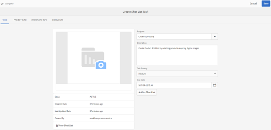
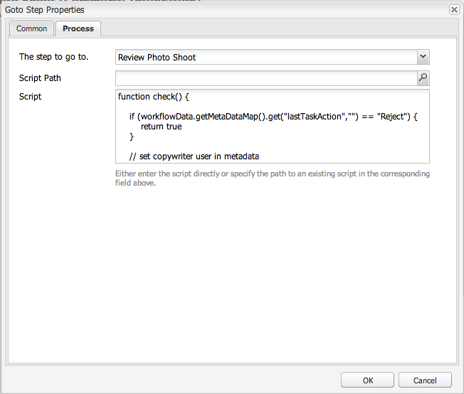

# Creative Project- en PIM-integratie{#creative-project-and-pim-integration}

Als u een marketeer of creatieve professional bent, kunt u Creative Project-gereedschappen in Adobe Experience Manager (AEM) gebruiken om productfotografie en bijbehorende creatieve processen binnen uw organisatie te beheren met betrekking tot eCommerce.

Met Creative Project kunt u met name de volgende taken stroomlijnen in uw fotoopnamesworkflow:

* Een aanvraag voor een fotoopname genereren
* Een fotoopname uploaden
* Samenwerken aan een fotoopname
* Goedgekeurde elementen verpakken

>[!NOTE]
>
>Zie Rollen van de Gebruiker van het [Project voor informatie](/help/sites-authoring/projects.md#user-roles-in-a-project) over het toewijzen van gebruikersrollen en werkschema&#39;s aan bepaalde soorten gebruikers.

## Workflows verkennen voor het maken van foto&#39;s van producten  {#exploring-product-photo-shoot-workflows}

Creatief Project verstrekt diverse projectmalplaatjes om aan diverse projectvereisten te voldoen. De sjabloon Project **foto foto van** product is beschikbaar in het vak. Deze sjabloon bevat workflows voor fotoopname waarmee u aanvragen voor productfotoshoot kunt starten en beheren. Het omvat ook een reeks taken waarmee u digitale afbeeldingen voor producten kunt verkrijgen via de juiste controle- en goedkeuringsprocedures.

De sjabloon bevat de volgende workflows:

* **Workflow** voor het maken van foto&#39;s van producten (handelsintegratie): Deze workflow maakt gebruik van de integratie van de handel met het PIM-systeem (Product Information Management) om automatisch een opnamelijst te genereren voor de geselecteerde producten (hiërarchie). U kunt de productgegevens weergeven als onderdeel van de metagegevens van de elementen nadat de workflow is voltooid.
* **Workflow** voor foto&#39;s van producten: Met deze workflow kunt u een opnamelijst opgeven in plaats van afhankelijk te zijn van de integratie van de handel. De geüploade afbeeldingen worden toegewezen aan een CSV-bestand in de map met projectelementen.

>[!NOTE]
>
>Het CSV-bestand dat wordt geüpload in de taak Opname van foto&#39;s uploaden van de workflow Foto van product moet de bestandsnaam shotlist.csv hebben.

## Een fotofotoproject voor producten maken {#create-a-product-photo-shoot-project}

1. Tik/klik op **Maken** in de **projectenconsole** en kies Project **** maken in de lijst.

   

1. Selecteer op de pagina Project **** maken de sjabloon voor het fotograferen van het project en tik op **Volgende**.

   

1. Voer de projectdetails in, inclusief titel, beschrijving en vervaldatum. Voeg gebruikers toe en wijs diverse rollen aan hen toe. U kunt ook een miniatuur toevoegen voor het project.

   

1. Tik/klik op **Maken**. Een bevestigingsbericht deelt mee dat het project wordt gecreeerd.
1. Tik/klik op **Gereed** om terug te keren naar de **projectenconsole** . Of tik op **Openen** of klik op Openen om de elementen in het fotoopnameproject weer te geven.

## Werken in een fotofotoproject voor producten starten {#starting-work-in-a-product-photo-shoot-project}

Tik op een project of klik op Werk **toevoegen in de pagina met projectdetails om een workflow te starten als u een fotoopnameverzoek wilt starten. Tik vervolgens op een project en klik op Werk** toevoegen op de pagina met projectdetails.


Een project van de Opname van de Foto van het Product omvat de volgende out-of-the-box werkschema&#39;s:

* Workflow voor het maken van foto&#39;s van producten (integratie van handel)
* Workflow voor foto&#39;s van producten

Gebruik de workflow Foto foto&#39;s van product (Commerce Integration) om afbeeldingselementen toe te wijzen aan de producten in AEM. Deze workflow gebruikt Commerce Integration om de goedgekeurde afbeeldingen te koppelen aan de bestaande productgegevens op de locatie */etc/commerce*.

De workflow Foto maken van product (Commerce Integration) omvat de volgende taken:

* Opnamelijst maken
* Fotofoto uploaden
* Fotoopname retoucheren
* Controleren en goedkeuren
* Naar productietaak gaan

Als de productinformatie niet beschikbaar is in AEM, gebruikt u de workflow Fotoopname van product om afbeeldingselementen toe te wijzen aan de producten op basis van de gegevens die u in een CSV-bestand uploadt. Het CSV-bestand moet basisproductinformatie bevatten, zoals product-id, categorie en beschrijving. De workflow haalt goedgekeurde middelen voor de producten op.

Deze workflow omvat de volgende taken:

* Opnamelijst uploaden
* Fotofoto uploaden
* Fotoopname retoucheren
* Controleren en goedkeuren
* Naar productietaak gaan

U kunt deze workflow aanpassen met de optie Workflowconfiguraties.

Beide workflows bevatten stappen om producten te koppelen aan hun goedgekeurde middelen. Elke workflow bevat de volgende stappen:

* Workflowconfiguratie: Beschrijft de opties om het werkschema aan te passen
* Een projectworkflow starten: Verklaart hoe te om een Foto van het Product te beginnen
* Details workflowtaken: Verstrekt details van taken beschikbaar in het werkschema

## Voortgang van project bijhouden {#tracking-project-progress}

U kunt de vooruitgang van een project volgen door de actieve/voltooide taken binnen een project te controleren.

Gebruik het volgende om de voortgang van een project te controleren:

* **Taakkaart**

* **Takenlijst**

De Taakkaart geeft de algemene voortgang van het project weer. Deze wordt alleen op de pagina Projectdetails weergegeven als het project verwante taken heeft. Op de taakkaart wordt de huidige voltooiingsstatus van het project weergegeven op basis van het aantal voltooide taken. Het omvat geen toekomstige taken.

De Taakkaart bevat de volgende gegevens:

* Percentage actieve taken
* Percentage voltooide taken


De lijst van de Taak verstrekt gedetailleerde informatie over de momenteel actieve werkschematoeage voor het project. Tik of klik op de Taakkaart om de lijst weer te geven. De lijst van de Taak toont ook meta-gegevens zoals begindatum, vervaldatum, ontvanger, prioriteit, en status van de taak.


## Workflowconfiguratie {#workflow-configuration}

Deze taak omvat het toewijzen van workflowstappen aan gebruikers op basis van hun rollen.

De workflow **Fotoopname** van product configureren:

1. Navigeer naar **Gereedschappen** > **Workflows** en tik vervolgens op de tegel **Modellen** om de pagina **Workflowmodellen** te openen.
1. Selecteer de werkstroom **Fotoopname** van product en tik op het pictogram **Bewerken** op de werkbalk om het te openen in de bewerkingsmodus.

   

1. Open een projecttaak op de pagina Workflow **voor fotoopname van** product. Open bijvoorbeeld de taak Opnamelijst **** uploaden.

   

1. Klik op het tabblad **Taak** om het volgende te configureren:

   * Naam van de taak
   * Standaardgebruiker (rol) die de taak ontvangt
   * Standaardprioriteit van de taak, die in de taaklijst van de gebruiker wordt getoond
   * Taakbeschrijving die moet worden weergegeven wanneer de ontvanger de taak opent
   * Vervaldatum voor een taak, die wordt berekend op basis van de tijd waarop de taak is begonnen

1. Klik op **OK** om de configuratie-instellingen op te slaan.

   Op dezelfde manier kunt u de volgende taken voor het werkschema van de Opname van de Foto van het **Product** vormen:

   * Fotofoto uploaden
   * Fotofoto van product retoucheren
   * Fotoopname bekijken
   * Verplaatsen naar productie

   Voer een gelijkaardige procedure uit om de taken in het werkschema **van de Opname van de Foto van het** Product (de Integratie van de Handel) te vormen.

In deze sectie wordt beschreven hoe u productinformatiebeheer kunt integreren met uw creatieve project.

## Een projectworkflow starten {#starting-a-project-workflow}

1. Navigeer naar een fotoproject voor producten en tik op het pictogram Werk **** toevoegen op de **werkstroomkaart** .
1. Selecteer de werkstroomkaart **Productfotoopname (Commerce Integration)** om de workflow Productfotoopname (Commerce Integration) te starten. Als de productinformatie niet beschikbaar is onder /etc/commerce, selecteert u de workflow **Fotoopname** van product en start u de workflow Fotoopname van product.

   

1. Tik/klik op **Volgende** om de workflow in het project te starten.
1. Voer workflowgegevens in op de volgende pagina.

   

   Klik op **Verzenden** om de fotoopnamworkflow te starten. De pagina met projectdetails voor het fotoopnameproject wordt weergegeven.

   

### Workflowtaken {#workflow-tasks-details}

De workflow voor fotograferen bevat verschillende taken. Elke taak wordt toegewezen aan een gebruikersgroep die op de configuratie wordt gebaseerd die voor de taak wordt bepaald.

#### Opnamelijst maken {#create-shot-list-task}

Met de **taak Opnamelijst** maken kan de eigenaar van het project producten selecteren waarvoor afbeeldingen zijn vereist. Op basis van de optie die de gebruiker heeft geselecteerd, wordt een CSV-bestand gegenereerd dat basisproductinformatie bevat.

1. Tik in de projectmap op de ovalen in de [takenkaart](#tracking-project-progress) of klik erop om het taakitem in de workflow weer te geven.

   

1. Selecteer de **taak Opnamelijst** maken en tik op het pictogram **Openen** op de werkbalk.

   

1. Controleer de taakdetails en tik op de knop Lijst met **opnamen** maken of klik op deze knop.

   

1. Selecteer producten waarvoor productgegevens bestaan zonder gekoppelde afbeeldingen.

   

1. Tik/klik op het pictogram **Toevoegen aan lijst** om een CSV-bestand te maken dat een lijst met dergelijke producten bevat. Een bericht bevestigt dat de opnamelijst voor de geselecteerde producten wordt gecreeerd. Klik op **Sluiten** om de workflow te voltooien.
1. Nadat u een opnamelijst hebt gemaakt, wordt de koppeling Lijst met **** opnamen weergeven weergegeven. Tik op Toevoegen aan lijst met **** opnamen om meer producten aan de lijst met opnamen toe te voegen. In dit geval worden de gegevens toegevoegd aan de oorspronkelijk gemaakte opnamelijst.

   

1. Tik/klik op Lijst met **** opnamen weergeven om de nieuwe lijst met opnamen weer te geven.

   

   Tik op of klik op **Bewerken** op de werkbalk om de bestaande gegevens te bewerken of nieuwe gegevens toe te voegen. Alleen de velden **Product **en **Beschrijving** kunnen worden bewerkt.

   

   Nadat u het bestand hebt bijgewerkt, tikt u op de werkbalk op **Opslaan** of klikt u op Opslaan om het bestand op te slaan.

1. Nadat u de producten hebt toegevoegd, tikt u op het pictogram **Voltooid** op de pagina **Opnamelijst maken **taakdetails om de taak als voltooid te markeren. U kunt een optionele opmerking toevoegen.

   De voltooiing van de taak brengt de volgende veranderingen in het project met zich mee:

   * Elementen die overeenkomen met de producthiërarchie worden gemaakt in een map met dezelfde naam als de titel van de workflow.
   * De metagegevens voor de elementen kunnen worden bewerkt met de middelenconsole, zelfs voordat de foto de afbeeldingen verschaft.
   * Er wordt een map met foto&#39;s gemaakt waarin de afbeeldingen worden opgeslagen die de fotograaf verschaft. De map Fotoopname bevat submappen voor elk product-item in de lijst Opnamen.

   Voor het werkschema van de Foto van het Product van de Opname (zonder handelsintegratie), is de Upload Opnamelijst de eerste taak. Tik/klik op **Opnamelijst** uploaden om een **bestand shotlist.csv** te uploaden. Het CSV-bestand moet de product-id bevatten. De andere velden zijn optioneel. U kunt ze gebruiken om elementen toe te wijzen aan producten.

### Opnamelijst uploaden taak {#upload-shot-list-task}

Deze taak maakt deel uit van de workflow Foto&#39;s maken van producten. U voert deze taak uit als de productinformatie niet beschikbaar is in AEM. In dit geval uploadt u een lijst met producten in een CSV-bestand waarvoor afbeeldingselementen vereist zijn. Op basis van de details in het CSV-bestand kunt u afbeeldingselementen toewijzen aan de producten.

Gebruik de verbinding van de Lijst **van de Opname van de** Mening onder de projectkaart in de vorige procedure om een steekproefCSV dossier te downloaden. Controleer het voorbeeldbestand om de gebruikelijke inhoud van een CSV-bestand te kennen.

De productlijst of het CSV-bestand kan velden bevatten, zoals **Categorie, Product, Id, Beschrijving** en **Pad**. Het veld **Id** is verplicht en bevat de product-id. De andere velden zijn optioneel.

Een product kan tot een bepaalde categorie behoren. De productcategorie kan worden vermeld in de CSV onder de kolom **Categorie** . Het veld **Product** bevat de naam van het product. Voer in het veld **Omschrijving** de productbeschrijving of de aanwijzingen voor de fotograaf in.

>[!NOTE]
>
>De naam van de te uploaden afbeeldingen moet beginnen met &quot;**&lt;ProductId>_&quot;** , waarbij de product-id wordt vermeld in het veld **Id** in het bestand *shotlist.csv* . Bijvoorbeeld, voor een product in de opnamelijst met **Id 397122**, kunt u dossiers met namen **397122_highcontrast.jpg**, **397122_lowlight.png**, etc. uploaden.

1. Tik in de projectmap op de ovalen in de [takenkaart](#tracking-project-progress) of klik erop om de takenlijst in de workflow weer te geven.
1. Selecteer de **taak Opnamelijst** uploaden en tik/klik op het pictogram **Openen** op de werkbalk.

   

1. Controleer de taakdetails en tik op de knop Lijst met **opnamen** uploaden of klik op deze knop.

   

1. Tik/klik op de knop Lijst met **opnamen** uploaden om het CSV-bestand met de bestandsnaam shotlist.csv te uploaden. De workflow herkent dit bestand als een bron die moet worden gebruikt om productgegevens te extraheren voor de volgende taak.
1. Upload een CSV-bestand met productinformatie in de juiste indeling. De koppeling Geüploade **middelen** weergeven wordt onder de kaart weergegeven nadat het CSV-bestand is geüpload.

   

   Klik op het pictogram **Voltooien** om de taak te voltooien.

1. Tik/klik op het pictogram **Voltooien** om de taak te voltooien.

### Fotoopnametaak uploaden {#upload-photo-shoot-task}

Als u een Editor bent, kunt u opnamen uploaden voor de producten die worden vermeld in het bestand **shotlist.csv** dat in de vorige taak is gemaakt of geüpload.

De naam van de te uploaden afbeeldingen moet beginnen met **&quot;&lt;productId>_&quot;** , waar wordt verwezen naar de product-id in het veld **Id** in het bestand **shotlist.csv** . Voor een product met **ID 397122** in de opnamelijst kunt u bijvoorbeeld bestanden uploaden met de namen **397122_highcontrast.jpg**, **397122_lowlight.png** enzovoort.

U kunt de afbeeldingen rechtstreeks uploaden of een ZIP-bestand met de afbeeldingen uploaden. Op basis van hun namen worden de afbeeldingen in de desbetreffende productmappen in de map **Fotoopname** geplaatst.

1. Tik onder de projectmap op de ovalen in de [taakkaart](#tracking-project-progress) of klik erop om het taakitem in de workflow weer te geven.
1. Selecteer de taak Fotoopname **uploaden** en tik op het pictogram **Openen** /klik op de werkbalk.

   

1. Tik/klik op Fotofoto **uploaden** en upload de foto&#39;s die u hebt gemaakt.
1. Tik/klik op het pictogram **Voltooien** op de werkbalk om de taak te voltooien.

### Fotoopnametaak retoucheren {#retouch-photo-shoot-task}

Als u bewerkingsrechten hebt, voert u de taak Fotoopname retoucheren uit om de afbeeldingen te bewerken die naar de map Fotoopname zijn geüpload.

1. Tik onder de projectmap op de ovalen in de [taakkaart](#tracking-project-progress) of klik erop om het taakitem in de workflow weer te geven.
1. Selecteer de taak Fotoopname **retoucheren** en tik op het pictogram **Openen** /klik op de werkbalk.

   

1. Tik op de koppeling Geüploade elementen **** weergeven of klik op de pagina **Fotoopname** retoucheren om door de geüploade afbeeldingen te bladeren.

   

   Bewerk de afbeeldingen indien nodig met een Adobe Creative Cloud-toepassing.

   

1. Tik/klik op het pictogram **Voltooien** op de werkbalk om de taak te voltooien.

### Taak controleren en goedkeuren {#review-and-approve-task}

In deze taak bekijkt u de foto&#39;s die door een fotograaf zijn geüpload en markeert u de afbeeldingen zoals deze zijn goedgekeurd voor gebruik.

1. Tik onder de projectmap op de ovalen in de [taakkaart](#tracking-project-progress) of klik erop om het taakitem in de workflow weer te geven.
1. Selecteer de taak **Reviseren en goedkeuren** en tik op het pictogram **Openen** op de werkbalk.

   

1. Wijs op de pagina **Reviseren en goedkeuren** de revisietaak toe aan de rol, bijvoorbeeld Revisors, en tik op **Revisie **om de geüploade productafbeeldingen te bekijken.

   

1. Selecteer een productafbeelding en tik op het pictogram Goedkeuren op de werkbalk om de afbeelding als goedgekeurd te markeren.

   

   Zodra u een afbeelding hebt goedgekeurd, wordt er een goedgekeurde banner weergegeven.

   >[!NOTE]
   U kunt bepaalde producten zonder afbeelding weglaten. Later kunt u de taak opnieuw uitvoeren en markeren dat deze voltooid is.

1. Tik/klik op **Voltooien**. De goedgekeurde afbeeldingen zijn gekoppeld aan de lege elementen die zijn gemaakt.

U kunt naar projectelementen navigeren met behulp van de interface Elementen en de goedgekeurde afbeeldingen controleren.

Tik/klik op het volgende niveau om de producten volgens de hiërarchie van de productgegevens weer te geven.

Creative Project koppelt goedgekeurde elementen aan het product waarnaar wordt verwezen. De metagegevens van de elementen worden bijgewerkt met de productverwijzing en basisinformatie op het tabblad **Productgegevens** onder de eigenschappen van de elementen die worden weergegeven in de sectie Metagegevens van AEM.

>[!NOTE]
In de workflow Foto&#39;s maken van producten (zonder integratie in de handel) zijn de goedgekeurde afbeeldingen niet gekoppeld aan producten.

### Naar productietaak gaan {#move-to-production-task}

Met deze taak verplaatst u de goedgekeurde middelen naar de map voor productie, zodat deze beschikbaar zijn voor gebruik.

1. Tik onder de projectmap op de ovalen in de [taakkaart](#tracking-project-progress) of klik erop om het taakitem in de workflow weer te geven.
1. Selecteer de **taak Verplaatsen naar productie** en tik op het pictogram **Openen** op de werkbalk.

   

1. Als u de goedgekeurde elementen voor de fotoshoot wilt bekijken voordat u deze naar de map voor productie verplaatst, klikt u op de koppeling Goedgekeurde elementen **** weergeven onder de projectminiatuur op de taakpagina **Verplaatsen naar productie** .

   

1. Voer in het veld **Verplaatsen naar** het pad in van de map die klaar is voor productie.

   

   Tik/klik op **Verplaatsen naar productie**. Sluit het bevestigingsbericht. De elementen worden naar het opgegeven pad verplaatst en er wordt automatisch een centrifugeset gemaakt voor de goedgekeurde elementen voor elk product op basis van de maphiërarchie.

1. Tap/click the **Complete** icon from the toolbar. De workflow wordt voltooid wanneer de laatste stap is gemarkeerd als voltooid.

## Metagegevens van DAM-element weergeven {#viewing-dam-asset-metadata}

Nadat u hebt ingestemd, zijn de elementen gekoppeld aan de corresponderende producten. De [eigenschappenpagina](/help/assets/manage-assets.md#editing-properties) van de goedgekeurde elementen bevat nu een extra tabblad **Productgegevens** (gekoppelde productinformatie). Op dit tabblad worden de productdetails, het SKU-nummer en andere productgerelateerde details weergegeven die het element koppelen. Tik op het pictogram **Bewerken** of klik op het pictogram Bewerken om een elementeigenschap bij te werken. De productgerelateerde informatie blijft alleen-lezen.

Tik/klik op de koppeling die verschijnt om naar de pagina met productdetails te navigeren in de productconsole waaraan het element is gekoppeld.

## De workflows voor fotoopname van projecten aanpassen {#customizing-the-project-photo-shoot-workflows}

U kunt de workflows voor het maken van foto&#39;s van projecten op basis van vereisten aanpassen. Dit is een facultatieve, op rol-gebaseerde taak die u uitvoert om de waarde van een variabele binnen het project te plaatsen. Later, kunt u de gevormde waarde dan gebruiken om bij een besluit aan te komen.

1. Klik op het AEM logo of tik erop en ga vervolgens naar **Extra** > **Workflow** > **Modellen** om de pagina Workflowmodellen te openen.
1. Selecteer de workflow **Productfotoopname (Commerce Integration)** of de workflow **Productfotoopname** en klik op de werkbalk op **Bewerken** of tik op Bewerkenom de workflow in de bewerkingsmodus te openen.
1. Open de **Projecten** taken in de zijschop, en sleep de **Create Rol Gebaseerde stap** van de Taak van het Project aan het werkschema.

   

1. Open de stap Op **rol gebaseerde taak** .
1. Geef op het tabblad **Taak** een naam op voor de taak die wordt weergegeven in de lijst **Taak** . U kunt de taak aan een rol ook toewijzen, de standaardprioriteit plaatsen, een beschrijving verstrekken, en een tijd specificeren wanneer de taak verschuldigd is.

   

1. In het **Verpletterende** lusje, specificeer de acties voor de taak. Tik of klik op de koppeling Item toevoegen **toevoegen om meerdere handelingen toe te voegen.

   

1. Nadat u de opties hebt toegevoegd, klikt u op **OK** om de wijzigingen aan de stap toe te voegen.

   >[!NOTE]
   Als u op **OK** tikt of erop klikt, worden de wijzigingen in de workflow niet opgeslagen. Tik op of klik op **Opslaan** om de wijzigingen in de workflow op te slaan.

1. Open de **workflowtaken** vanaf de zijtrap en voeg een **Goto** -taak toe.
1. Open de taak **Ga naar** en tik op het tabblad **Proces** .
1. Geef de volgende code op in het vak **Script** :

```
   function check() {

   if (workflowData.getMetaDataMap().get("lastTaskAction","") == "Reject All") {

   return true

   }

   // set copywriter user in metadata

   var previousId = workflowData.getMetaDataMap().get("lastTaskCompletedBy", "");

   workflowData.getMetaDataMap().put("copywriter", previousId);

   return false;

   }
```

>[!NOTE]
Zie Een regel [definiëren voor een OF-splitsing](/help/sites-developing/workflows-models.md)voor meer informatie over scripts in workflowstappen.



1. Tik/klik op **OK**.

1. Tik/klik op **Opslaan** om de workflow op te slaan.

   

1. Een nieuwe taak van de Eigenaar van het Project komt nu omhoog nadat de [Beweging aan de taak](#move-to-production-task) van de Productie wordt voltooid en aan de eigenaar wordt toegewezen.

   De gebruiker met de rol Eigenaar kan de taak voltooien en een actie selecteren (uit de lijst met acties die zijn toegevoegd aan de configuraties van workflowstappen) in de lijst in de pop-up met opmerkingen.

   

   Selecteer de gewenste optie en klik op **Voltooien** om de **Ga naar stap** uit te voeren in de workflow.

>[!NOTE]
Wanneer u een server begint, slaat servlet van de de taaklijst van het Project de afbeeldingen tussen taaktypes en URLs in het voorgeheugen onder `/libs/cq/core/content/projects/tasktypes`. U kunt dan de gebruikelijke bedekking uitvoeren en de types van douanetaak toevoegen door hen onder te plaatsen `/apps/cq/core/content/projects/tasktypes`.

