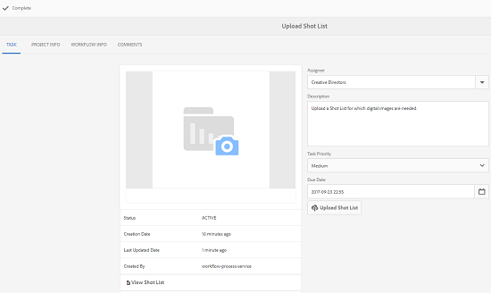

# Creative Project- en PIM-integratie {#creative-project-and-pim-integration}

Als u een marketeer of creatieve professional bent, kunt u Creative Project-gereedschappen in Adobe Experience Manager (AEM) gebruiken om productfotografie en bijbehorende creatieve processen binnen uw organisatie te beheren met betrekking tot eCommerce.

Met Creative Project kunt u de volgende taken stroomlijnen in uw fotoopnamesworkflow:

* Een aanvraag voor een fotoopname genereren
* Een fotoopname uploaden
* Samenwerken aan een fotoopname
* Goedgekeurde elementen verpakken

>[!NOTE]
>
>Zie [Rollen voor projectgebruikers voor meer informatie](/help/sites-authoring/projects.md#user-roles-in-a-project) bij het toewijzen van gebruikersrollen en workflows aan bepaalde typen gebruikers.

## Workflows voor foto&#39;s van producten  {#exploring-product-photo-shoot-workflows}

Creatief Project verstrekt diverse projectmalplaatjes om aan diverse projectvereisten te voldoen. De **Fotoproject van product** sjabloon is beschikbaar in het vak. Deze sjabloon bevat workflows voor fotoopname waarmee u aanvragen voor productfotoshoot kunt starten en beheren. Het omvat ook een reeks taken waarmee u digitale afbeeldingen voor producten kunt verkrijgen via de juiste controle- en goedkeuringsprocedures.

## Een fotofotoproject voor een product maken {#create-a-product-photo-shoot-project}

1. In de **Projecten** console, klik **Maken** en kies vervolgens **Project maken** in de lijst.

   

1. In de **Project maken** pagina, selecteert u de **Fotoproject van product** sjabloon en klik op **Volgende**.

   

1. Voer de projectdetails in, inclusief titel, beschrijving en vervaldatum. Voeg gebruikers toe en wijs diverse rollen aan hen toe. U kunt ook een miniatuur toevoegen voor het project.

   

1. Klikken **Maken**. Een bevestigingsbericht deelt mee dat het project wordt gecreeerd.
1. Klikken **Gereed** om terug te keren naar de **Projecten** console. U kunt ook op **Openen** om de activa binnen het project te bekijken.

## Werken in een fotofotoproject voor producten starten {#starting-work-in-a-product-photo-shoot-project}

Als u een aanvraag voor een fotoopname wilt starten, klikt u op een project en vervolgens klikt u op **Werk toevoegen** in de pagina met projectdetails om een workflow te starten.


A **Fotoproject van product** omvat de volgende out-of-the-box workflows:

* **Workflow voor het maken van foto&#39;s van producten (integratie van handel)**: Deze workflow gebruikt commerciële integratie met het PIM-systeem (Product Information Management) om automatisch een opnamelijst voor de geselecteerde producten (hiërarchie) te genereren. U kunt de productgegevens weergeven als onderdeel van de metagegevens van de elementen nadat de workflow is voltooid.
* **Workflow voor foto&#39;s van producten**: Met deze workflow kunt u een opnamelijst opgeven in plaats van afhankelijk te zijn van de integratie van de handel. De geüploade afbeeldingen worden toegewezen aan een CSV-bestand in de map met projectelementen.

Gebruik de **Fotofoto van product (integratie van handel)** workflow om afbeeldingselementen toe te wijzen aan de producten in AEM. Deze workflow gebruikt commerciële integratie om de goedgekeurde afbeeldingen te koppelen aan de bestaande productgegevens op de locatie `/etc/commerce`.

De **Fotofoto van product (integratie van handel)** de workflow omvat de volgende taken :

* Opnamelijst maken
* Fotofoto uploaden
* Fotoopname retoucheren
* Reviseren en goedkeuren
* Verplaatsen naar productietaak

Als de productinformatie niet beschikbaar is in AEM, gebruikt u de **Fotofoto van product** workflow om afbeeldingselementen toe te wijzen aan de producten op basis van de gegevens die u in een CSV-bestand uploadt. Het CSV-bestand moet basisproductinformatie bevatten, zoals product-id, categorie en beschrijving. De workflow haalt goedgekeurde middelen voor de producten op.

Deze workflow omvat de volgende taken:

* Opnamelijst uploaden
* Fotofoto uploaden
* Fotoopname retoucheren
* Reviseren en goedkeuren
* Verplaatsen naar productietaak

U kunt deze workflow aanpassen met de optie Workflowconfiguraties.

Beide workflows bevatten stappen om producten te koppelen aan hun goedgekeurde middelen. Elke workflow bevat de volgende stappen:

* Workflowconfiguratie: beschrijft de opties om de workflow aan te passen
* Starten van een projectworkflow: legt uit hoe u een fotoshoot voor een product kunt starten
* Workflowtaakdetails: geeft details van taken die beschikbaar zijn in de workflow

## Voortgang van project bijhouden {#tracking-project-progress}

U kunt de vooruitgang van een project volgen door de actieve/voltooide taken binnen een project te controleren.

Gebruik het volgende om de voortgang van een project te controleren:

* Taakkaart
* Takenlijst

De taakkaart geeft de algemene voortgang van het project weer. Deze wordt alleen op de pagina met projectdetails weergegeven als het project verwante taken heeft. Op de taakkaart wordt de huidige voltooiingsstatus van het project weergegeven op basis van het aantal voltooide taken. Het omvat geen toekomstige taken.

De taakkaart bevat de volgende gegevens:

* Percentage actieve taken
* Percentage voltooide taken


De takenlijst bevat gedetailleerde informatie over de huidige actieve workflowtaak voor het project. Klik op de taakkaart om de lijst weer te geven. In de takenlijst worden ook metagegevens weergegeven, zoals begindatum, vervaldatum, toewijzing, prioriteit en status van de taak.


## Workflowconfiguratie {#workflow-configuration}

Deze taak omvat het toewijzen van workflowstappen aan gebruikers op basis van hun rollen.

Om te vormen **Fotofoto van product** workflow:

1. Navigeren naar **Gereedschappen** > **Workflows** en selecteert u vervolgens de **Modellen** tegel om de **Workflowmodellen** pagina.
1. Selecteer de **Fotofoto van product** en selecteert u de **Bewerken** van de werkbalk om deze te openen in de bewerkingsmodus.

   

1. In de **Workflow voor foto&#39;s van producten** pagina, opent u een projecttaak. Open bijvoorbeeld de **Opnamelijst uploaden** taak.

   

1. Klik op de knop **Taak** om het volgende te configureren:

   * Naam van de taak
   * Standaardgebruiker (rol) die de taak ontvangt
   * Standaardprioriteit van de taak, die in de taaklijst van de gebruiker wordt getoond
   * Taakbeschrijving die moet worden weergegeven wanneer de ontvanger de taak opent
   * Vervaldatum voor een taak, die wordt berekend op basis van de tijd waarop de taak is begonnen

1. Klikken **OK** om de configuratie-instellingen op te slaan.

U kunt de extra taken voor de **Fotofoto van product** op dezelfde manier te werken.

Voer de zelfde stappen uit om de taken in te vormen **Workflow voor het maken van foto&#39;s van producten (integratie van handel)**.

## Een projectworkflow starten {#starting-a-project-workflow}

In deze sectie wordt beschreven hoe u het beheer van productinformatie kunt integreren met uw creatieve project.

1. Navigeer naar een fotofotoproject voor een product en klik op de knop **Werk toevoegen** pictogram op de **Workflows** kaart.
1. Selecteer de **Fotofoto van product (integratie van handel)** werkstroomkaart om de **Fotofoto van product (integratie van handel)** workflow. Als de productinformatie niet beschikbaar is onder `/etc/commerce`, selecteert u de **Fotofoto van product** workflow en start de **Fotofoto van product** workflow.

   

1. Klikken **Volgende** om de workflow in het project te starten.
1. Voer workflowgegevens in op de volgende pagina.

   

1. Klikken **Verzenden** om de fotoopnamesworkflow te starten. De pagina met projectdetails voor het fotoopnameproject wordt weergegeven.

   

### Workflowtaken {#workflow-tasks-details}

De workflow voor fotograferen bevat verschillende taken. Elke taak wordt toegewezen aan een gebruikersgroep die op de configuratie wordt gebaseerd die voor de taak wordt bepaald.

#### Opnamelijst maken {#create-shot-list-task}

De **Opnamelijst maken** Met deze taak kan de eigenaar van het project producten selecteren waarvoor afbeeldingen zijn vereist. Op basis van de optie die de gebruiker heeft geselecteerd, wordt een CSV-bestand gegenereerd dat basisproductinformatie bevat.

1. Klik in de projectmap op de knop voor ovalen rechtsonder in het dialoogvenster [Taken Kaart](#tracking-project-progress) om het taakpunt in het werkschema te bekijken.

   

1. Selecteer de **Opnamelijst maken** en klik vervolgens op de knop **Openen** op de werkbalk.

   

1. Controleer de taakdetails en klik op de knop **Opnamelijst maken** knop.

   

1. Selecteer producten waarvoor productgegevens bestaan zonder gekoppelde afbeeldingen.

   

1. Klik op de knop **Toevoegen aan lijst met opnamen** om een CSV-bestand te maken dat een lijst met dergelijke producten bevat. Een bericht bevestigt dat de opnamelijst voor de geselecteerde producten wordt gecreeerd. Klikken **Sluiten** om de werkstroom te voltooien.

1. Nadat u een opnamelijst hebt gemaakt, **Opnamelijst weergeven** wordt weergegeven. Als u meer producten wilt toevoegen aan de opnamelijst, klikt u op **Toevoegen aan lijst met opnamen**. In dit geval worden de gegevens toegevoegd aan de oorspronkelijk gemaakte opnamelijst.

   

1. Klikken **Opnamelijst weergeven** om de nieuwe opnamelijst weer te geven.

   

   Klik op **Bewerken** op de werkbalk. Alleen het **product **en **Beschrijving** de velden kunnen worden bewerkt.

   

   Klik op **Opslaan** op de werkbalk om het bestand op te slaan.

1. Nadat u de producten hebt toegevoegd, klikt u op **Voltooid** pictogram op de **Opnamelijst maken** pagina met taakdetails om de taak te markeren als voltooid. U kunt een optionele opmerking toevoegen.

De voltooiing van de taak brengt de volgende veranderingen in het project met zich mee:

* Elementen die overeenkomen met de producthiërarchie worden gemaakt in een map met dezelfde naam als de titel van de workflow.
* De metagegevens voor de elementen kunnen worden bewerkt met de middelenconsole, zelfs voordat de foto de afbeeldingen verschaft.
* Er wordt een fotoopnamemap gemaakt waarin de afbeeldingen worden opgeslagen die de fotograaf verschaft. De fotoopnamemap bevat submappen voor elk product-item in de opnamelijst.

### Opnamelijst uploaden taak {#upload-shot-list-task}

Deze taak maakt deel uit van de workflow Foto&#39;s maken van producten. U voert deze taak uit als de productinformatie niet beschikbaar is in AEM. In dit geval uploadt u een lijst met producten in een CSV-bestand waarvoor afbeeldingselementen vereist zijn. Op basis van de details in het CSV-bestand kunt u afbeeldingselementen toewijzen aan de producten. Het bestand moet een CSV-bestand met de naam `shotlist.csv`.

Gebruik de **Opnamelijst weergeven** koppeling onder de projectkaart in de vorige procedure om een CSV-voorbeeldbestand te downloaden. Controleer het voorbeeldbestand om de gebruikelijke inhoud van een CSV-bestand te kennen.

De productlijst of het CSV-bestand kan velden bevatten, zoals **Categorie, Product, Id, Beschrijving**, en **Pad**. De **Id** is verplicht en bevat de product-id. De andere velden zijn optioneel.

Een product kan tot een bepaalde categorie behoren. De productcategorie kan worden vermeld in de CSV onder de **Categorie** kolom. De **Product** bevat de naam van het product. In de **Beschrijving** Voer de productbeschrijving of de aanwijzingen voor de fotograaf in.

1. Klik in de projectmap op de knop voor ovalen rechtsonder in het dialoogvenster [Taken Kaart](#tracking-project-progress) om de lijst met taken in de workflow weer te geven.
1. Selecteer de **Opnamelijst uploaden** en klik vervolgens op de knop **Openen** op de werkbalk.

   

1. Controleer de taakdetails en klik op de knop **Opnamelijst uploaden** knop.

   

1. Klik op de knop **Opnamelijst uploaden** te uploaden. De workflow herkent dit bestand als een bron die moet worden gebruikt om productgegevens te extraheren voor de volgende taak.
1. Upload een CSV-bestand met productinformatie in de juiste indeling. De **Geüploade elementen weergeven** wordt onder de kaart weergegeven nadat het CSV-bestand is geüpload.

   

   Klik op de knop **Voltooid** pictogram om de taak te voltooien.

1. Klik op de knop **Voltooid** pictogram om de taak te voltooien.

### Fotoopnametaak uploaden {#upload-photo-shoot-task}

Als u een Editor bent, kunt u opnamen uploaden voor de producten die in het dialoogvenster **shotlist.csv** bestand dat in de vorige taak is gemaakt of geüpload.

De naam van de te uploaden afbeeldingen moet beginnen met `<ProductId_>` waar `ProductId` wordt verwezen vanuit de **Id** in het veld `shotlist.csv` bestand. Bijvoorbeeld voor een product in de opnamelijst met **Id** `397122`, uploadt u bestanden met namen `397122_highcontrast.jpg`, `397122_lowlight.png`, enzovoort.

U kunt de afbeeldingen rechtstreeks uploaden of een ZIP-bestand met de afbeeldingen uploaden. Op basis van hun namen worden de afbeeldingen in de desbetreffende productmappen in de fotoopnamemap geplaatst.

1. Klik onder de projectmap op de knop voor ovalen rechtsonder in het dialoogvenster [Taakkaart](#tracking-project-progress) om het taakpunt in het werkschema te bekijken.
1. Selecteer de **Fotofoto uploaden** en klik vervolgens op de knop **Openen** op de werkbalk.

   

1. Klikken **Fotofoto uploaden** en uploadt u de foto-opname-afbeeldingen.
1. Klik op de knop **Voltooid** van de werkbalk om de taak te voltooien.

### Fotoopnametaak retoucheren {#retouch-photo-shoot-task}

Als u bewerkingsrechten hebt, voert u de **Fotoopname retoucheren** bewerken van de afbeeldingen die naar de fotomap zijn geüpload.

1. Klik onder de projectmap op de knop voor ovalen rechtsonder in het dialoogvenster [Taakkaart](#tracking-project-progress) om het taakpunt in het werkschema te bekijken.
1. Selecteer de **Fotoopname retoucheren** en klik vervolgens op de knop **Openen** op de werkbalk.

   

1. Klik op de knop **Geüploade elementen weergeven** in de **Fotoopname retoucheren** pagina om door de geüploade afbeeldingen te bladeren.

   

   Bewerk de afbeeldingen indien nodig met een Adobe Creative Cloud-toepassing.

   

1. Klik op de knop **Voltooid** van de werkbalk om de taak te voltooien.

### Taak controleren en goedkeuren {#review-and-approve-task}

In deze taak bekijkt u de foto&#39;s die door een fotograaf zijn geüpload en markeert u de afbeeldingen zoals deze zijn goedgekeurd voor gebruik.

1. Klik onder de projectmap op de knop voor ovalen rechtsonder in het dialoogvenster [Taakkaart](#tracking-project-progress) om het taakpunt in het werkschema te bekijken.
1. Selecteer de **Controleren en goedkeuren** en klik vervolgens op de knop **Openen** op de werkbalk.

   

1. In de **Controleren en goedkeuren** pagina, wijs de overzichtstaak aan een rol toe en klik dan **Controleren** om de geüploade productafbeeldingen te bekijken.

   

1. Selecteer een productafbeelding en klik op de knop **Goedkeuren** op de werkbalk om aan te geven dat het bestand is goedgekeurd. Zodra u een afbeelding hebt goedgekeurd, wordt er een goedgekeurde banner weergegeven.

   

1. Klikken **Voltooid**. De goedgekeurde afbeeldingen zijn gekoppeld aan de lege elementen die zijn gemaakt.

Het is mogelijk dat u bepaalde producten zonder afbeelding weglaat. Later kunt u de taak opnieuw uitvoeren en markeren dat deze voltooid is.

U kunt naar projectelementen navigeren met behulp van de interface Elementen en de goedgekeurde afbeeldingen controleren.

Klik op het volgende niveau om producten weer te geven volgens de hiërarchie van productgegevens.

Creative Project koppelt goedgekeurde elementen aan het product waarnaar wordt verwezen. De metagegevens van de elementen worden bijgewerkt met de productreferentie en basisinformatie in de **Productgegevens** onder de eigenschappen van elementen worden deze weergegeven in de sectie Metagegevens van AEM element.

>[!NOTE]
>
>In de **Workflow voor foto&#39;s van producten** (zonder integratie in de handel) zijn de goedgekeurde afbeeldingen niet gekoppeld aan producten.

### Verplaatsen naar productietaak {#move-to-production-task}

Met deze taak verplaatst u de goedgekeurde middelen naar de map voor productie, zodat deze beschikbaar zijn voor gebruik.

1. Klik onder de projectmap op de knop voor ovalen rechtsonder in het dialoogvenster [Taakkaart](#tracking-project-progress) om het taakpunt in het werkschema te bekijken.
1. Selecteer de **Verplaatsen naar productie** en klik vervolgens op de knop **Openen** op de werkbalk.

   

1. Als u de goedgekeurde elementen voor de fotoopname wilt bekijken voordat u deze naar de map voor productie verplaatst, klikt u op de knop **Goedgekeurde middelen weergeven** koppeling onder de projectminiatuur op de knop **Verplaatsen naar productie** taakpagina.

   

1. Voer het pad in van de map voor productiedoeleinden in het dialoogvenster **Verplaatsen naar** veld.

   

1. Klikken **Verplaatsen naar productie**. Sluit het bevestigingsbericht. De elementen worden naar het genoemde pad verplaatst en er wordt automatisch een centrifugeset gemaakt voor de goedgekeurde elementen voor elk product op basis van de maphiërarchie.

1. Klik op de knop **Voltooid** op de werkbalk. De workflow wordt voltooid wanneer de laatste stap is gemarkeerd als voltooid.

## Metagegevens van DAM-element weergeven {#viewing-dam-asset-metadata}

Nadat u hebt ingestemd, zijn de elementen gekoppeld aan de corresponderende producten. De [Eigenschappenpagina](/help/assets/manage-assets.md#editing-properties) van de goedgekeurde activa beschikt nu over een extra **Productgegevens** (gekoppelde productinformatie) tabblad. Op dit tabblad worden de productdetails, het SKU-nummer en andere productgerelateerde details weergegeven die het element koppelen. Klik op de knop **Bewerken** pictogram om een elementeigenschap bij te werken. De productgerelateerde informatie blijft alleen-lezen.

Klik op de koppeling die wordt weergegeven om naar de pagina met productdetails in de productconsole te gaan waaraan het element is gekoppeld.

## De workflows voor fotoopname van projecten aanpassen {#customizing-the-project-photo-shoot-workflows}

U kunt de **Fotofoto van project** workflows op basis van uw vereisten. Dit is een facultatieve, op rol-gebaseerde taak die u uitvoert om de waarde van een variabele binnen het project te plaatsen. Later, kunt u de gevormde waarde dan gebruiken om bij een besluit aan te komen.

1. Klik op het AEM logo en navigeer naar **Gereedschappen** > **Workflow** > **Modellen** om de **Workflowmodellen** pagina.
1. Selecteer de **Fotofoto van product (integratie van handel)** of de **Fotofoto van product** workflow en klik op **Bewerken** vanuit de werkbalk om de workflow te openen in de bewerkingsmodus.
1. Open het zijpaneel en zoek de **Op rol gebaseerde projecttaak maken** en sleep het naar de workflow.

   

1. Open de **Taak op basis van rol** stap.
1. Op de **Taak** , geeft u een naam op voor de taak die in de takenlijst wordt weergegeven. U kunt de taak aan een rol ook toewijzen, de standaardprioriteit plaatsen, een beschrijving verstrekken, en een tijd specificeren wanneer de taak verschuldigd is.

   

1. Op de **Routering** de handelingen voor de taak op. Als u meerdere handelingen wilt toevoegen, klikt u op de knop **Item toevoegen** koppeling.

   

1. Klik op **OK** om de wijzigingen aan de stap toe te voegen.

1. Terug in de **Workflowmodel** vensterklik **Sync** om de wijzigingen van de gehele workflow op te slaan. Tikken of klikken **OK** voor de stap worden de wijzigingen in de workflow niet opgeslagen. Als u wijzigingen in de workflow wilt opslaan, klikt u op **Sync**.

1. Open het zijpaneel en zoek de **Ga naar stap** en sleep deze naar de workflow.

1. Open de **Ga naar** en klik op de knop **Proces** tab.

1. Selecteer de **Doelstap** om naar te gaan en te specificeren dat **Routeringsuitdrukking** is ECMA-script. Geef vervolgens de volgende code op in het dialoogvenster **Script** veld:

   ```javascript
   function check() {
   
   if (workflowData.getMetaDataMap().get("lastTaskAction","") == "Reject All") {
   
   return true
   
   }
   
   // set copywriter user in metadata
   
   var previousId = workflowData.getMetaDataMap().get("lastTaskCompletedBy", "");
   
   workflowData.getMetaDataMap().put("copywriter", previousId);
   
   return false;
   
   }
   ```

   >[!TIP]
   >
   >Zie voor meer informatie over scripts in workflowstappen [Een regel definiëren voor een OR-splitsing](/help/sites-developing/workflows-models.md).

   

1. Klikken **OK**.

1. Klikken **Sync** om de workflow op te slaan.

Er komt nu een nieuwe taak naar voren na de [Naar productietaak gaan](#move-to-production-task) is voltooid en wordt toegewezen aan de eigenaar.

De gebruiker in de **Eigenaar** Deze rol kan de taak voltooien en een actie selecteren (uit de lijst met acties die zijn toegevoegd aan de configuraties van workflowstappen) in de lijst in de pop-up met opmerkingen.

>[!NOTE]
>
>Wanneer u een server begint, plaatst servlet van de de taaklijst van het Project de afbeeldingen tussen taaktypes en URLs onder worden bepaald `/libs/cq/core/content/projects/tasktypes`. U kunt dan de gebruikelijke bedekking uitvoeren en de types van douanetaak toevoegen door hen onder te plaatsen `/apps/cq/core/content/projects/tasktypes`.
