# Werken met gerichte inhoud in meerdere sites{#working-with-targeted-content-in-multisites}

Als u gerichte inhoud, zoals activiteiten, ervaringen, en aanbiedingen tussen uw plaatsen moet beheren, kunt u uit AEM ingebouwde multisite steun voor gerichte inhoud voordeel halen.

>[!NOTE]
>
>Het werken met ondersteuning voor meerdere sites voor doelgerichte inhoud is een geavanceerde functie. Om deze eigenschap te gebruiken, zou u met [&#x200B; Meerdere Manager van de Plaats &#x200B;](/help/sites-administering/msm.md) en de [&#x200B; integratie van Adobe Target &#x200B;](/help/sites-administering/target.md) met AEM vertrouwd moeten zijn.

In dit document wordt het volgende beschreven:

* Geeft een kort overzicht van AEM ondersteuning voor meerdere sites voor gerichte inhoud.
* Beschrijft sommige mogelijke gebruiksscenario&#39;s op hoe u plaatsen (in één merk) kunt verbinden.
* Verstrekt een voorbeeldanalyse van hoe de marketers deze eigenschap zouden gebruiken.
* Gedetailleerde instructies voor het implementeren van ondersteuning voor meerdere sites voor gerichte inhoud.

Als u wilt instellen hoe uw sites gepersonaliseerde inhoud delen, moet u de volgende stappen uitvoeren:

1. [&#x200B; creeer een gebied &#x200B;](#creating-new-areas) of [&#x200B; creeer een gebied als levend exemplaar &#x200B;](#creating-new-areas). Een gebied omvat alle activiteiten die voor een *gebied* van de pagina beschikbaar zijn; namelijk de plaats op de pagina waar de component wordt gericht. Als u een gebied maakt, wordt een leeg gebied gemaakt, terwijl u door het maken van een gebied als een live kopie inhoud kunt overnemen in de sitestructuren.

1. [&#x200B; Verbinding uw plaats of pagina &#x200B;](#linking-sites-to-an-area) aan een gebied.

U kunt de overerving op elk gewenst moment opschorten of herstellen. Als u de overerving niet wilt onderbreken, kunt u bovendien lokale ervaringen creëren. Standaard gebruiken alle pagina&#39;s het hoofdgebied, tenzij u anders opgeeft.

## Inleiding tot multisite ondersteuning voor doelgerichte inhoud {#introduction-to-multisite-support-for-targeted-content}

De multisite steun voor gerichte inhoud is beschikbaar uit de doos en laat u gerichte inhoud van de hoofdpagina duwen die u door MSM aan een lokale levende kopie beheert of laat u globale en lokale wijzigingen van dergelijke inhoud beheren.

U beheert dit in een **Gebied**. Gebieden scheiden gerichte inhoud (activiteiten, ervaringen en aanbiedingen) die in verschillende plaatsen wordt gebruikt en verstrekken een op MSM-Gebaseerd mechanisme om de overerving van gerichte inhoud samen met plaatsovererving tot stand te brengen en te beheren. Zo voorkomt u dat u doelgerichte inhoud in overgeërfde sites opnieuw moet maken, zoals was vereist vóór AEM 6.2.

In een gebied worden alleen activiteiten die met dat gebied verband houden, naar levende exemplaren geduwd. Standaard is het hoofdgebied geselecteerd. Nadat u aanvullende gebieden hebt gemaakt, kunt u deze koppelen aan uw sites of pagina&#39;s om aan te geven welke doelinhoud wordt geduwd.

Een site of live kopie is gekoppeld aan een gebied met de activiteiten die beschikbaar moeten zijn op die site of live kopie. De site of de live kopie maakt standaard koppelingen naar het hoofdgebied, maar u kunt ook andere gebieden koppelen naast de hoofdgebieden.

>[!NOTE]
>
>Houd rekening met het volgende wanneer u ondersteuning voor meerdere sites gebruikt voor specifieke inhoud:
>
>* Als u rollouts of live kopieën gebruikt, is een MSM-licentie vereist.
>* Wanneer u synchronisatie naar Adobe Target gebruikt, is een Adobe Target-licentie vereist.
>

## Gebruik hoofdletters {#use-cases}

U kunt ondersteuning voor meerdere sites instellen voor doelinhoud, afhankelijk van uw gebruiksscenario. In deze sectie wordt beschreven hoe dit theoretisch zou werken met één merk. Bovendien in [&#x200B; Voorbeeld: Het richten van Inhoud die op Geogrpahy &#x200B;](#example-targeting-content-based-on-geography) wordt gebaseerd, kunt u een real-world toepassing zien van het richten van inhoud in veelvoudige plaatsen.

Gerichte inhoud wordt verpakt in zogenaamde gebieden, die het bereik voor sites of pagina&#39;s bepalen. Deze gebieden worden op merkniveau gedefinieerd. Eén merk kan meerdere gebieden bevatten. Gebieden kunnen verschillend zijn tussen merken. Hoewel één merk het hoofdgebied kan bevatten en daarom voor alle merken wordt gedeeld, kan een ander merk meerdere merken bevatten (bijvoorbeeld per regio). Merkens hoeven dus niet de reeks gebieden ertussen te weerspiegelen.

Met multisite steun voor gerichte inhoud, kunt u, bijvoorbeeld, twee (of meer) plaatsen met **één** merk hebben die één van het volgende hebben:

* A volledig *duidelijke* reeks van gerichte inhoud - het uitgeven van gerichte inhoud in één beïnvloedt andere niet. Plaatsen die met verschillende gebieden verbinden lezen en schrijven aan hun eigen gevormde gebied. Bijvoorbeeld:

   * Site A verwijst naar gebied X
   * Site B-koppelingen naar gebied Y

* A *gedeelde* reeks van gerichte inhoud - het uitgeven in één heeft een direct effect op beide plaatsen; u kunt opstelling dit door twee plaatsen te hebben verwijzen naar het zelfde gebied. Sites die aan hetzelfde gebied zijn gekoppeld, delen de doelinhoud binnen dit gebied. Bijvoorbeeld:

   * Site A verwijst naar gebied X
   * Site B-koppelingen naar gebied X

* Een verschillende reeks gerichte inhoud *geërft* van een andere plaats via MSM - de Inhoud kan van meester aan levende exemplaar unidirectioneel worden uitgerold. Bijvoorbeeld:

   * Site A verwijst naar gebied X
   * Site B koppelt aan Gebied Y (dat een live kopie is van Gebied X)

U kon **veelvoudige** merken ook hebben die in één plaats worden gebruikt, die complexer dan dit voorbeeld zou kunnen zijn.

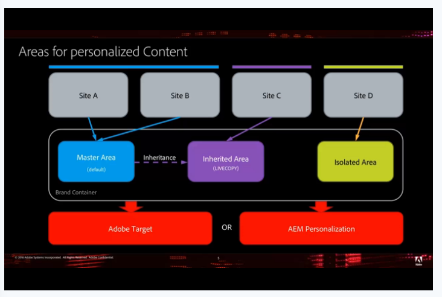

>[!NOTE]
>
>Voor een meer technische blik bij deze eigenschap, zie [&#x200B; hoe Multisite Beheer voor Gerichte Inhoud wordt gestructureerd &#x200B;](/help/sites-authoring/technical-multisite-targeted.md).

## Voorbeeld: Inhoud als doel instellen op basis van geografie {#example-targeting-content-based-on-geography}

Door multisite te gebruiken voor doelinhoud kunt u persoonlijke inhoud delen, implementeren of isoleren. Om beter te illustreren hoe deze eigenschap wordt gebruikt, overweeg een scenario waar u wilt controleren hoe de gerichte inhoud uit gebaseerd op geografie zoals in het volgende scenario wordt opgesteld:

Er zijn vier versies van dezelfde site op basis van geografie:

* De **Verenigde Staten** plaats is in de hogere linkerhoek en is de hoofdplaats. In dit voorbeeld is deze geopend in de modus Doel.
* De drie andere versies van deze plaats zijn **Canada**, **Groot-Brittannië**, en **Australië**, die allen levende exemplaren zijn. Deze sites zijn geopend in de modus Voorbeeld.

Elke site deelt gepersonaliseerde inhoud in geografische regio&#39;s:

* Canada deelt het hoofdgebied met de Verenigde Staten.
* De grote Brit is verbonden met de Europese ruimte en erft van het hoofdgebied.
* Australië heeft zijn eigen gepersonaliseerde inhoud, omdat het zich op het zuidelijk halfrond bevindt en seizoensgebonden producten niet van toepassing zouden zijn.

Voor het noordelijk halfrond hebben we een winteractiviteit gecreëerd, maar in het mannelijke publiek zou de marktmaker in Noord-Amerika een ander beeld voor de winter willen, dus hij of zij verandert het op de Amerikaanse site.

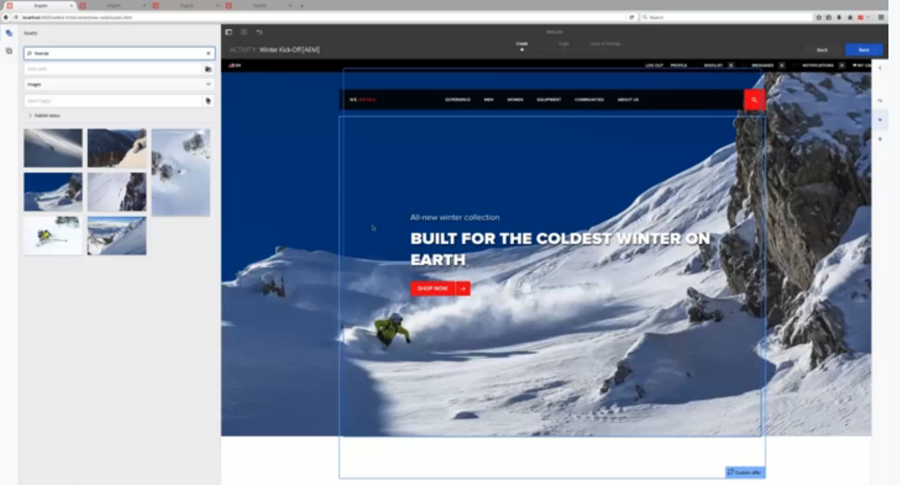

Nadat u het tabblad hebt vernieuwd, wordt de Canadese site gewijzigd in de nieuwe afbeelding zonder actie van onze kant. Dat gebeurt omdat het de hoofdzone deelt met de Verenigde Staten. In de sites van Groot-Brittannië en Australië verandert het beeld niet.

De teller zou deze veranderingen in het Europese gebied willen uitrollen en [&#x200B; rolt uit het levende exemplaar &#x200B;](/help/sites-administering/msm-livecopy.md) door **Pagina van de Uitvoer** te tikken of te klikken. Na het verfrissen van de tab heeft de site van Groot-Brittannië de nieuwe afbeelding, aangezien het Europa-gebied overerft van het hoofdgebied (na rollout).

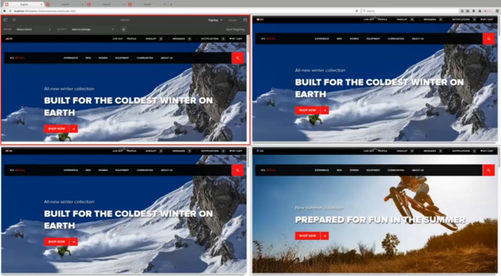

De afbeelding op de Australische site blijft ongewijzigd, wat het gewenste gedrag is, omdat het in de zomer in Australië is en de markeerteken die inhoud niet wil wijzigen. De site van Australië verandert niet omdat het een gebied niet deelt met een andere regio en het ook geen live kopie van een andere regio is. De marketeter hoeft zich nooit zorgen te maken dat de doelinhoud van de Australische site wordt overschreven.

Bovendien kunt u voor Groot-Brittannië, dat een live kopie van het hoofdgebied is, de overervingsstatus zien door de groene indicator naast de naam van de activiteit. Als een activiteit wordt geërft, kunt u het niet wijzigen tenzij u onderbreekt of de levende kopie loskoppelt.

U kunt de overerving op elk gewenst moment opschorten of de overerving volledig loskoppelen. U kunt ook altijd lokale ervaringen toevoegen die alleen beschikbaar zijn voor die ervaring zonder de overerving op te schorten.

>[!NOTE]
>
>Voor een meer technische blik bij deze eigenschap, zie [&#x200B; hoe Multisite Beheer voor Gerichte Inhoud wordt gestructureerd &#x200B;](/help/sites-authoring/technical-multisite-targeted.md).

### Een gebied maken in plaats van een gebied te maken als livecopie {#creating-a-new-area-versus-creating-a-new-area-as-livecopy}

In AEM hebt u de mogelijkheid om een gebied te maken of een gebied te maken als een gebied met een bibliotheek. Het creëren van een gebiedsgroepen activiteiten en om het even wat die tot die activiteiten behoren, zoals aanbiedingen, ervaringen, etc. U maakt een gebied wanneer u een volledig aparte set doelinhoud wilt maken of wanneer u een set doelinhoud wilt delen.

Als, echter, u erfenisopstelling via MSM tussen de twee plaatsen hebt, dan kunt u de activiteiten willen erven. In dit geval maakt u een gebied als een live kopie, waarbij Y een live kopie van X is en dus ook alle activiteiten overneemt.

>[!NOTE]
>
>De standaarduitrol activeert volgende uitrollouts van de doelinhoud wanneer een pagina een actieve kopie is die aan een gebied wordt gekoppeld dat zelf een actieve kopie is van het gebied dat aan de paginablauwdruk is gekoppeld.

In het volgende diagram zijn er bijvoorbeeld vier sites waar twee het hoofdgebied delen (en alle activiteiten die deel uitmaken van dat gebied), één site die een gebied heeft dat een live kopie van een gebied is, zodat het de activiteiten deelt bij rollout, en één kant die volledig gescheiden is (en dus een gebied voor zijn activiteiten vereist).

Om dit in AEM te bereiken, zou u het volgende doen:

* Site A is gekoppeld aan het hoofdgebied - er hoeft geen gebied te worden gemaakt. Stramiengebied is standaard in AEM geselecteerd. Site A en B delen activiteiten, enzovoort.
* Site B is gekoppeld aan het hoofdgebied - er hoeft geen gebied te worden gemaakt. Stramiengebied is standaard in AEM geselecteerd. Site A en B delen activiteiten, enzovoort.
* Site C koppelt aan Overgenomen gebied. Dit is een live kopie van het hoofdgebied - Gebied maken als actieve kopie waar u een live kopie maakt op basis van het hoofdgebied. Het overerfde Gebied erft activiteiten van het Hoofdgebied bij rollout.
* Site D maakt koppelingen naar een eigen geïsoleerd gebied - Maak een gebied waar u een geheel nieuw gebied maakt zonder activiteiten die nog niet zijn gedefinieerd. Het geïsoleerde gebied zal geen activiteiten met een andere plaats delen.

## Nieuwe gebieden maken {#creating-new-areas}

Gebieden kunnen activiteiten en aanbiedingen omvatten. Nadat u een gebied in één van beide (bijvoorbeeld, activiteiten) hebt gecreeerd, hebt u ook het gebied beschikbaar in andere (bijvoorbeeld, aanbiedingen).

>[!NOTE]
>
>Het standaardgebied genoemd Hoofdgebied wordt doen ineenstorten door gebrek wanneer u op de naam van een merk **klikt tot** u een ander gebied creeert. Wanneer u vervolgens een merk selecteert in de console **Activiteit** of **Aanbiedingen**, ziet u de console **Gebied**.

Een gebied maken:

1. Ga naar **Personalisatie** > **Activiteiten** of **Aanbiedingen** en ga vervolgens naar uw merk.
1. Klik **creeer Gebied**.

   

1. Klik het **pictogram van het Gebied** en klik **daarna**.
1. Op het **gebied van de Titel**, ga een naam voor het nieuwe gebied in. Selecteer optioneel tags.
1. Klik **creëren**.

   AEM wordt omgeleid naar het merkvenster, waar de gemaakte gebieden worden vermeld. Als er een ander gebied buiten het hoofdgebied is, kunt u gebieden rechtstreeks in de merkenconsole maken.

   

## Gebieden maken als actieve kopieën {#creating-areas-as-live-copies}

U maakt een gebied als een live kopie om de doelinhoud over te nemen in de sitestructuren.

Een gebied maken als een livecopy:

1. Ga naar **Personalisatie** > **Activiteiten** of **Aanbiedingen** en ga vervolgens naar uw merk.
1. Klik **creeer Gebied als Levend Exemplaar**.

   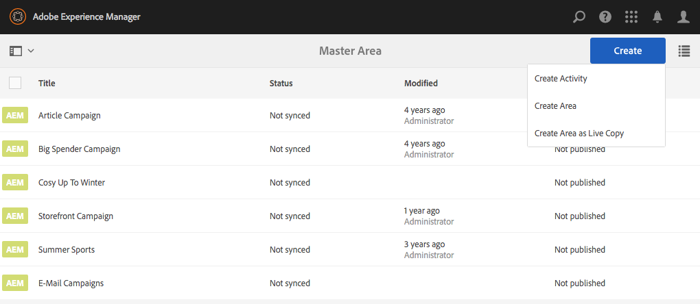

1. Selecteer het gebied dat u een levend exemplaar van wilt maken en **daarna** klikken.

   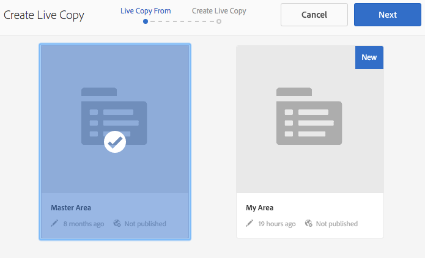

1. Voer in het veld **Naam** een naam in voor de livekopie. Standaard worden subpagina&#39;s opgenomen. Sluit ze uit door het selectievakje **Subpagina&#39;s uitsluiten** in te schakelen.

   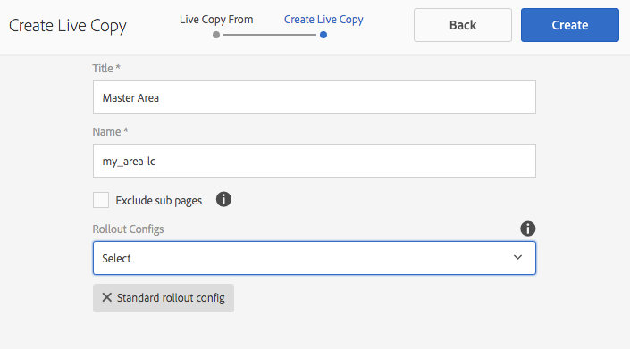

1. In **Rollout vormt** drop-down menu, selecteer de aangewezen configuratie.

   Zie [&#x200B; Geïnstalleerde Configuraties van de Uitvoer &#x200B;](/help/sites-administering/msm-sync.md#installed-rollout-configurations) voor beschrijvingen van elke optie.

   Zie [&#x200B; Creërend en Synchroniserend Levende Kopieën &#x200B;](/help/sites-administering/msm-livecopy.md) voor meer informatie over levende exemplaren.

   >[!NOTE]
   >
   >Wanneer een pagina uit aan Levend Exemplaar wordt opgerold en het gebied dat voor de pagina van de Vervaging wordt gevormd is ook de Vervaging voor het gebied dat voor het Levende Exemplaar van Pagina&#39;s wordt gevormd, **personalizationContentRollout** brengt een synchrone subRollout teweeg, die deel van **Standaard rollout config** uitmaakt.

1. Klik **creëren**.

   AEM wordt omgeleid naar het merkvenster, waar de gemaakte gebieden worden vermeld. Als er een ander gebied buiten het hoofdgebied is, kunt u gebieden rechtstreeks vanuit het merkvenster maken.

   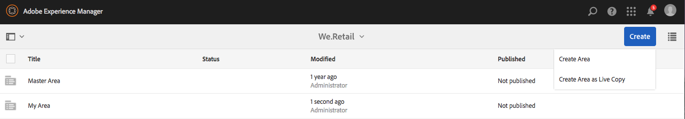

## Sites koppelen aan een gebied {#linking-sites-to-an-area}

U kunt gebieden koppelen aan pagina&#39;s of aan een site. Gebieden worden door alle subpagina&#39;s overgeërfd, tenzij deze pagina&#39;s door een toewijzing op een subpagina worden overschreven. Over het algemeen geldt echter dat u een koppeling tot stand brengt op het niveau van de site.

Als u een koppeling maakt, zijn alleen die activiteiten, ervaringen en aanbiedingen uit het geselecteerde gebied beschikbaar. Hiermee voorkomt u dat inhoud die onafhankelijk wordt beheerd, per ongeluk wordt gemengd. Als geen ander gebied wordt gevormd, wordt het hoofdgebied van elk merk gebruikt.

>[!NOTE]
>
>De pagina&#39;s of de plaatsen die van verwijzingen voorzien het zelfde gebied gebruiken *zelfde* gedeelde reeks activiteiten, ervaringen, en aanbiedingen. Het bewerken van een activiteit, ervaring of aanbieding die door meerdere sites wordt gedeeld, heeft invloed op alle sites.

Een site koppelen aan een gebied:

1. Navigeer naar de site (of pagina) die u wilt koppelen aan een gebied.
1. Selecteer de plaats of de pagina en klik **Eigenschappen van de Mening**.
1. Klik het **Personalization** lusje.
1. In het **Merk** menu, selecteer het merk u uw gebied aan wilt verbinden. Nadat u het merk selecteert, zijn de beschikbare gebieden beschikbaar in het **menu van de Verwijzing van het Gebied**.

   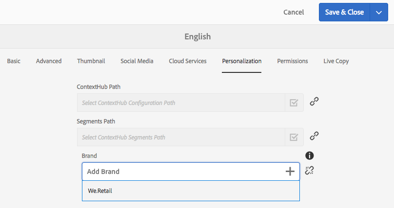

1. Selecteer het gebied van de **drop-down menu van de Verwijzing van het 0&rbrace; Gebied en klik** sparen **.**

   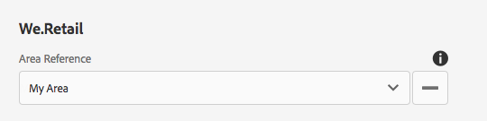

## Live kopie losmaken of overerving van doelinhoud opschorten {#detaching-live-copy-or-suspending-inheritance-of-targeted-content}

Mogelijk wilt u de overerving van de doelinhoud opschorten of loskoppelen. Het onderbreken of losmaken van de live kopie gebeurt per activiteit. Bijvoorbeeld, kunt u ervaringen in uw activiteit willen wijzigen, maar als die activiteit nog aan geërfte exemplaar verbonden is, kunt u niet de ervaring of om het even welke eigenschappen van de activiteit wijzigen.

Als u de live kopie tijdelijk opheft, wordt de overerving tijdelijk verbroken, maar in de toekomst kunt u de overerving herstellen. Als u de live kopie loskoppelt, wordt de overerving permanent verbroken.

U kunt de overerving van de doelinhoud onderbreken of loskoppelen door deze in een activiteit te herstellen. Als een pagina of site een koppeling bevat naar een gebied dat een live kopie is, kunt u de overervingsstatus van een activiteit weergeven.

Een activiteit die overerft van een andere site wordt groen gemarkeerd naast de naam van de activiteit. Een onderbroken overerving wordt rood gemarkeerd en een lokaal gemaakte activiteit heeft geen pictogram.

>[!NOTE]
>
>* U kunt actieve kopieën in een activiteit alleen opschorten of loskoppelen.
>* U hoeft live kopieën niet op te schorten of los te koppelen om een overgeërfde activiteit uit te breiden. U kunt **nieuwe** lokale ervaringen en aanbiedingen voor die activiteit altijd tot stand brengen. Als u een bestaande activiteit wilt wijzigen, dan moet u overerving opschorten.
>

### Opschorting van overerving {#suspending-inheritance}

Om erfenis van gerichte inhoud in een activiteit op te schorten of los te maken:

1. Navigeer aan de pagina waar u overerving wilt losmaken of opschorten en **gericht** op het wijze drop-down menu klikken.
1. Als de pagina is gekoppeld aan een gebied dat een live kopie is, ziet u de overervingsstatus. Klik **Begin richtend**.
1. Voer een van de volgende handelingen uit om een activiteit op te schorten:

   1. Selecteer een element van de activiteit, zoals het publiek. AEM geeft automatisch een bevestigingsvenster voor Live kopie onderbreken weer. (U kunt livekopieën opschorten door tijdens het doelproces op een element te tikken of te klikken.)
   1. Selecteer **Uitstel Levende Exemplaar** van het drop-down menu in de toolbar op.

   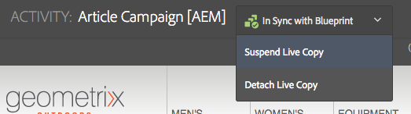

1. Klik **Onderbreking** om de activiteit op te schorten. Uitgestelde activiteiten worden rood gemarkeerd.

   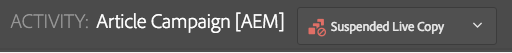

### Overerving breken {#breaking-inheritance}

Overerving van doelinhoud in een activiteit onderbreken:

1. Navigeer aan de pagina waar u het levende exemplaar van het hoofd wilt losmaken en **gericht** op het wijze drop-down menu klikken.
1. Als de pagina is gekoppeld aan een gebied dat een live kopie is, ziet u de overervingsstatus. Klik **Begin richtend**.
1. Selecteer **Livekopie loskoppelen** in het vervolgkeuzemenu op de werkbalk. AEM bevestigt dat u de livekopie wilt loskoppelen.
1. Klik **losmaken** om het levende exemplaar van de activiteit los te maken. Nadat deze is losgekoppeld, wordt het vervolgkeuzemenu met betrekking tot overerving niet meer weergegeven. De activiteit is nu een lokale activiteit.

   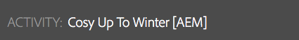

## Overerving van doelinhoud herstellen {#restoring-inheritance-of-targeted-content}

Als u de overerving van de doelinhoud van een activiteit hebt opgeschort, kunt u deze op elk gewenst moment herstellen. Als u de live kopie echter hebt losgekoppeld, kunt u de overerving niet herstellen.

Om erfenis van gerichte inhoud in een activiteit te herstellen:

1. Navigeer aan de pagina waar u overerving wilt herstellen en **gericht** op het wijze drop-down menu klikken.
1. Klik **Begin richtend**.
1. Selecteer **Livekopie hervatten** in het vervolgkeuzemenu op de werkbalk.

   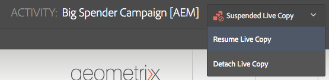

1. Klik **hervatten** om te bevestigen dat u levende exemplaarovererving wilt hervatten. Eventuele wijzigingen aan de huidige activiteit gaan verloren als u de overerving hervat.

## Gebieden verwijderen {#deleting-areas}

Wanneer u een gebied verwijdert, verwijdert u alle activiteiten in dat gebied. AEM waarschuwt u alvorens u een gebied kunt schrappen. Als u een gebied verwijdert waaraan een site is gekoppeld, wordt de toewijzing voor dit merk automatisch opnieuw toegewezen aan het hoofdgebied.

Een gebied verwijderen:

1. Navigeer aan **Personalization** > **Activiteiten** of **Aanbiedingen** en toen uw merk.
1. Klik op het pictogram naast het gebied dat u wilt verwijderen.
1. Klik **Schrapping** en bevestig dat u het gebied wilt schrappen.
