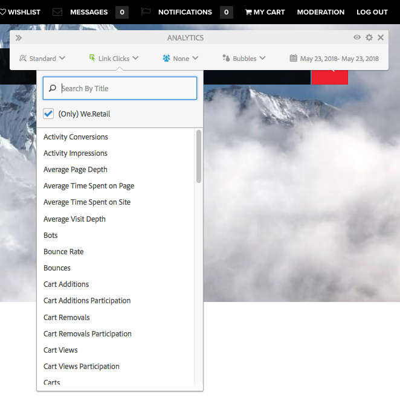
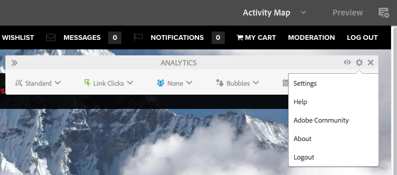

# Gegevens van paginaanalyse bekijken{#seeing-page-analytics-data}

Gebruik pagina-analysegegevens om de doeltreffendheid van de pagina-inhoud te meten.

## Analyse zichtbaar vanuit de console {#analytics-visible-from-the-console}

De analysegegevens van de pagina worden getoond in [ Mening van de Lijst ](/help/sites-authoring/basic-handling.md#list-view) van de console van Plaatsen. Wanneer de pagina&#39;s in lijstformaat worden getoond, zijn de volgende kolommen beschikbaar door gebrek:

* Paginaweergaven
* Unieke bezoekers
* Tijd op pagina

In elke kolom wordt een waarde voor de lopende rapportageperiode weergegeven en wordt ook aangegeven of de waarde sinds de vorige rapportageperiode is gestegen of gedaald. De gegevens die u ziet, worden elke 12 uur bijgewerkt.

>[!NOTE]
>
>Om de updateperiode te veranderen, [ vorm het de invoerinterval ](/help/sites-administering/adobeanalytics-connect.md#configuring-the-import-interval).

1. Open de **console van Plaatsen**; bijvoorbeeld, [ http://localhost :4502 /sites.html/content ](http://localhost:4502/sites.html/content)
1. In het uiterste recht van de toolbar (hoger-juiste hoek), klik het pictogram om **Mening van de Lijst** te selecteren (het getoonde pictogram zal van de [ huidige mening ](/help/sites-authoring/basic-handling.md#viewing-and-selecting-resources) afhangen).

1. Opnieuw, in het uiterste recht van de toolbar (hoger-juiste hoek), klik het pictogram dan selecteren **Montages van de Mening**. Het **vormt de dialoog van Kolommen** opent. Breng om het even welke vereiste veranderingen aan en bevestig met **Update**.

   

### De rapportageperiode selecteren {#selecting-the-reporting-period}

Selecteer de rapportperiode waarvoor de gegevens van Analytics op de console van Plaatsen verschijnen:

* Gegevens laatste 30 dagen
* Gegevens van afgelopen 90 dagen
* Gegevens van dit jaar

De huidige rapportageperiode wordt weergegeven op de werkbalk van de Sites-console (rechts van de bovenste werkbalk). Gebruik de vervolgkeuzelijst om de vereiste rapportageperiode te selecteren.

### Beschikbare gegevenskolommen configureren {#configuring-available-data-columns}

Leden van de analytische-beheerders gebruikersgroep kunnen de console van Plaatsen vormen om auteurs toe te laten om extra kolommen van Analytics te zien.

>[!NOTE]
>
>Wanneer een boomstructuur met pagina&#39;s onderliggende elementen bevat die zijn gekoppeld aan verschillende Adobe Analytics-wolkenconfiguraties, kunt u de beschikbare gegevenskolommen voor de pagina&#39;s niet configureren.

1. In de Mening van de Lijst, gebruik de meningsselecteurs (recht van toolbar), de uitgezochte **Montages van de Mening** en dan **voegt de Gegevens van de Analyse van de Douane** toe.

   

1. Selecteer de metriek die u aan auteurs in de console van Plaatsen wilt blootstellen, en dan **toevoegen** klikken.

   De kolommen die worden weergegeven, worden opgehaald uit Adobe Analytics.

   

### Inhoudsgegevens van sites openen {#opening-content-insights-from-sites}

Open [ Inhoud Insight ](/help/sites-authoring/content-insights.md) van de console van Plaatsen om paginadoeltreffendheid verder te onderzoeken.

1. Selecteer in de Sites-console de pagina waarvoor u Inhoudsgegevens wilt weergeven.
1. Klik op het pictogram Analytics and Recommendations (Analytics en Aanbevelingen) op de werkbalk.

   

## Analyses zichtbaar in de Pagina-editor (Activity Map) {#analytics-visible-from-the-page-editor-activity-map}

>[!NOTE]
>
>Dit wordt getoond als [ Activity Map ](/help/sites-administering/adobeanalytics-connect.md#configuring-for-the-activity-map) voor uw website is gevormd.

>[!NOTE]
>
>Gegevens voor de Activity Map zijn afkomstig uit Adobe Analytics.

Wanneer uw website [ voor Adobe Analytics ](/help/sites-administering/adobeanalytics-connect.md) is gevormd, kunt u de [ wijze Activity Map ](/help/sites-authoring/author-environment-tools.md#page-modes) gebruiken om relevante gegevens te bekijken. Bijvoorbeeld:

### Toegang tot de Activity Map {#accessing-the-activity-map}

Na het selecteren van de [ Activity Map ](/help/sites-authoring/author-environment-tools.md#page-modes) wijze, zult u worden gevraagd om uw geloofsbrieven van Adobe Analytics in te gaan.

De **Analytics** drijvende toolbar wordt getoond; hier kunt u:

* verander het toolbarformaat gebruikend de dubbele pijlen (**>>**)
* Paginadetails in-/uitschakelen (oogpictogram)
* Activity Map-instellingen configureren (cogingpictogram)
* Selecteer de analysefunctie die u wilt weergeven (verschillende keuzelijsten)
* Sluit de Activity Map en sluit de werkbalk (x)

### De weer te geven analyse selecteren {#selecting-the-analytics-to-show}

U kunt aan de hand van de verschillende criteria bepalen welke analysegegevens moeten worden weergegeven en hoe deze moeten worden weergegeven:

* **Norm**/**Levend**

* gebeurtenistype
* gebruikersgroep
* **Bubbles**/**Verloop**/**Gainers &amp; Gebruikers**/**weg**

* te tonen periode

### De Activity Map configureren {#configuring-the-activity-map}

Gebruik het **pictogram van Montages** tonen om de **de Montages van Activity Map** dialoog te openen.

Het **de Montages van Activity Map** dialoog verstrekt een waaier van opties op drie lusjes:

* Algemeen

   * Rapportsuite
   * Paginanaam
   * Taal
   * Labelbedekkingen met
   * Tekengrootte label
   * Verloopkleur
   * Bubbelkleur
   * Kleurverloop op basis van
   * Transparantie verloop

* Standaard

   * Weergeven (type en aantal koppelingen)
   * Bedekkingen verbergen voor koppelingen die geen treffers hebben ontvangen

* Live

   * Bovenkant weergeven (Gainers of Losers)
   * Onderkant % uitsluiten
   * Automatisch bijwerken (gegevens en periode)
