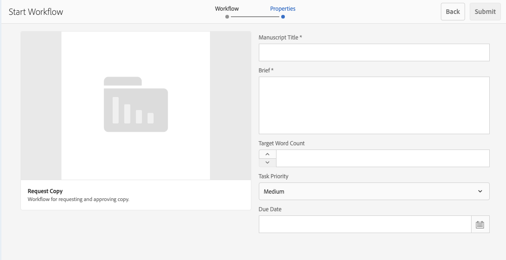

# Werken met projectworkflows {#working-with-project-workflows}

De projectworkflows die beschikbaar zijn uit het vak zijn onder andere:

* **Workflow voor projectgoedkeuring** - Met deze workflow kunt u inhoud toewijzen aan een gebruiker, controleren en vervolgens goedkeuren.
* **Verzoek starten** - Een workflow waarvoor de toepassing wordt gestart.
* **Openingspagina aanvragen** - Voor deze workflow is een bestemmingspagina vereist.
* **E-mail aanvragen** - Workflow voor het aanvragen van een e-mail.
* **Fotofoto&#39;s en foto&#39;s van producten maken (handel)** - Elementen toewijzen aan producten
* **DAM maken en vertalen kopie en DAM maken taalkopie** - Hiermee maakt u vertaalde binaire bestanden, metagegevens en tags voor elementen en mappen.

Afhankelijk van het projectsjabloon dat u selecteert, zijn bepaalde workflows beschikbaar:

|   | **Eenvoudig project** | **Mediaproject** | **Fotoproject van product** | **Omzettingsproject** |
|---|:-:|:-:|:-:|:-:|
| Verzoek om kopie |  | x |  |  |
| Fotofoto van product |  | x | x |  |
| Fotofoto van product (handel) |  |  | x |  |
| Projectgoedkeuring | x |  |  |  |
| Verzoek starten | x |  |  |  |
| Openingspagina aanvragen | x |  |  |  |
| E-mail aanvragen | x |  |  |  |
| DAM Create Language Copy&amp;ast; |  |  |  | x |
| DAM &amp;Create and Translate Language Copy |  |  |  | x |

>[!NOTE]
>
>&amp;Laatste; deze workflows worden niet gestart vanuit de **Workflow** tegel in projecten. Zie [Taalkopieën voor middelen maken.](/help/sites-administering/tc-manage.md)

De stappen voor het starten en voltooien van workflows zijn hetzelfde, ongeacht de workflow die u kiest. Alleen de stappen worden gewijzigd.

U start een workflow rechtstreeks in Projecten (behalve voor DAM Create Language Copy of DAM Create and Translate Language Copy). Informatie over openstaande taken in een project wordt vermeld in de **Taken** tegel. Meldingen voor taken die moeten worden voltooid, verschijnen naast het gebruikerspictogram.

Raadpleeg de volgende documenten voor meer informatie over het werken met workflows in AEM:

* [Deelnemen aan workflows](/help/sites-authoring/workflows-participating.md)
* [Workflows toepassen op pagina&#39;s](/help/sites-authoring/workflows-applying.md)
* [Workflows configureren](/help/sites-administering/workflows.md)

Deze sectie beschrijft de werkschema&#39;s beschikbaar voor Projecten.

## Workflow aanvragen voor kopiëren {#request-copy-workflow}

Met deze workflow kunt u een gebruiker om een manuscript vragen en het vervolgens goedkeuren. De workflow voor het kopiëren van aanvragen starten:

1. Klik in een mediaproject op het neerwaartse chevron rechtsboven in het dialoogvenster **Workflows** tegel en selecteer **Workflow starten**.
1. Selecteer in de wizard Workflow de optie **Verzoek om kopie** en klik op **Volgende**.
1. Voer een eigenschapstitel in en een korte samenvatting van wat u vraagt. Voer, indien van toepassing, een doelwoordtelling, taakprioriteit en een vervaldatum in.

   

1. Klikken **Verzenden**.

De workflow wordt gestart. De taak wordt weergegeven op het tabblad **Taken** kaart.

## Workflow voor foto&#39;s van producten {#product-photo-shoot-workflow}

De **Fotofoto van product** werkstromen ( zowel handel als handel ) worden in het document uitvoerig behandeld . [Creatieve projecten](/help/sites-authoring/managing-product-information.md)

## Workflow voor projectgoedkeuring {#project-approval-workflow}

In de **Projectgoedkeuring** kunt u inhoud toewijzen aan een gebruiker, de inhoud controleren en vervolgens goedkeuren.

1. In een eenvoudig project klikt u op het neerwaartse chevron rechtsboven in het dialoogvenster **Workflows** tegel en selecteer **Workflow starten**.
1. Selecteer in de wizard Workflow de optie **Workflow voor projectgoedkeuring** en klik op **Volgende**.
1. Voer een titel in en selecteer aan wie de titel moet worden toegewezen. Voer, indien van toepassing, een beschrijving, een inhoudspad, een taakprioriteit en een vervaldatum in.

   

1. Klikken **Verzenden**.

De workflow wordt gestart. De taak wordt weergegeven op het tabblad **Taken** kaart.

## Workflow voor starten aanvragen {#request-launch-workflow}

Met deze workflow kunt u een verzoek indienen om de toepassing te starten.

1. In een eenvoudig project klikt u op het neerwaartse chevron rechtsboven in het dialoogvenster **Workflows** tegel en selecteer **Workflow starten**.
1. Selecteer in de wizard Workflow de optie **Workflow voor starten aanvragen** en klik op **Volgende**.
1. Voer een titel in voor de opstart en geef het bronpad op. U kunt ook een beschrijving en live datum toevoegen, indien van toepassing. Selecteer Live-gegevens van bronpagina overnemen of subpagina&#39;s uitsluiten, afhankelijk van de manier waarop u de opstart wilt laten uitvoeren.

   

1. Klikken **Verzenden**.

De workflow wordt gestart. De workflow wordt weergegeven in het dialoogvenster **Workflows** lijst.

## Workflow voor openingspagina aanvragen {#request-landing-page-workflow}

Met deze workflow kunt u een bestemmingspagina aanvragen.

1. In een eenvoudig project klikt u op het neerwaartse chevron rechtsboven in het dialoogvenster **Workflows** tegel en selecteer **Workflow starten**.
1. Selecteer in de wizard Workflow de optie **Openingspagina aanvragen** en klik op **Volgende**.
1. Voer een titel in voor de openingspagina en het bovenliggende pad. Voer, indien van toepassing, een live datum in of kies een bestand voor de bestemmingspagina.

   

1. Klikken **Verzenden**.

De workflow wordt gestart. De taak wordt weergegeven op het tabblad **Taken** kaart.

## E-mailworkflow aanvragen {#request-email-workflow}

Met deze workflow kunt u een e-mail aanvragen. Het is dezelfde workflow die wordt weergegeven in **E-mails** tegel.

1. In een eenvoudig project klikt u op het neerwaartse chevron rechtsboven in het dialoogvenster **Workflows** tegel en selecteer **Workflow starten**.
1. Selecteer in de wizard Workflow de optie **E-mail aanvragen** en klik op **Volgende**.
1. Voer een e-mailtitel en de campagne- en sjabloonpaden in. Daarnaast kunt u een naam, beschrijving en actieve datum opgeven.

   

1. Klikken **Verzenden**.

De workflow wordt gestart. De taak wordt weergegeven op het tabblad **Taken** kaart.

## Workflow voor taalkopieën maken (en vertalen) voor middelen {#create-and-translate-language-copy-workflow-for-assets}

De **Taalkopie maken** en de **Taalkopie maken en vertalen** workflows worden in het document gedetailleerd behandeld [Taalkopieën voor middelen maken.](/help/assets/translation-projects.md)
