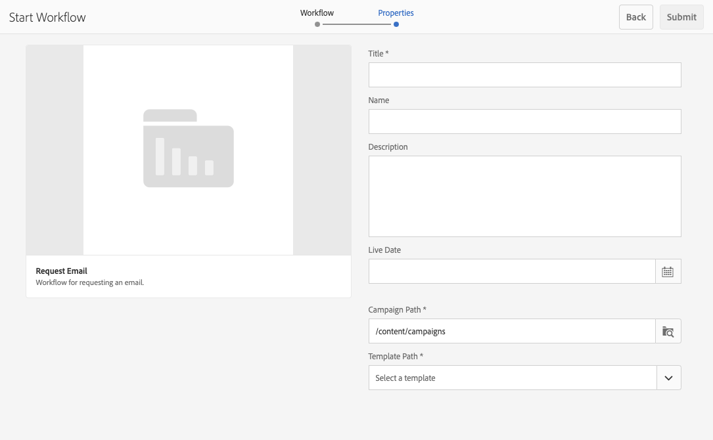

# Werken met projectworkflows {#working-with-project-workflows}

De projectworkflows die beschikbaar zijn uit het vak zijn onder andere:

* **Werkschema van de Goedkeuring van het Project** - Dit werkschema laat u inhoud aan een gebruiker toewijzen, herzien, dan goedkeuren.
* **de Lancering van het Verzoek** - een werkschema de verzoeken om een lancering.
* **Verzoek het Landen Pagina** - Dit werkschema vraagt een het landen pagina.
* **Verzoek E-mail** - Werkschema voor het verzoeken van een e-mail.
* **van de Foto van het 0} Product foto en van de Foto van het Product Opname (Commerce)** - Kaarten activa met producten
* **DAM leidt tot en vertaalt exemplaar en DAM leidt het Exemplaar van de Taal** - creeert vertaalde binaire getallen, meta-gegevens, en markeringen voor activa en omslagen.

Afhankelijk van het projectsjabloon dat u selecteert, zijn bepaalde workflows beschikbaar:

|   | **Eenvoudig Project** | **Project van Media** | **Project van de Opname van de Foto van het Product** | **Vertaal Project** |
|---|:-:|:-:|:-:|:-:|
| Verzoek om kopie |  | x |  |  |
| Fotofoto van product |  | x | x |  |
| Fotofoto van product (Commerce) |  |  | x |  |
| Projectgoedkeuring | x |  |  |  |
| Verzoek starten | x |  |  |  |
| Openingspagina aanvragen | x |  |  |  |
| E-mail aanvragen | x |  |  |  |
| DAM Create Language Copy&amp;ast; |  |  |  | x |
| DAM &amp;Create and Translate Language Copy;ast; |  |  |  | x |

>[!NOTE]
>
>&amp;ast; Deze werkschema&#39;s zijn niet begonnen van de **tegel van het Werkschema** in Projecten. Zie [ Creërend de Kopieën van de Taal voor Assets.](/help/sites-administering/tc-manage.md)

De stappen voor het starten en voltooien van workflows zijn hetzelfde, ongeacht de workflow die u kiest. Alleen de stappen worden gewijzigd.

U start een workflow rechtstreeks in Projecten (behalve voor DAM Create Language Copy of DAM Create and Translate Language Copy). De informatie over om het even welke opmerkelijke taken in een project is vermeld in de **Tile van Taken**. Meldingen voor taken die moeten worden voltooid, verschijnen naast het gebruikerspictogram.

Raadpleeg de volgende documenten voor meer informatie over het werken met workflows in AEM:

* [Deelnemen aan workflows](/help/sites-authoring/workflows-participating.md)
* [Workflows toepassen op pagina&#39;s](/help/sites-authoring/workflows-applying.md)
* [Workflows configureren](/help/sites-administering/workflows.md)

Deze sectie beschrijft de werkschema&#39;s beschikbaar voor Projecten.

## Workflow aanvragen voor kopiëren {#request-copy-workflow}

Met deze workflow kunt u een gebruiker om een manuscript vragen en het vervolgens goedkeuren. De workflow voor het kopiëren van aanvragen starten:

1. In een media project, klik de neerwaartse chevron bij het hoogste recht van de **tegel van de Werkschema&#39;s** en selecteer **Werkschema van het Begin**.
1. In de tovenaar van het werkschema selecteert **het Exemplaar van het Verzoek** en klikt **daarna**.
1. Voer een eigenschapstitel in en een korte samenvatting van wat u vraagt. Voer, indien van toepassing, een doelwoordtelling, taakprioriteit en een vervaldatum in.

   

1. Klik **voorleggen**.

De workflow wordt gestart. De taak verschijnt op de **kaart van Taken**.

## Workflow voor foto&#39;s van producten {#product-photo-shoot-workflow}

De **werkschema&#39;s van de Foto van het Product** (zowel handel als zonder handel) worden behandeld in detail in het document [ Creative Projecten ](/help/sites-authoring/managing-product-information.md)

## Workflow voor projectgoedkeuring {#project-approval-workflow}

In het **werkschema van de Goedkeuring van het Project**, wijst u inhoud aan een gebruiker toe, herziet, en keurt dan de inhoud goed.

1. In een eenvoudig project, klik de neerwaartse chevron bij het hoogste recht van de **tegel van de Werkschema&#39;s** en selecteer **Werkschema van het Begin**.
1. In de tovenaar van het werkschema selecteert **de Goedkeuring van het 0} Project en klikt** daarna **.**
1. Voer een titel in en selecteer aan wie de titel moet worden toegewezen. Voer, indien van toepassing, een beschrijving, een inhoudspad, een taakprioriteit en een vervaldatum in.

   

1. Klik **voorleggen**.

De workflow wordt gestart. De taak verschijnt op de **kaart van Taken**.

## Workflow voor starten aanvragen {#request-launch-workflow}

Met deze workflow kunt u een verzoek indienen om de toepassing te starten.

1. In een eenvoudig project, klik de neerwaartse chevron bij het hoogste recht van de **tegel van de Werkschema&#39;s** en selecteer **Werkschema van het Begin**.
1. In de tovenaar van het werkschema selecteert **het Werkschema van de Lancering van het Verzoek** en klikt **daarna**.
1. Voer een titel in voor de opstart en geef het bronpad op. U kunt ook een beschrijving en live datum toevoegen, indien van toepassing. Selecteer Live-gegevens van bronpagina overnemen of subpagina&#39;s uitsluiten, afhankelijk van de manier waarop u de opstart wilt laten uitvoeren.

   

1. Klik **voorleggen**.

De workflow wordt gestart. Het werkschema verschijnt in de **lijst van Werkschema&#39;s**.

## Workflow voor openingspagina aanvragen {#request-landing-page-workflow}

Met deze workflow kunt u een bestemmingspagina aanvragen.

1. In een eenvoudig project, klik de neerwaartse chevron bij het hoogste recht van de **tegel van de Werkschema&#39;s** en selecteer **Werkschema van het Begin**.
1. In de tovenaar van het werkschema selecteert **Verzoek het Landen Pagina** en klikt **daarna**.
1. Voer een titel in voor de openingspagina en het bovenliggende pad. Voer, indien van toepassing, een live datum in of kies een bestand voor de bestemmingspagina.

   

1. Klik **voorleggen**.

De workflow wordt gestart. De taak verschijnt op de **kaart van Taken**.

## E-mailworkflow aanvragen {#request-email-workflow}

Met deze workflow kunt u een e-mail aanvragen. Het is het zelfde werkschema dat in de **Emails** tegel verschijnt.

1. In een eenvoudig project, klik de neerwaartse chevron bij het hoogste recht van de **tegel van de Werkschema&#39;s** en selecteer **Werkschema van het Begin**.
1. In de tovenaar van het werkschema selecteert **E-mail van het Verzoek** en klikt **daarna**.
1. Voer een e-mailtitel en de campagne- en sjabloonpaden in. Daarnaast kunt u een naam, beschrijving en actieve datum opgeven.

   

1. Klik **voorleggen**.

De workflow wordt gestart. De taak verschijnt op de **kaart van Taken**.

## Workflow voor taalkopieën maken (en vertalen) voor Assets {#create-and-translate-language-copy-workflow-for-assets}

**creeer het Exemplaar van de Taal** en **creeer en vertaalde werkschema&#39;s van het Exemplaar van de Taal** zijn behandeld in detail in het document [ Creërend de Exemplaren van de Taal voor Assets.](/help/assets/translation-projects.md)
