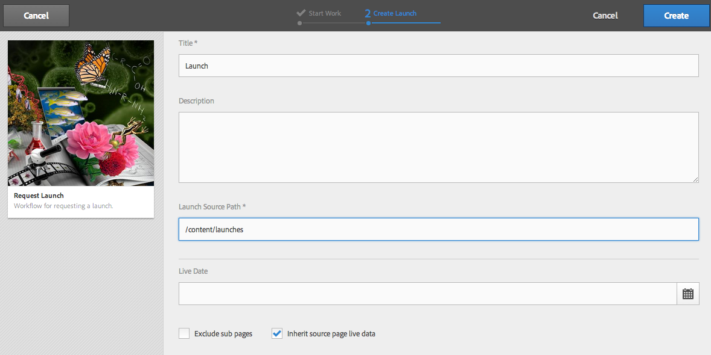
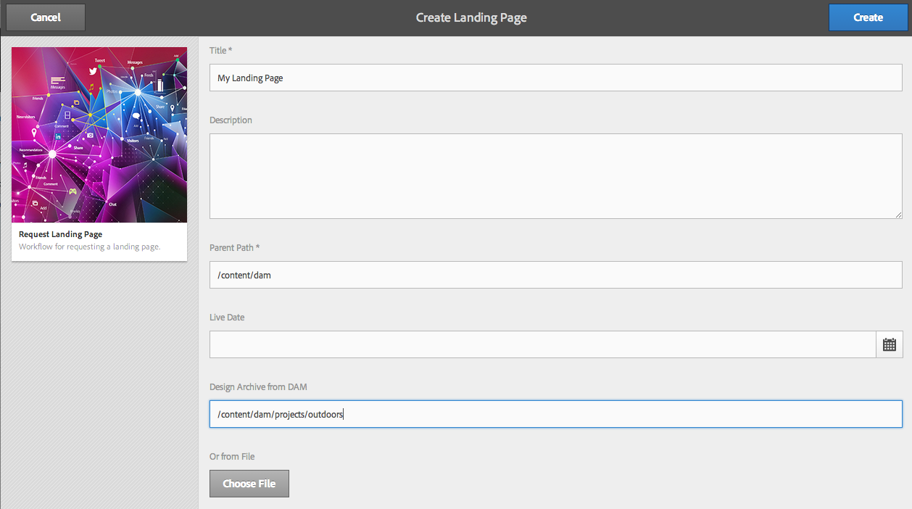

# Werken met projectworkflows{#working-with-project-workflows}

De projectworkflows die beschikbaar zijn uit het vak zijn onder andere:

* **Workflow**  voor projectgoedkeuring - Met deze workflow kunt u inhoud toewijzen aan een gebruiker, deze controleren en vervolgens goedkeuren.
* **Starten**  aanvragen - Een workflow waarin wordt gevraagd om opstart.
* **Openingspagina**  aanvragen - Deze workflow vraagt om een bestemmingspagina.
* **E-mail**  aanvragen - Workflow voor het aanvragen van een e-mail.
* **Fotofoto&#39;s van producten en foto&#39;s van producten maken (Handel)**  - wijst elementen met producten toe
* **Met DAM kunt u kopieën maken en vertalen en DAM Taalkopie**  maken. Hiermee maakt u vertaalde binaire bestanden, metagegevens en tags voor elementen en mappen.

Afhankelijk van het projectsjabloon dat u selecteert, zijn bepaalde workflows beschikbaar:

|  | **Eenvoudig project** | **Mediaproject** | **Fotoproject van product** | **Omzettingsproject** |
|---|:-:|:-:|:-:|:-:|
| Verzoek om kopie |  | x |  |  |
| Fotofoto van product |  | x | x |  |
| Fotofoto van product (handel) |  |  | x |  |
| Projectgoedkeuring | x |  |  |  |
| Verzoek starten | x |  |  |  |
| Openingspagina aanvragen | x |  |  |  |
| E-mail aanvragen | x |  |  |  |
| DAM Create Language Copy&amp;ast; |  |  |  | x |
| DAM &amp;Create and Translate Language Copy;ast; |  |  |  | x |

>[!NOTE]
>
>&amp;ast; Deze werkstromen zijn niet begonnen van **Workflow** tegel in Projecten. Zie [Taalkopieën maken voor elementen.](/help/sites-administering/tc-manage.md)

De stappen voor het starten en voltooien van workflows zijn hetzelfde, ongeacht de workflow die u kiest. Alleen de stappen worden gewijzigd.

U start een workflow rechtstreeks in Projecten (behalve voor DAM Create Language Copy of DAM Create and Translate Language Copy). De informatie over om het even welke opmerkelijke taken in een project zijn vermeld in **de tegel van Taken**. Meldingen voor taken die moeten worden voltooid, verschijnen naast het gebruikerspictogram.

Raadpleeg de volgende bronnen voor meer informatie over het werken met workflows in AEM:

* [Deelnemen aan workflows](/help/sites-authoring/workflows-participating.md)
* [Workflows toepassen op pagina&#39;s](/help/sites-authoring/workflows-applying.md)
* [Workflows configureren](/help/sites-administering/workflows.md)

Deze sectie beschrijft de werkschema&#39;s beschikbaar voor Projecten.

## Workflow voor kopiëren aanvragen {#request-copy-workflow}

Met deze workflow kunt u een gebruiker om een manuscript vragen en het vervolgens goedkeuren. De workflow voor het kopiëren van aanvragen starten:

1. Selecteer in uw Media-project het **+**-teken in de tegel **Workflows** en selecteer **Workflow voor kopiëren aanvragen**.
1. Voer een eigenschapstitel in en een korte samenvatting van wat u vraagt. Voer, indien van toepassing, een doelwoordtelling, taakprioriteit en een vervaldatum in.

   

1. Klik **Maken**. De workflow wordt gestart. De taak wordt weergegeven in de tegel **Taken**.

   

## Workflow {#product-photo-shoot-workflow} voor foto&#39;s van producten

De werkschema&#39;s van de Opname van de Foto van het Product (zowel handel als zonder handel) worden behandeld in detail in [Creatief Project](/help/sites-authoring/managing-product-information.md).

## Workflow voor projectgoedkeuring {#project-approval-workflow}

In het werkschema van de Goedkeuring van het Project, wijst u inhoud aan een gebruiker toe, herziet, en keurt dan de inhoud goed.

1. In uw Eenvoudig project, selecteer **`+`** teken in **Workflows** tegel en selecteer **Workflow van de Goedkeuring van het Project**.
1. Ga een titel in en selecteer aan wie om het van de lijst van het Team toe te wijzen. Voer, indien van toepassing, een beschrijving, een inhoudspad, een taakprioriteit en een vervaldatum in.

   

1. Klik **Maken**. De workflow wordt gestart. De taak wordt weergegeven in de tegel **Taken**.

   

## Verzoek om werkstroom starten {#request-launch-workflow}

Met deze workflow kunt u een verzoek indienen om de toepassing te starten.

1. Selecteer in uw Simple-project het **+**-teken in de tegel **Workflows** en selecteer **Workflow voor lancering aanvragen**.
1. Voer een titel in voor de opstart en geef het bronpad voor de opstart op. U kunt ook een beschrijving en live datum toevoegen, indien van toepassing. Selecteer Live-gegevens van bronpagina overnemen of subpagina&#39;s uitsluiten, afhankelijk van de manier waarop u de opstart wilt laten uitvoeren.

   

1. Klik **Maken**. De workflow wordt gestart. De workflow wordt weergegeven in de lijst **Workflows** (klik op ellipsen **..** op de **Workflows**-tegel voor toegang tot deze lijst).

## Workflow {#request-landing-page-workflow} aanvragen voor openingspagina

Met deze workflow kunt u een bestemmingspagina aanvragen.

1. Selecteer in uw Eenvoudig project het **+**-teken in de **Workflows**-tegel en selecteer Request Landing Page Workflow.
1. Voer een titel in voor de openingspagina en het bovenliggende pad. Voer, indien van toepassing, een live datum in of kies een bestand voor de bestemmingspagina.

   

1. Klik **Maken**. De workflow wordt gestart. De taak wordt weergegeven in de tegel **Taken**.

## E-mailworkflow aanvragen {#request-email-workflow}

Met deze workflow kunt u een e-mail aanvragen. Het is het zelfde werkschema dat in **Emails** tegel verschijnt.

1. Selecteer in uw Media of Eenvoudig project het **+**-teken in de **Workflows**-tegel en selecteer **E-mailworkflow aanvragen**.
1. Voer een e-mailtitel in, evenals de campagne- en sjabloonpaden. Daarnaast kunt u een naam, beschrijving en actieve datum opgeven.

   

1. Klik **Maken**. De workflow wordt gestart. De taak wordt weergegeven in de tegel **Taken**.

   

## Workflow voor het kopiëren van talen maken (en vertalen) voor elementen {#create-and-translate-language-copy-workflow-for-assets}

De werkstromen **Taalkopie maken** en **Taalkopie maken en vertalen** worden gedetailleerd beschreven in [Taalkopieën maken voor elementen.](/help/assets/translation-projects.md)
