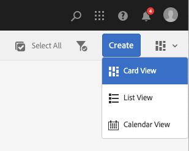
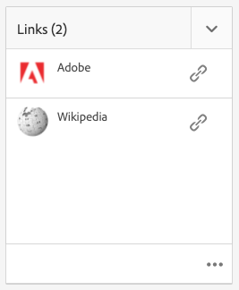
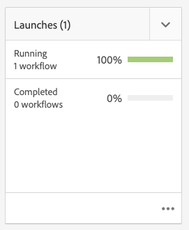

# Projecten {#projects}

Met projecten kunt u resources groeperen in één entiteit. Een gemeenschappelijke, gedeelde omgeving maakt het gemakkelijk om uw projecten te beheren. De soorten middelen u met een project kunt associëren worden bedoeld in AEM als Tegels. De tegels kunnen project en teaminformatie, activa, werkschema&#39;s, en andere soorten informatie omvatten, zoals die in detail wordt beschreven [Projectblokken.](#project-tiles)

Als gebruiker kunt u:

* Projecten maken en verwijderen
* Inhoud- en middelenmappen koppelen aan een project
* Inhoudskoppelingen uit project verwijderen

## Toegangsvereisten {#access-requirements}

Projecteert een standaard AEM en vereist geen extra opstelling.

Nochtans voor gebruikers in projecten om andere gebruikers/groepen te zien terwijl het gebruiken van Projecten zoals wanneer het creëren van projecten, het creëren van taken/werkschema&#39;s of het bekijken van en het leiden van het team, moeten die gebruikers lees toegang hebben op `/home/users` en `/home/groups`.

De eenvoudigste manier om dit te doen is de **projecten-gebruikers** groep lees toegang tot `/home/users` en `/home/groups`.

## Projectconsole {#projects-console}

De projectenconsole is waar u tot uw projecten binnen AEM toegang hebt en leidt.

De console van Projecten is gelijkaardig aan andere consoles in AEM, staat verscheidene acties op individuele projecten toe en past uw mening van de projecten aan.

### Modus schakelen {#modes}

U kunt de spoorselecteur gebruiken om tussen consolemodi te veranderen.

#### Alleen inhoud {#content-only}

Alleen inhoud is de standaardmodus bij het openen van de console. Het zal al uw projecten tonen.

#### Tijdlijn {#timeline}

In de tijdlijnweergave kunt u een afzonderlijk project selecteren en er activiteiten op weergeven. De spoorwegkiezer of de hotkey gebruiken `alt+1` om naar deze weergave te gaan.

### Weergave schakelen {#views}

U kunt de weergavekiezer gebruiken om projecten als grote tegels weer te geven (de standaardinstelling), om ze als een lijst of op een kalender weer te geven.

### De weergave filteren {#filter}

U kunt het filter gebruiken om tussen alle projecten en slechts die van een knevel te voorzien die actief zijn.

### Projecten selecteren en weergeven {#selecting}

Selecteer een project door de muis boven de projecttegel te plaatsen en op het vinkje te klikken.

U kunt de details van een project weergeven door erop te klikken en naar de details van het project te gaan.

### Nieuwe projecten maken {#creating}

Klikken **Maken** een nieuw project toevoegen.

## Projectblokken {#project-tiles}

Projecten bestaan uit verschillende soorten informatie die u samen wilt beheren. Deze informatie wordt door verschillende **Tegels**.

Aan uw project kunnen de volgende tegels zijn gekoppeld.

* [Assets](#assets)
* [Asset Collections](#asset-collections)
* [Ervaringen](#experiences)
* [Koppelingen](#links)
* [Projectinformatie](#project-info)
* [Team](#team)
* [Openingspagina&#39;s](#landing-pages)
* [E-mails](#emails)
* [Workflows](#workflows)
* [Lanceringen](#launches)
* [Taken](#tasks)

Klik op het vervolgkeuzemenu rechtsboven in een tegel om meer gegevens aan de tegel toe te voegen.

Klik op de ellipsknop rechtsonder in een tegel om de gegevens van de tegel te openen in de bijbehorende console.

### Assets {#assets}

In de **Activa** U kunt alle elementen verzamelen die u voor een bepaald project gebruikt.

U uploadt elementen rechtstreeks in de tegel.

### Asset Collections {#asset-collections}

Net als bij elementen kunt u [verzamelingen van middelen](/help/assets/manage-collections.md) rechtstreeks naar uw project. U definieert verzamelingen in elementen.

Voeg een verzameling toe door op **Verzameling toevoegen** te klikken en de juiste verzameling in de lijst te selecteren.

### Ervaringen {#experiences}

De **Ervaringen** Met de tegel kunt u een mobiele app, website of publicatie aan het project toevoegen.

De pictogrammen geven aan welke ervaring wordt weergegeven.

* Website
* Mobiele toepassing

### Koppelingen {#links}

De **Koppelingen** met de tegel kunt u externe koppelingen aan uw project koppelen.

U kunt de koppeling een naam geven die gemakkelijk herkenbaar is en de miniatuur wijzigen.

### Projectinfo {#project-info}

De **Projectinformatie** de tegel bevat algemene informatie over het project, zoals een beschrijving, de status van het project (inactief of actief), een vervaldatum en leden. Bovendien kunt u een projectduimnagel toevoegen, die op de belangrijkste pagina van Projecten wordt getoond.

### Vertaaltaak {#translation-job}

De **Vertaaltaak** Aan de tegel staat waar u een vertaling begint en waar u de status van uw vertalingen ziet.

Raadpleeg het document voor informatie over het instellen van de vertaling [Vertaalprojecten maken.](/help/assets/translation-projects.md)

### Team {#team}

In deze tegel, kunt u de leden van het projectteam specificeren. Wanneer het uitgeven, kunt u de naam van het teamlid ingaan en de gebruikersrol toewijzen.

U kunt teamleden toevoegen en verwijderen uit het team. Daarnaast kunt u de opdracht [gebruikersrol](#userroles) toegewezen aan het teamlid.

### Openingspagina&#39;s {#landing-pages}

De **Openingspagina&#39;s** Met de tegel kunt u een nieuwe bestemmingspagina aanvragen.

Deze workflow wordt beschreven in het document[Een workflow voor de openingspagina maken.](/help/sites-authoring/projects-with-workflows.md#request-landing-page-workflow)

### E-mails {#emails}

De **E-mails** De tegel helpt u verzoeken om e-mail te beheren. Het begint met **Verzoek om e-mail** workflow.

Meer informatie wordt beschreven in het dialoogvenster [E-mailworkflow aanvragen.](/help/sites-authoring/projects-with-workflows.md#request-email-workflow)

### Workflows {#workflows}

U kunt workflows voor uw project starten. Als er workflows actief zijn, wordt de status van deze workflows weergegeven in het dialoogvenster **Workflows** tegel.

Afhankelijk van welk project u creeert zijn er verschillende beschikbare werkschema&#39;s.

Deze worden beschreven in [Werken met projectworkflows.](/help/sites-authoring/projects-with-workflows.md)

### Lanceringen {#launches}

De **Starten** de tegel toont om het even welke lanceringen die met een [Verzoek indienen om workflow te starten.](/help/sites-authoring/projects-with-workflows.md)

### Taken {#tasks}

Met Taken kunt u de status van projectgerelateerde taken, waaronder workflows, controleren. Taken worden in detail besproken op [Werken met taken](/help/sites-authoring/task-content.md).

## Projectsjablonen {#project-templates}

Sjablonen dienen als basis voor het starten van uw project. AEM verstrekt deze standaardprojectmalplaatjes.

* **Mediaproject** - Dit is een referentiemonsteringsproject voor aan media gerelateerde activiteiten. Het omvat verscheidene media verwante projectrollen en omvat ook werkschema&#39;s met betrekking tot media inhoud.
* **[Fotoproject van product](/help/sites-authoring/managing-product-information.md)** - Dit is een referentiemonster voor het beheer van productfotografie met betrekking tot eCommerce.
* **[Vertaalproject](/help/sites-administering/translation.md)** - Dit is een referentiemonster voor het beheer van activiteiten in verband met vertaling. Het omvat basisrollen en omvat werkschema&#39;s voor het beheren van vertaling.
* **Eenvoudig project** - Dit is een referentiemonster voor alle projecten die niet in andere categorieën passen. Het omvat drie basisrollen en vier algemene AEM workflows.

Gebaseerd op het malplaatje u selecteert, hebt u verschillende opties beschikbaar aan u binnen het project zoals de gebruikersrollen en de geleverde werkschema&#39;s.

## Gebruikersrollen in een project {#user-roles-in-a-project}

De verschillende gebruikersrollen worden bepaald in het projectmalplaatje en om twee primaire redenen gebruikt:

1. Machtigingen: de gebruikersrollen behoren tot een van de drie vermelde categorieën: waarnemer, editor, eigenaar. Een fotograaf of copywriter heeft bijvoorbeeld dezelfde rechten als een editor. De toestemmingen bepalen wat een gebruiker met inhoud in een project kan doen.
1. Workflows: de workflows bepalen wie taken in een project krijgt toegewezen. De taken kunnen met een projectrol worden geassocieerd. U kunt bijvoorbeeld een taak toewijzen aan fotografen, zodat alle teamleden die de rol van fotograaf hebben deze taak krijgen.

Alle projecten steunen de volgende standaardrollen om u veiligheid en controletoestemmingen te laten beheren.

| Rol | Beschrijving | Machtigingen | Groepslidmaatschap |
|---|---|---|---|
| Waarnemer | Een gebruiker in deze rol kan projectdetails, met inbegrip van de projectstatus bekijken. | Alleen-lezen machtigingen voor een project | `workflow-users` groep |
| Editor | Een gebruiker met deze rol kan de inhoud van een project uploaden en bewerken. | Lees en schrijf toegang op een project, bijbehorende meta-gegevens, en verwante activa Rechten voor het uploaden van een fotolijst, fotoopname en het controleren en goedkeuren van elementen Machtiging schrijven op `/etc/commerce` Machtigingen wijzigen voor een bepaald project | `workflow-users` groep |
| Eigenaar | Een gebruiker met deze rol kan een project tot stand brengen, het werk in een project in werking stellen, en goedgekeurde activa naar de productiemap verplaatsen. Alle andere taken in het project kunnen ook door de eigenaar worden bekeken en worden uitgevoerd. | Machtiging schrijven op `/etc/commerce` | `dam-users` groep die een project moet kunnen maken `projects-administrators` groeperen om een project te kunnen maken en elementen te kunnen verplaatsen |

Voor creatieve projecten worden ook extra rollen zoals fotografen verstrekt. U kunt deze rollen gebruiken om douanerollen voor een specifiek project af te leiden.

### Automatische groep maken {#auto-group-creation}

Wanneer u het project creeert en gebruikers aan de diverse rollen toevoegt, worden de groepen verbonden aan het project automatisch gecreeerd om bijbehorende toestemmingen te beheren.

Bijvoorbeeld, zou een project genoemd Mijn project drie groepen hebben **Eigenaars van mijn project**, **Myproject Editors**, **Myproject Observers**.

Als het project wordt geschrapt, worden die groepen slechts geschrapt als u de aangewezen optie selecteert [wanneer u het project verwijdert.](/help/sites-authoring/touch-ui-managing-projects.md#deleting-a-project) Een beheerder kan ook handmatig de groepen verwijderen in **Gereedschappen** > **Beveiliging** > **Groepen**.

## Aanvullende bronnen {#additional-resources}

Raadpleeg de volgende aanvullende documenten voor meer informatie over het gebruik van projecten:

* [Projecten beheren](/help/sites-authoring/touch-ui-managing-projects.md)
* [Werken met taken](/help/sites-authoring/task-content.md)
* [Werken met projectworkflows](/help/sites-authoring/projects-with-workflows.md)
* [Creative Project- en PIM-integratie](/help/sites-authoring/managing-product-information.md)
