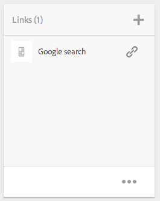

# Projecten{#projects}

Met projecten kunt u resources groeperen in één entiteit. Een gemeenschappelijke, gedeelde omgeving maakt het gemakkelijk om uw projecten te beheren. De soorten middelen u met een project kunt associëren worden bedoeld in AEM als Tegels. De tegels kunnen project en teaminformatie, activa, werkschema&#39;s, en andere types van informatie omvatten, zoals die in detail in de Tegels van het [Project worden beschreven.](#project-tiles)

>[!CAUTION]
>
>Voor gebruikers in projecten om andere gebruikers/groepen te zien terwijl het gebruiken van de functionaliteit van Projecten zoals het creëren van projecten, het creëren van taken/werkschema&#39;s, het zien van en het leiden van het team, die gebruikers moeten lees toegang op **/huis/gebruikers** en **/huis/groepen** hebben. De gemakkelijkste manier om dit uit te voeren is de **projecten-gebruikers** groep lees toegang tot **/huis/gebruikers** en**/home/groups**.

Als gebruiker kunt u het volgende doen:

* Projecten maken
* Inhoud en elementmappen aan een project koppelen
* Projecten verwijderen
* Inhoudskoppelingen uit project verwijderen

Zie de volgende aanvullende onderwerpen:

* [Projecten beheren](/help/sites-authoring/touch-ui-managing-projects.md)
* [Werken met taken](/help/sites-authoring/task-content.md)
* [Werken met projectworkflows](/help/sites-authoring/projects-with-workflows.md)
* [Creative Project- en PIM-integratie](/help/sites-authoring/managing-product-information.md)

## Projectconsole {#projects-console}

De projectenconsole is waar u tot uw projecten binnen AEM toegang hebt en leidt.

* Selecteer **Tijdlijn** en vervolgens een project om de tijdlijn weer te geven.
* Klik op **Selecteren** of tik erop om de selectiemodus te activeren.
* Klik op **Maken** om projecten toe te voegen.
* **Met Actieve projecten** in- en uitschakelen kunt u schakelen tussen alle projecten en alleen projecten die actief zijn.
* **De mening** van de Statistieken van de Show laat u projectstatistieken over taakvoltooiing zien.

## Projectblokken {#project-tiles}

Met Projecten, associeert u verschillende soorten informatie met uw projecten. Dit heet **Tegels**. Elk van de tegels en het soort informatie dat ze bevatten, wordt in deze sectie beschreven.

Aan uw project kunnen de volgende tegels zijn gekoppeld. Elk wordt beschreven in de volgende secties:

* Verzameling van activa en activa
* Ervaringen
* Koppelingen
* Projectinformatie
* Team
* Openingspagina&#39;s
* E-mails
* Workflows
* Lanceringen
* Taken

### Assets {#assets}

In de **middelentegel** kunt u alle elementen verzamelen die u voor een bepaald project gebruikt.

U uploadt elementen rechtstreeks in de tegel. Daarnaast kunt u Afbeeldingssets, Spin-sets of Gemengde mediasets maken als u over de invoegtoepassing Dynamische media beschikt.

### Asset Collections {#asset-collections}

Net als bij elementen kunt u [elementverzamelingen](/help/assets/managing-collections-touch-ui.md) rechtstreeks aan uw project toevoegen. U definieert verzamelingen in elementen.

Voeg een verzameling toe door op **Verzameling toevoegen** te klikken en de juiste verzameling in de lijst te selecteren.

### Ervaringen {#experiences}

Met de tegel **Ervaring** kunt u een mobiele app, website of publicatie aan het project toevoegen.

De pictogrammen geven aan welke ervaring wordt weergegeven: website, mobiele applicatie of een publicatie. Voeg ervaringen toe door op het plusteken (+) te klikken of op **Ervaring toevoegen** te klikken en het type ervaring te selecteren.

Selecteer het pad voor de miniaturen en wijzig, indien van toepassing, de miniatuur voor de ervaring. De ervaringen zijn gegroepeerd in de tegel **Ervaring** .

### Koppelingen {#links}

Met de tegel Koppelingen kunt u externe koppelingen aan uw project koppelen.

U kunt de koppeling een naam geven die gemakkelijk herkenbaar is en u kunt de miniatuur wijzigen.

### Projectinfo {#project-info}

De tegel Projectinformatie bevat algemene informatie over het project, zoals een beschrijving, projectstatus (inactief of actief), een vervaldatum en leden. Bovendien kunt u een projectduimnagel toevoegen, die op de belangrijkste pagina van Projecten wordt getoond.

De leden van het team kunnen van deze tegel (of hebben hun rollen veranderd) evenals de tegel van het Team worden toegewezen en worden geschrapt.

### Vertaaltaak {#translation-job}

In de tegel Vertaal-taak begint u een vertaling en ziet u ook de status van uw vertalingen. Zie [Vertaalprojecten](/help/assets/translation-projects.md)maken voor informatie over het instellen van uw vertaling.

Klik op de ellips onder aan de **Vertaaltaak** -kaart om de elementen in de vertaalworkflow weer te geven. In de lijst met vertaaltaken worden ook items voor metagegevens en tags van elementen weergegeven. Deze vermeldingen geven aan dat de metagegevens en tags voor de elementen ook worden vertaald.

### Team {#team}

In deze tegel, kunt u de leden van het projectteam specificeren. Wanneer het uitgeven, kunt u de naam van het teamlid ingaan en de gebruikersrol toewijzen.

U kunt teamleden toevoegen en verwijderen uit het team. Bovendien kunt u de [gebruikersrol](#userroles) uitgeven die aan het teamlid wordt toegewezen.

### Openingspagina&#39;s {#landing-pages}

Met de tegel **Landing** Pages kunt u een nieuwe bestemmingspagina aanvragen.

Deze workflow wordt beschreven in de workflow [Een bestemmingspagina](/help/sites-authoring/projects-with-workflows.md#request-landing-page-workflow)maken.

### E-mails {#emails}

Met de tegel **E-mail** kunt u aanvragen voor e-mail beheren. Hiermee wordt de workflow Verzoek om e-mail gestart.

Meer informatie wordt beschreven in de werkstroom E-mail [aanvragen.](/help/sites-authoring/projects-with-workflows.md#request-email-workflow)

### Workflows {#workflows}

U kunt uw project toewijzen om bepaalde workflows te volgen. Als om het even welke werkschema&#39;s lopen, toont hun status in de tegel van **Werkschema** in Projecten.

U kunt uw project toewijzen om bepaalde workflows te volgen. Afhankelijk van welk project u kiest, hebt u verschillende beschikbare werkschema&#39;s.

Deze worden beschreven in [Werken met projectworkflows.](/help/sites-authoring/projects-with-workflows.md)

### Lanceringen {#launches}

In de tegel Opstarten worden alle opstarten weergegeven die zijn aangevraagd met een workflow voor het [starten van een aanvraag.](/help/sites-authoring/projects-with-workflows.md)

### Taken {#tasks}

Met Taken kunt u de status van projectgerelateerde taken, waaronder workflows, controleren. De taken worden behandeld in detail bij het [Werken met Taken](/help/sites-authoring/task-content.md).

## Projectsjablonen {#project-templates}

AEM schepen met drie verschillende sjablonen uit de doos:

* Een eenvoudig project - een referentiemonster voor alle projecten die niet in andere categorieën passen (een &#39;catch-all&#39;-project). Het omvat drie basisrollen (Eigenaars, Editors, en Waarnemers) en vier werkschema&#39;s (de Goedkeuring van het Project, de Lancering van het Verzoek, de Pagina van het Aanbrengen van het Verzoek en E-mail van het Verzoek).
* Een mediaproject - een referentiemonsteringsproject voor aan media gerelateerde activiteiten. Het omvat verscheidene media verwante projectrollen (Fotografen, Editors, Copywriters, Ontwerpers, Eigenaars en Waarnemers). Het omvat ook twee workflows met betrekking tot media-inhoud - Verzoek om kopie (voor het aanvragen en reviseren van tekst) en Fotoopname van product (voor het beheren van productgerelateerde fotografie)
* [Product Photo Shoot Project](/help/sites-authoring/managing-product-information.md) - Een referentiemonster voor het beheer van eCommerce-gerelateerde productfotografie. Het omvat rollen voor fotografen, Editors, Foto Retouchers, Eigenaars, Creatieve Directeuren, Sociale Media Marketers, Marketing Managers, Reviewers en Waarnemers.
* [Een vertaalproject](/help/sites-administering/translation.md) - een referentiemonster voor het beheer van activiteiten op het gebied van vertaling. Het omvat drie basisrollen (Eigenaars, Editors, en Waarnemers). Het omvat twee werkschema&#39;s die in het gebruikersinterface van Workflows worden betreden.

Gebaseerd op het malplaatje u selecteert, hebt u verschillende opties beschikbaar aan u met name rond gebruikersrollen en werkschema&#39;s.

## Gebruikersrollen in een project {#user-roles-in-a-project}

De verschillende gebruikersrollen worden geplaatst in een malplaatje van het Project en om twee primaire redenen gebruikt:

1. Machtigingen. De gebruikersrollen vallen in één van de drie vermelde categorieën: Waarnemer, Redacteur, Eigenaar. Een fotograaf of copywriter heeft bijvoorbeeld dezelfde rechten als een Editor. De toestemmingen bepalen wat een gebruiker met inhoud in een project kan doen.
1. Workflows. De werkschema&#39;s bepalen wie taken in een project wordt toegewezen. De taken kunnen met een projectrol worden geassocieerd. U kunt bijvoorbeeld een taak toewijzen aan fotografen, zodat alle teamleden met de rol Fotograaf de taak krijgen.

Alle projecten steunen de volgende standaardrollen om u veiligheid en controletoestemmingen te laten beheren:

<table>
 <tbody>
  <tr>
   <td>
<strong>Rol</strong>
 </td>
   <td>
<strong>Beschrijving</strong>
 </td>
   <td>
<strong>Machtigingen</strong>
 </td>
   <td>
<strong>Groepslidmaatschap</strong>
 </td>
  </tr>
  <tr>
   <td>
Waarnemer
 </td>
   <td>
Een gebruiker in deze rol kan projectdetails, met inbegrip van de projectstatus bekijken.
 </td>
   <td>
Alleen-lezen machtigingen voor een project
 </td>
   <td>
werkstroom-gebruikersgroep
 </td>
  </tr>
  <tr>
   <td>
Editor
 </td>
   <td>
Een gebruiker met deze rol kan de inhoud van een project uploaden en bewerken.
 
 
 </td>
   <td>
    <ul>
     <li>Lees en schrijf toegang op een project, bijbehorende meta-gegevens, en verwante activa.</li>
     <li>Rechten voor het uploaden van een fotolijst, fotoopname en het controleren en goedkeuren van elementen</li>
     <li>Schrijf toestemming op /etc/commerce</li>
     <li>Machtiging voor een specifiek project wijzigen</li>
    </ul> </td>
   <td>
werkstroom-gebruikersgroep
 </td>
  </tr>
  <tr>
   <td>
Eigenaar
 </td>
   <td>
Een gebruiker met deze rol kan een project initiëren. Een eigenaar kan een project creëren, werk in een project beginnen en ook goedgekeurde activa naar de omslag van de Productie verplaatsen. Hoewel alle andere taken in het project ook door de eigenaar kunnen worden bekeken en worden uitgevoerd.
 </td>
   <td>
    <ul>
     <li>Schrijf toestemming op /etc/commerce</li>
    </ul> </td>
   <td>
    <ul>
     <li>DAM-gebruikersgroep (om een project te kunnen tot stand brengen)</li>
     <li>project-beheerders groep (om activa te kunnen bewegen)</li>
    </ul> </td>
  </tr>
 </tbody>
</table>

Voor creatieve projecten worden ook extra rollen - bijvoorbeeld fotografen - gegeven. U kunt deze rollen gebruiken om douanerollen voor een specifiek project af te leiden.

>[!NOTE]
>
>Wanneer u het project creëert en gebruikers aan de verschillende rollen toevoegt, worden de groepen die aan het project gekoppeld zijn, automatisch gecreëerd om bijbehorende machtigingen te beheren. Bijvoorbeeld: een project met de naam Mijn project zou drie groepen hebben: **Mijn projecteigenaars**, **Mijn projecteditors**, **Mijn projectwaarnemers**. Als het project echter wordt verwijderd, worden deze groepen niet automatisch verwijderd. Een beheerder moet de groepen handmatig verwijderen in **Gereedschappen** > **Beveiliging** > **Groepen**.
