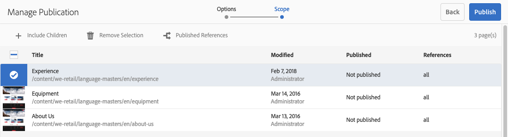
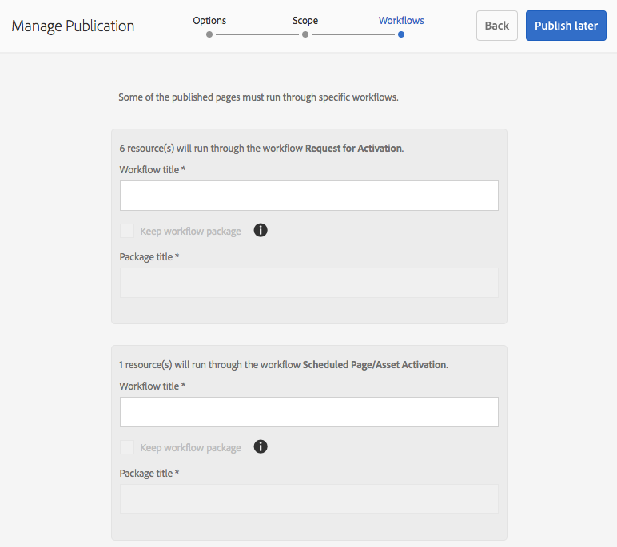
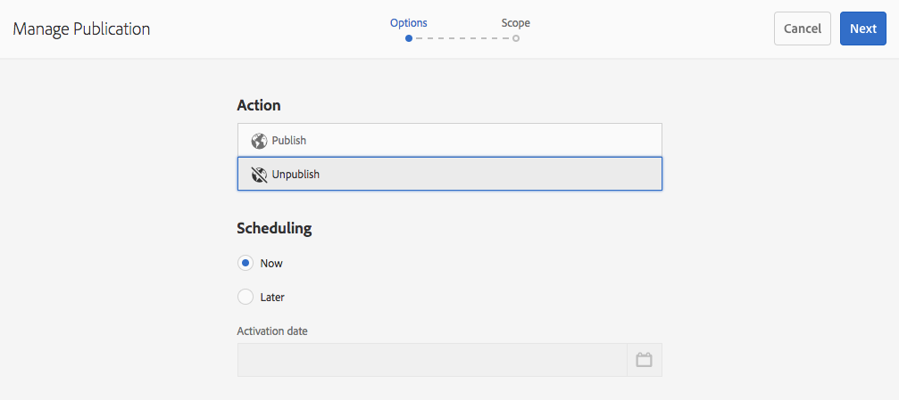

# Pagina&#39;s publiceren {#publishing-pages}

Nadat u de inhoud in de ontwerpomgeving hebt gemaakt en gecontroleerd, wilt u deze [beschikbaar maken op uw openbare website](/help/sites-authoring/author.md#concept-of-authoring-and-publishing) (uw publicatieomgeving).

Dit wordt bedoeld als het publiceren van een pagina. Wanneer u een pagina uit het publicatiemilieu wilt verwijderen wordt bedoeld unpublishing. Wanneer u de pagina publiceert en publiceert, blijft deze beschikbaar in de ontwerpomgeving voor verdere wijzigingen totdat u de pagina verwijdert.

U kunt een pagina ook direct of op een vooraf gedefinieerde datum/tijd publiceren of verwijderen.

>[!NOTE]
>
>Bepaalde termen met betrekking tot publicatie kunnen worden verward:
>
>* **Publiceren/Publiceren ongedaan maken**
   >  Dit zijn de belangrijkste termen voor de acties die uw inhoud openbaar maken in uw publicatieomgeving (of niet).
   >
   >
* **Activeren/deactiveren**
   >  Deze termen zijn synoniem met publiceren/verwijderen.
   >
   >
* **Replicatie/replicatie**
   >  Dit zijn de technische termen die de beweging van gegevens (bijvoorbeeld pagina-inhoud, bestanden, code, gebruikerscommentaren) van de ene omgeving naar de andere beschrijven, zoals bij het publiceren of omgekeerd repliceren van gebruikerscommentaren.
>

>[!NOTE]
>
>Als u niet over de vereiste rechten voor het publiceren van een specifieke pagina beschikt:
>
>* Er wordt een workflow gestart om de juiste persoon op de hoogte te stellen van uw verzoek om te publiceren.
>* Deze [workflow is mogelijk aangepast](/help/sites-developing/workflows-models.md#main-pars-procedure-6fe6) door uw ontwikkelingsteam.
>* Er wordt kort een bericht weergegeven om u te laten weten dat de workflow is geactiveerd.

>

## Pagina&#39;s publiceren {#publishing-pages-1}

Afhankelijk van uw locatie kunt u publiceren:

* [Vanuit de pagina-editor](/help/sites-authoring/publishing-pages.md#publishing-from-the-editor)
* [Van de plaatsenconsole](/help/sites-authoring/publishing-pages.md#publishing-from-the-console)

### Publiceren vanuit de Editor {#publishing-from-the-editor}

Als u een pagina bewerkt, kunt u deze rechtstreeks vanuit de editor publiceren.

1. Selecteer het pictogram **Pagina-informatie** om het menu te openen en selecteer vervolgens de optie **Pagina publiceren**.

   

1. Afhankelijk van het feit of de pagina verwijzingen bevat die moeten worden gepubliceerd:

   * De pagina wordt rechtstreeks gepubliceerd als er geen referenties zijn die moeten worden gepubliceerd.
   * Als de pagina verwijzingen heeft die het publiceren vereisen, zullen deze in **Publish** tovenaar worden vermeld, waar u of kunt:

      * Geef aan welke elementen/tags/etc. Als u samen met de pagina wilt publiceren, gebruikt u **Publiceren** om het proces te voltooien.

      * Gebruik **Annuleren** om de handeling af te breken.

   

1. Als u **Publiceren** selecteert, wordt de pagina naar de publicatieomgeving gekopieerd. In de paginaeditor wordt een informatiebanner weergegeven die de publicatieactie bevestigt.

   

   Wanneer u dezelfde pagina in de console weergeeft, is de bijgewerkte publicatiestatus zichtbaar.

   

>[!NOTE]
>
>Publiceren vanuit de editor is een oppervlakkige publicatie, dat wil zeggen dat alleen de geselecteerde pagina(&#39;s) wordt/worden gepubliceerd en onderliggende pagina&#39;s niet.

### Publiceren vanuit de console {#publishing-from-the-console}

In de siteconsole zijn er twee opties voor publiceren:

* [Snel publiceren](/help/sites-authoring/publishing-pages.md#quick-publish)
* [Publicatie beheren](/help/sites-authoring/publishing-pages.md#manage-publication)

#### Snel publiceren {#quick-publish}

**Quick** Publishing voor eenvoudige gevallen en publiceert de geselecteerde pagina(&#39;s) direct zonder verdere interactie. Daarom worden niet-gepubliceerde verwijzingen ook automatisch gepubliceerd.

Een pagina publiceren met Snel publiceren:

1. Selecteer de pagina of pagina&#39;s in de siteconsole en klik op de knop **Snel publiceren**.

   

1. Bevestig in het dialoogvenster Snel publiceren de publicatie door te klikken op **Publiceren** of Annuleren door te klikken op **Annuleren**. Onthoud dat niet-gepubliceerde verwijzingen automatisch ook worden gepubliceerd.

   

1. Wanneer de pagina wordt gepubliceerd, wordt een waarschuwing getoond die de publicatie bevestigt.

>[!NOTE]
>
>Snel publiceren is een oppervlakkige publicatie, dat wil zeggen dat alleen de geselecteerde pagina(&#39;s) wordt/worden gepubliceerd en onderliggende pagina&#39;s niet.

#### Publicatie {#manage-publication} beheren

**U kunt** Publicatie beheren met meer opties dan Snel publiceren, zodat onderliggende pagina&#39;s kunnen worden opgenomen, de referenties kunnen worden aangepast en toepasselijke workflows kunnen worden gestart en de optie kan worden geboden om op een latere datum te publiceren.

Een pagina publiceren of de publicatie ervan ongedaan maken met Publicatie beheren:

1. Selecteer de pagina of pagina&#39;s in de siteconsole en klik op de knop **Publicatie beheren**.

   

1. De wizard **Publicatie beheren** wordt gestart. In de eerste stap, **Options**, kunt u:

   * Kies of u de geselecteerde pagina&#39;s wilt publiceren of de publicatie ervan ongedaan wilt maken.
   * Kies of u deze handeling nu of op een latere datum wilt uitvoeren.

   Als u later publiceert, wordt een workflow gestart om de geselecteerde pagina of pagina&#39;s op het opgegeven tijdstip te publiceren. Als u de publicatie later ongedaan maakt, wordt een workflow gestart om de publicatie van de geselecteerde pagina of pagina&#39;s op een bepaald moment ongedaan te maken.

   Als u een publicatie/unpublish later wilt annuleren, gaat u naar [Workflowconsole](/help/sites-administering/workflows.md) om de corresponderende workflow te beëindigen.

   

   Klik **Volgende** om door te gaan.

1. In de volgende stap van de Manage tovenaar van de Publicatie, **Toepassingsgebied**, kunt u het werkingsgebied van de publicatie/unpublication zoals het omvatten van kindpagina&#39;s en/of het omvatten van verwijzingen bepalen.

   

   U kunt de knop **Inhoud toevoegen** gebruiken om extra pagina&#39;s toe te voegen aan de lijst met pagina&#39;s die moeten worden gepubliceerd voor het geval u deze niet hebt geselecteerd voordat u de wizard Publicatie beheren start.

   Als u op de knop Inhoud toevoegen klikt, wordt de [padbrowser](/help/sites-authoring/author-environment-tools.md#path-browser) gestart om de inhoud te kunnen selecteren.

   Selecteer de vereiste pagina&#39;s en klik dan **Selecteer** om de inhoud aan de tovenaar toe te voegen of **Cancel **om de selectie te annuleren en aan de tovenaar terug te keren.

   Terug in de tovenaar, kunt u een punt in de lijst selecteren om zijn verdere opties zoals te vormen:

   * Inclusief de onderliggende elementen.
   * Verwijder het uit de selectie.
   * De gepubliceerde referenties beheren.

   

   Als u op **Inclusief onderliggende elementen** klikt, wordt een dialoogvenster geopend waarin u:

   * Alleen directe kinderen opnemen.
   * Alleen gewijzigde pagina&#39;s opnemen.
   * Alleen al gepubliceerde pagina&#39;s opnemen.

   Klik op **Toevoegen** om de onderliggende pagina&#39;s toe te voegen aan de lijst met pagina&#39;s die op basis van de selectieopties moeten worden gepubliceerd of niet gepubliceerd. Klik **Annuleren** om de selectie te annuleren en terug te keren naar de wizard.

   

   Als u terugkeert naar de wizard, ziet u de toegevoegde pagina&#39;s op basis van uw keuze voor opties in het dialoogvenster Inclusief onderliggende items.

   U kunt de te publiceren verwijzingen of unpublished voor een pagina bekijken en wijzigen door het te selecteren en dan de **Gepubliceerde Verwijzingen** knoop te klikken.

   

   In het dialoogvenster **Gepubliceerde verwijzingen** worden de referenties voor de geselecteerde inhoud weergegeven. Standaard zijn ze allemaal geselecteerd en worden ze gepubliceerd/niet gepubliceerd, maar u kunt de optie uitschakelen om ze te deselecteren zodat ze niet in de handeling worden opgenomen.

   Klik **Done** om uw wijzigingen op te slaan of **Cancel** om de selectie te annuleren en terug te keren naar de wizard.

   In de wizard wordt de kolom **References** bijgewerkt om de selectie van te publiceren of ongepubliceerde verwijzingen weer te geven.

   

1. Klik **Publiceren** om te voltooien.

   Terug in de plaatsenconsole zal een berichtbericht de publicatie bevestigen.

1. Als de gepubliceerde pagina&#39;s aan werkschema&#39;s worden geassocieerd, kunnen zij in een definitieve **Werkschema** stap van de publicatietovenaar worden getoond.

   >[!NOTE]
   >
   >De stap **Workflows** wordt weergegeven op basis van de rechten die de gebruiker kan hebben of niet. Zie de [vorige notitie op deze pagina](/help/sites-authoring/publishing-pages.md#main-pars-note-0-ejsjqg-refd) betreffende publicatiebevoegdheden en [Toegang tot werkstromen beheren](/help/sites-administering/workflows-managing.md) en [Workflows toepassen op pagina&#39;s](/help/sites-authoring/workflows-applying.md#main-pars-text-5-bvhbkh-refd) voor meer informatie.

   De bronnen worden gegroepeerd op basis van de workflows die worden geactiveerd en elke optie heeft de volgende opties:

   * Definieer de titel van de workflow.
   * Behoud het werkstroompakket, op voorwaarde dat de werkstroom [ondersteuning voor meerdere bronnen](/help/sites-developing/workflows-models.md#configuring-a-workflow-for-multi-resource-support) heeft.
   * Definieer een titel van het workflowpakket als de optie om het workflowpakket te behouden is gekozen.

   Klik op **Publiceren** of **Later publiceren** om de publicatie te voltooien.

   

## Publicatie van pagina&#39;s {#unpublishing-pages} ongedaan maken

Als u de publicatie van een pagina ongedaan maakt, wordt deze verwijderd uit uw publicatieomgeving, zodat deze niet langer beschikbaar is voor uw lezers.

Op een [manier gelijkend op het publiceren](/help/sites-authoring/publishing-pages.md#publishing-pages), kunnen één of meerdere pagina&#39;s unpublished:

* [Vanuit de pagina-editor](/help/sites-authoring/publishing-pages.md#unpublishing-from-the-editor)
* [Van de plaatsenconsole](/help/sites-authoring/publishing-pages.md#unpublishing-from-the-console)

### Publicatie ongedaan maken in de Editor {#unpublishing-from-the-editor}

Als u de publicatie van een pagina ongedaan wilt maken, selecteert u **Publicatie van pagina** ongedaan maken in het menu **Pagina-informatie**, net als wanneer u de pagina](/help/sites-authoring/publishing-pages.md#publishing-from-the-editor) zou publiceren.[

### Publiceren van de console {#unpublishing-from-the-console} ongedaan maken

Net zoals u [de optie Publicatie beheren gebruikt om te publiceren](/help/sites-authoring/publishing-pages.md#manage-publication), kunt u deze ook gebruiken om de publicatie ongedaan te maken.

1. Selecteer de pagina of pagina&#39;s in de siteconsole en klik op de knop **Publicatie beheren**.
1. De wizard **Publicatie beheren** wordt gestart. In de eerste stap, bij **Opties**, selecteert u **Publicatie ongedaan maken** in plaats van de standaardoptie **Publiceren**.

   

   Net zoals bij het publiceren later een workflow wordt gestart om deze versie van de pagina op het opgegeven tijdstip te publiceren, wordt door het later deactiveren een workflow gestart om de publicatie van de geselecteerde pagina of pagina&#39;s op een bepaald tijdstip ongedaan te maken.

   Als u een publicatie/unpublish later wilt annuleren, gaat u naar [Workflowconsole](/help/sites-administering/workflows.md) om de corresponderende workflow te beëindigen.

1. Om unpublication te voltooien, ga door de tovenaar aangezien u [de pagina ](/help/sites-authoring/publishing-pages.md#manage-publication) zou publiceren.

## Een structuur publiceren en verwijderen {#publishing-and-unpublishing-a-tree}

Wanneer u een aanzienlijk aantal inhoudspagina&#39;s hebt ingevoerd of bijgewerkt - die allen onder de zelfde wortelpagina ingezeten zijn - kan het gemakkelijker zijn om de volledige boom in één actie te publiceren.

U kunt de [Publicatie beheren](/help/sites-authoring/publishing-pages.md#manage-publication) optie op de plaatsenconsole gebruiken om dit te doen.

1. Selecteer in de siteconsole de basispagina van de boomstructuur die u wilt publiceren of verwijderen en selecteer **Publicatie beheren**.
1. De wizard **Publicatie beheren** wordt gestart. Kies of u wilt publiceren of de publicatie ongedaan wilt maken en wanneer dit moet gebeuren en selecteer **Volgende** om door te gaan.
1. Selecteer in de stap **Bereik** de hoofdpagina en selecteer **Inclusief onderliggende elementen**.

   

1. Schakel in het dialoogvenster **Inclusief onderliggende elementen** de opties uit:

   * Alleen directe kinderen opnemen
   * Alleen reeds gepubliceerde pagina&#39;s opnemen

   Deze opties zijn standaard geselecteerd, dus u moet niet vergeten deze te deselecteren. Klik op **Toevoegen** om de inhoud te bevestigen en toe te voegen aan de publicatie/publicatie.

   

1. De wizard **Publicatie beheren** geeft een overzicht van de inhoud van de structuur die u wilt controleren. U kunt de selectie verder aanpassen door extra pagina&#39;s toe te voegen of geselecteerde pagina&#39;s te verwijderen.

   

   Herinner dat u de verwijzingen kunt ook herzien die via **Gepubliceerde Verwijzingen** optie moeten worden gepubliceerd.

1. [Ga als ](#manage-publication) normaal verder met de wizard Publicatie beheren om de publicatie of publicatie van de boomstructuur te voltooien.

## Publicatiestatus bepalen {#determining-publication-status}

U kunt de publicatiestatus van een pagina bepalen:

* In de [informatie van het middeloverzicht op de plaatsenconsole](/help/sites-authoring/basic-handling.md#viewing-and-selecting-resources)

   

   De publicatiestatus wordt weergegeven in [kaart](/help/sites-authoring/basic-handling.md#card-view)-, [kolom](/help/sites-authoring/basic-handling.md#column-view)- en [lijstweergaven](/help/sites-authoring/basic-handling.md#list-view) in de Sites-console.

* In de [tijdlijn](/help/sites-authoring/basic-handling.md#timeline)

   

* In het menu [Pagina-informatie](/help/sites-authoring/author-environment-tools.md#page-information) wanneer u een pagina bewerkt

   
