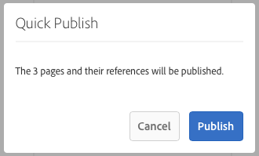
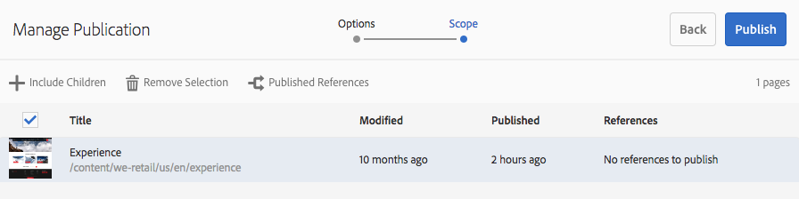

# Pagina&#39;s publiceren {#publishing-pages}

Nadat u de inhoud in de ontwerpomgeving hebt gemaakt en gecontroleerd, [beschikbaar stellen op uw openbare website](/help/sites-authoring/author.md#concept-of-authoring-and-publishing) (uw publicatieomgeving).

Dit wordt bedoeld als het publiceren van een pagina. Wanneer u een pagina uit het publicatiemilieu wilt verwijderen wordt bedoeld unpublishing. Wanneer u de pagina publiceert en publiceert, blijft deze beschikbaar in de ontwerpomgeving voor verdere wijzigingen totdat u de pagina verwijdert.

U kunt een pagina ook direct of op een vooraf gedefinieerde datum/tijd publiceren of verwijderen.

>[!NOTE]
>
>Bepaalde termen met betrekking tot publicatie kunnen worden verward:
>
>* **Publiceren/Publiceren ongedaan maken**
>  Dit zijn de belangrijkste termen voor de acties die uw inhoud openbaar maken in uw publicatieomgeving (of niet).
>
>* **Activeren/deactiveren**
>  Deze termen zijn synoniem met publiceren/verwijderen.
>
>* **Replicatie/replicatie**
>  Dit zijn de technische termen die de beweging van gegevens (bijvoorbeeld pagina-inhoud, bestanden, code, gebruikerscommentaren) van de ene omgeving naar de andere beschrijven, zoals bij het publiceren of omgekeerd repliceren van gebruikerscommentaren.
>

>[!NOTE]
>
>Als u niet over de vereiste rechten voor het publiceren van een specifieke pagina beschikt:
>
>* Er wordt een workflow gestart om de juiste persoon op de hoogte te stellen van uw verzoek om te publiceren.
>* Dit [workflow is mogelijk aangepast](/help/sites-developing/workflows-models.md#main-pars-procedure-6fe6) door uw ontwikkelingsteam.
>* Er wordt kort een bericht weergegeven om u te laten weten dat de workflow is geactiveerd.
>

## Pagina&#39;s publiceren {#publishing-pages-1}

Afhankelijk van uw locatie kunt u publiceren:

* [Vanuit de paginaeditor](/help/sites-authoring/publishing-pages.md#publishing-from-the-editor)
* [Van de plaatsenconsole](/help/sites-authoring/publishing-pages.md#publishing-from-the-console)

### Publiceren vanuit de Editor {#publishing-from-the-editor}

Als u een pagina bewerkt, kunt u deze rechtstreeks vanuit de editor publiceren.

1. Selecteer de **Pagina-informatie** het pictogram om het menu te openen en dan **Pagina publiceren** -optie.

   

1. Afhankelijk van het feit of de pagina verwijzingen bevat die moeten worden gepubliceerd:

   * De pagina wordt rechtstreeks gepubliceerd als er geen referenties zijn die moeten worden gepubliceerd.
   * Als de pagina verwijzingen bevat die moeten worden gepubliceerd, worden deze weergegeven in het dialoogvenster **Publiceren** wizard, waarbij u:

      * Geef op welke elementen of tags u samen met de pagina wilt publiceren en gebruik vervolgens **Publiceren** om het proces te voltooien.

      * Gebruiken **Annuleren** om de handeling af te breken.

   

1. Selecteren **Publiceren** wordt de pagina gerepliceerd naar de publicatieomgeving. In de paginaredacteur, wordt een informatiebanner getoond die de publicatieactie bevestigen.

   

   Wanneer u dezelfde pagina in de console weergeeft, is de bijgewerkte publicatiestatus zichtbaar.

   

>[!NOTE]
>
>Publiceren vanuit de editor is een oppervlakkige publicatie, dat wil zeggen dat alleen de geselecteerde pagina(&#39;s) wordt/worden gepubliceerd en onderliggende pagina&#39;s niet.

>[!NOTE]
>
>Pagina&#39;s die worden benaderd door [aliassen](/help/sites-authoring/editing-page-properties.md#advanced) in de editor kan niet worden gepubliceerd. Publicatieopties in de editor zijn alleen beschikbaar voor pagina&#39;s die via hun werkelijke paden worden benaderd.

### Publiceren vanuit de console {#publishing-from-the-console}

In de siteconsole zijn er twee opties voor publiceren:

* [Snel publiceren](/help/sites-authoring/publishing-pages.md#quick-publish)
* [Publicatie beheren](/help/sites-authoring/publishing-pages.md#manage-publication)

#### Snel publiceren {#quick-publish}

**Snel publiceren** is voor eenvoudige gevallen en publiceert de geselecteerde pagina(&#39;s) direct zonder verdere interactie. Daarom worden niet-gepubliceerde verwijzingen ook automatisch gepubliceerd.

Een pagina publiceren met Snel publiceren:

1. Selecteer de pagina of pagina&#39;s in de siteconsole en klik op de knop **Snel publiceren** knop.

   

1. Bevestig de publicatie in het dialoogvenster Snel publiceren door op **Publiceren** of annuleren door op **Annuleren**. Onthoud dat niet-gepubliceerde verwijzingen automatisch ook worden gepubliceerd.

   

1. Wanneer de pagina wordt gepubliceerd, wordt een waarschuwing getoond die de publicatie bevestigt.

>[!NOTE]
>
>Snel publiceren is een oppervlakkige publicatie, dat wil zeggen dat alleen de geselecteerde pagina of pagina&#39;s worden gepubliceerd en onderliggende pagina&#39;s niet.

#### Publicatie beheren {#manage-publication}

**Publicatie beheren** biedt meer opties dan Snel publiceren, waardoor onderliggende pagina&#39;s kunnen worden opgenomen, de verwijzingen kunnen worden aangepast en toepasselijke workflows kunnen worden gestart en de optie kan worden geboden om op een latere datum te publiceren.

Een pagina publiceren of de publicatie ervan ongedaan maken met Publicatie beheren:

1. Selecteer de pagina of pagina&#39;s in de siteconsole en klik op de knop **Publicatie beheren** knop.

   

1. De wizard **Publicatie beheren** wordt gestart. De eerste stap, **Opties**, laat u:

   * Kies of u de geselecteerde pagina&#39;s wilt publiceren of de publicatie ervan ongedaan wilt maken.
   * Kies of u deze handeling nu of op een latere datum wilt uitvoeren.

   Als u later publiceert, wordt een workflow gestart om de geselecteerde pagina of pagina&#39;s op het opgegeven tijdstip te publiceren. Als u de publicatie later ongedaan maakt, wordt een workflow gestart om de publicatie van de geselecteerde pagina of pagina&#39;s op een bepaald moment ongedaan te maken.

   Als u een publicatie/publicatie later wilt annuleren, gaat u naar de [Workflowconsole](/help/sites-administering/workflows.md) om de corresponderende workflow te beëindigen.

   

   Klikken **Volgende** om door te gaan.

1. In de volgende stap van de wizard Publicatie beheren: **Toepassingsgebied**, kunt u het bereik van de publicatie/publicatie definiëren, bijvoorbeeld om onderliggende pagina&#39;s en/of verwijzingen op te nemen.

   

   U kunt de knop **Inhoud toevoegen** gebruiken om extra pagina&#39;s toe te voegen aan de lijst met pagina&#39;s die moeten worden gepubliceerd voor het geval u deze niet hebt geselecteerd voordat u de wizard Publicatie beheren start.

   Klik op de knop Inhoud toevoegen om het dialoogvenster [padbrowser](/help/sites-authoring/author-environment-tools.md#path-browser) om inhoudselectie toe te staan.

   Selecteer de vereiste pagina&#39;s en klik vervolgens op **Selecteren** om de inhoud aan de tovenaar toe te voegen of **Cancel **om de selectie te annuleren en aan de tovenaar terug te keren.

   Terug in de tovenaar, kunt u een punt in de lijst selecteren om zijn verdere opties zoals te vormen:

   * Inclusief de onderliggende elementen.
   * Verwijder de selectie.
   * De gepubliceerde referenties beheren.

   

   Klikken **Inclusief onderliggende items** Hiermee opent u een dialoogvenster waarin u:

   * Alleen directe kinderen opnemen.
   * Alleen gewijzigde pagina&#39;s opnemen.
   * Alleen al gepubliceerde pagina&#39;s opnemen.

   Klikken **Toevoegen** om de onderliggende pagina&#39;s toe te voegen aan de lijst met pagina&#39;s die op basis van de selectieopties moeten worden gepubliceerd of niet gepubliceerd. Klikken **Annuleren** om de selectie te annuleren en terug te keren naar de wizard.

   

   Als u terugkeert naar de wizard, ziet u de toegevoegde pagina&#39;s op basis van uw keuze voor opties in het dialoogvenster Inclusief onderliggende items.

   U kunt de te publiceren of niet gepubliceerde verwijzingen voor een pagina bekijken en wijzigen door het te selecteren en dan te klikken **Gepubliceerde verwijzingen** knop.

   

   De **Gepubliceerde verwijzingen** geeft de referenties voor de geselecteerde inhoud weer. Standaard zijn ze allemaal geselecteerd en worden ze gepubliceerd/niet gepubliceerd, maar u kunt de optie uitschakelen om ze te deselecteren zodat ze niet in de handeling worden opgenomen.

   Klikken **Gereed** om uw wijzigingen op te slaan of **Annuleren** om de selectie te annuleren en terug te keren naar de wizard.

   Terug in de wizard **Verwijzingen** wordt de kolom bijgewerkt met de verwijzingen die u hebt geselecteerd voor publicatie of publicatie.

   

1. Klikken **Publiceren** in.

   Terug in de plaatsenconsole zal een berichtbericht de publicatie bevestigen.

1. Als de gepubliceerde pagina&#39;s zijn gekoppeld aan workflows, kunnen deze in een definitieve versie worden weergegeven **Workflows** stap van de publicatiewizard.

   >[!NOTE]
   >
   >De **Workflows** deze stap wordt weergegeven op basis van de rechten die de gebruiker al dan niet heeft. Zie de [vorige notitie op deze pagina](/help/sites-authoring/publishing-pages.md#main-pars-note-0-ejsjqg-refd) met betrekking tot publicatiebevoegdheden en [Toegang tot werkstromen beheren](/help/sites-administering/workflows-managing.md) en [Workflows toepassen op pagina&#39;s](/help/sites-authoring/workflows-applying.md#main-pars-text-5-bvhbkh-refd) voor meer informatie.

   De bronnen worden gegroepeerd op basis van de workflows die worden geactiveerd en elke optie heeft de volgende opties:

   * Definieer de titel van de workflow.
   * Behoud het workflowpakket, op voorwaarde dat de workflow [ondersteuning voor meerdere bronnen](/help/sites-developing/workflows-models.md#configuring-a-workflow-for-multi-resource-support).
   * Definieer een titel van het workflowpakket als de optie om het workflowpakket te behouden is gekozen.

   Klik op **Publiceren** of **Later publiceren** om de publicatie te voltooien.

   

## Publicatie van pagina&#39;s ongedaan maken {#unpublishing-pages}

Als u de publicatie van een pagina ongedaan maakt, wordt deze verwijderd uit uw publicatieomgeving, zodat deze niet langer beschikbaar is voor uw lezers.

In een [vergelijkbare manier van publiceren](/help/sites-authoring/publishing-pages.md#publishing-pages), kunnen een of meer pagina&#39;s niet worden gepubliceerd:

* [Vanuit de paginaeditor](/help/sites-authoring/publishing-pages.md#unpublishing-from-the-editor)
* [Van de plaatsenconsole](/help/sites-authoring/publishing-pages.md#unpublishing-from-the-console)

### Publicatie ongedaan maken vanuit de Editor {#unpublishing-from-the-editor}

Als u tijdens het bewerken van een pagina de publicatie van die pagina ongedaan wilt maken, selecteert u **Publicatie van pagina ongedaan maken** in de **Pagina-informatie** zoals u zou doen [de pagina publiceren](/help/sites-authoring/publishing-pages.md#publishing-from-the-editor).

>[!NOTE]
>
>Pagina&#39;s die worden benaderd door [aliassen](/help/sites-authoring/editing-page-properties.md#advanced) in de editor kan niet worden gepubliceerd. Publicatieopties in de editor zijn alleen beschikbaar voor pagina&#39;s die via hun werkelijke paden worden benaderd.

### Publicatie ongedaan maken vanuit de console {#unpublishing-from-the-console}

Net zoals u [de optie Publicatie beheren gebruiken om te publiceren](/help/sites-authoring/publishing-pages.md#manage-publication)kunt u de publicatie ook ongedaan maken.

1. Selecteer de pagina of pagina&#39;s in de siteconsole en klik op de knop **Publicatie beheren** knop.
1. De wizard **Publicatie beheren** wordt gestart. In de eerste stap, bij **Opties**, selecteert u **Publicatie ongedaan maken** in plaats van de standaardoptie **Publiceren**.

   

   Net zoals later met publiceren een workflow wordt gestart om deze versie van de pagina op het opgegeven tijdstip te publiceren, wordt later met deactiveren een workflow gestart om de publicatie van de geselecteerde pagina of pagina&#39;s op een bepaald tijdstip ongedaan te maken.

   Als u een publicatie/publicatie later wilt annuleren, gaat u naar de [Workflowconsole](/help/sites-administering/workflows.md) om de corresponderende workflow te beëindigen.

1. Als u de publicatie wilt voltooien, gaat u door met de wizard zoals u [de pagina publiceren](/help/sites-authoring/publishing-pages.md#manage-publication).

## Een boomstructuur publiceren en de publicatie ervan opheffen {#publishing-and-unpublishing-a-tree}

Wanneer u een aanzienlijk aantal inhoudspagina&#39;s hebt ingevoerd of bijgewerkt - die allen onder de zelfde wortelpagina ingezeten zijn - kan het gemakkelijker zijn om de volledige boom in één actie te publiceren.

U kunt de [Publicatie beheren](/help/sites-authoring/publishing-pages.md#manage-publication) optie op de plaatsenconsole om dit te doen.

1. Selecteer in de siteconsole de hoofdpagina van de boomstructuur die u wilt publiceren of waarvan u de publicatie ongedaan wilt maken, en selecteer **Publicatie beheren**.
1. De wizard **Publicatie beheren** wordt gestart. Kies of u wilt publiceren of de publicatie wilt ongedaan maken en wanneer deze moet plaatsvinden en selecteer **Volgende** om door te gaan.
1. In de **Toepassingsgebied** stap, selecteer de basispagina en selecteer **Inclusief onderliggende items**.

   

1. In de **Inclusief onderliggende items** , schakelt u de opties uit:

   * Alleen directe kinderen opnemen
   * Alleen reeds gepubliceerde pagina&#39;s opnemen

   Deze opties zijn standaard geselecteerd, dus u moet niet vergeten deze te deselecteren. Klikken **Toevoegen** om de inhoud te bevestigen en toe te voegen aan de publicatie/publicatie.

   

1. De **Publicatie beheren** De wizard geeft een overzicht van de inhoud van de structuur die u wilt controleren. U kunt de selectie verder aanpassen door extra pagina&#39;s toe te voegen of geselecteerde pagina&#39;s te verwijderen.

   

   U kunt ook de referenties controleren die via het dialoogvenster **Gepubliceerde verwijzingen** -optie.

1. [Doorgaan met de normale wizard Publicatie beheren](#manage-publication) om de publicatie of publicatie van de boom te voltooien.

## Publicatiestatus bepalen {#determining-publication-status}

U kunt de publicatiestatus van een pagina bepalen:

* In de [bron overzichtsinformatie over de plaatsenconsole](/help/sites-authoring/basic-handling.md#viewing-and-selecting-resources)

  

  De publicatiestatus wordt weergegeven in [kaart](/help/sites-authoring/basic-handling.md#card-view)-, [kolom](/help/sites-authoring/basic-handling.md#column-view)- en [lijstweergaven](/help/sites-authoring/basic-handling.md#list-view) in de Sites-console.

* In de [tijdlijn](/help/sites-authoring/basic-handling.md#timeline)

  

* In de [Menu Paginagegevens](/help/sites-authoring/author-environment-tools.md#page-information) bij het bewerken van een pagina

  
