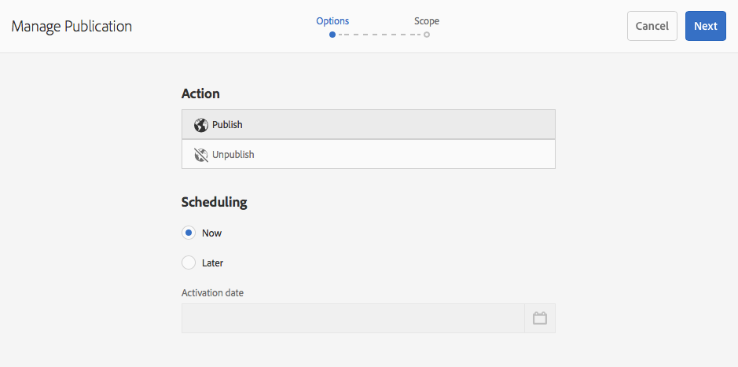

# Pagina&#39;s publiceren {#publishing-pages}

Nadat u hebt gecreeerd en uw inhoud op het auteursmilieu herzien, [ maak het beschikbaar op uw openbare website ](/help/sites-authoring/author.md#concept-of-authoring-and-publishing) (uw publicatiemilieu).

Dit wordt bedoeld als het publiceren van een pagina. Wanneer u een pagina uit het publicatiemilieu wilt verwijderen wordt bedoeld unpublishing. Wanneer u de pagina publiceert en publiceert, blijft deze beschikbaar in de ontwerpomgeving voor verdere wijzigingen totdat u de pagina verwijdert.

U kunt een pagina ook direct of op een vooraf gedefinieerde datum/tijd publiceren of verwijderen.

>[!NOTE]
>
>Bepaalde termen met betrekking tot publicatie kunnen worden verward:
>
>* **publiceren/unpublish**
>  Dit zijn de belangrijkste termen voor de acties die uw inhoud openbaar maken in uw publicatieomgeving (of niet).
>
>* **activeert/deactiveert**
>  Deze termen zijn synoniem met publiceren/verwijderen.
>
>* **Replicatie/Replicatie**
>  Dit zijn de technische termen die de beweging van gegevens (bijvoorbeeld pagina-inhoud, bestanden, code, gebruikerscommentaren) van de ene omgeving naar de andere beschrijven, zoals bij het publiceren of omgekeerd repliceren van gebruikerscommentaren.

## Onvoldoende rechten {#insufficient-privileges}

Als u niet over de vereiste rechten voor het publiceren van een specifieke pagina beschikt:

* Er wordt een workflow gestart om de juiste persoon op de hoogte te stellen van uw verzoek om te publiceren.
* Dit [ werkschema kan ](/help/sites-developing/workflows-models.md#main-pars-procedure-6fe6) door uw ontwikkelingsteam worden aangepast.
* Er wordt kort een bericht weergegeven om u te laten weten dat de workflow is geactiveerd.

## Pagina&#39;s publiceren {#publishing-pages-1}

Afhankelijk van uw locatie kunt u publiceren:

* [Vanuit de paginaeditor](/help/sites-authoring/publishing-pages.md#publishing-from-the-editor)
* [Van de plaatsenconsole](/help/sites-authoring/publishing-pages.md#publishing-from-the-console)

### Publiceren vanuit de Editor {#publishing-from-the-editor}

Als u een pagina bewerkt, kunt u deze rechtstreeks vanuit de editor publiceren.

1. Selecteer het **pictogram van de Informatie van de Pagina** om het menu te openen en dan de **publiceer de optie van de Pagina**.

   

1. Afhankelijk van het feit of de pagina verwijzingen bevat die moeten worden gepubliceerd:

   * De pagina wordt rechtstreeks gepubliceerd als er geen referenties zijn die moeten worden gepubliceerd.
   * Als de pagina verwijzingen heeft die het publiceren vereisen, zullen deze in **worden vermeld publiceert** tovenaar, waar u of kunt:

      * Specificeer welke van de activa of de markeringen, u samen met de pagina wilt publiceren, dan gebruik **publiceren** om het proces te voltooien.

      * Het gebruik **annuleert** om de actie af te breken.

   

1. Het selecteren **publiceert** zal de pagina aan het publicatiemilieu herhalen. In de paginaredacteur, wordt een informatiebanner getoond die de publicatieactie bevestigen.

   

   Wanneer u dezelfde pagina in de console weergeeft, is de bijgewerkte publicatiestatus zichtbaar.

   

>[!NOTE]
>
>Publiceren vanuit de editor is een oppervlakkige publicatie, dat wil zeggen dat alleen de geselecteerde pagina(&#39;s) wordt/worden gepubliceerd en onderliggende pagina&#39;s niet.

>[!NOTE]
>
>De pagina&#39;s die door [ aliassen ](/help/sites-authoring/editing-page-properties.md#advanced) in de redacteur worden betreden kunnen niet worden gepubliceerd. Publicatieopties in de editor zijn alleen beschikbaar voor pagina&#39;s die via hun werkelijke paden worden benaderd.

### Publiceren vanuit de console {#publishing-from-the-console}

In de siteconsole zijn er twee opties voor publiceren:

* [Snel publiceren](/help/sites-authoring/publishing-pages.md#quick-publish)
* [Publicatie beheren](/help/sites-authoring/publishing-pages.md#manage-publication)

#### Snel publiceren {#quick-publish}

**Snel publiceren** is voor eenvoudige gevallen en publiceert de geselecteerde pagina(s) onmiddellijk zonder enige verdere interactie. Daarom worden niet-gepubliceerde verwijzingen ook automatisch gepubliceerd.

Een pagina publiceren met Snel publiceren:

1. Selecteer de pagina of de pagina&#39;s in de plaatsenconsole en klik **Snel publiceren** knoop.

   

1. In Snel publiceer dialoog, bevestig de publicatie door op **te klikken publiceert** of annuleert door op **te klikken annuleert**. Onthoud dat niet-gepubliceerde verwijzingen automatisch ook worden gepubliceerd.

   

1. Wanneer de pagina wordt gepubliceerd, wordt een waarschuwing getoond die de publicatie bevestigt.

>[!NOTE]
>
>Snel publiceren is een oppervlakkige publicatie, dat wil zeggen dat alleen de geselecteerde pagina of pagina&#39;s worden gepubliceerd en onderliggende pagina&#39;s niet.

#### Publicatie beheren {#manage-publication}

**beheer Publicatie** aanbiedingen meer opties dan Snelle Publicatie, die voor de opneming van kindpagina&#39;s, aanpassing van de verwijzingen, en het beginnen van om het even welke toepasselijke werkschema&#39;s toestaan en de optie aanbieden om op een recentere datum te publiceren.

Een pagina publiceren of de publicatie ervan ongedaan maken met Publicatie beheren:

1. Selecteer de pagina of de pagina&#39;s in de plaatsenconsole en klik **leiden Publicatie** knoop.

   

1. De wizard **Publicatie beheren** wordt gestart. De eerste stap, **Opties**, laat u:

   * Kies of u de geselecteerde pagina&#39;s wilt publiceren of de publicatie ervan ongedaan wilt maken.
   * Kies of u deze handeling nu of op een latere datum wilt uitvoeren.

   Als u later publiceert, wordt een workflow gestart om de geselecteerde pagina of pagina&#39;s op het opgegeven tijdstip te publiceren. Als u de publicatie later ongedaan maakt, wordt een workflow gestart om de publicatie van de geselecteerde pagina of pagina&#39;s op een bepaald moment ongedaan te maken.

   Als u wilt annuleren publiceren/unpublish later, ga naar de [ Console van het Werkschema ](/help/sites-administering/workflows.md) om het overeenkomstige werkschema te eindigen.

   

   Klik **daarna** om verder te gaan.

1. In de volgende stap van de Manage tovenaar van de Publicatie, **Reikwijdte**, kunt u het werkingsgebied van de publicatie/unpublication zoals het omvatten om kindpagina&#39;s en/of met inbegrip van verwijzingen te omvatten bepalen.

   

   U kunt de knop **Inhoud toevoegen** gebruiken om extra pagina&#39;s toe te voegen aan de lijst met pagina&#39;s die moeten worden gepubliceerd voor het geval u deze niet hebt geselecteerd voordat u de wizard Publicatie beheren start.

   Het klikken van de Add knoop van de Inhoud begint [ wegbrowser ](/help/sites-authoring/author-environment-tools.md#path-browser) om inhoudselectie toe te staan.

   Selecteer de vereiste pagina&#39;s en klik dan **Uitgezocht** om de inhoud aan de tovenaar toe te voegen of **Cancel **om de selectie te annuleren en aan de tovenaar terug te keren.

   Terug in de tovenaar, kunt u een punt in de lijst selecteren om zijn verdere opties zoals te vormen:

   * Inclusief de onderliggende elementen.
   * Verwijder de selectie.
   * De gepubliceerde referenties beheren.

   

   Het klikken **omvat Kinderen** opent een dialoog die u toestaat:

   * Alleen directe kinderen opnemen.
   * Alleen gewijzigde pagina&#39;s opnemen.
   * Alleen al gepubliceerde pagina&#39;s opnemen.

   Klik **toevoegen** om de kindpagina&#39;s aan de lijst van pagina&#39;s toe te voegen die of unpublished gebaseerd op de selectieopties moeten worden gepubliceerd. Klik **annuleren** om de selectie te annuleren en aan de tovenaar terug te keren.

   

   Als u terugkeert naar de wizard, ziet u de toegevoegde pagina&#39;s op basis van uw keuze voor opties in het dialoogvenster Inclusief onderliggende items.

   U kunt de verwijzingen bekijken en wijzigen die of unpublished voor een pagina moeten worden gepubliceerd door het te selecteren en dan de **Gepubliceerde knoop van Verwijzingen** te klikken.

   

   Het **Gepubliceerde dialoog van Verwijzingen** toont de verwijzingen voor de geselecteerde inhoud. Standaard zijn ze allemaal geselecteerd en worden ze gepubliceerd/niet gepubliceerd, maar u kunt de optie uitschakelen om ze te deselecteren zodat ze niet in de handeling worden opgenomen.

   Klik **Gedaan** om uw veranderingen te bewaren of **annuleert** om de selectie te annuleren en aan de tovenaar terug te keren.

   Terug in de tovenaar, zal de **kolom van Verwijzingen** worden bijgewerkt om op uw selectie van te publiceren verwijzingen te wijzen of unpublished.

   

1. Klik **publiceren** om te voltooien.

   Terug in de plaatsenconsole zal een berichtbericht de publicatie bevestigen.

1. Als de gepubliceerde pagina&#39;s met werkschema&#39;s worden geassocieerd, kunnen zij in een definitieve **stap van de Werkschema&#39;s** van de publicatietovenaar worden getoond.

   >[!NOTE]
   >
   >De **stap van de Werkschema&#39;s** wordt getoond gebaseerd op welke rechten uw gebruiker kan of niet kan hebben.
   >
   >Zie de secties [ Onvoldoende Bevoegdheden ](/help/sites-authoring/publishing-pages.md#insufficient-privileges), [ het Leiden Toegang tot Werkschema&#39;s ](/help/sites-administering/workflows-managing.md) en [ Toepassend Werkschema&#39;s op Pagina&#39;s ](/help/sites-authoring/workflows-applying.md#main-pars-text-5-bvhbkh-refd) voor details.

   De bronnen worden gegroepeerd op basis van de workflows die worden geactiveerd en elke optie heeft de volgende opties:

   * Definieer de titel van de workflow.
   * Houd het werkschemapakket, op voorwaarde dat het werkschema [ multi-middelsteun ](/help/sites-developing/workflows-models.md#configuring-a-workflow-for-multi-resource-support) heeft.
   * Definieer een titel van het workflowpakket als de optie om het workflowpakket te behouden is gekozen.

   Klik op **Publiceren** of **Later publiceren** om de publicatie te voltooien.

   

>[!TIP]
>
>Door inhoud te plannen voor publicatie worden de workflows voor de publicatie van inhoud gerepliceerd en worden de publicatieworkflows gerespecteerd. Als u wenst om reeds gepubliceerde inhoud tijdelijk te verbergen zonder unpublishing, overweeg [**op Tijd** en **van Tijd** beschikbaar in de paginaeigenschappen.](/help/sites-authoring/editing-page-properties.md#on-time)

## Publicatie van pagina&#39;s ongedaan maken {#unpublishing-pages}

Als u de publicatie van een pagina ongedaan maakt, wordt deze verwijderd uit uw publicatieomgeving, zodat deze niet langer beschikbaar is voor uw lezers.

Op a [ manier gelijkend op het publiceren ](/help/sites-authoring/publishing-pages.md#publishing-pages), kunnen één of meerdere pagina&#39;s unpublished zijn:

* [Vanuit de paginaeditor](/help/sites-authoring/publishing-pages.md#unpublishing-from-the-editor)
* [Van de plaatsenconsole](/help/sites-authoring/publishing-pages.md#unpublishing-from-the-console)

### Publicatie ongedaan maken vanuit de Editor {#unpublishing-from-the-editor}

Wanneer het uitgeven van een pagina, als u wenst om die pagina ongedaan te maken, uitgezocht **publiceert Pagina** in het **menu van de Informatie van de Pagina**, veel aangezien u [ de pagina ](/help/sites-authoring/publishing-pages.md#publishing-from-the-editor) zou publiceren.

>[!NOTE]
>
>De pagina&#39;s die door [ aliassen ](/help/sites-authoring/editing-page-properties.md#advanced) in de redacteur worden betreden kunnen niet worden ongepubliceerd. Publicatieopties in de editor zijn alleen beschikbaar voor pagina&#39;s die via hun werkelijke paden worden benaderd.

### Publicatie ongedaan maken vanuit de console {#unpublishing-from-the-console}

Enkel aangezien u [ de Manage optie van de Publicatie gebruikt om ](/help/sites-authoring/publishing-pages.md#manage-publication) te publiceren, kunt u het ook gebruiken om unpublish.

1. Selecteer de pagina of de pagina&#39;s in de plaatsenconsole en klik **leiden Publicatie** knoop.
1. De wizard **Publicatie beheren** wordt gestart. In de eerste stap, bij **Opties**, selecteert u **Publicatie ongedaan maken** in plaats van de standaardoptie **Publiceren**.

   

   Net zoals later met publiceren een workflow wordt gestart om deze versie van de pagina op het opgegeven tijdstip te publiceren, wordt later met deactiveren een workflow gestart om de publicatie van de geselecteerde pagina of pagina&#39;s op een bepaald tijdstip ongedaan te maken.

   Als u wilt annuleren publiceren/unpublish later, ga naar de [ Console van het Werkschema ](/help/sites-administering/workflows.md) om het overeenkomstige werkschema te eindigen.

1. Om unpublication te voltooien, ga door de tovenaar verder aangezien u [ de pagina ](/help/sites-authoring/publishing-pages.md#manage-publication) zou publiceren.

## Een boomstructuur publiceren en de publicatie ervan opheffen {#publishing-and-unpublishing-a-tree}

Wanneer u een aanzienlijk aantal inhoudspagina&#39;s hebt ingevoerd of bijgewerkt - die allen onder de zelfde wortelpagina ingezeten zijn - kan het gemakkelijker zijn om de volledige boom in één actie te publiceren.

U kunt [ gebruiken beheert Publicatie ](/help/sites-authoring/publishing-pages.md#manage-publication) optie op de plaatsenconsole om dit te doen.

1. In de plaatsenconsole, selecteer de wortelpagina van de boom u wenst te publiceren of unpublish en **te selecteren leidt Publicatie**.
1. De wizard **Publicatie beheren** wordt gestart. Kies om te publiceren of unpublish en wanneer het zou moeten voorkomen en **daarna** selecteren om verder te gaan.
1. In de **stap van het Bereik**, selecteer de wortelpagina en selecteer **omvat Kinderen**.

   

1. In **omvat de dialoog van Kinderen**, uncheck de opties:

   * Alleen directe kinderen opnemen
   * Alleen reeds gepubliceerde pagina&#39;s opnemen

   Deze opties zijn standaard geselecteerd, dus u moet niet vergeten deze te deselecteren. Klik **toevoegen** om de inhoud aan de publicatie/unpublication te bevestigen en toe te voegen.

   

1. De **beheert 1} tovenaar van de Publicatie {maakt een lijst van de inhoud van de boom voor overzicht.** U kunt de selectie verder aanpassen door extra pagina&#39;s toe te voegen of geselecteerde pagina&#39;s te verwijderen.

   

   Herinner dat u de verwijzingen kunt ook herzien die via de **Gepubliceerde optie van Verwijzingen** moeten worden gepubliceerd.

1. [ ga de Manage tovenaar van de Publicatie als normaal ](#manage-publication) verder om de publicatie of unpublication van de boom te voltooien.

## Publicatiestatus bepalen {#determining-publication-status}

U kunt de publicatiestatus van een pagina bepalen:

* In de [ informatie van het middeloverzicht over de plaatsenconsole ](/help/sites-authoring/basic-handling.md#viewing-and-selecting-resources)

  

  De publicatiestatus wordt weergegeven in [kaart](/help/sites-authoring/basic-handling.md#card-view)-, [kolom](/help/sites-authoring/basic-handling.md#column-view)- en [lijstweergaven](/help/sites-authoring/basic-handling.md#list-view) in de Sites-console.

* In de [ chronologie ](/help/sites-authoring/basic-handling.md#timeline)

  

* In het [ menu van de Informatie van de Pagina ](/help/sites-authoring/author-environment-tools.md#page-information) wanneer het uitgeven van een pagina

  
