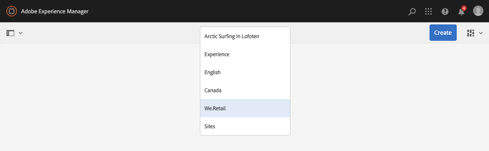

# Snelle gids voor het ontwerpen van pagina&#39;s{#quick-guide-to-authoring-pages}

Deze procedures zijn bedoeld als een snelle (high-level) gids voor de belangrijkste acties van het ontwerpen van pagina-inhoud in AEM.

Ze:

* Niet bedoeld als een volledige dekking.
* Koppelingen naar de gedetailleerde documentatie maken.

Zie voor meer informatie over ontwerpen met AEM:

* [Eerste stappen voor auteurs](/help/sites-authoring/first-steps.md)
* [Pagina&#39;s ontwerpen](/help/sites-authoring/page-authoring.md)

## Enkele snelle tips {#a-few-quick-hints}

Voordat u het overzicht van de details geeft, is er een kleine verzameling algemene tips en tips die het overwegen waard zijn.

### Sites-console {#sites-console}

* **Maken**

   * Deze knoop is beschikbaar in vele consoles - de voorgestelde opties zijn contextgevoelig zodat kan variëren afhankelijk van het scenario.

* Pagina&#39;s in een map opnieuw ordenen

   * Dit kan worden gedaan in de [Lijstweergave](/help/sites-authoring/basic-handling.md#list-view). De wijzigingen worden toegepast en zijn zichtbaar in andere weergaven.

#### Pagina&#39;s ontwerpen {#page-authoring}

* Navigeren door koppelingen

   * ***Koppelingen zijn niet beschikbaar voor navigatie*** in de modus **Bewerken** . Als u wilt navigeren met koppelingen, moet u een [voorvertoning van de pagina](/help/sites-authoring/editing-content.md#previewing-pages) weergeven met:

      * [Voorvertoningsmodus](/help/sites-authoring/editing-content.md#preview-mode)
      * [Weergeven als gepubliceerd](/help/sites-authoring/editing-content.md#view-as-published)

* Versies worden niet gestart of gemaakt in de paginaeditor. dit wordt nu gedaan van de console van Plaatsen (via of **creeer** of [Chronologie](/help/sites-authoring/basic-handling.md#timeline) voor een geselecteerde middel).

>[!NOTE]
>
>Er zijn een aantal sneltoetsen die de ontwerpervaring kunnen vereenvoudigen.
>
>* [Sneltoetsen bij het bewerken van pagina&#39;s](/help/sites-authoring/page-authoring-keyboard-shortcuts.md)
>* [Sneltoetsen voor consoles](/help/sites-authoring/keyboard-shortcuts.md)
>

### Uw pagina zoeken {#finding-your-page}

Het zoeken naar een pagina kent verschillende aspecten. u kunt navigeren en/of zoeken:

1. Open de **Sites** -console (met de optie **Sites** in de [globale navigatie](/help/sites-authoring/basic-handling.md#global-navigation) - deze wordt geactiveerd (vervolgkeuzelijst) wanneer u de koppeling Adobe Experience Manager (linksboven) selecteert.

1. Navigeer omlaag door op de desbetreffende pagina te tikken of te klikken. Hoe de paginabronnen worden vertegenwoordigd, is afhankelijk van de weergave die u gebruikt: [Kaart, Lijst of Kolom](/help/sites-authoring/basic-handling.md#viewing-and-selecting-resources):

   

1. Navigeer omhoog de boom gebruikend [de broodkruimel in de kopbal](/help/sites-authoring/basic-handling.md#theheaderwithbreadcrumbs), die u toestaat om aan de geselecteerde plaats terug te keren:

   

1. U kunt ook naar een pagina [zoeken](/help/sites-authoring/search.md) . U kunt de pagina selecteren in de weergegeven resultaten.

   

### Een nieuwe pagina maken {#creating-a-new-page}

Een nieuwe pagina maken:

1. [Navigeer naar de locatie](#finding-your-page) waar u de nieuwe pagina wilt maken.
1. Gebruik het pictogram **Maken** en selecteer vervolgens **Pagina** in de lijst:

   

1. Hierdoor wordt de wizard geopend die u begeleidt bij het verzamelen van de benodigde informatie voor het [maken van uw nieuwe pagina](/help/sites-authoring/managing-pages.md#creating-a-new-page). Volg de aanwijzingen op het scherm.

### Uw pagina selecteren voor verdere actie {#selecting-your-page-for-further-action}

U kunt een pagina selecteren zodat u actie kunt ondernemen. Als u een pagina selecteert, wordt de werkbalk automatisch bijgewerkt, zodat de acties die voor die bron relevant zijn, worden weergegeven.

Hoe te om een pagina te selecteren hangt van welke mening af u in de console gebruikt:

1. Kolomweergave:

   * Tik/klik op de miniatuur voor de vereiste bron - de miniatuur wordt bedekt met een verdeelstreepje om aan te geven dat deze is geselecteerd.

1. Lijstweergave:

   * Tik/klik op de miniatuur voor de vereiste bron - de miniatuur wordt bedekt met een verdeelstreepje om aan te geven dat deze is geselecteerd.

1. Kaartweergave:

   * Ga selectiemodus door het vereiste middel [te](/help/sites-authoring/basic-handling.md#viewingandselectingyourresources) selecteren met:

      * Mobiel apparaat: tikken en vasthouden
      * Desktop: de [snelle actie](/help/sites-authoring/basic-handling.md#quick-actions) - tik pictogram :
   

   * De kaart wordt bedekt met een vinkje om aan te geven dat de pagina is geselecteerd.
   >[!NOTE]
   >
   >In de selectiemodus verandert het pictogram **Selecteren** (een vinkje) in het pictogram **Selectie** opheffen (een kruis).

### Snelle handelingen (alleen kaartweergave/bureaublad) {#quick-actions-card-view-desktop-only}

[Er zijn snelle acties](/help/sites-authoring/basic-handling.md#quick-actions) beschikbaar:

1. [Navigeer naar de pagina](#finding-your-page) waarop u actie wilt ondernemen.
1. Houd de muisaanwijzer boven de kaart die uw vereiste bron vertegenwoordigt; de snelle acties worden weergegeven :

   

### De pagina-inhoud bewerken {#editing-your-page-content}

Uw pagina bewerken:

1. [Navigeer naar de pagina](#finding-your-page) die u wilt bewerken.
1. [Open de pagina voor bewerking](/help/sites-authoring/managing-pages.md#opening-a-page-for-editing) met het pictogram Bewerken (potlood):

   

   Dit is toegankelijk via:

   * [Snelle acties (alleen Kaartweergave/Bureaublad)](#quick-actions-card-view-desktop-only) voor de juiste bron.
   * De werkbalk wanneer de [pagina is geselecteerd](#selectiingyourpageforfurtheraction).

1. Wanneer de editor wordt geopend, kunt u:

   * [Voeg een nieuwe compensatie aan uw pagina](/help/sites-authoring/editing-content.md#inserting-a-component) toe door:

      * openen, zijpaneel
      * het selecteren van het componentenlusje ( [componentenbrowser](/help/sites-authoring/author-environment-tools.md#components-browser))
      * Sleep de vereiste component naar de pagina.
      Het zijpaneel kan worden geopend (en gesloten) met:
   

   * [Bewerk de inhoud van een bestaande component](/help/sites-authoring/editing-content.md#edit-configure-copy-cut-delete-paste) op de pagina:

      * Open de werkbalk van de component met Tik of klik. Open het dialoogvenster met het pictogram **Bewerken** (potlood).
      * Open de editor op plaats voor de component met Tikken en vasthouden of dubbelklikken. De beschikbare acties worden weergegeven (voor sommige componenten is dit een beperkte selectie).
      * U kunt als volgt alle beschikbare acties weergeven:
   

   * [De eigenschappen van een bestaande component configureren](/help/sites-authoring/editing-content.md#component-edit-dialog)

      * Open de werkbalk van de component met Tik of klik. Gebruik het pictogram **Configureren** (sleutel) om het dialoogvenster te openen.
   * [Een component](/help/sites-authoring/editing-content.md#moving-a-component) verplaatsen:

      * Sleep de vereiste component naar de nieuwe locatie.
      * Open de werkbalk van de component met Tik of klik. Gebruik de pictogrammen **Knippen** en **Plakken** waar nodig.
   * [Een component kopiëren (en plakken)](/help/sites-authoring/editing-content.md#edit-configure-copy-cut-delete-paste) :

      * Open de werkbalk van de component met Tik of klik. Gebruik de pictogrammen **Kopiëren** en **Plakken** naar wens.
   >[!NOTE]
   >
   >U kunt componenten op dezelfde pagina of op een andere pagina **plakken** . Als u plakt naar een andere pagina die al was geopend vóór de knip-/kopieerbewerking, moet de pagina worden vernieuwd.

   * [Een component verwijderen](/help/sites-authoring/editing-content.md#edit-configure-copy-cut-delete-paste) :

      * Open de werkbalk van de component met Tik of klik en gebruik vervolgens het pictogram **Verwijderen** .
   * [Annotaties](/help/sites-authoring/annotations.md#annotations) toevoegen aan de pagina:

      * Selecteer de modus **Annoteren** (pictogram spraakballon). Annotaties toevoegen met het pictogram **Annotatie** toevoegen (plus). Sluit de annotatiemodus af met behulp van de X rechtsboven.
   

   * [Een voorvertoning van een pagina](/help/sites-authoring/editing-content.md#preview-mode) weergeven (om te zien hoe deze wordt weergegeven in de publicatieomgeving)

      * Selecteer **Voorvertoning** op de werkbalk.
   * Ga terug naar de bewerkingsmodus (of selecteer een andere modus) met de vervolgkeuzelijst **Bewerken** .
   >[!NOTE]
   >
   >Als u wilt navigeren met koppelingen in de inhoud, moet u de modus [Voorvertoning](/help/sites-authoring/editing-content.md#preview-mode)gebruiken.

### De pagina-eigenschappen bewerken {#editing-the-page-properties}

Er zijn twee (hoofd)methoden voor het [bewerken van pagina-eigenschappen](/help/sites-authoring/editing-page-properties.md):

* Vanuit de **Sites** -console:

   1. [Navigeer naar de pagina](#finding-your-page) die u wilt publiceren.
   1. Selecteer het pictogram **Eigenschappen** op een van de volgende manieren:

      * [Snelle acties (alleen Kaartweergave/Bureaublad)](#quick-actions-card-view-desktop-only) voor de juiste bron.
      * De werkbalk wanneer de [pagina is geselecteerd](#selectiingyourpageforfurtheraction).
   

   1. De pagina-eigenschappen worden weergegeven. U kunt naar wens updates uitvoeren en vervolgens Opslaan gebruiken om deze bij te houden

* Tijdens het [bewerken van de pagina](#editing-your-page-content):

   1. Open het menu **Pagina-informatie** .
   1. Selecteer Eigenschappen **** openen om het dialoogvenster voor het bewerken van de eigenschappen te openen.
   

### Uw pagina publiceren (of Publiceren ongedaan maken) {#publishing-your-page-or-unpublishing}

Er zijn twee hoofdmethoden om uw pagina [te](/help/sites-authoring/publishing-pages.md) publiceren (en om de publicatie ongedaan te maken):

* Vanuit de **Sites** -console:

   1. [Navigeer naar de pagina](#finding-your-page) die u wilt publiceren.
   1. Selecteer het pictogram **Snel publiceren** op een van de volgende manieren:

      * [Snelle acties (alleen Kaartweergave/Bureaublad)](#quick-actions-card-view-desktop-only) voor de juiste bron.
      * De werkbalk wanneer de [pagina is geselecteerd](#selectiingyourpageforfurtheraction) (geeft ook toegang tot [Later](/help/sites-authoring/publishing-pages.md#main-pars-title-12)publiceren).
   

* Tijdens het [bewerken van de pagina](#editing-your-page-content):

   1. Open het menu **Pagina-informatie** .
   1. Selecteer **Pagina** publiceren.
   

* U kunt het publiceren van een pagina vanuit de console alleen ongedaan maken via de optie Publicatie **** beheren, die alleen beschikbaar is op de werkbalk (niet via de snelle handelingen).

   De optie **Publicatie van pagina** ongedaan maken is nog steeds beschikbaar via het menu **Pagina-informatie** in de editor.

   

   Zie Pagina&#39;s  publiceren voor meer informatie.

### De pagina verplaatsen, kopiëren en plakken of verwijderen {#move-copy-and-paste-or-delete-your-page}

Deze acties kunnen allemaal worden geactiveerd door:

1. [Navigeer naar de pagina](#finding-your-page) die u wilt verplaatsen, kopiëren en plakken of verwijderen.
1. Selecteer het pictogram Kopiëren (en vervolgens plakken), Verplaatsen of Verwijderen naar wens met een van de volgende methoden:

   * [Snelle handelingen (alleen Kaartweergave/Bureaublad)](#quick-actions-card-view-desktop-only) voor de vereiste bron.
   * De werkbalk wanneer de [pagina is geselecteerd](#selecting-your-page-for-further-action).
   Afhankelijk van uw handeling:

   * Kopiëren:

      * Vervolgens moet u naar de nieuwe locatie navigeren en plakken.
   * Verplaatsen:

      * De wizard wordt geopend om de gegevens te verzamelen die nodig zijn om de pagina te verplaatsen. Volg de aanwijzingen op het scherm.
   * Verwijderen:

      * U wordt gevraagd de actie te bevestigen.
   >[!NOTE]
   >
   >Verwijderen is niet beschikbaar als een snelle handeling.

### De pagina vergrendelen (en vervolgens ontgrendelen) {#locking-your-page-then-unlocking}

[Door een pagina](/help/sites-authoring/editing-content.md#locking-a-page) te vergrendelen voorkomt u dat andere auteurs er tijdens het vergrendelen aan werken. Het pictogram/de knop Vergrendelen (en Ontgrendelen) vindt u:

* De werkbalk wanneer de [pagina is geselecteerd](#selecting-your-page-for-further-action).
* Het vervolgkeuzemenu  Pagina-informatie wanneer u een pagina bewerkt.
* De pagina-werkbalk tijdens het bewerken van een pagina (wanneer de pagina is vergrendeld)

Het vergrendelingspictogram ziet er bijvoorbeeld als volgt uit:

### Paginaverwijzingen openen {#accessing-page-references}

[Snelle toegang tot verwijzingen](/help/sites-authoring/author-environment-tools.md#references) naar/van een pagina is beschikbaar in de Rail van Verwijzingen.

1. Selecteer **Verwijzingen** met het werkbalkpictogram (voor of na het [selecteren van de pagina](#selecting-your-page-for-further-action)):

   

   Er wordt een lijst met referentietypen weergegeven:

   

1. Tik/klik op het gewenste type verwijzing om meer details weer te geven en (indien van toepassing) verdere acties te ondernemen.

### Een versie van uw pagina maken {#creating-a-version-of-your-page}

Een [versie](/help/sites-authoring/working-with-page-versions.md) van de pagina maken:

1. Als u de tijdlijntrack wilt openen, selecteert u de **[tijdlijn](/help/sites-authoring/basic-handling.md#timeline)**met het werkbalkpictogram (voor of na het[selecteren van de pagina](#selecting-your-page-for-further-action)):

   

1. Tik/klik op de pijl-omhoog rechtsonder in de kolom Tijdlijn om extra knoppen weer te geven, waaronder **Opslaan als versie**.

   

1. Selecteer **Opslaan als versie** en **Maken**.

### Een versie van uw pagina herstellen/vergelijken {#restoring-comparing-a-version-of-your-page}

Hetzelfde basismechanisme wordt gebruikt bij het herstellen en/of vergelijken van versies van uw pagina:

1. Selecteer **[Tijdlijn](/help/sites-authoring/basic-handling.md#timeline)**met het werkbalkpictogram (voor of na het[selecteren van de pagina](#selecting-your-page-for-further-action)):

   

   Als er al een versie van de pagina is opgeslagen, wordt deze weergegeven in de tijdlijn.

1. Tik/klik op de versie die u wilt herstellen. Hier worden extra actieknoppen weergegeven:

   * **Deze versie herstellen**

      * De versie wordt hersteld.
   * **Verschillen tonen**

      * De pagina wordt geopend met de verschillen (tussen de twee versies) gemarkeerd.
