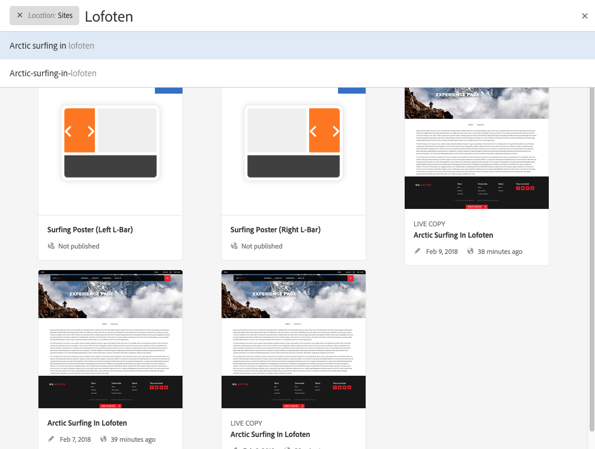
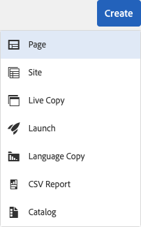

# Snelle gids voor het ontwerpen van pagina&#39;s{#quick-guide-to-authoring-pages}

Deze procedures zijn bedoeld als een snelle (high-level) gids voor de belangrijkste acties van het ontwerpen van pagina-inhoud in AEM.

Ontwikkelaars:

* Niet bedoeld als een volledige dekking.
* Koppelingen naar de gedetailleerde documentatie maken.

Zie voor meer informatie over ontwerpen met AEM:

* [Eerste stappen voor auteurs](/help/sites-authoring/first-steps.md)
* [Pagina&#39;s ontwerpen](/help/sites-authoring/page-authoring.md)

## Enkele snelle tips {#a-few-quick-hints}

Voordat u het overzicht van de details geeft, is er een kleine verzameling algemene tips en tips die het overwegen waard zijn.

### Sites-console {#sites-console}

* **creeer**

   * Deze knoop is beschikbaar in vele consoles - de voorgestelde opties zijn contextgevoelig zodat kan variëren afhankelijk van het scenario.

* Pagina&#39;s in een map opnieuw ordenen

   * Dit kan in [&#x200B; Mening van de Lijst &#x200B;](/help/sites-authoring/basic-handling.md#list-view) worden gedaan. De wijzigingen worden toegepast en zichtbaar in andere weergaven.

#### Pagina&#39;s ontwerpen {#page-authoring}

* Navigeren door koppelingen

   * ***de Verbindingen zijn niet beschikbaar voor navigatie*** wanneer u op **bent geef** wijze uit. Om met verbindingen te navigeren, moet u [&#x200B; voorproef de pagina &#x200B;](/help/sites-authoring/editing-content.md#previewing-pages) gebruiken of:

      * [Voorvertoningsmodus](/help/sites-authoring/editing-content.md#preview-mode)
      * [Weergeven als gepubliceerd](/help/sites-authoring/editing-content.md#view-as-published)

* De versies zijn niet begonnen/gecreeerd van de paginaredacteur; dit wordt nu gedaan van de console van Plaatsen (via of **creeer** of [&#x200B; Chronologie &#x200B;](/help/sites-authoring/basic-handling.md#timeline) voor een geselecteerd middel).

>[!NOTE]
>
>Er zijn verschillende sneltoetsen waarmee u het schrijven van documenten eenvoudiger kunt maken.
>
>* [&#x200B; Kortere weg van het Toetsenbord wanneer het uitgeven van Pagina&#39;s &#x200B;](/help/sites-authoring/page-authoring-keyboard-shortcuts.md)
>* [&#x200B; Kortere weg van het Toetsenbord voor Consoles &#x200B;](/help/sites-authoring/keyboard-shortcuts.md)
>

### Uw pagina zoeken {#finding-your-page}

Er zijn verschillende aspecten om een pagina te zoeken. U kunt navigeren en/of zoeken:

1. Open de **console van Plaatsen** (gebruikend de **optie van Plaatsen** in de [&#x200B; Globale Navigatie &#x200B;](/help/sites-authoring/basic-handling.md#global-navigation)) - dit wordt teweeggebracht (drop-down) wanneer u de verbinding van Adobe Experience Manager (linkerbovenhoek) selecteert.

1. Navigeer omlaag door op de desbetreffende pagina te tikken of te klikken. Hoe de paginabronnen van de mening afhankelijk zijn u gebruikt - [&#x200B; Kaart, Lijst, of Kolom &#x200B;](/help/sites-authoring/basic-handling.md#viewing-and-selecting-resources):

   

1. Navigeer omhoog de boom gebruikend [&#x200B; breadcrumb in de kopbal &#x200B;](/help/sites-authoring/basic-handling.md#theheaderwithbreadcrumbs), die u aan de geselecteerde plaats laat terugkeren:

   

1. U kunt [&#128279;](/help/sites-authoring/search.md) voor een pagina ook zoeken. U kunt de pagina selecteren in de weergegeven resultaten.

   

### Een nieuwe pagina maken {#creating-a-new-page}

Om [&#x200B; tot een pagina &#x200B;](/help/sites-authoring/managing-pages.md#creating-a-new-page) te leiden:

1. [&#x200B; navigeer aan de plaats &#x200B;](#finding-your-page) waar u de pagina wilt tot stand brengen.
1. Gebruik **creeer** pictogram en selecteer dan **Pagina** van de lijst:

   

1. Dit opent de tovenaar die u door het verzamelen van de informatie nodig zal begeleiden wanneer [&#x200B; creërend uw nieuwe pagina &#x200B;](/help/sites-authoring/managing-pages.md#creating-a-new-page). Volg de aanwijzingen op het scherm.

### Uw pagina selecteren voor verdere actie {#selecting-your-page-for-further-action}

U kunt een pagina selecteren zodat u actie kunt ondernemen. Als u een pagina selecteert, wordt de werkbalk automatisch bijgewerkt, zodat de acties die voor die bron relevant zijn, worden weergegeven.

Hoe te om een pagina te selecteren hangt van welke mening af u in de console gebruikt:

1. Kolomweergave:

   * Klik op de miniatuur voor de vereiste bron. De miniatuur wordt met een vinkje bedekt om aan te geven dat deze is geselecteerd.

1. Lijstweergave:

   * Klik op de miniatuur voor de vereiste bron. De miniatuur wordt met een vinkje bedekt om aan te geven dat deze is geselecteerd.

1. Kaartweergave:

   * Ga selectiewijze door [&#x200B; selecterend het vereiste middel &#x200B;](/help/sites-authoring/basic-handling.md#viewingandselectingyourresources) met in:

      * Mobiel apparaat: selecteren en vasthouden
      * Desktop: de [&#x200B; snelle actie &#x200B;](/help/sites-authoring/basic-handling.md#quick-actions) - tikpictogram:

   

   * De kaart wordt bedekt met een vinkje om aan te geven dat de pagina is geselecteerd.

   >[!NOTE]
   >
   >Zodra op selectiemodus **Uitgezochte** pictogram (een tikje) in **zal veranderen schrap** pictogram (een kruis).

### Snelle handelingen (alleen kaartweergave/bureaublad) {#quick-actions-card-view-desktop-only}

[&#x200B; Snelle acties &#x200B;](/help/sites-authoring/basic-handling.md#quick-actions) zijn beschikbaar:

1. [&#x200B; navigeer aan de pagina &#x200B;](#finding-your-page) u actie op wilt nemen.
1. Plaats de muisaanwijzer op de kaart die uw vereiste bron vertegenwoordigt. De snelle acties worden getoond:

   

### De pagina-inhoud bewerken {#editing-your-page-content}

1. [&#x200B; navigeer aan de pagina &#x200B;](#finding-your-page) u wilt uitgeven.
1. [&#x200B; open uw pagina voor het uitgeven &#x200B;](/help/sites-authoring/managing-pages.md#opening-a-page-for-editing) gebruikend het Edit (potlood) pictogram:

   

   Dit is toegankelijk via:

   * [&#x200B; Snelle Acties (de Mening van de Kaart/de Desktop slechts) &#x200B;](#quick-actions-card-view-desktop-only) voor het aangewezen middel.
   * De toolbar wanneer uw [&#x200B; pagina is geselecteerd &#x200B;](#selectiingyourpageforfurtheraction).

1. Wanneer de editor wordt geopend, kunt u:

   * [&#x200B; voeg een nieuwe component aan uw pagina &#x200B;](/help/sites-authoring/editing-content.md#inserting-a-component) toe door:

      * openen, zijpaneel
      * het selecteren van het componentenlusje ([&#x200B; componenten browser &#x200B;](/help/sites-authoring/author-environment-tools.md#components-browser))
      * Sleep de vereiste component naar de pagina.

     Het zijpaneel kan worden geopend (en gesloten) met:

     

   * [&#x200B; geef de inhoud van een bestaande component &#x200B;](/help/sites-authoring/editing-content.md#edit-configure-copy-cut-delete-paste) op de pagina uit:

      * Open de componentwerkbalk met een van de twee klikken. Gebruik **uitgeven** (potlood) pictogram om de dialoog te openen.
      * Open de op plaats-editor voor de component met select-and-hold of een dubbelklik. De beschikbare acties worden weergegeven (voor sommige componenten is dit een beperkte selectie).
      * Als u alle beschikbare acties wilt weergeven, opent u de modus Volledig scherm met:

     

   * [De eigenschappen van een bestaande component configureren](/help/sites-authoring/editing-content.md#component-edit-dialog)

      * Open de componentwerkbalk met een van de twee klikken. Gebruik **vormen** (moersleutel) pictogram &lbrace;om de dialoog te openen.

   * [&#x200B; Beweeg een component &#x200B;](/help/sites-authoring/editing-content.md#moving-a-component) of:

      * Sleep de vereiste component naar de nieuwe locatie.
      * Open de componentwerkbalk met een van de twee klikken. Gebruik **besnoeiing** toen **&#x200B;**&#x200B;pictogrammen van het Deeg waar nodig.

   * [&#x200B; Exemplaar (en Deeg) &#x200B;](/help/sites-authoring/editing-content.md#edit-configure-copy-cut-delete-paste) een component:

      * Open de componentwerkbalk met een van de twee klikken. Gebruik **toen** **pictogrammen van het Exemplaar** &lbrace;van het Deeg zoals vereist.

   >[!NOTE]
   >
   >U kunt **componenten van 0&rbrace; Deeg &lbrace;aan of de zelfde pagina, of een verschillende pagina.** Als u plakt naar een andere pagina die al was geopend vóór de knip-/kopieerbewerking, moet de pagina worden vernieuwd.

   * [&#x200B; Schrap &#x200B;](/help/sites-authoring/editing-content.md#edit-configure-copy-cut-delete-paste) een component:

      * Open de componententoolbar met of klik, dan gebruik het **pictogram van de Schrapping**.

   * [&#x200B; voeg annotaties &#x200B;](/help/sites-authoring/annotations.md#annotations) aan de pagina toe:

      * Selecteer **annoteren** wijze (het pictogram van de toespraakbel). Voeg annotaties toe gebruikend **annotatie** (plus) pictogram toevoegt. Sluit de annotatiemodus af met behulp van de X rechtsboven.

     

   * [&#x200B; Voorproef een pagina &#x200B;](/help/sites-authoring/editing-content.md#preview-mode) (om te zien hoe het in het publicatiemilieu zal verschijnen)

      * Selecteer **Voorproef** van de toolbar.

   * Terugkeer om wijze (of een andere wijze) uit te geven gebruikend **uitgeeft** drop-down selecteur.

   >[!NOTE]
   >
   >Om het gebruiken van verbindingen in de inhoud te navigeren, moet u [&#x200B; wijze van de Voorproef &#x200B;](/help/sites-authoring/editing-content.md#preview-mode) gebruiken.

### De pagina-eigenschappen bewerken {#editing-the-page-properties}

Er zijn twee (belangrijkste) methodes van [&#x200B; het uitgeven van paginaeigenschappen &#x200B;](/help/sites-authoring/editing-page-properties.md):

* Van de **console van Plaatsen**:

   1. [&#x200B; navigeer aan de pagina &#x200B;](#finding-your-page) u wilt publiceren.
   1. Selecteer het **pictogram van Eigenschappen** van één van beiden:

      * [&#x200B; Snelle Acties (de Mening van de Kaart/de Desktop slechts) &#x200B;](#quick-actions-card-view-desktop-only) voor het aangewezen middel.
      * De toolbar wanneer uw [&#x200B; pagina is geselecteerd &#x200B;](#selectiingyourpageforfurtheraction).

  

   1. De pagina-eigenschappen worden weergegeven. U kunt naar wens updates uitvoeren en vervolgens Opslaan gebruiken om deze bij te houden

* Wanneer [&#x200B; het uitgeven van uw pagina &#x200B;](#editing-your-page-content):

   1. Open het **menu van de Informatie van de Pagina**.
   1. Selecteer **Open Eigenschappen** om de dialoog voor het uitgeven van de eigenschappen te openen.

  

### Uw pagina publiceren (of Publiceren ongedaan maken) {#publishing-your-page-or-unpublishing}

Er zijn twee belangrijkste methodes van [&#x200B; het publiceren van uw pagina &#x200B;](/help/sites-authoring/publishing-pages.md) (en ook van unpublishing):

* Van de **console van Plaatsen**:

   1. [&#x200B; navigeer aan de pagina &#x200B;](#finding-your-page) u wilt publiceren.
   1. Selecteer het **Snelle Publish** pictogram van één van beiden:

      * [&#x200B; Snelle Acties (de Mening van de Kaart/de Desktop slechts) &#x200B;](#quick-actions-card-view-desktop-only) voor het aangewezen middel.
      * De toolbar wanneer uw [&#x200B; pagina is geselecteerd &#x200B;](#selectiingyourpageforfurtheraction) (geeft ook toegang tot [&#x200B; Publish later &#x200B;](/help/sites-authoring/publishing-pages.md#main-pars-title-12)).

  

* Wanneer [&#x200B; het uitgeven van uw pagina &#x200B;](#editing-your-page-content):

   1. Open het **menu van de Informatie van de Pagina**.
   1. Selecteer **de Pagina van Publish**.

  

* U kunt het publiceren van een pagina vanuit de console alleen ongedaan maken via de optie **Publicatie beheren**, die alleen beschikbaar is op de werkbalk (niet via de snelle acties).

  De **unpublish optie van de Pagina** is nog beschikbaar via het **menu van de Informatie van de Pagina** in de redacteur.

  

  Zie [&#x200B; het Publiceren Pagina&#39;s &#x200B;](/help/sites-authoring/publishing-pages.md#unpublishing-pages) voor meer informatie.

### De pagina verplaatsen, kopiëren en plakken of verwijderen {#move-copy-and-paste-or-delete-your-page}

Deze acties kunnen allemaal worden geactiveerd door:

1. [&#x200B; navigeer aan de pagina &#x200B;](#finding-your-page) u wilt bewegen, kopiëren en, of schrappen.
1. Selecteer het pictogram voor kopiëren (en vervolgens plakken), verplaatsen of verwijderen naar wens met een van de volgende methoden:

   * [&#x200B; Snelle Acties (de Mening van de Kaart/de Desktop slechts) &#x200B;](#quick-actions-card-view-desktop-only) voor het vereiste middel.
   * De toolbar wanneer uw [&#x200B; pagina is geselecteerd &#x200B;](#selecting-your-page-for-further-action).

   Afhankelijk van uw handeling:

   * Kopiëren:

      * Navigeer naar de nieuwe locatie en plak.

   * Verplaatsen:

      * De wizard wordt geopend om de informatie te verzamelen die nodig is om de pagina te verplaatsen. Volg de aanwijzingen op het scherm.

   * Verwijderen:

      * U wordt gevraagd de actie te bevestigen.

   >[!NOTE]
   >
   >Verwijderen is niet beschikbaar als een snelle handeling.

### De pagina vergrendelen (en vervolgens ontgrendelen) {#locking-your-page-then-unlocking}

[Door een pagina te vergrendelen](/help/sites-authoring/editing-content.md#locking-a-page) voorkomt u dat andere auteurs op hetzelfde moment als u op de pagina kunnen werken. Het pictogram/de knop Vergrendelen (en Ontgrendelen) vindt u hier:

* De toolbar wanneer uw [&#x200B; pagina is geselecteerd &#x200B;](#selecting-your-page-for-further-action).
* Het [&#x200B; drop-down menu van de Informatie van de Pagina &#x200B;](#editing-the-page-properties) wanneer het uitgeven van een pagina.
* De pagina-werkbalk tijdens het bewerken van een pagina (wanneer de pagina is vergrendeld)

Het slotpictogram ziet er bijvoorbeeld als volgt uit:

### Paginaverwijzingen openen {#accessing-page-references}

[&#x200B; de Snelle toegang tot verwijzingen &#x200B;](/help/sites-authoring/author-environment-tools.md#references) aan een pagina of van een pagina is beschikbaar in het Rail van Verwijzingen.

1. Selecteer **Verwijzingen** gebruikend het toolbarpictogram (of vóór of na [&#x200B; het selecteren van uw pagina &#x200B;](#selecting-your-page-for-further-action)):

   

   Er wordt een lijst met referentietypen weergegeven:

   

1. Klik op het gewenste type verwijzing om meer details weer te geven en (indien van toepassing) verdere acties te ondernemen.

### Een versie van uw pagina maken {#creating-a-version-of-your-page}

Om a [&#x200B; versie &#x200B;](/help/sites-authoring/working-with-page-versions.md) van uw pagina tot stand te brengen:

1. Om het spoor van de Chronologie te openen, selecteer **[Chronologie](/help/sites-authoring/basic-handling.md#timeline)** gebruikend het toolbarpictogram (of vóór of na [&#x200B; het selecteren van uw pagina &#x200B;](#selecting-your-page-for-further-action)):

   

1. Klik op de pijl-omhoog rechtsonder in de kolom Tijdlijn om extra knoppen weer te geven, inclusief **Opslaan als versie** .

   

1. Selecteer **sparen als Versie**, dan **creeer**.

### Een versie van uw pagina herstellen/vergelijken {#restoring-comparing-a-version-of-your-page}

Hetzelfde basismechanisme wordt gebruikt bij het herstellen en/of vergelijken van versies van uw pagina:

1. Selecteer **[Chronologie](/help/sites-authoring/basic-handling.md#timeline)** gebruikend het toolbarpictogram (of vóór of na [&#x200B; het selecteren van uw pagina &#x200B;](#selecting-your-page-for-further-action)):

   

   Als er al een versie van de pagina is opgeslagen, wordt deze weergegeven in de tijdlijn.

1. Klik op de versie die u wilt herstellen. Hier worden extra knoppen voor handelingen weergegeven:

   * **keert aan deze Versie** terug

      * De versie wordt hersteld.

   * **toon Verschillen**

      * De pagina wordt geopend met de verschillen (tussen de twee versies) gemarkeerd.
