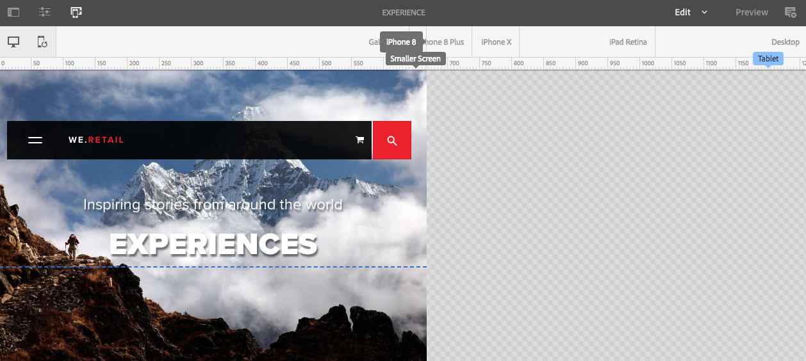

# Responsieve lay-out{#responsive-layout}

Met AEM kunt u een responsieve indeling voor uw pagina&#39;s gebruiken met behulp van de **Layout Container** component.

Dit biedt een alineasysteem waarmee u componenten binnen een responsief raster kunt plaatsen. Met dit raster kunt u de lay-out opnieuw rangschikken op basis van de grootte en de indeling van het apparaat/venster. De component wordt gebruikt in combinatie met de [**Layout** mode](/help/sites-authoring/responsive-layout.md#defining-layouts-layout-mode), waarmee u uw responsieve lay-out afhankelijk van het apparaat kunt maken en bewerken.

De container layout:

* Biedt een horizontale uitlijning op het raster, samen met de mogelijkheid om componenten naast elkaar in het raster te plaatsen en te bepalen wanneer ze moeten samenvouwen/opnieuw plaatsen.
* Gebruikt vooraf gedefinieerde onderbrekingspunten (bijvoorbeeld voor telefoon, tablet, enzovoort) om het vereiste gedrag van inhoud voor verwante apparaten/oriëntatie te kunnen definiëren.

   * U kunt bijvoorbeeld de grootte van de component aanpassen of de component zichtbaar is op bepaalde apparaten.

* Kan worden genest om kolombesturing toe te staan.

De gebruiker kan dan zien hoe de inhoud wordt gerenderd voor specifieke apparaten met de emulator.

>[!CAUTION]
>
>Hoewel de component Layout Container beschikbaar is in de klassieke gebruikersinterface, is de volledige functionaliteit alleen beschikbaar en ondersteund in de interface met aanraakbediening.

AEM realiseert responsieve lay-out voor uw pagina&#39;s gebruikend een combinatie mechanismen:

* [**Layout Container**](#adding-a-layout-container-and-its-content-edit-mode) component

  Deze component is beschikbaar in het dialoogvenster [componentbrowser](/help/sites-authoring/author-environment-tools.md#components-browser) en biedt een rasteralineasysteem waarmee u componenten kunt toevoegen en positioneren binnen een responsief raster. Deze kan ook als het standaardalineasysteem op de pagina worden ingesteld.

* [**Lay-outmodus**](/help/sites-authoring/responsive-layout.md#defining-layouts-layout-mode)

  Als de lay-outcontainer eenmaal op de pagina is geplaatst, kunt u de opdracht **Layout** om de inhoud binnen het responsieve raster te plaatsen.

* [**Emulator**](#selecting-a-device-to-emulate)
Zo kunt u responsieve websites maken en bewerken die de lay-out op basis van de grootte van het apparaat of venster opnieuw rangschikken door de grootte van componenten interactief aan te passen. De gebruiker kan dan zien hoe de inhoud wordt gerenderd met de emulator.

Met deze responsieve rastermechanismen kunt u:

* Gebruik onderbrekingspunten om verschillende inhoudslay-outs te definiëren op basis van de apparaatbreedte (afhankelijk van het apparaattype en de oriëntatie).
* Gebruik dezelfde onderbrekingspunten en inhoudelay-outs om ervoor te zorgen dat de inhoud reageert op de grootte van het browservenster op het bureaublad.
* Gebruik Horizontaal magnetisch raster om componenten in het raster te plaatsen, de grootte desgewenst aan te passen en te bepalen wanneer ze naast elkaar of boven/onder moeten samenvouwen/opnieuw moeten plaatsen.
* Componenten verbergen voor specifieke apparaatlay-outs.
* Kolombesturingselement realiseren.

Afhankelijk van uw project, zou de Container van de Lay-out als standaardparagraafsysteem voor uw pagina&#39;s of als component beschikbaar kunnen worden gebruikt om aan uw pagina via componentenbrowser (of allebei) worden toegevoegd.

>[!NOTE]
>
>Adobe biedt [GitHub-documentatie](https://adobe-marketing-cloud.github.io/aem-responsivegrid/) van de responsieve lay-out als verwijzing die aan front-end ontwikkelaars kan worden gegeven die hen toestaan om het AEM net buiten AEM te gebruiken, bijvoorbeeld, wanneer het creëren van statische HTML mock-ups voor een toekomstige AEM plaats.

>[!NOTE]
>
>Het gebruik van de bovenstaande mechanismen wordt ingeschakeld door configuratie op de sjabloon. Zie [Responsieve lay-out configureren](/help/sites-administering/configuring-responsive-layout.md) voor nadere informatie.

## Lay-outdefinities, Apparaatemulatie en Onderbrekingspunten {#layout-definitions-device-emulation-and-breakpoints}

Wanneer u uw website-inhoud maakt, moet u ervoor zorgen dat uw inhoud correct wordt weergegeven voor het apparaat dat wordt gebruikt om de inhoud weer te geven.

Met AEM kunt u lay-outs definiëren die afhankelijk zijn van de breedte van het apparaat:

* Met de emulator kunt u deze lay-outs emuleren op een reeks apparaten. Naast het apparaattype is de stand geselecteerd door de **Apparaat draaien** kan dit invloed hebben op het geselecteerde onderbrekingspunt wanneer de breedte verandert.
* Onderbrekingspunten zijn de punten die de layoutdefinities scheiden.

   * Ze definiëren in feite de maximale breedte (in pixels) van elk apparaat met een specifieke layout.
   * De onderbrekingspunten zijn gewoonlijk geldig voor een selectie van apparaten, afhankelijk van de breedte van hun vertoningen.
   * Het bereik van een onderbrekingspunt loopt door tot het volgende onderbrekingspunt.
   * U kunt het onderbrekingspunt niet specifiek selecteren, zal selecteren een apparaat en de richtlijn automatisch het aangewezen breekpunt selecteren.

Het apparaat **Desktop**, die geen specifieke breedte heeft, heeft betrekking op het standaardbreekpunt (dat wil zeggen alles boven het laatst geconfigureerde onderbrekingspunt).

>[!NOTE]
>
>Het zou mogelijk zijn om breekpunten voor elk individueel apparaat te bepalen, maar dit zou drastisch de inspanning die voor lay-outdefinitie en onderhoud wordt vereist verhogen.

Wanneer u de emulator gebruikt, selecteert u een specifiek apparaat voor de definitie van emulatie en layout en wordt het desbetreffende onderbrekingspunt ook gemarkeerd. Alle layoutwijzigingen die u aanbrengt, zijn van toepassing op andere apparaten waarop het onderbrekingspunt van toepassing is. Dit zijn apparaten die zich links van de actieve onderbrekingspuntmarkering bevinden, maar vóór de volgende onderbrekingspuntmarkering.

Wanneer u bijvoorbeeld het apparaat selecteert **iPhone 6 Plus** (gedefinieerd met een breedte van 540 pixels) voor emulatie en lay-out, het onderbrekingspunt **Telefoon** (gedefinieerd als 768 pixels) wordt ook geactiveerd. Alle indelingswijzigingen die u aanbrengt voor de **IPHONE 6** van toepassing zijn op andere voorzieningen in het kader van de **Telefoons** onderbrekingspunten, zoals **IPHONE 5** (gedefinieerd als 320 pixels).

## Een apparaat selecteren om te emuleren {#selecting-a-device-to-emulate}

1. Open de vereiste pagina om te bewerken. Bijvoorbeeld:

   `http://localhost:4502/editor.html/content/we-retail/us/en/experience.html`

1. Selecteer de **Emulator** pictogram van de bovenste werkbalk:

   

1. De emulatorwerkbalk wordt geopend.

   

   Op de emulatorwerkbalk worden extra layoutopties weergegeven:

   * **Apparaat draaien** - Hiermee kunt u een apparaat roteren van verticale (staande) richting naar horizontale (liggende) richting en omgekeerd.

      

   * **Apparaat selecteren** - Definieer een specifiek apparaat dat u wilt emuleren vanuit een lijst (zie de volgende stap voor meer informatie)

     

1. Als u een specifiek apparaat wilt selecteren om te emuleren, kunt u:

   * Gebruik het pictogram Apparaat selecteren en selecteer een keuze in een vervolgkeuzelijst.
   * Klik op de apparaatindicator op de emulatorwerkbalk.

   

1. Nadat een specifiek apparaat is geselecteerd, kunt u:

   * Zie de actieve markering voor het geselecteerde apparaat, bijvoorbeeld **iPad.**
   * Zie de actieve markering voor de juiste [breekpunt](/help/sites-authoring/responsive-layout.md#layout-definitions-device-emulation-and-breakpoints) zoals **Tablet.**

   

   * De blauwe stippellijn geeft de *vouwen* voor het geselecteerde apparaat (hier **IPHONE 6**).

   

   * De vouw kan ook worden beschouwd als het pagina-regeleinde (niet te verwarren met het [onderbrekingspunten](/help/sites-authoring/responsive-layout.md#layout-definitions-device-emulation-and-breakpoints)) voor de inhoud. Dit wordt voor het gemak weergegeven om aan te geven welk deel van de inhoud de gebruiker op het apparaat ziet voordat hij of zij schuift.
   * De lijn voor de vouwlijn wordt niet weergegeven als de hoogte van het geëmuleerde apparaat groter is dan de schermgrootte.
   * De vouw wordt getoond voor het gemak van de auteur en niet op de gepubliceerde pagina getoond.

## Een container voor lay-out en de bijbehorende inhoud toevoegen (modus Bewerken) {#adding-a-layout-container-and-its-content-edit-mode}

A **Layout Container** is een alineasysteem dat:

* Bevat andere componenten.
* Definieert de layout.
* Hiermee reageert u op wijzigingen.

>[!NOTE]
>
>Indien niet reeds beschikbaar, **Layout Container** uitdrukkelijk [geactiveerd voor een alineasysteem/pagina](/help/sites-administering/configuring-responsive-layout.md) (bijvoorbeeld door [**Ontwerp** mode](/help/sites-authoring/default-components-designmode.md)).

1. De **lay-outcontainer** is beschikbaar als standaardcomponent in de [componentbrowser](/help/sites-authoring/author-environment-tools.md#components-browser). Van hieruit kunt u het naar de vereiste locatie op de pagina slepen waarna u de tijdelijke aanduiding **Componenten hierheen slepen** zult zien.
1. Vervolgens kunt u componenten aan de lay-outcontainer toevoegen. Deze componenten bevatten de werkelijke inhoud:

   

## Handeling selecteren en uitvoeren in een container Layout (modus Bewerken) {#selecting-and-taking-action-on-a-layout-container-edit-mode}

Net als bij andere componenten kunt u een Layout Container selecteren en vervolgens actie ondernemen (knippen, kopiëren, verwijderen) (wanneer u zich aanmeldt **Bewerken** modus):

>[!CAUTION]
>
>Aangezien een lay-outcontainer een paragraafsysteem is, zal het schrappen van de component zowel het lay-outnet als alle componenten (en hun inhoud) schrappen die binnen de container worden gehouden.

1. Als u de muisaanwijzer boven de tijdelijke aanduiding voor het raster houdt of deze selecteert, wordt het actiemenu weergegeven.

   

   U moet de **Bovenliggend** -optie.

   

1. Als de lay-outcomponent genest is, selecteert u de **Bovenliggend** bevat een vervolgkeuzelijst, waarmee u de geneste lay-outcontainer of de bovenliggende container(s) kunt selecteren.

   Wanneer u de muis boven de containernamen in de vervolgkeuzelijst plaatst, wordt de omtrek van de namen op de pagina weergegeven.

   * De laagste geneste lay-outcontainer wordt omgeven door zwarte omtrekken.
   * De op één na laagste geneste lay-outcontainer zal in donkergrijs zijn.
   * Elke volgende container zal een lichtere grijstint hebben.

   

1. Hierdoor wordt het volledige raster met de inhoud gemarkeerd. De werkbalk Handeling wordt weergegeven, waar u een handeling kunt selecteren, zoals **Verwijderen.**

   

## Indelingen definiëren (modus Indeling) {#defining-layouts-layout-mode}

>[!NOTE]
>
>U kunt een afzonderlijke lay-out definiëren voor elk [breekpunt](#layout-definitions-device-emulation-and-breakpoints) (bepaald aan de hand van het geëmuleerde type en de stand van de voorziening).

Om de lay-out van een ontvankelijk net te vormen dat met de Container van de Lay-out wordt uitgevoerd moet u gebruiken **Layout** -modus.

**Layout** Deze modus kan op twee manieren worden gestart.

* Gebruik het [modusmenu op de werkbalk](/help/sites-authoring/author-environment-tools.md#page-modes) en kies de modus **Lay-out**

   * Selecteer de modus **Lay-out** op dezelfde manier als wanneer u schakelt naar de modus **Bewerken** of de modus **Targeting**.
   * De modus **Lay-out** is permanent en u verlaat de modus **Lay-out** pas wanneer u een andere modus selecteert via de moduskiezer.

* Wanneer [bewerken van een afzonderlijke component.](/help/sites-authoring/editing-content.md#edit-component-layout)

   * Met de opdracht **Layout** in het snelmenu van de component kunt u schakelen naar **Layout** -modus.
   * **Layout** modus blijft bestaan tijdens het bewerken van de component en keert terug naar **Bewerken** modus als focus verandert in een andere component.

In de lay-outmodus kunt u verschillende handelingen op een raster uitvoeren:

* Wijzig de grootte van de inhoudcomponenten met de blauwe stippen. Het resizing zal altijd breken-aan-net. Bij het wijzigen van de grootte wordt het achtergrondraster weergegeven als hulpmiddel bij de uitlijning:

  

  >[!NOTE]
  >
  >Verhoudingen en verhoudingen blijven behouden wanneer componenten zoals **Afbeeldingen** worden vergroot of verkleind.

* Klik op een inhoudcomponent, laat de toolbar u:

   * **Bovenliggend**

     Hiermee kunt u de volledige containercomponent voor de layout selecteren om actie te ondernemen voor het geheel.

   * **Zweven naar nieuwe regel**

     De component wordt naar een nieuwe regel verplaatst, afhankelijk van de ruimte die beschikbaar is in het raster.

   * **Component verbergen**

     De component wordt onzichtbaar gemaakt (u kunt deze herstellen vanaf de werkbalk van de container voor lay-outs).

  

* In **Layout** in de modus waarop u kunt klikken op de knop **Componenten hierheen slepen** om de volledige component te selecteren. De werkbalk voor deze modus wordt dan weergegeven.

  De werkbalk heeft verschillende opties, afhankelijk van de status van de lay-outcomponent en de onderdelen ervan. Bijvoorbeeld:

   * **Bovenliggend** - Selecteer de bovenliggende component.

     

   * **Verborgen componenten tonen** - Alle of afzonderlijke componenten zichtbaar maken. Het getal geeft aan hoeveel verborgen componenten er momenteel zijn. De teller toont hoeveel componenten verborgen zijn.

     

   * **De indeling van het onderbrekingspunt herstellen** - De standaardlayout herstellen. Dit betekent dat er geen aangepaste indeling wordt opgelegd.

     

   * **Zweven naar nieuwe regel** - Verplaats de component omhoog als de afstand dit toestaat.

     

   * **Component verbergen** - Verberg de huidige component.

     

     >[!NOTE]
     >
     >In het bovenstaande voorbeeld zijn de acties voor zweven en verbergen beschikbaar omdat deze container van de layout is genest in een bovenliggende container van de layout.

   * **Componenten zichtbaar maken**
Selecteer de bovenliggende componenten om de actiewerkbalk weer te geven met de opdracht **Verborgen componenten tonen** -optie. In dit voorbeeld zijn twee componenten verborgen.

     

  Als u de optie **Verborgen componenten weergeven** selecteert, worden de componenten die momenteel op hun oorspronkelijke positie zijn verborgen, blauw weergegeven.

  

  Selecteren **Alles herstellen** alle verborgen componenten zichtbaar maken.
