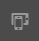
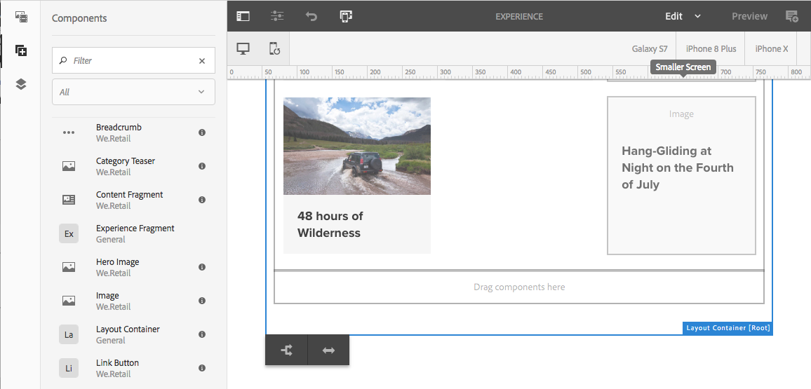
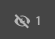

# Responsieve lay-out{#responsive-layout}

Adobe Experience Manager laat u een ontvankelijke lay-out voor uw pagina&#39;s realiseren door de **component van de Container van de Lay-out te gebruiken 0&rbrace;.**

>[!TIP]
>
>Dit document biedt een overzicht van de functies van de container voor lay-out die beschikbaar zijn voor auteurs van inhoud.
>
>Voor plaatsbeheerders en ontwikkelaars, wordt de details van hoe te om de lay-outcontainer voor uw plaatsen te vormen beschreven in het document [&#x200B; Vormende de Container van de Lay-out en de Wijze van de Lay-out.](/help/sites-authoring/responsive-layout.md)

## Overzicht {#overview}

De **component van de Container van de Lay-out van 0&rbrace; verstrekt een paragraafsysteem dat u componenten binnen een ontvankelijk net laat plaatsen.** Met dit raster kunt u de lay-out opnieuw rangschikken op basis van de grootte en de indeling van het apparaat/venster. De component wordt gebruikt samen met de [**wijze van de Lay-out** &#x200B;](/help/sites-authoring/responsive-layout.md#defining-layouts-layout-mode), die u laat uw ontvankelijke lay-out afhankelijk van apparaat tot stand brengen en uitgeven.

De container layout:

* Biedt een horizontale uitlijning op het raster, samen met de mogelijkheid om componenten naast elkaar in het raster te plaatsen en te bepalen wanneer ze moeten samenvouwen/opnieuw plaatsen.
* Gebruikt vooraf gedefinieerde onderbrekingspunten (bijvoorbeeld voor telefoon, tablet, enzovoort) om het vereiste gedrag van inhoud voor verwante apparaten/oriëntatie te kunnen definiëren.

   * U kunt bijvoorbeeld de grootte van de component aanpassen of de component zichtbaar is op bepaalde apparaten.

* Kan worden genest om kolombesturing toe te staan.

De gebruiker kan dan zien hoe de inhoud wordt gerenderd voor specifieke apparaten met de emulator.

>[!CAUTION]
>
>Hoewel de component Layout Container beschikbaar is in de klassieke gebruikersinterface, is de volledige functionaliteit alleen beschikbaar en ondersteund in de interface met aanraakbediening.

AEM realiseert een responsieve indeling voor uw pagina&#39;s met behulp van een combinatie van mechanismen:

* [**component van de Container van 0&rbrace; Lay-out**](#adding-a-layout-container-and-its-content-edit-mode)

  Deze component is beschikbaar in [&#x200B; componentenbrowser &#x200B;](/help/sites-authoring/author-environment-tools.md#components-browser) en verstrekt een net-paragraaf systeem om u toe te laten en componenten binnen een ontvankelijk net plaatsen. Deze kan ook als het standaardalineasysteem op de pagina worden ingesteld.

* [**Lay-outmodus**](/help/sites-authoring/responsive-layout.md#defining-layouts-layout-mode)

  Zodra de lay-outcontainer op uw pagina wordt geplaatst kunt u de **wijze van de Lay-out** gebruiken om inhoud binnen het ontvankelijke net te plaatsen.

* [**Emulator**](#selecting-a-device-to-emulate)
Zo kunt u responsieve websites maken en bewerken die de lay-out op basis van de grootte van het apparaat of venster opnieuw rangschikken door de grootte van componenten interactief aan te passen. De gebruiker kan dan zien hoe de inhoud wordt gerenderd met de emulator.

Met deze responsieve rastermechanismen kunt u:

* Gebruik onderbrekingspunten om verschillende inhoudslay-outs te definiëren op basis van de apparaatbreedte (afhankelijk van het apparaattype en de oriëntatie).
* Gebruik dezelfde onderbrekingspunten en inhoudelay-outs om ervoor te zorgen dat de inhoud reageert op de grootte van het browservenster op het bureaublad.
* Gebruik Horizontaal magnetisch raster om componenten in het raster te plaatsen, de grootte desgewenst aan te passen en te bepalen wanneer ze naast elkaar of boven/onder moeten samenvouwen/opnieuw moeten plaatsen.
* Componenten verbergen voor specifieke apparaatlay-outs.
* Kolombesturingselement realiseren.

Afhankelijk van uw project, zou de Container van de Lay-out als standaardparagraafsysteem voor uw pagina&#39;s of als component beschikbaar kunnen worden gebruikt om aan uw pagina via componentenbrowser (of allebei) worden toegevoegd.

>[!NOTE]
>
>Adobe verstrekt [&#x200B; documentatie GitHub &#x200B;](https://adobe-marketing-cloud.github.io/aem-responsivegrid/) van de ontvankelijke lay-out als verwijzing die aan front-end ontwikkelaars kan worden gegeven die hen toestaan om het net van AEM buiten AEM te gebruiken, bijvoorbeeld, wanneer het creëren van statische modellen van HTML voor een toekomstige plaats van AEM.

>[!NOTE]
>
>Het gebruik van de bovenstaande mechanismen wordt ingeschakeld door configuratie op de sjabloon. Zie [&#x200B; Vormend Responsieve Lay-out &#x200B;](/help/sites-administering/configuring-responsive-layout.md) voor verdere informatie.

## Lay-outdefinities, Apparaatemulatie en Onderbrekingspunten {#layout-definitions-device-emulation-and-breakpoints}

Wanneer u uw website-inhoud maakt, moet u ervoor zorgen dat uw inhoud correct wordt weergegeven voor het apparaat dat wordt gebruikt om de inhoud weer te geven.

Met AEM kunt u lay-outs definiëren die afhankelijk zijn van de breedte van het apparaat:

* Met de emulator kunt u deze lay-outs emuleren op een reeks apparaten. Naast het apparatentype, kan de richtlijn, die door de **wordt geselecteerd het apparaat van de Roteren** optie, het breekpunt beïnvloeden dat wordt geselecteerd aangezien de breedte verandert.
* Onderbrekingspunten zijn de punten die de layoutdefinities scheiden.

   * Ze definiëren in feite de maximale breedte (in pixels) van elk apparaat met een specifieke layout.
   * De onderbrekingspunten zijn gewoonlijk geldig voor een selectie van apparaten, afhankelijk van de breedte van hun vertoningen.
   * Het bereik van een onderbrekingspunt loopt door tot het volgende onderbrekingspunt.
   * U kunt het onderbrekingspunt niet specifiek selecteren, zal selecteren een apparaat en de richtlijn automatisch het aangewezen breekpunt selecteren.

Het apparaat **Desktop**, dat geen specifieke breedte heeft, heeft op het standaardbreekpunt (namelijk alles boven het laatste gevormde breekpunt) betrekking.

>[!NOTE]
>
>Het zou mogelijk zijn om breekpunten voor elk individueel apparaat te bepalen, maar dit zou drastisch de inspanning die voor lay-outdefinitie en onderhoud wordt vereist verhogen.

Wanneer u de emulator gebruikt, selecteert u een specifiek apparaat voor de definitie van emulatie en layout en wordt het desbetreffende onderbrekingspunt ook gemarkeerd. Alle layoutwijzigingen die u aanbrengt, zijn van toepassing op andere apparaten waarop het onderbrekingspunt van toepassing is. Dit zijn apparaten die zich links van de actieve onderbrekingspuntmarkering bevinden, maar vóór de volgende onderbrekingspuntmarkering.

Bijvoorbeeld, wanneer u het apparaat **iPhone 6 plus** (die met een breedte van 540 pixel wordt bepaald) voor wedijver en lay-out selecteert, zal de breekpunt **Telefoon** (die als 768 pixel wordt bepaald) ook worden geactiveerd. Om het even welke lay-outveranderingen u voor **iPhone 6** aanbrengt zullen op andere apparaten onder het **breekpunt van Telefoons**, zoals **iPhone 5** (die als 320 pixel wordt bepaald) van toepassing zijn.

## Een apparaat selecteren om te emuleren {#selecting-a-device-to-emulate}

1. Open de vereiste pagina om te bewerken. Bijvoorbeeld:

   `http://localhost:4502/editor.html/content/we-retail/us/en/experience.html`

1. Selecteer het **pictogram van de Mededinger** van de hoogste toolbar:

   

1. De emulatorwerkbalk wordt geopend.

   

   Op de emulatorwerkbalk worden extra layoutopties weergegeven:

   * **roteer apparaat** - laat u een apparaat van verticale (staande) richtlijn aan horizontale (landschaps) richtlijn roteren en omgekeerd.

      

   * **Uitgezochte Apparaat** - bepaal een specifiek apparaat om van een lijst (zie volgende stap voor details) na te streven

     

1. Als u een specifiek apparaat wilt selecteren om te emuleren, kunt u:

   * Gebruik het pictogram Apparaat selecteren en selecteer een keuze in een vervolgkeuzelijst.
   * Klik op de apparaatindicator op de emulatorwerkbalk.

   

1. Nadat een specifiek apparaat is geselecteerd, kunt u:

   * Zie de actieve teller voor het geselecteerde apparaat, zoals **iPad.**
   * Zie de actieve teller voor het aangewezen [&#x200B; breekpunt &#x200B;](/help/sites-authoring/responsive-layout.md#layout-definitions-device-emulation-and-breakpoints) zoals **Tablet.**

   

   * De blauwe gestippelde lijn vertegenwoordigt de *plooi* voor het geselecteerde apparaat (hier een **iPhone 6**).

   

   * De vouw kan ook als de onderbreking van de paginalijn (niet om met de [&#x200B; breekpunten &#x200B;](/help/sites-authoring/responsive-layout.md#layout-definitions-device-emulation-and-breakpoints) worden verward) voor de inhoud worden beschouwd. Dit wordt voor het gemak weergegeven om aan te geven welk deel van de inhoud de gebruiker op het apparaat ziet voordat hij of zij schuift.
   * De lijn voor de vouwlijn wordt niet weergegeven als de hoogte van het geëmuleerde apparaat groter is dan de schermgrootte.
   * De vouw wordt getoond voor het gemak van de auteur en niet op de gepubliceerde pagina getoond.

## Een container voor lay-out en de bijbehorende inhoud toevoegen (modus Bewerken) {#adding-a-layout-container-and-its-content-edit-mode}

A **de Container van de Lay-out** is een paragraafsysteem dat:

* Bevat andere componenten.
* Definieert de layout.
* Hiermee reageert u op wijzigingen.

>[!NOTE]
>
>Als niet reeds beschikbaar, moet de **Container van de Lay-out** uitdrukkelijk [&#x200B; voor een paragraafsysteem/pagina &#x200B;](/help/sites-administering/configuring-responsive-layout.md) (bijvoorbeeld, door [**wijze van het Ontwerp** &#x200B;](/help/sites-authoring/default-components-designmode.md) te gebruiken) worden geactiveerd.

1. De **lay-outcontainer** is beschikbaar als standaardcomponent in de [componentbrowser](/help/sites-authoring/author-environment-tools.md#components-browser). Van hieruit kunt u het naar de vereiste locatie op de pagina slepen waarna u de tijdelijke aanduiding **Componenten hierheen slepen** zult zien.
1. Vervolgens kunt u componenten aan de lay-outcontainer toevoegen. Deze componenten bevatten de werkelijke inhoud:

   

## Handeling selecteren en uitvoeren in een container Layout (modus Bewerken) {#selecting-and-taking-action-on-a-layout-container-edit-mode}

Zoals met andere componenten, kunt u selecteren en dan actie (besnoeiing, exemplaar, schrapping) een Container van de Lay-out (wanneer in **uitgeven** wijze) doen:

>[!CAUTION]
>
>Aangezien een lay-outcontainer een paragraafsysteem is, zal het schrappen van de component zowel het lay-outnet als alle componenten (en hun inhoud) schrappen die binnen de container worden gehouden.

1. Als u de muisaanwijzer boven de tijdelijke aanduiding voor het raster houdt of deze selecteert, wordt het actiemenu weergegeven.

   

   U moet de **Ouder** optie selecteren.

   

1. Als de lay-outcomponent wordt genest, die de **Ouder** optie selecteren stelt een drop-down selectie voor, die u toestaat om de genestelde lay-outcontainer of zijn ouder(s) te selecteren.

   Wanneer u de muis boven de containernamen in de vervolgkeuzelijst plaatst, wordt de omtrek van de namen op de pagina weergegeven.

   * De laagste geneste lay-outcontainer wordt omgeven door zwarte omtrekken.
   * De op één na laagste geneste lay-outcontainer zal in donkergrijs zijn.
   * Elke volgende container zal een lichtere grijstint hebben.

   

1. Hierdoor wordt het volledige raster met de inhoud gemarkeerd. De actietoolbar wordt getoond, van waar u een actie zoals **Schrapping kunt selecteren.**

   

## Indelingen definiëren (modus Indeling) {#defining-layouts-layout-mode}

>[!NOTE]
>
>U kunt een afzonderlijke lay-out voor elk [&#x200B; breekpunt &#x200B;](#layout-definitions-device-emulation-and-breakpoints) (zoals die door geëmuleerd apparatentype en richtlijn wordt bepaald) bepalen.

Om de lay-out van een ontvankelijk net te vormen dat met de Container van de Lay-out wordt uitgevoerd moet u de **wijze van de Lay-out** gebruiken.

**de wijze van de Lay-out** kan op twee manieren worden begonnen.

* Gebruik het [modusmenu op de werkbalk](/help/sites-authoring/author-environment-tools.md#page-modes) en kies de modus **Lay-out**

   * Selecteer de modus **Lay-out** op dezelfde manier als wanneer u schakelt naar de modus **Bewerken** of de modus **Targeting**.
   * De modus **Lay-out** is permanent en u verlaat de modus **Lay-out** pas wanneer u een andere modus selecteert via de moduskiezer.

* Wanneer [&#x200B; het uitgeven van een individuele component.](/help/sites-authoring/editing-content.md#edit-component-layout)

   * Door de **optie van de Lay-out** in het snelle actiemenu van de component te gebruiken, kunt u op **Lay-out** wijze schakelen.
   * **de wijze van de Lay-out 1&rbrace; blijft terwijl het uitgeven van de component en keert terug naar** geef **wijze uit zodra de nadruk in een andere component verandert.**

In de lay-outmodus kunt u verschillende handelingen op een raster uitvoeren:

* Wijzig de grootte van de inhoudcomponenten met de blauwe stippen. Het resizing zal altijd breken-aan-net. Bij het wijzigen van de grootte wordt het achtergrondraster weergegeven als hulpmiddel bij de uitlijning:

  

  >[!NOTE]
  >
  >De verhoudingen en de verhoudingen zullen worden gehandhaafd wanneer de componenten zoals **Beelden** resized.

* Klik op een inhoudcomponent, laat de toolbar u:

   * **Ouder**

     Hiermee kunt u de volledige containercomponent voor de layout selecteren om actie te ondernemen voor het geheel.

   * **Vloeiend aan nieuwe lijn**

     De component wordt naar een nieuwe regel verplaatst, afhankelijk van de ruimte die beschikbaar is in het raster.

   * **de component van de Huid**

     De component wordt onzichtbaar gemaakt (u kunt deze herstellen vanaf de werkbalk van de container voor lay-outs).

  

* Op **Lay-out** wijze kunt u op de **componenten van de Belemmering hier** klikken om de volledige component te selecteren. De werkbalk voor deze modus wordt dan weergegeven.

  De werkbalk heeft verschillende opties, afhankelijk van de status van de lay-outcomponent en de onderdelen ervan. Bijvoorbeeld:

   * **Ouder** - selecteer de oudercomponent.

     

   * **toon verborgen componenten** - openbaart alle of individuele componenten. Het getal geeft aan hoeveel verborgen componenten er momenteel zijn. De teller toont hoeveel componenten verborgen zijn.

     

   * **keert breekpuntlay-out** terug - keer aan de standaardlay-out terug. Dit betekent dat er geen aangepaste indeling wordt opgelegd.

     

   * **Vloeiend aan nieuwe lijn** - beweeg de component omhoog een positie als het uit elkaar plaatsen toestaat.

     

   * **de component van de Huid** - verberg de huidige component.

     

     >[!NOTE]
     >
     >In het bovenstaande voorbeeld zijn de acties voor zweven en verbergen beschikbaar omdat deze container van de layout is genest in een bovenliggende container van de layout.

   * **unhide componenten**
Selecteer de oudercomponenten om de actietoolbar met **te tonen verborgen componenten** optie. In dit voorbeeld zijn twee componenten verborgen.

     

  Als u de optie **Verborgen componenten weergeven** selecteert, worden de componenten die momenteel op hun oorspronkelijke positie zijn verborgen, blauw weergegeven.

  

  Het selecteren **herstelt alle** zal alle verborgen componenten onthullen.
