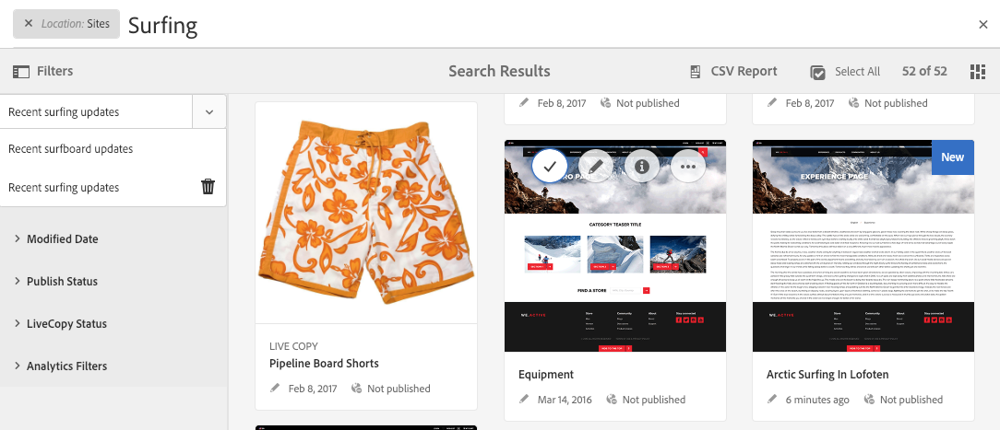

# Zoeken{#searching}

De auteursomgeving van AEM verstrekt diverse mechanismen om naar inhoud te zoeken, afhankelijk van het middeltype.

>[!NOTE]
>
>Buiten het auteursmilieu zijn andere mechanismen ook beschikbaar voor het zoeken, zoals de [ Bouwer van de Vraag ](/help/sites-developing/querybuilder-api.md) en [ CRXDE Lite ](/help/sites-developing/developing-with-crxde-lite.md).

## Basisinformatie zoeken {#search-basics}

Zoeken is beschikbaar op de bovenste werkbalk:

Met de zoekrail kunt u:

* Zoeken naar een specifiek trefwoord, pad of tag.
* Filter volgens bronspecifieke criteria, zoals gewijzigde datums, paginastatus, bestandsgrootte enzovoort.
* Bepaal en gebruik a [ bewaarde onderzoek ](#saved-searches) - gebaseerd op de bovengenoemde criteria.

>[!NOTE]
>
>U kunt de zoekopdracht ook aanroepen door de sneltoets `/` (forward slash) te gebruiken wanneer de zoekbalk zichtbaar is.

## Zoeken en filteren {#search-and-filter}

U kunt als volgt uw bronnen zoeken en filteren:

1. Open **Onderzoek** (met het vergrootglas in de toolbar) en ga uw onderzoekstermijn in. Er worden voorstellen gedaan die kunnen worden geselecteerd:

   

   Door gebrek zullen de onderzoeksresultaten tot uw huidige plaats (namelijk console en verwante middeltype) worden beperkt:

   

1. Indien nodig, kunt u de plaatsfilter (uitgezochte **X** op de filter verwijderen u) over alle consoles/middeltypes zoeken.
1. De resultaten worden getoond, gegroepeerd volgens console en verwant middeltype.

   U kunt of een specifiek middel (voor verdere actie) selecteren, of neer boren door het vereiste middeltype te selecteren; bijvoorbeeld, **Mening Alle Plaatsen**:

   

1. Als u verder naar beneden wilt boren, selecteer het symbool van het Spoorstaaf (linksboven) om het zijpaneel **Filters &amp; Opties** te openen.

   

   Volgens het middeltypeOnderzoek zal een vooraf bepaalde selectie van onderzoek/filtercriteria tonen.

   In het zijpaneel kunt u selecteren:

   * Opgeslagen zoekopdrachten
   * Zoekdirectory
   * Tags
   * Zoekcriteria; bijvoorbeeld Gewijzigde datums, Publish-status, LiveCopy-status.

   >[!NOTE]
   >
   >De zoekcriteria kunnen variëren:
   >
   >
   >
   >    * Afhankelijk van het type bron dat u hebt geselecteerd, zijn bijvoorbeeld de criteria Assets en Communities begrijpelijk gespecialiseerd.
   >    * Uw instantie als [ Onderzoek Forms ](/help/sites-administering/search-forms.md) kan worden aangepast (aangewezen aan de plaats binnen AEM).
   >
   >

   

1. U kunt ook extra zoektermen toevoegen:

   

1. Sluit **Zoeken** met de **X** (rechtsboven).

>[!NOTE]
>
>Zoekcriteria blijven bestaan wanneer u een item in de zoekresultaten selecteert.
>
>Wanneer u een item op de pagina met zoekresultaten selecteert en vervolgens terugkeert naar de zoekpagina nadat u de knop Terug in de browser hebt gebruikt, blijven de zoekcriteria behouden.

## Opgeslagen zoekopdrachten {#saved-searches}

Naast het zoeken op basis van een groot aantal facetten kunt u ook een bepaalde zoekconfiguratie opslaan, zodat deze later kan worden opgehaald en gebruikt:

1. Bepaal uw onderzoekscriteria en selecteer **sparen**.

   

1. Wijs een naam toe, dan gebruik **sparen** om te bevestigen:

   

1. De volgende keer dat u het deelvenster Zoeken opent, kunt u de opgeslagen zoekopdracht vanuit de kiezer openen:

   

1. Nadat u het bestand hebt opgeslagen, kunt u:

   * Het gebruik **x** (tegen de naam van het bewaarde onderzoek) om een nieuwe vraag te beginnen (het bewaarde onderzoek zelf zal niet worden geschrapt).
   * **geeft Begezeten Onderzoek** uit, verandert de onderzoeksvoorwaarden, dan **sparen** opnieuw.

Opgeslagen zoekopdrachten kunnen worden gewijzigd door de opgeslagen zoekopdracht te selecteren en onder aan het zoekvenster op **Opgeslagen zoekopdracht bewerken** te klikken.

