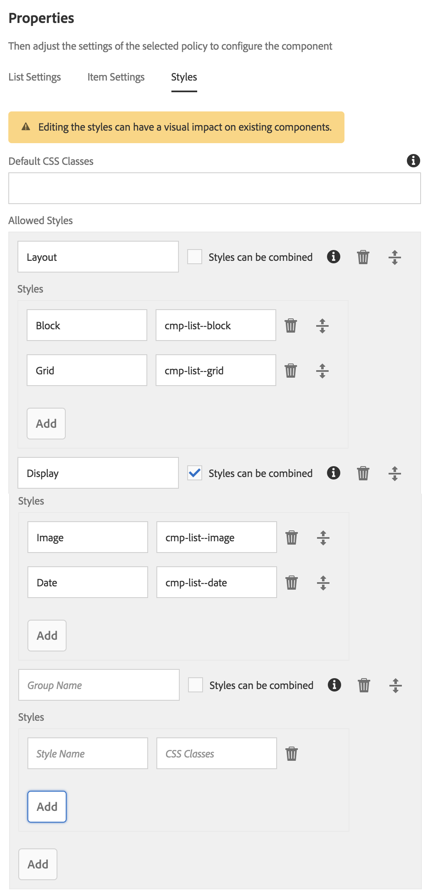

# Stijlsysteem{#style-system}

Met het Stijlsysteem kan een sjabloonauteur stijlklassen definiëren in het inhoudsbeleid van een component, zodat de auteur van de inhoud deze kan selecteren wanneer hij de component op een pagina bewerkt. Deze stijlen kunnen alternatieve visuele variaties van een component zijn, waardoor het flexibeler wordt.

Dit elimineert de behoefte om een douanecomponent voor elke stijl te ontwikkelen of het componentendialoogvenster aan te passen om dergelijke stijlfunctionaliteit toe te laten. Het leidt tot herbruikbaardere componenten die snel en gemakkelijk aan de behoeften van inhoudsauteurs zonder enige AEM achterste ontwikkeling kunnen worden aangepast.

## Hoofdletters gebruiken {#use-case}

De auteurs van het malplaatje vergen niet alleen de capaciteit om te vormen hoe de componenten voor de inhoudsauteurs functioneren, maar ook om een aantal alternatieve visuele variaties van een component te vormen.

Op dezelfde manier hebben inhoudsauteurs niet alleen de mogelijkheid nodig om de inhoud te structureren en te rangschikken, maar ook om te selecteren hoe de inhoud visueel wordt weergegeven.

Het stijlsysteem verstrekt een verenigde oplossing aan zowel de vereisten van de malplaatjeauteur als van de inhoudauteur:

* Sjabloonauteurs kunnen stijlklassen definiëren in het inhoudsbeleid van componenten.
* Inhoudsauteurs kunnen deze klassen vervolgens selecteren in een vervolgkeuzelijst wanneer ze de component op een pagina bewerken om de bijbehorende stijlen toe te passen.

De stijlklasse wordt dan opgenomen op het decoratie omslagelement van de component zodat de componentenontwikkelaar zich niet met de behandeling van de stijlen moet bezighouden voorbij het verstrekken van hun CSS regels.

## Overzicht {#overview}

Het stijlsysteem heeft doorgaans de volgende vorm.

1. De webontwerper maakt verschillende visuele variaties van een component.

1. De HTML-ontwikkelaar krijgt de HTML-uitvoer van de componenten en de gewenste visuele variaties die u wilt implementeren.

1. De HTML-ontwikkelaar definieert de CSS-klassen die overeenkomen met elke visuele variatie en die moeten worden ingevoegd op het element dat de componenten omvat.

1. De HTML-ontwikkelaar implementeert de bijbehorende CSS-code (en eventueel JS-code) voor elk van de visuele variaties, zodat deze er zo uitzien als gedefinieerd.

1. De AEM-ontwikkelaar plaatst de meegeleverde CSS (en optionele JS) in een [clientbibliotheek](/help/sites-developing/clientlibs.md) en implementeert deze.

1. De AEM-ontwikkelaar of sjabloonauteur configureert de paginasjablonen en bewerkt het beleid van elke opgemaakte component, voegt de gedefinieerde CSS-klassen toe, geeft gebruikersvriendelijke namen aan elke stijl en geeft aan welke stijlen kunnen worden gecombineerd.

1. De auteur van de AEM-pagina kan vervolgens de ontworpen stijlen in de pagina-editor kiezen via het stijlmenu van de werkbalk van de component.

Merk op dat slechts de laatste drie stappen daadwerkelijk in AEM worden uitgevoerd. Dit betekent dat alle ontwikkeling van de vereiste CSS en Javascript zonder AEM kan worden uitgevoerd.

Voor een feitelijke implementatie van de stijlen is alleen implementatie op AEM en selectie binnen de componenten van de gewenste sjablonen vereist.

Het volgende diagram illustreert de architectuur van het stijlsysteem.

## Use {#use}

Om deze functie te demonstreren, moeten stijlen voor een component worden gemaakt. Gebruikend [Wij.Retail](/help/sites-developing/we-retail.md)&#39;s implementatie van de de [lijstcomponent](https://helpx.adobe.com/experience-manager/core-components/using/list.html) van de kerncomponent als basis, kunt u het pakket installeren in bijlage dat stijlen bevat om de functionaliteit van de eigenschap te onderzoeken.

Download het [stijlsysteemdemopakket](assets/package_-_style_systemdemo.zip)

>[!NOTE]
>
>Het demopakket is bedoeld om te tonen hoe het stijlsysteem door auteurs kan worden gebruikt, eerder dan als verwijzing naar hoe te om het het best uit te voeren.
>
>Dit pakket zal slechts nodig zijn tot Wij.Retail een ingebouwde voorbeeld en beste praktijkimplementatie verstrekt.

De volgende secties [als Inhoudsauteur](/help/sites-authoring/style-system.md#as-a-content-author) en [als Auteur](/help/sites-authoring/style-system.md#as-a-template-author) van het Malplaatje beschrijven hoe te om de functionaliteit van het stijlsysteem te testen gebruikend het de demonstratiepakket van het stijlsysteem bovenop We.Retail.

Ga als volgt te werk als u het stijlsysteem voor uw eigen componenten wilt gebruiken:

1. Installeer de CSS als cliëntbibliotheken zoals die in het sectie [Overzicht](/help/sites-authoring/style-system.md#overview)worden besproken.
1. Configureer de CSS-klassen die u beschikbaar wilt maken voor de auteurs van de inhoud, zoals beschreven in de sectie [Als sjabloonauteur](/help/sites-authoring/style-system.md#as-a-template-author).
1. Inhoudsauteurs kunnen vervolgens de stijlen gebruiken zoals beschreven in de sectie [Als inhoudsauteur](/help/sites-authoring/style-system.md#as-a-content-author).

### Als inhoudsauteur {#as-a-content-author}

1. Na het installeren van het de demonstratiepakket van het stijlsysteem, navigeer aan de Engelse taalhoofdpagina van Wij.Retail bij `http://localhost:4502/sites.html/content/we-retail/language-masters/en` en geef de pagina uit.
1. Selecteer de component van de **Lijst** bij de bodem of de bovenkant van parsys. Let op het verschil met de component **Artikellijst** .

   

1. Tik of klik op de knop **Stijlen** op de werkbalk van de component **List** om het stijlmenu te openen en de weergave van de component te wijzigen.

   

   >[!NOTE]
   >
   >In dit voorbeeld sluiten de **layoutstijlen** (**Blok** en **Raster**) elkaar uit, terwijl de **weergaveopties** (**Afbeelding** **** of Date) kunnen worden gecombineerd. Dit kan in het malplaatje als malplaatjeauteur [worden](/help/sites-authoring/style-system.md#as-a-template-author)gevormd.

### Als sjabloonauteur {#as-a-template-author}

1. Bewerk tijdens het bewerken van de basispagina voor de Engelse taal van We.Retail op `http://localhost:4502/sites.html/content/we-retail/language-masters/en`, de sjabloon van de pagina via **Pagina-informatie -> Sjabloon** bewerken.

   

1. Bewerk het beleid van de component **List** door te tikken op de knop **Beleid** van de component of erop te klikken. Verwar dit niet met de component **Artikellijst** .

   

1. Op het tabblad Stijlen van de eigenschappen kunt u zien hoe de stijlen zijn geconfigureerd.

   

   * **** Groepsnaam: Stijlen kunnen worden gegroepeerd in het stijlmenu dat de auteur van de inhoud ziet wanneer het vormen van de stijl van de component.
   * **** Stijlen kunnen worden gecombineerd: Hiermee kunt u meerdere stijlen in die groep tegelijk selecteren.
   * **** Stijlnaam: De beschrijving van de stijl die aan de inhoudsauteur wanneer het vormen van de stijl van de component zal tonen.
   * **** CSS-klassen: De werkelijke naam van de CSS-klasse die aan de stijl is gekoppeld.
   Gebruik de sleephandgrepen om de volgorde van de groepen en de stijlen in de groepen te bepalen. Met de pictogrammen Toevoegen of Verwijderen kunt u groepen of stijlen in de groepen toevoegen of verwijderen.

>[!CAUTION]
>
>De CSS klassen (evenals om het even welk noodzakelijk Javascript) die als stijleigenschappen van het beleid van een component worden gevormd moeten als Bibliotheken [van de](/help/sites-developing/clientlibs.md) Cliënt worden opgesteld om te werken.

## Instellen {#setup}

>[!NOTE]
>
>Versie 2 van de kerncomponenten wordt volledig toegelaten om uit het stijlsysteem voordeel te halen en vereist geen extra configuratie.
>
>Voer de volgende stappen uit om het stijlsysteem in te schakelen voor uw eigen aangepaste componenten of om de kerncomponenten van versie 1 uit te breiden om deze functie te gebruiken.

Een component werkt alleen met het stijlsysteem van AEM en geeft het stijltabblad weer in het ontwerpdialoogvenster als de ontwikkelaar dat tabblad van het product opneemt met de volgende instellingen voor de component:

* `path = "/mnt/overlay/cq/gui/components/authoring/dialog/style/tab_design/styletab"`
* `sling:resourceType = "granite/ui/components/coral/foundation/include"`

Met de gevormde component, zullen de stijlen die door de paginaauteurs worden gevormd automatisch door AEM op het decoratie element worden opgenomen dat AEM automatisch rond elke editable component verpakt. De component zelf hoeft niets anders te doen om dit te bewerkstelligen.

### Stijlen met elementnamen {#styles-with-element-names}

Een ontwikkelaar kan ook een lijst met toegestane elementnamen voor stijlen op de component configureren met de eigenschap `cq:styleElements` string array. Vervolgens kan de sjabloonauteur op het tabblad Stijlen van het beleid in het ontwerpdialoogvenster ook een elementnaam kiezen die voor elke stijl moet worden ingesteld. Hiermee wordt de elementnaam van het omvattende element ingesteld.

Deze eigenschap wordt ingesteld op het `cq:Component` knooppunt. Bijvoorbeeld:

* `/apps/weretail/components/content/list@cq:styleElements=[div,section,span]`

>[!CAUTION]
>
>Definieer geen elementnamen voor stijlen die kunnen worden gecombineerd. Wanneer meerdere elementnamen zijn gedefinieerd, is de volgorde van prioriteit:
>
>1. HTML heeft voorrang op alles: `data-sly-resource="${'path/to/resource' @ decorationTagName='span'}`
>1. Dan onder veelvoudige actieve stijlen, wordt de eerste stijl in de lijst van stijlen die in het beleid van de component worden gevormd genomen.
>1. Ten slotte wordt de fallbackwaarde `cq:htmlTag`/ `cq:tagName` /beschouwd als een fallback-waarde.
>

Deze mogelijkheid om stijlnamen te definiëren is handig voor zeer algemene componenten, zoals de container van de layout of de component Content Fragment, zodat ze een extra betekenis krijgen.

Zo kan een container voor lay-out bijvoorbeeld semantiek als `<main>`, `<aside>`, `<nav>`enz. krijgen.
