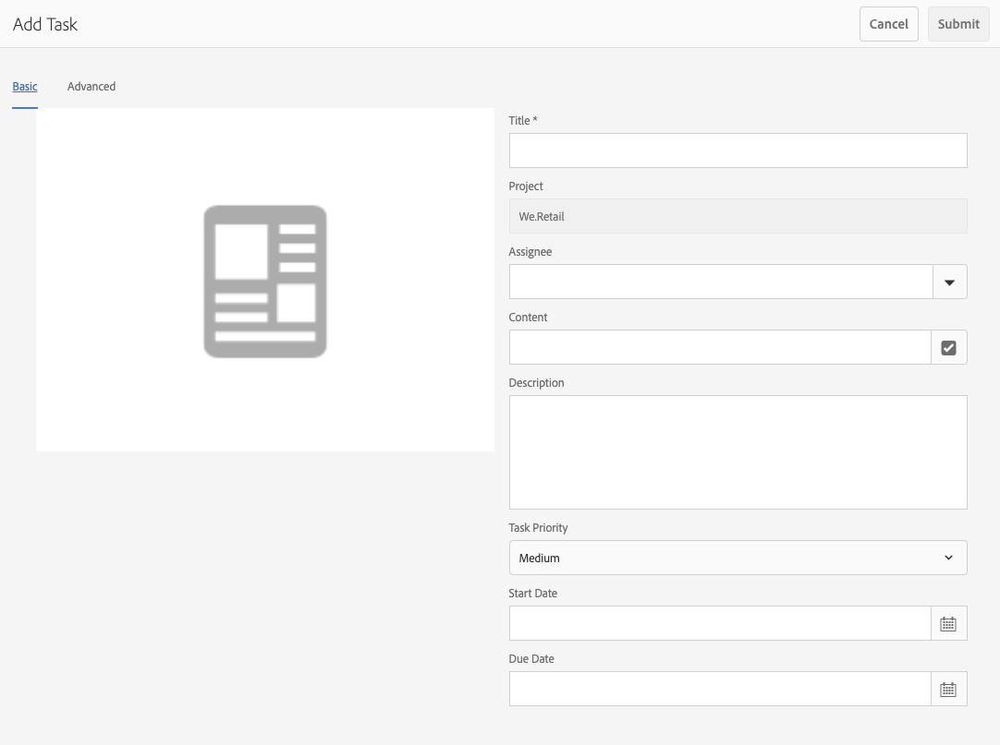

# Werken met taken {#working-with-tasks}

Taken zijn taken die betrekking hebben op de inhoud. Wanneer u een taak krijgt toegewezen, wordt deze weergegeven in het Postvak IN van de workflow. De punten van de taak kunnen van werkschemapunten door de waarde worden onderscheiden **Type** kolom.

De taken worden ook gebruikt in projecten om het niveau van volledigheid van het project te bepalen.

## Voortgang van project bijhouden {#tracking-project-progress}

U kunt projectvooruitgang volgen door de actieve/voltooide taken binnen een project te bekijken dat door **Taken** tegel. De voortgang van het project kan worden bepaald door:

* **Taaktegel:** Een algemene vooruitgang van het project wordt getoond in de taaktegel, beschikbaar op de pagina van projectdetails.

* **Taaklijst:** Wanneer u op de taaktegel klikt, wordt een lijst met taken weergegeven. Deze lijst bevat gedetailleerde informatie over alle taken met betrekking tot het project.

Met beide opties worden workflowtaken en taken die u rechtstreeks in de takentegel maakt, weergegeven.

### Tegel {#task-tile}

Als een project om het even welke verwante taken heeft, wordt een taaktegel getoond binnen het project. De taaktegel toont de huidige status van het project. Dit is gebaseerd op bestaande taken binnen de workflow en bevat geen taken die in de toekomst worden gegenereerd wanneer de workflow doorgaat. De volgende informatie is zichtbaar in de taaktegel:

* Percentage voltooide taken
* Percentage actieve taken
* Percentage achterstallige taken

### Het bekijken van of het Wijzigen van de Taken in een Project {#viewing-or-modifying-the-tasks-in-a-project}

Naast het volgen van vooruitgang, kunt u meer informatie over het project willen bekijken of het wijzigen.

#### Taaklijst {#task-list}

Klik op de knop met de ellips rechtsonder in de takentegel om uw Postvak IN weer te geven dat op de taken met betrekking tot het project is gefilterd. De taakdetails worden getoond samen met meta-gegevens zoals vervaldatum, ontvanger, prioriteit, en status.

#### Taakdetails {#task-details}

Voor meer informatie over een bepaalde taak klikt u in het Postvak IN op de taak die u wilt selecteren en klikt u vervolgens op **Openen** in de werkbalk.

U kunt details aan de taak weergeven, bewerken of toevoegen via verschillende tabbladen.

* **Taak** - Algemene taakinformatie
* **Projectinfo** - Samenvatting van het project waaraan de taak is gekoppeld
* **Workflowinfo** - Overzicht van de workflow waaraan de taak is gekoppeld (indien van toepassing)
* **Opmerkingen** - Algemene opmerkingen over de taak zelf

### Taken toevoegen {#adding-tasks}

U kunt nieuwe taken aan projecten toevoegen. Deze taken worden vervolgens weergegeven in de takenlijst en zijn beschikbaar in het postvak voor meldingen, zodat u zich bewust bent van uw onopgeloste taken.

Een taak toevoegen:

1. Zoek in het project de locatie **Taken** tegel
1. Klik op het neerwaartse chevron rechtsboven in de tegel en selecteer **Taak maken**.
1. In de **Taak toevoegen** en geeft u taakdetails op, zoals prioriteit, toewijzing en vervaldatum.

   

1. Klikken **Verzenden**.

## Werken met taken in het Postvak In {#working-with-tasks-in-the-inbox}

In plaats van toegang tot van uw projecttaken van het project zelf, kunt u tot hen direct van uw inbox toegang hebben. Uw Postvak IN geeft u een overzicht van uw taken in de verschillende projecten, zodat u uw volledige workflow kunt begrijpen.

Vanuit het Postvak IN kunt u de taken openen en de taakstatus instellen. De taken verschijnen ook in uw inbox wanneer zij aan een gebruikersgroep worden toegewezen die u tot behoort. In dat geval kan elk lid van de groep het werk uitvoeren en de taak voltooien.

Selecteer de taak en klik op **Voltooid** in de werkbalk. Voeg informatie toe aan de taak en klik vervolgens op **Gereed**. Zie [Uw Postvak IN](/help/sites-authoring/inbox.md) voor meer informatie .
