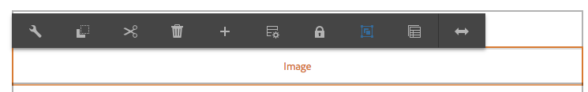
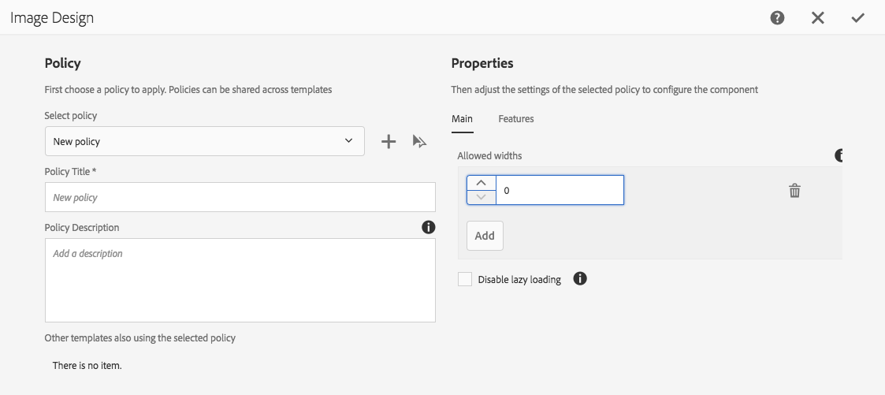
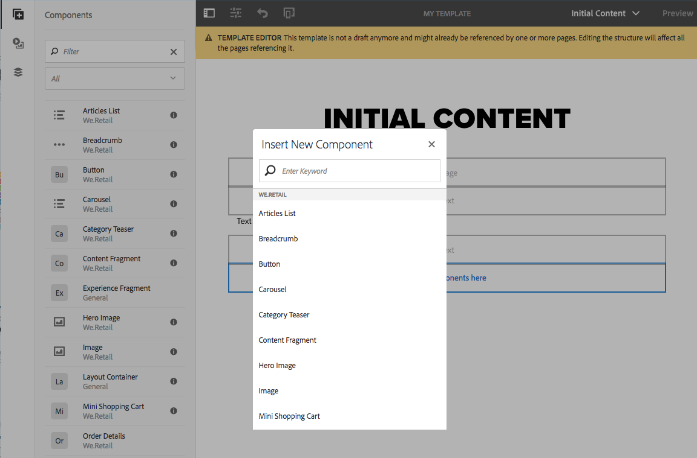
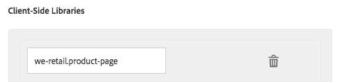

# Paginasjablonen maken{#creating-page-templates}

Wanneer u een pagina maakt, moet u een sjabloon selecteren die wordt gebruikt als basis voor het maken van de nieuwe pagina. De sjabloon definieert de structuur van de resulterende pagina, eventuele eerste inhoud en de componenten die kunnen worden gebruikt.

Met de **Sjablooneditor** is het creëren en onderhouden van sjablonen niet meer alleen een taak voor ontwikkelaars. Een hoofdgebruiker die ook **maker van sjablonen** wordt genoemd, kan ook worden betrokken. Ontwikkelaars zijn nog steeds nodig om de omgeving in te stellen, clientbibliotheken te maken en de te gebruiken componenten te maken, maar zodra deze basisbeginselen zijn ingesteld, kan de **maker van sjablonen** sjablonen maken en configureren zonder een ontwikkelingsproject.

De **Console van Malplaatjes** staat malplaatjeauteurs toe om:

* Maak een sjabloon of kopieer een bestaande sjabloon.
* De levenscyclus van de sjabloon beheren.

De **Redacteur van het Malplaatje** staat malplaatjeauteurs toe om:

* Voeg componenten aan het malplaatje toe en plaats hen op een ontvankelijk net.
* Configureer de componenten vooraf.
* Bepaal welke componenten op pagina&#39;s kunnen worden uitgegeven die met het malplaatje worden gecreeerd.

Dit document verklaart hoe de auteur van het a **malplaatje** de malplaatjeconsole en de redacteur kan gebruiken om editable malplaatjes tot stand te brengen en te beheren.

Voor gedetailleerde informatie over hoe de editable malplaatjes op een technisch niveau werken, zie de Malplaatjes van de Pagina van het ontwikkelaarsdocument [ - editable ](/help/sites-developing/page-templates-editable.md) voor meer informatie.

>[!NOTE]
>
>De **sjablooneditor** biedt geen ondersteuning voor rechtstreekse targeting op het sjabloonniveau. Pagina&#39;s die zijn gemaakt op basis van een bewerkbare sjabloon kunnen worden geactiveerd, maar de sjablonen zelf kunnen dat niet.

>[!CAUTION]
>
>De pagina&#39;s en de malplaatjes die met de **Console van Malplaatjes** worden gecreeerd worden niet bedoeld om met klassieke UI worden gebruikt en zulk gebruik wordt niet gesteund.

## Voordat u begint {#before-you-start}

>[!NOTE]
>
>Een beheerder moet een malplaatjeomslag in **Browser van Configuraties** vormen en juiste toestemmingen toepassen alvorens een malplaatjeauteur een malplaatje in die omslag kan tot stand brengen.

De volgende punten zijn belangrijk om te overwegen alvorens u begint:

* Voor het maken van een sjabloon is samenwerking vereist. Om deze reden wordt de [ Rol ](#roles) vermeld voor elke taak.

* Afhankelijk van hoe uw instantie wordt gevormd, AEM verstrekt nu [ twee basistypes van malplaatje ](/help/sites-authoring/templates.md#editable-and-static-templates). Dit beïnvloedt niet hoe u eigenlijk [ een malplaatje gebruikt om een pagina ](#using-a-template-to-create-a-page) tot stand te brengen, maar het beïnvloedt het type van malplaatje u kunt tot stand brengen en hoe een pagina op zijn malplaatje betrekking heeft.

### Rollen {#roles}

Creërend een malplaatje gebruikend de **Console van Malplaatjes** en **Redacteur van het Malplaatje** vereist samenwerking tussen de volgende rollen:

* **Admin**:

   * Voor het maken van een nieuwe map met sjablonen zijn `admin` -rechten vereist.

   * Dergelijke taken kunnen vaak ook door een ontwikkelaar worden uitgevoerd

* **Ontwikkelaar**:

   * Concentraties op de technische/interne details
   * Heeft ervaring nodig met de ontwikkelomgeving.
   * Verstrekt de malplaatjeauteur van noodzakelijke informatie.

* **Auteur van het Malplaatje**:

   * Dit is een specifieke auteur die lid is van de groep `template-authors`

      * Hiermee worden de vereiste rechten en machtigingen toegewezen.

   * Kan het gebruik van componenten en andere details op hoog niveau configureren die het volgende vereisen:

      * Enkele technische kennis

         * Gebruik bijvoorbeeld patronen bij het definiëren van paden.

      * Technische informatie van de ontwikkelaar.

Vanwege de aard van sommige taken, zoals het maken van een map, is een ontwikkelomgeving nodig. Hiervoor is kennis en ervaring vereist.

De in dit document beschreven taken worden weergegeven met de rol die verantwoordelijk is voor de uitvoering ervan.

### Bewerkbare en statische sjablonen {#editable-and-static-templates}

AEM biedt nu twee basistypen sjablonen:

* [Bewerkbare sjablonen](/help/sites-authoring/templates.md#creatingandmanagingnewtemplates)

   * Kan [ worden gecreeerd ](#creatinganewtemplate) en [&#128279;](#editingatemplate) door malplaatjeauteurs worden uitgegeven gebruikend de **console en de redacteur van het Malplaatje**. De **console van het Malplaatje** is toegankelijk in de **Algemene** sectie van de **console van Hulpmiddelen**.

   * Nadat de nieuwe pagina is gemaakt, wordt een dynamische verbinding onderhouden tussen de pagina en de sjabloon. Dit betekent dat wijzigingen in de sjabloonstructuur en/of vergrendelde inhoud worden doorgevoerd op alle pagina&#39;s die met die sjabloon zijn gemaakt. Wijzigingen in de ontgrendelde (initiële) inhoud worden niet doorgevoerd.
   * Het inhoudsbeleid van het gebruik, dat u deze van de malplaatjeredacteur kunt bepalen, om de ontwerpeigenschappen voort te zetten. De ontwerpmodus in de pagina-editor wordt niet meer gebruikt voor bewerkbare sjablonen.

* Statische sjablonen

   * Statische sjablonen zijn beschikbaar voor verschillende versies van AEM.
   * Zij worden [ verstrekt door uw ontwikkelaars ](/help/sites-developing/page-templates-static.md), zodat kunnen zij niet door auteurs worden gecreeerd of worden uitgegeven.
   * Er wordt gekopieerd om de nieuwe pagina te maken, maar er bestaat daarna geen dynamische verbinding (hoewel de sjabloonnaam ter informatie is geregistreerd).
   * Gebruik [&#128279;](/help/sites-authoring/default-components-designmode.md) de Wijze van het Ontwerp van 0&rbrace; om ontwerpeigenschappen voort te zetten.
   * Omdat het uitgeven van statische malplaatjes de exclusieve taak van een ontwikkelaar is, zie de Malplaatjes van de Pagina van het ontwikkelaarsdocument [ - Statisch ](/help/sites-developing/page-templates-static.md) voor meer informatie.

De sjabloonconsole en sjablooneditor staan per definitie alleen het maken en bewerken van bewerkbare sjablonen toe. Daarom richt dit document zich uitsluitend op bewerkbare sjablonen.

### Een sjabloon gebruiken om een pagina te maken {#using-a-template-to-create-a-page}

Wanneer het gebruiken van een malplaatje om [ een pagina ](/help/sites-authoring/managing-pages.md#creating-a-new-page) tot stand te brengen is er geen zichtbaar verschil en geen aanwijzing tussen statische en editable malplaatjes. Voor de auteur van de pagina is het proces transparant.

## Sjablonen maken en beheren {#creating-and-managing-templates}

Bij het maken van een bewerkbare sjabloon:

* Gebruik de **console van het Malplaatje**. Dit is beschikbaar in de **Algemene** sectie van de **3&rbrace; console van Hulpmiddelen &lbrace;.**

   * Of direct bij: [ https://localhost:4502/libs/wcm/core/content/sites/templates.html/conf](https://localhost:4502/libs/wcm/core/content/sites/templates.html/conf)

* Kan [ een omslag voor de malplaatjes ](#creating-a-template-folder-admin) tot stand brengen indien noodzakelijk
* [ creeer een malplaatje ](#creatinganewtemplateauthor), dat aanvankelijk leeg is

* [ bepaal extra eigenschappen ](#definingtemplatepropertiesauthor) voor het malplaatje indien nodig
* [ geef het malplaatje ](#editingtemplates) uit om te bepalen:

   * [ Structuur ](#editingatemplatestructureauthor) - vooraf bepaalde inhoud die niet op pagina&#39;s kan worden veranderd die met het malplaatje worden gecreeerd.
   * [ Aanvankelijke Inhoud ](#editing-a-template-initial-content-author) - vooraf bepaalde inhoud die op pagina&#39;s kan worden veranderd die met het malplaatje worden gecreeerd.
   * [ Lay-out ](#editingatemplatelayoutauthor) - voor een waaier van apparaten.
   * [ Stijlen ](/help/sites-authoring/style-system.md) - bepaal de stijlen die met het malplaatje en zijn componenten moeten worden gebruikt.

* [ laat het malplaatje ](#enablingatemplateauthor) voor gebruik toe wanneer het creëren van een pagina
* [ sta het malplaatje ](#allowing-a-template-author) voor de vereiste pagina of tak van uw website toe
* [ Publish het malplaatje ](#publishingatemplateauthor) om het op te stellen publiceert milieu

>[!NOTE]
>
>**Toegestane Malplaatjes** zijn vaak vooraf bepaald wanneer uw website aanvankelijk opstelling is.

>[!CAUTION]
>
>Ga nooit om het even welke informatie in die [&#128279;](/help/sites-developing/i18n.md) in een malplaatje moet worden geinternationaliseerd. Voor internaliseringsdoeleinden, worden de [ localiseringseigenschappen van de Componenten van de Kern ](https://experienceleague.adobe.com/docs/experience-manager-core-components/using/get-started/localization.html?lang=nl-NL) geadviseerd.

### Sjabloonmap maken - Beheer {#creating-a-template-folder-admin}

Een malplaatjeomslag zou voor uw project moeten worden gecreeerd om uw project-specifieke malplaatjes te houden. Dit is een beheerdertaak en in het document [ Malplaatjes van de Pagina - editable ](/help/sites-developing/page-templates-editable.md#template-folders) beschreven.

### Een nieuwe sjabloon maken - Sjabloonauteur {#creating-a-new-template-template-author}

1. Open de **Console van Malplaatjes** (via **Hulpmiddelen >** **Algemeen**) dan navigeren aan de vereiste omslag.

   >[!NOTE]
   >
   >In een standaard AEM instantie bestaat de **globale** omslag reeds in de malplaatjeconsole. Dit houdt standaardmalplaatjes vast en doet dienst als reserve als geen beleid en/of malplaatje-types in de huidige omslag worden gevonden.
   >
   >
   >Het wordt geadviseerd beste praktijken om a [ malplaatjeomslag te gebruiken die voor uw project ](/help/sites-developing/page-templates-editable.md#template-folders) wordt gecreeerd.

1. Selecteer **creëren**, die door **wordt gevolgd leidt Malplaatje** om de tovenaar te openen.

1. Kies het Type van a **Malplaatje**, dan selecteer **daarna**.

   >[!NOTE]
   >
   >Sjabloontypen zijn vooraf gedefinieerde sjabloonlay-outs en kunnen worden beschouwd als sjablonen voor een sjabloon. Deze worden vooraf bepaald door ontwikkelaars of de systeembeheerder. Meer informatie kan in het ontwikkelaarsdocument [ worden gevonden de Malplaatjes van de Pagina - editable ](/help/sites-developing/page-templates-editable.md#template-type).

1. Voltooi de **Details van het Malplaatje**:

   * **Naam van het Malplaatje**
   * **Beschrijving**

1. Selecteer **Maken**. Een bevestiging wordt getoond, selecteert **Open** om [ te beginnen het uitgeven van het malplaatje ](#editingatemplate) of **Gedaan** om aan de malplaatjeconsole terug te keren.

   >[!NOTE]
   >
   >Wanneer een nieuw malplaatje wordt gecreeerd is het duidelijk als **Ontwerp** in de console, wijst dit erop dat het nog niet beschikbaar aan gebruik door paginaauteurs is.

### Sjablooneigenschappen definiëren - Sjabloonauteur {#defining-template-properties-template-author}

Een sjabloon kan de volgende eigenschappen hebben:

* Afbeelding

   * Beeld dat als a [ duimnagel van het malplaatje ](/help/sites-authoring/templates.md#template-thumbnail-image) moet worden gebruikt om selectie zoals in de Create tovenaar van de Pagina te helpen.

      * Kan uploaden
      * Kan worden gegenereerd op basis van de sjablooninhoud

* Titel

   * Een titel die voor het identificeren van het malplaatje zoals in **wordt gebruikt leidt tot de tovenaar van de Pagina**.

* Beschrijving

   * Een facultatieve beschrijving om meer informatie over het malplaatje en zijn gebruik te verstrekken, dat bijvoorbeeld, in **kan worden gezien leidt tot de tovenaar van de Pagina**.

De eigenschappen weergeven en/of bewerken:

1. In de **Console van Malplaatjes**, selecteer het malplaatje.
1. Selecteer **Eigenschappen weergeven** op de werkbalk of kies Snelle opties om het dialoogvenster te openen.
1. U kunt nu de sjablooneigenschappen weergeven of bewerken.

>[!NOTE]
>
>Sjablonen zijn krachtige gereedschappen om de workflow voor het maken van pagina&#39;s te stroomlijnen. Te veel sjablonen kunnen de auteurs echter overweldigen en tot verwarring bij het maken van pagina&#39;s leiden. Een goede regel is om het aantal sjablonen onder de 100 te houden.
>
>Adobe raadt niet aan meer dan 1000 sjablonen te hebben vanwege mogelijke gevolgen voor de prestaties.

>[!NOTE]
>
>De status van een sjabloon (concept, ingeschakeld of uitgeschakeld) wordt aangegeven in de console.

#### Miniatuurafbeelding sjabloon {#template-thumbnail-image}

De sjabloonminiatuur definiëren:

1. Bewerk de sjablooneigenschappen.
1. Kies of u een miniatuur wilt uploaden of wilt dat deze wordt gegenereerd op basis van de sjablooninhoud.

   * Als u wenst om een duimnagel te uploaden, **Upload Beeld**
   * Als u wenst om een duimnagel te produceren, **produceer Voorproef**

1. Voor beide methoden wordt een voorbeeld van de miniatuur weergegeven.

   Als het niet bevredigend is, klik **Duidelijk** om een ander beeld te uploaden of de duimnagel opnieuw te produceren.

1. Wanneer u met de duimnagel wordt tevredengesteld, klik **sparen en sluit**.

### Een sjabloon inschakelen en toestaan - Sjabloonauteur {#enabling-and-allowing-a-template-template-author}

Als u een sjabloon wilt kunnen gebruiken bij het maken van een pagina, moet u:

* [ laat het malplaatje ](#enablingatemplate) toe om het voor gebruik beschikbaar te maken wanneer het creëren van pagina&#39;s.
* [ sta het malplaatje ](#allowingatemplate) toe om de inhoudtakken te specificeren waar het malplaatje kan worden gebruikt.

#### Sjabloon inschakelen - Sjabloonauteur {#enabling-a-template-template-author}

Een malplaatje kan worden toegelaten of worden onbruikbaar gemaakt om het beschikbaar of niet beschikbaar te maken in **creëren de tovenaar van de Pagina**.

>[!CAUTION]
>
>Zodra een malplaatje wordt toegelaten zal een waarschuwing worden getoond wanneer een malplaatjeauteur begint om het malplaatje verder bij te werken. Dit moet de gebruiker informeren dat naar de sjabloon kan worden verwezen, zodat wijzigingen van invloed kunnen zijn op de pagina&#39;s die naar de sjabloon verwijzen.

1. In de **Console van Malplaatjes**, selecteer het malplaatje.
1. Selecteer **toelaten** of **onbruikbaar maken** van de toolbar, en opnieuw in de bevestigingsdialoog.
1. U kunt uw malplaatje nu gebruiken wanneer [ creërend een pagina ](/help/sites-authoring/managing-pages.md#creating-a-new-page), hoewel u waarschijnlijk het malplaatje [&#128279;](#editingatemplate) volgens uw eigen vereisten wilt uitgeven.

>[!NOTE]
>
>De status van een sjabloon (concept, ingeschakeld of uitgeschakeld) wordt aangegeven in de console.

#### Een sjabloon toestaan - Auteur {#allowing-a-template-author}

Een sjabloon kan beschikbaar worden gesteld of niet beschikbaar zijn voor bepaalde paginasvertakkingen.

1. Open de [ Eigenschappen van de Pagina ](/help/sites-authoring/editing-page-properties.md) voor de wortelpagina van de tak waar u het malplaatje beschikbaar wilt zijn.

1. Open het **Geavanceerde** lusje.

1. Onder **de Montages van het Malplaatje** gebruik **voegt gebied** toe om de wegen aan uw malplaatje(s) te specificeren.

   Het pad kan expliciet zijn of patronen gebruiken. Bijvoorbeeld:

   `/conf/<your-folder>/settings/wcm/templates/.*`

   De volgorde van de paden is irrelevant, alle paden worden gescand en sjablonen worden opgehaald.

   >[!NOTE]
   >
   >Als de **Toegestane lijst van Malplaatjes** leeg wordt verlaten dan zal de boom worden gevergd tot een waarde/lijst wordt gevonden.
   >
   >
   >Zie [ Beschikbaarheid van het Malplaatje ](/help/sites-developing/templates.md#template-availability) - de principes voor toegestane malplaatjes blijven het zelfde.

1. Klik **sparen** om de veranderingen in de paginaeigenschappen te bewaren.

>[!NOTE]
>
>Vaak zijn de toegestane sjablonen vooraf gedefinieerd voor uw gehele site wanneer deze wordt ingesteld.

### Een sjabloon publiceren - Sjabloonauteur {#publishing-a-template-template-author}

Aangezien het malplaatje van verwijzingen wordt voorzien wanneer een pagina wordt teruggegeven, moet het volledig gevormde malplaatje worden gepubliceerd zodat het op het publicatiemilieu beschikbaar is.

1. In de **Console van Malplaatjes**, selecteer het malplaatje.
1. Selecteer **Publish** van de toolbar om de tovenaar te openen.
1. Selecteer het **Beleid van de Inhoud** om gelijktijdig worden gepubliceerd.

1. Selecteer **Publish** van de toolbar om de actie te voltooien.

## Sjablonen bewerken - Sjabloonauteurs {#editing-templates-template-authors}

Bij het maken of bewerken van een sjabloon zijn er verschillende aspecten die u kunt definiëren. Sjablonen bewerken is vergelijkbaar met het ontwerpen van pagina&#39;s.

De volgende aspecten van een sjabloon kunnen worden bewerkt:

* [Structuur](#editingatemplatestructure)

  Componenten die hier zijn toegevoegd, kunnen niet door de auteurs van de pagina worden verplaatst of verwijderd van de resulterende pagina&#39;s. Als u wilt dat auteurs van pagina&#39;s componenten aan resulterende pagina&#39;s kunnen toevoegen en verwijderen, dan moet u een paragraafsysteem aan het malplaatje toevoegen.

  Wanneer componenten zijn vergrendeld, kunt u inhoud toevoegen die niet kan worden bewerkt door auteurs van pagina&#39;s. U kunt componenten ontgrendelen om u te laten [ Aanvankelijke Inhoud ](#editingatemplateinitialcontent) bepalen.

  >[!NOTE]
  >
  >In de structuurmodus kunnen componenten die het bovenliggende element van een niet-vergrendelde component zijn, niet worden verplaatst, geknipt of verwijderd.

* [Oorspronkelijke inhoud](#editingatemplateinitialcontent)

  Wanneer een component ontgrendeld is, kunt u de eerste inhoud definiëren die naar de resulterende pagina(&#39;s), gemaakt op basis van de sjabloon, wordt gekopieerd. Deze niet-vergrendelde componenten kunnen op de resulterende pagina(&#39;s) worden bewerkt.

  >[!NOTE]
  >
  >Op **Aanvankelijke wijze van de Inhoud** en op de resulterende pagina&#39;s, kunnen om het even welke ontgrendelde componenten die een toegankelijke ouder (namelijk componenten binnen een lay-outcontainer) hebben worden geschrapt.

* [Layout](#editingatemplatelayout)

  Hier kunt u de sjabloonlay-out voor de vereiste apparaatindelingen vooraf definiëren. De modus **Lay-out** voor het ontwerpen van sjablonen heeft dezelfde functionaliteit als de modus [**Lay-out** voor het ontwerpen van pagina&#39;s](/help/sites-authoring/responsive-layout.md#defining-layouts-layout-mode).

* [Paginabeleid](#editingatemplatepagepolicies)

  Onder paginabeleid kunt u vooraf gedefinieerd paginabeleid verbinden met de pagina. Met dit paginabeleid worden de verschillende ontwerpconfiguraties gedefinieerd.

* [Stijlen](/help/sites-authoring/style-system.md)

  Met het Stijlsysteem kan een sjabloonauteur stijlklassen definiëren in het inhoudsbeleid van een component, zodat de auteur van de inhoud deze kan selecteren wanneer hij de component op een pagina bewerkt. Deze stijlen kunnen alternatieve visuele variaties van een component zijn, waardoor het flexibeler wordt.

  Zie de [ documentatie van het Systeem van de Stijl ](/help/sites-authoring/style-system.md) voor meer informatie.

De **selecteur van de Wijze** in de toolbar laat u het aangewezen aspect van het malplaatje selecteren en uitgeven:

* [Structuur](#editingatemplatestructure)
* [Oorspronkelijke inhoud](#editingatemplateinitialcontent)
* [Layout](#editingatemplatelayout)

Terwijl de **optie van het Beleid van de Pagina** op het **menu van de Informatie van de Pagina** u [ het vereiste paginabeleid ](#editingatemplatepagepolicies) laat selecteren:

>[!CAUTION]
>
>Als een auteur een sjabloon gaat bewerken die al is ingeschakeld, wordt een waarschuwing weergegeven. Dit moet de gebruiker informeren dat naar de sjabloon kan worden verwezen, zodat wijzigingen van invloed kunnen zijn op de pagina&#39;s die naar de sjabloon verwijzen.

### Een sjabloon bewerken - Structuur - Sjabloonauteur {#editing-a-template-structure-template-author}

Op **wijze van de Structuur** bepaalt u componenten en inhoud voor uw malplaatje en bepaalt beleid voor het malplaatje en zijn componenten.

* Componenten die in de sjabloonstructuur zijn gedefinieerd, kunnen niet op een resulterende pagina worden verplaatst of uit resulterende pagina&#39;s worden verwijderd.
* Als u wilt dat auteurs van pagina&#39;s componenten kunnen toevoegen en verwijderen, voegt u een alineasysteem toe aan de sjabloon.
* De componenten kunnen worden ontgrendeld en opnieuw worden gesloten om u [ aanvankelijke inhoud ](#editingatemplateinitialcontent) te laten bepalen.

* Het ontwerpbeleid voor de componenten en pagina wordt gedefinieerd.

Op **wijze van de Structuur** van de malplaatjeredacteur:

* **voegt componenten** toe

  Er zijn verschillende manieren om componenten aan de sjabloon toe te voegen:

   * Van **Componenten** browser in het zijpaneel.
   * Door de **optie van de Component van het Tussenvoegsel** (**+** pictogram) te gebruiken beschikbaar op de toolbar van componenten reeds op het malplaatje of de **componenten van de Belemmering hier** doos.

   * Door activa (van **Assets** browser in het zijpaneel) direct op het malplaatje te slepen om de aangewezen component in plaats te produceren.

  Na toevoeging wordt elke component gemarkeerd met:

   * Een rand
   * Een markering waarmee het componenttype wordt weergegeven
   * Een markering die moet worden weergegeven wanneer de component is ontgrendeld

  >[!NOTE]
  >
  >Wanneer u een standaardcomponent voor de **Titel** aan de sjabloon toevoegt, zal het de **standaardtekststructuur** bevatten.
  >
  >
  >Als u dit wijzigt en uw eigen tekst toevoegt, wordt deze bijgewerkte tekst gebruikt wanneer een pagina wordt gemaakt op basis van de sjabloon.
  >
  >
  >Als u de standaardtekst (structuur) verlaat, wordt de titel standaard ingesteld op de naam van de volgende pagina.

  >[!NOTE]
  >
  >Hoewel niet identiek, heeft het toevoegen van componenten en activa aan een malplaatje vele gelijkenissen aan gelijkaardige acties wanneer [ pagina creatie ](/help/sites-authoring/editing-content.md).

* **Acties van de Component**

  Voer acties uit op de componenten nadat deze aan de sjabloon zijn toegevoegd. Elk afzonderlijk exemplaar heeft een toolbar die u tot de beschikbare acties toegang heeft, is de toolbar afhankelijk van het componenttype.

  

  Het kan ook afhankelijk zijn van acties zoals wanneer een beleid met de component is geassocieerd, dan wordt het pictogram van de ontwerpconfiguratie beschikbaar.

* **geef uit en vorm**

  Met deze twee acties kunt u inhoud toevoegen aan uw componenten.

* **Grens om op Structuur** te wijzen

  Wanneer het werken op **de wijze van de Structuur** een oranje grens wijst op de component momenteel geselecteerd. Een stippellijn geeft ook de bovenliggende component aan.

  Bijvoorbeeld, in het schermafbeelding onder de **&#x200B;**&#x200B;component van de Tekst wordt geselecteerd, binnen de Container van de Lay-out van de a **&#x200B;**&#x200B;(responsivegrid).

  

* **Beleid &amp; Eigenschappen (Algemeen)**

  Met het inhoudsbeleid (of het ontwerpbeleid) worden de ontwerpeigenschappen van een component gedefinieerd. Bijvoorbeeld de beschikbare componenten of de minimum-/maximumafmetingen. Deze zijn van toepassing op de sjabloon (en op pagina&#39;s die met de sjabloon zijn gemaakt).

  Maak een inhoudsbeleid of selecteer een bestaand beleid voor een component. Hiermee kunt u de ontwerpdetails definiëren.

   

  Het configuratievenster is verdeeld in twee.

   * In de linkerkant van de dialoog onder **Beleid**, hebt u de capaciteit om een bestaand beleid te selecteren of bestaande te selecteren.
   * In de rechterkant van de dialoog onder **Eigenschappen**, kunt u de eigenschappen plaatsen specifiek voor het componententype.

  De beschikbare eigenschappen zijn afhankelijk van de geselecteerde component. Voor een tekstcomponent definiëren de eigenschappen bijvoorbeeld de kopieer- en plakopties, opmaakopties en alineastijl.

  ***Beleid***

  Met het inhoudsbeleid (of het ontwerpbeleid) worden de ontwerpeigenschappen van een component gedefinieerd. Bijvoorbeeld de beschikbare componenten of de minimum-/maximumafmetingen. Deze zijn van toepassing op de sjabloon (en op pagina&#39;s die met de sjabloon zijn gemaakt).

  Onder **Beleid** kunt u een bestaand beleid selecteren om op de component via drop-down van toepassing te zijn.

  

  Een nieuw beleid kan worden toegevoegd door toe te voegen knoop naast **te selecteren beleid** dropdown. Een nieuwe titel zou dan op het **gebied van de Titel van het Beleid** moeten worden gegeven.

  

  Het geselecteerde bestaande beleid in **Uitgezochte beleid** dropdown kan als nieuw beleid worden gekopieerd gebruikend de exemplaarknoop naast dropdown. Een nieuwe titel zou dan op het **gebied van de Titel van het Beleid** moeten worden gegeven. Door gebrek zal het gekopieerde beleid worden genoemd **Exemplaar van X**, waar X de titel van het gekopieerde beleid is.

  

  Een beschrijving van het beleid is facultatief op het **gebied van de Beschrijving van het Beleid**.

  In de **Andere malplaatjes die ook de geselecteerde beleids** sectie gebruiken, kunt u gemakkelijk zien welke andere malplaatjes het beleid gebruiken dat in **wordt geselecteerd selecteert beleid** dropdown.

  

  >[!NOTE]
  >
  >Als meerdere componenten van hetzelfde type als initiële inhoud worden toegevoegd, geldt hetzelfde beleid voor alle componenten. Dit spiegelt de zelfde beperking in [**Wijze van het Ontwerp** voor statische malplaatjes ](/help/sites-authoring/default-components-designmode.md).

  ***Eigenschappen***

  Onder de **rubriek van Eigenschappen** kunt u de montages van de component bepalen. De kop heeft twee tabbladen:

   * Hoofd
   * Functies

  *Hoofd*

  Op het **Belangrijkste** lusje, worden de belangrijkste montages van de component bepaald.

  Voor een afbeeldingscomponent kunnen bijvoorbeeld de toegestane breedten worden gedefinieerd en kan het laden worden ingeschakeld.

  Als het plaatsen voor veelvoudige configuraties toestaat, klik **voeg** knoop toe om een andere configuratie toe te voegen.

  

  Om een configuratie te verwijderen, klik de **Schrapping** knoop die aan het recht van de configuratie wordt gevestigd.

  Als u een configuratie wilt verwijderen, klikt u op de knop **&#x200B; Verwijderen**.

  

  *Eigenschappen*

  Het **lusje van Eigenschappen** laat u extra eigenschappen van de component toelaten of onbruikbaar maken.

  Voor een afbeeldingscomponent kunt u bijvoorbeeld de uitsnijdverhoudingen, de toegestane afbeeldingsoriëntaties en de vraag of uploads zijn toegestaan, definiëren.

  

  >[!CAUTION]
  >
  >Merk op dat in AEM gewassenverhoudingen als **hoogte/breedte** worden bepaald. Dit verschilt van de conventionele definitie van breedte/hoogte en wordt gedaan om oude compatibiliteitsredenen. De pagina auteursende gebruikers zullen zich niet van enig verschil bewust zijn die u de **Naam** duidelijk bepaalt aangezien dit is wat in UI wordt getoond.

  >[!NOTE]
  >
  >[ het beleid van de Inhoud voor componenten die de rijke tekstredacteur ](/help/sites-administering/rich-text-editor.md#main-pars-header-206036638) uitvoeren kan slechts voor opties worden bepaald die door RTE door zijn montages worden ter beschikking gesteld UI. [&#128279;](/help/sites-administering/rich-text-editor.md#main-pars_header_206036638) [&#128279;](/help/sites-administering/rich-text-editor.md#main-pars_header_206036638)

* **Beleid &amp; Eigenschappen (de Container van de Lay-out)**

  Het beleid en de eigenschappen van een lay-outcontainer zijn gelijkaardig aan het algemene gebruik, maar met sommige verschillen.

  >[!NOTE]
  >
  >Het vormen van een beleid is verplicht voor containercomponenten aangezien het u toelaat om componenten te bepalen die in de container beschikbaar zullen zijn.

  Het configuratievenster wordt verdeeld in twee delen, enkel zoals in het algemene gebruik van het venster.

  ***Beleid***

  Met het inhoudsbeleid (of het ontwerpbeleid) worden de ontwerpeigenschappen van een component gedefinieerd. Bijvoorbeeld de beschikbare componenten of de minimum-/maximumafmetingen. Deze zijn van toepassing op de sjabloon (en op pagina&#39;s die met de sjabloon zijn gemaakt).

  Onder **Beleid** kunt u een bestaand beleid selecteren om op de component via drop-down van toepassing te zijn. Deze functie werkt net als bij het algemene gebruik van het venster.

  ***Eigenschappen***

  Onder de **rubriek van Eigenschappen** kunt u kiezen welke componenten voor de lay-outcontainer beschikbaar zijn en hun montages bepalen. De kop heeft drie tabbladen:

   * Toegestane componenten
   * Standaardcomponenten
   * Instellingen voor responsie

  *Toegestane Componenten*

  Op het **Toegestane lusje van Componenten**, bepaalt u welke componenten voor de lay-outcontainer beschikbaar zijn.

   * De componenten worden gegroepeerd op hun componentgroepen, die kunnen worden uitgevouwen en samengevouwen.
   * U kunt een hele groep selecteren door de naam van de groep te controleren. U kunt de selectie van alle groepen ongedaan maken door de selectie uit te schakelen.
   * Een min vertegenwoordigt minstens één maar niet alle punten in een groep worden geselecteerd.
   * Er is een zoekopdracht beschikbaar om naar een component op naam te filteren.
   * De tellingen die rechts van de naam van de componentengroep worden vermeld vertegenwoordigen het totale aantal geselecteerde componenten in die groepen ongeacht de filter.

  

  *StandaardComponenten*

  Op het **StandaardComponenten** lusje, bepaalt u welke componenten automatisch met bepaalde media types worden geassocieerd zodat wanneer een auteur activa van activabrowser sleept, AEM weet met welke component om het te associëren. Merk op dat slechts de componenten met dalingsstreken voor dergelijke configuratie beschikbaar zijn.

  Klik **Toewijzing** toevoegen om een volledig nieuwe component en MIME typetoewijzing toe te voegen.

  Selecteer een component in de lijst en klik **voeg type** toe om een extra type MIME aan een reeds in kaart gebrachte component toe te voegen. Klik op het pictogram **Verwijderen** om een MIME-type te verwijderen.

  

  *Responsieve Montages*

  Op het **Responsieve lusje van Montages** kunt u het aantal kolommen in het resulterende net van de lay-outcontainer vormen.

* **Ontgrendel/vergrendel componenten**

  U ontgrendelt/sluit componenten om te bepalen of de inhoud voor verandering op **Aanvankelijke wijze van de Inhoud** beschikbaar is.

  Wanneer een component is ontgrendeld:

   * Een open hangslotindicator wordt getoond in de grens.
   * De componentwerkbalk wordt dienovereenkomstig aangepast.
   * Om het even welke reeds ingegane inhoud zal niet meer op **wijze van de Structuur** worden getoond.

      * Al ingegaan inhoud wordt beschouwd als aanvankelijke inhoud en is slechts zichtbaar op **Aanvankelijke wijze van de Inhoud**.

   * De bovenliggende elementen van de ontgrendelde component kunnen niet worden verplaatst, geknipt of verwijderd.

  

  Dit omvat het ontgrendelen van containercomponenten zodat andere componenten kunnen worden toegevoegd, in de modus **Initiële content** of op de resulterende pagina&#39;s. Als u reeds componenten/inhoud aan de container vóór het ontgrendelen van het hebt toegevoegd, dan worden deze niet meer getoond wanneer op **wijze van de Structuur 0&rbrace; {, maar zij worden getoond op** Aanvankelijke 3} wijze van de Inhoud. **&#x200B;**&#x200B;In **Wijze van de Structuur**, slechts wordt de containercomponent zelf getoond met zijn lijst van **Toegestane Componenten**.

  

  Om ruimte te besparen, groeit de lay-outcontainer niet om de lijst van toegestane componenten aan te passen. In plaats daarvan wordt de container een schuifbare lijst.

  De componenten die configureerbaar zijn, worden weergegeven met een pictogram **Beleid**, waarop kan worden getikt of geklikt om het beleid en de eigenschappen van die component te bewerken.

  

* **Verhouding aan Bestaande Pagina&#39;s**

  Als de structuur na het maken van op de sjabloon gebaseerde pagina&#39;s wordt bijgewerkt, worden de wijzigingen in de sjabloon doorgevoerd in deze pagina&#39;s. Er wordt een waarschuwing weergegeven op de werkbalk om u hieraan te herinneren, samen met bevestigingsdialoogvensters.

  

### Een sjabloon bewerken - Eerste inhoud - Auteur {#editing-a-template-initial-content-author}

**de wijze van de 1&rbrace; Eerste Inhoud van 0&rbrace; wordt gebruikt aan bepaalde inhoud die zal verschijnen wanneer een pagina eerst gebaseerd op het malplaatje wordt gecreeerd.** De eerste inhoud kan vervolgens door auteurs van pagina&#39;s worden bewerkt.

Hoewel alle content die in de modus **Structuur** is gemaakt, zichtbaar is in **Initiële content**, kunnen alleen de ontgrendelde componenten worden geselecteerd en bewerkt.

>[!NOTE]
>
>**de wijze van de 1&rbrace; Eerste Inhoud** kan van uitgeeft wijze voor pagina&#39;s worden gedacht die met dat malplaatje worden gecreeerd. Daarom wordt het beleid niet bepaald op **Aanvankelijke wijze van de Inhoud** maar eerder op [**3&rbrace; wijze van de Structuur ](/help/sites-authoring/templates.md#editing-a-template-structure-template-author).**

* Ontgrendelde componenten die beschikbaar zijn voor bewerking, worden gemarkeerd. Als deze optie is geselecteerd, hebben ze een blauwe rand:

  

* Ontgrendelde componenten beschikken over een werkbalk waarmee u de inhoud kunt bewerken en configureren:

  

* Als een containercomponent is ontgrendeld (in de modus **Structuur**), kunt u nieuwe componenten aan de container toevoegen (in de modus **Initiële content**). Componenten die in de modus **Initiële content** zijn toegevoegd, kunnen worden verplaatst naar of verwijderd uit de resulterende pagina&#39;s.

  U kunt een component toevoegen met behulp van het gebied **Componenten hierheen slepen** of de optie **Nieuwe component invoegen** op de werkbalk van de betreffende container.

   

* Als de initiële inhoud van de sjabloon wordt bijgewerkt nadat pagina&#39;s zijn gemaakt op basis van de sjabloon, worden deze pagina&#39;s niet beïnvloed door wijzigingen in de oorspronkelijke inhoud van de sjabloon.

>[!NOTE]
>
>De eerste inhoud is bedoeld voor het voorbereiden van componenten en de paginalay-out die als uitgangspunt dienen voor het maken van de inhoud. Het is niet de bedoeling om de inhoud te zijn die ongewijzigd blijft. Daarom kan de initiële inhoud niet worden vertaald.
>
>Als u vertaalbare tekst in uw malplaatje zoals in kopballen of footers moet omvatten, kunt u de [ localisatieeigenschappen van de kerncomponenten ](https://experienceleague.adobe.com/docs/experience-manager-core-components/using/get-started/localization.html?lang=nl-NL) gebruiken.

### Een sjabloon bewerken - Layout - Sjabloonauteur {#editing-a-template-layout-template-author}

U kunt de sjabloonlay-out voor een reeks apparaten definiëren. [ Responsieve lay-out ](/help/sites-authoring/responsive-layout.md) voor malplaatjes werkt aangezien het voor pagina creatie doet.

>[!NOTE]
>
>De veranderingen in de lay-out zullen in **Aanvankelijke wijze van de Inhoud** worden weerspiegeld, maar geen verandering wordt gezien op **de wijze van de Structuur**.

### Een sjabloon bewerken - Paginaontwerp - Sjabloonauteur/ontwikkelaar {#editing-a-template-page-design-template-author-developer}

Het paginaontwerp, inclusief de vereiste clientbibliotheken en de paginabeleidsregels, blijft behouden onder de optie **Paginaontwerp** van het menu **Pagina-informatie**.

Om tot de **dialoog van het Ontwerp van de Pagina** toegang te hebben:

1. Van de **Redacteur van het Malplaatje**, selecteer **Informatie van de Pagina** van de toolbar, toen **Ontwerp van de Pagina** om de dialoog te openen.
1. Het **dialoogvenster van het Ontwerp van de 0&rbrace; Pagina &lbrace;opent en is verdeeld in twee secties:**

   * De linkerhelft bepaalt het [ paginabeleid ](/help/sites-authoring/templates.md#page-policies)
   * De rechterhelft bepaalt de [ paginaeigenschappen ](/help/sites-authoring/templates.md#page-properties)

   

#### Paginabeleid {#page-policies}

U kunt een inhoudsbeleid toepassen op de sjabloon of de resulterende pagina&#39;s. Hiermee wordt het inhoudsbeleid voor het hoofdalineasysteem op de pagina gedefinieerd.

* U kunt een bestaand beleid voor de pagina van **selecteren beleid** drop-down.

  

  Een nieuw beleid kan worden toegevoegd door toe te voegen knoop naast **te selecteren beleid** dropdown. Een nieuwe titel zou dan op het **gebied van de Titel van het Beleid** moeten worden gegeven.

  

  Het geselecteerde bestaande beleid in **Uitgezochte beleid** dropdown kan als nieuw beleid worden gekopieerd gebruikend de exemplaarknoop naast dropdown. Een nieuwe titel zou dan op het **gebied van de Titel van het Beleid** moeten worden gegeven. Door gebrek zal het gekopieerde beleid worden genoemd **Exemplaar van X**, waar X de titel van het gekopieerde beleid is.

  

* Bepaal een titel voor het beleid op het **gebied van de Titel van het Beleid**. Een beleid wordt vereist om een titel te hebben zodat het gemakkelijk in **Uitgezochte beleid** dropdown kan worden geselecteerd.

  

* Een beschrijving van het beleid is facultatief op het **gebied van de Beschrijving van het Beleid**.
* In de **Andere malplaatjes die ook de geselecteerde beleids** sectie gebruiken, kunt u gemakkelijk zien welke andere malplaatjes het beleid gebruiken dat in **wordt geselecteerd selecteert beleid** dropdown.

  

#### Pagina-eigenschappen {#page-properties}

Gebruikend paginaeigenschappen, kunt u de vereiste cliënt-zijbibliotheken bepalen door de **dialoog van het Ontwerp van de Pagina te gebruiken**. Deze client-side bibliotheken bevatten stijlpagina&#39;s en javascript die met de sjabloon moeten worden geladen en pagina&#39;s die met die sjabloon zijn gemaakt.

* Geef de clientbibliotheken op die u wilt toepassen op pagina&#39;s die met deze sjabloon zijn gemaakt. Het ingaan van de naam van een bibliotheek op het tekstgebied in de **sectie van de Bibliotheken van de Kant van de Cliënt**.

  

* Als er meerdere bibliotheken nodig zijn, klikt u op de knop Toevoegen om een extra tekstveld voor de naam van de bibliotheek toe te voegen.

  

  Voeg zoveel tekstvelden toe als nodig zijn voor uw clientbibliotheken.

  

* Definieer zo nodig de relatieve positie van de bibliotheken door de velden te slepen met de sleepgreep.

  

>[!NOTE]
>
>Hoewel de sjabloonauteur het paginabeleid voor de sjabloon kan opgeven, moet hij of zij details van de desbetreffende client-side bibliotheken van de ontwikkelaar ophalen.

### Een sjabloon bewerken - Initiële pagina-eigenschappen - Auteur {#editing-a-template-initial-page-properties-author}

Gebruikend de **Aanvankelijke optie van de Eigenschappen van de Pagina**, kunt u de aanvankelijke [ pagina eigenschappen ](/help/sites-authoring/editing-page-properties.md) bepalen die moeten worden gebruikt wanneer het creëren van resulterende pagina&#39;s.

1. Van de malplaatjedacteur, uitgezochte **Informatie van de Pagina** van de toolbar, toen **Aanvankelijke Eigenschappen van de Pagina** om de dialoog te openen.

1. In het dialoogvenster kunt u de eigenschappen definiëren die u wilt toepassen op pagina&#39;s die met deze sjabloon zijn gemaakt.

   

1. Bevestig uw definities met **Gereed**.

## Aanbevolen procedures {#best-practices}

Houd bij het maken van sjablonen rekening met:

1. Het effect van wijzigingen in de sjabloon wanneer pagina&#39;s zijn gemaakt op basis van die sjabloon.

   Hier volgt een lijst met de verschillende bewerkingen die mogelijk zijn op sjablonen, samen met de manier waarop deze van invloed zijn op de pagina&#39;s die er vanaf worden gemaakt:

   * Wijzigingen in de structuur:

      * Deze worden direct toegepast op de resulterende pagina&#39;s.
      * Bezoekers moeten de wijzigingen nog steeds kunnen zien door de gewijzigde sjabloon te publiceren.

   * Wijzigingen in inhoudsbeleid en ontwerpconfiguraties:

      * Deze zijn direct van toepassing op de resulterende pagina&#39;s.
      * De wijzigingen moeten worden gepubliceerd zodat bezoekers de wijzigingen kunnen zien.

   * Wijzigingen in de oorspronkelijke inhoud:

      * Deze zijn alleen van toepassing op pagina&#39;s die na de wijzigingen in de sjabloon worden gemaakt.

   * Wijzigingen in de layout zijn afhankelijk van of de gewijzigde component deel uitmaakt van:

      * Alleen structuur - onmiddellijk toegepast
      * Bevat initiële inhoud - alleen op pagina&#39;s die na de wijziging zijn gemaakt

   Wees extra voorzichtig als:

   * Componenten op ingeschakelde sjablonen vergrendelen of ontgrendelen.
   * Dit kan bijwerkingen hebben, aangezien bestaande pagina&#39;s het reeds kunnen gebruiken. Doorgaans:

      * Ontgrendelingscomponenten (die vergrendeld waren) ontbreken op bestaande pagina&#39;s.
      * Door componenten te vergrendelen (die bewerkbaar waren) wordt die inhoud niet op de pagina&#39;s weergegeven.

   >[!NOTE]
   >
   >AEM geeft expliciete waarschuwingen wanneer het veranderen van de slotstatus van componenten op malplaatjes die niet meer concepten zijn.

1. [ Creërend uw eigen omslagen ](#creatingatemplatefolderdeveloper) voor uw plaats-specifieke malplaatjes.
1. [ Publish uw malplaatjes ](#publishingatemplateauthor) van de **console van Malplaatjes**.
