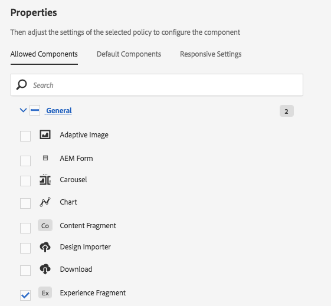
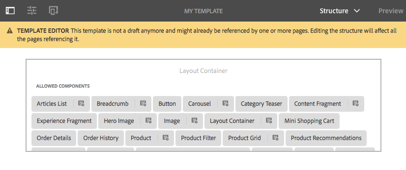

# Paginasjablonen maken{#creating-page-templates}

Wanneer u een pagina maakt, moet u een sjabloon selecteren die wordt gebruikt als basis voor het maken van de nieuwe pagina. De sjabloon definieert de structuur van de resulterende pagina, eventuele eerste inhoud en de componenten die kunnen worden gebruikt.

Met de **Sjablooneditor** is het creëren en onderhouden van sjablonen niet meer alleen een taak voor ontwikkelaars. Een hoofdgebruiker die ook **maker van sjablonen** wordt genoemd, kan ook worden betrokken. Ontwikkelaars zijn nog steeds nodig om de omgeving in te stellen, clientbibliotheken te maken en de te gebruiken componenten te maken, maar zodra deze basisbeginselen zijn ingesteld, kan de **maker van sjablonen** sjablonen maken en configureren zonder een ontwikkelingsproject.

De **Sjabloonconsole** stelt sjabloonauteurs in staat:

* Maak een sjabloon of kopieer een bestaande sjabloon.
* De levenscyclus van de sjabloon beheren.

De **Sjablooneditor** stelt sjabloonauteurs in staat:

* Voeg componenten aan het malplaatje toe en plaats hen op een ontvankelijk net.
* Configureer de componenten vooraf.
* Bepaal welke componenten op pagina&#39;s kunnen worden uitgegeven die met het malplaatje worden gecreeerd.

In dit document wordt uitgelegd hoe een **sjabloonauteur** Met de sjabloonconsole en -editor kunt u bewerkbare sjablonen maken en beheren.

Raadpleeg het document voor ontwikkelaars voor gedetailleerde informatie over hoe bewerkbare sjablonen op technisch niveau werken [Paginasjablonen - Bewerkbaar](/help/sites-developing/page-templates-editable.md) voor meer informatie .

>[!NOTE]
>
>De **sjablooneditor** biedt geen ondersteuning voor rechtstreekse targeting op het sjabloonniveau. Pagina&#39;s die zijn gemaakt op basis van een bewerkbare sjabloon kunnen worden geactiveerd, maar de sjablonen zelf kunnen dat niet.

>[!CAUTION]
>
>Met de **Sjabloonconsole** zijn niet bedoeld voor gebruik met de klassieke interface en dergelijk gebruik wordt niet ondersteund.

## Voordat u begint {#before-you-start}

>[!NOTE]
>
>Een beheerder moet een sjabloonmap configureren in het dialoogvenster **Configuratiebrowser** en pas de juiste machtigingen toe voordat een sjabloonauteur een sjabloon in die map kan maken.

De volgende punten zijn belangrijk om te overwegen alvorens u begint:

* Voor het maken van een sjabloon is samenwerking vereist. Daarom [Rol](#roles) wordt aangegeven voor elke taak.

* Afhankelijk van hoe uw instantie wordt gevormd, AEM nu verstrekt [twee basistypen sjabloon](/help/sites-authoring/templates.md#editable-and-static-templates). Dit heeft geen invloed op hoe je eigenlijk [een sjabloon gebruiken om een pagina te maken](#using-a-template-to-create-a-page), maar dit is van invloed op het type sjabloon dat u kunt maken en op de manier waarop een pagina betrekking heeft op de sjabloon.

### Rollen {#roles}

Een sjabloon maken met de opdracht **Sjabloonconsole** en de **Sjablooneditor** is samenwerking vereist tussen de volgende rollen:

* **Beheerder**:

   * Hiermee maakt u een nieuwe map voor sjablonen die u nodig hebt `admin` rechten.

   * Dergelijke taken kunnen vaak ook door een ontwikkelaar worden uitgevoerd

* **Ontwikkelaar**:

   * Concentraties op de technische/interne details
   * Heeft ervaring nodig met de ontwikkelomgeving.
   * Verstrekt de malplaatjeauteur van noodzakelijke informatie.

* **Sjabloonauteur**:

   * Dit is een specifieke auteur die lid is van de groep `template-authors`

      * Hiermee worden de vereiste rechten en machtigingen toegewezen.

   * Kan het gebruik van componenten en andere details op hoog niveau configureren die het volgende vereisen:

      * Enkele technische kennis

         * Gebruik bijvoorbeeld patronen bij het definiëren van paden.

      * Technische informatie van de ontwikkelaar.

Vanwege de aard van sommige taken, zoals het maken van een map, is een ontwikkelomgeving nodig. Hiervoor is kennis en ervaring vereist.

De in dit document beschreven taken worden weergegeven met de rol die verantwoordelijk is voor de uitvoering ervan.

### Bewerkbare en statische sjablonen {#editable-and-static-templates}

AEM biedt nu twee basistypen sjablonen:

* [Bewerkbare sjablonen](/help/sites-authoring/templates.md#creatingandmanagingnewtemplates)

   * Kan [gemaakt](#creatinganewtemplate) en [bewerkt](#editingatemplate) door sjabloonauteurs die de **Sjabloon** console en editor. De **Sjabloon** de console is toegankelijk in **Algemeen** van de **Gereedschappen** console.

   * Nadat de nieuwe pagina is gemaakt, wordt een dynamische verbinding onderhouden tussen de pagina en de sjabloon. Dit betekent dat wijzigingen in de sjabloonstructuur en/of vergrendelde inhoud worden doorgevoerd op alle pagina&#39;s die met die sjabloon zijn gemaakt. Wijzigingen in de ontgrendelde (initiële) inhoud worden niet doorgevoerd.
   * Het inhoudsbeleid van het gebruik, dat u deze van de malplaatjeredacteur kunt bepalen, om de ontwerpeigenschappen voort te zetten. De ontwerpmodus in de pagina-editor wordt niet meer gebruikt voor bewerkbare sjablonen.

* Statische sjablonen

   * Statische sjablonen zijn beschikbaar voor verschillende versies van AEM.
   * Ze zijn [verstrekt door uw ontwikkelaars](/help/sites-developing/page-templates-static.md)en kunnen dus niet door auteurs worden gemaakt of bewerkt.
   * Er wordt gekopieerd om de nieuwe pagina te maken, maar er bestaat daarna geen dynamische verbinding (hoewel de sjabloonnaam ter informatie is geregistreerd).
   * Gebruiken [Ontwerpmodus](/help/sites-authoring/default-components-designmode.md) om ontwerpeigenschappen te behouden.
   * Omdat het uitgeven van statische malplaatjes de exclusieve taak van een ontwikkelaar is, zie het ontwikkelaarsdocument [Paginasjablonen - statisch](/help/sites-developing/page-templates-static.md) voor meer informatie .

De sjabloonconsole en sjablooneditor staan per definitie alleen het maken en bewerken van bewerkbare sjablonen toe. Daarom richt dit document zich uitsluitend op bewerkbare sjablonen.

### Een sjabloon gebruiken om een pagina te maken {#using-a-template-to-create-a-page}

Als u een sjabloon gebruikt naar [een pagina maken](/help/sites-authoring/managing-pages.md#creating-a-new-page) er is geen zichtbaar verschil en geen aanwijzing tussen statische en bewerkbare sjablonen. Voor de auteur van de pagina is het proces transparant.

## Sjablonen maken en beheren {#creating-and-managing-templates}

Bij het maken van een bewerkbare sjabloon:

* Gebruik de **Sjabloon** console. Dit is beschikbaar in het dialoogvenster **Algemeen** van de **Gereedschappen** console.

   * Of rechtstreeks bij: [https://localhost:4502/libs/wcm/core/content/sites/templates.html/conf](https://localhost:4502/libs/wcm/core/content/sites/templates.html/conf)

* Kan [een map maken voor de sjablonen](#creating-a-template-folder-admin) indien nodig
* [Een sjabloon maken](#creatinganewtemplateauthor), die aanvankelijk leeg is

* [Aanvullende eigenschappen definiëren](#definingtemplatepropertiesauthor) voor de template, indien nodig
* [De sjabloon bewerken](#editingtemplates) om de volgende waarden te definiëren:

   * [Structuur](#editingatemplatestructureauthor) - Vooraf gedefinieerde inhoud die niet kan worden gewijzigd op pagina&#39;s die met de sjabloon zijn gemaakt.
   * [Oorspronkelijke inhoud](#editing-a-template-initial-content-author) - Vooraf gedefinieerde inhoud die kan worden gewijzigd op pagina&#39;s die met de sjabloon zijn gemaakt.
   * [Layout](#editingatemplatelayoutauthor) - Voor een reeks apparaten.
   * [Stijlen](/help/sites-authoring/style-system.md) - Definieer de stijlen die met de sjabloon en de componenten ervan moeten worden gebruikt.

* [De sjabloon inschakelen](#enablingatemplateauthor) voor gebruik bij het maken van een pagina
* [De sjabloon toestaan](#allowing-a-template-author) voor de vereiste pagina of vertakking van uw website
* [De sjabloon publiceren](#publishingatemplateauthor) ter beschikking stellen van de publicatieomgeving

>[!NOTE]
>
>De **Toegestane sjablonen** zijn vaak vooraf gedefinieerd wanneer uw website voor het eerst wordt ingesteld.

>[!CAUTION]
>
>Voer nooit informatie in die u nodig hebt [geïnternationaliseerd](/help/sites-developing/i18n.md) in een sjabloon. Voor internaliseringsdoeleinden wordt de [lokalisatiefuncties van de Core Components](https://experienceleague.adobe.com/docs/experience-manager-core-components/using/get-started/localization.html) aanbevolen.

### Sjabloonmap maken - Beheer {#creating-a-template-folder-admin}

Een malplaatjeomslag zou voor uw project moeten worden gecreeerd om uw project-specifieke malplaatjes te houden. Dit is een beheertaak die in het document wordt beschreven [Paginasjablonen - Bewerkbaar](/help/sites-developing/page-templates-editable.md#template-folders).

### Een nieuwe sjabloon maken - Sjabloonauteur {#creating-a-new-template-template-author}

1. Open de **Sjabloonconsole** (via **Gereedschappen >** **Algemeen**) en navigeer naar de vereiste map.

   >[!NOTE]
   >
   >In een standaardinstelling AEM **globaal** bestaat al in de sjabloonconsole. Dit houdt standaardmalplaatjes vast en doet dienst als reserve als geen beleid en/of malplaatje-types in de huidige omslag worden gevonden.
   >
   >
   >Aanbevolen wordt een [sjabloonmap die voor uw project is gemaakt](/help/sites-developing/page-templates-editable.md#template-folders).

1. Selecteren **Maken**, gevolgd door **Sjabloon maken** om de wizard te openen.

1. Kies een **Sjabloontype** selecteert u vervolgens **Volgende**.

   >[!NOTE]
   >
   >Sjabloontypen zijn vooraf gedefinieerde sjabloonlay-outs en kunnen worden beschouwd als sjablonen voor een sjabloon. Deze worden vooraf bepaald door ontwikkelaars of de systeembeheerder. Meer informatie vindt u in het document voor ontwikkelaars [Paginasjablonen - Bewerkbaar](/help/sites-developing/page-templates-editable.md#template-type).

1. Voltooi de **Sjabloondetails**:

   * **Sjabloonnaam**
   * **Beschrijving**

1. Selecteer **Maken**. Er wordt een bevestiging weergegeven. Selecteer **Openen** om te beginnen [bewerken van de sjabloon](#editingatemplate) of **Gereed** om terug te keren naar de sjabloonconsole.

   >[!NOTE]
   >
   >Wanneer een nieuwe sjabloon wordt gemaakt, wordt deze gemarkeerd als **Concept** in de console, wijst dit erop dat het nog niet beschikbaar is om door paginaauteurs te gebruiken.

### Sjablooneigenschappen definiëren - Sjabloonauteur {#defining-template-properties-template-author}

Een sjabloon kan de volgende eigenschappen hebben:

* Afbeelding

   * Afbeelding die moet worden gebruikt als een [miniatuur van de sjabloon](/help/sites-authoring/templates.md#template-thumbnail-image) als hulpmiddel bij het selecteren, bijvoorbeeld in de wizard Pagina maken.

      * Kan uploaden
      * Kan worden gegenereerd op basis van de sjablooninhoud

* Titel

   * Een titel die wordt gebruikt voor de identificatie van de sjabloon, zoals in de **Pagina maken** wizard.

* Beschrijving

   * Een optionele beschrijving voor meer informatie over de sjabloon en het gebruik ervan, die bijvoorbeeld in de **Pagina maken** wizard.

De eigenschappen weergeven en/of bewerken:

1. In de **Sjabloonconsole** selecteert u de sjabloon.
1. Selecteer **Eigenschappen weergeven** op de werkbalk of kies Snelle opties om het dialoogvenster te openen.
1. U kunt nu de sjablooneigenschappen weergeven of bewerken.

>[!NOTE]
>
>Sjablonen zijn krachtige gereedschappen om de workflow voor het maken van pagina&#39;s te stroomlijnen. Te veel sjablonen kunnen de auteurs echter overweldigen en tot verwarring bij het maken van pagina&#39;s leiden. Een goede regel is om het aantal sjablonen onder de 100 te houden.
>
>Adobe raadt niet aan meer dan 1000 sjablonen te hebben vanwege mogelijke gevolgen voor de prestaties.

>[!NOTE]
>
>De status van een sjabloon (concept, ingeschakeld of uitgeschakeld) wordt aangegeven in de console.

#### Miniatuurafbeelding sjabloon {#template-thumbnail-image}

De sjabloonminiatuur definiëren:

1. Bewerk de sjablooneigenschappen.
1. Kies of u een miniatuur wilt uploaden of wilt dat deze wordt gegenereerd op basis van de sjablooninhoud.

   * Als u een miniatuur wilt uploaden, klikt u **Afbeelding uploaden**
   * Als u een miniatuur wilt genereren, klikt u op **Voorvertoning genereren**

1. Voor beide methoden wordt een voorbeeld van de miniatuur weergegeven.

   Als het niet bevredigend is, klikt u op **Wissen** om een andere afbeelding te uploaden of de miniatuur opnieuw te genereren.

1. Als u tevreden bent met de miniatuur, klikt u op **Opslaan en sluiten**.

### Een sjabloon inschakelen en toestaan - Sjabloonauteur {#enabling-and-allowing-a-template-template-author}

Als u een sjabloon wilt kunnen gebruiken bij het maken van een pagina, moet u:

* [De sjabloon inschakelen](#enablingatemplate) beschikbaar maken voor gebruik bij het maken van pagina&#39;s.
* [De sjabloon toestaan](#allowingatemplate) om de inhoudtakken te specificeren waar het malplaatje kan worden gebruikt.

#### Sjabloon inschakelen - Sjabloonauteur {#enabling-a-template-template-author}

Een sjabloon kan worden in- of uitgeschakeld, zodat deze beschikbaar of niet beschikbaar is in het dialoogvenster **Pagina maken** wizard.

>[!CAUTION]
>
>Zodra een malplaatje wordt toegelaten zal een waarschuwing worden getoond wanneer een malplaatjeauteur begint om het malplaatje verder bij te werken. Dit moet de gebruiker informeren dat naar de sjabloon kan worden verwezen, zodat wijzigingen van invloed kunnen zijn op de pagina&#39;s die naar de sjabloon verwijzen.

1. In de **Sjabloonconsole** selecteert u de sjabloon.
1. Selecteren **Inschakelen** of **Uitschakelen** op de werkbalk en nogmaals in het bevestigingsdialoogvenster.
1. U kunt nu uw sjabloon gebruiken wanneer [een pagina maken](/help/sites-authoring/managing-pages.md#creating-a-new-page), hoewel u waarschijnlijk [de sjabloon bewerken](#editingatemplate) volgens uw eigen vereisten.

>[!NOTE]
>
>De status van een sjabloon (concept, ingeschakeld of uitgeschakeld) wordt aangegeven in de console.

#### Een sjabloon toestaan - Auteur {#allowing-a-template-author}

Een sjabloon kan beschikbaar worden gesteld of niet beschikbaar zijn voor bepaalde paginasvertakkingen.

1. Open de [Pagina-eigenschappen](/help/sites-authoring/editing-page-properties.md) voor de hoofdpagina van de vertakking waar u het malplaatje beschikbaar wilt zijn.

1. Open de **Geavanceerd** tab.

1. Onder **Sjablooninstellingen** gebruiken **Veld toevoegen** om de paden naar uw sjabloon of sjablonen op te geven.

   Het pad kan expliciet zijn of patronen gebruiken. Bijvoorbeeld:

   `/conf/<your-folder>/settings/wcm/templates/.*`

   De volgorde van de paden is irrelevant, alle paden worden gescand en sjablonen worden opgehaald.

   >[!NOTE]
   >
   >Als de **Toegestane sjablonen** wordt leeg gelaten, wordt de structuur opgetrokken totdat een waarde/lijst wordt gevonden.
   >
   >
   >Zie [Beschikbaarheid sjabloon](/help/sites-developing/templates.md#template-availability) - de beginselen voor toegestane sjablonen blijven dezelfde.

1. Klikken **Opslaan** om de wijzigingen in de pagina-eigenschappen op te slaan.

>[!NOTE]
>
>Vaak zijn de toegestane sjablonen vooraf gedefinieerd voor uw gehele site wanneer deze wordt ingesteld.

### Een sjabloon publiceren - Sjabloonauteur {#publishing-a-template-template-author}

Aangezien het malplaatje van verwijzingen wordt voorzien wanneer een pagina wordt teruggegeven, moet het volledig gevormde malplaatje worden gepubliceerd zodat het op het publicatiemilieu beschikbaar is.

1. In de **Sjabloonconsole** selecteert u de sjabloon.
1. Selecteren **Publiceren** op de werkbalk om de wizard te openen.
1. Selecteer de **Inhoudsbeleid** samen te publiceren.

1. Selecteren **Publiceren** van de werkbalk om de handeling te voltooien.

## Sjablonen bewerken - Sjabloonauteurs {#editing-templates-template-authors}

Bij het maken of bewerken van een sjabloon zijn er verschillende aspecten die u kunt definiëren. Sjablonen bewerken is vergelijkbaar met het ontwerpen van pagina&#39;s.

De volgende aspecten van een sjabloon kunnen worden bewerkt:

* [Structuur](#editingatemplatestructure)

  Componenten die hier zijn toegevoegd, kunnen niet door de auteurs van de pagina worden verplaatst of verwijderd van de resulterende pagina&#39;s. Als u wilt dat auteurs van pagina&#39;s componenten aan resulterende pagina&#39;s kunnen toevoegen en verwijderen, dan moet u een paragraafsysteem aan het malplaatje toevoegen.

  Wanneer componenten zijn vergrendeld, kunt u inhoud toevoegen die niet kan worden bewerkt door auteurs van pagina&#39;s. U kunt componenten ontgrendelen zodat u ze kunt definiëren [Oorspronkelijke inhoud](#editingatemplateinitialcontent).

  >[!NOTE]
  >
  >In de structuurmodus kunnen componenten die het bovenliggende element van een niet-vergrendelde component zijn, niet worden verplaatst, geknipt of verwijderd.

* [Oorspronkelijke inhoud](#editingatemplateinitialcontent)

  Wanneer een component ontgrendeld is, kunt u de eerste inhoud definiëren die naar de resulterende pagina(&#39;s), gemaakt op basis van de sjabloon, wordt gekopieerd. Deze niet-vergrendelde componenten kunnen op de resulterende pagina(&#39;s) worden bewerkt.

  >[!NOTE]
  >
  >In **Oorspronkelijke inhoud** in de modus en op de resulterende pagina&#39;s kunnen alle ontgrendelde onderdelen met een toegankelijk bovenliggend element (dat wil zeggen onderdelen in een lay-outcontainer) worden verwijderd.

* [Layout](#editingatemplatelayout)

  Hier kunt u de sjabloonlay-out voor de vereiste apparaatindelingen vooraf definiëren. De modus **Lay-out** voor het ontwerpen van sjablonen heeft dezelfde functionaliteit als de modus [**Lay-out** voor het ontwerpen van pagina&#39;s](/help/sites-authoring/responsive-layout.md#defining-layouts-layout-mode).

* [Paginabeleid](#editingatemplatepagepolicies)

  Onder paginabeleid kunt u vooraf gedefinieerd paginabeleid verbinden met de pagina. Met dit paginabeleid worden de verschillende ontwerpconfiguraties gedefinieerd.

* [Stijlen](/help/sites-authoring/style-system.md)

  Met het Stijlsysteem kan een sjabloonauteur stijlklassen definiëren in het inhoudsbeleid van een component, zodat de auteur van de inhoud deze kan selecteren wanneer hij de component op een pagina bewerkt. Deze stijlen kunnen alternatieve visuele variaties van een component zijn, waardoor het flexibeler wordt.

  Zie de [documentatie over stijlsystemen](/help/sites-authoring/style-system.md) voor meer informatie .

De **Modus** in de werkbalk kunt u het juiste aspect van de sjabloon selecteren en bewerken:

* [Structuur](#editingatemplatestructure)
* [Oorspronkelijke inhoud](#editingatemplateinitialcontent)
* [Layout](#editingatemplatelayout)

Terwijl de **Paginabeleid** de optie **Pagina-informatie** menu laat u [Selecteer het vereiste paginabeleid](#editingatemplatepagepolicies):

>[!CAUTION]
>
>Als een auteur een sjabloon gaat bewerken die al is ingeschakeld, wordt een waarschuwing weergegeven. Dit moet de gebruiker informeren dat naar de sjabloon kan worden verwezen, zodat wijzigingen van invloed kunnen zijn op de pagina&#39;s die naar de sjabloon verwijzen.

### Een sjabloon bewerken - Structuur - Sjabloonauteur {#editing-a-template-structure-template-author}

In **Structuur** in deze modus definieert u componenten en inhoud voor de sjabloon en definieert u het beleid voor de sjabloon en de componenten ervan.

* Componenten die in de sjabloonstructuur zijn gedefinieerd, kunnen niet op een resulterende pagina worden verplaatst of uit resulterende pagina&#39;s worden verwijderd.
* Als u wilt dat auteurs van pagina&#39;s componenten kunnen toevoegen en verwijderen, voegt u een alineasysteem toe aan de sjabloon.
* Componenten kunnen worden ontgrendeld en opnieuw worden vergrendeld, zodat u ze kunt definiëren [initiële inhoud](#editingatemplateinitialcontent).

* Het ontwerpbeleid voor de componenten en pagina wordt gedefinieerd.

In **Structuur** modus van de sjablooneditor:

* **Componenten toevoegen**

  Er zijn verschillende manieren om componenten aan de sjabloon toe te voegen:

   * Van de **Componenten** in het zijpaneel.
   * Met de opdracht **Component invoegen** option (**+** (pictogram) beschikbaar op de toolbar van componenten reeds op het malplaatje of **Componenten hierheen slepen** doos.

   * Door een element te slepen (vanuit de **Activa** in het zijpaneel) rechtstreeks op de sjabloon om de juiste component in situ te genereren.

  Na toevoeging wordt elke component gemarkeerd met:

   * Een rand
   * Een markering waarmee het componenttype wordt weergegeven
   * Een markering die moet worden weergegeven wanneer de component is ontgrendeld

  >[!NOTE]
  >
  >Wanneer u een standaardcomponent voor de **Titel** aan de sjabloon toevoegt, zal het de **standaardtekststructuur** bevatten.
  >
  >
  >Als u dit wijzigt en uw eigen tekst toevoegt, wordt deze bijgewerkte tekst gebruikt wanneer een pagina wordt gemaakt op basis van de sjabloon.
  >
  >
  >Als u de standaardtekst (structuur) verlaat, wordt de titel standaard ingesteld op de naam van de volgende pagina.

  >[!NOTE]
  >
  >Hoewel niet identiek, heeft het toevoegen van componenten en activa aan een malplaatje vele gelijkenissen met gelijkaardige acties wanneer [pagina&#39;s ontwerpen](/help/sites-authoring/editing-content.md).

* **Componenthandelingen**

  Voer acties uit op de componenten nadat deze aan de sjabloon zijn toegevoegd. Elk afzonderlijk exemplaar heeft een toolbar die u tot de beschikbare acties toegang heeft, is de toolbar afhankelijk van het componenttype.

  

  Het kan ook afhankelijk zijn van acties zoals wanneer een beleid met de component is geassocieerd, dan wordt het pictogram van de ontwerpconfiguratie beschikbaar.

* **Bewerken en configureren**

  Met deze twee acties kunt u inhoud toevoegen aan uw componenten.

* **Rand om structuur aan te geven**

  Wanneer u werkt in **Structuur** een oranje rand geeft aan welke component momenteel is geselecteerd. Een stippellijn geeft ook de bovenliggende component aan.

  Bijvoorbeeld in de schermafbeelding onder de **Tekst** wordt geselecteerd, binnen een **Layout Container** (responsivegrid).

  

* **Beleid en eigenschappen (algemeen)**

  Met het inhoudsbeleid (of het ontwerpbeleid) worden de ontwerpeigenschappen van een component gedefinieerd. Bijvoorbeeld de beschikbare componenten of de minimum-/maximumafmetingen. Deze zijn van toepassing op de sjabloon (en op pagina&#39;s die met de sjabloon zijn gemaakt).

  Maak een inhoudsbeleid of selecteer een bestaand beleid voor een component. Hiermee kunt u de ontwerpdetails definiëren.

   

  Het configuratievenster is verdeeld in twee.

   * Links in het dialoogvenster onder **Beleid** kunt u een bestaand beleid selecteren of een bestaand beleid selecteren.
   * Rechts van het dialoogvenster onder **Eigenschappen** kunt u de eigenschappen instellen die specifiek zijn voor het componenttype.

  De beschikbare eigenschappen zijn afhankelijk van de geselecteerde component. Voor een tekstcomponent definiëren de eigenschappen bijvoorbeeld de kopieer- en plakopties, opmaakopties en alineastijl.

  ***Beleid***

  Met het inhoudsbeleid (of het ontwerpbeleid) worden de ontwerpeigenschappen van een component gedefinieerd. Bijvoorbeeld de beschikbare componenten of de minimum-/maximumafmetingen. Deze zijn van toepassing op de sjabloon (en op pagina&#39;s die met de sjabloon zijn gemaakt).

  Onder **Beleid** u kunt een bestaand beleid selecteren om op de component via drop-down toe te passen.

  

  Een nieuw beleid kan worden toegevoegd door de Add knoop naast te selecteren **Beleid selecteren** vervolgkeuzelijst. Vervolgens moet een nieuwe titel in het **Beleidstitel** veld.

  

  Het geselecteerde bestaande beleid in de **Beleid selecteren** vervolgkeuzelijst kan als een nieuw beleid worden gekopieerd met de knop Kopiëren naast de vervolgkeuzelijst. Vervolgens moet een nieuwe titel in het **Beleidstitel** veld. Standaard krijgt het gekopieerde beleid de naam **Kopie van X**, waarbij X de titel van het gekopieerde beleid is.

  

  Een beschrijving van het beleid is optioneel in het gedeelte **Beleidsomschrijving** veld.

  In de **Andere sjablonen gebruiken ook het geselecteerde beleid** kunt u gemakkelijk zien welke andere sjablonen het beleid gebruiken dat is geselecteerd in het dialoogvenster **Beleid selecteren** vervolgkeuzelijst.

  

  >[!NOTE]
  >
  >Als meerdere componenten van hetzelfde type als initiële inhoud worden toegevoegd, geldt hetzelfde beleid voor alle componenten. Dit weerspiegelt dezelfde beperking in [**Ontwerpmodus** voor statische sjablonen](/help/sites-authoring/default-components-designmode.md).

  ***Eigenschappen***

  Onder de **Eigenschappen** kunt u de instellingen van de component definiëren. De kop heeft twee tabbladen:

   * Hoofd
   * Functies

  *Hoofd*

  Op de **Hoofd** worden de belangrijkste instellingen van de component gedefinieerd.

  Voor een afbeeldingscomponent kunnen bijvoorbeeld de toegestane breedten worden gedefinieerd en kan het laden worden ingeschakeld.

  Als het plaatsen voor veelvoudige configuraties toestaat, klik **Toevoegen** om een andere configuratie toe te voegen.

  

  Om een configuratie te verwijderen, klik **Verwijderen** knoop die aan het recht van de configuratie wordt gevestigd.

  Als u een configuratie wilt verwijderen, klikt u op de knop** Verwijderen**.

  

  *Functies*

  De **Functies** kunt u extra functies van de component in- of uitschakelen.

  Voor een afbeeldingscomponent kunt u bijvoorbeeld de uitsnijdverhoudingen, de toegestane afbeeldingsoriëntaties en de vraag of uploads zijn toegestaan, definiëren.

  

  >[!CAUTION]
  >
  >Let op: in AEM snijdverhoudingen worden gedefinieerd als **hoogte/breedte**. Dit verschilt van de conventionele definitie van breedte/hoogte en wordt gedaan om oude compatibiliteitsredenen. Gebruikers die de pagina schrijven, zijn zich niet bewust van enig verschil, op voorwaarde dat u de **Naam** duidelijk aangezien dit is wat in UI wordt getoond.

  >[!NOTE]
  >
  >[Beleid voor inhoud voor componenten die de RTF-editor implementeren](/help/sites-administering/rich-text-editor.md#main-pars-header-206036638) kan slechts voor opties worden bepaald die door RTE door zijn montages UI ter beschikking worden gesteld.  

* **Beleid en eigenschappen (container met layout)**

  Het beleid en de eigenschappen van een lay-outcontainer zijn gelijkaardig aan het algemene gebruik, maar met sommige verschillen.

  >[!NOTE]
  >
  >Het vormen van een beleid is verplicht voor containercomponenten aangezien het u toelaat om componenten te bepalen die in de container beschikbaar zullen zijn.

  Het configuratievenster wordt verdeeld in twee delen, enkel zoals in het algemene gebruik van het venster.

  ***Beleid***

  Met het inhoudsbeleid (of het ontwerpbeleid) worden de ontwerpeigenschappen van een component gedefinieerd. Bijvoorbeeld de beschikbare componenten of de minimum-/maximumafmetingen. Deze zijn van toepassing op de sjabloon (en op pagina&#39;s die met de sjabloon zijn gemaakt).

  Onder **Beleid** u kunt een bestaand beleid selecteren om op de component via drop-down toe te passen. Deze functie werkt net als bij het algemene gebruik van het venster.

  ***Eigenschappen***

  Onder de **Eigenschappen** kunt u kiezen welke componenten beschikbaar zijn voor de lay-outcontainer en de instellingen definiëren. De kop heeft drie tabbladen:

   * Toegestane componenten
   * Standaardcomponenten
   * Instellingen voor responsie

  *Toegestane componenten*

  Op de **Toegestane componenten** -tab, definieert u welke componenten beschikbaar zijn voor de lay-outcontainer.

   * De componenten worden gegroepeerd op hun componentgroepen, die kunnen worden uitgevouwen en samengevouwen.
   * U kunt een hele groep selecteren door de naam van de groep te controleren. U kunt de selectie van alle groepen ongedaan maken door de selectie uit te schakelen.
   * Een min vertegenwoordigt minstens één maar niet alle punten in een groep worden geselecteerd.
   * Er is een zoekopdracht beschikbaar om naar een component op naam te filteren.
   * De tellingen die rechts van de naam van de componentengroep worden vermeld vertegenwoordigen het totale aantal geselecteerde componenten in die groepen ongeacht de filter.

  

  *Standaardcomponenten*

  Op de **Standaardcomponenten** , bepaalt u welke componenten automatisch aan bepaalde media types worden geassocieerd zodat wanneer een auteur activa van elementenbrowser sleept, AEM weet met welke component om het te associëren. Merk op dat slechts de componenten met dalingsstreken voor dergelijke configuratie beschikbaar zijn.

  Klikken **Toewijzing toevoegen** om een geheel nieuwe component en MIME typetoewijzing toe te voegen.

  Selecteer een component in de lijst en klik op **Tekst toevoegen** om een extra MIME-type toe te voegen aan een reeds toegewezen component. Klik op het pictogram **Verwijderen** om een MIME-type te verwijderen.

  

  *Instellingen voor responsie*

  Op de **Instellingen voor responsie** kunt u het aantal kolommen in het resulterende raster van de layoutcontainer configureren.

* **Componenten ontgrendelen/vergrendelen**

  U ontgrendelt/vergrendelt componenten om te bepalen of de inhoud beschikbaar is voor wijziging in **Oorspronkelijke inhoud** -modus.

  Wanneer een component is ontgrendeld:

   * Een open hangslotindicator wordt getoond in de grens.
   * De componentwerkbalk wordt dienovereenkomstig aangepast.
   * Alle inhoud die al is ingevoerd, wordt niet meer weergegeven in **Structuur** -modus.

      * Al ingevoerde inhoud wordt beschouwd als initiële inhoud en is alleen zichtbaar in **Oorspronkelijke inhoud** -modus.

   * De bovenliggende elementen van de ontgrendelde component kunnen niet worden verplaatst, geknipt of verwijderd.

  

  Dit omvat het ontgrendelen van containercomponenten zodat andere componenten kunnen worden toegevoegd, in de modus **Initiële content** of op de resulterende pagina&#39;s. Als u al componenten/inhoud aan de container hebt toegevoegd voordat u de container ontgrendelt, worden deze niet meer weergegeven wanneer u in **Structuur** , maar worden weergegeven in **Oorspronkelijke inhoud** -modus. In **Structuurmodus** wordt alleen de containercomponent zelf weergegeven met de lijst met **Toegestane componenten**.

  

  Om ruimte te besparen, groeit de lay-outcontainer niet om de lijst van toegestane componenten aan te passen. In plaats daarvan wordt de container een schuifbare lijst.

  De componenten die configureerbaar zijn, worden weergegeven met een pictogram **Beleid**, waarop kan worden getikt of geklikt om het beleid en de eigenschappen van die component te bewerken.

  

* **Verhouding tot bestaande pagina&#39;s**

  Als de structuur na het maken van op de sjabloon gebaseerde pagina&#39;s wordt bijgewerkt, worden de wijzigingen in de sjabloon doorgevoerd in deze pagina&#39;s. Er wordt een waarschuwing weergegeven op de werkbalk om u hieraan te herinneren, samen met bevestigingsdialoogvensters.

  

### Een sjabloon bewerken - Eerste inhoud - Auteur {#editing-a-template-initial-content-author}

**Oorspronkelijke inhoud** wordt gebruikt voor gedefinieerde inhoud die wordt weergegeven wanneer een pagina voor het eerst wordt gemaakt op basis van de sjabloon. De eerste inhoud kan vervolgens door auteurs van pagina&#39;s worden bewerkt.

Hoewel alle content die in de modus **Structuur** is gemaakt, zichtbaar is in **Initiële content**, kunnen alleen de ontgrendelde componenten worden geselecteerd en bewerkt.

>[!NOTE]
>
>**Oorspronkelijke inhoud** U kunt de bewerkingsmodus gebruiken voor pagina&#39;s die met die sjabloon zijn gemaakt. Daarom wordt het beleid niet gedefinieerd in **Oorspronkelijke inhoud** modus, maar eerder in [**Structuur** mode](/help/sites-authoring/templates.md#editing-a-template-structure-template-author).

* Ontgrendelde componenten die beschikbaar zijn voor bewerking, worden gemarkeerd. Als deze optie is geselecteerd, hebben ze een blauwe rand:

  

* Ontgrendelde componenten beschikken over een werkbalk waarmee u de inhoud kunt bewerken en configureren:

  

* Als een containercomponent is ontgrendeld (in de modus **Structuur**), kunt u nieuwe componenten aan de container toevoegen (in de modus **Initiële content**). Componenten die in de modus **Initiële content** zijn toegevoegd, kunnen worden verplaatst naar of verwijderd uit de resulterende pagina&#39;s.

  U kunt een component toevoegen met behulp van het gebied **Componenten hierheen slepen** of de optie **Nieuwe component invoegen** op de werkbalk van de betreffende container.

   

* Als de initiële inhoud van de sjabloon wordt bijgewerkt nadat pagina&#39;s zijn gemaakt op basis van de sjabloon, worden deze pagina&#39;s niet beïnvloed door wijzigingen in de oorspronkelijke inhoud van de sjabloon.

>[!NOTE]
>
>De eerste inhoud is bedoeld voor het voorbereiden van componenten en de paginalay-out die als uitgangspunt dienen voor het maken van de inhoud. Het is niet de bedoeling om de inhoud te zijn die ongewijzigd blijft. Daarom kan de initiële inhoud niet worden vertaald.
>
>Als u vertaalbare tekst in uw sjabloon wilt opnemen, bijvoorbeeld in kop- of voetteksten, kunt u de opdracht [lokalisatiefuncties van de kerncomponenten](https://experienceleague.adobe.com/docs/experience-manager-core-components/using/get-started/localization.html).

### Een sjabloon bewerken - Layout - Sjabloonauteur {#editing-a-template-layout-template-author}

U kunt de sjabloonlay-out voor een reeks apparaten definiëren. [Responsieve indeling](/help/sites-authoring/responsive-layout.md) voor sjablonen werkt op dezelfde manier als voor het ontwerpen van pagina&#39;s.

>[!NOTE]
>
>Wijzigingen in de lay-out worden weergegeven in **Oorspronkelijke inhoud** , maar er zijn geen wijzigingen in **Structuur** -modus.

### Een sjabloon bewerken - Paginaontwerp - Sjabloonauteur/ontwikkelaar {#editing-a-template-page-design-template-author-developer}

Het paginaontwerp, inclusief de vereiste clientbibliotheken en de paginabeleidsregels, blijft behouden onder de optie **Paginaontwerp** van het menu **Pagina-informatie**.

Als u toegang wilt krijgen tot **Paginaontwerp** dialoogvenster:

1. Van de **Sjablooneditor**, selecteert u **Pagina-informatie** vanaf de werkbalk, dan **Paginaontwerp** het dialoogvenster openen.
1. De **Paginaontwerp** wordt geopend en is verdeeld in twee gedeelten:

   * De linkerhelft definieert de [paginabeleid](/help/sites-authoring/templates.md#page-policies)
   * De rechterhelft definieert de [pagina-eigenschappen](/help/sites-authoring/templates.md#page-properties)

   

#### Paginabeleid {#page-policies}

U kunt een inhoudsbeleid toepassen op de sjabloon of de resulterende pagina&#39;s. Hiermee wordt het inhoudsbeleid voor het hoofdalineasysteem op de pagina gedefinieerd.

* U kunt een bestaand beleid voor de pagina selecteren in het menu **Beleid selecteren** vervolgkeuzelijst.

  

  Een nieuw beleid kan worden toegevoegd door de Add knoop naast te selecteren **Beleid selecteren** vervolgkeuzelijst. Vervolgens moet een nieuwe titel in het **Beleidstitel** veld.

  

  Het geselecteerde bestaande beleid in de **Beleid selecteren** vervolgkeuzelijst kan als een nieuw beleid worden gekopieerd met de knop Kopiëren naast de vervolgkeuzelijst. Vervolgens moet een nieuwe titel in het **Beleidstitel** veld. Standaard krijgt het gekopieerde beleid de naam **Kopie van X**, waarbij X de titel van het gekopieerde beleid is.

  

* Definieer een titel voor het beleid in het dialoogvenster **Beleidstitel** veld. Een beleid moet een titel hebben zodat het gemakkelijk kan worden geselecteerd in het **Beleid selecteren** vervolgkeuzelijst.

  

* Een beschrijving van het beleid is optioneel in het gedeelte **Beleidsomschrijving** veld.
* In de **Andere sjablonen gebruiken ook het geselecteerde beleid** kunt u gemakkelijk zien welke andere sjablonen het beleid gebruiken dat is geselecteerd in het dialoogvenster **Beleid selecteren** vervolgkeuzelijst.

  

#### Pagina-eigenschappen {#page-properties}

Met pagina-eigenschappen kunt u de vereiste clientbibliotheken definiëren met de **Paginaontwerp** in. Deze client-side bibliotheken bevatten stijlpagina&#39;s en javascript die met de sjabloon moeten worden geladen en pagina&#39;s die met die sjabloon zijn gemaakt.

* Geef de clientbibliotheken op die u wilt toepassen op pagina&#39;s die met deze sjabloon zijn gemaakt. De naam van een bibliotheek invoeren in het tekstveld in het dialoogvenster **Client Side Libraries** sectie.

  

* Als er meerdere bibliotheken nodig zijn, klikt u op de knop Toevoegen om een extra tekstveld voor de naam van de bibliotheek toe te voegen.

  

  Voeg zoveel tekstvelden toe als nodig zijn voor uw clientbibliotheken.

  

* Definieer zo nodig de relatieve positie van de bibliotheken door de velden te slepen met de sleepgreep.

  

>[!NOTE]
>
>Hoewel de sjabloonauteur het paginabeleid voor de sjabloon kan opgeven, moet hij of zij details van de desbetreffende client-side bibliotheken van de ontwikkelaar ophalen.

### Een sjabloon bewerken - Initiële pagina-eigenschappen - Auteur {#editing-a-template-initial-page-properties-author}

Met de **Oorspronkelijke pagina-eigenschappen** kunt u het eerste [pagina-eigenschappen](/help/sites-authoring/editing-page-properties.md) te gebruiken bij het maken van resulterende pagina&#39;s.

1. Selecteer in de sjablooneditor de optie **Pagina-informatie** vanaf de werkbalk, dan **Oorspronkelijke pagina-eigenschappen** het dialoogvenster openen.

1. In het dialoogvenster kunt u de eigenschappen definiëren die u wilt toepassen op pagina&#39;s die met deze sjabloon zijn gemaakt.

   

1. Bevestig uw definities met **Gereed**.

## Aanbevolen procedures {#best-practices}

Houd bij het maken van sjablonen rekening met:

1. Het effect van wijzigingen in de sjabloon wanneer pagina&#39;s zijn gemaakt op basis van die sjabloon.

   Hier volgt een lijst met de verschillende bewerkingen die mogelijk zijn op sjablonen, samen met de manier waarop deze van invloed zijn op de pagina&#39;s die er vanaf worden gemaakt:

   * Wijzigingen in de structuur:

      * Deze worden direct toegepast op de resulterende pagina&#39;s.
      * Bezoekers moeten de wijzigingen nog steeds kunnen zien door de gewijzigde sjabloon te publiceren.

   * Wijzigingen in inhoudsbeleid en ontwerpconfiguraties:

      * Deze zijn direct van toepassing op de resulterende pagina&#39;s.
      * De wijzigingen moeten worden gepubliceerd zodat bezoekers de wijzigingen kunnen zien.

   * Wijzigingen in de oorspronkelijke inhoud:

      * Deze zijn alleen van toepassing op pagina&#39;s die na de wijzigingen in de sjabloon worden gemaakt.

   * Wijzigingen in de layout zijn afhankelijk van of de gewijzigde component deel uitmaakt van:

      * Alleen structuur - onmiddellijk toegepast
      * Bevat initiële inhoud - alleen op pagina&#39;s die na de wijziging zijn gemaakt

   Wees extra voorzichtig als:

   * Componenten op ingeschakelde sjablonen vergrendelen of ontgrendelen.
   * Dit kan bijwerkingen hebben, aangezien bestaande pagina&#39;s het reeds kunnen gebruiken. Doorgaans:

      * Ontgrendelingscomponenten (die vergrendeld waren) ontbreken op bestaande pagina&#39;s.
      * Door componenten te vergrendelen (die bewerkbaar waren) wordt die inhoud niet op de pagina&#39;s weergegeven.

   >[!NOTE]
   >
   >AEM geeft expliciete waarschuwingen wanneer het veranderen van de slotstatus van componenten op malplaatjes die niet meer concepten zijn.

1. [Uw eigen mappen maken](#creatingatemplatefolderdeveloper) voor uw sitespecifieke sjablonen.
1. [Uw sjablonen publiceren](#publishingatemplateauthor) van de **Sjablonen** console.
