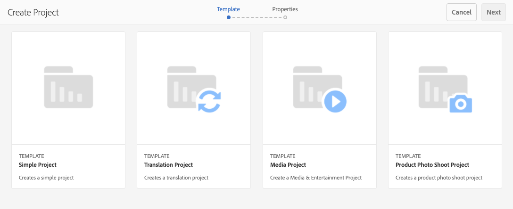
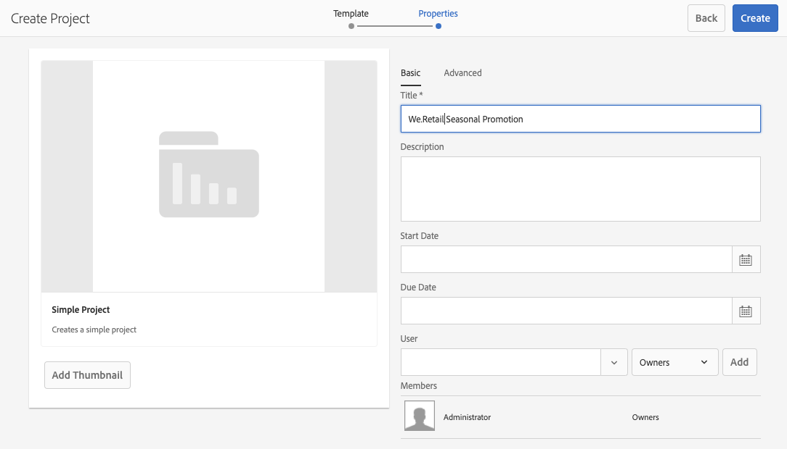
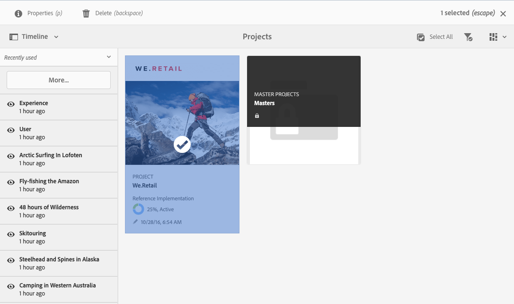

# Projecten beheren {#managing-projects}

In de **console van Projecten**, hebt u toegang tot en beheert uw projecten.

Gebruikend de console, kunt u een project tot stand brengen, middelen met uw project associëren, en ook een project of middelverbindingen schrappen.

## Toegangsvereisten {#access-requirements}

Projecteert een standaard AEM en vereist geen extra opstelling.

Gebruikers in projecten kunnen echter andere gebruikers/groepen zien terwijl ze projecten gebruiken, zoals bij het maken van projecten, het maken van taken/workflows of het weergeven en beheren van het team, als deze gebruikers leestoegang moeten hebben op `/home/users` en `/home/groups` .

De gemakkelijkste manier om dit te doen is de **project-gebruikers** groep te geven leest toegang tot `/home/users` en `/home/groups`.

## Een project maken {#creating-a-project}

Voer de volgende stappen uit om een project te maken.

1. In de **console van Projecten**, leidt de klik **tot** om **te openen tot de tovenaar van het Project**.
1. Selecteer een malplaatje en klik **daarna**. U kunt meer over de standaardprojectmalplaatjes [&#x200B; hier leren.](/help/sites-authoring/projects.md#project-templates)

   

1. Bepaal de **Titel** en **Beschrijving** en voeg het beeld van de a **Duimnagel** indien nodig toe. U kunt ook gebruikers toevoegen of verwijderen en tot welke groep zij behoren.

   

1. Klik **creëren**. De bevestiging vraagt of wilt u uw nieuw project openen of aan de console terugkeren.

De procedure voor het creëren van een project is het zelfde voor alle projectmalplaatjes. Het verschil tussen de types van projecten heeft op beschikbare [&#x200B; gebruikersrollen &#x200B;](/help/sites-authoring/projects.md) en [&#x200B; werkschema&#39;s betrekking.](/help/sites-authoring/projects-with-workflows.md)

### Bronnen koppelen aan uw project {#associating-resources-with-your-project}

Met projecten kunt u resources groeperen in één entiteit om deze als geheel te beheren. Daarom moet u middelen aan uw project associëren. Deze middelen worden gegroepeerd binnen het project als **Tegels**. De soorten middelen u kunt toevoegen worden beschreven in [&#x200B; Tegels van het Project &#x200B;](/help/sites-authoring/projects.md#project-tiles).

Om middelen met uw project te associëren:

1. Open uw project van de **Projecten** console.
1. Klik **toevoegen Tegel** en selecteer de tegel die u aan uw project wilt verbinden. U kunt meerdere typen tegels selecteren.

    toe

1. Klik **creëren**. Uw bron is gekoppeld aan uw project en vanaf nu hebt u toegang tot deze bron vanuit uw project.

### Items toevoegen aan een tegel {#adding-items-to-a-tile}

In sommige tegels wilt u mogelijk meerdere items toevoegen. U kunt bijvoorbeeld meer dan één workflow tegelijk uitvoeren of meer dan één ervaring.

Items toevoegen aan een tegel:

1. In **Projecten**, navigeer aan het project en klik het naar beneden kantelpictogram bij het hoogste recht van de tegel u een punt aan wilt toevoegen en de aangewezen optie selecteren.

   * De optie is afhankelijk van het type tegel. Bijvoorbeeld, kan het **Taak** voor de **tegel van Taken** of **Werkschema van het Begin** voor de **werkschema&#39;s** tegel zijn.

   

1. Voeg het item aan de tegel toe zoals u dat zou doen bij het maken van een tegel. De tegels van het project worden beschreven [&#x200B; hier.](/help/sites-authoring/projects.md#project-tiles)

## Projectinformatie weergeven {#viewing-project-info}

Het hoofddoel van de projecten is de bijbehorende informatie op één plaats te groeperen om deze toegankelijker en actiever te maken. U kunt deze gegevens op verschillende manieren openen.

### Een tegel openen {#opening-a-tile}

Mogelijk wilt u zien welke items zijn opgenomen in een huidige tegel, of wilt u items wijzigen of verwijderen in de tegel.

Een tegel openen zodat u items kunt weergeven of wijzigen:

1. Klik op het pictogram met ovalen rechtsonder in de tegel.

   

1. AEM opent de console voor de types van punten verbonden aan de tegel en filters die op het geselecteerde project worden gebaseerd.

   

### Een projecttijdlijn weergeven {#viewing-a-project-timeline}

De projecttijdlijn biedt informatie over wanneer de elementen in het project het laatst zijn gebruikt. Voer de volgende stappen uit om de projecttijdlijn weer te geven.

1. In de **console van Projecten**, klik **Chronologie** in de spoorselecteur bij top-left van de console.
   
2. In de console selecteer het project waarvoor u wenst om zijn chronologie te bekijken.
   

Assets wordt in de trein weergegeven. Gebruik de spoorkiezer om terug te keren naar de normale weergave wanneer u klaar bent.

### Inactieve projecten weergeven {#viewing-active-inactive-projects}

Om tussen uw actieve en [&#x200B; inactieve projecten van een knevel te voorzien, &#x200B;](#making-projects-inactive-or-active) in de **console van Projecten**, klik het **&#x200B;**&#x200B;pictogram van de Wisselen Actieve Projecten &lbrace;in de toolbar.

Door gebrek toont de console actieve projecten. Klik het **pictogram van de Projecten van de knevel Actieve** eens om aan het bekijken van inactieve projecten over te schakelen. Klik opnieuw het om op actieve projecten terug te schakelen.

## Projecten organiseren {#organizing-projects}

Er zijn verscheidene opties beschikbaar helpen uw projecten organiseren om de **te houden console handelbare Projecten**.

### Projectmappen {#project-folders}

U kunt omslagen in de **console van Projecten** tot stand brengen om gelijkaardige projecten te groeperen en te organiseren.

1. In de **Projecten** console klikt **creeer** en dan **creeer Omslag**.

   

1. Geef uw omslag een titel en klik **creeer**.

1. De map wordt toegevoegd aan de console.

U kunt nu projecten in de map maken. U kunt meerdere mappen maken en ook mappen nesten.

### Projecten activeren {#making-projects-inactive-or-active}

U kunt een project willen inactief merken als het wordt voltooid maar u wilt nog de informatie over het project houden. [&#x200B; Inactieve projecten tonen nu &#x200B;](#viewing-active-inactive-projects) door gebrek in de **Projecten** console.

Voer de volgende stappen uit om een project inactief te maken.

1. Open het **venster van de Eigenschappen van het Project** van het project.
   * U kunt dit van de console doen door het project of van binnen het project via de **Info van het Project** tegel te selecteren.
1. In het **venster van de Eigenschappen van het 0&rbrace; Project {, verander de** 3} schuif van de Status van het Project &lbrace;van **Actieve** aan **Inactief**.**&#x200B;**

   

1. Klik **sparen &amp; Sluiten** om uw veranderingen te bewaren.

### Projecten verwijderen {#deleting-a-project}

Voer de volgende stappen uit om een project te verwijderen.

1. Navigeer aan het top-level van de **console van Projecten**.
1. Het selecteren van uw project in de console.
1. Klik **Schrapping** in de toolbar.
1. AEM kan bijbehorende projectgegevens verwijderen/wijzigen bij het verwijderen van een project. Selecteer welke opties u in de **dialoog van het Project van de Schrapping** nodig hebt.
   * Projectgroepen en -rollen verwijderen
   * Project Assets-map verwijderen
   * Projectworkflows beëindigen

   
1. Klik **Schrapping** om het project met de geselecteerde opties te schrappen.

Om meer over groepen te leren die automatisch door projecten worden gecreeerd zie [&#x200B; Automatische creatie van de Groep &#x200B;](/help/sites-authoring/projects.md#auto-group-creation) voor details.
