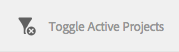

# Projecten beheren{#managing-projects}

Met projecten kunt u uw project ordenen door bronnen in één entiteit te groeperen.

In de **Projecten** console, hebt u toegang tot en voert actie op uw projecten:

In Projecten, kunt u een project tot stand brengen, middelen met uw project associëren, en ook een project of verbindingen van het Middel schrappen. U kunt een tegel openen om de inhoud van de tegel weer te geven en items aan een tegel toe te voegen. In dit onderwerp worden deze procedures beschreven.

>[!NOTE]
>
>6.2 introduceerde de capaciteit om Projecten in omslagen te organiseren. Voor de pagina van Projecten, hebt u de capaciteit om een project of een omslag tot stand te brengen.
>
>Als er een map wordt gemaakt, gaat de gebruiker naar die map waar hij of zij een andere map of een project kan maken. Het helpt om projecten in omslagen te organiseren die op categorieën zoals productcampagnes, plaats, vertaaltalen, etc. worden gebaseerd.
>
>De projecten en omslagen kunnen in een lijstmening worden bekeken en ook worden gezocht.

>[!CAUTION]
>
>Voor gebruikers in projecten om andere gebruikers/groepen te zien terwijl het gebruiken van de functionaliteit van Projecten zoals het creëren van projecten, het creëren van taken/werkschema&#39;s, het zien van en het leiden van het team, die gebruikers moeten lees toegang op **/home/users** en **/home/groups** hebben. De eenvoudigste manier om dit te implementeren is om de groep **projects-users** lees toegang te geven tot **/home/users** en **/home/groups**.

## Een project {#creating-a-project} maken

Uit de doos, verstrekt AEM deze malplaatjes om van te kiezen wanneer u een project creeert:

* Eenvoudig project
* Mediaproject
* Fotoproject van product
* Omzettingsproject

De procedure om een project tot stand te brengen is voor alle projecten hetzelfde. Het verschil tussen de soorten projecten omvat beschikbare [gebruikersrollen](/help/sites-authoring/projects.md) en [workflows](/help/sites-authoring/projects-with-workflows.md).  Een nieuw project maken:

1. Tik of klik in **Projecten** op **Maken** om de wizard **Project maken** te openen:
1. Selecteer een sjabloon. Eenvoudig project, mediaproject, [Omzettingsproject](/help/sites-administering/tc-manage.md) en [Product Fotoopname product](/help/sites-authoring/managing-product-information.md) zijn beschikbaar en klik op **Volgende**.

   

1. Definieer de **Titel** en **Beschrijving** en voeg een **Miniatuur** afbeelding toe, indien nodig. U kunt ook gebruikers toevoegen of verwijderen en tot welke groep zij behoren. Klik bovendien op **Geavanceerd** om een naam toe te voegen die wordt gebruikt in de URL.

   

1. Tik/klik **Maken**. De bevestiging vraagt of wilt u uw nieuw project openen of aan de console terugkeren.

### Middelen koppelen aan uw project {#associating-resources-with-your-project}

Aangezien de projecten u toelaten om middelen in één entiteit te groeperen, wilt u middelen aan uw project associëren. Deze bronnen worden **Tegels** genoemd. De typen bronnen die u kunt toevoegen, worden beschreven in [Projecttegels](/help/sites-authoring/projects.md#project-tiles).

Bronnen aan uw project koppelen:

1. Open uw project van de **console Projecten**.
1. Tik/klik **Tegel toevoegen** en selecteer de tegel die u aan uw project wilt verbinden. U kunt meerdere typen tegels selecteren.

   

   >[!NOTE]
   >
   >De tegels van het project die met een project kunnen worden geassocieerd worden beschreven in [de tegels van het Project.](/help/sites-authoring/projects.md#project-tiles)

1. Tik/klik **Maken**. Uw bron is gekoppeld aan uw project en vanaf nu hebt u toegang tot deze bron vanuit uw project.

### Een project- of bronnenkoppeling {#deleting-a-project-or-resource-link} verwijderen

De zelfde methode wordt gebruikt om een project van de console of een verbonden middel van uw project te schrappen:

1. Navigeer naar de juiste locatie:

   * Om een project te schrappen ga naar het hoogste niveau van **Projecten** console.
   * Om een middelverbinding binnen een project te schrappen, open uw project in **Projecten** console.

1. Ga selectiemodus door **Select** te klikken en uw project of middelverbinding te selecteren.
1. Tik/klik **Verwijderen**.

1. U moet de verwijdering bevestigen in een dialoogvenster. Indien bevestigd, wordt het project of de middelverbinding geschrapt. Tik/klik **Deselecteer** om de selectiemodus af te sluiten.

>[!NOTE]
>
>Wanneer u het project creëert en gebruikers aan de verschillende rollen toevoegt, worden de groepen die aan het project gekoppeld zijn, automatisch gecreëerd om bijbehorende machtigingen te beheren. Bijvoorbeeld: een project met de naam Mijn project zou drie groepen hebben: **Mijn projecteigenaars**, **Mijn projecteditors**, **Mijn projectwaarnemers**. Als het project echter wordt verwijderd, worden deze groepen niet automatisch verwijderd. Een beheerder moet de groepen handmatig verwijderen in **Gereedschappen** > **Beveiliging** > **Groepen**.

### Items toevoegen aan een tegel {#adding-items-to-a-tile}

In sommige tegels wilt u mogelijk meerdere items toevoegen. U kunt bijvoorbeeld meer dan één workflow tegelijk uitvoeren of meer dan één ervaring.

Items toevoegen aan een tegel:

1. In **Projecten**, navigeer aan het project en klik Add + pictogram op de tegel u een punt aan wilt toevoegen.

   

1. Voeg een item aan de tegel toe zoals u dat zou doen bij het maken van een nieuwe tegel. Projectelementen worden [hier](/help/sites-authoring/projects.md#project-tiles) beschreven. In dit voorbeeld is een andere workflow toegevoegd.

   

### Een tegel openen {#opening-a-tile}

Mogelijk wilt u zien welke items zijn opgenomen in een huidige tegel, of wilt u items wijzigen of verwijderen in de tegel.

Een tegel openen zodat u items kunt weergeven of wijzigen:

1. Tik in de projectenconsole op de ovalen (...) of klik op deze.

   

1. AEM geeft de items in die tegel weer. U kunt de selectiemodus activeren om de items te wijzigen of te verwijderen.

   

## Projectstatistieken {#viewing-project-statistics} weergeven

Om projectstatistieken, in **Projecten** console te bekijken, klik **toon de Mening van Statistieken**. Het voltooiingsniveau voor elk project wordt weergegeven. Klik **Statistische weergave tonen** opnieuw om naar de **Projecten** console te gaan.

### Een projecttijdlijn bekijken {#viewing-a-project-timeline}

De projecttijdlijn biedt informatie over wanneer de elementen in het project het laatst zijn gebruikt. Als u de projecttijdlijn wilt weergeven, klikt of tikt u op **Tijdlijn**, gaat u naar de selectiemodus en selecteert u het project. Elementen worden weergegeven in het linkervenster. Klik/tik **Chronologie** om aan **Projecten** console terug te keren.

### Actieve/Inactieve projecten weergeven {#viewing-active-inactive-projects}

Om tussen uw actieve en inactieve projecten, in **Projecten** console van een knevel te voorzien, klik **Actieve Projecten** in-/uitschakelen. Als naast het pictogram een vinkje staat, worden de actieve projecten weergegeven.

Als het pictogram een x naast heeft, toont het de inactieve projecten.

## Projecten inactief of actief {#making-projects-inactive-or-active} maken

U kunt een project willen inactief maken als u het hebt voltooid maar u wilt nog de informatie over het project houden.

Een project inactief (of actief) maken:

1. In **Projecten** console, open uw project en vind dan de **Tile van de Informatie van het Project**.

   >[!NOTE]
   Mogelijk moet u deze tegel toevoegen als deze nog niet in uw project staat. Zie [Tegels toevoegen](#adding-items-to-a-tile).

1. Tik/klik **Bewerken**.
1. Wijzig de kiezer van **Active** in **Inactief** (of vice versa).

   

1. Tik/klik **Done** om uw wijzigingen op te slaan.

