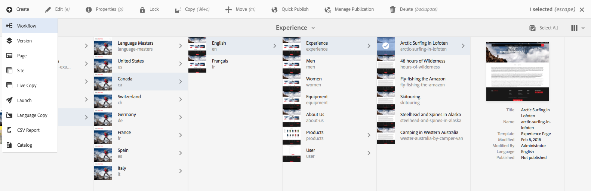

# Workflows toepassen op pagina&#39;s{#applying-workflows-to-pages}

Tijdens het ontwerpen kunt u workflows aanroepen om actie te ondernemen op uw pagina&#39;s. Het is ook mogelijk om meerdere workflows toe te passen.

Wanneer u de workflow toepast, geeft u de volgende informatie op:

* De workflow die moet worden toegepast.
U kunt elke workflow toepassen (waartoe u toegang hebt, zoals is toegewezen door uw AEM-beheerder).
* Naar keuze, een titel die helpt de werkschemainstantie in Inbox van een gebruiker identificeren.
* De nuttige werkstroom. Dit kunnen een of meer pagina&#39;s zijn.

Workflows kunnen worden gestart vanaf:

* [ de console van Plaatsen ](#starting-a-workflow-from-the-sites-console).
* [ wanneer het uitgeven van een pagina, van de Informatie van de Pagina ](#starting-a-workflow-from-the-page-editor).

>[!NOTE]
>
>Zie ook:
>
>* [ hoe te om werkschema&#39;s op activa toe te passen DAM ](/help/assets/assets-workflow.md).
>* [ Werkend met de Werkschema&#39;s van het Project ](/help/sites-authoring/projects-with-workflows.md).
>

>[!NOTE]
>
>AEM de beheerders kunnen [ werkschema&#39;s beginnen gebruikend verscheidene andere methodes ](/help/sites-administering/workflows-starting.md).

## Een workflow starten vanuit de siteconsole {#starting-a-workflow-from-the-sites-console}

U kunt een workflow starten vanuit:

* [ creeer optie van de toolbar van Plaatsen ](#starting-a-workflow-from-the-sites-toolbar).
* [ de spoorstaaf van de Chronologie van de console van Plaatsen ](#starting-a-workflow-from-the-timeline).

In beide gevallen moet u:

* [ specificeer de Details van het Werkschema in de Create Tovenaar van het Werkschema ](#specifying-workflow-details-in-the-create-workflow-wizard).

### Een workflow starten op de werkbalk Sites {#starting-a-workflow-from-the-sites-toolbar}

U kunt een werkschema van de toolbar van de **console van Plaatsen** beginnen:

1. Navigeer naar de gewenste pagina en selecteer deze.

1. Van **creeer** optie in de toolbar u **Werkschema** kunt nu selecteren.

   

1. **creeer de tovenaar van het Werkschema** u [ zal helpen de werkschemadetails ](#specifying-workflow-details-in-the-create-workflow-wizard) specificeren.

### Een workflow starten vanuit de tijdlijn {#starting-a-workflow-from-the-timeline}

Van de **Chronologie** kunt u een werkschema beginnen dat op uw geselecteerde middel moet worden toegepast.

1. [ selecteer het middel ](/help/sites-authoring/basic-handling.md#viewingandselectingyourresources) en open [ Chronologie ](/help/sites-authoring/basic-handling.md#timeline) (of open Chronologie en selecteer dan het middel).
1. De pijlpunt door het commentaargebied kan worden gebruikt om **Werkschema van het Begin** te openbaren:

   

1. **creeer de tovenaar van het Werkschema** u [ zal helpen de werkschemadetails ](#specifying-workflow-details-in-the-create-workflow-wizard) specificeren.

### Workflowdetails opgeven in de wizard Workflow maken {#specifying-workflow-details-in-the-create-workflow-wizard}

**creeer de tovenaar van het Werkschema** u zal helpen het werkschema selecteren en de vereiste details specificeren.

Na het openen van **creeer de tovenaar van het Werkschema** van of:

* [ creeer optie van de toolbar van Plaatsen ](#starting-a-workflow-from-the-sites-toolbar).
* [ de spoorstaaf van de Chronologie van de console van Plaatsen ](#starting-a-workflow-from-the-timeline).

U kunt details specificeren:

1. In de **stap van Eigenschappen**, worden de basisopties van het werkschema bepaald:

   * **model van het Werkschema**
   * **titel van het Werkschema**

      * U kunt een titel voor dit exemplaar specificeren, om u te helpen het in een later stadium identificeren.

   Afhankelijk van het workflowmodel zijn ook de volgende opties beschikbaar. Hierdoor kan het pakket dat als lading is gemaakt, worden bewaard nadat de workflow is voltooid.

   * **houd werkschemapakket**
   * **Titel van het Pakket**

      * U kunt een titel voor het pakket opgeven om het te identificeren.

   >[!NOTE]
   >
   >De **optie van het het werkschemapakket van het houden** is beschikbaar wanneer het werkschema voor [ de Multi Steun van het Middel ](/help/sites-developing/workflows-models.md#configuring-a-workflow-for-multi-resource-support) is gevormd en de veelvoudige middelen zijn geselecteerd.

   Wanneer volledig, gebruik **daarna** om te werk te gaan.

   

1. In de **stap van het Bereik** kunt u selecteren:

   * **voeg Inhoud** toe om [ wegbrowser ](/help/sites-authoring/author-environment-tools.md#path-browser) te openen en extra middelen te selecteren; wanneer in browser, **Uitgezochte** klik om de inhoud aan de werkschemainstantie toe te voegen.

   * Een bestaande bron voor het weergeven van extra handelingen:

      * **omvat kinderen** om te specificeren dat de kinderen van dat middel in het werkschema zullen worden omvat.
Er wordt een dialoogvenster geopend waarin u de selectie kunt verfijnen op basis van:

         * Alleen directe kinderen opnemen.
         * Alleen gewijzigde pagina&#39;s opnemen.
         * Alleen al gepubliceerde pagina&#39;s opnemen.

        Alle opgegeven onderliggende items worden toegevoegd aan de lijst met bronnen waarop de workflow van toepassing is.

      * **verwijder Selectie** om dat middel uit het werkschema te verwijderen.

   

   >[!NOTE]
   >
   >Als u aanvullende resources toevoegt, kunt u **Terug** gebruiken om de instelling voor **Workflowpakket behouden** aan te passen in de stap **Eigenschappen**.

1. Het gebruik **creeert** om de tovenaar te sluiten en de werkschemainstantie tot stand te brengen. Een bericht wordt getoond in de console van Plaatsen.

## Een workflow starten vanuit de Pagina-editor {#starting-a-workflow-from-the-page-editor}

Wanneer het uitgeven van een pagina kunt u **Informatie van de Pagina** van de toolbar selecteren. Het drop-down menu heeft het optie **Begin in Werkschema**. Hiermee wordt een dialoogvenster geopend waarin u de vereiste workflow kunt opgeven, zo nodig met een titel:

