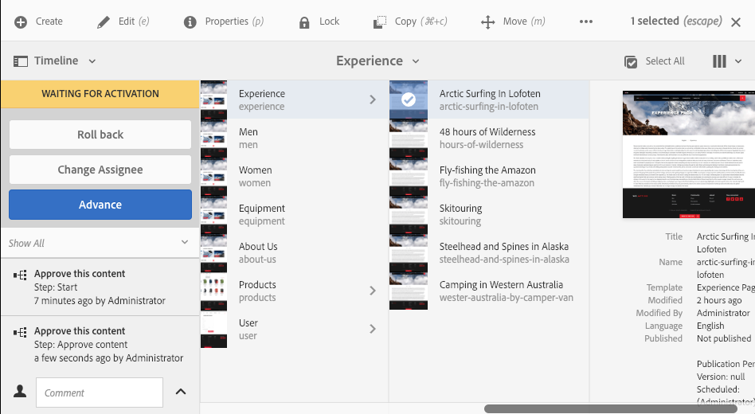
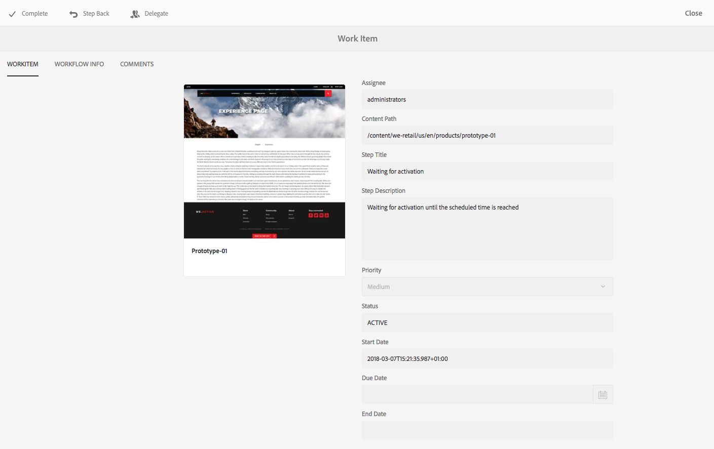

# Deelnemen aan workflows{#participating-in-workflows}

Workflows bevatten doorgaans stappen die vereisen dat een persoon een activiteit op een pagina of element uitvoert. De werkstroom selecteert een gebruiker of groep om de activiteit uit te voeren en wijst een het werkpunt aan die persoon of groep toe. De gebruiker ontvangt een melding en kan vervolgens de juiste actie ondernemen:

* [Meldingen weergeven](#notifications-of-available-workflow-actions)
* [Een deelnemersstap voltooien](#completing-a-participant-step)
* [Een deelnemersstap delegeren](#delegating-a-participant-step)
* [Stap terug op een Stap van de Deelnemer uitvoeren](#performing-step-back-on-a-participant-step)
* [Open een workflowitem om details weer te geven (en om handelingen uit te voeren)](#opening-a-workflow-item-to-view-details-and-take-actions)
* [Bekijk de Werkstroom Payload (Meerdere Middelen)](#viewing-the-workflow-payload-multiple-resources)

## Meldingen van beschikbare workflowacties {#notifications-of-available-workflow-actions}

Wanneer u een werkitem wordt toegewezen (bijvoorbeeld **Inhoud goedkeuren**), worden verschillende waarschuwingen en/of meldingen weergegeven:

* Uw [melding](/help/sites-authoring/inbox.md) indicator (werkbalk) wordt verhoogd:

  

* Het object wordt aangeboden in je bericht [Inbox](/help/sites-authoring/inbox.md):

  

* Wanneer u de pagina-editor gebruikt, wordt de statusbalk weergegeven:

   * De naam van de workflow(en) die op de pagina wordt toegepast, bijvoorbeeld Verzoek om activering.
   * Alle handelingen die beschikbaar zijn voor de huidige gebruiker voor de huidige stap van de workflow, bijvoorbeeld Voltooid, Delegeren, Details weergeven.
   * Het aantal werkstromen dat op de pagina van toepassing is. U kunt:

      * Gebruik de pijlen links/rechts om door de statusinformatie van de verschillende workflows te navigeren.
      * Klik op het daadwerkelijke aantal om een drop-down lijst van alle toepasselijke werkschema&#39;s te openen, dan selecteer het werkschema u in de statusbar wilt tonen.

  

  >[!NOTE]
  >
  >De statusbalk is alleen zichtbaar voor gebruikers met workflowbevoegdheden, bijvoorbeeld leden van de klasse `workflow-users` groep.
  >
  >
  >Handelingen worden weergegeven wanneer de huidige gebruiker rechtstreeks betrokken is bij de huidige stap van de workflow.

* Wanneer **Tijdlijn** is open voor het middel, wordt de werkschemastap getoond. Wanneer u op de waakzame banner klikt, zullen de beschikbare acties ook worden getoond:

  

### Een deelnemersstap voltooien {#completing-a-participant-step}

U kunt een item voltooien zodat de workflow naar de volgende stap kan gaan.

Op deze actie kunt u aangeven:

* **Volgende stap**: de volgende stap die moet worden uitgevoerd; u kunt een keuze maken in een opgegeven lijst
* **Opmerking** indien nodig:

U kunt een deelnemersstap uitvoeren vanuit:

* [Inbox](#completing-a-participant-step-inbox)
* [De Pagina-editor](#completing-a-participant-step-page-editor)
* [Tijdlijn](#completing-a-participant-step-timeline)
* wanneer [een workflowitem openen om details weer te geven](#opening-a-workflow-item-to-view-details-and-take-actions).

#### Een deelnemersstap voltooien - Postvak IN {#completing-a-participant-step-inbox}

Voer de volgende procedure uit om het werkitem te voltooien:

1. Open de **[AEM Inbox](/help/sites-authoring/inbox.md)**.
1. Selecteer het werkstroomitem waarop u actie wilt uitvoeren (klik op de miniatuur).
1. Selecteren **Voltooid** op de werkbalk.
1. De **Voltooid het werkitem** wordt geopend. Selecteer de **Volgende stap** van de drop-down selecteur en voeg toe **Opmerking** indien nodig.
1. Gebruiken **OK** om de stap te voltooien (of **Annuleren** om de handeling af te breken).

#### Een stap voor een deelnemer voltooien - Pagina-editor {#completing-a-participant-step-page-editor}

Voer de volgende procedure uit om het werkitem te voltooien:

1. Open de [pagina voor bewerken](/help/sites-authoring/managing-pages.md#opening-a-page-for-editing).
1. Selecteren **Voltooid** in de statusbalk boven in het scherm.
1. De **Voltooid het werkitem** wordt geopend. Selecteer de **Volgende stap** van de drop-down selecteur en voeg toe **Opmerking** indien nodig.
1. Gebruiken **OK** om de stap te voltooien (of **Annuleren** om de handeling af te breken).

#### Een stap voor een deelnemer voltooien - tijdlijn {#completing-a-participant-step-timeline}

U kunt ook de tijdlijn gebruiken om een stap te voltooien en uit te voeren:

1. Selecteer de gewenste pagina en open **Tijdlijn** (of open **Tijdlijn** en selecteer de pagina):

   

1. Klik op de waarschuwingsbanner om beschikbare acties weer te geven. Selecteren **Vooruitgang**:

   

1. Afhankelijk van de workflow kunt u de volgende stap selecteren:

   

1. Selecteren **Vooruitgang** om de actie te bevestigen.

### Een deelnemersstap delegeren {#delegating-a-participant-step}

Als een stap aan u is toegewezen, maar om het even welke reden u geen actie kunt ondernemen, kunt u de stap aan een andere gebruiker of een groep delegeren.

De gebruikers die voor delegatie beschikbaar zijn hangen af van wie het het werkpunt werd toegewezen:

* Als het het werkpunt aan een groep werd toegewezen, zijn de groepsleden beschikbaar.
* Als het het werkpunt aan een groep werd toegewezen en dan aan een gebruiker werd afgevaardigd, zijn de groepsleden en de groep beschikbaar.
* Als het het werkpunt aan één enkele gebruiker werd toegewezen, kan het het werkpunt niet worden afgevaardigd.

Op deze actie kunt u aangeven:

* **Gebruiker**: de gebruiker u aan wilt delegeren; u kunt uit een verstrekte lijst selecteren
* **Opmerking** indien nodig:

U kunt een deelnemersstap delegeren vanuit:

* [Inbox](#delegating-a-participant-step-inbox)
* [De Pagina-editor](#delegating-a-participant-step-page-editor)
* [Tijdlijn](#delegating-a-participant-step-timeline)
* wanneer [een workflowitem openen om details weer te geven](#opening-a-workflow-item-to-view-details-and-take-actions).

#### Een deelnemersstap delegeren - Postvak IN {#delegating-a-participant-step-inbox}

Gebruik de volgende procedure om een het werkpunt te delegeren:

1. Open de **[AEM Inbox](/help/sites-authoring/inbox.md)**.
1. Selecteer het werkstroomitem waarop u actie wilt uitvoeren (klik op de miniatuur).
1. Selecteren **Delegeren** op de werkbalk.
1. Het dialoogvenster wordt geopend. Geef de **Gebruiker** in de keuzelijst (dit kan ook een groep zijn) en voeg een **Opmerking** indien nodig.
1. Gebruiken **OK** om de stap te voltooien (of **Annuleren** om de handeling af te breken).

#### Een deelnemersstap delegeren - Pagina-editor {#delegating-a-participant-step-page-editor}

Gebruik de volgende procedure om een het werkpunt te delegeren:

1. Open de [pagina voor bewerken](/help/sites-authoring/managing-pages.md#opening-a-page-for-editing).
1. Selecteren **Delegeren** in de statusbalk boven in het scherm.
1. Het dialoogvenster wordt geopend. Geef de **Gebruiker** in de keuzelijst (dit kan ook een groep zijn) en voeg een **Opmerking** indien nodig.
1. Gebruiken **OK** om de stap te voltooien (of **Annuleren** om de handeling af te breken).

#### Een deelnemersstap delegeren - tijdlijn {#delegating-a-participant-step-timeline}

U kunt de tijdlijn ook gebruiken om een stap te delegeren en/of toe te wijzen:

1. Selecteer de gewenste pagina en open **Tijdlijn** (of open **Tijdlijn** en selecteert u de pagina).
1. Klik op de waarschuwingsbanner om beschikbare acties weer te geven. Selecteren **Toewijzing wijzigen**:

   

1. Geef een nieuwe ontvanger op:

   

1. Selecteren **Toewijzen** om de actie te bevestigen.

### Stap terug op een Stap van de Deelnemer uitvoeren {#performing-step-back-on-a-participant-step}

Als u ontdekt dat een stap, of een reeks stappen, moet worden herhaald kunt u achteruit stappen. Hiermee kunt u een stap selecteren die eerder in de workflow is opgetreden voor opwerking. De werkstroom keert aan de stap terug u specificeert, dan gaat van daar te werk.

Op deze actie kunt u aangeven:

* **Vorige stap**: de stap waarnaar u wilt terugkeren; u kunt een keuze maken in een opgegeven lijst
* **Opmerking** indien nodig:

U kunt stap terug op een deelnemersstap van één van beiden uitvoeren:

* [Inbox](#performing-step-back-on-a-participant-step-inbox)
* [De Pagina-editor](#performing-step-back-on-a-participant-step-page-editor)
* [Tijdlijn](#performing-step-back-on-a-participant-step-timeline)
* wanneer [een workflowitem openen om details weer te geven](#opening-a-workflow-item-to-view-details-and-take-actions).

#### Het uitvoeren van Stap terug op een Stap van de Deelnemer - Inbox {#performing-step-back-on-a-participant-step-inbox}

Gebruik de volgende procedure om terug te gaan:

1. Open de **[AEM Inbox](/help/sites-authoring/inbox.md)**.
1. Selecteer het werkstroomitem waarop u actie wilt uitvoeren (klik op de miniatuur).
1. Selecteren **Stap terug** het dialoogvenster openen.

1. Geef de **Vorige stap** en voeg een **Opmerking** indien nodig.
1. Gebruiken **OK** om de stap te voltooien (of **Annuleren** om de handeling af te breken).

#### Stap terug uitvoeren op een Stap van de Deelnemer - de Redacteur van de Pagina {#performing-step-back-on-a-participant-step-page-editor}

Gebruik de volgende procedure om terug te gaan:

1. Open de [pagina voor bewerken](/help/sites-authoring/managing-pages.md#opening-a-page-for-editing).
1. Selecteren **Stap terug** in de statusbalk boven in het scherm.
1. Geef de **Vorige stap** en voeg een **Opmerking** indien nodig.
1. Gebruiken **OK** om de stap te voltooien (of **Annuleren** om de handeling af te breken).

#### Stap terug uitvoeren op een Stap van de Deelnemer - Chronologie {#performing-step-back-on-a-participant-step-timeline}

U kunt de tijdlijn ook gebruiken om terug te gaan (stap) naar een vorige stap:

1. Selecteer de gewenste pagina en open **Tijdlijn** (of open **Tijdlijn** en selecteert u de pagina).
1. Klik op de waarschuwingsbanner om beschikbare acties weer te geven. Selecteren **Terugdraaien**:

   

1. Geef de stap op waarnaar de workflow moet terugkeren:

   

1. Selecteren **Terugdraaien** om de actie te bevestigen.

### Een workflowitem openen om details weer te geven (en handelingen uit te voeren) {#opening-a-workflow-item-to-view-details-and-take-actions}

Bekijk details van het werkstroomonderdeel en voer de juiste handelingen uit.

De workflowdetails worden weergegeven op tabbladen en de juiste acties zijn beschikbaar op de werkbalk:

* **WORKITEM** tab:

  

* **WORKFLOW-INFO** tab:

  

  Indien [Werkstroomfasen](/help/sites-developing/workflows.md#workflow-stages) zijn geconfigureerd voor het model, kunt u de voortgang als volgt bekijken:

  

* **OPMERKINGEN** tab:

  

U kunt de details van het werkitem openen vanuit:

* [Inbox](#performing-step-back-on-a-participant-step-inbox)
* [De Pagina-editor](#performing-step-back-on-a-participant-step-page-editor)

#### Workflow Details openen - Postvak IN {#opening-workflow-details-inbox}

U opent als volgt een workflowitem en bekijkt de details:

1. Open de **[AEM Inbox](/help/sites-authoring/inbox.md)**.
1. Selecteer het werkstroomitem waarop u actie wilt uitvoeren (klik op de miniatuur).
1. Selecteren **Openen** om de informatietabbladen te openen.

1. Selecteer zo nodig de gewenste actie, geef details en bevestig deze met **OK** (of **Annuleren**).
1. Gebruiken **Opslaan** of **Annuleren** om af te sluiten.

#### Workflow Details openen - Pagina-editor {#opening-workflow-details-page-editor}

U opent als volgt een workflowitem en bekijkt de details:

1. Open de [pagina voor bewerken](/help/sites-authoring/managing-pages.md#opening-a-page-for-editing).
1. Selecteren **Details weergeven** van de statusbar om de informatielusjes te openen.

1. Selecteer zo nodig de gewenste actie, geef details en bevestig deze met **OK** (of **Annuleren**).
1. Gebruiken **Opslaan** of **Annuleren** om af te sluiten.

### Het bekijken van de Payload van het Werkschema (Veelvoudige Middelen) {#viewing-the-workflow-payload-multiple-resources}

U kunt details van de lading bekijken verbonden aan de werkschemainstantie. In eerste instantie worden de bronnen in het pakket weergegeven, waarna u de afzonderlijke pagina&#39;s kunt weergeven.

Om de lading, en middelen, van de werkschemainstantie te bekijken:

1. Open de **[AEM Inbox](/help/sites-authoring/inbox.md)**.
1. Selecteer het werkstroomitem waarop u actie wilt uitvoeren (klik op de miniatuur).
1. Selecteren **Payload weergeven** op de werkbalk om het dialoogvenster te openen.

   Aangezien een workflowpakket slechts een verzameling aanwijzers naar paden in de repository is, kunt u de items hier toevoegen/verwijderen/wijzigen om aan te passen wat er in het workflowpakket naar wordt verwezen. Gebruik de **Brondefinitie** toe te voegen.

   

1. U kunt de koppelingen gebruiken om de afzonderlijke pagina&#39;s te openen.
